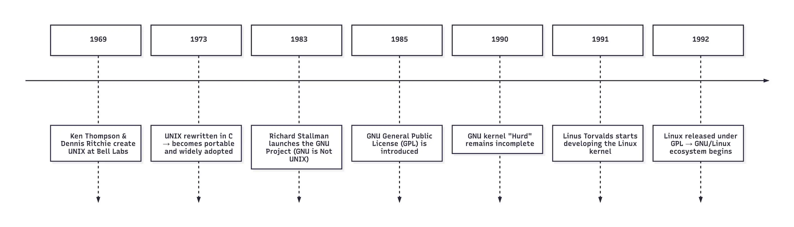
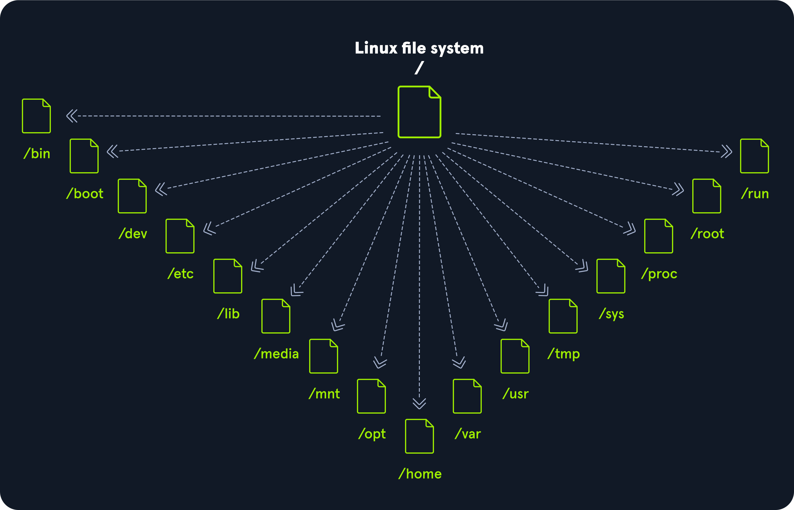
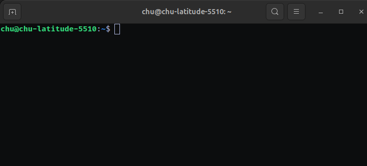
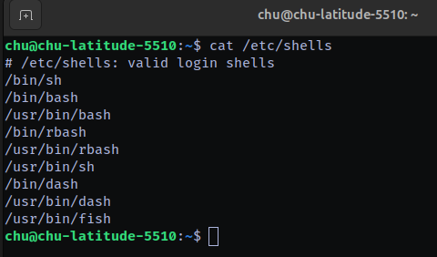
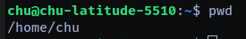

# Linux Fundamentals

>   Bắt đầu hành trình tìm hiểu những điều cơ bản của Linux. Học cách chạy một số lệnh thiết yếu đầu tiên trên thiết bị đầu cuối tương tác.

## Mục Lục

1. [Tổng quan về Linux](#1-tổng-quan-về-linux)

2. [Cấu trúc và kiến trúc hệ điều hành Linux](#2-cấu-trúc-và-kiến-trúc-hệ-điều-hành-linux)

3. [Terminal, Shell và dòng lệnh](#3-terminal-shell-và-dòng-lệnh)

4. [Làm quen với các lệnh Linux cơ bản](#4-làm-quen-với-các-lệnh-linux-cơ-bản)

5. [Tìm kiếm trợ giúp trong Linux](#5-tìm-kiếm-trợ-giúp-trong-linux)

6. [Điều hướng trong hệ thống tệp](#6-điều-hướng-trong-hệ-thống-tệp)

7. [Làm việc với tệp và thư mục](#7-làm-việc-với-tệp-và-thư-mục)

8. [Xem và chỉnh sửa nội dung tệp](#8-xem-và-chỉnh-sửa-nội-dung-tệp)

9. [ Tìm kiếm tệp và thư mục](#9-tìm-kiếm-tệp-và-thư-mục)


## Nội dung

# 1: Tổng quan về Linux
## 1.1. Linux là gì?

Linux là một hệ điều hành mã nguồn mở, được sử dụng để quản lý tài nguyên phần cứng và tạo môi trường cho các chương trình phần mềm hoạt động. Về vai trò, Linux tương tự như các hệ điều hành quen thuộc khác như Windows, macOS, Android hoặc iOS. Hệ điều hành chịu trách nhiệm quản lý CPU, bộ nhớ, thiết bị lưu trữ, thiết bị ngoại vi, tiến trình và quá trình giao tiếp giữa phần mềm với phần cứng.

Thành phần trung tâm của Linux là **Linux kernel**, hay còn gọi là nhân Linux. Kernel là phần lõi của hệ điều hành, đóng vai trò trung gian giữa phần cứng và phần mềm. Nó kiểm soát việc phân bổ tài nguyên hệ thống, quản lý thiết bị, xử lý tiến trình và đảm bảo các chương trình có thể hoạt động ổn định trên máy tính. Tuy nhiên, Linux kernel chỉ là một phần của hệ điều hành hoàn chỉnh. Khi kernel được kết hợp với các công cụ hệ thống, thư viện, trình quản lý gói, ứng dụng và giao diện người dùng, nó tạo thành một bản phân phối Linux, còn gọi là **Linux distribution** hoặc **Linux distro**. 

Một điểm quan trọng của Linux là tính **mã nguồn mở**. Điều này có nghĩa là mã nguồn của hệ thống có thể được xem, nghiên cứu, chỉnh sửa và phân phối lại bởi cộng đồng hoặc các tổ chức. Nhờ đặc điểm này, Linux có khả năng tùy biến cao, phù hợp với nhiều mục đích sử dụng khác nhau, từ máy tính cá nhân, máy chủ, thiết bị nhúng, điện toán đám mây cho đến các hệ thống phục vụ an toàn thông tin.

Linux hiện nay được sử dụng rất rộng rãi trong lĩnh vực công nghệ thông tin. Trên máy chủ, Linux được đánh giá cao nhờ tính ổn định, hiệu năng tốt và khả năng vận hành lâu dài. Trong lĩnh vực an toàn thông tin, Linux cũng đóng vai trò quan trọng vì nhiều công cụ bảo mật, giám sát, kiểm thử xâm nhập và phân tích hệ thống được phát triển hoặc triển khai trên nền tảng Linux. Một số bản phân phối phổ biến có thể kể đến như Ubuntu, Debian, Fedora, Linux Mint, Arch Linux, Red Hat Enterprise Linux, Kali Linux và Parrot OS.

Tóm lại, Linux không chỉ là một hệ điều hành đơn lẻ mà là một hệ sinh thái mã nguồn mở rộng lớn. Nó bao gồm nhân Linux, các công cụ hệ thống và nhiều bản phân phối khác nhau, phục vụ cho nhiều nhóm người dùng và mục đích sử dụng khác nhau. Với ưu điểm về tính ổn định, bảo mật, linh hoạt và khả năng tùy biến, Linux đã trở thành một nền tảng quan trọng trong quản trị hệ thống, phát triển phần mềm, điện toán đám mây và an toàn thông tin.

## 1.2. Lịch sử hình thành Linux

Để hiểu Linux ra đời như thế nào, cần quay lại năm 1969, khi Ken Thompson và Dennis Ritchie tại phòng thí nghiệm Bell Labs phát triển hệ điều hành UNIX. Sau đó, UNIX được viết lại bằng ngôn ngữ lập trình C, điều này giúp hệ điều hành trở nên dễ chuyển đổi sang nhiều loại máy tính khác nhau và được sử dụng rộng rãi hơn.

Sau hơn một thập kỷ, Richard Stallman khởi xướng dự án GNU. Mục tiêu của GNU là xây dựng một hệ điều hành giống UNIX nhưng hoàn toàn tự do và mã nguồn mở. Dự án GNU đã tạo ra nhiều thành phần quan trọng, bao gồm các công cụ hệ thống và giấy phép GNU General Public License — GPL. Tuy nhiên, kernel riêng của GNU có tên là Hurd chưa hoàn thiện đúng thời điểm.

Đến năm 1991, một sinh viên người Phần Lan tên là Linus Torvalds bắt đầu phát triển một kernel mới như một dự án cá nhân. Kernel này sau đó được gọi là Linux kernel. Sự xuất hiện của Linux kernel đã bổ sung phần còn thiếu cho hệ thống GNU. Khi kết hợp các công cụ GNU với Linux kernel, một hệ điều hành mã nguồn mở hoàn chỉnh đã ra đời. Đây là cột mốc quan trọng trong lịch sử phát triển của Linux.m việc cá nhân và hợp tác, thúc đẩy các nguyên tắc như đơn giản, minh bạch và hợp tác để đạt được mục tiêu chung.


## 1.3. Triết lý thiết kế của Linux


Triết lý của Linux tập trung vào sự đơn giản, tính mô-đun và tính mở. Nó khuyến khích việc xây dựng các chương trình nhỏ, chuyên biệt để thực hiện một nhiệm vụ duy nhất một cách tốt nhất. Các chương trình này có thể được kết hợp theo nhiều cách để thực hiện các thao tác phức tạp, thúc đẩy hiệu quả và tính linh hoạt. Linux tuân theo năm nguyên tắc cốt lõi sau:

| Nguyên tắc                                                                                                                          | Mô tả                                                                                                                                                               |
| ----------------------------------------------------------------------------------------------------------------------------------- | ------------------------------------------------------------------------------------------------------------------------------------------------------------------- |
| **Everything is a file** (Mọi thứ đều là tệp)                                                                                       | Tất cả các tệp cấu hình cho các dịch vụ khác nhau đang chạy trên hệ điều hành Linux đều được lưu trữ trong một hoặc nhiều tệp văn bản.                              |
| **Small, single-purpose programs** (Chương trình nhỏ, chuyên biệt)                                                                  | Linux cung cấp nhiều công cụ khác nhau mà chúng ta sẽ làm việc cùng, có thể kết hợp để hoạt động chung.                                                             |
| **Ability to chain programs together to perform complex tasks** (Khả năng liên kết các chương trình để thực hiện nhiệm vụ phức tạp) | Việc tích hợp và kết hợp các công cụ khác nhau cho phép chúng ta thực hiện nhiều nhiệm vụ lớn và phức tạp, chẳng hạn như xử lý hoặc lọc các kết quả dữ liệu cụ thể. |
| **Avoid captive user interfaces** (Tránh giao diện người dùng bị giới hạn)                                                          | Linux được thiết kế để chủ yếu làm việc với shell (hoặc terminal), giúp người dùng kiểm soát hệ điều hành tốt hơn.                                                  |
| **Configuration data stored in a text file** (Dữ liệu cấu hình được lưu trong tệp văn bản)                                          | Ví dụ về một tệp như vậy là tệp `/etc/passwd`, lưu trữ tất cả người dùng đã được đăng ký trên hệ thống.           

# 2. Cấu trúc và kiến trúc hệ điều hành Linux
## 2.1. Các thành phần chính của Linux

| Thành phần          | Mô tả                                                                                                                                                                                                                                                                                              |
| ------------------- | -------------------------------------------------------------------------------------------------------------------------------------------------------------------------------------------------------------------------------------------------------------------------------------------------- |
| **Bootloader**      | Một đoạn mã hướng dẫn quá trình khởi động để bắt đầu hệ điều hành. Parrot Linux sử dụng GRUB Bootloader.                                                                                                                                                                                           |
| **OS Kernel**       | Kernel là thành phần chính của hệ điều hành. Nó quản lý tài nguyên cho các thiết bị I/O của hệ thống ở cấp phần cứng.                                                                                                                                                                              |
| **Daemons**         | Các dịch vụ nền được gọi là “daemon” trong Linux. Mục đích của chúng là đảm bảo các chức năng chính như lập lịch, in ấn và đa phương tiện hoạt động đúng cách. Các chương trình nhỏ này được tải sau khi khởi động hoặc đăng nhập vào máy tính.                                                    |
| **OS Shell**        | Trình shell của hệ điều hành hoặc bộ thông dịch ngôn ngữ lệnh (còn gọi là dòng lệnh) là giao diện giữa hệ điều hành và người dùng. Giao diện này cho phép người dùng yêu cầu hệ điều hành thực hiện các tác vụ. Các shell thường dùng gồm Bash, Tcsh/Csh, Ksh, Zsh và Fish.                        |
| **Graphics server** | Cung cấp hệ thống con đồ họa (gọi là “X” hoặc “X-server”) cho phép các chương trình đồ họa chạy cục bộ hoặc từ xa trên hệ thống X-window.                                                                                                                                                          |
| **Window Manager**  | Còn được gọi là giao diện người dùng đồ họa (GUI). Có nhiều tùy chọn như GNOME, KDE, MATE, Unity và Cinnamon. Môi trường desktop thường bao gồm nhiều ứng dụng, như trình duyệt tệp và trình duyệt web, cho phép người dùng truy cập và quản lý các tính năng, dịch vụ cần thiết của hệ điều hành. |
| **Utilities**       | Ứng dụng hoặc tiện ích là các chương trình thực hiện các chức năng cụ thể cho người dùng hoặc cho chương trình khác.                                                                                                                                                                              
## 2.2. Kiến trúc Linux

Hệ điều hành Linux có thể được chia thành các lớp:

| Lớp                | Mô tả                                                                                                                                                                                                                                                   |
| ------------------ | ------------------------------------------------------------------------------------------------------------------------------------------------------------------------------------------------------------------------------------------------------- |
| **Hardware**       | Các thiết bị ngoại vi như RAM hệ thống, ổ cứng, CPU và các thành phần khác.                                                                                                                                                                             |
| **Kernel**         | Lõi của hệ điều hành Linux, có chức năng ảo hóa và kiểm soát tài nguyên phần cứng như CPU, bộ nhớ được phân bổ, dữ liệu được truy cập… Kernel cung cấp tài nguyên ảo cho mỗi tiến trình và ngăn ngừa/giảm thiểu xung đột giữa các tiến trình khác nhau. |
| **Shell**          | Giao diện dòng lệnh (CLI), còn gọi là shell, cho phép người dùng nhập lệnh để thực thi các chức năng của kernel.                                                                                                                                        |
| **System Utility** | Cung cấp cho người dùng quyền truy cập vào tất cả các chức năng của hệ điều hành.                                                                                                                                                                       |

## 2.3. Cấu trúc hệ thống tệp

Hệ điều hành Linux được tổ chức theo dạng cây phân cấp và được ghi lại trong tiêu chuẩn **Filesystem Hierarchy Standard (FHS)**.
Linux được cấu trúc với các thư mục cấp cao tiêu chuẩn sau:



| **Đường dẫn** | **Mô tả**                                                                                                                                                                                                                                                                                                          |
| ------------- | ------------------------------------------------------------------------------------------------------------------------------------------------------------------------------------------------------------------------------------------------------------------------------------------------------------------ |
| `/`           | Thư mục gốc của hệ thống tệp, chứa tất cả các tệp cần thiết để khởi động hệ điều hành trước khi các hệ thống tệp khác được gắn, cũng như các tệp cần thiết để khởi động các hệ thống tệp khác. Sau khi khởi động, tất cả các hệ thống tệp khác được gắn tại các điểm mount tiêu chuẩn như là thư mục con của root. |
| `/bin`        | Chứa các tệp nhị phân lệnh thiết yếu.                                                                                                                                                                                                                                                                              |
| `/boot`       | Gồm bộ nạp khởi động tĩnh, tệp thực thi nhân (kernel) và các tệp cần thiết để khởi động hệ điều hành Linux.                                                                                                                                                                                                        |
| `/dev`        | Chứa các tệp thiết bị để hỗ trợ truy cập mọi thiết bị phần cứng gắn với hệ thống.                                                                                                                                                                                                                                  |
| `/etc`        | Các tệp cấu hình hệ thống cục bộ. Tệp cấu hình cho ứng dụng đã cài đặt cũng có thể được lưu tại đây.                                                                                                                                                                                                               |
| `/home`       | Mỗi người dùng trên hệ thống có một thư mục con tại đây để lưu trữ dữ liệu.                                                                                                                                                                                                                                        |
| `/lib`        | Các thư viện dùng chung cần thiết cho quá trình khởi động hệ thống.                                                                                                                                                                                                                                                |
| `/media`      | Các thiết bị lưu trữ di động bên ngoài như USB được gắn tại đây.                                                                                                                                                                                                                                                   |
| `/mnt`        | Điểm mount tạm thời cho các hệ thống tệp thông thường.                                                                                                                                                                                                                                                             |
| `/opt`        | Chứa các tệp tùy chọn như các công cụ của bên thứ ba.                                                                                                                                                                                                                                                              |
| `/root`       | Thư mục cá nhân của người dùng root.                                                                                                                                                                                                                                                                               |
| `/sbin`       | Chứa các tệp thực thi dùng cho quản trị hệ thống (các tệp nhị phân hệ thống).                                                                                                                                                                                                                                      |
| `/tmp`        | Hệ điều hành và nhiều chương trình dùng thư mục này để lưu trữ tệp tạm thời. Thư mục này thường bị xóa khi khởi động lại hệ thống và có thể bị xóa bất cứ lúc nào mà không cần cảnh báo.                                                                                                                           |
| `/usr`        | Chứa các tệp thực thi, thư viện, tệp hướng dẫn (man) và các tệp khác.                                                                                                                                                                                                                                              |
| `/var`        | Chứa các tệp dữ liệu thay đổi như tệp nhật ký (log), hộp thư đến, tệp liên quan đến ứng dụng web, tệp cron, và nhiều hơn nữa.                                                                                                                                                                                      |
# 3. Terminal, Shell và dòng lệnh
## 3.1. Terminal là gì?

Terminal là một giao diện dạng văn bản cho phép người dùng tương tác với hệ điều hành Linux thông qua các câu lệnh. Thay vì thao tác bằng chuột và giao diện đồ họa như trên Windows, người dùng có thể nhập lệnh trực tiếp vào terminal để thực hiện các công việc như điều hướng thư mục, tạo hoặc xóa tệp, cài đặt phần mềm, kiểm tra thông tin hệ thống, quản lý tiến trình và cấu hình dịch vụ.

Trong Linux, terminal thường được gọi là **command line**, **CLI** hoặc đôi khi được hiểu gần với khái niệm **shell**. Khi người dùng nhập một lệnh vào terminal, lệnh đó sẽ được chuyển đến shell để xử lý. Sau đó, shell giao tiếp với hệ điều hành và trả kết quả lại cho người dùng trên màn hình terminal. Vì vậy, terminal có thể được xem là “cửa sổ giao tiếp” giữa người dùng và hệ thống Linux.

Terminal đặc biệt quan trọng trong Linux vì nhiều máy chủ Linux thường không sử dụng giao diện đồ họa. Trong môi trường máy chủ, quản trị hệ thống, an toàn thông tin và SOC, người dùng thường làm việc trực tiếp với terminal để tiết kiệm tài nguyên, thao tác nhanh hơn và kiểm soát hệ thống tốt hơn. Các công việc như kết nối SSH, đọc log, kiểm tra mạng, phân quyền tệp, quản lý dịch vụ hoặc chạy script đều thường được thực hiện qua terminal.

Một terminal trong Linux cung cấp giao diện nhập/xuất dựa trên văn bản. Người dùng nhập lệnh, hệ thống xử lý lệnh và hiển thị kết quả ngay trong cùng cửa sổ. 




## 3.2. Shell là gì?


Shell là chương trình trung gian cho phép người dùng giao tiếp với hệ điều hành Linux thông qua các câu lệnh. Khi người dùng nhập lệnh trong terminal, shell sẽ tiếp nhận lệnh đó, phân tích cú pháp, gửi yêu cầu đến hệ điều hành để thực hiện, sau đó trả kết quả lại cho người dùng.

Có thể hiểu đơn giản rằng **terminal là cửa sổ để nhập lệnh**, còn **shell là chương trình xử lý các lệnh đó**. Terminal chỉ đóng vai trò giao diện nhập/xuất, trong khi shell mới là thành phần thực sự đọc, hiểu và thực thi lệnh.

Trong Linux, shell giúp người dùng thực hiện nhiều thao tác quan trọng như điều hướng thư mục, quản lý tệp, kiểm tra thông tin hệ thống, chạy chương trình, quản lý tiến trình, cấu hình dịch vụ và tự động hóa công việc bằng script.

Ví dụ, khi người dùng nhập lệnh:

```bash
ls
```

shell sẽ hiểu rằng người dùng muốn liệt kê nội dung của thư mục hiện tại. Sau đó, nó thực thi lệnh và hiển thị danh sách tệp, thư mục trên terminal.

Shell được sử dụng phổ biến nhất trong Linux là Bash, viết đầy đủ là Bourne Again Shell. Bash là một phần của dự án GNU và được cài đặt mặc định trên nhiều bản phân phối Linux. Ngoài Bash, Linux còn hỗ trợ nhiều loại shell khác như Zsh, Fish, Ksh, Tcsh/Csh.

Shell không chỉ dùng để chạy từng lệnh riêng lẻ mà còn có thể dùng để viết shell script. Shell script là tập hợp nhiều lệnh được lưu trong một tệp, giúp tự động hóa các công việc lặp lại như sao lưu dữ liệu, kiểm tra log, tạo thư mục, xử lý tệp hoặc quản trị hệ thống.

Ví dụ một shell script đơn giản:
```bash
#!/bin/bash
echo "Hello Linux"
whoami
```
Script này sẽ in ra dòng chữ Hello Linux, sau đó hiển thị tên người dùng hiện tại.

## 3.3. Bash Shell

**Bash Shell**, viết đầy đủ là **Bourne Again Shell**, là một trong những shell phổ biến nhất trong hệ điều hành Linux. Bash đóng vai trò là trình thông dịch lệnh, cho phép người dùng nhập lệnh trong terminal để điều khiển hệ thống, chạy chương trình, quản lý tệp, kiểm tra thông tin hệ thống và tự động hóa các công việc lặp lại.

Trong Linux, Bash thường được cài đặt mặc định trên nhiều bản phân phối như Ubuntu, Debian, Kali Linux, Parrot OS và nhiều hệ thống máy chủ khác. Khi người dùng mở terminal và nhập một lệnh, Bash sẽ tiếp nhận lệnh đó, phân tích cú pháp, thực thi thông qua hệ điều hành và hiển thị kết quả lại trên màn hình.

Ví dụ, khi nhập lệnh:

```bash
whoami
```

Bash sẽ xử lý lệnh này và trả về tên người dùng hiện tại đang đăng nhập vào hệ thống.

Ngoài việc chạy từng lệnh riêng lẻ, Bash còn hỗ trợ viết Bash Script. Bash Script là một tệp chứa nhiều lệnh Bash được sắp xếp theo thứ tự nhất định để thực hiện một tác vụ cụ thể. Điều này rất hữu ích trong quản trị hệ thống, vì nó giúp tự động hóa các công việc như sao lưu dữ liệu, tạo thư mục, xử lý log, kiểm tra trạng thái dịch vụ hoặc cài đặt phần mềm.

Một Bash Script thường bắt đầu bằng dòng:
```bash
#!/bin/bash
```
Dòng này được gọi là shebang, dùng để chỉ định rằng tệp script sẽ được thực thi bằng Bash.
Ví dụ một Bash Script đơn giản:
```bash
#!/bin/bash

echo "Hello Linux"
whoami
id
```
Trong ví dụ trên:

```echo`` "Hello Linux" dùng để in dòng chữ ra màn hình;

```whoami``` hiển thị tên người dùng hiện tại;

```id``` hiển thị thông tin UID, GID và các nhóm mà người dùng thuộc về.

Để chạy một Bash Script, trước tiên cần cấp quyền thực thi cho tệp:

```bash
chmod +x script.sh
```

Sau đó chạy script bằng lệnh:

```bash
./script.sh
```

## 3.4. Các loại shell phổ biến trong Linux

Trong Linux, **shell** là chương trình trung gian giúp người dùng giao tiếp với hệ điều hành thông qua dòng lệnh. Tuy nhiên, Linux không chỉ có một loại shell duy nhất. Tùy theo mục đích sử dụng, thói quen làm việc và yêu cầu của hệ thống, người dùng có thể lựa chọn nhiều loại shell khác nhau.

Loại shell phổ biến nhất là **Bash** — viết đầy đủ là **Bourne Again Shell**. Đây là shell mặc định trên nhiều bản phân phối Linux như Ubuntu, Debian, Kali Linux và Parrot OS. Bash được sử dụng rộng rãi vì cú pháp dễ hiểu, tài liệu phong phú, hỗ trợ tốt cho việc chạy lệnh, viết script và tự động hóa các tác vụ quản trị hệ thống.

Ngoài Bash, Linux còn hỗ trợ một số shell khác như **Zsh**, **Fish**, **Ksh** và **Tcsh/Csh**. Mỗi loại shell có đặc điểm riêng. Ví dụ, **Zsh** thường được người dùng nâng cao lựa chọn vì khả năng tùy chỉnh mạnh, hỗ trợ tự động hoàn thành tốt và có thể kết hợp với các framework như Oh My Zsh. **Fish** có giao diện thân thiện hơn, hỗ trợ gợi ý lệnh trực quan và dễ sử dụng cho người mới. **Ksh** thường được dùng trong một số môi trường Unix/Linux truyền thống, còn **Tcsh/Csh** có cú pháp gần với ngôn ngữ C hơn.

Một số shell phổ biến trong Linux gồm:

| Shell | Tên đầy đủ | Đặc điểm chính |
|---|---|---|
| **sh** | Bourne Shell | Shell truyền thống trên Unix, đơn giản và nhẹ |
| **bash** | Bourne Again Shell | Phổ biến nhất, thường là shell mặc định trên nhiều bản Linux |
| **zsh** | Z Shell | Tùy chỉnh mạnh, hỗ trợ tự động hoàn thành tốt |
| **fish** | Friendly Interactive Shell | Thân thiện, dễ dùng, có gợi ý lệnh trực quan |
| **ksh** | Korn Shell | Mạnh mẽ, thường dùng trong môi trường Unix truyền thống |
| **csh/tcsh** | C Shell / TENEX C Shell | Cú pháp gần với ngôn ngữ C, có một số tính năng tương tác mở rộng |

Các để xem máy hỗ trợ các loại shell nào:

```bash
cat /etc/shells
```



Tóm lại, các loại shell trong Linux đều có cùng mục đích chính là giúp người dùng nhập lệnh và điều khiển hệ thống. Tuy nhiên, chúng khác nhau về cú pháp, mức độ tùy chỉnh, tính thân thiện và khả năng hỗ trợ script. Trong thực tế, Bash vẫn là lựa chọn quan trọng nhất cần nắm vững trước khi học các shell nâng cao khác.

## 3.5. Prompt trong Bash

**Prompt trong Bash** là dòng ký hiệu xuất hiện trong terminal để cho biết hệ thống đang sẵn sàng nhận lệnh từ người dùng. Khi mở terminal, người dùng thường nhìn thấy một dòng thông tin hiển thị tên người dùng, tên máy tính và thư mục hiện tại. Ngay sau prompt là vị trí con trỏ, nơi người dùng có thể nhập lệnh để yêu cầu hệ thống thực hiện một tác vụ nào đó.

Thông thường, Bash prompt có dạng cơ bản như sau:

```bash
username@hostname:current_directory$
```

Trong đó:

| Thành phần          | Ý nghĩa                                                 |
| ------------------- | ------------------------------------------------------- |
| `username`          | Tên người dùng hiện tại đang đăng nhập                  |
| `hostname`          | Tên máy tính hoặc máy chủ                               |
| `current_directory` | Thư mục hiện tại mà người dùng đang làm việc            |
| `$`                 | Ký hiệu của người dùng thông thường                     |
| `#`                 | Ký hiệu của người dùng root hoặc phiên có đặc quyền cao |


Ví dụ

```bash
chu@chu-latitude-5510:~$ 
```

Dòng prompt trên cho biết người dùng hiện tại là `chu`, máy tính có tên là `chu-latitude-5510`, và người dùng đang ở thư mục `home`, được biểu diễn bằng ký hiệu `~`.

Ký hiệu `~` trong Bash đại diện cho thư mục `home` của người dùng hiện tại. Ví dụ, nếu người dùng là `chu`, thì `~` thường tương ứng với đường dẫn: ```/home/chu```




Nếu người dùng đăng nhập với quyền `root`, prompt thường sẽ kết thúc bằng dấu `#` thay vì dấu `$`. Ví dụ:

```bash
root@chu-latitude-5510:/home/chu# 
```

Điều này cho biết người dùng hiện tại đang có quyền quản trị cao nhất trên hệ thống. Vì vậy, khi thấy dấu `#`, người dùng cần cẩn thận hơn vì các lệnh được thực thi có thể ảnh hưởng trực tiếp đến toàn bộ hệ thống.

## 3.6. Sự khác nhau giữa user thường và root trong prompt

Trong Bash prompt, ký hiệu ở cuối dòng prompt cho biết người dùng hiện tại đang làm việc với quyền thông thường hay quyền quản trị cao nhất. Đây là điểm rất quan trọng khi sử dụng Linux, vì quyền của người dùng quyết định những thao tác nào có thể thực hiện trên hệ thống.

Thông thường, prompt của **user thường** kết thúc bằng dấu `$`:

```bash
chu@chu-latitude-5510:~$
```

Dấu `$` cho biết đây là tài khoản người dùng thông thường. User thường có thể thực hiện các thao tác cơ bản như tạo tệp trong thư mục cá nhân, đọc tệp được cho phép, chạy chương trình, điều hướng thư mục hoặc sử dụng các lệnh thông thường. Tuy nhiên, user thường không thể tự do thay đổi các tệp hệ thống quan trọng, cài đặt phần mềm toàn hệ thống hoặc chỉnh sửa cấu hình hệ thống nếu không có quyền bổ sung.

Ngược lại, prompt của **root** thường kết thúc bằng dấu `#`:

```bash
root@chu-latitude-5510:/home/chu#
```

Dấu `#` cho biết người dùng hiện tại đang có quyền root. Root là tài khoản có quyền quản trị cao nhất trong Linux. Người dùng root có thể thay đổi cấu hình hệ thống, cài đặt hoặc gỡ phần mềm, chỉnh sửa tệp hệ thống, thay đổi quyền truy cập, quản lý người dùng và thực hiện hầu hết mọi thao tác trên hệ điều hành.

Có thể so sánh ngắn gọn như sau:

| Loại người dùng | Ký hiệu prompt | Quyền hạn                                                        |
| --------------- | -------------- | ---------------------------------------------------------------- |
| User thường     | `$`            | Quyền hạn giới hạn, chủ yếu thao tác trong phạm vi được cấp phép |
| Root            | `#`            | Quyền quản trị cao nhất, có thể thay đổi toàn bộ hệ thống        |


Sự khác biệt này rất quan trọng trong thực tế. Khi làm việc với user thường, nếu nhập sai lệnh, mức độ ảnh hưởng thường bị giới hạn trong phạm vi quyền của user đó. Nhưng khi làm việc với root, một lệnh sai có thể làm hỏng cấu hình hệ thống, xóa dữ liệu quan trọng hoặc gây lỗi cho toàn bộ hệ điều hành.

Ví dụ, lệnh sau nếu chạy bằng root có thể rất nguy hiểm:

```bash
rm -rf /some/important/path
```

Vì root có quyền cao nhất, hệ thống có thể cho phép xóa những tệp mà user thường không được phép xóa.

Trong thực tế, người dùng thường không nên đăng nhập trực tiếp bằng root nếu không cần thiết. Thay vào đó, nên làm việc bằng tài khoản thường và chỉ sử dụng quyền quản trị khi cần thông qua lệnh `sudo`.

Ví dụ:

```bash
sudo apt update
```

Lệnh trên cho phép user thường chạy một lệnh cụ thể với quyền quản trị, thay vì phải chuyển hoàn toàn sang tài khoản root.


## 3.7. Các phím tắt cơ bản trong terminal

Khi làm việc với terminal trong Linux, ngoài việc nhập lệnh trực tiếp, người dùng còn có thể sử dụng nhiều phím tắt để thao tác nhanh hơn. Các phím tắt này giúp tiết kiệm thời gian, chỉnh sửa dòng lệnh dễ dàng hơn, tìm lại lệnh cũ và quản lý tiến trình đang chạy trong terminal.

Một số phím tắt cơ bản thường dùng gồm:

| Phím tắt | Chức năng |
|---|---|
| `Ctrl + L` | Xóa màn hình terminal, tương tự lệnh `clear` |
| `Ctrl + D` | Thoát khỏi terminal hoặc kết thúc phiên shell hiện tại |
| `Ctrl + A` | Di chuyển con trỏ về đầu dòng lệnh |
| `Ctrl + E` | Di chuyển con trỏ về cuối dòng lệnh |
| `Ctrl + U` | Xóa toàn bộ nội dung từ vị trí con trỏ đến đầu dòng |
| `Ctrl + K` | Xóa toàn bộ nội dung từ vị trí con trỏ đến cuối dòng |
| `Ctrl + W` | Xóa một từ ở bên trái con trỏ |
| `Ctrl + Y` | Dán lại nội dung vừa bị xóa bằng các phím tắt như `Ctrl + U`, `Ctrl + K`, `Ctrl + W` |
| `Ctrl + R` | Tìm kiếm ngược trong lịch sử các lệnh đã chạy |
| `Ctrl + Z` | Tạm dừng tiến trình đang chạy ở foreground |
| `Tab` | Tự động hoàn thành tên lệnh, tên tệp hoặc thư mục |
| `↑` / `↓` | Di chuyển lên/xuống trong lịch sử lệnh |
| `!!` | Thực thi lại lệnh vừa chạy gần nhất |

# 4. Làm quen với các lệnh Linux cơ bản

Sau khi đã hiểu terminal, shell và Bash prompt, bước tiếp theo là làm quen với các lệnh Linux cơ bản. Đây là nhóm lệnh đầu tiên mà người học Linux cần nắm vững, vì chúng được sử dụng rất thường xuyên trong quá trình làm việc với hệ thống.

Các lệnh cơ bản giúp người dùng thực hiện những thao tác đơn giản như in văn bản ra màn hình, kiểm tra tên người dùng hiện tại, xem thông tin hệ thống, xác định thư mục đang làm việc, xóa màn hình terminal và tìm lại các lệnh đã chạy trước đó.

Việc sử dụng thành thạo các lệnh này là nền tảng quan trọng trước khi học các nội dung nâng cao hơn như quản lý tệp, phân quyền, tiến trình, dịch vụ, log và Bash scripting.


## 4.1. Cách chạy lệnh trong terminal

Để chạy một lệnh trong Linux, người dùng mở terminal, nhập tên lệnh và nhấn phím `Enter`. Sau đó, shell sẽ tiếp nhận lệnh, xử lý và trả kết quả về terminal.

Cú pháp cơ bản của một lệnh thường có dạng:

```bash
command [option] [argument]
```

Trong đó:

| Thành phần | Ý nghĩa                                                               |
| ---------- | --------------------------------------------------------------------- |
| `command`  | Tên lệnh cần thực thi                                                 |
| `option`   | Tùy chọn làm thay đổi cách hoạt động của lệnh                         |
| `argument` | Đối tượng mà lệnh sẽ xử lý, ví dụ tên tệp, thư mục hoặc chuỗi văn bản |

Ví dụ:

```bash
echo "Hello Linux"
```

Trong ví dụ trên:

* `echo` là tên lệnh;
* `"Hello Linux"` là đối số;
* kết quả là terminal sẽ in ra dòng chữ `Hello Linux`.

Một số lệnh có thể chạy trực tiếp mà không cần đối số, ví dụ:

```bash
whoami
```

Lệnh này sẽ hiển thị tên người dùng hiện tại.

Một số lệnh khác có thể sử dụng thêm tùy chọn. Ví dụ:

```bash
uname -a
```

Trong đó, `-a` là tùy chọn dùng để hiển thị đầy đủ thông tin hệ thống.

## 4.2 Lệnh `echo`

Lệnh `echo` được dùng để in văn bản hoặc giá trị ra màn hình terminal. Đây là một trong những lệnh đơn giản và dễ hiểu nhất trong Linux.

Cú pháp cơ bản:

```bash
echo "nội dung cần in"
```

Ví dụ:

```bash
echo "Hello Linux"
```

Kết quả:

```bash
Hello Linux
```

Lệnh `echo` thường được dùng để kiểm tra nhanh nội dung, in thông báo hoặc hiển thị giá trị của biến trong Bash.

Ví dụ in giá trị của một biến:

```bash
name="Linux"
echo $name
```

Kết quả:

```bash
Linux
```

Trong Bash scripting, `echo` được sử dụng rất nhiều để hiển thị thông báo cho người dùng hoặc kiểm tra kết quả trong quá trình chạy script.

Ví dụ:

```bash
#!/bin/bash

echo "Starting script..."
whoami
echo "Script finished."
```

## 4.3. Lệnh `whoami`

Lệnh `whoami` dùng để hiển thị tên người dùng hiện tại đang đăng nhập vào hệ thống.

Cú pháp:

```bash
whoami
```

Ví dụ kết quả:

```bash
student
```

Lệnh này rất hữu ích khi người dùng cần biết mình đang thao tác dưới tài khoản nào. Trong quản trị hệ thống và an toàn thông tin, điều này đặc biệt quan trọng vì quyền hạn của mỗi tài khoản là khác nhau.

Ví dụ, nếu kết quả là:

```bash
root
```

điều đó có nghĩa là người dùng hiện tại đang làm việc với quyền quản trị cao nhất. Khi đó, cần cẩn thận hơn khi chạy các lệnh có thể thay đổi hệ thống.

Lệnh `whoami` cũng thường được sử dụng trong kiểm thử bảo mật để xác định quyền của shell hiện tại sau khi truy cập được vào một hệ thống.

## 4.4. Lệnh `id`

Lệnh `id` dùng để hiển thị thông tin định danh của người dùng hiện tại, bao gồm:

* UID — User ID;
* GID — Group ID;
* các nhóm mà người dùng thuộc về.

Cú pháp:

```bash
id
```

Ví dụ kết quả:

```bash
uid=1000(chu) gid=1000(chu) groups=1000(chu),4(adm),24(cdrom),27(sudo),30(dip),46(plugdev),109(kvm),119(vboxusers),122(lpadmin),134(lxd),135(sambashare),139(wireshark),140(docker),143(ubridge),145(libvirt),147(debian-tor)
```

Trong kết quả trên:

| Thành phần | Giá trị trong máy | Ý nghĩa                                                                                            |
| ---------- | --------------------- | ------------------------------------------------------------------------------------------------------------- |
| `uid`      | `uid=1000(chu)`       | Đây là **mã định danh của user**. User hiện tại tên là `chu`, có UID là `1000`.                               |
| `gid`      | `gid=1000(chu)`       | Đây là **group chính** của user `chu`. Khi tạo file mới, file thường thuộc group này.                         |
| `groups`   | `groups=...`          | Đây là danh sách **tất cả các group** mà user `chu` đang thuộc về. Mỗi group cho thêm một số quyền nhất định. |


| Group        | Ý nghĩa                            | Quyền / tác dụng chính                                                    |
| ------------ | ---------------------------------- | ------------------------------------------------------------------------- |
| `chu`        | Group cá nhân của user `chu`       | Group mặc định của user.                                                  |
| `adm`        | Nhóm quản trị log                  | Có thể đọc một số file log hệ thống trong `/var/log`.                     |
| `cdrom`      | Nhóm truy cập ổ CD/DVD             | Cho phép dùng thiết bị CD/DVD nếu có.                                     |
| `sudo`       | Nhóm quản trị hệ thống             | Có thể chạy lệnh với quyền root bằng `sudo`. Đây là group rất quan trọng. |
| `dip`        | Nhóm liên quan đến kết nối mạng cũ | Ít dùng hiện nay, liên quan đến một số kết nối mạng đặc biệt.             |
| `plugdev`    | Nhóm thiết bị cắm ngoài            | Hỗ trợ truy cập USB hoặc thiết bị ngoại vi.                               |
| `kvm`        | Nhóm ảo hóa KVM                    | Cho phép dùng máy ảo KVM/QEMU.                                            |
| `vboxusers`  | Nhóm VirtualBox                    | Cho phép dùng các tính năng của VirtualBox, ví dụ USB trong máy ảo.       |
| `lpadmin`    | Nhóm quản lý máy in                | Có thể thêm, sửa, quản lý máy in.                                         |
| `lxd`        | Nhóm container LXD                 | Cho phép dùng LXD container. Quyền này khá mạnh.                          |
| `sambashare` | Nhóm chia sẻ file Samba            | Dùng để chia sẻ thư mục Linux với Windows hoặc mạng LAN.                  |
| `wireshark`  | Nhóm Wireshark                     | Cho phép bắt gói mạng bằng Wireshark mà không cần chạy bằng root.         |
| `docker`     | Nhóm Docker                        | Cho phép chạy Docker không cần `sudo`. Quyền này rất mạnh.                |
| `ubridge`    | Nhóm liên quan GNS3/uBridge        | Dùng trong mô phỏng mạng, kết nối máy ảo hoặc thiết bị mạng ảo.           |
| `libvirt`    | Nhóm quản lý máy ảo                | Cho phép quản lý máy ảo qua libvirt/virt-manager.                         |
| `debian-tor` | Nhóm liên quan Tor                 | Được tạo khi cài Tor hoặc dịch vụ liên quan đến Tor.                      |


Lệnh `id` rất quan trọng khi kiểm tra quyền truy cập của người dùng. Nếu người dùng thuộc nhóm `sudo`, họ có thể có khả năng chạy lệnh với quyền quản trị. Nếu thuộc nhóm `adm`, họ có thể có quyền đọc một số tệp log hệ thống.


## 4.5. Lệnh `hostname`

Lệnh `hostname` dùng để hiển thị tên của máy tính hoặc máy chủ hiện tại.

Cú pháp:

```bash
hostname
```

Ví dụ kết quả:

```bash
chu-latitude-5510
```

Tên máy chủ giúp phân biệt các hệ thống khác nhau, đặc biệt khi người dùng làm việc với nhiều máy Linux hoặc kết nối đến máy từ xa qua SSH.


## 4.6. Lệnh `uname`

Lệnh `uname` dùng để hiển thị thông tin cơ bản về hệ điều hành và kernel của hệ thống.

Cú pháp:

```bash
uname
```

Ví dụ kết quả:

```bash
Linux
```

Khi chạy không có tùy chọn, `uname` thường chỉ hiển thị tên kernel. Để xem đầy đủ thông tin hơn, có thể dùng tùy chọn `-a`:

```bash
uname -a
```

Ví dụ kết quả:

```bash
Linux chu-latitude-5510 6.8.0-111-generic #111-Ubuntu SMP PREEMPT_DYNAMIC Sat Apr 11 23:16:02 UTC 2026 x86_64 x86_64 x86_64 GNU/Linux
```

Kết quả này có thể bao gồm:

| Thông tin                      | Ý nghĩa                                                                                                    |
| ------------------------------ | ---------------------------------------------------------------------------------------------------------- |
| `Linux`                        | Tên nhân hệ điều hành đang chạy. Ở đây hệ thống sử dụng nhân **Linux**.                                    |
| `chu-latitude-5510`            | Tên máy tính, còn gọi là **hostname**. Máy của bạn đang có tên là `chu-latitude-5510`.                     |
| `6.8.0-111-generic`            | Phiên bản kernel Linux đang sử dụng. Đây là kernel phiên bản `6.8.0-111` của Ubuntu.                       |
| `#111-Ubuntu`                  | Số hiệu bản build kernel do Ubuntu đóng gói. Nó cho biết đây là bản kernel được build bởi Ubuntu.          |
| `SMP`                          | Viết tắt của **Symmetric Multi-Processing**. Nghĩa là kernel hỗ trợ nhiều CPU hoặc nhiều nhân CPU.         |
| `PREEMPT_DYNAMIC`              | Cho biết kernel hỗ trợ cơ chế điều phối linh hoạt, giúp hệ thống phản hồi tốt hơn trong một số tình huống. |
| `Sat Apr 11 23:16:02 UTC 2026` | Thời điểm kernel này được build, theo múi giờ UTC.                                                         |
| `x86_64` thứ nhất              | Kiến trúc phần cứng của máy. `x86_64` nghĩa là máy dùng CPU 64-bit.                                        |
| `x86_64` thứ hai               | Kiến trúc của bộ xử lý đang chạy. Cũng là 64-bit.                                                          |
| `x86_64` thứ ba                | Kiến trúc nền tảng hệ thống. Vẫn là 64-bit.                                                                |
| `GNU/Linux`                    | Tên hệ điều hành đầy đủ. Nghĩa là hệ thống dùng nhân Linux kết hợp với các công cụ GNU.                    |


Một tùy chọn thường dùng khác là `-r`, dùng để hiển thị phiên bản kernel:

```bash
uname -r
```

Ví dụ:

```bash
5.15.0-91-generic
```

Trong an toàn thông tin, thông tin kernel rất quan trọng vì một số lỗ hổng bảo mật hoặc phương pháp khai thác phụ thuộc vào phiên bản kernel cụ thể.

## 4.7. Lệnh `pwd`

Lệnh `pwd`, viết đầy đủ là **print working directory**, dùng để hiển thị đường dẫn đầy đủ của thư mục hiện tại mà người dùng đang làm việc.

Cú pháp:

```bash
pwd
```

Ví dụ kết quả:

```bash
/home/chu
```

Điều này có nghĩa là người dùng hiện đang đứng trong thư mục `/home/chu`.

Lệnh `pwd` đặc biệt hữu ích khi người dùng di chuyển qua nhiều thư mục khác nhau và cần xác định chính xác vị trí hiện tại trong hệ thống tệp.

Ví dụ:

```bash
cd /var/log
pwd
```

Kết quả:

```bash
/var/log
```

Trong Linux, việc nắm rõ thư mục hiện tại rất quan trọng, vì nhiều lệnh sẽ tác động trực tiếp đến vị trí mà người dùng đang đứng. Nếu chạy sai lệnh trong sai thư mục, người dùng có thể chỉnh sửa, di chuyển hoặc xóa nhầm tệp.

## 4.8. Lệnh `clear`

Lệnh `clear` dùng để xóa nội dung đang hiển thị trên màn hình terminal, giúp giao diện làm việc trở nên gọn gàng và dễ quan sát hơn.

Cú pháp:

```bash
clear
```

Sau khi chạy lệnh này, màn hình terminal sẽ được làm sạch, nhưng lịch sử lệnh vẫn được giữ lại. Điều này có nghĩa là người dùng vẫn có thể dùng phím mũi tên lên hoặc chức năng tìm kiếm lịch sử để xem lại các lệnh đã chạy trước đó.

Ngoài lệnh `clear`, người dùng cũng có thể dùng phím tắt:

```bash
Ctrl + L
```

Phím tắt này có chức năng tương tự `clear`, giúp xóa nhanh màn hình terminal mà không cần nhập lệnh.

Lệnh `clear` thường được dùng khi terminal có quá nhiều kết quả hiển thị, đặc biệt sau khi chạy các lệnh tạo nhiều đầu ra như `ls -la`, `ps aux`, `cat` hoặc `find`.

## 4.9. Lịch sử lệnh và tìm kiếm lệnh đã chạy

Trong Linux, shell lưu lại các lệnh mà người dùng đã chạy trước đó. Điều này giúp người dùng có thể xem lại, chạy lại hoặc chỉnh sửa các lệnh cũ mà không cần nhập lại từ đầu.

Cách đơn giản nhất để xem lại lệnh đã chạy là dùng phím mũi tên:

| Phím | Chức năng                               |
| ---- | --------------------------------------- |
| `↑`  | Xem lệnh đã chạy trước đó               |
| `↓`  | Di chuyển về lệnh mới hơn trong lịch sử |

Ví dụ, nếu trước đó người dùng đã chạy:

```bash
sudo apt update
```

thì có thể nhấn phím `↑` để gọi lại lệnh này, sau đó nhấn `Enter` để chạy lại.

Một cách khác là dùng phím tắt:

```bash
Ctrl + R
```

Phím tắt `Ctrl + R` cho phép tìm kiếm ngược trong lịch sử lệnh. Sau khi nhấn `Ctrl + R`, người dùng nhập một phần của lệnh cần tìm, shell sẽ tự động gợi lại lệnh phù hợp.

Ví dụ, nếu cần tìm lại lệnh có chứa từ `ssh`, người dùng nhấn:

```bash
Ctrl + R
```

sau đó nhập:

```bash
ssh
```

Shell sẽ hiển thị lệnh gần nhất có chứa chuỗi `ssh`.

Ngoài ra, có thể dùng `!!` để chạy lại lệnh gần nhất:

```bash
!!
```

Ví dụ:

```bash
apt update
```

Nếu lệnh trên cần quyền quản trị và bị lỗi do thiếu `sudo`, người dùng có thể chạy:

```bash
sudo !!
```

Khi đó, Bash sẽ hiểu là chạy lại lệnh trước đó với `sudo`:

```bash
sudo apt update
```

Lịch sử lệnh giúp tiết kiệm thời gian, giảm lỗi khi nhập lại lệnh dài và hỗ trợ người dùng làm việc hiệu quả hơn trong terminal.


# 5. Tìm kiếm trợ giúp trong Linux

Khi làm việc với Linux, người dùng không thể nhớ hết tất cả lệnh, tùy chọn và cú pháp. Vì vậy, biết cách tự tra cứu tài liệu là một kỹ năng rất quan trọng. Linux cung cấp nhiều công cụ trợ giúp trực tiếp trong terminal như `man`, `--help`, `-h`, `apropos`, ngoài ra cũng có thể sử dụng các công cụ trực tuyến như explainshell để hiểu rõ cấu trúc của một lệnh.

## 5.1. Sử dụng `man`

Lệnh `man`, viết đầy đủ là **manual**, dùng để mở trang hướng dẫn sử dụng của một lệnh trong Linux. Đây là nguồn tài liệu chính thức, có sẵn trực tiếp trên hệ thống.

Cú pháp cơ bản:

```bash
man <command>
```

Ví dụ:

```bash
man ls
```

Lệnh trên sẽ mở trang hướng dẫn của lệnh `ls`.

Trong trang `man`, người dùng thường thấy các phần như:

| Phần | Ý nghĩa |
|---|---|
| `NAME` | Tên lệnh và mô tả ngắn |
| `SYNOPSIS` | Cú pháp sử dụng lệnh |
| `DESCRIPTION` | Mô tả chi tiết chức năng của lệnh |
| `OPTIONS` | Các tùy chọn/flag mà lệnh hỗ trợ |
| `EXAMPLES` | Ví dụ sử dụng, nếu có |
| `SEE ALSO` | Các lệnh hoặc tài liệu liên quan |

Một số phím thường dùng khi đọc trang `man`:

| Phím | Chức năng |
|---|---|
| `↑` / `↓` | Di chuyển lên/xuống từng dòng |
| `Space` | Chuyển sang trang tiếp theo |
| `/keyword` | Tìm kiếm một từ khóa trong trang |
| `n` | Chuyển đến kết quả tìm kiếm tiếp theo |
| `q` | Thoát khỏi trang `man` |


## 5.2. Sử dụng `--help`

Tùy chọn `--help` thường được dùng để hiển thị hướng dẫn ngắn gọn về cách sử dụng một lệnh. So với `man`, `--help` thường ngắn hơn, dễ đọc hơn và phù hợp khi người dùng cần xem nhanh cú pháp hoặc các tùy chọn phổ biến.

Cú pháp cơ bản:

```bash
<command> --help
```

Ví dụ:

```bash
ls --help
```

Lệnh trên sẽ hiển thị danh sách các tùy chọn mà lệnh `ls` hỗ trợ.

Ví dụ khác:

```bash
cp --help
```

Lệnh này giúp người dùng xem nhanh cách sử dụng lệnh `cp` để sao chép tệp hoặc thư mục.

Thông thường, kết quả của `--help` sẽ bao gồm:

| Nội dung | Ý nghĩa |
|---|---|
| Cú pháp lệnh | Cách viết lệnh đúng |
| Danh sách tùy chọn | Các flag/switch có thể sử dụng |
| Mô tả ngắn | Giải thích ngắn gọn từng tùy chọn |
| Gợi ý tài liệu khác | Có thể chỉ tới `man` hoặc tài liệu chi tiết hơn |

Ví dụ:

```bash
ls --help
```

Một phần kết quả có thể cho biết:

```bash
-a, --all     do not ignore entries starting with .
-l            use a long listing format
-h, --human-readable
```

Điều này cho biết:

- `-a` hoặc `--all` dùng để hiển thị cả tệp ẩn;
- `-l` dùng để hiển thị danh sách chi tiết;
- `-h` dùng để hiển thị kích thước ở dạng dễ đọc hơn.

Tóm lại, `--help` phù hợp khi cần tra cứu nhanh cách dùng một lệnh mà không cần đọc toàn bộ trang hướng dẫn dài.


## 5.3. Sử dụng `-h`

Tùy chọn `-h` trong nhiều lệnh có thể được dùng để hiển thị phần trợ giúp ngắn gọn. Tuy nhiên, cần chú ý rằng `-h` không phải lúc nào cũng có nghĩa là “help”. Ý nghĩa của `-h` phụ thuộc vào từng lệnh cụ thể.

Trong một số lệnh, `-h` có nghĩa là **help**:

```bash
strace -h
```

Lệnh trên hiển thị hướng dẫn ngắn về cách sử dụng `strace`.

Nhưng trong một số lệnh khác, `-h` lại có nghĩa là **human-readable**, tức là hiển thị dữ liệu theo dạng dễ đọc hơn.

Ví dụ:

```bash
ls -lh
```

Trong lệnh trên:

| Tùy chọn | Ý nghĩa |
|---|---|
| `-l` | Hiển thị dạng danh sách chi tiết |
| `-h` | Hiển thị kích thước tệp dễ đọc hơn, ví dụ KB, MB, GB |

Ví dụ:

```bash
du -h
```

Lệnh này hiển thị dung lượng theo dạng dễ đọc hơn.

Vì vậy, khi dùng `-h`, người dùng cần kiểm tra ý nghĩa cụ thể của tùy chọn này đối với từng lệnh. Cách an toàn nhất là tra cứu bằng:

```bash
man <command>
```

hoặc:

```bash
<command> --help
```

Tóm lại, `-h` có thể là tùy chọn trợ giúp trong một số lệnh, nhưng cũng có thể mang nghĩa khác. Người dùng không nên mặc định rằng `-h` luôn luôn là “help”.


## 5.4. Sử dụng `apropos`

Lệnh `apropos` dùng để tìm kiếm các lệnh liên quan đến một từ khóa trong hệ thống tài liệu `man`. Công cụ này rất hữu ích khi người dùng không nhớ chính xác tên lệnh, nhưng biết mình muốn làm việc gì.

Cú pháp cơ bản:

```bash
apropos <keyword>
```

Ví dụ, nếu muốn tìm các lệnh liên quan đến việc sao chép, có thể dùng:

```bash
apropos copy
```

Kết quả có thể hiển thị các lệnh liên quan như `cp`, `scp`, `rsync` hoặc các mục tài liệu khác có chứa từ khóa “copy”.

Ví dụ khác:

```bash
apropos password
```

Lệnh này sẽ tìm các tài liệu liên quan đến mật khẩu, có thể bao gồm các lệnh như `passwd`, `chpasswd` hoặc các tệp cấu hình liên quan.

So sánh ngắn gọn:

| Công cụ | Khi nào dùng? |
|---|---|
| `man` | Khi đã biết tên lệnh và muốn đọc tài liệu chi tiết |
| `--help` | Khi muốn xem nhanh cách dùng lệnh |
| `apropos` | Khi chưa nhớ tên lệnh, chỉ biết chủ đề hoặc chức năng cần tìm |

Tóm lại, `apropos` giúp người dùng tìm đúng lệnh cần dùng thông qua từ khóa. Đây là công cụ rất hữu ích khi người học Linux chưa nhớ nhiều lệnh.


## 5.5. Sử dụng explainshell

**explainshell** là một công cụ trực tuyến giúp giải thích từng thành phần trong một câu lệnh Linux. Công cụ này đặc biệt hữu ích khi người dùng gặp một lệnh dài, có nhiều tùy chọn, pipe hoặc chuyển hướng dữ liệu.

https://explainshell.com/

Ví dụ, với lệnh:

```bash
ls -la /var/log
```

explainshell có thể giúp giải thích:

| Thành phần | Ý nghĩa |
|---|---|
| `ls` | Lệnh liệt kê tệp và thư mục |
| `-l` | Hiển thị dạng danh sách chi tiết |
| `-a` | Hiển thị cả tệp ẩn |
| `/var/log` | Thư mục cần liệt kê nội dung |

Công cụ này rất hữu ích khi phân tích các lệnh phức tạp như:

```bash
cat /var/log/syslog | grep "error" | sort | uniq -c
```

Lệnh trên có nhiều phần kết hợp với nhau bằng pipe `|`. explainshell giúp người dùng hiểu từng phần của lệnh, thay vì chỉ sao chép và chạy mà không biết ý nghĩa.


# 6. Điều hướng trong hệ thống tệp

Điều hướng trong hệ thống tệp là một kỹ năng cơ bản khi làm việc với Linux. Người dùng cần biết mình đang đứng ở thư mục nào, trong thư mục đó có những tệp gì, cách di chuyển sang thư mục khác và cách sử dụng đường dẫn để truy cập đúng vị trí cần làm việc.

Trong Linux, hệ thống tệp được tổ chức theo dạng cây phân cấp, bắt đầu từ thư mục gốc `/`. Từ thư mục gốc này, các thư mục khác như `/home`, `/etc`, `/var`, `/usr`, `/bin` được sắp xếp theo từng nhánh. Vì vậy, việc hiểu cách điều hướng giúp người dùng thao tác chính xác hơn khi quản lý tệp, cấu hình hệ thống hoặc phân tích log.

## 6.1. Xác định thư mục hiện tại với `pwd`

Lệnh `pwd`, viết đầy đủ là **print working directory**, dùng để hiển thị đường dẫn đầy đủ của thư mục hiện tại mà người dùng đang làm việc.

Cú pháp:

```bash
pwd
```

Kết quả có thể là:

```bash
/home/chu
```

Điều này cho biết người dùng hiện đang đứng trong thư mục `/home/chu`.

Lệnh `pwd` rất hữu ích khi người dùng đã di chuyển qua nhiều thư mục và không nhớ chính xác vị trí hiện tại. Trong Linux, nhiều lệnh sẽ tác động đến thư mục hiện tại, vì vậy việc biết rõ mình đang ở đâu giúp tránh thao tác nhầm.


## 6.2. Liệt kê nội dung thư mục với `ls`

Lệnh `ls`, viết tắt của **list**, dùng để liệt kê nội dung của thư mục. Khi chạy `ls` không kèm tham số, hệ thống sẽ hiển thị các tệp và thư mục trong thư mục hiện tại.

Cú pháp:

```bash
ls
```

Kết quả có thể là:

```bash
Desktop  Documents  Downloads  Pictures  Music
```

Kết quả trên cho biết trong thư mục hiện tại có các thư mục như `Desktop`, `Documents`, `Downloads`, `Pictures` và `Music`.

Người dùng cũng có thể dùng `ls` để xem nội dung của một thư mục khác mà không cần di chuyển vào thư mục đó.

Ví dụ:

```bash
ls Documents
```

Lệnh trên sẽ hiển thị nội dung bên trong thư mục `Documents`.


## 6.3. Hiển thị tệp ẩn với `ls -a`

Trong Linux, tệp hoặc thư mục ẩn thường có tên bắt đầu bằng dấu chấm `.`. Theo mặc định, lệnh `ls` không hiển thị các tệp ẩn này. Để xem cả tệp ẩn, người dùng sử dụng tùy chọn `-a`.

Cú pháp:

```bash
ls -a
```

Kết quả có thể là:

```bash
.  ..  .bashrc  .profile  Documents  Downloads
```

Trong kết quả trên:

| Thành phần | Ý nghĩa |
|---|---|
| `.` | Thư mục hiện tại |
| `..` | Thư mục cha |
| `.bashrc` | Tệp cấu hình ẩn của Bash |
| `.profile` | Tệp cấu hình môi trường người dùng |
| `Documents`, `Downloads` | Thư mục thông thường |

Tệp ẩn thường là các tệp cấu hình, ví dụ như `.bashrc`, `.profile`, `.ssh`, `.config`. Chúng thường được dùng để lưu cấu hình shell, cấu hình ứng dụng hoặc thông tin môi trường làm việc của người dùng.

## 6.4. Hiển thị chi tiết với `ls -l`

Tùy chọn `-l` của lệnh `ls` dùng để hiển thị nội dung thư mục theo dạng danh sách chi tiết. Thay vì chỉ hiển thị tên tệp và thư mục, `ls -l` cung cấp thêm nhiều thông tin như quyền truy cập, chủ sở hữu, nhóm, kích thước, thời gian chỉnh sửa và tên tệp.

Cú pháp:

```bash
ls -l
```

Kết quả có thể là:

```bash
drwxr-xr-x 2 student student 4096 May 15 10:00 Documents
-rw-r--r-- 1 student student  120 May 15 10:05 notes.txt
```

Có thể hiểu kết quả trên như sau:

| Thành phần | Ý nghĩa |
|---|---|
| `drwxr-xr-x` | Loại tệp và quyền truy cập |
| `2` | Số liên kết |
| `student` | Chủ sở hữu |
| `student` | Nhóm sở hữu |
| `4096` | Kích thước |
| `May 15 10:00` | Thời gian chỉnh sửa gần nhất |
| `Documents` | Tên tệp hoặc thư mục |

Ký tự đầu tiên trong dòng kết quả cho biết loại đối tượng:

| Ký tự | Ý nghĩa |
|---|---|
| `d` | Thư mục |
| `-` | Tệp thông thường |
| `l` | Liên kết tượng trưng |


## 6.5. Kết hợp tùy chọn `ls -la`

Trong Linux, các tùy chọn của lệnh có thể được kết hợp với nhau. Lệnh `ls -la` là sự kết hợp giữa `-l` và `-a`.

Cú pháp:

```bash
ls -la
```

Trong đó:

| Tùy chọn | Ý nghĩa |
|---|---|
| `-l` | Hiển thị chi tiết |
| `-a` | Hiển thị cả tệp ẩn |

Kết quả có thể là:

```bash
drwxr-xr-x 5 student student 4096 May 15 10:00 .
drwxr-xr-x 3 root    root    4096 May 15 09:00 ..
-rw-r--r-- 1 student student  220 May 15 09:30 .bash_logout
-rw-r--r-- 1 student student 3771 May 15 09:30 .bashrc
drwxr-xr-x 2 student student 4096 May 15 10:00 Documents
```

Lệnh này rất thường được sử dụng vì nó cho phép người dùng xem đầy đủ nội dung thư mục, bao gồm cả tệp ẩn và thông tin chi tiết của từng đối tượng.

Ngoài ra, có thể kết hợp thêm tùy chọn `-h` để hiển thị kích thước dễ đọc hơn:

```bash
ls -lah
```

Trong đó `-h` là **human-readable**, giúp kích thước hiển thị dưới dạng KB, MB hoặc GB thay vì chỉ hiển thị số byte.

## 6.6. Di chuyển thư mục với `cd`

Lệnh `cd`, viết đầy đủ là **change directory**, dùng để di chuyển từ thư mục hiện tại sang thư mục khác.

Cú pháp:

```bash
cd <đường_dẫn_thư_mục>
```

Ví dụ, để di chuyển vào thư mục `Documents`:

```bash
cd Documents
```

Sau đó có thể dùng `pwd` để kiểm tra vị trí hiện tại:
chu
```bash
pwd
```

Kết quả có thể là:

```bash
/home/chu/Documents
```

Để di chuyển đến một thư mục bằng đường dẫn tuyệt đối:

```bash
cd /var/log
```

Để quay về thư mục home của người dùng hiện tại:

```bash
cd ~
```

hoặc đơn giản hơn:

```bash
cd
```

Để di chuyển về thư mục gốc của hệ thống:

```bash
cd /
```

Một số ví dụ thường dùng:

| Lệnh | Ý nghĩa |
|---|---|
| `cd Documents` | Chuyển vào thư mục `Documents` trong thư mục hiện tại |
| `cd /var/log` | Chuyển đến thư mục `/var/log` bằng đường dẫn tuyệt đối |
| `cd ~` | Chuyển về thư mục home |
| `cd` | Chuyển về thư mục home |
| `cd /` | Chuyển về thư mục gốc |


## 6.7. Đường dẫn tuyệt đối và đường dẫn tương đối

Trong Linux, khi truy cập tệp hoặc thư mục, người dùng có thể sử dụng **đường dẫn tuyệt đối** hoặc **đường dẫn tương đối**.

**Đường dẫn tuyệt đối** là đường dẫn bắt đầu từ thư mục gốc `/`. Nó chỉ ra vị trí đầy đủ của một tệp hoặc thư mục trong hệ thống.

Ví dụ:

```bash
/home/chu/Documents
```

```bash
/var/log/syslog
```

```bash
/etc/passwd
```

Đặc điểm của đường dẫn tuyệt đối là luôn bắt đầu bằng dấu `/`.

Ví dụ:

```bash
cd /home/student/Documents
```

Lệnh trên sẽ đưa người dùng đến đúng thư mục `/home/student/Documents` dù người dùng đang đứng ở bất kỳ vị trí nào trong hệ thống.

Ngược lại, **đường dẫn tương đối** là đường dẫn được tính từ thư mục hiện tại. Nó không bắt đầu bằng dấu `/`.

Ví dụ, nếu người dùng đang ở thư mục:

```bash
/home/student
```

và muốn vào thư mục `Documents`, có thể dùng:

```bash
cd Documents
```

Ở đây, `Documents` là đường dẫn tương đối, vì nó được tính từ vị trí hiện tại.

So sánh ngắn gọn:

| Loại đường dẫn | Ví dụ | Đặc điểm |
|---|---|---|
| Đường dẫn tuyệt đối | `/home/student/Documents` | Bắt đầu từ thư mục gốc `/` |
| Đường dẫn tương đối | `Documents` | Bắt đầu từ thư mục hiện tại |

Ví dụ khác:

```bash
cd /var/log
```

Đây là đường dẫn tuyệt đối.

```bash
cd logs
```

Đây là đường dẫn tương đối, nếu thư mục `logs` tồn tại trong thư mục hiện tại.


## 6.8. Ký hiệu `.` và `..`

Trong Linux, hai ký hiệu `.` và `..` được sử dụng rất thường xuyên khi điều hướng thư mục.

| Ký hiệu | Ý nghĩa |
|---|---|
| `.` | Thư mục hiện tại |
| `..` | Thư mục cha, tức thư mục nằm ngay phía trên thư mục hiện tại |

Ký hiệu `.` đại diện cho thư mục hiện tại. Ví dụ:

```bash
ls .
```

Lệnh này liệt kê nội dung của thư mục hiện tại. Kết quả tương tự như khi chạy:

```bash
ls
```

Ký hiệu `..` đại diện cho thư mục cha. Ví dụ, nếu người dùng đang ở:

```bash
/home/chu/Documents
```

và chạy:

```bash
cd ..
```

thì hệ thống sẽ đưa người dùng về:

```bash
/home/chu
```

Có thể sử dụng nhiều dấu `..` để di chuyển lên nhiều cấp thư mục.

Ví dụ:

```bash
cd ../..
```

Lệnh này di chuyển lên hai cấp thư mục.

Ví dụ, nếu đang ở:

```bash
/home/chu/Documents/projects
```

chạy:

```bash
cd ../..
```

thì người dùng sẽ về:

```bash
/home/chu
```

Ký hiệu `.` cũng thường được dùng khi chạy script hoặc chương trình trong thư mục hiện tại.

Ví dụ:

```bash
./script.sh
```

Trong đó:

| Thành phần | Ý nghĩa |
|---|---|
| `.` | Thư mục hiện tại |
| `/` | Dấu phân tách đường dẫn |
| `script.sh` | Tên tệp script cần chạy |


## 6.9. Quay lại thư mục trước đó với `cd -`

Lệnh `cd -` dùng để quay lại thư mục mà người dùng vừa đứng trước đó. Đây là một cách di chuyển nhanh giữa hai thư mục.

Cú pháp:

```bash
cd -
```

Ví dụ, người dùng đang ở thư mục:

```bash
/home/chu
```

Sau đó chuyển sang thư mục:

```bash
cd /var/log
```

Bây giờ, nếu chạy:

```bash
cd -
```

hệ thống sẽ đưa người dùng quay lại:

```bash
/home/chu
```

Nếu tiếp tục chạy:

```bash
cd -
```

người dùng sẽ quay lại:

```bash
/var/log
```

Lệnh này rất hữu ích khi cần làm việc qua lại giữa hai thư mục khác nhau, ví dụ một thư mục chứa file cấu hình và một thư mục chứa log.

Ví dụ:

```bash
cd /etc
cd /var/log
cd -
```

Lệnh cuối cùng sẽ đưa người dùng quay lại thư mục `/etc`.


## 6.10. Tự động hoàn thành bằng phím `TAB`

Phím `TAB` trong terminal dùng để tự động hoàn thành tên lệnh, tên tệp hoặc tên thư mục. Đây là một tính năng rất hữu ích giúp người dùng nhập lệnh nhanh hơn và giảm lỗi gõ sai.

Ví dụ, nếu trong thư mục hiện tại có thư mục tên là `Documents`, người dùng có thể nhập:

```bash
cd Doc
```

Sau đó nhấn `TAB`, terminal có thể tự động hoàn thành thành:

```bash
cd Documents
```

Nếu có nhiều kết quả cùng bắt đầu bằng một chuỗi giống nhau, nhấn `TAB` một hoặc hai lần sẽ hiển thị các lựa chọn phù hợp.

Ví dụ, nếu trong thư mục có:

```bash
Documents  Downloads
```

Khi nhập:

```bash
cd Do
```

rồi nhấn `TAB`, hệ thống có thể chưa hoàn thành ngay vì có hai kết quả cùng bắt đầu bằng `Do`. Khi đó, người dùng có thể nhập thêm ký tự để phân biệt:

```bash
cd Doc
```

rồi nhấn `TAB` để hoàn thành thành:

```bash
cd Documents
```

Phím `TAB` cũng có thể dùng để hoàn thành tên lệnh.

Ví dụ:

```bash
una
```

Nhấn `TAB`, terminal có thể hoàn thành thành:

```bash
uname
```

Tính năng tự động hoàn thành đặc biệt hữu ích khi làm việc với đường dẫn dài.

Ví dụ:

```bash
cd /var/lo
```

Nhấn `TAB`, terminal có thể hoàn thành thành:

```bash
cd /var/log
```

# 7. Làm việc với tệp và thư mục

Sau khi biết cách điều hướng trong hệ thống tệp, người dùng cần nắm được các thao tác cơ bản để làm việc với tệp và thư mục. Đây là nhóm lệnh rất quan trọng trong Linux, vì hầu hết hoạt động quản trị hệ thống, lập trình, xử lý log và an toàn thông tin đều liên quan đến việc tạo, sao chép, di chuyển, đổi tên hoặc xóa tệp.

Các lệnh thường dùng trong phần này gồm `touch`, `mkdir`, `cp`, `mv`, `rm`, `file` và `tree`.

## 7.1. Tạo tệp với `touch`

Lệnh `touch` được dùng để tạo một tệp rỗng mới. Nếu tệp đã tồn tại, lệnh `touch` sẽ cập nhật thời gian chỉnh sửa của tệp đó.

Cú pháp:

```bash
touch <tên_tệp>
```

Ví dụ, tạo một tệp tên là `note.txt`:

```bash
touch note.txt
```

Sau đó có thể dùng lệnh `ls` để kiểm tra:

```bash
ls
```

Kết quả:

```bash
note.txt
```

Lưu ý rằng `touch` chỉ tạo tệp rỗng, chưa có nội dung bên trong. Để thêm nội dung vào tệp, người dùng có thể dùng lệnh `echo`, chuyển hướng dữ liệu hoặc trình soạn thảo văn bản như `nano` và `vim`.

Ví dụ:

```bash
echo "Hello Linux" > note.txt
```

Lệnh trên sẽ ghi dòng chữ `Hello Linux` vào tệp `note.txt`.


## 7.2. Tạo thư mục với `mkdir`

Lệnh `mkdir`, viết đầy đủ là **make directory**, dùng để tạo thư mục mới trong Linux.

Cú pháp:

```bash
mkdir <tên_thư_mục>
```

Ví dụ, tạo thư mục tên là `Documents`:

```bash
mkdir Documents
```

Kiểm tra lại bằng lệnh:

```bash
ls
```

Kết quả:

```bash
Documents
```

Người dùng cũng có thể tạo thư mục tại một đường dẫn cụ thể.

Ví dụ:

```bash
mkdir /home/chu/projects
```

Lệnh trên tạo thư mục `projects` trong `/home/chu`, nếu người dùng có quyền ghi tại vị trí đó.

Nếu thư mục đã tồn tại, lệnh `mkdir` thông thường sẽ báo lỗi:

```bash
mkdir: cannot create directory 'Documents': File exists
```

## 7.3. Tạo thư mục lồng nhau với `mkdir -p`

Trong nhiều trường hợp, người dùng cần tạo nhiều thư mục lồng nhau. Nếu dùng `mkdir` thông thường, thư mục cha phải tồn tại trước thì mới tạo được thư mục con.

Ví dụ, nếu muốn tạo cấu trúc:

```bash
project/src/logs
```

mà thư mục `project` và `src` chưa tồn tại, lệnh sau có thể bị lỗi:

```bash
mkdir project/src/logs
```

Để tạo toàn bộ cấu trúc thư mục cùng lúc, dùng tùy chọn `-p`.

Cú pháp:

```bash
mkdir -p <đường_dẫn_thư_mục>
```

Ví dụ:

```bash
mkdir -p project/src/logs
```

Lệnh trên sẽ tự động tạo:

```bash
project
project/src
project/src/logs
```

## 7.4. Sao chép tệp và thư mục với `cp`

Lệnh `cp`, viết tắt của **copy**, dùng để sao chép tệp hoặc thư mục từ vị trí này sang vị trí khác.

Cú pháp sao chép tệp:

```bash
cp <nguồn> <đích>
```

Ví dụ, sao chép tệp `note.txt` thành `note_backup.txt`:

```bash
cp note.txt note_backup.txt
```

Sau khi chạy lệnh, thư mục hiện tại sẽ có cả hai tệp:

```bash
note.txt  note_backup.txt
```

Có thể sao chép tệp vào một thư mục khác:

```bash
cp note.txt Documents/
```

Lệnh trên sao chép tệp `note.txt` vào thư mục `Documents`.

Để sao chép thư mục, cần dùng tùy chọn `-r`, nghĩa là sao chép đệ quy toàn bộ nội dung bên trong thư mục.

Ví dụ:

```bash
cp -r Documents Documents_backup
```

Lệnh này sao chép thư mục `Documents` thành thư mục `Documents_backup`.

Một số tùy chọn thường dùng với `cp`:

| Tùy chọn | Ý nghĩa |
|---|---|
| `-r` | Sao chép thư mục và toàn bộ nội dung bên trong |
| `-i` | Hỏi trước khi ghi đè tệp |
| `-v` | Hiển thị chi tiết quá trình sao chép |
| `-u` | Chỉ sao chép nếu tệp nguồn mới hơn tệp đích |


## 7.5. Di chuyển tệp và thư mục với `mv`

Lệnh `mv`, viết tắt của **move**, dùng để di chuyển tệp hoặc thư mục từ vị trí này sang vị trí khác.

Cú pháp:

```bash
mv <nguồn> <đích>
```

Ví dụ, di chuyển tệp `note.txt` vào thư mục `Documents`:

```bash
mv note.txt Documents/
```

Sau lệnh này, tệp `note.txt` sẽ không còn ở thư mục hiện tại nữa, mà được chuyển vào thư mục `Documents`.

Có thể kiểm tra bằng:

```bash
ls Documents
```

Kết quả:

```bash
note.txt
```

Di chuyển thư mục cũng sử dụng cú pháp tương tự.

Ví dụ:

```bash
mv project Documents/
```

Lệnh này di chuyển thư mục `project` vào thư mục `Documents`.

Một số tùy chọn thường dùng với `mv`:

| Tùy chọn | Ý nghĩa |
|---|---|
| `-i` | Hỏi trước khi ghi đè |
| `-v` | Hiển thị chi tiết quá trình di chuyển |


## 7.6. Đổi tên tệp và thư mục với `mv`

Ngoài chức năng di chuyển, lệnh `mv` còn được dùng để đổi tên tệp hoặc thư mục. Trong Linux, đổi tên thực chất cũng được xem là một dạng “di chuyển” từ tên cũ sang tên mới trong cùng một thư mục.

Cú pháp:

```bash
mv <tên_cũ> <tên_mới>
```

Ví dụ, đổi tên tệp `note.txt` thành `notes.txt`:

```bash
mv note.txt notes.txt
```

Sau đó kiểm tra:

```bash
ls
```

Kết quả:

```bash
notes.txt
```

Đổi tên thư mục cũng tương tự.

Ví dụ:

```bash
mv old_project new_project
```

Lệnh trên đổi tên thư mục `old_project` thành `new_project`.

Cần chú ý: nếu tên đích đã tồn tại, lệnh `mv` có thể ghi đè hoặc di chuyển tệp vào thư mục đó. Vì vậy, khi chưa chắc chắn, nên dùng tùy chọn `-i`:

```bash
mv -i note.txt notes.txt
```


## 7.7. Xóa tệp với `rm`

Lệnh `rm`, viết tắt của **remove**, dùng để xóa tệp trong Linux.

Cú pháp:

```bash
rm <tên_tệp>
```

Ví dụ, xóa tệp `note.txt`:

```bash
rm note.txt
```

Sau khi chạy lệnh này, tệp `note.txt` sẽ bị xóa.

Có thể xóa nhiều tệp cùng lúc:

```bash
rm file1.txt file2.txt file3.txt
```

Một số tùy chọn thường dùng với `rm`:

| Tùy chọn | Ý nghĩa |
|---|---|
| `-i` | Hỏi trước khi xóa |
| `-f` | Ép xóa, bỏ qua cảnh báo |
| `-v` | Hiển thị chi tiết quá trình xóa |

Ví dụ an toàn hơn:

```bash
rm -i note.txt
```

Hệ thống sẽ hỏi xác nhận trước khi xóa:

```bash
rm: remove regular file 'note.txt'?
```

Cần đặc biệt cẩn thận với lệnh `rm`, vì trên Linux, tệp bị xóa bằng `rm` thường không được đưa vào thùng rác như trong giao diện đồ họa.

## 7.8. Xóa thư mục với `rm -r`

Để xóa một thư mục và toàn bộ nội dung bên trong, cần dùng lệnh `rm` với tùy chọn `-r`.

Cú pháp:

```bash
rm -r <tên_thư_mục>
```

Ví dụ, xóa thư mục `project`:

```bash
rm -r project
```

Tùy chọn `-r` nghĩa là **recursive**, tức là xóa đệ quy toàn bộ nội dung bên trong thư mục, bao gồm các tệp và thư mục con.

Ví dụ:

```bash
rm -r old_project
```

Lệnh này sẽ xóa thư mục `old_project` cùng toàn bộ dữ liệu bên trong.

Để an toàn hơn, có thể dùng:

```bash
rm -ri old_project
```

Tùy chọn `-i` sẽ hỏi xác nhận trước khi xóa từng đối tượng.

Cần tránh dùng tùy tiện các lệnh nguy hiểm như:

```bash
rm -rf /
```

hoặc:

```bash
rm -rf *
```

Trong đó:

| Tùy chọn | Ý nghĩa |
|---|---|
| `-r` | Xóa đệ quy thư mục và nội dung bên trong |
| `-f` | Ép xóa, không hỏi xác nhận |

Khi kết hợp `-r` và `-f`, lệnh sẽ rất nguy hiểm nếu nhập sai đường dẫn.


## 7.9. Kiểm tra loại tệp với `file`

Lệnh `file` dùng để xác định loại thực sự của một tệp. Trong Linux, phần mở rộng của tệp không phải lúc nào cũng phản ánh chính xác loại tệp, vì vậy lệnh `file` rất hữu ích để kiểm tra nội dung thực tế của tệp.

Cú pháp:

```bash
file <tên_tệp>
```

Ví dụ:

```bash
file note.txt
```

Kết quả có thể là:

```bash
note.txt: ASCII text
```

Điều này cho biết `note.txt` là một tệp văn bản.

Ví dụ khác:

```bash
file image.png
```

Kết quả có thể là:

```bash
image.png: PNG image data
```

Hoặc kiểm tra một tệp thực thi:

```bash
file program
```

Kết quả có thể là:

```bash
program: ELF 64-bit LSB executable
```

Lệnh `file` rất hữu ích trong an toàn thông tin, phân tích mã độc, kiểm tra tệp tải về hoặc xác định loại tệp khi phần mở rộng bị thay đổi.

Ví dụ, một tệp có tên là `document.txt` chưa chắc là tệp văn bản thật. Có thể kiểm tra bằng:

```bash
file document.txt
```

## 7.10. Hiển thị cấu trúc thư mục với `tree`

Lệnh `tree` dùng để hiển thị cấu trúc thư mục theo dạng cây. Lệnh này giúp người dùng nhìn rõ mối quan hệ giữa thư mục cha, thư mục con và các tệp bên trong.

Cú pháp:

```bash
tree
```

Ví dụ:

```bash
tree
```

Kết quả có thể là:

```bash
.
├── Documents
│   ├── note.txt
│   └── report.txt
├── Downloads
└── project
    ├── src
    └── logs
```

Kết quả trên cho thấy cấu trúc thư mục hiện tại gồm `Documents`, `Downloads`, `project` và các thư mục con bên trong.

Có thể chỉ định thư mục cần xem:

```bash
tree project
```

Kết quả:

```bash
project
├── src
└── logs
```

# 8. Xem và chỉnh sửa nội dung tệp

Trong Linux, rất nhiều thông tin quan trọng được lưu dưới dạng tệp văn bản, ví dụ như tệp cấu hình, tệp log, script hoặc tài liệu hệ thống. Vì vậy, người dùng cần biết cách xem nhanh nội dung tệp, đọc các tệp dài và chỉnh sửa tệp trực tiếp trong terminal.

Các lệnh thường dùng trong phần này gồm `cat`, `head`, `tail`, `more`, `less`, cùng với các trình soạn thảo văn bản như `nano` và `vim`.

## 8.1. Xem nội dung tệp với `cat`

Lệnh `cat`, viết tắt của **concatenate**, thường được dùng để hiển thị nội dung của tệp ra màn hình terminal.

Cú pháp:

```bash
cat <tên_tệp>
```

Ví dụ:

```bash
cat notes.txt
```

Kết quả có thể là:

```bash
Hello Linux
This is my first text file.
```

Lệnh `cat` phù hợp để xem nhanh các tệp ngắn. Ví dụ, có thể dùng `cat` để đọc tệp cấu hình nhỏ, tệp ghi chú hoặc nội dung script đơn giản.

Ví dụ xem nội dung tệp `/etc/passwd`:

```bash
cat /etc/passwd
```

Tuy nhiên, nếu tệp quá dài, `cat` sẽ in toàn bộ nội dung ra terminal, khiến người dùng khó theo dõi. Trong trường hợp đó, nên dùng `less`, `more`, `head` hoặc `tail`.


## 8.2. Xem đầu tệp với `head`

Lệnh `head` dùng để hiển thị những dòng đầu tiên của một tệp. Theo mặc định, `head` thường hiển thị 10 dòng đầu.

Cú pháp:

```bash
head <tên_tệp>
```

Ví dụ:

```bash
head /etc/passwd
```

Lệnh trên hiển thị 10 dòng đầu tiên của tệp `/etc/passwd`.

Muốn chỉ định số dòng cần xem, dùng tùy chọn `-n`:

```bash
head -n <số_dòng> <tên_tệp>
```

Ví dụ:

```bash
head -n 5 /etc/passwd
```

Lệnh này hiển thị 5 dòng đầu tiên của tệp.

`head` rất hữu ích khi cần kiểm tra phần mở đầu của tệp, ví dụ như xem cấu trúc dữ liệu, tiêu đề file CSV, hoặc kiểm tra nhanh log ở phần đầu.

## 8.3. Xem cuối tệp với `tail`

Lệnh `tail` dùng để hiển thị những dòng cuối cùng của một tệp. Theo mặc định, `tail` thường hiển thị 10 dòng cuối.

Cú pháp:

```bash
tail <tên_tệp>
```

Ví dụ:

```bash
tail /var/log/syslog
```

Lệnh trên hiển thị 10 dòng cuối của tệp log hệ thống.

Muốn chỉ định số dòng cần xem, dùng tùy chọn `-n`:

```bash
tail -n <số_dòng> <tên_tệp>
```

Ví dụ:

```bash
tail -n 20 /var/log/syslog
```

Lệnh này hiển thị 20 dòng cuối của tệp `/var/log/syslog`.

`tail` đặc biệt hữu ích khi làm việc với log, vì các sự kiện mới nhất thường được ghi ở cuối tệp.


## 8.4. Theo dõi log theo thời gian thực với `tail -f`

Tùy chọn `-f` của lệnh `tail` dùng để theo dõi nội dung mới được ghi thêm vào tệp theo thời gian thực.

Cú pháp:

```bash
tail -f <tên_tệp>
```

Ví dụ:

```bash
tail -f /var/log/syslog
```

Lệnh này sẽ hiển thị các dòng cuối của tệp `/var/log/syslog`, đồng thời tiếp tục theo dõi nếu có dòng mới được ghi thêm.

Đây là lệnh rất quan trọng khi giám sát log hệ thống, log dịch vụ hoặc log ứng dụng.

Ví dụ theo dõi log xác thực:

```bash
tail -f /var/log/auth.log
```

Lệnh này thường được dùng để quan sát các sự kiện đăng nhập, xác thực SSH hoặc hoạt động liên quan đến quyền người dùng.

Để dừng theo dõi, nhấn:

```bash
Ctrl + C
```

Có thể kết hợp `tail -f` với `grep` để lọc thông tin cần quan tâm:

```bash
tail -f /var/log/auth.log | grep ssh
```

## 8.5. Xem tệp dài với `more`

Lệnh `more` dùng để xem nội dung tệp dài theo từng trang. Thay vì in toàn bộ nội dung ra terminal như `cat`, `more` cho phép người dùng đọc từng phần của tệp.

Cú pháp:

```bash
more <tên_tệp>
```

Ví dụ:

```bash
more /etc/passwd
```

Khi đang xem bằng `more`, có thể dùng một số phím sau:

| Phím | Chức năng |
|---|---|
| `Space` | Chuyển sang trang tiếp theo |
| `Enter` | Di chuyển xuống từng dòng |
| `q` | Thoát khỏi chế độ xem |

Ví dụ:

```bash
cat /etc/passwd | more
```

Lệnh trên đưa kết quả của `cat /etc/passwd` vào `more` để xem theo từng trang.

`more` phù hợp khi cần đọc nhanh một tệp dài mà không muốn nội dung trôi toàn bộ trên terminal.

## 8.6. Xem tệp dài với `less`

Lệnh `less` cũng dùng để xem tệp dài theo từng trang, nhưng linh hoạt hơn `more`. Với `less`, người dùng có thể cuộn lên, cuộn xuống, tìm kiếm từ khóa và di chuyển trong tệp dễ dàng hơn.

Cú pháp:

```bash
less <tên_tệp>
```

Ví dụ:

```bash
less /var/log/syslog
```

Một số phím thường dùng trong `less`:

| Phím | Chức năng |
|---|---|
| `Space` | Chuyển sang trang tiếp theo |
| `b` | Quay lại trang trước |
| `↑` / `↓` | Di chuyển lên/xuống từng dòng |
| `/keyword` | Tìm kiếm từ khóa |
| `n` | Chuyển đến kết quả tìm kiếm tiếp theo |
| `q` | Thoát khỏi `less` |

Ví dụ tìm từ khóa `error` trong tệp log:

```bash
less /var/log/syslog
```

Sau đó nhập:

```bash
/error
```

`less` rất phù hợp để đọc log lớn, tệp cấu hình dài hoặc tài liệu văn bản trong terminal.


## 8.7. Chỉnh sửa tệp với Nano

**Nano** là trình soạn thảo văn bản chạy trong terminal, dễ dùng và phù hợp với người mới học Linux. Nano thường được dùng để tạo hoặc chỉnh sửa các tệp văn bản, tệp cấu hình và script đơn giản.

Cú pháp:

```bash
nano <tên_tệp>
```

Ví dụ tạo hoặc mở tệp `notes.txt`:

```bash
nano notes.txt
```

Sau khi chạy lệnh, giao diện Nano sẽ mở ra. Người dùng có thể nhập nội dung trực tiếp, di chuyển bằng các phím mũi tên và chỉnh sửa văn bản giống như một trình soạn thảo cơ bản.

Ví dụ chỉnh sửa tệp cấu hình cần quyền quản trị:

```bash
sudo nano /etc/hosts
```

Trong Nano, các phím tắt thường được hiển thị ở cuối màn hình. Ký hiệu `^` trong Nano nghĩa là phím `Ctrl`.

**Các phím tắt cơ bản trong Nano**

Khi sử dụng Nano, người dùng cần nhớ một số phím tắt cơ bản để lưu, thoát, tìm kiếm và chỉnh sửa nội dung.

| Phím tắt | Chức năng |
|---|---|
| `Ctrl + O` | Lưu tệp |
| `Enter` | Xác nhận tên tệp khi lưu |
| `Ctrl + X` | Thoát khỏi Nano |
| `Ctrl + W` | Tìm kiếm trong tệp |
| `Ctrl + K` | Cắt dòng hiện tại |
| `Ctrl + U` | Dán dòng vừa cắt |
| `Ctrl + G` | Mở phần trợ giúp |
| `Ctrl + C` | Hiển thị vị trí dòng/cột hiện tại |

Quy trình lưu và thoát trong Nano:

1. Nhấn `Ctrl + O` để lưu.
2. Nhấn `Enter` để xác nhận tên tệp.
3. Nhấn `Ctrl + X` để thoát.

Nếu chỉnh sửa tệp nhưng chưa lưu, khi nhấn `Ctrl + X`, Nano sẽ hỏi có muốn lưu thay đổi hay không. Người dùng có thể chọn:

| Phím | Ý nghĩa |
|---|---|
| `Y` | Có, lưu thay đổi |
| `N` | Không lưu thay đổi |
| `Ctrl + C` | Hủy thao tác |

Ví dụ, để tìm từ `linux` trong tệp đang mở:

```bash
Ctrl + W
```

Sau đó nhập:

```bash
linux
```

## 8.8. Chỉnh sửa tệp với Vim

**Vim** là một trình soạn thảo văn bản mạnh trong Linux. Vim khó học hơn Nano, nhưng rất linh hoạt và được sử dụng rộng rãi trong quản trị hệ thống, lập trình và làm việc trên máy chủ.

Cú pháp:

```bash
vim <tên_tệp>
```

Ví dụ:

```bash
vim notes.txt
```

Khi mở Vim, người dùng chưa thể gõ văn bản ngay như Nano, vì Vim có nhiều chế độ làm việc khác nhau. Để bắt đầu nhập nội dung, cần chuyển sang chế độ Insert bằng cách nhấn:

```bash
i
```

Sau khi nhập hoặc chỉnh sửa xong, nhấn:

```bash
Esc
```

để quay lại chế độ Normal.

Một số lệnh cơ bản trong Vim:

| Lệnh | Chức năng |
|---|---|
| `i` | Chuyển sang chế độ Insert để nhập văn bản |
| `Esc` | Quay lại chế độ Normal |
| `:w` | Lưu tệp |
| `:q` | Thoát khỏi Vim |
| `:wq` | Lưu và thoát |
| `:q!` | Thoát không lưu |
| `dd` | Xóa dòng hiện tại |
| `yy` | Sao chép dòng hiện tại |
| `p` | Dán nội dung đã sao chép hoặc cắt |

Ví dụ quy trình chỉnh sửa tệp bằng Vim:

```bash
vim notes.txt
```

Sau đó:

1. Nhấn `i` để vào chế độ nhập.
2. Sửa nội dung tệp.
3. Nhấn `Esc`.
4. Gõ `:wq`.
5. Nhấn `Enter` để lưu và thoát.

**Các chế độ cơ bản trong Vim**

Điểm khác biệt lớn nhất của Vim so với Nano là Vim hoạt động theo nhiều chế độ. Mỗi chế độ có mục đích riêng.

Ba chế độ cơ bản cần biết gồm:

| Chế độ | Chức năng |
|---|---|
| Normal mode | Chế độ mặc định, dùng để di chuyển, xóa, sao chép, dán và nhập lệnh |
| Insert mode | Chế độ nhập văn bản |
| Command-line mode | Chế độ nhập lệnh như lưu, thoát, tìm kiếm |

Khi mở Vim, người dùng thường bắt đầu ở **Normal mode**. Ở chế độ này, nếu gõ chữ, Vim sẽ không nhập văn bản như Nano. Muốn nhập nội dung, cần nhấn:

```bash
i
```

để chuyển sang **Insert mode**.

Muốn quay lại Normal mode, nhấn:

```bash
Esc
```

Từ Normal mode, có thể nhập các lệnh bắt đầu bằng dấu `:` để lưu hoặc thoát.

Ví dụ:

```bash
:w
```

Lưu tệp.

```bash
:q
```

Thoát Vim.

```bash
:wq
```

Lưu và thoát.

```bash
:q!
```

Thoát mà không lưu thay đổi.

# 9. Tìm kiếm tệp và thư mục

Trong Linux, hệ thống có thể chứa rất nhiều tệp và thư mục nằm ở nhiều vị trí khác nhau. Vì vậy, người dùng cần biết cách tìm kiếm tệp, thư mục hoặc chương trình một cách hiệu quả. Đây là kỹ năng quan trọng trong quản trị hệ thống, xử lý log, phân tích sự cố và an toàn thông tin.

Các công cụ thường dùng để tìm kiếm gồm `which`, `find`, `locate` và `updatedb`.

## 9.1. Tìm chương trình bằng `which`

Lệnh `which` dùng để xác định đường dẫn đầy đủ của một chương trình hoặc lệnh đang được hệ thống sử dụng.

Cú pháp:

```bash
which <tên_lệnh>
```

Ví dụ:

```bash
which ls
```

Kết quả có thể là:

```bash
/usr/bin/ls
```

Điều này cho biết lệnh `ls` nằm tại đường dẫn `/usr/bin/ls`.

Ví dụ khác:

```bash
which python3
```

Kết quả có thể là:

```bash
/usr/bin/python3
```

Lệnh `which` rất hữu ích khi cần kiểm tra một chương trình đã được cài đặt hay chưa, hoặc muốn biết hệ thống đang chạy chương trình từ vị trí nào.

Ví dụ:

```bash
which nmap
```

Nếu `nmap` đã được cài đặt, hệ thống sẽ trả về đường dẫn của chương trình. Nếu chưa được cài đặt, có thể không có kết quả nào được hiển thị.

Tóm lại, `which` dùng để tìm vị trí của chương trình thực thi trong hệ thống.

## 9.2. Tìm tệp và thư mục bằng `find`

Lệnh `find` là công cụ mạnh để tìm kiếm tệp và thư mục trong Linux. Lệnh này có thể tìm theo tên, loại đối tượng, kích thước, thời gian chỉnh sửa, chủ sở hữu và nhiều điều kiện khác.

Cú pháp cơ bản:

```bash
find <đường_dẫn_bắt_đầu> <điều_kiện_tìm_kiếm>
```

Ví dụ, tìm trong thư mục hiện tại:

```bash
find . -name "notes.txt"
```

Trong đó:

| Thành phần | Ý nghĩa |
|---|---|
| `find` | Lệnh tìm kiếm |
| `.` | Bắt đầu tìm từ thư mục hiện tại |
| `-name "notes.txt"` | Tìm đối tượng có tên là `notes.txt` |

Ví dụ tìm trong toàn bộ hệ thống:

```bash
find / -name "notes.txt"
```

Lệnh này tìm tệp hoặc thư mục tên `notes.txt` bắt đầu từ thư mục gốc `/`.

Tuy nhiên, khi tìm trong toàn bộ hệ thống, người dùng thường gặp lỗi `Permission denied` vì không có quyền truy cập một số thư mục. Khi đó có thể dùng `2>/dev/null` để ẩn lỗi.


### 9.2.1. Tìm theo tên tệp `-name`

Để tìm tệp hoặc thư mục theo tên, sử dụng tùy chọn `-name`.

Cú pháp:

```bash
find <đường_dẫn> -name "<tên_tệp>"
```

Ví dụ, tìm tệp `passwords.txt` trong thư mục hiện tại:

```bash
find . -name "passwords.txt"
```

Nếu tệp nằm trong thư mục con, `find` vẫn có thể tìm được vì nó tìm kiếm đệ quy bên trong các thư mục.

Có thể dùng ký tự đại diện `*` để tìm nhiều tệp theo mẫu tên.

Ví dụ, tìm tất cả tệp có đuôi `.txt`:

```bash
find . -name "*.txt"
```

Tìm tất cả tệp cấu hình có đuôi `.conf` trong thư mục `/etc`:

```bash
find /etc -name "*.conf"
```

Lưu ý nên đặt mẫu tìm kiếm trong dấu ngoặc kép `" "`, ví dụ `"*.txt"` hoặc `"*.conf"`, để tránh shell tự mở rộng ký tự `*` trước khi lệnh `find` chạy.

### 9.2.2. Tìm theo loại đối tượng `-type`

Trong Linux, `find` có thể tìm theo loại đối tượng bằng tùy chọn `-type`.

Cú pháp:

```bash
find <đường_dẫn> -type <loại>
```

Một số loại thường dùng:

| Tùy chọn | Ý nghĩa |
|---|---|
| `-type f` | Tìm tệp thông thường |
| `-type d` | Tìm thư mục |
| `-type l` | Tìm liên kết tượng trưng |
| `-type b` | Tìm block device |
| `-type c` | Tìm character device |

Ví dụ, tìm tất cả tệp thông thường trong thư mục hiện tại:

```bash
find . -type f
```

Tìm tất cả thư mục trong thư mục hiện tại:

```bash
find . -type d
```

Tìm tất cả tệp `.log` trong `/var/log`:

```bash
find /var/log -type f -name "*.log"
```

Trong ví dụ trên:

| Thành phần | Ý nghĩa |
|---|---|
| `/var/log` | Bắt đầu tìm trong thư mục log |
| `-type f` | Chỉ tìm tệp thường |
| `-name "*.log"` | Chỉ lấy tệp có đuôi `.log` |

## 9.2.3 Tìm theo kích thước `-size`

Lệnh `find` có thể tìm tệp theo kích thước bằng tùy chọn `-size`.

Cú pháp:

```bash
find <đường_dẫn> -size <kích_thước>
```

Một số đơn vị thường dùng:

| Đơn vị | Ý nghĩa |
|---|---|
| `c` | byte |
| `k` | kilobyte |
| `M` | megabyte |
| `G` | gigabyte |

Có thể dùng dấu `+` hoặc `-` để chỉ định lớn hơn hoặc nhỏ hơn.

| Cách viết | Ý nghĩa |
|---|---|
| `-size +10M` | Lớn hơn 10 MB |
| `-size -10M` | Nhỏ hơn 10 MB |
| `-size 10M` | Xấp xỉ đúng 10 MB |

Ví dụ, tìm các tệp lớn hơn 100 MB trong thư mục home:

```bash
find /home -type f -size +100M
```

Tìm các tệp nhỏ hơn 1 MB trong thư mục hiện tại:

```bash
find . -type f -size -1M
```

Tìm các tệp cấu hình có kích thước lớn hơn 20 KB:

```bash
find /etc -type f -name "*.conf" -size +20k
```

Có thể kết hợp điều kiện để tìm trong một khoảng kích thước.

Ví dụ, tìm tệp lớn hơn 25 KB nhưng nhỏ hơn 28 KB:

```bash
find / -type f -size +25k -size -28k 2>/dev/null
```

## 9.2.4. Tìm theo thời gian chỉnh sửa

Lệnh `find` có thể tìm tệp theo thời gian chỉnh sửa bằng các tùy chọn như `-mtime`, `-mmin` hoặc `-newermt`.

Một số tùy chọn thường dùng:

| Tùy chọn | Ý nghĩa |
|---|---|
| `-mtime` | Tìm theo số ngày kể từ lần chỉnh sửa cuối |
| `-mmin` | Tìm theo số phút kể từ lần chỉnh sửa cuối |
| `-newermt` | Tìm tệp mới hơn một mốc thời gian cụ thể |

Ví dụ, tìm các tệp được chỉnh sửa trong vòng 1 ngày gần đây:

```bash
find . -type f -mtime -1
```

Trong đó:

| Thành phần | Ý nghĩa |
|---|---|
| `-mtime -1` | Chỉnh sửa trong vòng ít hơn 1 ngày |
| `-mtime +7` | Chỉnh sửa cách đây hơn 7 ngày |
| `-mtime 7` | Chỉnh sửa khoảng 7 ngày trước |

Ví dụ, tìm các tệp đã chỉnh sửa hơn 7 ngày trước:

```bash
find . -type f -mtime +7
```

Tìm các tệp được chỉnh sửa trong vòng 30 phút gần đây:

```bash
find . -type f -mmin -30
```

Tìm các tệp mới hơn ngày `2020-03-03`:

```bash
find / -type f -newermt "2020-03-03" 2>/dev/null
```

Tùy chọn thời gian rất hữu ích khi điều tra sự cố, kiểm tra tệp mới được tạo, phát hiện tệp bị thay đổi hoặc phân tích hoạt động bất thường trong hệ thống.

## 9.2.5. Tìm theo chủ sở hữu `-user`

Lệnh `find` có thể tìm tệp hoặc thư mục theo chủ sở hữu bằng tùy chọn `-user`.

Cú pháp:

```bash
find <đường_dẫn> -user <tên_user>
```

Ví dụ, tìm tất cả tệp thuộc sở hữu của user `student` trong thư mục `/home`:

```bash
find /home -user student
```

Tìm tất cả tệp thuộc sở hữu của `root` trong `/etc`:

```bash
find /etc -user root
```

Có thể kết hợp với `-type f` để chỉ tìm tệp thường:

```bash
find /etc -type f -user root
```

Ví dụ tìm các tệp `.conf` thuộc sở hữu của root:

```bash
find /etc -type f -name "*.conf" -user root
```

Lệnh này có ý nghĩa:

| Thành phần | Ý nghĩa |
|---|---|
| `/etc` | Tìm trong thư mục cấu hình hệ thống |
| `-type f` | Chỉ tìm tệp thường |
| `-name "*.conf"` | Chỉ tìm tệp cấu hình |
| `-user root` | Chỉ lấy tệp thuộc sở hữu của root |

Tìm theo chủ sở hữu rất hữu ích khi kiểm tra quyền tệp, phát hiện tệp lạ do một user tạo ra hoặc kiểm tra các tệp quan trọng thuộc quyền root.


### 9.2.6. Thực thi lệnh trên kết quả tìm kiếm với `-exec`

Tùy chọn `-exec` cho phép thực thi một lệnh trên từng kết quả mà `find` tìm được. Đây là tính năng rất mạnh, thường dùng để hiển thị chi tiết, xóa, đổi quyền hoặc xử lý hàng loạt tệp.

Cú pháp cơ bản:

```bash
find <đường_dẫn> <điều_kiện> -exec <lệnh> {} \;
```

Trong đó:

| Thành phần | Ý nghĩa |
|---|---|
| `-exec` | Thực thi lệnh trên kết quả tìm kiếm |
| `{}` | Đại diện cho từng kết quả tìm được |
| `\;` | Kết thúc phần lệnh của `-exec` |

Ví dụ, tìm tất cả tệp `.conf` trong `/etc` và hiển thị chi tiết bằng `ls -l`:

```bash
find /etc -type f -name "*.conf" -exec ls -l {} \;
```

Ví dụ, tìm các tệp `.log` trong thư mục hiện tại:

```bash
find . -type f -name "*.log"
```

Nếu muốn xóa các tệp `.log` tìm được, có thể dùng:

```bash
find . -type f -name "*.log" -exec rm {} \;
```

Tuy nhiên, cần rất cẩn thận khi dùng `-exec rm`, vì lệnh này có thể xóa nhiều tệp cùng lúc.

Cách an toàn hơn là kiểm tra trước bằng `ls -l`:

```bash
find . -type f -name "*.log" -exec ls -l {} \;
```

Sau khi chắc chắn kết quả đúng, mới thực hiện thao tác xóa.

Một ví dụ đầy đủ hơn:

```bash
find / -type f -name "*.conf" -user root -size +25k -size -28k -newermt "2020-03-03" -exec ls -al {} \; 2>/dev/null
```

Lệnh trên tìm các tệp:

- là tệp thường;
- có đuôi `.conf`;
- thuộc sở hữu của `root`;
- lớn hơn 25 KB và nhỏ hơn 28 KB;
- được chỉnh sửa sau ngày `2020-03-03`;
- sau đó hiển thị chi tiết bằng `ls -al`.


### 9.2.7. Ẩn lỗi Permission Denied với `2>/dev/null`

Khi dùng `find` để tìm kiếm trong các thư mục hệ thống, người dùng thường gặp lỗi:

```bash
Permission denied
```

Lỗi này xuất hiện vì user hiện tại không có quyền đọc một số thư mục hoặc tệp.

Ví dụ:

```bash
find / -name "shadow"
```

Khi tìm từ thư mục gốc `/`, hệ thống có thể hiển thị nhiều lỗi `Permission denied`.

Để ẩn các lỗi này, có thể chuyển hướng lỗi chuẩn `STDERR` vào `/dev/null`:

```bash
find / -name "shadow" 2>/dev/null
```

Trong đó:

| Thành phần | Ý nghĩa |
|---|---|
| `2` | File descriptor của lỗi chuẩn, tức `STDERR` |
| `>` | Chuyển hướng dữ liệu |
| `/dev/null` | Thiết bị đặc biệt dùng để bỏ dữ liệu |

Nói cách khác, `2>/dev/null` nghĩa là: đưa toàn bộ thông báo lỗi vào “thùng rác” của hệ thống, không hiển thị ra terminal.

Ví dụ tìm tất cả tệp `.bak` trong hệ thống và ẩn lỗi:

```bash
find / -type f -name "*.bak" 2>/dev/null
```

Lệnh này chỉ hiển thị kết quả tìm kiếm hợp lệ, không hiển thị các lỗi do thiếu quyền.


## 9.3. Tìm nhanh bằng `locate`

Lệnh `locate` dùng để tìm tệp và thư mục rất nhanh bằng cách tra cứu trong một cơ sở dữ liệu có sẵn, thay vì quét trực tiếp toàn bộ hệ thống như `find`.

Cú pháp:

```bash
locate <từ_khóa>
```

Ví dụ:

```bash
locate passwd
```

Lệnh này tìm tất cả đường dẫn có chứa từ `passwd`.

Ví dụ tìm các tệp cấu hình `.conf`:

```bash
locate "*.conf"
```

So với `find`, lệnh `locate` thường nhanh hơn rất nhiều vì nó không tìm trực tiếp trên ổ đĩa tại thời điểm chạy lệnh. Thay vào đó, nó tìm trong cơ sở dữ liệu đã được tạo sẵn.

So sánh ngắn gọn:

| Công cụ | Đặc điểm |
|---|---|
| `find` | Tìm trực tiếp trong hệ thống tệp, kết quả chính xác theo thời điểm hiện tại |
| `locate` | Tìm trong cơ sở dữ liệu, rất nhanh nhưng có thể chưa cập nhật |

Ví dụ, nếu vừa tạo một tệp mới:

```bash
touch newfile.txt
```

sau đó chạy:

```bash
locate newfile.txt
```

có thể chưa thấy kết quả, vì cơ sở dữ liệu của `locate` chưa được cập nhật.


**Cập nhật cơ sở dữ liệu `locate` với `updatedb`**

Vì `locate` dựa trên cơ sở dữ liệu cục bộ, nên cơ sở dữ liệu này cần được cập nhật để phản ánh các tệp và thư mục mới nhất trong hệ thống.

Lệnh dùng để cập nhật cơ sở dữ liệu là `updatedb`.

Cú pháp:

```bash
sudo updatedb
```

Thông thường, cần dùng `sudo` vì việc cập nhật cơ sở dữ liệu có thể yêu cầu quyền truy cập nhiều thư mục trong hệ thống.

Ví dụ:

```bash
sudo updatedb
locate newfile.txt
```

Sau khi chạy `updatedb`, lệnh `locate` có thể tìm thấy các tệp mới được tạo gần đây.

Quy trình sử dụng thường gặp:

```bash
sudo updatedb
locate "*.conf"
```

Trong đó:

| Lệnh | Ý nghĩa |
|---|---|
| `sudo updatedb` | Cập nhật cơ sở dữ liệu tìm kiếm |
| `locate "*.conf"` | Tìm nhanh các tệp có đuôi `.conf` |


# Task 4: Running Your First Few Commands

Như đã đề cập trước đó, một ưu điểm lớn khi sử dụng những Hệ điều hành như Ubuntu là khả năng hoạt động rất “nhẹ” của chúng. Dĩ nhiên, điều này không phải là không có nhược điểm. Chẳng hạn, thường thì không có giao diện đồ họa (GUI – Graphical User Interface), hay còn được gọi là môi trường desktop, để chúng ta tương tác với máy (trừ khi nó đã được cài đặt). Phần lớn việc tương tác với những hệ thống này được thực hiện qua “Terminal”.

“Terminal” hoàn toàn dựa trên văn bản (text-based) và ban đầu có thể khiến bạn e ngại. Tuy nhiên, nếu chúng ta phân tích một số lệnh, sau một thời gian, bạn sẽ nhanh chóng quen thuộc với việc sử dụng terminal!


Chúng ta cần có khả năng thực hiện những thao tác cơ bản như di chuyển đến các tệp, xuất nội dung của chúng và tạo tệp! Các lệnh để làm việc này khá dễ hiểu (một khi bạn biết chúng là gì, tất nhiên…).

Hãy bắt đầu với hai lệnh đầu tiên mà tôi đã trình bày trong bảng dưới đây:

**Lệnh** | **Mô tả**  
--- | ---  
**echo** | Xuất (in) bất kỳ đoạn văn bản nào mà chúng ta chỉ định  
**whoami** | Cho biết chúng ta đang đăng nhập bằng tài khoản người dùng nào  


**Trả lời các câu hỏi dưới đây**  

1. **Nếu chúng ta muốn xuất ra dòng chữ "TryHackMe", lệnh của chúng ta sẽ là gì?**  
<details>  
<summary>Hiển thị đáp án</summary>  
Đáp án: echo "TryHackMe"  
</details>  

2. **Tên người dùng mà bạn đang đăng nhập trên máy Linux đã triển khai là gì?**


<details>  
<summary>Hiển thị đáp án</summary>  
Đáp án: tryhackme  
</details>  

# Task 5: Interacting With the Filesystem!

**Tương tác Với Hệ Thống Tệp!**

Cho đến lúc này, chúng ta mới chỉ đề cập hai lệnh “echo” và “whoami”. Chúng không thật sự hữu dụng lắm nếu xét đến những việc mà chúng ta cần làm — chẳng hạn như di chuyển (điều hướng) qua hệ thống tệp, đọc và ghi vào đó. Trong nhiệm vụ này, chúng ta sẽ học những lệnh cần thiết để làm được điều đó. Tương tự như nhiệm vụ trước, tôi sẽ hiển thị các lệnh trong một bảng ở phần tiếp theo và cho ví dụ về cách sử dụng.


## Tương Tác Với Hệ Thống Tệp

Như tôi đã nói, việc có thể điều hướng trên máy mà bạn đang đăng nhập, mà không phụ thuộc vào môi trường máy tính để bàn, là khá quan trọng. Rốt cuộc, nếu chúng ta đăng nhập mà chẳng thể đi đâu thì được gì?

| **Command** | **Full Name**           |
|-------------|-------------------------|
| **ls**      | listing (  liệt kê)              |
| **cd**      | change directory  (chuyển hoặc thay đổi thư mục)      |
| **cat**     | concatenate   (nối)          |
| **pwd**     | print working directory (hiển thị thư mục đang làm việc |

## Liệt Kê Tệp Trong Thư Mục Hiện Tại (ls)

Trước khi chúng ta có thể làm bất cứ điều gì, chẳng hạn như xem nội dung của bất kỳ tệp hay thư mục nào, chúng ta cần biết những gì đang có trong đó. Để làm điều này, bạn có thể dùng lệnh “ls” (viết tắt của “listing”).


Trong ảnh chụp màn hình ở trên, chúng ta có thể thấy các thư mục sau:  
- Important Files  
- My Documents  
- Notes  
- Pictures  

Tuyệt! Dựa vào tên, có lẽ bạn cũng đoán được mỗi thư mục sẽ chứa những gì.

> **Mẹo nhỏ**: Bạn có thể liệt kê nội dung của một thư mục mà không cần phải di chuyển vào đó, chỉ cần dùng lệnh `ls` kèm theo tên thư mục, ví dụ: `ls Pictures`.

## Thay Đổi Thư Mục Hiện Tại (cd)

Giờ chúng ta đã biết thư mục nào đang tồn tại, cần sử dụng lệnh `cd` (viết tắt của *change directory*) để chuyển vào thư mục đó. Giả sử tôi muốn mở thư mục “Pictures”, tôi sẽ gõ `cd Pictures`. Sau đó, tôi lại muốn kiểm tra nội dung của thư mục “Pictures” này, và để làm vậy, tôi sẽ tiếp tục dùng lệnh `ls` như trước.


Trong trường hợp này, có vẻ như có 4 bức ảnh về chó!

## Xuất Nội Dung Của Một Tệp (cat)

Mặc dù biết được sự tồn tại của các tệp là tốt, nhưng điều đó cũng không có nhiều ý nghĩa nếu chúng ta không thể xem nội dung của chúng. Ở một bài học sau, chúng ta sẽ thảo luận về một số công cụ cho phép chuyển tệp từ máy này sang máy khác. Nhưng hiện tại, chúng ta sẽ chỉ tập trung vào việc xem nội dung của các tệp văn bản bằng cách sử dụng một lệnh có tên là **“cat”**.

“Cat” là viết tắt của “concatenate” và là một cách tuyệt vời để xuất nội dung của tệp (không chỉ riêng tệp văn bản!).

Trong ảnh chụp màn hình bên dưới, bạn có thể thấy cách tôi đã kết hợp lệnh “ls” để liệt kê các tệp bên trong thư mục có tên “Documents”:


Chúng ta đã vận dụng một số kiến thức đã học từ nhiệm vụ trước để thực hiện những việc sau:

1. Dùng lệnh **`ls`** để xem những tệp có trong thư mục “Documents” trên máy này. Trong ví dụ, tệp đó có tên là **`todo.txt`**.  
2. Sau đó chúng ta dùng **`cat todo.txt`** để ghép/xuất nội dung của tệp “todo.txt”, trong đó nội dung là: **"Here's something important for me to do later!"** (Tạm dịch: “Đây là việc quan trọng mà tôi sẽ làm sau!”).

**Mẹo nhỏ**: Bạn có thể dùng **`cat`** để xuất nội dung của một tệp trong các thư mục mà không cần phải di chuyển vào chúng. Ví dụ:  

```
cat /home/ubuntu/Documents/todo.txt
```
Đôi khi, những thứ như tên người dùng (username), mật khẩu (password) — vâng, thật đấy…, các cờ (flags) hoặc thiết lập cấu hình lại nằm trong tệp, và bạn có thể dùng **`cat`** để lấy chúng.

## Tìm Toàn Bộ Đường Dẫn Đến Thư Mục Hiện Tại (pwd)

Bạn sẽ để ý rằng khi điều hướng trong máy Linux, tên thư mục hiện tại bạn đang làm việc sẽ xuất hiện trong terminal. Nhưng thật dễ để mất dấu vị trí của chúng ta trên hệ thống tệp. Vì vậy, tôi muốn giới thiệu lệnh **`pwd`**, viết tắt của **“print working directory”**.

Với ví dụ máy trước đây, chúng ta đang ở trong thư mục “Documents” — nhưng vị trí của nó chính xác ở đâu trên hệ thống tệp của máy Linux? Chúng ta có thể tìm hiểu điều này bằng cách sử dụng lệnh **`pwd`**, giống như trong ảnh chụp màn hình bên dưới.


**Hãy phân tích điều này:**

1. Chúng ta biết đang ở trong thư mục “Documents” nhờ vào terminal, nhưng tại thời điểm này, chúng ta không biết thư mục “Documents” được lưu ở đâu để có thể quay lại đó một cách dễ dàng về sau.  
2. Tôi đã dùng lệnh **`pwd`** (print working directory) để tìm toàn bộ đường dẫn của thư mục “Documents” này.  
3. Linux tiện lợi cho chúng ta biết rằng thư mục “Documents” được lưu tại “/home/ubuntu/Documents” trên máy — thật tuyệt khi biết điều đó!  
4. Giờ đây, nếu về sau chúng ta chuyển sang vị trí khác, chỉ cần dùng lệnh:

   ```
   cd /home/ubuntu/Documents
   ```  
   để thay đổi thư mục làm việc về “Documents”.

**Trả lời các câu hỏi dưới đây**  

1. **Trên máy Linux mà bạn triển khai, có bao nhiêu thư mục?**  


<details>  
<summary>Hiển thị đáp án</summary>  
Đáp án: 4  
</details>  

2. **Thư mục nào chứa một tệp?**  


<details>  
<summary>Hiển thị đáp án</summary>  
Đáp án: folder4  
</details>  

3. **Nội dung của tệp này là gì?**  


<details>  
<summary>Hiển thị đáp án</summary>  
Đáp án: Hello World  
</details>  

4. **Sử dụng lệnh `cd` để điều hướng đến tệp này và tìm ra thư mục làm việc hiện tại mới. Đường dẫn là gì?**  


<details>  
<summary>Hiển thị đáp án</summary>  
Đáp án: /home/tryhackme/folder4  
</details>  

# Task 6: Searching for Files

Mặc dù đến thời điểm hiện tại có thể trông không rõ lắm, nhưng một trong những điểm nổi bật của Linux chính là bạn có thể làm việc vô cùng hiệu quả với nó. Tất nhiên, mức độ hiệu quả cũng phụ thuộc vào việc bạn thành thạo hệ điều hành này đến đâu. Khi bạn tương tác với những Hệ điều hành như Ubuntu qua thời gian, các lệnh cơ bản mà chúng ta vừa tìm hiểu sẽ dần trở thành “phản xạ tự nhiên”.

Một cách tuyệt vời để thể hiện bạn có thể làm việc hiệu quả thế nào với hệ thống như thế này là sử dụng một bộ lệnh giúp tìm kiếm nhanh các tệp trên toàn bộ hệ thống mà người dùng có quyền truy cập. Không còn cần phải liên tục sử dụng `cd` và `ls` để tìm xem tệp nằm ở đâu. Thay vào đó, chúng ta có thể dùng các lệnh như `find` để tự động hóa việc này!

Đây là lúc Linux bắt đầu trở nên có vẻ hơi đáng sợ để bắt đầu — nhưng chúng ta sẽ phân tích rõ và giúp bạn làm quen dần.

## Sử Dụng `find`

Lệnh `find` rất tuyệt vời ở chỗ nó có thể được dùng một cách đơn giản hoặc khá phức tạp, tùy thuộc vào mục đích cụ thể của bạn. Dù sao, trước hết hãy tập trung vào những kiến thức căn bản.

Hãy xem đoạn mã dưới đây; chúng ta sẽ thấy danh sách các thư mục sẵn có:


1. Desktop  
2. Documents  
3. Pictures  
4. folder1  

Tất nhiên, các thư mục có thể chứa thêm những thư mục khác bên trong. Việc phải lần tìm qua từng thư mục chỉ để cố gắng tìm đúng tệp cần thiết đúng là đau đầu. Chúng ta có thể dùng lệnh **`find`** để thực hiện việc này!

Hãy bắt đầu đơn giản, giả sử chúng ta đã biết tên của tệp mà mình đang tìm — nhưng lại không nhớ chính xác nó nằm ở đâu! Trong trường hợp này, chúng ta đang tìm tệp “passwords.txt”.

Nếu nhớ tên tệp, bạn chỉ cần dùng:  

```
find -name passwords.txt
```
Lệnh này sẽ tìm qua mọi thư mục trong thư mục hiện tại để tìm tệp cụ thể đó, ví dụ như sau:


“Find” đã tìm được tệp — hóa ra nó nằm ở đường dẫn `folder1/passwords.txt` — thật tuyệt. Nhưng giả sử chúng ta không biết tên tệp, hoặc muốn tìm tất cả những tệp có phần mở rộng như “.txt”. May mắn thay, lệnh **find** cũng cho phép chúng ta làm điều đó!

Chúng ta chỉ cần dùng ký tự đại diện (*), gọi là **wildcard**, để tìm mọi thứ có đuôi `.txt`. Trong trường hợp này, chúng ta muốn tìm tất cả các tệp `.txt` có trong thư mục hiện tại. Ta sẽ xây dựng lệnh như sau:  

```
find -name *.txt
```
Lúc này, “Find” sẽ tìm tất cả tệp `.txt` và sau đó trả về vị trí của mỗi tệp.


**Find** đã tìm được:

1. “passwords.txt” nằm trong “folder1”  
2. “todo.txt” nằm trong “Documents”  

Không quá khó, phải không nào!

## Sử Dụng `grep`

Một tiện ích tuyệt vời khác rất đáng để tìm hiểu là **grep**. Lệnh **grep** cho phép chúng ta tìm kiếm nội dung bên trong các tệp để tìm những giá trị cụ thể mà ta cần.

Ví dụ, hãy xem xét tệp nhật ký truy cập (access log) của một máy chủ web. Trong trường hợp này, tệp `access.log` của máy chủ web có 244 dòng mục nhập.


Dùng một lệnh như **`cat`** sẽ không mấy hiệu quả trong trường hợp này. Lấy ví dụ, giả sử chúng ta muốn tìm kiếm trong tệp nhật ký này để xem những nội dung mà một người dùng hoặc một địa chỉ IP cụ thể đã truy cập? Việc lục soát 244 dòng mục nhập không thật sự tiện lợi khi ta chỉ muốn tìm đúng một giá trị cụ thể.

Chúng ta có thể sử dụng **`grep`** để tìm kiếm trong toàn bộ nội dung của tệp nhằm tìm bất kỳ dòng nào chứa giá trị mà ta đang cần. Với ví dụ về nhật ký truy cập của máy chủ web, chúng ta muốn xem tất cả những gì mà địa chỉ IP **"81.143.211.90"** đã truy cập (lưu ý rằng đây là dữ liệu giả định).


"Grep" đã tìm kiếm trong tệp này và hiển thị cho chúng tôi mọi mục nhập mà chúng tôi đã cung cấp và có trong tệp nhật ký này cho IP.

**Câu hỏi: Sử dụng grep trên "access.log" để tìm cờ có tiền tố là "THM". Cờ đó là gì?**


<details>  
<summary>Hiển thị đáp án</summary>  
Đáp án: THM{ACCESS}  
</details>  

# Task 7: An Introduction to Shell Operators

**Giới Thiệu Về Các Toán Tử Trong Shell**

**Các toán tử (operators) của Linux** là một cách tuyệt vời để nâng cao kiến thức làm việc với Linux. Có một vài toán tử quan trọng bạn cần lưu ý. Chúng ta sẽ tìm hiểu những điều cơ bản và chia nhỏ chúng thành những phần ngắn gọn dễ hiểu.  

Về tổng quan, tôi sẽ giới thiệu các toán tử sau:

| **Ký hiệu / Toán tử** | **Mô tả**                                                                                                                |
|-----------------------|---------------------------------------------------------------------------------------------------------------------------|
| **&**                | Cho phép bạn chạy lệnh dưới nền (background) của terminal.                                                                |
| **&&**               | Cho phép bạn kết hợp nhiều lệnh lại trong cùng một dòng trên terminal.                                                   |
| **>**                | Đây là toán tử dùng để chuyển hướng (redirector) — nghĩa là chúng ta có thể lấy đầu ra của một lệnh (ví dụ dùng `cat` để xuất nội dung tệp) rồi chuyển nó đi nơi khác. |
| **>>**               | Có chức năng giống với toán tử **>** nhưng thay vì ghi đè, nó nối thêm đầu ra vào cuối tệp (nghĩa là không có gì bị ghi đè).                        |

Hãy tìm hiểu chi tiết hơn về chúng.

## Toán Tử “&”

Toán tử này cho phép chúng ta thực thi các lệnh dưới nền. Lấy ví dụ, giả sử ta muốn sao chép một tệp lớn. Điều này rõ ràng sẽ mất khá nhiều thời gian và sẽ khiến ta không thể làm gì khác cho đến khi quá trình sao chép hoàn tất.

Toán tử “&” trong shell cho phép chúng ta chạy một lệnh và để nó chạy dưới nền (chẳng hạn quá trình sao chép tệp), nhờ vậy ta có thể làm việc khác trong lúc chờ!

## **Toán tử "&&"**  
Toán tử shell này hơi dễ gây hiểu lầm nếu bạn đã quen với người anh em của nó là "&". Không giống như toán tử "&", chúng ta có thể sử dụng "&&" để tạo danh sách các lệnh sẽ được thực thi, ví dụ: `command1 && command2`. Tuy nhiên, cần lưu ý rằng `command2` chỉ được chạy nếu `command1` đã thành công.


## **Toán tử ">"**  
Toán tử này được gọi là công cụ chuyển hướng đầu ra. Điều này có nghĩa là chúng ta lấy kết quả đầu ra của một lệnh và gửi kết quả đó đến một nơi khác.  

Một ví dụ tuyệt vời là chuyển hướng kết quả đầu ra của lệnh `echo` mà chúng ta đã học trong Bài 4. Tất nhiên, chạy một lệnh như `echo howdy` sẽ trả về "howdy" trên terminal — điều đó không thực sự hữu ích. Thay vào đó, chúng ta có thể "chuyển hướng" "howdy" vào một tệp mới!  

Giả sử chúng ta muốn tạo một tệp có tên là "welcome" với nội dung "hey". Chúng ta có thể chạy lệnh `echo hey > welcome` để tạo tệp với nội dung "hey", như sau:


**Lưu ý:** Nếu tệp, ví dụ: "welcome", đã tồn tại, nội dung sẽ bị ghi đè!  


## **Toán tử ">>"**  

Toán tử này cũng là một công cụ chuyển hướng đầu ra, giống như toán tử `>` đã đề cập trước đó. Tuy nhiên, điều làm cho toán tử này khác biệt là nó không ghi đè bất kỳ nội dung nào trong tệp, mà thay vào đó chỉ thêm nội dung mới vào cuối tệp.  

Theo ví dụ trước, chúng ta có tệp "welcome" chứa nội dung là "hey". Nếu chúng ta sử dụng lệnh `echo` để thêm "hello" vào tệp bằng toán tử `>` thì tệp này sẽ chỉ còn nội dung "hello" và không còn "hey".  

Toán tử `>>` cho phép thêm kết quả đầu ra vào cuối tệp — thay vì thay thế nội dung, như sau:  


**Trả lời các câu hỏi dưới đây**  

1. **Nếu chúng ta muốn chạy một lệnh trong nền, chúng ta sẽ sử dụng toán tử nào?**  
<details>  
<summary>Hiển thị đáp án</summary>  
Đáp án: &  
</details>  

2. **Nếu tôi muốn thay thế nội dung của một tệp có tên là "passwords" bằng từ "password123", lệnh của tôi sẽ là gì?**  
<details>  
<summary>Hiển thị đáp án</summary>  
Đáp án: echo password123 > passwords  
</details>  

3. **Bây giờ, nếu tôi muốn thêm "tryhackme" vào tệp này có tên là "passwords" nhưng vẫn giữ lại "password123", lệnh của tôi sẽ là gì?**  
<details>  
<summary>Hiển thị đáp án</summary>  
Đáp án: echo tryhackme >> passwords  
</details>  

# Task 8: Conclusions & Summaries

Hãy cùng nhanh chóng điểm lại, chúng ta đã học những nội dung sau:

- Hiểu tại sao Linux lại phổ biến như ngày nay.  
- Tương tác với máy Linux đầu tiên của bạn!  
- Chạy một số lệnh cơ bản nhất.  
- Giới thiệu cách điều hướng trong hệ thống tệp và cách sử dụng các lệnh như `find` và `grep` để tìm dữ liệu hiệu quả hơn!  
- Tăng cường sức mạnh cho các lệnh của bạn bằng cách tìm hiểu một số toán tử shell quan trọng.  

