# Linux Fundamentals

>   Bắt đầu hành trình tìm hiểu những điều cơ bản của Linux. Học cách chạy một số lệnh thiết yếu đầu tiên trên thiết bị đầu cuối tương tác.

## Mục Lục

1. [Tổng quan về Linux](#1-tổng-quan-về-linux)

2. [Cấu trúc và kiến trúc hệ điều hành Linux](#2-cấu-trúc-và-kiến-trúc-hệ-điều-hành-linux)

3. [Terminal, Shell và dòng lệnh](#3-terminal-shell-và-dòng-lệnh)

4. [Làm quen với các lệnh Linux cơ bản](#4-làm-quen-với-các-lệnh-linux-cơ-bản)

5. [Tìm kiếm trợ giúp trong Linux](#5-tìm-kiếm-trợ-giúp-trong-linux)

6. [Điều hướng trong hệ thống tệp](#6-điều-hướng-trong-hệ-thống-tệp)

7. [Làm việc với tệp và thư mục](#7-làm-việc-với-tệp-và-thư-mục)

8. [Xem và chỉnh sửa nội dung tệp](#8-xem-và-chỉnh-sửa-nội-dung-tệp)

9. [Tìm kiếm tệp và thư mục](#9-tìm-kiếm-tệp-và-thư-mục)

10. [Bộ mô tả tệp và chuyển hướng dữ liệu](#10-bộ-mô-tả-tệp-và-chuyển-hướng-dữ-liệu)

11. [Lọc và xử lý nội dung văn bản](#11-lọc-và-xử-lý-nội-dung-văn-bản)

12. [Biểu thức chính quy trong Linux](#12-biểu-thức-chính-quy-trong-linux)

13. [Quyền truy cập trong Linux](#13-quyền-truy-cập-trong-linux)

14. [Quản lý người dùng và nhóm](#14-quản-lý-người-dùng-và-nhóm)

15. [Kết nối và quản trị từ xa](#15-kết-nối-và-quản-trị-từ-xa)

16. [Tải xuống và chia sẻ tệp trong Linux](#16-tải-xuống-và-chia-sẻ-tệp-trong-linux)

17. [Nén, giải nén và lưu trữ dữ liệu](#17-nén-giải-nén-và-lưu-trữ-dữ-liệu)

18. [Quản lý tiến trình](#18-quản-lý-tiến-trình)

19. [Quản lý dịch vụ trong Linux](#19-quản-lý-dịch-vụ-trong-linux)

20. [Quản lý gói phần mềm](#20-quản-lý-gói-phần-mềm)

21. [Tự động hóa và lập lịch tác vụ](#21-tự-động-hóa-và-lập-lịch-tác-vụ)

22. [Log trong Linux](#22-log-trong-linux)

23. [Bash Scripting cơ bản](#23-bash-scripting-cơ-bản)

24. [Biến và tham số trong Bash](#24-biến-và-tham-số-trong-bash)

25. [Mảng trong Bash](#25-mảng-trong-bash)

26. [Câu điều kiện trong Bash](#26-câu-điều-kiện-trong-bash)

## Nội dung

# 1: Tổng quan về Linux
## 1.1. Linux là gì?

Linux là một hệ điều hành mã nguồn mở, được sử dụng để quản lý tài nguyên phần cứng và tạo môi trường cho các chương trình phần mềm hoạt động. Về vai trò, Linux tương tự như các hệ điều hành quen thuộc khác như Windows, macOS, Android hoặc iOS. Hệ điều hành chịu trách nhiệm quản lý CPU, bộ nhớ, thiết bị lưu trữ, thiết bị ngoại vi, tiến trình và quá trình giao tiếp giữa phần mềm với phần cứng.

Thành phần trung tâm của Linux là **Linux kernel**, hay còn gọi là nhân Linux. Kernel là phần lõi của hệ điều hành, đóng vai trò trung gian giữa phần cứng và phần mềm. Nó kiểm soát việc phân bổ tài nguyên hệ thống, quản lý thiết bị, xử lý tiến trình và đảm bảo các chương trình có thể hoạt động ổn định trên máy tính. Tuy nhiên, Linux kernel chỉ là một phần của hệ điều hành hoàn chỉnh. Khi kernel được kết hợp với các công cụ hệ thống, thư viện, trình quản lý gói, ứng dụng và giao diện người dùng, nó tạo thành một bản phân phối Linux, còn gọi là **Linux distribution** hoặc **Linux distro**. 

Một điểm quan trọng của Linux là tính **mã nguồn mở**. Điều này có nghĩa là mã nguồn của hệ thống có thể được xem, nghiên cứu, chỉnh sửa và phân phối lại bởi cộng đồng hoặc các tổ chức. Nhờ đặc điểm này, Linux có khả năng tùy biến cao, phù hợp với nhiều mục đích sử dụng khác nhau, từ máy tính cá nhân, máy chủ, thiết bị nhúng, điện toán đám mây cho đến các hệ thống phục vụ an toàn thông tin.

Linux hiện nay được sử dụng rất rộng rãi trong lĩnh vực công nghệ thông tin. Trên máy chủ, Linux được đánh giá cao nhờ tính ổn định, hiệu năng tốt và khả năng vận hành lâu dài. Trong lĩnh vực an toàn thông tin, Linux cũng đóng vai trò quan trọng vì nhiều công cụ bảo mật, giám sát, kiểm thử xâm nhập và phân tích hệ thống được phát triển hoặc triển khai trên nền tảng Linux. Một số bản phân phối phổ biến có thể kể đến như Ubuntu, Debian, Fedora, Linux Mint, Arch Linux, Red Hat Enterprise Linux, Kali Linux và Parrot OS.

Tóm lại, Linux không chỉ là một hệ điều hành đơn lẻ mà là một hệ sinh thái mã nguồn mở rộng lớn. Nó bao gồm nhân Linux, các công cụ hệ thống và nhiều bản phân phối khác nhau, phục vụ cho nhiều nhóm người dùng và mục đích sử dụng khác nhau. Với ưu điểm về tính ổn định, bảo mật, linh hoạt và khả năng tùy biến, Linux đã trở thành một nền tảng quan trọng trong quản trị hệ thống, phát triển phần mềm, điện toán đám mây và an toàn thông tin.

## 1.2. Lịch sử hình thành Linux

Để hiểu Linux ra đời như thế nào, cần quay lại năm 1969, khi Ken Thompson và Dennis Ritchie tại phòng thí nghiệm Bell Labs phát triển hệ điều hành UNIX. Sau đó, UNIX được viết lại bằng ngôn ngữ lập trình C, điều này giúp hệ điều hành trở nên dễ chuyển đổi sang nhiều loại máy tính khác nhau và được sử dụng rộng rãi hơn.

Sau hơn một thập kỷ, Richard Stallman khởi xướng dự án GNU. Mục tiêu của GNU là xây dựng một hệ điều hành giống UNIX nhưng hoàn toàn tự do và mã nguồn mở. Dự án GNU đã tạo ra nhiều thành phần quan trọng, bao gồm các công cụ hệ thống và giấy phép GNU General Public License — GPL. Tuy nhiên, kernel riêng của GNU có tên là Hurd chưa hoàn thiện đúng thời điểm.

Đến năm 1991, một sinh viên người Phần Lan tên là Linus Torvalds bắt đầu phát triển một kernel mới như một dự án cá nhân. Kernel này sau đó được gọi là Linux kernel. Sự xuất hiện của Linux kernel đã bổ sung phần còn thiếu cho hệ thống GNU. Khi kết hợp các công cụ GNU với Linux kernel, một hệ điều hành mã nguồn mở hoàn chỉnh đã ra đời. Đây là cột mốc quan trọng trong lịch sử phát triển của Linux.m việc cá nhân và hợp tác, thúc đẩy các nguyên tắc như đơn giản, minh bạch và hợp tác để đạt được mục tiêu chung.


## 1.3. Triết lý thiết kế của Linux


Triết lý của Linux tập trung vào sự đơn giản, tính mô-đun và tính mở. Nó khuyến khích việc xây dựng các chương trình nhỏ, chuyên biệt để thực hiện một nhiệm vụ duy nhất một cách tốt nhất. Các chương trình này có thể được kết hợp theo nhiều cách để thực hiện các thao tác phức tạp, thúc đẩy hiệu quả và tính linh hoạt. Linux tuân theo năm nguyên tắc cốt lõi sau:

| Nguyên tắc                                                                                                                          | Mô tả                                                                                                                                                               |
| ----------------------------------------------------------------------------------------------------------------------------------- | ------------------------------------------------------------------------------------------------------------------------------------------------------------------- |
| **Everything is a file** (Mọi thứ đều là tệp)                                                                                       | Tất cả các tệp cấu hình cho các dịch vụ khác nhau đang chạy trên hệ điều hành Linux đều được lưu trữ trong một hoặc nhiều tệp văn bản.                              |
| **Small, single-purpose programs** (Chương trình nhỏ, chuyên biệt)                                                                  | Linux cung cấp nhiều công cụ khác nhau mà chúng ta sẽ làm việc cùng, có thể kết hợp để hoạt động chung.                                                             |
| **Ability to chain programs together to perform complex tasks** (Khả năng liên kết các chương trình để thực hiện nhiệm vụ phức tạp) | Việc tích hợp và kết hợp các công cụ khác nhau cho phép chúng ta thực hiện nhiều nhiệm vụ lớn và phức tạp, chẳng hạn như xử lý hoặc lọc các kết quả dữ liệu cụ thể. |
| **Avoid captive user interfaces** (Tránh giao diện người dùng bị giới hạn)                                                          | Linux được thiết kế để chủ yếu làm việc với shell (hoặc terminal), giúp người dùng kiểm soát hệ điều hành tốt hơn.                                                  |
| **Configuration data stored in a text file** (Dữ liệu cấu hình được lưu trong tệp văn bản)                                          | Ví dụ về một tệp như vậy là tệp `/etc/passwd`, lưu trữ tất cả người dùng đã được đăng ký trên hệ thống.           

# 2. Cấu trúc và kiến trúc hệ điều hành Linux
## 2.1. Các thành phần chính của Linux

| Thành phần          | Mô tả                                                                                                                                                                                                                                                                                              |
| ------------------- | -------------------------------------------------------------------------------------------------------------------------------------------------------------------------------------------------------------------------------------------------------------------------------------------------- |
| **Bootloader**      | Một đoạn mã hướng dẫn quá trình khởi động để bắt đầu hệ điều hành. Parrot Linux sử dụng GRUB Bootloader.                                                                                                                                                                                           |
| **OS Kernel**       | Kernel là thành phần chính của hệ điều hành. Nó quản lý tài nguyên cho các thiết bị I/O của hệ thống ở cấp phần cứng.                                                                                                                                                                              |
| **Daemons**         | Các dịch vụ nền được gọi là “daemon” trong Linux. Mục đích của chúng là đảm bảo các chức năng chính như lập lịch, in ấn và đa phương tiện hoạt động đúng cách. Các chương trình nhỏ này được tải sau khi khởi động hoặc đăng nhập vào máy tính.                                                    |
| **OS Shell**        | Trình shell của hệ điều hành hoặc bộ thông dịch ngôn ngữ lệnh (còn gọi là dòng lệnh) là giao diện giữa hệ điều hành và người dùng. Giao diện này cho phép người dùng yêu cầu hệ điều hành thực hiện các tác vụ. Các shell thường dùng gồm Bash, Tcsh/Csh, Ksh, Zsh và Fish.                        |
| **Graphics server** | Cung cấp hệ thống con đồ họa (gọi là “X” hoặc “X-server”) cho phép các chương trình đồ họa chạy cục bộ hoặc từ xa trên hệ thống X-window.                                                                                                                                                          |
| **Window Manager**  | Còn được gọi là giao diện người dùng đồ họa (GUI). Có nhiều tùy chọn như GNOME, KDE, MATE, Unity và Cinnamon. Môi trường desktop thường bao gồm nhiều ứng dụng, như trình duyệt tệp và trình duyệt web, cho phép người dùng truy cập và quản lý các tính năng, dịch vụ cần thiết của hệ điều hành. |
| **Utilities**       | Ứng dụng hoặc tiện ích là các chương trình thực hiện các chức năng cụ thể cho người dùng hoặc cho chương trình khác.                                                                                                                                                                              
## 2.2. Kiến trúc Linux

Hệ điều hành Linux có thể được chia thành các lớp:

| Lớp                | Mô tả                                                                                                                                                                                                                                                   |
| ------------------ | ------------------------------------------------------------------------------------------------------------------------------------------------------------------------------------------------------------------------------------------------------- |
| **Hardware**       | Các thiết bị ngoại vi như RAM hệ thống, ổ cứng, CPU và các thành phần khác.                                                                                                                                                                             |
| **Kernel**         | Lõi của hệ điều hành Linux, có chức năng ảo hóa và kiểm soát tài nguyên phần cứng như CPU, bộ nhớ được phân bổ, dữ liệu được truy cập… Kernel cung cấp tài nguyên ảo cho mỗi tiến trình và ngăn ngừa/giảm thiểu xung đột giữa các tiến trình khác nhau. |
| **Shell**          | Giao diện dòng lệnh (CLI), còn gọi là shell, cho phép người dùng nhập lệnh để thực thi các chức năng của kernel.                                                                                                                                        |
| **System Utility** | Cung cấp cho người dùng quyền truy cập vào tất cả các chức năng của hệ điều hành.                                                                                                                                                                       |

## 2.3. Cấu trúc hệ thống tệp

Hệ điều hành Linux được tổ chức theo dạng cây phân cấp và được ghi lại trong tiêu chuẩn **Filesystem Hierarchy Standard (FHS)**.
Linux được cấu trúc với các thư mục cấp cao tiêu chuẩn sau:


| **Đường dẫn** | **Mô tả**                                                                                                                                                                                                                                                                                                          |
| ------------- | ------------------------------------------------------------------------------------------------------------------------------------------------------------------------------------------------------------------------------------------------------------------------------------------------------------------ |
| `/`           | Thư mục gốc của hệ thống tệp, chứa tất cả các tệp cần thiết để khởi động hệ điều hành trước khi các hệ thống tệp khác được gắn, cũng như các tệp cần thiết để khởi động các hệ thống tệp khác. Sau khi khởi động, tất cả các hệ thống tệp khác được gắn tại các điểm mount tiêu chuẩn như là thư mục con của root. |
| `/bin`        | Chứa các tệp nhị phân lệnh thiết yếu.                                                                                                                                                                                                                                                                              |
| `/boot`       | Gồm bộ nạp khởi động tĩnh, tệp thực thi nhân (kernel) và các tệp cần thiết để khởi động hệ điều hành Linux.                                                                                                                                                                                                        |
| `/dev`        | Chứa các tệp thiết bị để hỗ trợ truy cập mọi thiết bị phần cứng gắn với hệ thống.                                                                                                                                                                                                                                  |
| `/etc`        | Các tệp cấu hình hệ thống cục bộ. Tệp cấu hình cho ứng dụng đã cài đặt cũng có thể được lưu tại đây.                                                                                                                                                                                                               |
| `/home`       | Mỗi người dùng trên hệ thống có một thư mục con tại đây để lưu trữ dữ liệu.                                                                                                                                                                                                                                        |
| `/lib`        | Các thư viện dùng chung cần thiết cho quá trình khởi động hệ thống.                                                                                                                                                                                                                                                |
| `/media`      | Các thiết bị lưu trữ di động bên ngoài như USB được gắn tại đây.                                                                                                                                                                                                                                                   |
| `/mnt`        | Điểm mount tạm thời cho các hệ thống tệp thông thường.                                                                                                                                                                                                                                                             |
| `/opt`        | Chứa các tệp tùy chọn như các công cụ của bên thứ ba.                                                                                                                                                                                                                                                              |
| `/root`       | Thư mục cá nhân của người dùng root.                                                                                                                                                                                                                                                                               |
| `/sbin`       | Chứa các tệp thực thi dùng cho quản trị hệ thống (các tệp nhị phân hệ thống).                                                                                                                                                                                                                                      |
| `/tmp`        | Hệ điều hành và nhiều chương trình dùng thư mục này để lưu trữ tệp tạm thời. Thư mục này thường bị xóa khi khởi động lại hệ thống và có thể bị xóa bất cứ lúc nào mà không cần cảnh báo.                                                                                                                           |
| `/usr`        | Chứa các tệp thực thi, thư viện, tệp hướng dẫn (man) và các tệp khác.                                                                                                                                                                                                                                              |
| `/var`        | Chứa các tệp dữ liệu thay đổi như tệp nhật ký (log), hộp thư đến, tệp liên quan đến ứng dụng web, tệp cron, và nhiều hơn nữa.                                                                                                                                                                                      |
# 3. Terminal, Shell và dòng lệnh
## 3.1. Terminal là gì?

Terminal là một giao diện dạng văn bản cho phép người dùng tương tác với hệ điều hành Linux thông qua các câu lệnh. Thay vì thao tác bằng chuột và giao diện đồ họa như trên Windows, người dùng có thể nhập lệnh trực tiếp vào terminal để thực hiện các công việc như điều hướng thư mục, tạo hoặc xóa tệp, cài đặt phần mềm, kiểm tra thông tin hệ thống, quản lý tiến trình và cấu hình dịch vụ.

Trong Linux, terminal thường được gọi là **command line**, **CLI** hoặc đôi khi được hiểu gần với khái niệm **shell**. Khi người dùng nhập một lệnh vào terminal, lệnh đó sẽ được chuyển đến shell để xử lý. Sau đó, shell giao tiếp với hệ điều hành và trả kết quả lại cho người dùng trên màn hình terminal. Vì vậy, terminal có thể được xem là “cửa sổ giao tiếp” giữa người dùng và hệ thống Linux.

Terminal đặc biệt quan trọng trong Linux vì nhiều máy chủ Linux thường không sử dụng giao diện đồ họa. Trong môi trường máy chủ, quản trị hệ thống, an toàn thông tin và SOC, người dùng thường làm việc trực tiếp với terminal để tiết kiệm tài nguyên, thao tác nhanh hơn và kiểm soát hệ thống tốt hơn. Các công việc như kết nối SSH, đọc log, kiểm tra mạng, phân quyền tệp, quản lý dịch vụ hoặc chạy script đều thường được thực hiện qua terminal.

Một terminal trong Linux cung cấp giao diện nhập/xuất dựa trên văn bản. Người dùng nhập lệnh, hệ thống xử lý lệnh và hiển thị kết quả ngay trong cùng cửa sổ. 


## 3.2. Shell là gì?

Shell là chương trình trung gian cho phép người dùng giao tiếp với hệ điều hành Linux thông qua các câu lệnh. Khi người dùng nhập lệnh trong terminal, shell sẽ tiếp nhận lệnh đó, phân tích cú pháp, gửi yêu cầu đến hệ điều hành để thực hiện, sau đó trả kết quả lại cho người dùng.

Có thể hiểu đơn giản rằng **terminal là cửa sổ để nhập lệnh**, còn **shell là chương trình xử lý các lệnh đó**. Terminal chỉ đóng vai trò giao diện nhập/xuất, trong khi shell mới là thành phần thực sự đọc, hiểu và thực thi lệnh.

Trong Linux, shell giúp người dùng thực hiện nhiều thao tác quan trọng như điều hướng thư mục, quản lý tệp, kiểm tra thông tin hệ thống, chạy chương trình, quản lý tiến trình, cấu hình dịch vụ và tự động hóa công việc bằng script.

Ví dụ, khi người dùng nhập lệnh:

```bash
ls
```

shell sẽ hiểu rằng người dùng muốn liệt kê nội dung của thư mục hiện tại. Sau đó, nó thực thi lệnh và hiển thị danh sách tệp, thư mục trên terminal.

Shell được sử dụng phổ biến nhất trong Linux là Bash, viết đầy đủ là Bourne Again Shell. Bash là một phần của dự án GNU và được cài đặt mặc định trên nhiều bản phân phối Linux. Ngoài Bash, Linux còn hỗ trợ nhiều loại shell khác như Zsh, Fish, Ksh, Tcsh/Csh.

Shell không chỉ dùng để chạy từng lệnh riêng lẻ mà còn có thể dùng để viết shell script. Shell script là tập hợp nhiều lệnh được lưu trong một tệp, giúp tự động hóa các công việc lặp lại như sao lưu dữ liệu, kiểm tra log, tạo thư mục, xử lý tệp hoặc quản trị hệ thống.

Ví dụ một shell script đơn giản:
```bash
#!/bin/bash
echo "Hello Linux"
whoami
```
Script này sẽ in ra dòng chữ Hello Linux, sau đó hiển thị tên người dùng hiện tại.

## 3.3. Bash Shell

**Bash Shell**, viết đầy đủ là **Bourne Again Shell**, là một trong những shell phổ biến nhất trong hệ điều hành Linux. Bash đóng vai trò là trình thông dịch lệnh, cho phép người dùng nhập lệnh trong terminal để điều khiển hệ thống, chạy chương trình, quản lý tệp, kiểm tra thông tin hệ thống và tự động hóa các công việc lặp lại.

Trong Linux, Bash thường được cài đặt mặc định trên nhiều bản phân phối như Ubuntu, Debian, Kali Linux, Parrot OS và nhiều hệ thống máy chủ khác. Khi người dùng mở terminal và nhập một lệnh, Bash sẽ tiếp nhận lệnh đó, phân tích cú pháp, thực thi thông qua hệ điều hành và hiển thị kết quả lại trên màn hình.

Ví dụ, khi nhập lệnh:

```bash
whoami
```

Bash sẽ xử lý lệnh này và trả về tên người dùng hiện tại đang đăng nhập vào hệ thống.

Ngoài việc chạy từng lệnh riêng lẻ, Bash còn hỗ trợ viết Bash Script. Bash Script là một tệp chứa nhiều lệnh Bash được sắp xếp theo thứ tự nhất định để thực hiện một tác vụ cụ thể. Điều này rất hữu ích trong quản trị hệ thống, vì nó giúp tự động hóa các công việc như sao lưu dữ liệu, tạo thư mục, xử lý log, kiểm tra trạng thái dịch vụ hoặc cài đặt phần mềm.

Một Bash Script thường bắt đầu bằng dòng:
```bash
#!/bin/bash
```
Dòng này được gọi là shebang, dùng để chỉ định rằng tệp script sẽ được thực thi bằng Bash.
Ví dụ một Bash Script đơn giản:
```bash
#!/bin/bash

echo "Hello Linux"
whoami
id
```
Trong ví dụ trên:

`echo` "Hello Linux" dùng để in dòng chữ ra màn hình;

`whoami` hiển thị tên người dùng hiện tại;

`id` hiển thị thông tin UID, GID và các nhóm mà người dùng thuộc về.

Để chạy một Bash Script, trước tiên cần cấp quyền thực thi cho tệp:

```bash
chmod +x script.sh
```

Sau đó chạy script bằng lệnh:

```bash
./script.sh
```

## 3.4. Các loại shell phổ biến trong Linux

Trong Linux, **shell** là chương trình trung gian giúp người dùng giao tiếp với hệ điều hành thông qua dòng lệnh. Tuy nhiên, Linux không chỉ có một loại shell duy nhất. Tùy theo mục đích sử dụng, thói quen làm việc và yêu cầu của hệ thống, người dùng có thể lựa chọn nhiều loại shell khác nhau.

Loại shell phổ biến nhất là **Bash** — viết đầy đủ là **Bourne Again Shell**. Đây là shell mặc định trên nhiều bản phân phối Linux như Ubuntu, Debian, Kali Linux và Parrot OS. Bash được sử dụng rộng rãi vì cú pháp dễ hiểu, tài liệu phong phú, hỗ trợ tốt cho việc chạy lệnh, viết script và tự động hóa các tác vụ quản trị hệ thống.

Ngoài Bash, Linux còn hỗ trợ một số shell khác như **Zsh**, **Fish**, **Ksh** và **Tcsh/Csh**. Mỗi loại shell có đặc điểm riêng. Ví dụ, **Zsh** thường được người dùng nâng cao lựa chọn vì khả năng tùy chỉnh mạnh, hỗ trợ tự động hoàn thành tốt và có thể kết hợp với các framework như Oh My Zsh. **Fish** có giao diện thân thiện hơn, hỗ trợ gợi ý lệnh trực quan và dễ sử dụng cho người mới. **Ksh** thường được dùng trong một số môi trường Unix/Linux truyền thống, còn **Tcsh/Csh** có cú pháp gần với ngôn ngữ C hơn.

Một số shell phổ biến trong Linux gồm:

| Shell | Tên đầy đủ | Đặc điểm chính |
|---|---|---|
| **sh** | Bourne Shell | Shell truyền thống trên Unix, đơn giản và nhẹ |
| **bash** | Bourne Again Shell | Phổ biến nhất, thường là shell mặc định trên nhiều bản Linux |
| **zsh** | Z Shell | Tùy chỉnh mạnh, hỗ trợ tự động hoàn thành tốt |
| **fish** | Friendly Interactive Shell | Thân thiện, dễ dùng, có gợi ý lệnh trực quan |
| **ksh** | Korn Shell | Mạnh mẽ, thường dùng trong môi trường Unix truyền thống |
| **csh/tcsh** | C Shell / TENEX C Shell | Cú pháp gần với ngôn ngữ C, có một số tính năng tương tác mở rộng |

Các để xem máy hỗ trợ các loại shell nào:

```bash
cat /etc/shells
```


Tóm lại, các loại shell trong Linux đều có cùng mục đích chính là giúp người dùng nhập lệnh và điều khiển hệ thống. Tuy nhiên, chúng khác nhau về cú pháp, mức độ tùy chỉnh, tính thân thiện và khả năng hỗ trợ script. Trong thực tế, Bash vẫn là lựa chọn quan trọng nhất cần nắm vững trước khi học các shell nâng cao khác.

## 3.5. Prompt trong Bash

**Prompt trong Bash** là dòng ký hiệu xuất hiện trong terminal để cho biết hệ thống đang sẵn sàng nhận lệnh từ người dùng. Khi mở terminal, người dùng thường nhìn thấy một dòng thông tin hiển thị tên người dùng, tên máy tính và thư mục hiện tại. Ngay sau prompt là vị trí con trỏ, nơi người dùng có thể nhập lệnh để yêu cầu hệ thống thực hiện một tác vụ nào đó.

Thông thường, Bash prompt có dạng cơ bản như sau:

```bash
username@hostname:current_directory$
```

Trong đó:

| Thành phần          | Ý nghĩa                                                 |
| ------------------- | ------------------------------------------------------- |
| `username`          | Tên người dùng hiện tại đang đăng nhập                  |
| `hostname`          | Tên máy tính hoặc máy chủ                               |
| `current_directory` | Thư mục hiện tại mà người dùng đang làm việc            |
| `$`                 | Ký hiệu của người dùng thông thường                     |
| `#`                 | Ký hiệu của người dùng root hoặc phiên có đặc quyền cao |


Ví dụ

```bash
chu@chu-latitude-5510:~$ 
```

Dòng prompt trên cho biết người dùng hiện tại là `chu`, máy tính có tên là `chu-latitude-5510`, và người dùng đang ở thư mục `home`, được biểu diễn bằng ký hiệu `~`.

Ký hiệu `~` trong Bash đại diện cho thư mục `home` của người dùng hiện tại. Ví dụ, nếu người dùng là `chu`, thì `~` thường tương ứng với đường dẫn: ```/home/chu```


Nếu người dùng đăng nhập với quyền `root`, prompt thường sẽ kết thúc bằng dấu `#` thay vì dấu `$`. Ví dụ:

```bash
root@chu-latitude-5510:/home/chu# 
```

Điều này cho biết người dùng hiện tại đang có quyền quản trị cao nhất trên hệ thống. Vì vậy, khi thấy dấu `#`, người dùng cần cẩn thận hơn vì các lệnh được thực thi có thể ảnh hưởng trực tiếp đến toàn bộ hệ thống.

## 3.6. Sự khác nhau giữa user thường và root trong prompt

Trong Bash prompt, ký hiệu ở cuối dòng prompt cho biết người dùng hiện tại đang làm việc với quyền thông thường hay quyền quản trị cao nhất. Đây là điểm rất quan trọng khi sử dụng Linux, vì quyền của người dùng quyết định những thao tác nào có thể thực hiện trên hệ thống.

Thông thường, prompt của **user thường** kết thúc bằng dấu `$`:

```bash
chu@chu-latitude-5510:~$
```

Dấu `$` cho biết đây là tài khoản người dùng thông thường. User thường có thể thực hiện các thao tác cơ bản như tạo tệp trong thư mục cá nhân, đọc tệp được cho phép, chạy chương trình, điều hướng thư mục hoặc sử dụng các lệnh thông thường. Tuy nhiên, user thường không thể tự do thay đổi các tệp hệ thống quan trọng, cài đặt phần mềm toàn hệ thống hoặc chỉnh sửa cấu hình hệ thống nếu không có quyền bổ sung.

Ngược lại, prompt của **root** thường kết thúc bằng dấu `#`:

```bash
root@chu-latitude-5510:/home/chu#
```

Dấu `#` cho biết người dùng hiện tại đang có quyền root. Root là tài khoản có quyền quản trị cao nhất trong Linux. Người dùng root có thể thay đổi cấu hình hệ thống, cài đặt hoặc gỡ phần mềm, chỉnh sửa tệp hệ thống, thay đổi quyền truy cập, quản lý người dùng và thực hiện hầu hết mọi thao tác trên hệ điều hành.

Có thể so sánh ngắn gọn như sau:

| Loại người dùng | Ký hiệu prompt | Quyền hạn                                                        |
| --------------- | -------------- | ---------------------------------------------------------------- |
| User thường     | `$`            | Quyền hạn giới hạn, chủ yếu thao tác trong phạm vi được cấp phép |
| Root            | `#`            | Quyền quản trị cao nhất, có thể thay đổi toàn bộ hệ thống        |


Sự khác biệt này rất quan trọng trong thực tế. Khi làm việc với user thường, nếu nhập sai lệnh, mức độ ảnh hưởng thường bị giới hạn trong phạm vi quyền của user đó. Nhưng khi làm việc với root, một lệnh sai có thể làm hỏng cấu hình hệ thống, xóa dữ liệu quan trọng hoặc gây lỗi cho toàn bộ hệ điều hành.

Ví dụ, lệnh sau nếu chạy bằng root có thể rất nguy hiểm:

```bash
rm -rf /some/important/path
```

Vì root có quyền cao nhất, hệ thống có thể cho phép xóa những tệp mà user thường không được phép xóa.

Trong thực tế, người dùng thường không nên đăng nhập trực tiếp bằng root nếu không cần thiết. Thay vào đó, nên làm việc bằng tài khoản thường và chỉ sử dụng quyền quản trị khi cần thông qua lệnh `sudo`.

Ví dụ:

```bash
sudo apt update
```

Lệnh trên cho phép user thường chạy một lệnh cụ thể với quyền quản trị, thay vì phải chuyển hoàn toàn sang tài khoản root.

## 3.7. Các phím tắt cơ bản trong terminal

Khi làm việc với terminal trong Linux, ngoài việc nhập lệnh trực tiếp, người dùng còn có thể sử dụng nhiều phím tắt để thao tác nhanh hơn. Các phím tắt này giúp tiết kiệm thời gian, chỉnh sửa dòng lệnh dễ dàng hơn, tìm lại lệnh cũ và quản lý tiến trình đang chạy trong terminal.

Một số phím tắt cơ bản thường dùng gồm:

| Phím tắt | Chức năng |
|---|---|
| `Ctrl + L` | Xóa màn hình terminal, tương tự lệnh `clear` |
| `Ctrl + D` | Thoát khỏi terminal hoặc kết thúc phiên shell hiện tại |
| `Ctrl + A` | Di chuyển con trỏ về đầu dòng lệnh |
| `Ctrl + E` | Di chuyển con trỏ về cuối dòng lệnh |
| `Ctrl + U` | Xóa toàn bộ nội dung từ vị trí con trỏ đến đầu dòng |
| `Ctrl + K` | Xóa toàn bộ nội dung từ vị trí con trỏ đến cuối dòng |
| `Ctrl + W` | Xóa một từ ở bên trái con trỏ |
| `Ctrl + Y` | Dán lại nội dung vừa bị xóa bằng các phím tắt như `Ctrl + U`, `Ctrl + K`, `Ctrl + W` |
| `Ctrl + R` | Tìm kiếm ngược trong lịch sử các lệnh đã chạy |
| `Ctrl + Z` | Tạm dừng tiến trình đang chạy ở foreground |
| `Tab` | Tự động hoàn thành tên lệnh, tên tệp hoặc thư mục |
| `↑` / `↓` | Di chuyển lên/xuống trong lịch sử lệnh |
| `!!` | Thực thi lại lệnh vừa chạy gần nhất |

# 4. Làm quen với các lệnh Linux cơ bản

Sau khi đã hiểu terminal, shell và Bash prompt, bước tiếp theo là làm quen với các lệnh Linux cơ bản. Đây là nhóm lệnh đầu tiên mà người học Linux cần nắm vững, vì chúng được sử dụng rất thường xuyên trong quá trình làm việc với hệ thống.

Các lệnh cơ bản giúp người dùng thực hiện những thao tác đơn giản như in văn bản ra màn hình, kiểm tra tên người dùng hiện tại, xem thông tin hệ thống, xác định thư mục đang làm việc, xóa màn hình terminal và tìm lại các lệnh đã chạy trước đó.

Việc sử dụng thành thạo các lệnh này là nền tảng quan trọng trước khi học các nội dung nâng cao hơn như quản lý tệp, phân quyền, tiến trình, dịch vụ, log và Bash scripting.

## 4.1. Cách chạy lệnh trong terminal

Để chạy một lệnh trong Linux, người dùng mở terminal, nhập tên lệnh và nhấn phím `Enter`. Sau đó, shell sẽ tiếp nhận lệnh, xử lý và trả kết quả về terminal.

Cú pháp cơ bản của một lệnh thường có dạng:

```bash
command [option] [argument]
```

Trong đó:

| Thành phần | Ý nghĩa                                                               |
| ---------- | --------------------------------------------------------------------- |
| `command`  | Tên lệnh cần thực thi                                                 |
| `option`   | Tùy chọn làm thay đổi cách hoạt động của lệnh                         |
| `argument` | Đối tượng mà lệnh sẽ xử lý, ví dụ tên tệp, thư mục hoặc chuỗi văn bản |

Ví dụ:

```bash
echo "Hello Linux"
```

Trong ví dụ trên:

* `echo` là tên lệnh;
* `"Hello Linux"` là đối số;
* kết quả là terminal sẽ in ra dòng chữ `Hello Linux`.

Một số lệnh có thể chạy trực tiếp mà không cần đối số, ví dụ:

```bash
whoami
```

Lệnh này sẽ hiển thị tên người dùng hiện tại.

Một số lệnh khác có thể sử dụng thêm tùy chọn. Ví dụ:

```bash
uname -a
```

Trong đó, `-a` là tùy chọn dùng để hiển thị đầy đủ thông tin hệ thống.

## 4.2 Lệnh `echo`

Lệnh `echo` được dùng để in văn bản hoặc giá trị ra màn hình terminal. Đây là một trong những lệnh đơn giản và dễ hiểu nhất trong Linux.

Cú pháp cơ bản:

```bash
echo "nội dung cần in"
```

Ví dụ:

```bash
echo "Hello Linux"
```

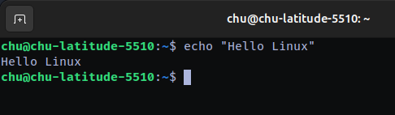

Lệnh `echo` thường được dùng để kiểm tra nhanh nội dung, in thông báo hoặc hiển thị giá trị của biến trong Bash.

Ví dụ in giá trị của một biến:

```bash
name="Linux"
echo $name
```
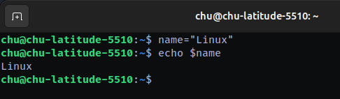

Trong Bash scripting, `echo` được sử dụng rất nhiều để hiển thị thông báo cho người dùng hoặc kiểm tra kết quả trong quá trình chạy script.

Ví dụ:

```bash
#!/bin/bash

echo "Starting script..."
whoami
echo "Script finished."
```

## 4.3. Lệnh `whoami`

Lệnh `whoami` dùng để hiển thị tên người dùng hiện tại đang đăng nhập vào hệ thống.

Cú pháp:

```bash
whoami
```
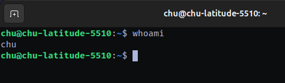

Lệnh này rất hữu ích khi người dùng cần biết mình đang thao tác dưới tài khoản nào. Trong quản trị hệ thống và an toàn thông tin, điều này đặc biệt quan trọng vì quyền hạn của mỗi tài khoản là khác nhau.

Ví dụ, nếu kết quả là:

```bash
root
```

điều đó có nghĩa là người dùng hiện tại đang làm việc với quyền quản trị cao nhất. Khi đó, cần cẩn thận hơn khi chạy các lệnh có thể thay đổi hệ thống.

Lệnh `whoami` cũng thường được sử dụng trong kiểm thử bảo mật để xác định quyền của shell hiện tại sau khi truy cập được vào một hệ thống.

## 4.4. Lệnh `id`

Lệnh `id` dùng để hiển thị thông tin định danh của người dùng hiện tại, bao gồm:

* UID — User ID;
* GID — Group ID;
* các nhóm mà người dùng thuộc về.

Cú pháp:

```bash
id
```

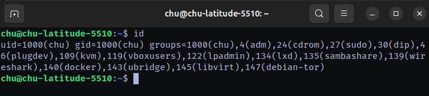

Trong kết quả trên:

| Thành phần | Giá trị trong máy | Ý nghĩa                                                                                            |
| ---------- | --------------------- | ------------------------------------------------------------------------------------------------------------- |
| `uid`      | `uid=1000(chu)`       | Đây là **mã định danh của user**. User hiện tại tên là `chu`, có UID là `1000`.                               |
| `gid`      | `gid=1000(chu)`       | Đây là **group chính** của user `chu`. Khi tạo file mới, file thường thuộc group này.                         |
| `groups`   | `groups=...`          | Đây là danh sách **tất cả các group** mà user `chu` đang thuộc về. Mỗi group cho thêm một số quyền nhất định. |


| Group        | Ý nghĩa                            | Quyền / tác dụng chính                                                    |
| ------------ | ---------------------------------- | ------------------------------------------------------------------------- |
| `chu`        | Group cá nhân của user `chu`       | Group mặc định của user.                                                  |
| `adm`        | Nhóm quản trị log                  | Có thể đọc một số file log hệ thống trong `/var/log`.                     |
| `cdrom`      | Nhóm truy cập ổ CD/DVD             | Cho phép dùng thiết bị CD/DVD nếu có.                                     |
| `sudo`       | Nhóm quản trị hệ thống             | Có thể chạy lệnh với quyền root bằng `sudo`. Đây là group rất quan trọng. |
| `dip`        | Nhóm liên quan đến kết nối mạng cũ | Ít dùng hiện nay, liên quan đến một số kết nối mạng đặc biệt.             |
| `plugdev`    | Nhóm thiết bị cắm ngoài            | Hỗ trợ truy cập USB hoặc thiết bị ngoại vi.                               |
| `kvm`        | Nhóm ảo hóa KVM                    | Cho phép dùng máy ảo KVM/QEMU.                                            |
| `vboxusers`  | Nhóm VirtualBox                    | Cho phép dùng các tính năng của VirtualBox, ví dụ USB trong máy ảo.       |
| `lpadmin`    | Nhóm quản lý máy in                | Có thể thêm, sửa, quản lý máy in.                                         |
| `lxd`        | Nhóm container LXD                 | Cho phép dùng LXD container. Quyền này khá mạnh.                          |
| `sambashare` | Nhóm chia sẻ file Samba            | Dùng để chia sẻ thư mục Linux với Windows hoặc mạng LAN.                  |
| `wireshark`  | Nhóm Wireshark                     | Cho phép bắt gói mạng bằng Wireshark mà không cần chạy bằng root.         |
| `docker`     | Nhóm Docker                        | Cho phép chạy Docker không cần `sudo`. Quyền này rất mạnh.                |
| `ubridge`    | Nhóm liên quan GNS3/uBridge        | Dùng trong mô phỏng mạng, kết nối máy ảo hoặc thiết bị mạng ảo.           |
| `libvirt`    | Nhóm quản lý máy ảo                | Cho phép quản lý máy ảo qua libvirt/virt-manager.                         |
| `debian-tor` | Nhóm liên quan Tor                 | Được tạo khi cài Tor hoặc dịch vụ liên quan đến Tor.                      |


Lệnh `id` rất quan trọng khi kiểm tra quyền truy cập của người dùng. Nếu người dùng thuộc nhóm `sudo`, họ có thể có khả năng chạy lệnh với quyền quản trị. Nếu thuộc nhóm `adm`, họ có thể có quyền đọc một số tệp log hệ thống.

## 4.5. Lệnh `hostname`

Lệnh `hostname` dùng để hiển thị tên của máy tính hoặc máy chủ hiện tại.

Cú pháp:

```bash
hostname
```

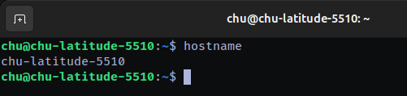

Tên máy chủ giúp phân biệt các hệ thống khác nhau, đặc biệt khi người dùng làm việc với nhiều máy Linux hoặc kết nối đến máy từ xa qua SSH.

## 4.6. Lệnh `uname`

Lệnh `uname` dùng để hiển thị thông tin cơ bản về hệ điều hành và kernel của hệ thống.

Cú pháp:

```bash
uname
```

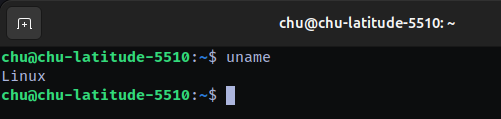

Khi chạy không có tùy chọn, `uname` thường chỉ hiển thị tên kernel. Để xem đầy đủ thông tin hơn, có thể dùng tùy chọn `-a`:

```bash
uname -a
```

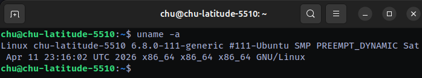

Kết quả này có thể bao gồm:

| Thông tin                      | Ý nghĩa                                                                                                    |
| ------------------------------ | ---------------------------------------------------------------------------------------------------------- |
| `Linux`                        | Tên nhân hệ điều hành đang chạy. Ở đây hệ thống sử dụng nhân **Linux**.                                    |
| `chu-latitude-5510`            | Tên máy tính, còn gọi là **hostname**. Máy đang có tên là `chu-latitude-5510`.                     |
| `6.8.0-111-generic`            | Phiên bản kernel Linux đang sử dụng. Đây là kernel phiên bản `6.8.0-111` của Ubuntu.                       |
| `#111-Ubuntu`                  | Số hiệu bản build kernel do Ubuntu đóng gói. Nó cho biết đây là bản kernel được build bởi Ubuntu.          |
| `SMP`                          | Viết tắt của **Symmetric Multi-Processing**. Nghĩa là kernel hỗ trợ nhiều CPU hoặc nhiều nhân CPU.         |
| `PREEMPT_DYNAMIC`              | Cho biết kernel hỗ trợ cơ chế điều phối linh hoạt, giúp hệ thống phản hồi tốt hơn trong một số tình huống. |
| `Apr 11 23:16:02 UTC 2026` | Thời điểm kernel này được build, theo múi giờ UTC.                                                         |
| `x86_64` thứ nhất              | Kiến trúc phần cứng của máy. `x86_64` nghĩa là máy dùng CPU 64-bit.                                        |
| `x86_64` thứ hai               | Kiến trúc của bộ xử lý đang chạy. Cũng là 64-bit.                                                          |
| `x86_64` thứ ba                | Kiến trúc nền tảng hệ thống. Vẫn là 64-bit.                                                                |
| `GNU/Linux`                    | Tên hệ điều hành đầy đủ. Nghĩa là hệ thống dùng nhân Linux kết hợp với các công cụ GNU.                    |

Một tùy chọn thường dùng khác là `-r`, dùng để hiển thị phiên bản kernel:

```bash
uname -r
```

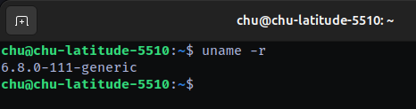

Trong an toàn thông tin, thông tin kernel rất quan trọng vì một số lỗ hổng bảo mật hoặc phương pháp khai thác phụ thuộc vào phiên bản kernel cụ thể.

## 4.7. Lệnh `pwd`

Lệnh `pwd`, viết đầy đủ là **print working directory**, dùng để hiển thị đường dẫn đầy đủ của thư mục hiện tại mà người dùng đang làm việc.

Cú pháp:

```bash
pwd
```

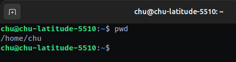

Điều này có nghĩa là người dùng hiện đang đứng trong thư mục `/home/chu`.

Lệnh `pwd` đặc biệt hữu ích khi người dùng di chuyển qua nhiều thư mục khác nhau và cần xác định chính xác vị trí hiện tại trong hệ thống tệp.

Ví dụ:

```bash
cd /var/log
pwd
```

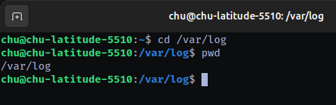

## 4.8. Lệnh `clear`

Lệnh `clear` dùng để xóa nội dung đang hiển thị trên màn hình terminal, giúp giao diện làm việc trở nên gọn gàng và dễ quan sát hơn.

Cú pháp:

```bash
clear
```

Sau khi chạy lệnh này, màn hình terminal sẽ được làm sạch, nhưng lịch sử lệnh vẫn được giữ lại. Điều này có nghĩa là người dùng vẫn có thể dùng phím mũi tên lên hoặc chức năng tìm kiếm lịch sử để xem lại các lệnh đã chạy trước đó.

Ngoài lệnh `clear`, người dùng cũng có thể dùng phím tắt:

```bash
Ctrl + L
```

Phím tắt này có chức năng tương tự `clear`, giúp xóa nhanh màn hình terminal mà không cần nhập lệnh.

Lệnh `clear` thường được dùng khi terminal có quá nhiều kết quả hiển thị, đặc biệt sau khi chạy các lệnh tạo nhiều đầu ra như `ls -la`, `ps aux`, `cat` hoặc `find`.

## 4.9. Lịch sử lệnh và tìm kiếm lệnh đã chạy

Trong Linux, shell lưu lại các lệnh mà người dùng đã chạy trước đó. Điều này giúp người dùng có thể xem lại, chạy lại hoặc chỉnh sửa các lệnh cũ mà không cần nhập lại từ đầu.

Cách đơn giản nhất để xem lại lệnh đã chạy là dùng phím mũi tên:

| Phím | Chức năng                               |
| ---- | --------------------------------------- |
| `↑`  | Xem lệnh đã chạy trước đó               |
| `↓`  | Di chuyển về lệnh mới hơn trong lịch sử |

Ví dụ, nếu trước đó người dùng đã chạy:

```bash
sudo apt update
```

thì có thể nhấn phím `↑` để gọi lại lệnh này, sau đó nhấn `Enter` để chạy lại.

Một cách khác là dùng phím tắt:

```bash
Ctrl + R
```

Phím tắt `Ctrl + R` cho phép tìm kiếm ngược trong lịch sử lệnh. Sau khi nhấn `Ctrl + R`, người dùng nhập một phần của lệnh cần tìm, shell sẽ tự động gợi lại lệnh phù hợp.

Ví dụ, nếu cần tìm lại lệnh có chứa từ `ssh`, người dùng nhấn:

```bash
Ctrl + R
```

sau đó nhập:

```bash
ssh
```

Shell sẽ hiển thị lệnh gần nhất có chứa chuỗi `ssh`.

Ngoài ra, có thể dùng `!!` để chạy lại lệnh gần nhất:

```bash
!!
```

Ví dụ:

```bash
apt update
```

Nếu lệnh trên cần quyền quản trị và bị lỗi do thiếu `sudo`, người dùng có thể chạy:

```bash
sudo !!
```

Khi đó, Bash sẽ hiểu là chạy lại lệnh trước đó với `sudo`:

```bash
sudo apt update
```

Lịch sử lệnh giúp tiết kiệm thời gian, giảm lỗi khi nhập lại lệnh dài và hỗ trợ người dùng làm việc hiệu quả hơn trong terminal.


# 5. Tìm kiếm trợ giúp trong Linux

Khi làm việc với Linux, người dùng không thể nhớ hết tất cả lệnh, tùy chọn và cú pháp. Vì vậy, biết cách tự tra cứu tài liệu là một kỹ năng rất quan trọng. Linux cung cấp nhiều công cụ trợ giúp trực tiếp trong terminal như `man`, `--help`, `-h`, `apropos`, ngoài ra cũng có thể sử dụng các công cụ trực tuyến như explainshell để hiểu rõ cấu trúc của một lệnh.

## 5.1. Sử dụng `man`

Lệnh `man`, viết đầy đủ là **manual**, dùng để mở trang hướng dẫn sử dụng của một lệnh trong Linux. Đây là nguồn tài liệu chính thức, có sẵn trực tiếp trên hệ thống.

Cú pháp cơ bản:

```bash
man <command>
```

Ví dụ:

```bash
man ls
```

Lệnh trên sẽ mở trang hướng dẫn của lệnh `ls`.

Trong trang `man`, người dùng thường thấy các phần như:

| Phần | Ý nghĩa |
|---|---|
| `NAME` | Tên lệnh và mô tả ngắn |
| `SYNOPSIS` | Cú pháp sử dụng lệnh |
| `DESCRIPTION` | Mô tả chi tiết chức năng của lệnh |
| `OPTIONS` | Các tùy chọn/flag mà lệnh hỗ trợ |
| `EXAMPLES` | Ví dụ sử dụng, nếu có |
| `SEE ALSO` | Các lệnh hoặc tài liệu liên quan |

Một số phím thường dùng khi đọc trang `man`:

| Phím | Chức năng |
|---|---|
| `↑` / `↓` | Di chuyển lên/xuống từng dòng |
| `Space` | Chuyển sang trang tiếp theo |
| `/keyword` | Tìm kiếm một từ khóa trong trang |
| `n` | Chuyển đến kết quả tìm kiếm tiếp theo |
| `q` | Thoát khỏi trang `man` |


## 5.2. Sử dụng `--help`

Tùy chọn `--help` thường được dùng để hiển thị hướng dẫn ngắn gọn về cách sử dụng một lệnh. So với `man`, `--help` thường ngắn hơn, dễ đọc hơn và phù hợp khi người dùng cần xem nhanh cú pháp hoặc các tùy chọn phổ biến.

Cú pháp cơ bản:

```bash
<command> --help
```

Ví dụ:

```bash
ls --help
```

Lệnh trên sẽ hiển thị danh sách các tùy chọn mà lệnh `ls` hỗ trợ.

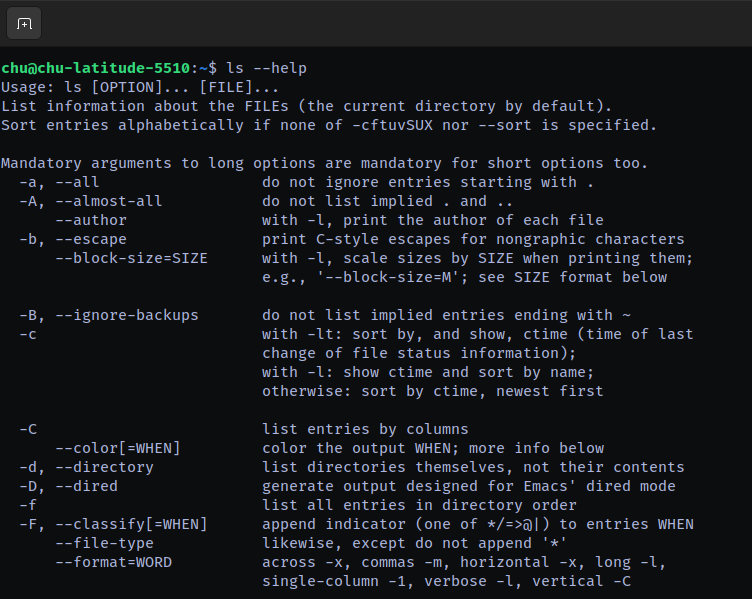

Ví dụ khác:

```bash
cp --help
```


Lệnh này giúp người dùng xem nhanh cách sử dụng lệnh `cp` để sao chép tệp hoặc thư mục.

Thông thường, kết quả của `--help` sẽ bao gồm:

| Nội dung | Ý nghĩa |
|---|---|
| Cú pháp lệnh | Cách viết lệnh đúng |
| Danh sách tùy chọn | Các flag/switch có thể sử dụng |
| Mô tả ngắn | Giải thích ngắn gọn từng tùy chọn |
| Gợi ý tài liệu khác | Có thể chỉ tới `man` hoặc tài liệu chi tiết hơn |

## 5.3. Sử dụng `-h`

Tùy chọn `-h` trong nhiều lệnh có thể được dùng để hiển thị phần trợ giúp ngắn gọn. Tuy nhiên, cần chú ý rằng `-h` không phải lúc nào cũng có nghĩa là “help”. Ý nghĩa của `-h` phụ thuộc vào từng lệnh cụ thể.

Trong một số lệnh, `-h` có nghĩa là **help**:

```bash
strace -h
```

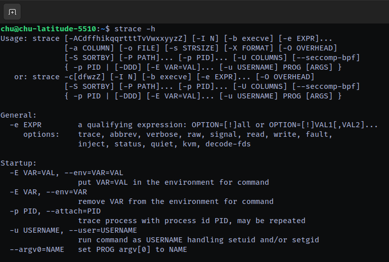

Lệnh trên hiển thị hướng dẫn ngắn về cách sử dụng `strace`.

Nhưng trong một số lệnh khác, `-h` lại có nghĩa là **human-readable**, tức là hiển thị dữ liệu theo dạng dễ đọc hơn.

Ví dụ:

```bash
ls -lh
```

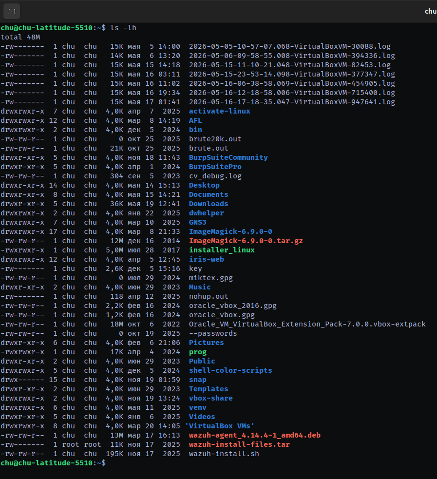

Trong lệnh trên:

| Tùy chọn | Ý nghĩa |
|---|---|
| `-l` | Hiển thị dạng danh sách chi tiết |
| `-h` | Hiển thị kích thước tệp dễ đọc hơn, ví dụ KB, MB, GB |

Ví dụ:

```bash
du -h
```

Lệnh này hiển thị dung lượng theo dạng dễ đọc hơn.

## 5.4. Sử dụng `apropos`

Lệnh `apropos` dùng để tìm kiếm các lệnh liên quan đến một từ khóa trong hệ thống tài liệu `man`. Công cụ này rất hữu ích khi người dùng không nhớ chính xác tên lệnh, nhưng biết mình muốn làm việc gì.

Cú pháp cơ bản:

```bash
apropos <keyword>
```

Ví dụ, nếu muốn tìm các lệnh liên quan đến việc sao chép, có thể dùng:

```bash
apropos copy
```

Kết quả có thể hiển thị các lệnh liên quan như `cp`, `scp`, `rsync` hoặc các mục tài liệu khác có chứa từ khóa “copy”.

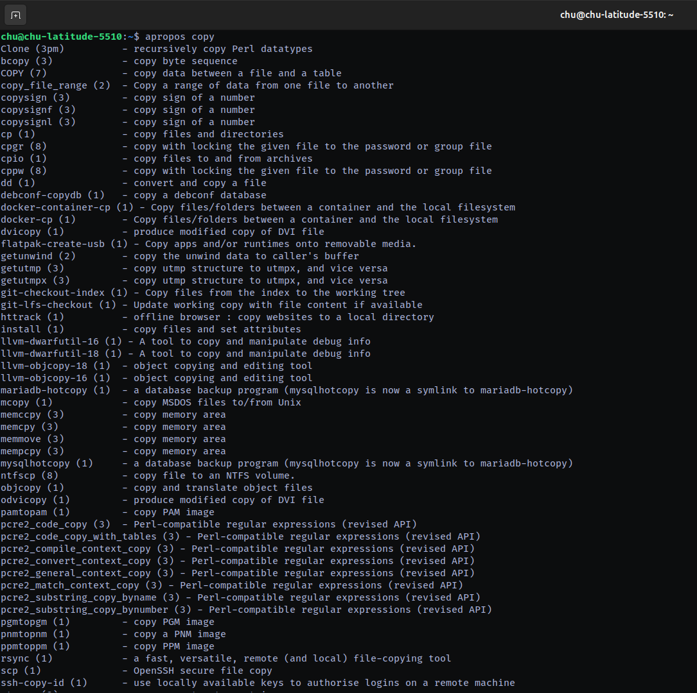

## 5.5. Sử dụng explainshell

**explainshell** là một công cụ trực tuyến giúp giải thích từng thành phần trong một câu lệnh Linux. Công cụ này đặc biệt hữu ích khi người dùng gặp một lệnh dài, có nhiều tùy chọn, pipe hoặc chuyển hướng dữ liệu.

https://explainshell.com/

Ví dụ, với lệnh:

```bash
ls -la /var/log
```
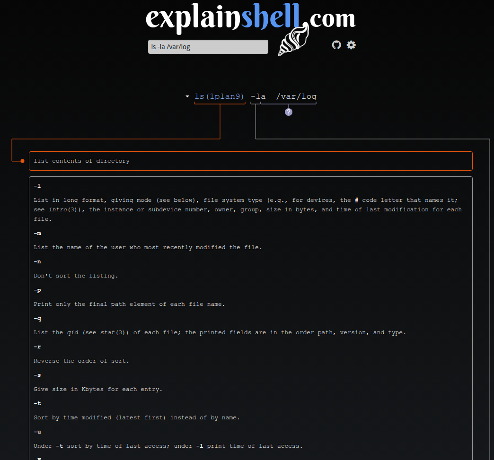

# 6. Điều hướng trong hệ thống tệp

Điều hướng trong hệ thống tệp là một kỹ năng cơ bản khi làm việc với Linux. Người dùng cần biết mình đang đứng ở thư mục nào, trong thư mục đó có những tệp gì, cách di chuyển sang thư mục khác và cách sử dụng đường dẫn để truy cập đúng vị trí cần làm việc.

Trong Linux, hệ thống tệp được tổ chức theo dạng cây phân cấp, bắt đầu từ thư mục gốc `/`. Từ thư mục gốc này, các thư mục khác như `/home`, `/etc`, `/var`, `/usr`, `/bin` được sắp xếp theo từng nhánh. Vì vậy, việc hiểu cách điều hướng giúp người dùng thao tác chính xác hơn khi quản lý tệp, cấu hình hệ thống hoặc phân tích log.

## 6.1. Xác định thư mục hiện tại với `pwd`

Lệnh `pwd`, viết đầy đủ là **print working directory**, dùng để hiển thị đường dẫn đầy đủ của thư mục hiện tại mà người dùng đang làm việc.

Cú pháp:

```bash
pwd
```

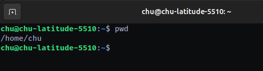

Điều này cho biết người dùng hiện đang đứng trong thư mục `/home/chu`.

Lệnh `pwd` rất hữu ích khi người dùng đã di chuyển qua nhiều thư mục và không nhớ chính xác vị trí hiện tại. Trong Linux, nhiều lệnh sẽ tác động đến thư mục hiện tại, vì vậy việc biết rõ mình đang ở đâu giúp tránh thao tác nhầm.

## 6.2. Liệt kê nội dung thư mục với `ls`

Lệnh `ls`, viết tắt của **list**, dùng để liệt kê nội dung của thư mục. Khi chạy `ls` không kèm tham số, hệ thống sẽ hiển thị các tệp và thư mục trong thư mục hiện tại.

Cú pháp:

```bash
ls
```

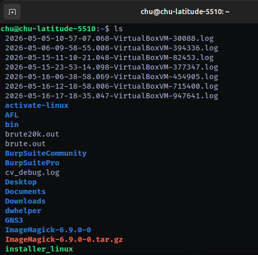

Người dùng cũng có thể dùng `ls` để xem nội dung của một thư mục khác mà không cần di chuyển vào thư mục đó.

Ví dụ:

```bash
ls Desktop
```

Lệnh trên sẽ hiển thị nội dung bên trong thư mục `Desktop`.

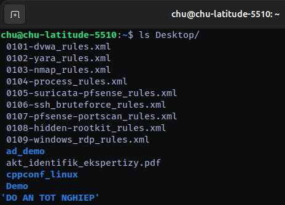

## 6.3. Hiển thị tệp ẩn với `ls -a`

Trong Linux, tệp hoặc thư mục ẩn thường có tên bắt đầu bằng dấu chấm `.`. Theo mặc định, lệnh `ls` không hiển thị các tệp ẩn này. Để xem cả tệp ẩn, người dùng sử dụng tùy chọn `-a`.

Cú pháp:

```bash
ls -a
```

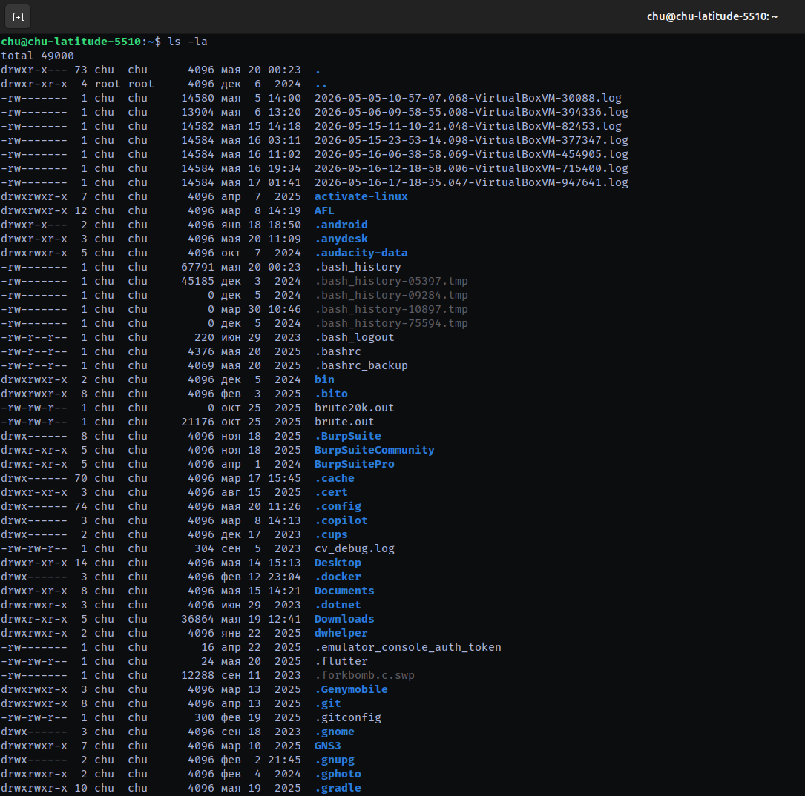

| Thành phần | Ý nghĩa |
|---|---|
| `.` | Thư mục hiện tại |
| `..` | Thư mục cha |
| `.bashrc` | Tệp cấu hình ẩn của Bash |
| `.profile` | Tệp cấu hình môi trường người dùng |
| `Documents`, `Downloads` | Thư mục thông thường |

Tệp ẩn thường là các tệp cấu hình, ví dụ như `.bashrc`, `.profile`, `.ssh`, `.config`. Chúng thường được dùng để lưu cấu hình shell, cấu hình ứng dụng hoặc thông tin môi trường làm việc của người dùng.

## 6.4. Hiển thị chi tiết với `ls -l`

Tùy chọn `-l` của lệnh `ls` dùng để hiển thị nội dung thư mục theo dạng danh sách chi tiết. Thay vì chỉ hiển thị tên tệp và thư mục, `ls -l` cung cấp thêm nhiều thông tin như quyền truy cập, chủ sở hữu, nhóm, kích thước, thời gian chỉnh sửa và tên tệp.

Cú pháp:

```bash
ls -l
```

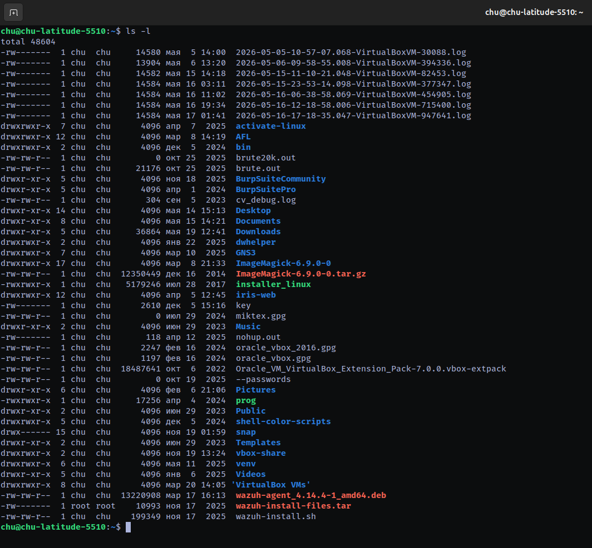

Có thể hiểu kết quả trên như sau:

| Thành phần | Ý nghĩa |
|---|---|
| `drwxr-xr-x` | Loại tệp và quyền truy cập |
| `7` | Số liên kết |
| `chu` | Chủ sở hữu |
| `chu` | Nhóm sở hữu |
| `4096` | Kích thước |
| `апр  7  2025` | Thời gian chỉnh sửa gần nhất |
| `Documents` | Tên tệp hoặc thư mục |

Ký tự đầu tiên trong dòng kết quả cho biết loại đối tượng:

| Ký tự | Ý nghĩa |
|---|---|
| `d` | Thư mục |
| `-` | Tệp thông thường |
| `l` | Liên kết tượng trưng |

## 6.5. Kết hợp tùy chọn `ls -la`

Trong Linux, các tùy chọn của lệnh có thể được kết hợp với nhau. Lệnh `ls -la` là sự kết hợp giữa `-l` và `-a`.

Cú pháp:

```bash
ls -la
```

Trong đó:

| Tùy chọn | Ý nghĩa |
|---|---|
| `-l` | Hiển thị chi tiết |
| `-a` | Hiển thị cả tệp ẩn |

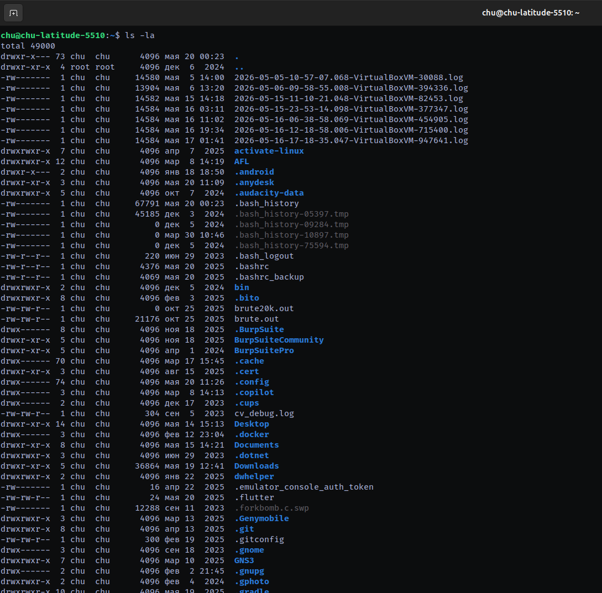

Lệnh này rất thường được sử dụng vì nó cho phép người dùng xem đầy đủ nội dung thư mục, bao gồm cả tệp ẩn và thông tin chi tiết của từng đối tượng.

Ngoài ra, có thể kết hợp thêm tùy chọn `-h` để hiển thị kích thước dễ đọc hơn:

```bash
ls -lah
```

Trong đó `-h` là **human-readable**, giúp kích thước hiển thị dưới dạng KB, MB hoặc GB thay vì chỉ hiển thị số byte.

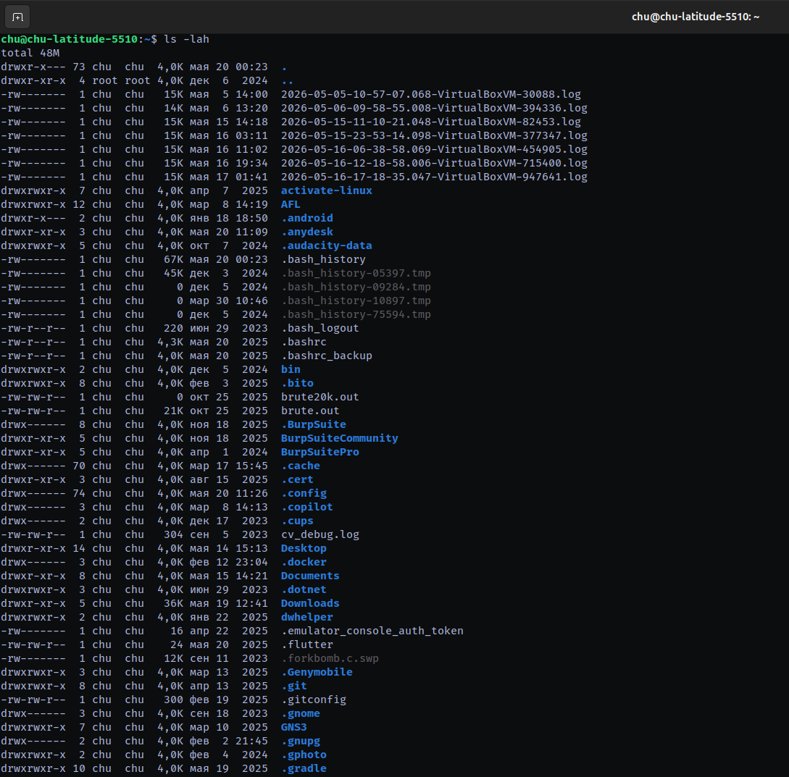

## 6.6. Di chuyển thư mục với `cd`

Lệnh `cd`, viết đầy đủ là **change directory**, dùng để di chuyển từ thư mục hiện tại sang thư mục khác.

Cú pháp:

```bash
cd <đường_dẫn_thư_mục>
```

Ví dụ, để di chuyển vào thư mục `Documents`:

```bash
cd Documents
```

Sau đó có thể dùng `pwd` để kiểm tra vị trí hiện tại:
chu
```bash
pwd
```

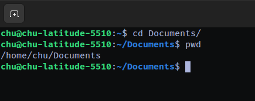

Để di chuyển đến một thư mục bằng đường dẫn tuyệt đối:

```bash
cd /var/log
```

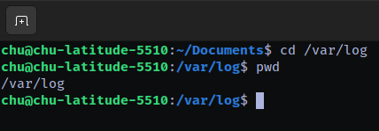

Để quay về thư mục home của người dùng hiện tại:

```bash
cd ~
```

hoặc đơn giản hơn:

```bash
cd
```

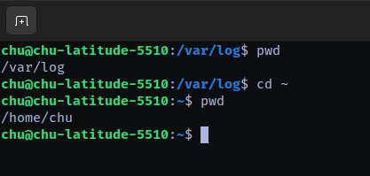

Để di chuyển về thư mục gốc của hệ thống:

```bash
cd /
```

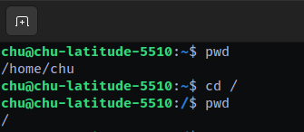

Một số ví dụ thường dùng:

| Lệnh | Ý nghĩa |
|---|---|
| `cd Documents` | Chuyển vào thư mục `Documents` trong thư mục hiện tại |
| `cd /var/log` | Chuyển đến thư mục `/var/log` bằng đường dẫn tuyệt đối |
| `cd ~` | Chuyển về thư mục home |
| `cd` | Chuyển về thư mục home |
| `cd /` | Chuyển về thư mục gốc |

## 6.7. Đường dẫn tuyệt đối và đường dẫn tương đối

Trong Linux, khi truy cập tệp hoặc thư mục, người dùng có thể sử dụng **đường dẫn tuyệt đối** hoặc **đường dẫn tương đối**.

**Đường dẫn tuyệt đối** là đường dẫn bắt đầu từ thư mục gốc `/`. Nó chỉ ra vị trí đầy đủ của một tệp hoặc thư mục trong hệ thống.

Ví dụ:

```bash
/home/chu/Documents
```

```bash
/var/log/syslog
```

```bash
/etc/passwd
```

Đặc điểm của đường dẫn tuyệt đối là luôn bắt đầu bằng dấu `/`.

Ví dụ:

```bash
cd /home/chu/Documents
```

Lệnh trên sẽ đưa người dùng đến đúng thư mục `/home/chu/Documents` dù người dùng đang đứng ở bất kỳ vị trí nào trong hệ thống.

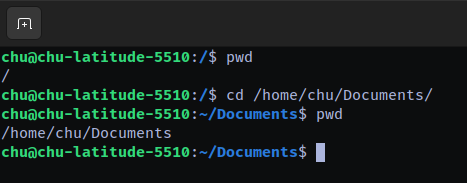

Ngược lại, **đường dẫn tương đối** là đường dẫn được tính từ thư mục hiện tại. Nó không bắt đầu bằng dấu `/`.

Ví dụ, nếu người dùng đang ở thư mục:

```bash
/home/chu 
```

và muốn vào thư mục `Documents`, có thể dùng:

```bash
cd Documents
```

Ở đây, `Documents` là đường dẫn tương đối, vì nó được tính từ vị trí hiện tại.

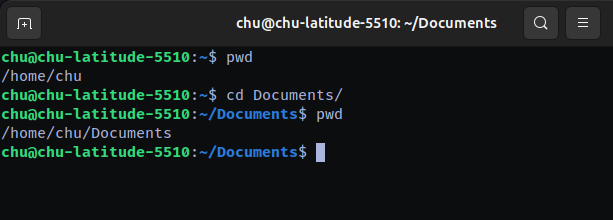

| Loại đường dẫn | Ví dụ | Đặc điểm |
|---|---|---|
| Đường dẫn tuyệt đối | `/home/chu/Documents` | Bắt đầu từ thư mục gốc `/` |
| Đường dẫn tương đối | `Documents` | Bắt đầu từ thư mục hiện tại |

## 6.8. Ký hiệu `.` và `..`

Trong Linux, hai ký hiệu `.` và `..` được sử dụng rất thường xuyên khi điều hướng thư mục.

| Ký hiệu | Ý nghĩa |
|---|---|
| `.` | Thư mục hiện tại |
| `..` | Thư mục cha, tức thư mục nằm ngay phía trên thư mục hiện tại |

Ký hiệu `.` đại diện cho thư mục hiện tại. Ví dụ:

```bash
ls .
```

Lệnh này liệt kê nội dung của thư mục hiện tại. Kết quả tương tự như khi chạy:

```bash
ls
```

Ký hiệu `..` đại diện cho thư mục cha. Ví dụ, nếu người dùng đang ở:

```bash
/home/chu/Documents
```

và chạy:

```bash
cd ..
```

thì hệ thống sẽ đưa người dùng về:

```bash
/home/chu
```

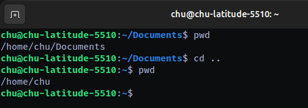

Có thể sử dụng nhiều dấu `..` để di chuyển lên nhiều cấp thư mục.

Ví dụ:

```bash
cd ../..
```

Lệnh này di chuyển lên hai cấp thư mục.

Ví dụ, nếu đang ở:

```bash
/home/chu/Documents/projects
```

chạy:

```bash
cd ../..
```

thì người dùng sẽ về:

```bash
/home
```

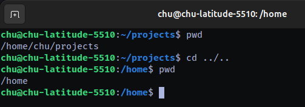

Ký hiệu `.` cũng thường được dùng khi chạy script hoặc chương trình trong thư mục hiện tại.

Ví dụ:

```bash
./script.sh
```

Trong đó:

| Thành phần | Ý nghĩa |
|---|---|
| `.` | Thư mục hiện tại |
| `/` | Dấu phân tách đường dẫn |
| `script.sh` | Tên tệp script cần chạy |

## 6.9. Quay lại thư mục trước đó với `cd -`

Lệnh `cd -` dùng để quay lại thư mục mà người dùng vừa đứng trước đó. Đây là một cách di chuyển nhanh giữa hai thư mục.

Cú pháp:

```bash
cd -
```

Ví dụ, người dùng đang ở thư mục:

```bash
/home/chu
```

Sau đó chuyển sang thư mục:

```bash
cd /var/log
```

Bây giờ, nếu chạy:

```bash
cd -
```

hệ thống sẽ đưa người dùng quay lại:

```bash
/home/chu
```

Nếu tiếp tục chạy:

```bash
cd -
```

người dùng sẽ quay lại:

```bash
/var/log
```

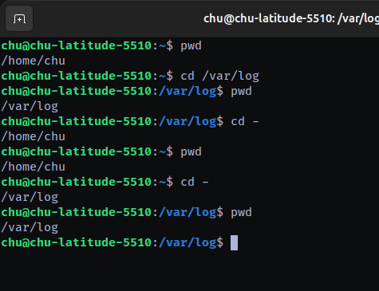

Lệnh này rất hữu ích khi cần làm việc qua lại giữa hai thư mục khác nhau, ví dụ một thư mục chứa file cấu hình và một thư mục chứa log.

## 6.10. Tự động hoàn thành bằng phím `TAB`

Phím `TAB` trong terminal dùng để tự động hoàn thành tên lệnh, tên tệp hoặc tên thư mục. Đây là một tính năng rất hữu ích giúp người dùng nhập lệnh nhanh hơn và giảm lỗi gõ sai.

Ví dụ, nếu trong thư mục hiện tại có thư mục tên là `Documents`, người dùng có thể nhập:

```bash
cd Doc
```

Sau đó nhấn `TAB`, terminal có thể tự động hoàn thành thành:

```bash
cd Documents
```

Nếu có nhiều kết quả cùng bắt đầu bằng một chuỗi giống nhau, nhấn `TAB` một hoặc hai lần sẽ hiển thị các lựa chọn phù hợp.

Ví dụ, nếu trong thư mục có:

```bash
Documents  Downloads
```

Khi nhập:

```bash
cd Do
```

rồi nhấn `TAB`, hệ thống có thể chưa hoàn thành ngay vì có hai kết quả cùng bắt đầu bằng `Do`. Khi đó, người dùng có thể nhập thêm ký tự để phân biệt:

```bash
cd Doc
```

rồi nhấn `TAB` để hoàn thành thành:

```bash
cd Documents
```

Phím `TAB` cũng có thể dùng để hoàn thành tên lệnh.

Ví dụ:

```bash
una
```

Nhấn `TAB`, terminal có thể hoàn thành thành:

```bash
uname
```

Tính năng tự động hoàn thành đặc biệt hữu ích khi làm việc với đường dẫn dài.

Ví dụ:

```bash
cd /var/lo
```

Nhấn `TAB`, terminal có thể hoàn thành thành:

```bash
cd /var/log
```

# 7. Làm việc với tệp và thư mục

Sau khi biết cách điều hướng trong hệ thống tệp, người dùng cần nắm được các thao tác cơ bản để làm việc với tệp và thư mục. Đây là nhóm lệnh rất quan trọng trong Linux, vì hầu hết hoạt động quản trị hệ thống, lập trình, xử lý log và an toàn thông tin đều liên quan đến việc tạo, sao chép, di chuyển, đổi tên hoặc xóa tệp.

Các lệnh thường dùng trong phần này gồm `touch`, `mkdir`, `cp`, `mv`, `rm`, `file` và `tree`.

## 7.1. Tạo tệp với `touch`

Lệnh `touch` được dùng để tạo một tệp rỗng mới. Nếu tệp đã tồn tại, lệnh `touch` sẽ cập nhật thời gian chỉnh sửa của tệp đó.

Cú pháp:

```bash
touch <tên_tệp>
```

Ví dụ, tạo một tệp tên là `note.txt`:

```bash
touch note.txt
```

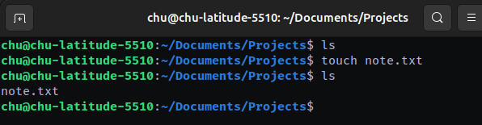

## 7.2. Tạo thư mục với `mkdir`

Lệnh `mkdir`, viết đầy đủ là **make directory**, dùng để tạo thư mục mới trong Linux.

Cú pháp:

```bash
mkdir <tên_thư_mục>
```

Ví dụ, tạo thư mục tên là `Documents`:

```bash
mkdir Documents
```

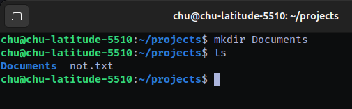

## 7.3. Tạo thư mục lồng nhau với `mkdir -p`

Trong nhiều trường hợp, người dùng cần tạo nhiều thư mục lồng nhau. Nếu dùng `mkdir` thông thường, thư mục cha phải tồn tại trước thì mới tạo được thư mục con.

Cú pháp:

```bash
mkdir -p <đường_dẫn_thư_mục>
```

Ví dụ:

```bash
mkdir -p project/src/logs
```

Lệnh trên sẽ tự động tạo:

```bash
project
project/src
project/src/logs
```

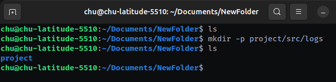

## 7.4. Sao chép tệp và thư mục với `cp`

Lệnh `cp`, viết tắt của **copy**, dùng để sao chép tệp hoặc thư mục từ vị trí này sang vị trí khác.

Cú pháp sao chép tệp:

```bash
cp <nguồn> <đích>
```

Ví dụ, sao chép tệp `note.txt` thành `note_backup.txt`:

```bash
cp note.txt note_backup.txt
```

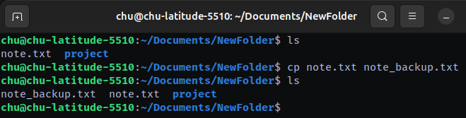

Có thể sao chép tệp vào một thư mục khác:

```bash
cp note.txt Documents/
```

Lệnh trên sao chép tệp `note.txt` vào thư mục `Documents`.

Để sao chép thư mục, cần dùng tùy chọn `-r`, nghĩa là sao chép đệ quy toàn bộ nội dung bên trong thư mục.

Ví dụ:

```bash
cp -r project project_backup
```

Lệnh này sao chép thư mục `project` thành thư mục `project_backup`.

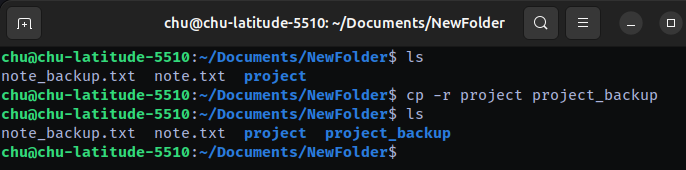

Một số tùy chọn thường dùng với `cp`:

| Tùy chọn | Ý nghĩa |
|---|---|
| `-r` | Sao chép thư mục và toàn bộ nội dung bên trong |
| `-i` | Hỏi trước khi ghi đè tệp |
| `-v` | Hiển thị chi tiết quá trình sao chép |
| `-u` | Chỉ sao chép nếu tệp nguồn mới hơn tệp đích |

## 7.5. Di chuyển tệp và thư mục với `mv`

Lệnh `mv`, viết tắt của **move**, dùng để di chuyển tệp hoặc thư mục từ vị trí này sang vị trí khác.

Cú pháp:

```bash
mv <nguồn> <đích>
```

Ví dụ, di chuyển tệp `note.txt` vào thư mục `project`:

```bash
mv note.txt project/
```

Sau lệnh này, tệp `note.txt` sẽ không còn ở thư mục hiện tại nữa, mà được chuyển vào thư mục `project`.

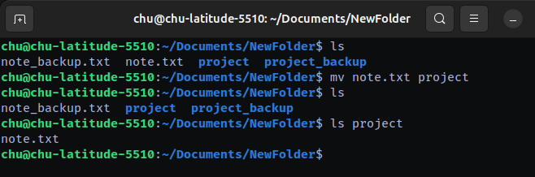

Di chuyển thư mục cũng sử dụng cú pháp tương tự.

Ví dụ:

```bash
mv project Documents/
```

Lệnh này di chuyển thư mục `project` vào thư mục `Documents`.

Một số tùy chọn thường dùng với `mv`:

| Tùy chọn | Ý nghĩa |
|---|---|
| `-i` | Hỏi trước khi ghi đè |
| `-v` | Hiển thị chi tiết quá trình di chuyển |


## 7.6. Đổi tên tệp và thư mục với `mv`

Ngoài chức năng di chuyển, lệnh `mv` còn được dùng để đổi tên tệp hoặc thư mục. Trong Linux, đổi tên thực chất cũng được xem là một dạng “di chuyển” từ tên cũ sang tên mới trong cùng một thư mục.

Cú pháp:

```bash
mv <tên_cũ> <tên_mới>
```

Ví dụ, đổi tên tệp `note.txt` thành `notes.txt`:

```bash
mv note.txt notes.txt
```

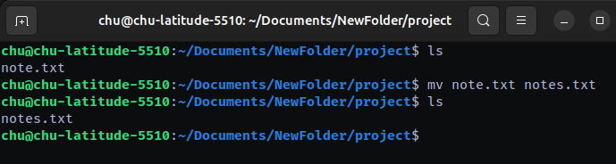

Đổi tên thư mục cũng tương tự.

Ví dụ:

```bash
mv old_project new_project
```

Lệnh trên đổi tên thư mục `old_project` thành `new_project`.

Cần chú ý: nếu tên đích đã tồn tại, lệnh `mv` có thể ghi đè hoặc di chuyển tệp vào thư mục đó. Vì vậy, khi chưa chắc chắn, nên dùng tùy chọn `-i`:

```bash
mv -i note.txt notes.txt
```

## 7.7. Xóa tệp với `rm`

Lệnh `rm`, viết tắt của **remove**, dùng để xóa tệp trong Linux.

Cú pháp:

```bash
rm <tên_tệp>
```

Ví dụ, xóa tệp `note.txt`:

```bash
rm note.txt
```

Sau khi chạy lệnh này, tệp `note.txt` sẽ bị xóa.

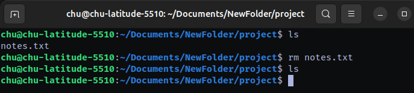

Có thể xóa nhiều tệp cùng lúc:

```bash
rm file1.txt file2.txt file3.txt
```

Một số tùy chọn thường dùng với `rm`:

| Tùy chọn | Ý nghĩa |
|---|---|
| `-i` | Hỏi trước khi xóa |
| `-f` | Ép xóa, bỏ qua cảnh báo |
| `-v` | Hiển thị chi tiết quá trình xóa |

Ví dụ an toàn hơn:

```bash
rm -i note.txt
```

Hệ thống sẽ hỏi xác nhận trước khi xóa:

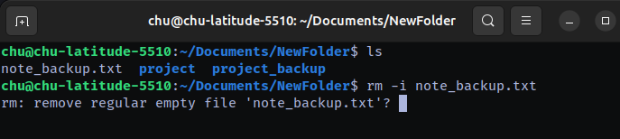

Cần đặc biệt cẩn thận với lệnh `rm`, vì trên Linux, tệp bị xóa bằng `rm` thường không được đưa vào thùng rác như trong giao diện đồ họa.

## 7.8. Xóa thư mục với `rm -r`

Để xóa một thư mục và toàn bộ nội dung bên trong, cần dùng lệnh `rm` với tùy chọn `-r`.

Cú pháp:

```bash
rm -r <tên_thư_mục>
```

Tùy chọn `-r` nghĩa là **recursive**, tức là xóa đệ quy toàn bộ nội dung bên trong thư mục, bao gồm các tệp và thư mục con.

Ví dụ:

```bash
rm -r old_project
```

Lệnh này sẽ xóa thư mục `old_project` cùng toàn bộ dữ liệu bên trong.

Để an toàn hơn, có thể dùng:

```bash
rm -ri old_project
```

Tùy chọn `-i` sẽ hỏi xác nhận trước khi xóa từng đối tượng.

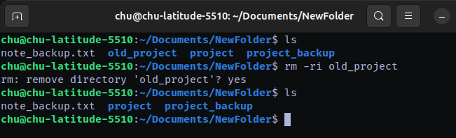

Cần tránh dùng tùy tiện các lệnh nguy hiểm như:

```bash
rm -rf /
```

hoặc:

```bash
rm -rf *
```

Trong đó:

| Tùy chọn | Ý nghĩa |
|---|---|
| `-r` | Xóa đệ quy thư mục và nội dung bên trong |
| `-f` | Ép xóa, không hỏi xác nhận |

Khi kết hợp `-r` và `-f`, lệnh sẽ rất nguy hiểm nếu nhập sai đường dẫn.

## 7.9. Kiểm tra loại tệp với `file`

Lệnh `file` dùng để xác định loại thực sự của một tệp. Trong Linux, phần mở rộng của tệp không phải lúc nào cũng phản ánh chính xác loại tệp, vì vậy lệnh `file` rất hữu ích để kiểm tra nội dung thực tế của tệp.

Cú pháp:

```bash
file <tên_tệp>
```

Ví dụ:

```bash
file note.txt
```

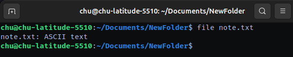

Điều này cho biết `note.txt` là một tệp văn bản.

Ví dụ khác:

```bash
file image.png
```

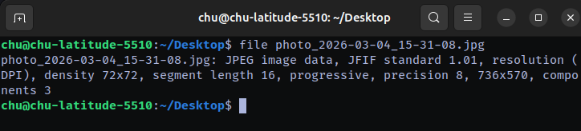

Hoặc kiểm tra một tệp thực thi:

```bash
file program
```

Kết quả có thể là:

```bash
program: ELF 64-bit LSB executable
```

Lệnh `file` rất hữu ích trong an toàn thông tin, phân tích mã độc, kiểm tra tệp tải về hoặc xác định loại tệp khi phần mở rộng bị thay đổi.

## 7.10. Hiển thị cấu trúc thư mục với `tree`

Lệnh `tree` dùng để hiển thị cấu trúc thư mục theo dạng cây. Lệnh này giúp người dùng nhìn rõ mối quan hệ giữa thư mục cha, thư mục con và các tệp bên trong.

Cú pháp:

```bash
tree
```

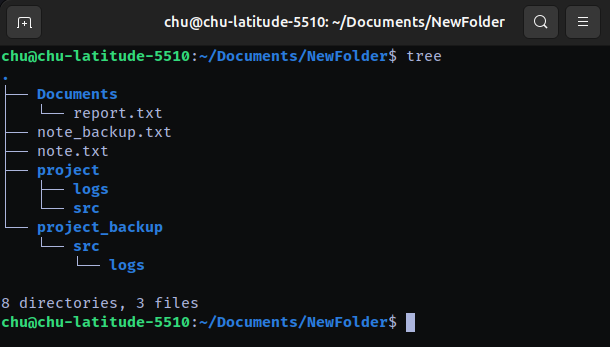

Kết quả trên cho thấy cấu trúc thư mục hiện tại gồm `Documents`, `Downloads`, `project` và các thư mục con bên trong.

Có thể chỉ định thư mục cần xem:

```bash
tree project
```

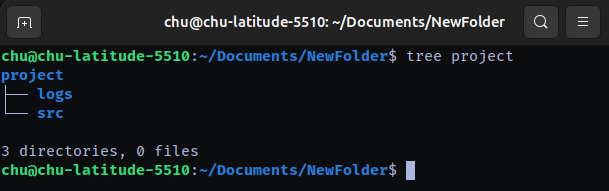

# 8. Xem và chỉnh sửa nội dung tệp

Trong Linux, rất nhiều thông tin quan trọng được lưu dưới dạng tệp văn bản, ví dụ như tệp cấu hình, tệp log, script hoặc tài liệu hệ thống. Vì vậy, người dùng cần biết cách xem nhanh nội dung tệp, đọc các tệp dài và chỉnh sửa tệp trực tiếp trong terminal.

Các lệnh thường dùng trong phần này gồm `cat`, `head`, `tail`, `more`, `less`, cùng với các trình soạn thảo văn bản như `nano` và `vim`.

## 8.1. Xem nội dung tệp với `cat`

Lệnh `cat`, viết tắt của **concatenate**, thường được dùng để hiển thị nội dung của tệp ra màn hình terminal.

Cú pháp:

```bash
cat <tên_tệp>
```

Ví dụ:

```bash
cat cat 0101-dvwa_rules.xml
```

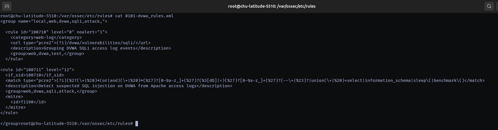

Lệnh `cat` phù hợp để xem nhanh các tệp ngắn. Ví dụ, có thể dùng `cat` để đọc tệp cấu hình nhỏ, tệp ghi chú hoặc nội dung script đơn giản.

## 8.2. Xem đầu tệp với `head`

Lệnh `head` dùng để hiển thị những dòng đầu tiên của một tệp. Theo mặc định, `head` thường hiển thị 10 dòng đầu.

Cú pháp:

```bash
head <tên_tệp>
```

Muốn chỉ định số dòng cần xem, dùng tùy chọn `-n`:

```bash
head -n <số_dòng> <tên_tệp>
```

Ví dụ:

```bash
head -n 10 ossec.log
```

Lệnh này hiển thị 10 dòng đầu tiên của tệp.

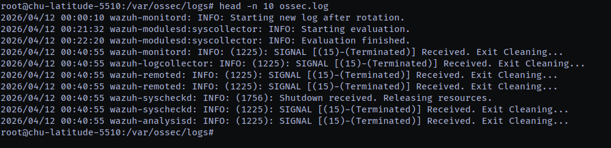

`head` rất hữu ích khi cần kiểm tra phần mở đầu của tệp, ví dụ như xem cấu trúc dữ liệu, tiêu đề file CSV, hoặc kiểm tra nhanh log ở phần đầu.

## 8.3. Xem cuối tệp với `tail`

Lệnh `tail` dùng để hiển thị những dòng cuối cùng của một tệp. Theo mặc định, `tail` thường hiển thị 10 dòng cuối.

Cú pháp:

```bash
tail <tên_tệp>
```

Muốn chỉ định số dòng cần xem, dùng tùy chọn `-n`:

```bash
tail -n <số_dòng> <tên_tệp>
```

Ví dụ:

```bash
tail -n 10 ossec.log
```

Lệnh này hiển thị 10 dòng cuối của tệp `ossec.log`.

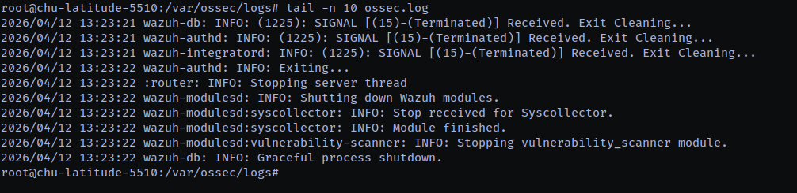

`tail` đặc biệt hữu ích khi làm việc với log, vì các sự kiện mới nhất thường được ghi ở cuối tệp.

## 8.4. Theo dõi log theo thời gian thực với `tail -f`

Tùy chọn `-f` của lệnh `tail` dùng để theo dõi nội dung mới được ghi thêm vào tệp theo thời gian thực.

Cú pháp:

```bash
tail -f <tên_tệp>
```

Ví dụ:

```bash
tail -f /var/log/syslog
```

Lệnh này sẽ hiển thị các dòng cuối của tệp `/var/log/syslog`, đồng thời tiếp tục theo dõi nếu có dòng mới được ghi thêm.

Đây là lệnh rất quan trọng khi giám sát log hệ thống, log dịch vụ hoặc log ứng dụng.


Có thể kết hợp `tail -f` với `grep` để lọc thông tin cần quan tâm:

```bash
tail -f /var/log/auth.log | grep ssh
```

## 8.5. Xem tệp dài với `more`

Lệnh `more` dùng để xem nội dung tệp dài theo từng trang. Thay vì in toàn bộ nội dung ra terminal như `cat`, `more` cho phép người dùng đọc từng phần của tệp.

Cú pháp:

```bash
more <tên_tệp>
```

Khi đang xem bằng `more`, có thể dùng một số phím sau:

| Phím | Chức năng |
|---|---|
| `Space` | Chuyển sang trang tiếp theo |
| `Enter` | Di chuyển xuống từng dòng |
| `q` | Thoát khỏi chế độ xem |

Ví dụ:

```bash
cat ossec.conf | more
```

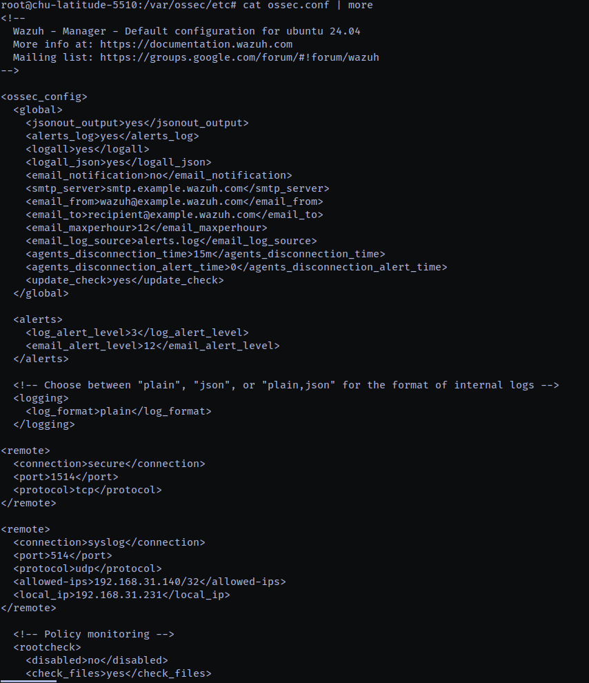

`more` phù hợp khi cần đọc nhanh một tệp dài mà không muốn nội dung trôi toàn bộ trên terminal.

## 8.6. Xem tệp dài với `less`

Lệnh `less` cũng dùng để xem tệp dài theo từng trang, nhưng linh hoạt hơn `more`. Với `less`, người dùng có thể cuộn lên, cuộn xuống, tìm kiếm từ khóa và di chuyển trong tệp dễ dàng hơn.

Cú pháp:

```bash
less <tên_tệp>
```

Một số phím thường dùng trong `less`:

| Phím | Chức năng |
|---|---|
| `Space` | Chuyển sang trang tiếp theo |
| `b` | Quay lại trang trước |
| `↑` / `↓` | Di chuyển lên/xuống từng dòng |
| `/keyword` | Tìm kiếm từ khóa |
| `n` | Chuyển đến kết quả tìm kiếm tiếp theo |
| `q` | Thoát khỏi `less` |

Ví dụ tìm từ khóa `error` trong tệp log:

```bash
less /var/log/syslog
```

Sau đó nhập:

```bash
/error
```

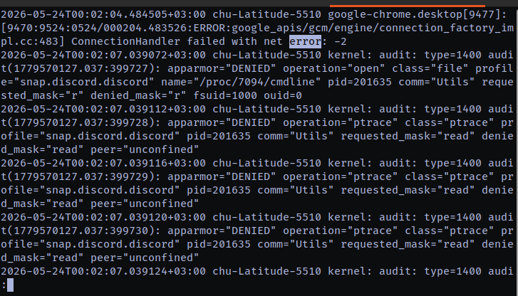

`less` rất phù hợp để đọc log lớn, tệp cấu hình dài hoặc tài liệu văn bản trong terminal.

## 8.7. Chỉnh sửa tệp với Nano

**Nano** là trình soạn thảo văn bản chạy trong terminal, dễ dùng và phù hợp với người mới học Linux. Nano thường được dùng để tạo hoặc chỉnh sửa các tệp văn bản, tệp cấu hình và script đơn giản.

Cú pháp:

```bash
nano <tên_tệp>
```

Ví dụ tạo hoặc mở tệp `notes.txt`:

```bash
nano notes.txt
```

Sau khi chạy lệnh, giao diện Nano sẽ mở ra. Người dùng có thể nhập nội dung trực tiếp, di chuyển bằng các phím mũi tên và chỉnh sửa văn bản giống như một trình soạn thảo cơ bản.

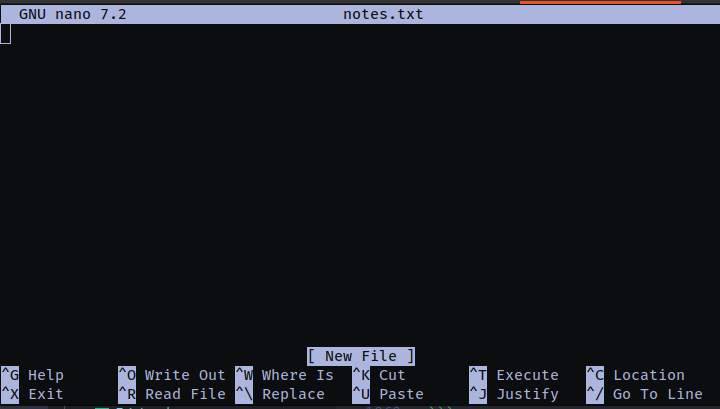

Ví dụ chỉnh sửa tệp cấu hình cần quyền quản trị:

```bash
sudo nano /etc/hosts
```

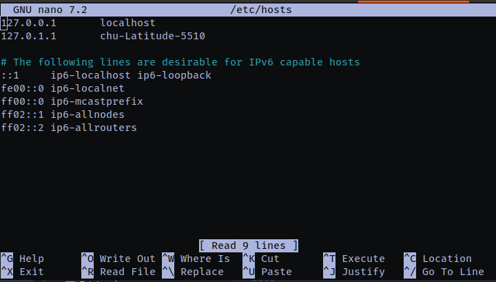

Trong Nano, các phím tắt thường được hiển thị ở cuối màn hình. Ký hiệu `^` trong Nano nghĩa là phím `Ctrl`.

**Các phím tắt cơ bản trong Nano**

Khi sử dụng Nano, người dùng cần nhớ một số phím tắt cơ bản để lưu, thoát, tìm kiếm và chỉnh sửa nội dung.

| Phím tắt | Chức năng |
|---|---|
| `Ctrl + O` | Lưu tệp |
| `Enter` | Xác nhận tên tệp khi lưu |
| `Ctrl + X` | Thoát khỏi Nano |
| `Ctrl + W` | Tìm kiếm trong tệp |
| `Ctrl + K` | Cắt dòng hiện tại |
| `Ctrl + U` | Dán dòng vừa cắt |
| `Ctrl + G` | Mở phần trợ giúp |
| `Ctrl + C` | Hiển thị vị trí dòng/cột hiện tại |

Quy trình lưu và thoát trong Nano:

1. Nhấn `Ctrl + O` để lưu.
2. Nhấn `Enter` để xác nhận tên tệp.
3. Nhấn `Ctrl + X` để thoát.

Nếu chỉnh sửa tệp nhưng chưa lưu, khi nhấn `Ctrl + X`, Nano sẽ hỏi có muốn lưu thay đổi hay không. Người dùng có thể chọn:

| Phím | Ý nghĩa |
|---|---|
| `Y` | Có, lưu thay đổi |
| `N` | Không lưu thay đổi |
| `Ctrl + C` | Hủy thao tác |

Ví dụ, để tìm từ `linux` trong tệp đang mở:

```bash
Ctrl + W
```

Sau đó nhập:

```bash
linux
```

## 8.8. Chỉnh sửa tệp với Vim

**Vim** là một trình soạn thảo văn bản mạnh trong Linux. Vim khó học hơn Nano, nhưng rất linh hoạt và được sử dụng rộng rãi trong quản trị hệ thống, lập trình và làm việc trên máy chủ.

Cú pháp:

```bash
vim <tên_tệp>
```

Ví dụ:

```bash
vim notes.txt
```

Khi mở Vim, người dùng chưa thể gõ văn bản ngay như Nano, vì Vim có nhiều chế độ làm việc khác nhau. Để bắt đầu nhập nội dung, cần chuyển sang chế độ Insert bằng cách nhấn:

```bash
i
```

Sau khi nhập hoặc chỉnh sửa xong, nhấn:

```bash
Esc
```

để quay lại chế độ Normal.

Một số lệnh cơ bản trong Vim:

| Lệnh | Chức năng |
|---|---|
| `i` | Chuyển sang chế độ Insert để nhập văn bản |
| `Esc` | Quay lại chế độ Normal |
| `:w` | Lưu tệp |
| `:q` | Thoát khỏi Vim |
| `:wq` | Lưu và thoát |
| `:q!` | Thoát không lưu |
| `dd` | Xóa dòng hiện tại |
| `yy` | Sao chép dòng hiện tại |
| `p` | Dán nội dung đã sao chép hoặc cắt |

Ví dụ quy trình chỉnh sửa tệp bằng Vim:

```bash
vim notes.txt
```

Sau đó:

1. Nhấn `i` để vào chế độ nhập.
2. Sửa nội dung tệp.
3. Nhấn `Esc`.
4. Gõ `:wq`.
5. Nhấn `Enter` để lưu và thoát.

**Các chế độ cơ bản trong Vim**

Điểm khác biệt lớn nhất của Vim so với Nano là Vim hoạt động theo nhiều chế độ. Mỗi chế độ có mục đích riêng.

Ba chế độ cơ bản cần biết gồm:

| Chế độ | Chức năng |
|---|---|
| Normal mode | Chế độ mặc định, dùng để di chuyển, xóa, sao chép, dán và nhập lệnh |
| Insert mode | Chế độ nhập văn bản |
| Command-line mode | Chế độ nhập lệnh như lưu, thoát, tìm kiếm |

Khi mở Vim, người dùng thường bắt đầu ở **Normal mode**. Ở chế độ này, nếu gõ chữ, Vim sẽ không nhập văn bản như Nano. Muốn nhập nội dung, cần nhấn:

```bash
i
```

để chuyển sang **Insert mode**.

Muốn quay lại Normal mode, nhấn:

```bash
Esc
```

Từ Normal mode, có thể nhập các lệnh bắt đầu bằng dấu `:` để lưu hoặc thoát.

Ví dụ:

```bash
:w
```

Lưu tệp.

```bash
:q
```

Thoát Vim.

```bash
:wq
```

Lưu và thoát.

```bash
:q!
```

Thoát mà không lưu thay đổi.

# 9. Tìm kiếm tệp và thư mục

Trong Linux, hệ thống có thể chứa rất nhiều tệp và thư mục nằm ở nhiều vị trí khác nhau. Vì vậy, người dùng cần biết cách tìm kiếm tệp, thư mục hoặc chương trình một cách hiệu quả. Đây là kỹ năng quan trọng trong quản trị hệ thống, xử lý log, phân tích sự cố và an toàn thông tin.

Các công cụ thường dùng để tìm kiếm gồm `which`, `find`, `locate` và `updatedb`.

## 9.1. Tìm chương trình bằng `which`

Lệnh `which` dùng để xác định đường dẫn đầy đủ của một chương trình hoặc lệnh đang được hệ thống sử dụng.

Cú pháp:

```bash
which <tên_lệnh>
```

Ví dụ:

```bash
which ls
```

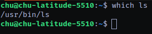

Điều này cho biết lệnh `ls` nằm tại đường dẫn `/usr/bin/ls`.

`which` dùng để tìm vị trí của chương trình thực thi trong hệ thống.

## 9.2. Tìm tệp và thư mục bằng `find`

Lệnh `find` là công cụ mạnh để tìm kiếm tệp và thư mục trong Linux. Lệnh này có thể tìm theo tên, loại đối tượng, kích thước, thời gian chỉnh sửa, chủ sở hữu và nhiều điều kiện khác.

Cú pháp cơ bản:

```bash
find <đường_dẫn_bắt_đầu> <điều_kiện_tìm_kiếm>
```

Ví dụ tìm trong toàn bộ hệ thống:

```bash
find / -name "notes.txt"
```

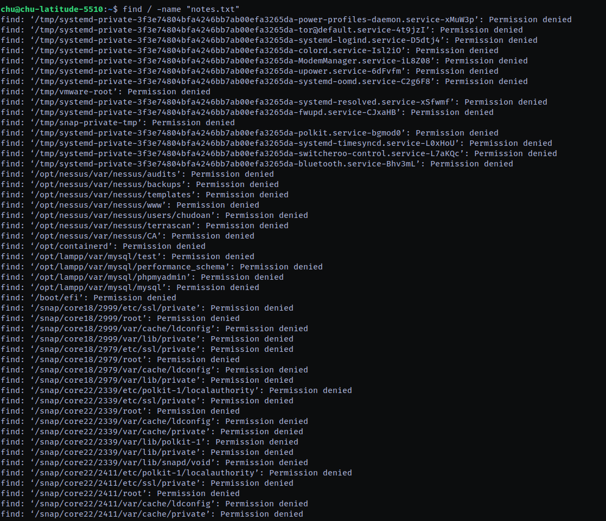

Lệnh này tìm tệp hoặc thư mục tên `notes.txt` bắt đầu từ thư mục gốc `/`.

Tuy nhiên, khi tìm trong toàn bộ hệ thống, người dùng thường gặp lỗi `Permission denied` vì không có quyền truy cập một số thư mục. Khi đó có thể dùng `2>/dev/null` để ẩn lỗi.

### 9.2.1. Tìm theo tên tệp `-name`

Để tìm tệp hoặc thư mục theo tên, sử dụng tùy chọn `-name`.

Cú pháp:

```bash
find <đường_dẫn> -name "<tên_tệp>"
```

Ví dụ, tìm tệp `passwords.txt` trong thư mục hiện tại:

```bash
find . -name "passwords.txt"
```

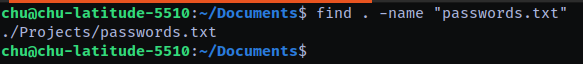

Nếu tệp nằm trong thư mục con, `find` vẫn có thể tìm được vì nó tìm kiếm đệ quy bên trong các thư mục.

Có thể dùng ký tự đại diện `*` để tìm nhiều tệp theo mẫu tên.

Ví dụ, tìm tất cả tệp có đuôi `.txt`:

```bash
find . -name "*.txt"
```

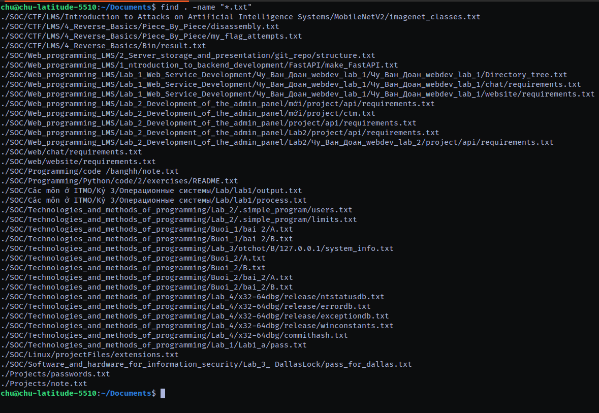

Lưu ý nên đặt mẫu tìm kiếm trong dấu ngoặc kép `" "`, ví dụ `"*.txt"` hoặc `"*.conf"`, để tránh shell tự mở rộng ký tự `*` trước khi lệnh `find` chạy.

### 9.2.2. Tìm theo loại đối tượng `-type`

Trong Linux, `find` có thể tìm theo loại đối tượng bằng tùy chọn `-type`.

Cú pháp:

```bash
find <đường_dẫn> -type <loại>
```

Một số loại thường dùng:

| Tùy chọn | Ý nghĩa |
|---|---|
| `-type f` | Tìm tệp thông thường |
| `-type d` | Tìm thư mục |
| `-type l` | Tìm liên kết tượng trưng |
| `-type b` | Tìm block device |
| `-type c` | Tìm character device |

Tìm tất cả tệp `.log` trong `/var/log`:

```bash
find /var/log -type f -name "*.log"
```

Trong ví dụ trên:

| Thành phần | Ý nghĩa |
|---|---|
| `/var/log` | Bắt đầu tìm trong thư mục log |
| `-type f` | Chỉ tìm tệp thường |
| `-name "*.log"` | Chỉ lấy tệp có đuôi `.log` |

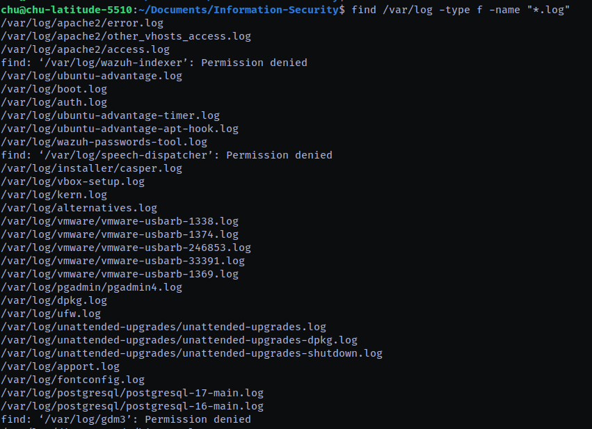

### 9.2.3 Tìm theo kích thước `-size`

Lệnh `find` có thể tìm tệp theo kích thước bằng tùy chọn `-size`.

Cú pháp:

```bash
find <đường_dẫn> -size <kích_thước>
```

Một số đơn vị thường dùng:

| Đơn vị | Ý nghĩa |
|---|---|
| `c` | byte |
| `k` | kilobyte |
| `M` | megabyte |
| `G` | gigabyte |

Có thể dùng dấu `+` hoặc `-` để chỉ định lớn hơn hoặc nhỏ hơn.

| Cách viết | Ý nghĩa |
|---|---|
| `-size +10M` | Lớn hơn 10 MB |
| `-size -10M` | Nhỏ hơn 10 MB |
| `-size 10M` | Xấp xỉ đúng 10 MB |

Ví dụ, tìm các tệp lớn hơn 100 MB trong thư mục home:

```bash
find /home -type f -size +100M
```

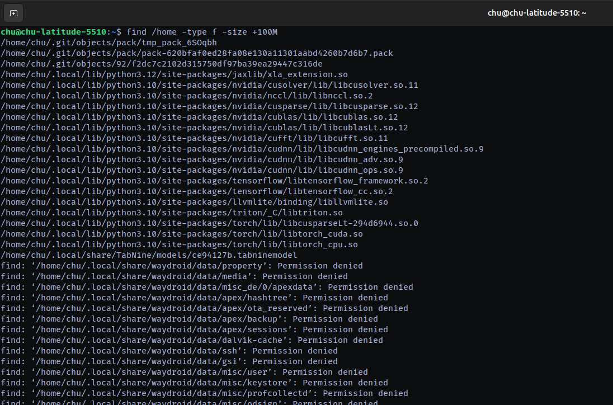

Tìm các tệp nhỏ hơn 1 MB trong thư mục hiện tại:

```bash
find . -type f -size -1M
```

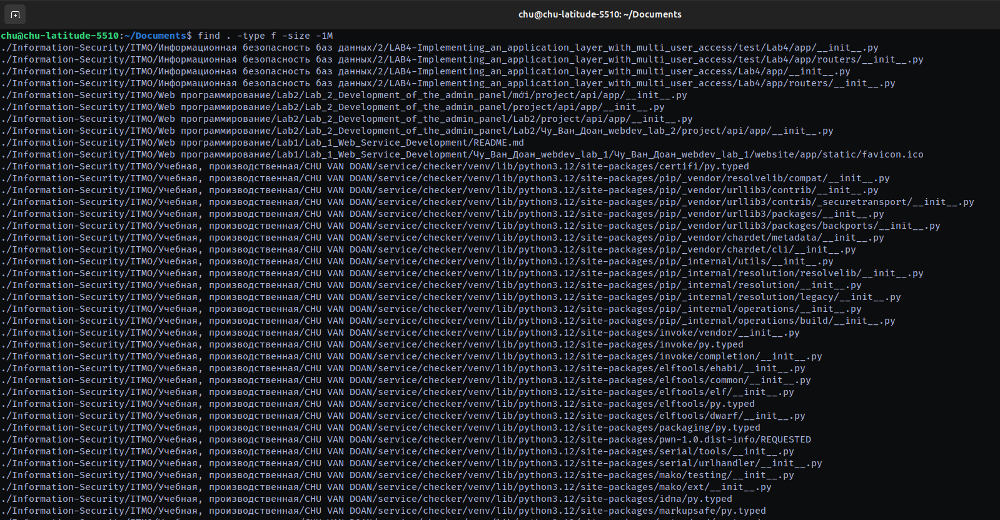

Tìm các tệp cấu hình có kích thước lớn hơn 20 KB:

```bash
find /etc -type f -name "*.conf" -size +20k
```

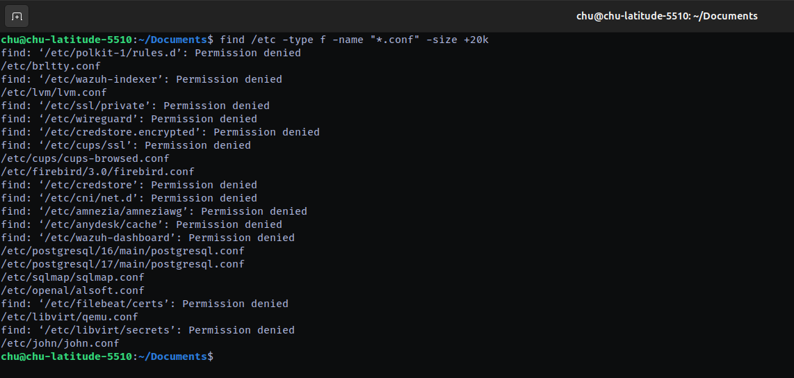

Có thể kết hợp điều kiện để tìm trong một khoảng kích thước.

Ví dụ, tìm tệp lớn hơn 25 KB nhưng nhỏ hơn 28 KB:

```bash
find / -type f -size +25k -size -28k 2>/dev/null
```

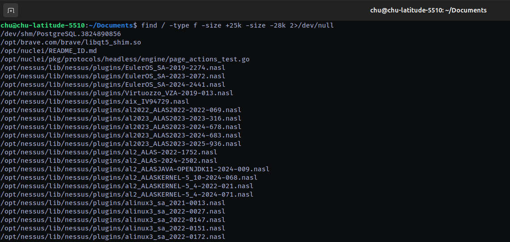

### 9.2.4. Tìm theo thời gian chỉnh sửa

Lệnh `find` có thể tìm tệp theo thời gian chỉnh sửa bằng các tùy chọn như `-mtime`, `-mmin` hoặc `-newermt`.

Một số tùy chọn thường dùng:

| Tùy chọn | Ý nghĩa |
|---|---|
| `-mtime` | Tìm theo số ngày kể từ lần chỉnh sửa cuối |
| `-mmin` | Tìm theo số phút kể từ lần chỉnh sửa cuối |
| `-newermt` | Tìm tệp mới hơn một mốc thời gian cụ thể |

Ví dụ, tìm các tệp được chỉnh sửa trong vòng 1 ngày gần đây:

```bash
find . -type f -mtime -1
```

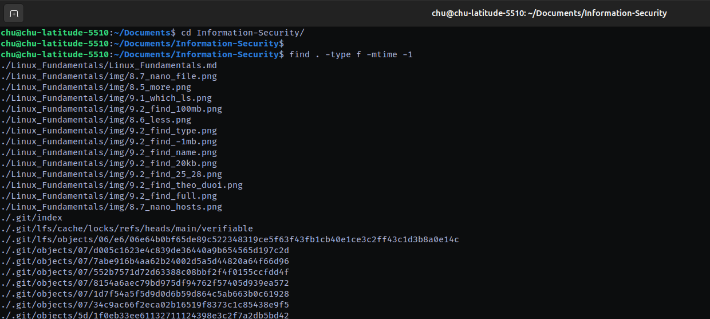

Trong đó:

| Thành phần | Ý nghĩa |
|---|---|
| `-mtime -1` | Chỉnh sửa trong vòng ít hơn 1 ngày |
| `-mtime +7` | Chỉnh sửa cách đây hơn 7 ngày |
| `-mtime 7` | Chỉnh sửa khoảng 7 ngày trước |

Ví dụ, tìm các tệp đã chỉnh sửa hơn 7 ngày trước:

```bash
find . -type f -mtime +7
```

Tìm các tệp được chỉnh sửa trong vòng 30 phút gần đây:

```bash
find . -type f -mmin -30
```

Tìm các tệp mới hơn ngày `2020-03-03`:

```bash
find / -type f -newermt "2020-03-03" 2>/dev/null
```

Tùy chọn thời gian rất hữu ích khi điều tra sự cố, kiểm tra tệp mới được tạo, phát hiện tệp bị thay đổi hoặc phân tích hoạt động bất thường trong hệ thống.

### 9.2.5. Tìm theo chủ sở hữu `-user`

Lệnh `find` có thể tìm tệp hoặc thư mục theo chủ sở hữu bằng tùy chọn `-user`.

Cú pháp:

```bash
find <đường_dẫn> -user <tên_user>
```

Ví dụ, tìm tất cả tệp thuộc sở hữu của user `chu` trong thư mục `/home`:

```bash
find /home -user chu
```

Tìm tất cả tệp thuộc sở hữu của `root` trong `/etc`:

```bash
find /etc -user root
```

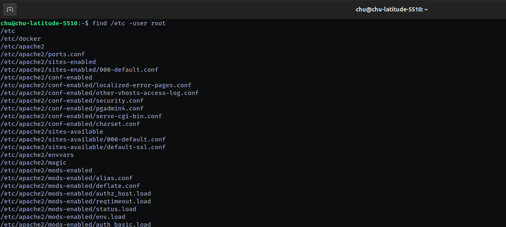

Có thể kết hợp với `-type f` để chỉ tìm tệp thường:

```bash
find /etc -type f -user root
```

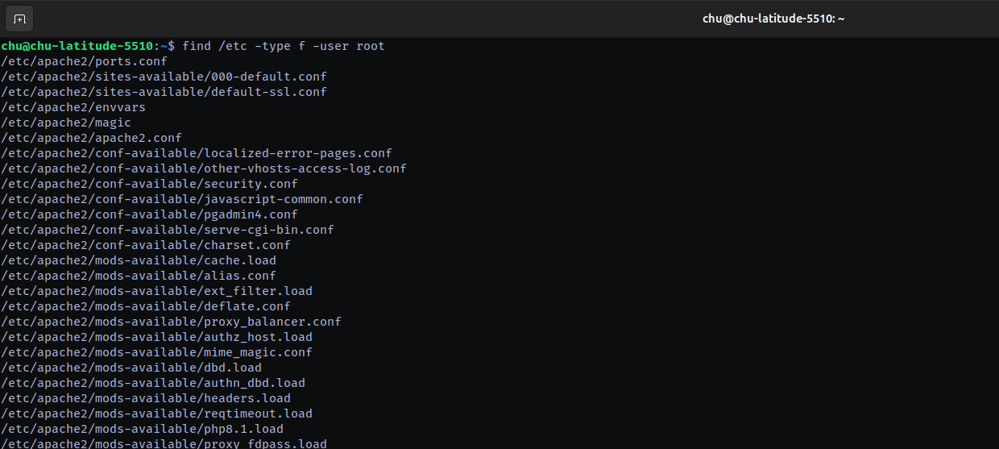

Ví dụ tìm các tệp `.conf` thuộc sở hữu của root:

```bash
find /etc -type f -name "*.conf" -user root
```

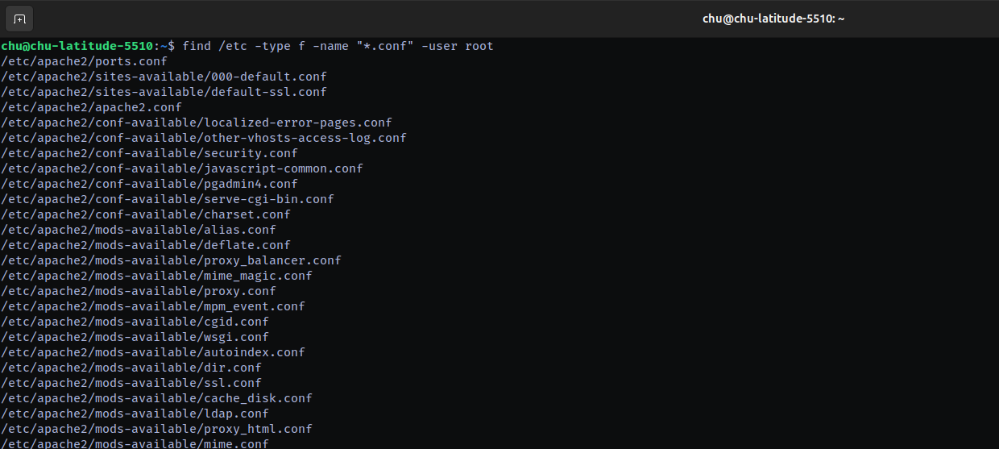

Lệnh này có ý nghĩa:

| Thành phần | Ý nghĩa |
|---|---|
| `/etc` | Tìm trong thư mục cấu hình hệ thống |
| `-type f` | Chỉ tìm tệp thường |
| `-name "*.conf"` | Chỉ tìm tệp cấu hình |
| `-user root` | Chỉ lấy tệp thuộc sở hữu của root |

Tìm theo chủ sở hữu rất hữu ích khi kiểm tra quyền tệp, phát hiện tệp lạ do một user tạo ra hoặc kiểm tra các tệp quan trọng thuộc quyền root.


### 9.2.6. Thực thi lệnh trên kết quả tìm kiếm với `-exec`

Tùy chọn `-exec` cho phép thực thi một lệnh trên từng kết quả mà `find` tìm được. Đây là tính năng rất mạnh, thường dùng để hiển thị chi tiết, xóa, đổi quyền hoặc xử lý hàng loạt tệp.

Cú pháp cơ bản:

```bash
find <đường_dẫn> <điều_kiện> -exec <lệnh> {} \;
```

Trong đó:

| Thành phần | Ý nghĩa |
|---|---|
| `-exec` | Thực thi lệnh trên kết quả tìm kiếm |
| `{}` | Đại diện cho từng kết quả tìm được |
| `\;` | Kết thúc phần lệnh của `-exec` |

Ví dụ, tìm tất cả tệp `.conf` trong `/etc` và hiển thị chi tiết bằng `ls -l`:

```bash
find /etc -type f -name "*.conf" -exec ls -l {} \;
```

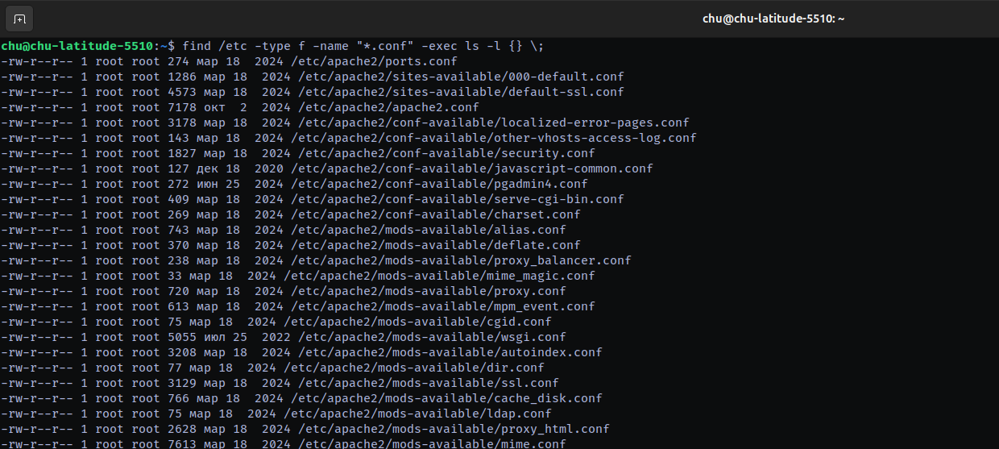

Một ví dụ đầy đủ hơn:

```bash
find / -type f -name "*.conf" -user root -size +25k -size -28k -newermt "2020-03-03" -exec ls -al {} \; 2>/dev/null
```

Lệnh trên tìm các tệp:

- là tệp thường;
- có đuôi `.conf`;
- thuộc sở hữu của `root`;
- lớn hơn 25 KB và nhỏ hơn 28 KB;
- được chỉnh sửa sau ngày `2020-03-03`;
- sau đó hiển thị chi tiết bằng `ls -al`.


### 9.2.7. Ẩn lỗi Permission Denied với `2>/dev/null`

Khi dùng `find` để tìm kiếm trong các thư mục hệ thống, người dùng thường gặp lỗi:

```bash
Permission denied
```

Lỗi này xuất hiện vì user hiện tại không có quyền đọc một số thư mục hoặc tệp.

Ví dụ:

```bash
find / -name "shadow"
```

Khi tìm từ thư mục gốc `/`, hệ thống có thể hiển thị nhiều lỗi `Permission denied`.

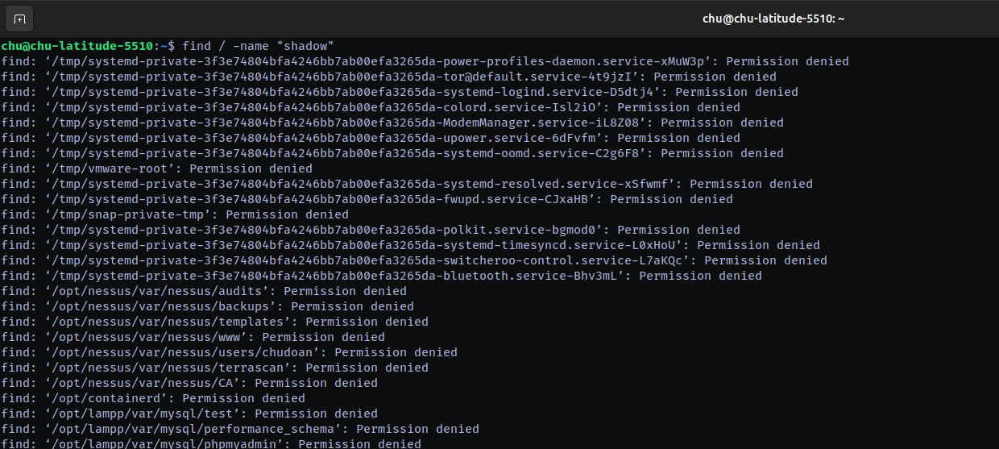

Để ẩn các lỗi này, có thể chuyển hướng lỗi chuẩn `STDERR` vào `/dev/null`:

```bash
find / -name "shadow" 2>/dev/null
```

Trong đó:

| Thành phần | Ý nghĩa |
|---|---|
| `2` | File descriptor của lỗi chuẩn, tức `STDERR` |
| `>` | Chuyển hướng dữ liệu |
| `/dev/null` | Thiết bị đặc biệt dùng để bỏ dữ liệu |

Nói cách khác, `2>/dev/null` nghĩa là: đưa toàn bộ thông báo lỗi vào “thùng rác” của hệ thống, không hiển thị ra terminal.

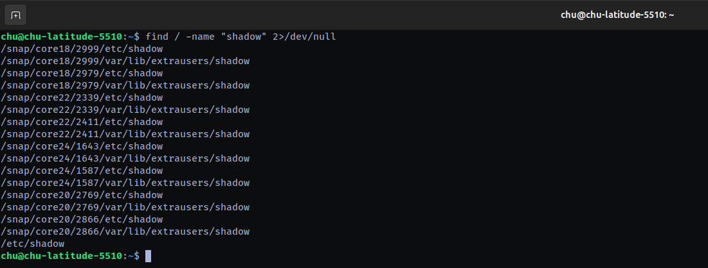

## 9.3. Tìm nhanh bằng `locate`

Lệnh `locate` dùng để tìm tệp và thư mục rất nhanh bằng cách tra cứu trong một cơ sở dữ liệu có sẵn, thay vì quét trực tiếp toàn bộ hệ thống như `find`.

Cú pháp:

```bash
locate <từ_khóa>
```

Ví dụ:

```bash
locate passwd
```

Lệnh này tìm tất cả đường dẫn có chứa từ `passwd`.

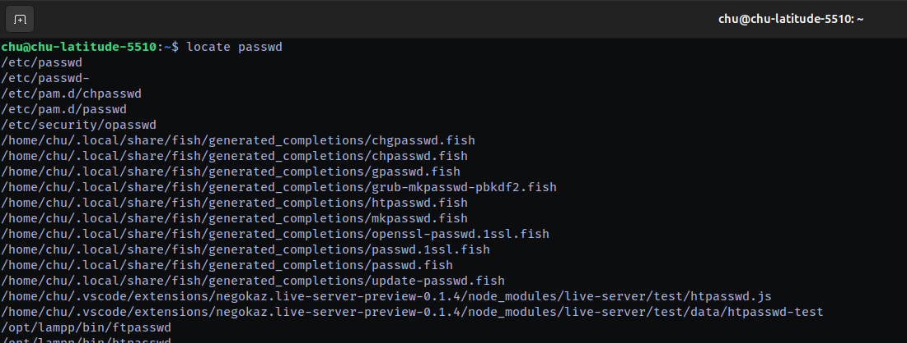


So với `find`, lệnh `locate` thường nhanh hơn rất nhiều vì nó không tìm trực tiếp trên ổ đĩa tại thời điểm chạy lệnh. Thay vào đó, nó tìm trong cơ sở dữ liệu đã được tạo sẵn.

| Công cụ | Đặc điểm |
|---|---|
| `find` | Tìm trực tiếp trong hệ thống tệp, kết quả chính xác theo thời điểm hiện tại |
| `locate` | Tìm trong cơ sở dữ liệu, rất nhanh nhưng có thể chưa cập nhật |

Ví dụ, nếu vừa tạo một tệp mới:

```bash
touch newfile.txt
```

sau đó chạy:

```bash
locate newfile.txt
```

Kết quả chưa thấy kết quả, vì cơ sở dữ liệu của `locate` chưa được cập nhật.

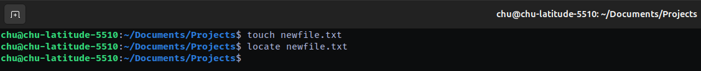

**Cập nhật cơ sở dữ liệu `locate` với `updatedb`**

Vì `locate` dựa trên cơ sở dữ liệu cục bộ, nên cơ sở dữ liệu này cần được cập nhật để phản ánh các tệp và thư mục mới nhất trong hệ thống.

Lệnh dùng để cập nhật cơ sở dữ liệu là `updatedb`.

Cú pháp:

```bash
sudo updatedb
```

Sau khi chạy `updatedb`, lệnh `locate` có thể tìm thấy các tệp mới được tạo gần đây.

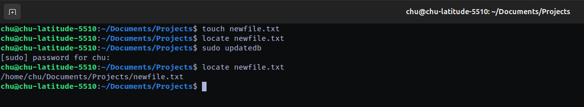

# 10. Bộ mô tả tệp và chuyển hướng dữ liệu

Trong Linux, khi một lệnh được thực thi, nó thường nhận dữ liệu đầu vào, tạo ra kết quả đầu ra và có thể sinh ra thông báo lỗi. Các luồng dữ liệu này được hệ thống quản lý thông qua **file descriptor**. Hiểu file descriptor và chuyển hướng dữ liệu giúp người dùng kiểm soát dữ liệu đi vào và đi ra khỏi lệnh, ghi kết quả vào tệp, ẩn lỗi, đọc dữ liệu từ tệp hoặc kết hợp nhiều lệnh với nhau.

Đây là kiến thức rất quan trọng khi làm việc với Bash, xử lý log, viết script và tự động hóa tác vụ trong Linux.


## 10.1. File Descriptor là gì?

**File Descriptor**, viết tắt là **FD**, là một số định danh do hệ điều hành sử dụng để quản lý các luồng vào/ra của một tiến trình. Trong Linux, mọi tiến trình khi chạy thường có ba file descriptor mặc định:

| File Descriptor | Tên | Ý nghĩa |
|---|---|---|
| `0` | STDIN | Đầu vào chuẩn |
| `1` | STDOUT | Đầu ra chuẩn |
| `2` | STDERR | Lỗi chuẩn |

Có thể hiểu đơn giản như sau:

- **STDIN** là nơi lệnh nhận dữ liệu đầu vào;
- **STDOUT** là nơi lệnh đưa kết quả bình thường ra;
- **STDERR** là nơi lệnh đưa thông báo lỗi ra.

Ví dụ, khi chạy:

```bash
ls
```

kết quả danh sách tệp được hiển thị trên màn hình chính là **STDOUT**.

Nếu chạy:

```bash
ls /not_exist
```

và thư mục `/not_exist` không tồn tại, thông báo lỗi được hiển thị chính là **STDERR**.

Tóm lại, file descriptor là cách Linux phân biệt các luồng dữ liệu khác nhau của một chương trình. Nhờ đó, người dùng có thể chuyển hướng kết quả, lỗi hoặc đầu vào theo ý muốn.

## 10.2. STDIN — Standard Input

**STDIN**, hay **Standard Input**, là đầu vào chuẩn của một chương trình. Trong Linux, STDIN có file descriptor là `0`.

Theo mặc định, STDIN thường lấy dữ liệu từ bàn phím. Khi người dùng nhập dữ liệu vào terminal, dữ liệu đó được gửi đến chương trình thông qua STDIN.

Ví dụ:

```bash
cat
```

Khi chạy lệnh này mà không truyền tên tệp, `cat` sẽ chờ người dùng nhập dữ liệu từ bàn phím. Sau khi nhập một dòng và nhấn `Enter`, `cat` sẽ in lại dòng đó ra màn hình.

Ví dụ:

```bash
cat
Hello Linux
Hello Linux
```

Trong ví dụ trên:

- dòng `Hello Linux` đầu tiên là dữ liệu người dùng nhập vào;
- dòng `Hello Linux` thứ hai là kết quả mà `cat` in ra.

Để kết thúc nhập dữ liệu, có thể nhấn:

```bash
Ctrl + D
```

STDIN rất quan trọng khi dùng chuyển hướng đầu vào hoặc pipe. Ví dụ, thay vì nhập dữ liệu từ bàn phím, có thể cho một chương trình đọc dữ liệu từ tệp bằng ký hiệu `<`.

Tóm lại, STDIN là luồng dữ liệu đầu vào chuẩn, thường đến từ bàn phím hoặc từ một tệp/lệnh khác.

## 10.3. STDOUT — Standard Output

**STDOUT**, hay **Standard Output**, là đầu ra chuẩn của một chương trình. Trong Linux, STDOUT có file descriptor là `1`.

Theo mặc định, STDOUT được hiển thị trực tiếp trên màn hình terminal.

Ví dụ:

```bash
echo "Hello Linux"
```

Kết quả:

```bash
Hello Linux
```

Dòng `Hello Linux` chính là dữ liệu được gửi ra STDOUT.

Ví dụ khác:

```bash
ls
```

Kết quả danh sách tệp và thư mục cũng được gửi ra STDOUT.

STDOUT có thể được chuyển hướng vào tệp bằng ký hiệu `>` hoặc `>>`.

Ví dụ:

```bash
echo "Hello Linux" > output.txt
```

Lệnh trên không hiển thị kết quả ra màn hình, mà ghi kết quả vào tệp `output.txt`.

Tóm lại, STDOUT là nơi chương trình đưa ra kết quả bình thường. Theo mặc định, nó hiển thị trên terminal, nhưng có thể chuyển hướng vào tệp hoặc truyền sang lệnh khác.


## 10.4. STDERR — Standard Error

**STDERR**, hay **Standard Error**, là luồng lỗi chuẩn của một chương trình. Trong Linux, STDERR có file descriptor là `2`.

STDERR được dùng để hiển thị các thông báo lỗi hoặc cảnh báo trong quá trình thực thi lệnh.

Ví dụ:

```bash
ls /not_exist
```

Nếu thư mục `/not_exist` không tồn tại, kết quả có thể là:

```bash
ls: cannot access '/not_exist': No such file or directory
```

Thông báo này không phải STDOUT, mà là STDERR.

Việc tách riêng STDOUT và STDERR rất hữu ích vì người dùng có thể lưu kết quả bình thường vào một tệp, còn lỗi vào một tệp khác.

Ví dụ:

```bash
find /etc -name "passwd" 1> output.txt 2> error.txt
```

Trong đó:

| Thành phần | Ý nghĩa |
|---|---|
| `1> output.txt` | Ghi STDOUT vào tệp `output.txt` |
| `2> error.txt` | Ghi STDERR vào tệp `error.txt` |

Tóm lại, STDERR là luồng dành riêng cho thông báo lỗi. Nhờ có STDERR, người dùng có thể xử lý lỗi riêng biệt với kết quả bình thường.

## 10.5. Chuyển hướng đầu ra với `>`

Ký hiệu `>` dùng để chuyển hướng STDOUT vào một tệp. Nếu tệp chưa tồn tại, hệ thống sẽ tạo tệp mới. Nếu tệp đã tồn tại, nội dung cũ sẽ bị ghi đè.

Cú pháp:

```bash
command > file
```

Ví dụ:

```bash
echo "Hello Linux" > hello.txt
```

Lệnh trên ghi dòng chữ `Hello Linux` vào tệp `hello.txt`.

Kiểm tra nội dung tệp:

```bash
cat hello.txt
```

Kết quả:

```bash
Hello Linux
```

Ví dụ khác:

```bash
ls > files.txt
```

Lệnh này ghi danh sách tệp và thư mục trong thư mục hiện tại vào tệp `files.txt`.

Cần chú ý rằng `>` sẽ ghi đè nội dung cũ.

Ví dụ:

```bash
echo "Line 1" > test.txt
echo "Line 2" > test.txt
cat test.txt
```

Kết quả:

```bash
Line 2
```

Dòng `Line 1` đã bị ghi đè bởi `Line 2`.

Tóm lại, `>` dùng để ghi kết quả đầu ra của lệnh vào tệp, nhưng cần cẩn thận vì nó sẽ thay thế nội dung cũ nếu tệp đã tồn tại.


## 10.6. Ghi thêm đầu ra với `>>`

Ký hiệu `>>` dùng để ghi thêm STDOUT vào cuối tệp, thay vì ghi đè nội dung cũ.

Cú pháp:

```bash
command >> file
```

Ví dụ:

```bash
echo "Line 1" > test.txt
echo "Line 2" >> test.txt
cat test.txt
```

Kết quả:

```bash
Line 1
Line 2
```

Trong ví dụ trên:

- `>` tạo tệp và ghi dòng đầu tiên;
- `>>` ghi thêm dòng thứ hai vào cuối tệp.

Ví dụ khác:

```bash
date >> log.txt
```

Lệnh này ghi thêm thời gian hiện tại vào cuối tệp `log.txt`.

Có thể dùng `>>` để lưu kết quả nhiều lần vào cùng một tệp:

```bash
whoami >> report.txt
hostname >> report.txt
uname -a >> report.txt
```

Tệp `report.txt` sẽ chứa kết quả của cả ba lệnh.

Tóm lại, `>>` dùng để ghi thêm dữ liệu vào cuối tệp. Đây là lựa chọn an toàn hơn `>` khi không muốn mất nội dung cũ.


## 10.7. Chuyển hướng lỗi với `2>`

Ký hiệu `2>` dùng để chuyển hướng STDERR, tức luồng lỗi chuẩn, vào một tệp.

Cú pháp:

```bash
command 2> error.log
```

Ví dụ:

```bash
ls /not_exist 2> error.log
```

Lệnh trên sẽ không hiển thị lỗi ra màn hình, mà ghi lỗi vào tệp `error.log`.

Kiểm tra nội dung tệp lỗi:

```bash
cat error.log
```

Kết quả có thể là:

```bash
ls: cannot access '/not_exist': No such file or directory
```

Có thể tách STDOUT và STDERR vào hai tệp khác nhau:

```bash
find /etc -name "passwd" 1> output.txt 2> error.txt
```

Trong đó:

| Thành phần | Ý nghĩa |
|---|---|
| `1> output.txt` | Ghi kết quả bình thường vào `output.txt` |
| `2> error.txt` | Ghi lỗi vào `error.txt` |

Trong thực tế, `2>` rất hữu ích khi chạy các lệnh có thể tạo nhiều lỗi, ví dụ `find` trên toàn bộ hệ thống.

Tóm lại, `2>` dùng để chuyển hướng thông báo lỗi vào tệp, giúp người dùng lưu lại lỗi hoặc làm sạch màn hình terminal.

## 10.8. Chuyển hướng lỗi vào `/dev/null`

`/dev/null` là một thiết bị đặc biệt trong Linux, thường được gọi là “thùng rác” của hệ thống. Dữ liệu được chuyển vào `/dev/null` sẽ bị bỏ đi và không hiển thị nữa.

Cú pháp thường dùng:

```bash
command 2>/dev/null
```

Ví dụ:

```bash
find / -name "passwd" 2>/dev/null
```

Lệnh trên tìm các tệp có tên `passwd` trong toàn bộ hệ thống, nhưng ẩn các lỗi như `Permission denied`.

Trong đó:

| Thành phần | Ý nghĩa |
|---|---|
| `2` | File descriptor của STDERR |
| `>` | Chuyển hướng |
| `/dev/null` | Nơi bỏ dữ liệu, không hiển thị ra màn hình |

Ví dụ khác:

```bash
find / -type f -name "*.conf" 2>/dev/null
```

Lệnh này chỉ hiển thị các kết quả tìm kiếm hợp lệ, không hiển thị lỗi do thiếu quyền truy cập.

Cần hiểu rằng `2>/dev/null` không sửa lỗi, mà chỉ ẩn lỗi khỏi màn hình. Vì vậy, khi cần phân tích nguyên nhân lỗi, không nên chuyển lỗi vào `/dev/null`, mà nên lưu vào tệp log:

```bash
command 2> error.log
```

Tóm lại, `2>/dev/null` dùng để bỏ qua thông báo lỗi, giúp đầu ra gọn hơn khi người dùng chỉ quan tâm đến kết quả chính.


## 10.9. Chuyển hướng đầu vào với `<`

Ký hiệu `<` dùng để chuyển hướng STDIN từ một tệp vào một lệnh. Thay vì nhập dữ liệu từ bàn phím, lệnh sẽ đọc dữ liệu từ tệp.

Cú pháp:

```bash
command < file
```

Ví dụ:

```bash
cat < hello.txt
```

Lệnh trên đọc nội dung từ tệp `hello.txt` thông qua STDIN và hiển thị ra màn hình.

Ví dụ khác:

```bash
wc -l < hello.txt
```

Lệnh này đếm số dòng trong tệp `hello.txt`.

So sánh hai cách sau:

```bash
wc -l hello.txt
```

và:

```bash
wc -l < hello.txt
```

Cả hai đều có thể đếm số dòng, nhưng có sự khác biệt nhỏ về đầu ra. Khi dùng tên tệp trực tiếp, `wc` thường hiển thị cả số dòng và tên tệp. Khi dùng `<`, `wc` chỉ nhận nội dung từ STDIN nên thường chỉ hiển thị số dòng.

Ví dụ:

```bash
wc -l hello.txt
```

Kết quả:

```bash
3 hello.txt
```

Còn:

```bash
wc -l < hello.txt
```

Kết quả:

```bash
3
```

Tóm lại, `<` dùng để đưa nội dung của tệp vào lệnh dưới dạng đầu vào chuẩn.


## 10.10. Here Document với `<< EOF`

**Here Document** là cách truyền nhiều dòng dữ liệu trực tiếp vào một lệnh thông qua STDIN. Cú pháp thường dùng là `<< EOF`.

Cú pháp cơ bản:

```bash
command << EOF
nội dung dòng 1
nội dung dòng 2
EOF
```

Trong đó, `EOF` là dấu kết thúc nội dung. Khi shell gặp dòng `EOF`, nó hiểu rằng phần nhập dữ liệu đã kết thúc.

Ví dụ:

```bash
cat << EOF
Hello Linux
This is a here document.
EOF
```

Kết quả:

```bash
Hello Linux
This is a here document.
```

Here Document thường được dùng để tạo tệp nhiều dòng.

Ví dụ:

```bash
cat << EOF > note.txt
Line 1
Line 2
Line 3
EOF
```

Kiểm tra nội dung tệp:

```bash
cat note.txt
```

Kết quả:

```bash
Line 1
Line 2
Line 3
```

Có thể dùng Here Document trong Bash script để tạo file cấu hình hoặc ghi nội dung nhiều dòng.

Ví dụ:

```bash
cat << EOF > config.txt
username=admin
host=localhost
port=8080
EOF
```

Lưu ý rằng `EOF` không bắt buộc phải là từ `EOF`. Người dùng có thể dùng một từ khác, miễn là từ mở đầu và kết thúc giống nhau.

Ví dụ:

```bash
cat << END
Hello
END
```

Tóm lại, Here Document giúp truyền nhiều dòng dữ liệu vào một lệnh một cách rõ ràng và tiện lợi, đặc biệt hữu ích khi viết script.

## 10.11. Pipes và cách kết hợp lệnh bằng `|`

Ký hiệu pipe `|` dùng để lấy STDOUT của lệnh bên trái làm STDIN cho lệnh bên phải. Đây là một trong những cơ chế mạnh nhất trong Linux, vì nó cho phép kết hợp nhiều lệnh nhỏ để xử lý dữ liệu phức tạp.

Cú pháp:

```bash
command1 | command2
```

Ví dụ:

```bash
ls | wc -l
```

Trong lệnh trên:

| Thành phần | Ý nghĩa |
|---|---|
| `ls` | Liệt kê tệp và thư mục |
| `|` | Chuyển kết quả của `ls` sang lệnh tiếp theo |
| `wc -l` | Đếm số dòng |

Kết quả là số lượng dòng đầu ra của lệnh `ls`, tức có thể hiểu là số lượng mục được liệt kê.

Ví dụ lọc kết quả bằng `grep`:

```bash
cat /etc/passwd | grep root
```

Lệnh này đọc nội dung `/etc/passwd`, sau đó lọc các dòng có chứa từ `root`.

Tuy nhiên, có thể viết gọn hơn:

```bash
grep root /etc/passwd
```

Pipe đặc biệt hữu ích khi xử lý log.

Ví dụ:

```bash
cat /var/log/auth.log | grep ssh
```

Lệnh này hiển thị các dòng log có chứa từ `ssh`.

Có thể kết hợp nhiều pipe:

```bash
cat /var/log/auth.log | grep ssh | wc -l
```

Lệnh này đếm số dòng log có chứa từ `ssh`.

Ví dụ khác:

```bash
find / -type f -name "*.bak" 2>/dev/null | nl
```

Trong đó:

| Thành phần | Ý nghĩa |
|---|---|
| `find / -type f -name "*.bak"` | Tìm tất cả tệp có đuôi `.bak` |
| `2>/dev/null` | Ẩn lỗi thiếu quyền truy cập |
| `| nl` | Đánh số dòng kết quả |

Tóm lại, pipe `|` giúp kết hợp nhiều lệnh lại với nhau. Đây là nền tảng quan trọng trong triết lý Linux: mỗi công cụ làm một việc nhỏ, sau đó kết hợp chúng để giải quyết tác vụ lớn hơn.

# 11. Lọc và xử lý nội dung văn bản

Trong Linux, nhiều dữ liệu quan trọng được lưu dưới dạng văn bản, ví dụ như log hệ thống, log dịch vụ, file cấu hình, danh sách tiến trình, danh sách gói phần mềm hoặc kết quả đầu ra của các lệnh. Vì vậy, người dùng cần biết cách lọc, tìm kiếm, cắt cột, sắp xếp, loại bỏ dữ liệu trùng lặp và phân tích nội dung văn bản trực tiếp trong terminal.

Các công cụ quan trọng trong phần này gồm `grep`, `awk`, `sed`, `cut`, `sort`, `uniq`, `wc`, `nl`, `diff` và `jq`.

## 11.1. Lọc nội dung với `grep`

Lệnh `grep` dùng để tìm kiếm các dòng có chứa một mẫu văn bản trong tệp hoặc trong đầu ra của lệnh khác. Đây là một trong những lệnh quan trọng nhất khi xử lý log và văn bản trong Linux.

Cú pháp cơ bản:

```bash
grep "từ_khóa" <tên_tệp>
```

Ví dụ, tìm các dòng có chứa từ `error` trong tệp `logfile.txt`:

```bash
grep "error" logfile.txt
```

Nếu tệp có nội dung:

```bash
system started
error: failed login
user connected
error: permission denied
```

Kết quả sẽ là:

```bash
error: failed login
error: permission denied
```

`grep` cũng thường được kết hợp với pipe `|` để lọc kết quả từ lệnh khác.

Ví dụ:

```bash
cat /var/log/syslog | grep "error"
```

Lệnh trên đọc nội dung `/var/log/syslog`, sau đó chỉ hiển thị các dòng có chứa từ `error`.

Có thể viết gọn hơn:

```bash
grep "error" /var/log/syslog
```


### 11.1.1. Tìm kiếm không phân biệt hoa thường với `grep -i`

Theo mặc định, `grep` phân biệt chữ hoa và chữ thường. Điều này có nghĩa là `error`, `Error` và `ERROR` được xem là các chuỗi khác nhau.

Để tìm kiếm không phân biệt hoa thường, dùng tùy chọn `-i`.

Cú pháp:

```bash
grep -i "từ_khóa" <tên_tệp>
```

Ví dụ:

```bash
grep -i "error" logfile.txt
```

Lệnh này sẽ tìm cả:

```bash
error
Error
ERROR
eRrOr
```

Ví dụ khi phân tích log:

```bash
grep -i "failed" /var/log/auth.log
```

Lệnh trên tìm tất cả các dòng có chứa từ `failed`, bất kể chữ hoa hay chữ thường.

Tùy chọn `-i` rất hữu ích khi không chắc dữ liệu trong tệp được viết theo dạng nào.

Tóm lại, `grep -i` giúp tìm kiếm linh hoạt hơn bằng cách bỏ qua sự khác biệt giữa chữ hoa và chữ thường.


### 11.1.2. Tìm kiếm đệ quy với `grep -r`

Tùy chọn `-r` của `grep` dùng để tìm kiếm đệ quy trong một thư mục và toàn bộ các thư mục con bên trong.

Cú pháp:

```bash
grep -r "từ_khóa" <thư_mục>
```

Ví dụ, tìm từ `password` trong tất cả tệp bên trong thư mục hiện tại:

```bash
grep -r "password" .
```

Trong đó:

| Thành phần | Ý nghĩa |
|---|---|
| `grep` | Lệnh tìm kiếm văn bản |
| `-r` | Tìm kiếm đệ quy |
| `"password"` | Từ khóa cần tìm |
| `.` | Thư mục hiện tại |

Ví dụ tìm từ `Listen` trong thư mục cấu hình Apache:

```bash
grep -r "Listen" /etc/apache2
```

Lệnh này sẽ tìm trong tất cả tệp bên trong `/etc/apache2` và các thư mục con của nó.

Trong an toàn thông tin, `grep -r` thường được dùng để tìm nhanh thông tin nhạy cảm trong mã nguồn hoặc thư mục cấu hình, ví dụ:

```bash
grep -r "api_key" .
grep -r "token" .
grep -r "password" .
```

Tóm lại, `grep -r` dùng để tìm kiếm nội dung trong nhiều tệp và nhiều thư mục con cùng lúc.


### 11.1.3 Hiển thị số dòng với `grep -n`

Tùy chọn `-n` dùng để hiển thị số dòng chứa kết quả khớp. Điều này rất hữu ích khi cần biết chính xác dòng nào trong tệp có chứa nội dung cần tìm.

Cú pháp:

```bash
grep -n "từ_khóa" <tên_tệp>
```

Ví dụ:

```bash
grep -n "error" logfile.txt
```

Kết quả có thể là:

```bash
2:error: failed login
4:error: permission denied
```

Trong kết quả trên:

| Phần | Ý nghĩa |
|---|---|
| `2` | Dòng số 2 trong tệp |
| `4` | Dòng số 4 trong tệp |
| Nội dung sau dấu `:` | Dòng có chứa từ khóa cần tìm |

Có thể kết hợp nhiều tùy chọn:

```bash
grep -in "error" logfile.txt
```

Lệnh trên vừa tìm không phân biệt hoa thường, vừa hiển thị số dòng.

Tóm lại, `grep -n` giúp xác định vị trí chính xác của dòng khớp trong tệp, thuận tiện khi cần chỉnh sửa hoặc trích dẫn nội dung.

### 11.1.4 Loại trừ dòng khớp với `grep -v`

Tùy chọn `-v` của `grep` dùng để hiển thị các dòng **không khớp** với mẫu tìm kiếm. Nói cách khác, nó loại bỏ các dòng chứa từ khóa được chỉ định.

Cú pháp:

```bash
grep -v "từ_khóa" <tên_tệp>
```

Ví dụ, loại bỏ các dòng chứa từ `error`:

```bash
grep -v "error" logfile.txt
```

Nếu tệp có nội dung:

```bash
system started
error: failed login
user connected
error: permission denied
```

Kết quả sẽ là:

```bash
system started
user connected
```

`grep -v` rất hữu ích khi cần loại bỏ dữ liệu không cần thiết.

Ví dụ, hiển thị các dòng trong `/etc/passwd` không chứa từ `nologin`:

```bash
grep -v "nologin" /etc/passwd
```

Có thể kết hợp với pipe:

```bash
cat /var/log/auth.log | grep -i "ssh" | grep -v "Accepted"
```

Lệnh trên tìm các dòng liên quan đến SSH nhưng loại bỏ các dòng đăng nhập thành công có chứa từ `Accepted`.

Tóm lại, `grep -v` dùng để loại trừ dòng khớp với mẫu, giúp lọc dữ liệu theo hướng ngược lại.


## 11.2. Xử lý cột với `awk`

`awk` là công cụ mạnh dùng để xử lý văn bản theo cột. Nó rất hữu ích khi dữ liệu có cấu trúc theo dòng và cột, ví dụ như log, file CSV, kết quả lệnh `ps`, `df`, `ls -l` hoặc `/etc/passwd`.

Cú pháp cơ bản:

```bash
awk '{print $cột}' <tên_tệp>
```

Ví dụ:

```bash
echo "one two three" | awk '{print $2}'
```

Kết quả:

```bash
two
```

Trong `awk`, các cột được đánh số như sau:

| Ký hiệu | Ý nghĩa |
|---|---|
| `$1` | Cột thứ nhất |
| `$2` | Cột thứ hai |
| `$3` | Cột thứ ba |
| `$0` | Toàn bộ dòng |

Ví dụ:

```bash
echo "user1 192.168.1.10 success" | awk '{print $1}'
```

Kết quả:

```bash
user1
```

Có thể in nhiều cột:

```bash
echo "user1 192.168.1.10 success" | awk '{print $1, $3}'
```

Kết quả:

```bash
user1 success
```

Với tệp có dấu phân tách đặc biệt, dùng tùy chọn `-F`.

Ví dụ, tệp `/etc/passwd` dùng dấu `:` để phân tách các trường:

```bash
awk -F ':' '{print $1}' /etc/passwd
```

Lệnh trên in ra danh sách tên người dùng trong hệ thống.

Ví dụ in tên user và shell đăng nhập:

```bash
awk -F ':' '{print $1, $7}' /etc/passwd
```

Tóm lại, `awk` rất phù hợp khi cần trích xuất dữ liệu theo cột hoặc xử lý dòng văn bản có cấu trúc.


## 11.3. Chỉnh sửa dòng văn bản với `sed`

`sed`, viết đầy đủ là **stream editor**, là công cụ dùng để xử lý và chỉnh sửa văn bản theo dòng. `sed` thường được dùng để tìm kiếm, thay thế, xóa hoặc in các dòng khớp với mẫu.

Cú pháp thay thế cơ bản:

```bash
sed 's/mẫu_cũ/mẫu_mới/' <tên_tệp>
```

Ví dụ:

```bash
echo "Hello World" | sed 's/World/Linux/'
```

Kết quả:

```bash
Hello Linux
```

Trong đó:

| Thành phần | Ý nghĩa |
|---|---|
| `s` | Substitute, tức thay thế |
| `World` | Chuỗi cần thay |
| `Linux` | Chuỗi thay thế |

Theo mặc định, `sed` chỉ thay thế lần xuất hiện đầu tiên trong mỗi dòng. Để thay tất cả các lần xuất hiện trong dòng, dùng `g`.

Ví dụ:

```bash
echo "cat cat cat" | sed 's/cat/dog/g'
```

Kết quả:

```bash
dog dog dog
```

Có thể dùng `sed` để chỉ in các dòng khớp với mẫu:

```bash
sed -n '/error/p' logfile.txt
```

Trong đó:

| Thành phần | Ý nghĩa |
|---|---|
| `-n` | Không in toàn bộ nội dung |
| `/error/p` | Chỉ in dòng có chứa `error` |

Có thể xóa một dòng cụ thể:

```bash
sed '2d' file.txt
```

Lệnh trên xóa dòng thứ 2 trong kết quả hiển thị.

Muốn chỉnh sửa trực tiếp trong tệp, dùng tùy chọn `-i`:

```bash
sed -i 's/old/new/g' file.txt
```

Cần cẩn thận với `sed -i`, vì nó sửa trực tiếp nội dung tệp. Khi mới học, nên chạy không có `-i` trước để kiểm tra kết quả.

Tóm lại, `sed` là công cụ mạnh để thay thế và chỉnh sửa văn bản tự động trong terminal hoặc Bash script.


## 11.4. Cắt cột với `cut`

Lệnh `cut` dùng để trích xuất một phần cụ thể từ mỗi dòng văn bản. Công cụ này thường được dùng để cắt theo ký tự, theo byte hoặc theo cột với dấu phân tách.

Cú pháp thường dùng:

```bash
cut -d '<ký_tự_phân_tách>' -f <số_cột> <tên_tệp>
```

Ví dụ:

```bash
echo "a,b,c" | cut -d ',' -f 2
```

Kết quả:

```bash
b
```

Trong đó:

| Thành phần | Ý nghĩa |
|---|---|
| `-d ','` | Dấu phân tách là dấu phẩy |
| `-f 2` | Lấy cột thứ hai |

Ví dụ lấy tên user từ `/etc/passwd`:

```bash
cut -d ':' -f 1 /etc/passwd
```

Lấy cả cột 1 và cột 7:

```bash
cut -d ':' -f 1,7 /etc/passwd
```

Cũng có thể cắt theo vị trí ký tự bằng tùy chọn `-c`.

Ví dụ:

```bash
echo "Linux" | cut -c 1-3
```

Kết quả:

```bash
Lin
```

So với `awk`, `cut` đơn giản hơn và rất nhanh khi dữ liệu có dấu phân tách rõ ràng.

Tóm lại, `cut` phù hợp khi cần lấy một hoặc một vài cột cụ thể từ dữ liệu văn bản có cấu trúc.


## 11.5. Sắp xếp dữ liệu với `sort`

Lệnh `sort` dùng để sắp xếp các dòng văn bản theo thứ tự tăng dần, giảm dần hoặc theo cột.

Cú pháp:

```bash
sort <tên_tệp>
```

Ví dụ, tệp `names.txt` có nội dung:

```bash
Charlie
Alice
Bob
```

Chạy:

```bash
sort names.txt
```

Kết quả:

```bash
Alice
Bob
Charlie
```

Một số tùy chọn thường dùng:

| Tùy chọn | Ý nghĩa |
|---|---|
| `-n` | Sắp xếp theo số |
| `-r` | Đảo ngược thứ tự |
| `-k` | Sắp xếp theo cột cụ thể |
| `-u` | Sắp xếp và loại bỏ dòng trùng lặp |

Ví dụ sắp xếp theo số:

```bash
sort -n numbers.txt
```

Sắp xếp giảm dần:

```bash
sort -r names.txt
```

Sắp xếp theo cột thứ hai:

```bash
sort -k 2 data.txt
```

Sắp xếp và loại bỏ trùng lặp:

```bash
sort -u names.txt
```

`sort` thường được kết hợp với `uniq` để thống kê dữ liệu.

Ví dụ:

```bash
cat access.log | awk '{print $1}' | sort | uniq -c
```

Lệnh trên trích xuất cột đầu tiên, sắp xếp và đếm số lần xuất hiện của từng giá trị.

Tóm lại, `sort` giúp sắp xếp dữ liệu văn bản, là bước quan trọng trước khi dùng `uniq`.


## 11.6. Loại bỏ dòng trùng lặp với `uniq`

Lệnh `uniq` dùng để loại bỏ hoặc thống kê các dòng trùng lặp liền kề nhau. Vì `uniq` chỉ xử lý các dòng trùng nhau nằm cạnh nhau, nên thường cần kết hợp với `sort`.

Cú pháp:

```bash
uniq <tên_tệp>
```

Ví dụ, tệp `names.txt` có nội dung:

```bash
Alice
Alice
Bob
Bob
Charlie
```

Chạy:

```bash
uniq names.txt
```

Kết quả:

```bash
Alice
Bob
Charlie
```

Nếu các dòng trùng không nằm cạnh nhau, cần dùng:

```bash
sort names.txt | uniq
```

Một số tùy chọn thường dùng:

| Tùy chọn | Ý nghĩa |
|---|---|
| `-c` | Đếm số lần xuất hiện |
| `-d` | Chỉ hiển thị dòng bị trùng |
| `-u` | Chỉ hiển thị dòng không bị trùng |

Ví dụ đếm số lần xuất hiện:

```bash
sort names.txt | uniq -c
```

Kết quả có thể là:

```bash
2 Alice
2 Bob
1 Charlie
```

Ví dụ phân tích log truy cập web, đếm số lần xuất hiện của từng địa chỉ IP:

```bash
awk '{print $1}' access.log | sort | uniq -c | sort -nr
```

Trong đó:

| Thành phần | Ý nghĩa |
|---|---|
| `awk '{print $1}'` | Lấy cột đầu tiên, thường là địa chỉ IP |
| `sort` | Sắp xếp để các dòng giống nhau nằm cạnh nhau |
| `uniq -c` | Đếm số lần xuất hiện |
| `sort -nr` | Sắp xếp số lượng giảm dần |

Tóm lại, `uniq` rất hữu ích khi cần loại bỏ dữ liệu trùng hoặc thống kê số lần xuất hiện của từng dòng.


## 11.7. Đếm dòng, từ và ký tự với `wc`

Lệnh `wc`, viết tắt của **word count**, dùng để đếm số dòng, số từ, số byte hoặc số ký tự trong tệp hoặc trong đầu ra của lệnh khác.

Cú pháp:

```bash
wc <tên_tệp>
```

Ví dụ:

```bash
wc file.txt
```

Kết quả có thể là:

```bash
10  50  300 file.txt
```

Thông thường, ba số này lần lượt là:

| Vị trí | Ý nghĩa |
|---|---|
| Số thứ nhất | Số dòng |
| Số thứ hai | Số từ |
| Số thứ ba | Số byte |

Một số tùy chọn thường dùng:

| Tùy chọn | Ý nghĩa |
|---|---|
| `-l` | Đếm số dòng |
| `-w` | Đếm số từ |
| `-c` | Đếm số byte |
| `-m` | Đếm số ký tự |

Ví dụ đếm số dòng:

```bash
wc -l file.txt
```

Đếm số từ:

```bash
wc -w file.txt
```

Đếm số byte:

```bash
wc -c file.txt
```

`wc` thường được kết hợp với pipe để đếm kết quả sau khi lọc.

Ví dụ đếm số dòng có chứa từ `error`:

```bash
grep "error" logfile.txt | wc -l
```

Ví dụ đếm số gói đã cài đặt:

```bash
apt list --installed | grep -c "installed"
```

Tóm lại, `wc` giúp thống kê nhanh số lượng dòng, từ, ký tự hoặc kết quả sau khi lọc dữ liệu.


## 11.8. Đánh số dòng với `nl`

Lệnh `nl`, viết tắt của **number lines**, dùng để đánh số dòng trong nội dung văn bản.

Cú pháp:

```bash
nl <tên_tệp>
```

Ví dụ:

```bash
nl notes.txt
```

Nếu tệp có nội dung:

```bash
Linux
Bash
Terminal
```

Kết quả có thể là:

```bash
     1  Linux
     2  Bash
     3  Terminal
```

`nl` cũng có thể dùng sau pipe để đánh số kết quả của một lệnh khác.

Ví dụ:

```bash
find /var/log -type f -name "*.log" 2>/dev/null | nl
```

Lệnh trên tìm các tệp `.log`, ẩn lỗi thiếu quyền, sau đó đánh số từng dòng kết quả.

Có thể dùng `nl` khi muốn trình bày kết quả rõ ràng hơn trong báo cáo hoặc khi cần xác định thứ tự dòng trong một danh sách.

Tóm lại, `nl` giúp đánh số dòng đầu ra, làm kết quả dễ đọc và dễ tham chiếu hơn.


## 11.9. So sánh tệp với `diff`

Lệnh `diff` dùng để so sánh sự khác nhau giữa hai tệp văn bản. Đây là công cụ rất hữu ích khi cần kiểm tra sự thay đổi giữa hai phiên bản tệp cấu hình, script hoặc tài liệu.

Cú pháp:

```bash
diff <file1> <file2>
```

Ví dụ:

```bash
diff old.conf new.conf
```

Nếu hai tệp khác nhau, `diff` sẽ hiển thị những dòng bị thay đổi, thêm hoặc xóa.

Một tùy chọn thường dùng là `-u`, hiển thị kết quả theo định dạng unified, dễ đọc hơn và thường dùng trong lập trình:

```bash
diff -u old.conf new.conf
```

Có thể so sánh hai tệp theo dạng song song:

```bash
diff --side-by-side old.conf new.conf
```

Ví dụ thực tế:

```bash
cp /etc/ssh/sshd_config sshd_config.backup
sudo nano /etc/ssh/sshd_config
diff -u sshd_config.backup /etc/ssh/sshd_config
```

Quy trình trên giúp người dùng xem chính xác tệp cấu hình SSH đã thay đổi những gì.

Tóm lại, `diff` dùng để so sánh nội dung hai tệp, rất hữu ích khi kiểm tra thay đổi cấu hình hoặc theo dõi phiên bản file.


## 11.10. Xử lý JSON với `jq`

`jq` là công cụ dùng để đọc, định dạng và trích xuất dữ liệu từ JSON trong terminal. JSON là định dạng dữ liệu rất phổ biến trong API, log ứng dụng, cấu hình hệ thống và các công cụ bảo mật.

Ví dụ JSON đơn giản:

```bash
echo '{"user":"admin","status":"success"}' | jq '.'
```

Kết quả được định dạng dễ đọc hơn:

```json
{
  "user": "admin",
  "status": "success"
}
```

Để lấy giá trị của một trường cụ thể:

```bash
echo '{"user":"admin","status":"success"}' | jq '.user'
```

Kết quả:

```bash
"admin"
```

Để lấy giá trị không có dấu ngoặc kép, dùng tùy chọn `-r`:

```bash
echo '{"user":"admin","status":"success"}' | jq -r '.user'
```

Kết quả:

```bash
admin
```

Ví dụ với mảng JSON:

```bash
echo '[{"user":"admin"},{"user":"guest"}]' | jq '.[].user'
```

Kết quả:

```bash
"admin"
"guest"
```

Trong an toàn thông tin, `jq` rất hữu ích khi xử lý log JSON, ví dụ log từ Suricata, Zeek, Wazuh, API hoặc các công cụ cloud.

Ví dụ trích xuất trường `src_ip` từ file JSON log:

```bash
cat alerts.json | jq -r '.src_ip'
```


## 11.11. Một số công cụ xử lý log và text nâng cao

Ngoài các lệnh cơ bản, Linux còn có nhiều công cụ nâng cao giúp tìm kiếm, xử lý và phân tích văn bản hiệu quả hơn.

| Công cụ | Chức năng chính | Ví dụ |
|---|---|---|
| `rg` / `ripgrep` | Tìm kiếm văn bản rất nhanh trong thư mục mã nguồn hoặc log | `rg "error"` |
| `ag` | Tìm kiếm nhanh trong mã nguồn lớn | `ag "main"` |
| `ack` | Tìm kiếm văn bản, thân thiện với dự án mã nguồn | `ack "class"` |
| `ngrep` | Tìm kiếm mẫu văn bản trong lưu lượng mạng | `sudo ngrep 'GET' tcp port 80` |
| `tr` | Chuyển đổi hoặc xóa ký tự | `echo "hello" | tr 'a-z' 'A-Z'` |
| `tac` | Hiển thị tệp theo thứ tự ngược dòng | `tac file.txt` |
| `comm` | So sánh hai tệp đã được sắp xếp | `comm file1.txt file2.txt` |
| `paste` | Ghép các dòng từ nhiều tệp | `paste file1.txt file2.txt` |
| `ccze` | Tô màu log để dễ đọc hơn | `tail -f logfile.txt | ccze` |
| `csvcut` | Cắt cột trong tệp CSV | `csvcut -c 2,3 file.csv` |
| `watch` | Chạy lại lệnh theo chu kỳ để theo dõi thay đổi | `watch "df -h"` |

Ví dụ dùng `tr` để chuyển chữ thường thành chữ hoa:

```bash
echo "linux" | tr 'a-z' 'A-Z'
```

Kết quả:

```bash
LINUX
```

Ví dụ dùng `tac` để xem tệp từ dòng cuối lên dòng đầu:

```bash
tac logfile.txt
```

Ví dụ dùng `watch` để theo dõi dung lượng ổ đĩa:

```bash
watch "df -h"
```

Trong thực tế, các công cụ nâng cao này thường được dùng khi cần xử lý dữ liệu lớn, phân tích log nhanh, tìm kiếm trong mã nguồn hoặc giám sát thay đổi theo thời gian.

# 12. Biểu thức chính quy trong Linux

Biểu thức chính quy, hay **Regular Expression** và thường viết tắt là **Regex**, là một công cụ dùng để mô tả mẫu tìm kiếm trong văn bản. Thay vì chỉ tìm một chuỗi cố định, regex cho phép người dùng tìm các mẫu linh hoạt hơn, ví dụ như dòng bắt đầu bằng một từ, dòng kết thúc bằng một ký tự, chuỗi chứa số, địa chỉ IP, email hoặc các dòng log có cấu trúc nhất định.

Trong Linux, regex thường được sử dụng với các công cụ xử lý văn bản như `grep`, `sed` và `awk`. Đây là kỹ năng rất quan trọng khi làm việc với log, file cấu hình, script và dữ liệu dạng văn bản.


## 12.1. Regular Expression là gì?

**Regular Expression** là một chuỗi ký tự đặc biệt dùng để mô tả một mẫu cần tìm trong văn bản. Mẫu này có thể là một từ đơn giản, một nhóm ký tự, một dãy số, một định dạng cụ thể hoặc một cấu trúc phức tạp hơn.

Ví dụ, tìm chính xác từ `error`:

```bash
grep "error" logfile.txt
```

Lệnh trên tìm các dòng có chứa chuỗi `error`.

Tuy nhiên, regex cho phép tìm linh hoạt hơn. Ví dụ, tìm các dòng bắt đầu bằng từ `error`:

```bash
grep "^error" logfile.txt
```

Trong đó ký hiệu `^` có nghĩa là bắt đầu dòng.

Ví dụ khác, tìm các dòng kết thúc bằng `.conf`:

```bash
grep "\.conf$" files.txt
```

Trong đó:

| Thành phần | Ý nghĩa |
|---|---|
| `\.` | Dấu chấm thật sự |
| `conf` | Chuỗi ký tự cần khớp |
| `$` | Kết thúc dòng |

Cần chú ý rằng trong regex, một số ký tự có ý nghĩa đặc biệt. Ví dụ dấu `.` không chỉ là dấu chấm thông thường, mà có nghĩa là “một ký tự bất kỳ”. Vì vậy, nếu muốn tìm dấu chấm thật sự, cần thêm dấu escape `\`.

Tóm lại, regex là cách mô tả mẫu tìm kiếm trong văn bản. Nó giúp người dùng tìm kiếm và xử lý dữ liệu chính xác, linh hoạt hơn so với tìm kiếm chuỗi thông thường.


## 12.2. Vai trò của Regex trong tìm kiếm và lọc dữ liệu

Regex có vai trò rất quan trọng trong Linux vì phần lớn dữ liệu hệ thống được lưu dưới dạng văn bản. Các tệp như log, cấu hình, danh sách user, kết quả lệnh hoặc dữ liệu mạng đều có thể được tìm kiếm và xử lý bằng regex.

Regex thường được dùng để:

| Mục đích | Ví dụ |
|---|---|
| Tìm dòng chứa mẫu cụ thể | Tìm dòng log có `error`, `failed`, `denied` |
| Tìm dòng bắt đầu hoặc kết thúc bằng mẫu | Tìm dòng bắt đầu bằng `root` |
| Lọc dữ liệu theo định dạng | Tìm địa chỉ IP, email, URL |
| Thay thế văn bản hàng loạt | Đổi `http` thành `https` |
| Trích xuất dữ liệu từ log | Lấy username, IP, status code |
| Kiểm tra cấu trúc chuỗi | Kiểm tra chuỗi có đúng định dạng hay không |

Ví dụ tìm các dòng liên quan đến SSH trong log xác thực:

```bash
grep "ssh" /var/log/auth.log
```

Ví dụ tìm các dòng có chứa địa chỉ IP dạng đơn giản:

```bash
grep -E "[0-9]+\.[0-9]+\.[0-9]+\.[0-9]+" access.log
```

Ví dụ thay thế từ `error` thành `ERROR`:

```bash
sed 's/error/ERROR/g' logfile.txt
```

Trong SOC và quản trị hệ thống, regex giúp phân tích log nhanh hơn, phát hiện sự kiện bất thường, lọc địa chỉ IP, tìm tài khoản đăng nhập thất bại hoặc kiểm tra các dòng cấu hình quan trọng.

Tóm lại, regex giúp người dùng Linux tìm kiếm, lọc và xử lý dữ liệu văn bản một cách mạnh mẽ, đặc biệt khi dữ liệu lớn và không thể kiểm tra thủ công từng dòng.


## 12.3. Các ký tự Regex cơ bản

Regex sử dụng nhiều ký tự đặc biệt để mô tả mẫu tìm kiếm. Các ký tự này được gọi là **metacharacter**.

Một số ký tự regex cơ bản:

| Ký tự | Ý nghĩa | Ví dụ |
|---|---|---|
| `.` | Khớp với một ký tự bất kỳ | `a.c` khớp với `abc`, `axc` |
| `^` | Bắt đầu dòng | `^root` tìm dòng bắt đầu bằng `root` |
| `$` | Kết thúc dòng | `bash$` tìm dòng kết thúc bằng `bash` |
| `*` | Lặp lại 0 hoặc nhiều lần ký tự trước đó | `ab*` khớp với `a`, `ab`, `abb` |
| `+` | Lặp lại 1 hoặc nhiều lần | `[0-9]+` tìm một hoặc nhiều chữ số |
| `?` | Có hoặc không có ký tự trước đó | `colou?r` khớp với `color`, `colour` |
| `[]` | Tập ký tự | `[abc]` khớp với `a`, `b` hoặc `c` |
| `[^]` | Phủ định tập ký tự | `[^0-9]` khớp ký tự không phải số |
| `{n}` | Lặp đúng n lần | `[0-9]{3}` khớp 3 chữ số |
| `{n,m}` | Lặp từ n đến m lần | `[0-9]{2,4}` khớp từ 2 đến 4 chữ số |
| `|` | Hoặc | `error|failed` khớp `error` hoặc `failed` |
| `()` | Nhóm biểu thức | `(error|failed)` nhóm hai lựa chọn |
| `\` | Escape ký tự đặc biệt | `\.` tìm dấu chấm thật sự |

Một số ví dụ:

Tìm dòng bắt đầu bằng `root`:

```bash
grep "^root" /etc/passwd
```

Tìm dòng kết thúc bằng `bash`:

```bash
grep "bash$" /etc/passwd
```

Tìm dòng có chứa số:

```bash
grep "[0-9]" file.txt
```

Tìm dòng có chứa ít nhất một chữ số liên tiếp:

```bash
grep -E "[0-9]+" file.txt
```

Tìm dòng chứa `error` hoặc `failed`:

```bash
grep -E "error|failed" logfile.txt
```

Một số lớp ký tự thường dùng:

| Mẫu | Ý nghĩa |
|---|---|
| `[0-9]` | Một chữ số |
| `[a-z]` | Một chữ cái thường |
| `[A-Z]` | Một chữ cái hoa |
| `[a-zA-Z]` | Một chữ cái hoa hoặc thường |
| `[a-zA-Z0-9]` | Một chữ cái hoặc chữ số |
| `[^0-9]` | Một ký tự không phải chữ số |

Lưu ý: với một số công cụ như `grep`, các ký tự như `+`, `?`, `{}`, `|`, `()` thường cần dùng chế độ regex mở rộng bằng tùy chọn `-E`.

Ví dụ:

```bash
grep -E "[0-9]+" file.txt
```

Tóm lại, các ký tự regex cơ bản giúp mô tả mẫu tìm kiếm linh hoạt hơn. Khi hiểu các ký tự này, người dùng có thể lọc dữ liệu chính xác hơn rất nhiều.

## 12.4. Ứng dụng Regex với `grep`

`grep` là công cụ phổ biến nhất để tìm kiếm dòng văn bản khớp với một mẫu. Khi kết hợp với regex, `grep` trở thành công cụ rất mạnh để lọc log, file cấu hình và đầu ra của lệnh.

Cú pháp cơ bản:

```bash
grep "regex" <tên_tệp>
```

Ví dụ tìm dòng có chứa `root`:

```bash
grep "root" /etc/passwd
```

Tìm dòng bắt đầu bằng `root`:

```bash
grep "^root" /etc/passwd
```

Tìm dòng kết thúc bằng `bash`:

```bash
grep "bash$" /etc/passwd
```

Tìm dòng có chứa chữ số:

```bash
grep "[0-9]" file.txt
```

Tìm dòng chứa `error` hoặc `failed`:

```bash
grep -E "error|failed" logfile.txt
```

Trong đó `-E` cho phép dùng **Extended Regular Expression**, giúp viết các biểu thức như `+`, `|`, `()` dễ hơn.

Ví dụ tìm địa chỉ IP trong log:

```bash
grep -E "[0-9]+\.[0-9]+\.[0-9]+\.[0-9]+" access.log
```

Giải thích:

| Thành phần | Ý nghĩa |
|---|---|
| `[0-9]+` | Một hoặc nhiều chữ số |
| `\.` | Dấu chấm thật sự |
| Lặp lại 4 cụm số | Mô phỏng cấu trúc địa chỉ IPv4 |

Ví dụ tìm các dòng không chứa `nologin` hoặc `false` trong `/etc/passwd`:

```bash
grep -Ev "nologin|false" /etc/passwd
```

Trong đó:

| Tùy chọn | Ý nghĩa |
|---|---|
| `-E` | Dùng regex mở rộng |
| `-v` | Loại trừ dòng khớp |

Ví dụ kết hợp với pipe:

```bash
cat /var/log/auth.log | grep -Ei "failed|invalid|denied"
```

Lệnh này lọc các dòng log có chứa các từ khóa liên quan đến lỗi đăng nhập.

Tóm lại, `grep` kết hợp với regex giúp tìm kiếm và lọc dòng văn bản rất hiệu quả. Đây là công cụ quan trọng trong xử lý log và phân tích sự kiện hệ thống.


## 12.5. Ứng dụng Regex với `sed`

`sed` là công cụ xử lý văn bản theo dòng, thường được dùng để tìm kiếm và thay thế nội dung. Khi kết hợp với regex, `sed` có thể thay thế các mẫu phức tạp thay vì chỉ thay chuỗi cố định.

Cú pháp thay thế cơ bản:

```bash
sed 's/regex/chuỗi_thay_thế/' <tên_tệp>
```

Ví dụ thay `error` thành `ERROR`:

```bash
sed 's/error/ERROR/' logfile.txt
```

Theo mặc định, lệnh trên chỉ thay lần xuất hiện đầu tiên trong mỗi dòng. Để thay tất cả các lần xuất hiện trong dòng, thêm `g`:

```bash
sed 's/error/ERROR/g' logfile.txt
```

Ví dụ thay nhiều khoảng trắng liên tiếp thành một khoảng trắng:

```bash
sed -E 's/[ ]+/ /g' file.txt
```

Ví dụ thay các chữ số bằng ký tự `X`:

```bash
sed -E 's/[0-9]+/X/g' file.txt
```

Nếu tệp có nội dung:

```bash
user id 1000
group id 1000
```

Kết quả sẽ là:

```bash
user id X
group id X
```

Ví dụ xóa các dòng trống:

```bash
sed '/^$/d' file.txt
```

Trong đó:

| Thành phần | Ý nghĩa |
|---|---|
| `^` | Bắt đầu dòng |
| `$` | Kết thúc dòng |
| `^$` | Dòng rỗng |
| `d` | Xóa dòng |

Ví dụ chỉ in các dòng có chứa `error`:

```bash
sed -n '/error/p' logfile.txt
```

Trong đó:

| Thành phần | Ý nghĩa |
|---|---|
| `-n` | Không in toàn bộ nội dung |
| `/error/` | Mẫu cần tìm |
| `p` | In dòng khớp |

Muốn chỉnh sửa trực tiếp tệp, dùng tùy chọn `-i`:

```bash
sed -i 's/http/https/g' config.txt
```

Cần cẩn thận với `sed -i` vì nó sửa trực tiếp nội dung tệp. Khi chưa chắc chắn, nên chạy không có `-i` trước để kiểm tra kết quả.

Tóm lại, `sed` kết hợp với regex rất hữu ích khi cần thay thế, xóa hoặc lọc dòng văn bản tự động trong Linux.


## 12.6. Ứng dụng Regex với `awk`

`awk` là công cụ xử lý văn bản theo dòng và cột. Regex trong `awk` thường được dùng để lọc dòng, kiểm tra cột hoặc trích xuất dữ liệu có điều kiện.

Cú pháp lọc dòng bằng regex:

```bash
awk '/regex/ {print}' <tên_tệp>
```

Ví dụ in các dòng có chứa `error`:

```bash
awk '/error/ {print}' logfile.txt
```

Có thể viết ngắn hơn:

```bash
awk '/error/' logfile.txt
```

Ví dụ lọc các dòng bắt đầu bằng `root` trong `/etc/passwd`:

```bash
awk '/^root/' /etc/passwd
```

Ví dụ lọc các dòng kết thúc bằng `bash`:

```bash
awk '/bash$/' /etc/passwd
```

`awk` mạnh hơn `grep` ở chỗ có thể kết hợp regex với xử lý cột.

Ví dụ in cột thứ nhất của các dòng có chứa `bash` trong `/etc/passwd`:

```bash
awk -F ':' '/bash$/ {print $1}' /etc/passwd
```

Trong đó:

| Thành phần | Ý nghĩa |
|---|---|
| `-F ':'` | Dùng dấu `:` làm ký tự phân tách cột |
| `/bash$/` | Chỉ xử lý dòng kết thúc bằng `bash` |
| `{print $1}` | In cột thứ nhất |

Ví dụ kiểm tra regex trên một cột cụ thể:

```bash
awk -F ':' '$7 ~ /bash$/ {print $1, $7}' /etc/passwd
```

Trong đó:

| Thành phần | Ý nghĩa |
|---|---|
| `$7` | Cột thứ 7 |
| `~` | Khớp với regex |
| `/bash$/` | Regex cần kiểm tra |
| `{print $1, $7}` | In tên user và shell |

Ví dụ lọc các dòng mà cột đầu tiên bắt đầu bằng chữ `s`:

```bash
awk -F ':' '$1 ~ /^s/ {print $1}' /etc/passwd
```

Có thể dùng `!~` để lấy các dòng không khớp regex.

Ví dụ in các user không dùng shell `nologin`:

```bash
awk -F ':' '$7 !~ /nologin/ {print $1, $7}' /etc/passwd
```

Tóm lại, `awk` kết hợp với regex rất mạnh khi cần vừa lọc dòng theo mẫu, vừa trích xuất hoặc xử lý các cột cụ thể trong dữ liệu văn bản.

# 13. Quyền truy cập trong Linux

Trong Linux, quyền truy cập quyết định người dùng nào có thể đọc, chỉnh sửa hoặc thực thi một tệp/thư mục. Đây là cơ chế bảo mật rất quan trọng, giúp hệ thống kiểm soát việc truy cập dữ liệu, bảo vệ tệp cấu hình, tệp hệ thống và ngăn người dùng không có quyền thực hiện các thao tác nguy hiểm.

Khi làm việc với Linux, người dùng cần hiểu ba nhóm quyền cơ bản: **read**, **write**, **execute**, cùng với ba nhóm đối tượng: **user**, **group** và **others**.


## 13.1. Khái niệm quyền trong Linux

Trong Linux, mỗi tệp và thư mục đều có thông tin quyền truy cập. Quyền này cho biết ai được phép đọc, ghi hoặc thực thi đối tượng đó.

Quyền truy cập giúp hệ thống trả lời các câu hỏi như:

| Câu hỏi | Ý nghĩa |
|---|---|
| Ai là chủ sở hữu của tệp? | User nào có quyền chính với tệp |
| Tệp thuộc nhóm nào? | Group nào có quyền với tệp |
| Người khác có được truy cập không? | Others có thể đọc, ghi hoặc chạy tệp không |
| Tệp có thể thực thi không? | Tệp có thể chạy như một chương trình/script không |

Ví dụ, một tệp script có thể chỉ cho phép chủ sở hữu chỉnh sửa và thực thi, nhưng không cho người dùng khác sửa nội dung.

Có thể xem quyền truy cập bằng lệnh:

```bash
ls -l
```

Ví dụ kết quả:

```bash
-rwxr-xr-- 1 student student 120 May 15 10:00 script.sh
```

Dòng trên cho biết `script.sh` là một tệp thường, thuộc sở hữu của user `student`, group `student`, và có các quyền truy cập khác nhau cho user, group và others.

Tóm lại, quyền truy cập là cơ chế kiểm soát ai được phép làm gì với tệp hoặc thư mục trong Linux.


## 13.2. Read, Write, Execute

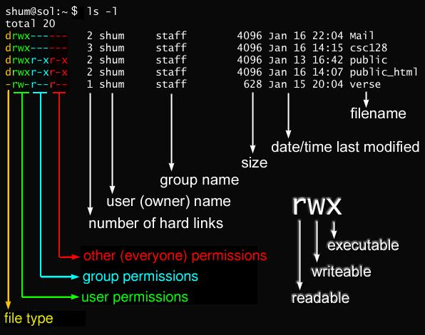

Linux có ba loại quyền cơ bản:

| Quyền | Ký hiệu | Ý nghĩa với tệp | Ý nghĩa với thư mục |
|---|---|---|---|
| Read | `r` | Đọc nội dung tệp | Liệt kê nội dung thư mục |
| Write | `w` | Chỉnh sửa nội dung tệp | Tạo, xóa, đổi tên tệp bên trong thư mục |
| Execute | `x` | Chạy tệp như chương trình/script | Truy cập hoặc đi vào thư mục bằng `cd` |

Đối với **tệp**, ý nghĩa của quyền khá dễ hiểu:

- `r`: cho phép đọc nội dung tệp bằng `cat`, `less`, `head`, `tail`;
- `w`: cho phép chỉnh sửa hoặc ghi đè nội dung tệp;
- `x`: cho phép chạy tệp nếu đó là chương trình hoặc script.

Ví dụ:

```bash
./script.sh
```

Lệnh trên chỉ chạy được nếu tệp `script.sh` có quyền execute.

Đối với **thư mục**, quyền có ý nghĩa hơi khác:

- `r`: cho phép xem danh sách tệp bên trong thư mục;
- `w`: cho phép tạo, xóa hoặc đổi tên tệp trong thư mục;
- `x`: cho phép đi vào thư mục bằng `cd` và truy cập các đối tượng bên trong.

Ví dụ, nếu một thư mục không có quyền `x`, người dùng có thể không thể truy cập vào thư mục đó, kể cả khi biết tên tệp bên trong.

Tóm lại, `r`, `w`, `x` là ba quyền cơ bản nhất trong Linux. Ý nghĩa của chúng thay đổi tùy theo đối tượng là tệp hay thư mục.


## 13.3. Quyền của user, group và others

Trong Linux, quyền truy cập được chia cho ba nhóm đối tượng:

| Nhóm | Ý nghĩa |
|---|---|
| User | Chủ sở hữu của tệp hoặc thư mục |
| Group | Nhóm sở hữu tệp hoặc thư mục |
| Others | Những người dùng còn lại, không phải owner và không thuộc group |

Có thể hiểu đơn giản như sau:

- **user** là người sở hữu trực tiếp tệp;
- **group** là nhóm người dùng có quyền liên quan đến tệp;
- **others** là tất cả người dùng khác trên hệ thống.

Ví dụ:

```bash
-rw-r----- 1 student analysts 200 May 15 10:00 report.txt
```

Trong ví dụ trên:

| Thành phần | Ý nghĩa |
|---|---|
| `student` | Chủ sở hữu của tệp |
| `analysts` | Nhóm sở hữu tệp |
| `rw-` | User có quyền đọc và ghi |
| `r--` | Group có quyền đọc |
| `---` | Others không có quyền |

Điều này có nghĩa là user `student` có thể đọc và sửa tệp, các thành viên của group `analysts` chỉ có thể đọc, còn người dùng khác không thể truy cập.

Tóm lại, Linux không chỉ kiểm soát quyền theo từng user riêng lẻ mà còn theo nhóm, giúp quản lý quyền truy cập linh hoạt hơn trong hệ thống nhiều người dùng.


## 13.4. Cách đọc quyền trong kết quả `ls -l`

Lệnh `ls -l` hiển thị quyền truy cập của tệp và thư mục theo dạng chi tiết.

Ví dụ:

```bash
ls -l script.sh
```

Kết quả:

```bash
-rwxr-xr-- 1 student student 120 May 15 10:00 script.sh
```

Phần quyền truy cập là:

```bash
-rwxr-xr--
```

Chuỗi này gồm 10 ký tự:

```bash
- rwx r-x r--
```

Có thể tách thành các phần như sau:

| Phần | Ý nghĩa |
|---|---|
| `-` | Loại đối tượng |
| `rwx` | Quyền của user |
| `r-x` | Quyền của group |
| `r--` | Quyền của others |

Ký tự đầu tiên cho biết loại đối tượng:

| Ký tự | Ý nghĩa |
|---|---|
| `-` | Tệp thông thường |
| `d` | Thư mục |
| `l` | Liên kết tượng trưng |

Ví dụ:

```bash
drwxr-xr-x
```

Ký tự đầu là `d`, nghĩa là đây là thư mục.

```bash
-rw-r--r--
```

Ký tự đầu là `-`, nghĩa là đây là tệp thông thường.

Ví dụ phân tích quyền:

```bash
-rw-r--r--
```

| Nhóm | Quyền | Ý nghĩa |
|---|---|---|
| User | `rw-` | Đọc và ghi, không thực thi |
| Group | `r--` | Chỉ đọc |
| Others | `r--` | Chỉ đọc |

Ví dụ khác:

```bash
-rwx------
```

| Nhóm | Quyền | Ý nghĩa |
|---|---|---|
| User | `rwx` | Đọc, ghi, thực thi |
| Group | `---` | Không có quyền |
| Others | `---` | Không có quyền |

Tóm lại, khi đọc kết quả `ls -l`, cần chú ý 10 ký tự đầu tiên vì chúng cho biết loại đối tượng và quyền truy cập của user, group, others.

## 13.5. Thay đổi quyền với `chmod`

Lệnh `chmod`, viết tắt của **change mode**, dùng để thay đổi quyền truy cập của tệp hoặc thư mục.

Cú pháp cơ bản:

```bash
chmod <quyền> <tên_tệp>
```

Có hai cách phổ biến để dùng `chmod`:

1. Dùng ký hiệu chữ.
2. Dùng dạng số.

### 13.5.1 Thay đổi quyền dùng ký hiệu chữ

Các nhóm đối tượng:

| Ký hiệu | Ý nghĩa |
|---|---|
| `u` | User |
| `g` | Group |
| `o` | Others |
| `a` | All, tức tất cả |

Các thao tác:

| Ký hiệu | Ý nghĩa |
|---|---|
| `+` | Thêm quyền |
| `-` | Gỡ quyền |
| `=` | Gán quyền chính xác |

Ví dụ thêm quyền thực thi cho user:

```bash
chmod u+x script.sh
```

Gỡ quyền ghi của others:

```bash
chmod o-w file.txt
```

Gán quyền đọc và ghi cho user, chỉ đọc cho group, không quyền cho others:

```bash
chmod u=rw,g=r,o= file.txt
```

### 13.5.2 Thay đổi quyền dùng dạng số

Trong Linux, mỗi quyền có một giá trị số:

| Quyền | Giá trị |
|---|---|
| Read `r` | 4 |
| Write `w` | 2 |
| Execute `x` | 1 |

Các quyền được cộng lại để tạo thành một số:

| Số | Quyền |
|---|---|
| `7` | `rwx` |
| `6` | `rw-` |
| `5` | `r-x` |
| `4` | `r--` |
| `0` | `---` |

Ví dụ:

```bash
chmod 755 script.sh
```

Quyền `755` có nghĩa là:

| Nhóm | Số | Quyền |
|---|---|---|
| User | `7` | `rwx` |
| Group | `5` | `r-x` |
| Others | `5` | `r-x` |

Ví dụ khác:

```bash
chmod 644 file.txt
```

Quyền `644` có nghĩa là:

| Nhóm | Số | Quyền |
|---|---|---|
| User | `6` | `rw-` |
| Group | `4` | `r--` |
| Others | `4` | `r--` |

Tóm lại, `chmod` dùng để thay đổi quyền truy cập. Người mới nên bắt đầu với dạng ký hiệu chữ để dễ hiểu, sau đó học dạng số vì dạng số được dùng rất phổ biến trong thực tế.

## 13.6. Thêm quyền thực thi với `chmod +x`

Khi tạo một script mới, tệp đó thường chưa có quyền thực thi. Vì vậy, nếu chạy trực tiếp, hệ thống có thể báo lỗi `Permission denied`.

Ví dụ tạo script:

```bash
nano hello.sh
```

Nội dung:

```bash
#!/bin/bash
echo "Hello Linux"
```

Thử chạy:

```bash
./hello.sh
```

Nếu tệp chưa có quyền thực thi, có thể gặp lỗi:

```bash
bash: ./hello.sh: Permission denied
```

Để thêm quyền thực thi, dùng:

```bash
chmod +x hello.sh
```

Sau đó chạy lại:

```bash
./hello.sh
```

Kết quả:

```bash
Hello Linux
```

Lệnh:

```bash
chmod +x hello.sh
```

có nghĩa là thêm quyền execute cho tệp `hello.sh`.

Có thể kiểm tra bằng:

```bash
ls -l hello.sh
```

Kết quả có thể là:

```bash
-rwxr-xr-x 1 student student 35 May 15 10:00 hello.sh
```

Trong đó ký tự `x` cho biết tệp đã có quyền thực thi.

Tóm lại, `chmod +x` thường được dùng để biến một script thành tệp có thể chạy trực tiếp trong terminal.


## 13.7. Thay đổi chủ sở hữu với `chown`

Lệnh `chown`, viết tắt của **change owner**, dùng để thay đổi chủ sở hữu của tệp hoặc thư mục.

Cú pháp:

```bash
sudo chown <user> <tên_tệp>
```

Ví dụ, đổi chủ sở hữu của `file.txt` thành user `student`:

```bash
sudo chown student file.txt
```

Kiểm tra lại:

```bash
ls -l file.txt
```

Kết quả có thể là:

```bash
-rw-r--r-- 1 student root 100 May 15 10:00 file.txt
```

Trong kết quả trên, user sở hữu tệp đã được đổi thành `student`.

Có thể thay đổi cả user và group cùng lúc:

```bash
sudo chown student:student file.txt
```

Cú pháp:

```bash
sudo chown <user>:<group> <tên_tệp>
```

Ví dụ đổi chủ sở hữu thư mục và toàn bộ nội dung bên trong, dùng tùy chọn `-R`:

```bash
sudo chown -R student:student project/
```

Trong đó `-R` nghĩa là **recursive**, áp dụng thay đổi cho thư mục và toàn bộ tệp/thư mục con bên trong.

Cần cẩn thận khi dùng `chown -R`, đặc biệt với thư mục hệ thống như `/etc`, `/usr`, `/var`, vì thay đổi sai chủ sở hữu có thể làm hệ thống hoặc dịch vụ hoạt động lỗi.

Tóm lại, `chown` dùng để thay đổi chủ sở hữu của tệp hoặc thư mục. Lệnh này thường cần quyền `sudo`.


## 13.8. Thay đổi nhóm sở hữu với `chgrp`

Lệnh `chgrp`, viết tắt của **change group**, dùng để thay đổi nhóm sở hữu của tệp hoặc thư mục.

Cú pháp:

```bash
sudo chgrp <group> <tên_tệp>
```

Ví dụ, đổi nhóm sở hữu của `report.txt` thành `analysts`:

```bash
sudo chgrp analysts report.txt
```

Kiểm tra lại:

```bash
ls -l report.txt
```

Kết quả có thể là:

```bash
-rw-r----- 1 student analysts 200 May 15 10:00 report.txt
```

Trong ví dụ trên, group sở hữu tệp đã được đổi thành `analysts`.

Có thể áp dụng cho cả thư mục và nội dung bên trong bằng tùy chọn `-R`:

```bash
sudo chgrp -R analysts reports/
```

Lệnh này đổi group sở hữu của thư mục `reports` và toàn bộ nội dung bên trong thành `analysts`.

Trong thực tế, `chgrp` hữu ích khi nhiều người dùng cùng làm việc trong một nhóm và cần chia sẻ quyền truy cập vào cùng một thư mục hoặc tệp.

Ví dụ:

```bash
sudo chgrp analysts report.txt
chmod 640 report.txt
```

Quyền `640` nghĩa là:

| Nhóm | Quyền |
|---|---|
| User | Đọc và ghi |
| Group | Chỉ đọc |
| Others | Không có quyền |

Tóm lại, `chgrp` dùng để thay đổi nhóm sở hữu của tệp hoặc thư mục, giúp quản lý quyền truy cập theo nhóm hiệu quả hơn.

## 13.9. Quyền truy cập và rủi ro bảo mật

Quyền truy cập trong Linux có ảnh hưởng trực tiếp đến bảo mật hệ thống. Nếu cấu hình quyền không đúng, người dùng không được phép có thể đọc dữ liệu nhạy cảm, chỉnh sửa file cấu hình hoặc thực thi mã độc.

Một số rủi ro thường gặp:

| Rủi ro | Ví dụ |
|---|---|
| Tệp nhạy cảm cho phép đọc công khai | `others` có quyền đọc file chứa mật khẩu hoặc token |
| Script có quyền ghi cho nhiều người | Người khác có thể sửa script và chèn lệnh độc hại |
| Thư mục có quyền ghi quá rộng | User khác có thể tạo hoặc thay đổi tệp trong thư mục |
| Dùng `chmod 777` tùy tiện | Tất cả mọi người đều có quyền đọc, ghi và thực thi |
| Đổi owner/group sai | Dịch vụ có thể lỗi hoặc mất kiểm soát quyền |

Ví dụ quyền quá rộng:

```bash
chmod 777 script.sh
```

Quyền `777` nghĩa là user, group và others đều có quyền đọc, ghi và thực thi. Điều này thường không an toàn, đặc biệt với script, thư mục web, file cấu hình hoặc dữ liệu quan trọng.

Cách kiểm tra quyền:

```bash
ls -l
```

Ví dụ một file nhạy cảm không nên có quyền như sau:

```bash
-rw-rw-rw- 1 root root 100 May 15 10:00 secret.conf
```

Quyền trên cho phép mọi người ghi vào file, đây là rủi ro lớn.

Nguyên tắc bảo mật cơ bản là **cấp quyền tối thiểu cần thiết**. Người dùng hoặc chương trình chỉ nên có đúng quyền cần để thực hiện nhiệm vụ, không nên cấp quyền rộng hơn.

Ví dụ với file cấu hình:

```bash
chmod 640 config.conf
```

Với script chỉ chủ sở hữu được chỉnh sửa, người khác chỉ được chạy:

```bash
chmod 755 script.sh
```

Tóm lại, quản lý quyền truy cập đúng cách giúp giảm rủi ro bị đọc trộm dữ liệu, sửa đổi trái phép hoặc thực thi lệnh nguy hiểm trên hệ thống.

## 13.10. Các tệp nhạy cảm: `/etc/passwd` và `/etc/shadow`

Trong Linux, `/etc/passwd` và `/etc/shadow` là hai tệp rất quan trọng liên quan đến tài khoản người dùng.

#### Tệp `/etc/passwd`

Tệp `/etc/passwd` chứa thông tin cơ bản về các tài khoản người dùng trong hệ thống.

Có thể xem bằng:

```bash
cat /etc/passwd
```

Một dòng trong `/etc/passwd` thường có dạng:

```bash
student:x:1000:1000:Student User:/home/student:/bin/bash
```

Các trường được phân tách bằng dấu `:`:

| Trường | Ý nghĩa |
|---|---|
| `student` | Tên người dùng |
| `x` | Trường mật khẩu đã được chuyển sang `/etc/shadow` |
| `1000` | UID |
| `1000` | GID |
| `Student User` | Thông tin mô tả người dùng |
| `/home/student` | Thư mục home |
| `/bin/bash` | Shell mặc định |

Thông thường, `/etc/passwd` có thể được đọc bởi nhiều người dùng vì nhiều chương trình cần tra cứu thông tin tài khoản. Tuy nhiên, người dùng thường không được phép chỉnh sửa trực tiếp tệp này nếu không có quyền quản trị.

#### Tệp `/etc/shadow`

Tệp `/etc/shadow` chứa thông tin mật khẩu đã được băm và các thông tin liên quan đến chính sách mật khẩu. Đây là tệp nhạy cảm hơn nhiều so với `/etc/passwd`.

Thử xem quyền của `/etc/shadow`:

```bash
ls -l /etc/shadow
```

Kết quả có thể là:

```bash
-rw------- 1 root root 1200 May 15 10:00 /etc/shadow
```

hoặc trên một số hệ thống:

```bash
-rw-r----- 1 root shadow 1200 May 15 10:00 /etc/shadow
```

Điều này cho thấy chỉ root hoặc nhóm đặc biệt mới có quyền đọc tệp này.

Nếu user thường thử đọc:

```bash
cat /etc/shadow
```

hệ thống thường báo lỗi:

```bash
Permission denied
```

Điều này là bình thường và cần thiết để bảo vệ thông tin xác thực của người dùng.

So sánh ngắn gọn:

| Tệp | Nội dung | Mức độ nhạy cảm |
|---|---|---|
| `/etc/passwd` | Thông tin tài khoản người dùng | Quan trọng nhưng thường có thể đọc |
| `/etc/shadow` | Hash mật khẩu và chính sách mật khẩu | Rất nhạy cảm, chỉ root/nhóm đặc biệt được đọc |

Tóm lại, `/etc/passwd` và `/etc/shadow` là hai tệp quan trọng trong quản lý tài khoản Linux. `/etc/passwd` chứa thông tin người dùng cơ bản, còn `/etc/shadow` chứa dữ liệu mật khẩu đã băm và phải được bảo vệ nghiêm ngặt.

# 14. Quản lý người dùng và nhóm

Linux là hệ điều hành đa người dùng, nghĩa là nhiều tài khoản có thể cùng tồn tại trên một hệ thống. Mỗi người dùng có quyền hạn riêng, thư mục riêng, nhóm riêng và mức truy cập khác nhau đối với tệp, thư mục, dịch vụ hoặc lệnh hệ thống.

Quản lý người dùng và nhóm là một kỹ năng quan trọng trong Linux, đặc biệt trong quản trị hệ thống, máy chủ, môi trường doanh nghiệp và an toàn thông tin. Nếu phân quyền không đúng, người dùng có thể truy cập dữ liệu nhạy cảm hoặc thực hiện các thao tác vượt quá quyền cần thiết.


## 14.1. Người dùng trong Linux

Trong Linux, **người dùng** là một tài khoản được hệ thống dùng để xác định ai đang đăng nhập và đang thực hiện thao tác nào. Mỗi người dùng có một tên đăng nhập, một mã định danh người dùng gọi là **UID**, một thư mục home và thường có một shell mặc định.

Ví dụ, một người dùng có thể có thông tin như sau:

```bash
username: student
UID: 1000
Home directory: /home/student
Shell: /bin/bash
```

Thông tin người dùng cơ bản được lưu trong tệp:

```bash
/etc/passwd
```

Có thể xem nội dung tệp này bằng lệnh:

```bash
cat /etc/passwd
```

Một dòng trong `/etc/passwd` có thể có dạng:

```bash
student:x:1000:1000:Student User:/home/student:/bin/bash
```

Ý nghĩa các trường:

| Trường | Ý nghĩa |
|---|---|
| `student` | Tên người dùng |
| `x` | Mật khẩu không lưu trực tiếp ở đây, mà được chuyển sang `/etc/shadow` |
| `1000` | UID của người dùng |
| `1000` | GID của nhóm chính |
| `Student User` | Thông tin mô tả |
| `/home/student` | Thư mục home |
| `/bin/bash` | Shell mặc định |

Trong Linux, tài khoản quan trọng nhất là **root**. Đây là tài khoản có quyền quản trị cao nhất, có thể thay đổi toàn bộ hệ thống. Vì vậy, người dùng thông thường không nên đăng nhập trực tiếp bằng root nếu không cần thiết.

Tóm lại, người dùng trong Linux là thực thể dùng để xác định danh tính, quyền hạn và phạm vi thao tác của một tài khoản trên hệ thống.


## 14.2. Nhóm trong Linux

**Nhóm** trong Linux là cách gom nhiều người dùng lại với nhau để quản lý quyền truy cập dễ hơn. Thay vì cấp quyền riêng lẻ cho từng người dùng, quản trị viên có thể cấp quyền cho một nhóm, sau đó thêm người dùng vào nhóm đó.

Mỗi người dùng thường có:

| Loại nhóm | Ý nghĩa |
|---|---|
| Nhóm chính | Nhóm mặc định của người dùng |
| Nhóm phụ | Các nhóm bổ sung mà người dùng tham gia |

Ví dụ, một user `student` có thể thuộc nhiều nhóm:

```bash
student sudo adm docker
```

Điều này có nghĩa là user `student` không chỉ thuộc nhóm chính của mình, mà còn thuộc các nhóm phụ như `sudo`, `adm` hoặc `docker`.

Thông tin nhóm thường được lưu trong tệp:

```bash
/etc/group
```

Có thể xem danh sách nhóm bằng:

```bash
cat /etc/group
```

Hoặc kiểm tra nhóm của user hiện tại bằng:

```bash
groups
```

Ví dụ kết quả:

```bash
student sudo adm
```

Trong quản trị Linux, nhóm giúp chia sẻ quyền truy cập một cách linh hoạt. Ví dụ, nhiều người dùng cùng thuộc một nhóm có thể được cấp quyền đọc một thư mục log hoặc chỉnh sửa một thư mục dự án.

Tóm lại, nhóm là cơ chế quan trọng để quản lý quyền cho nhiều người dùng cùng lúc, giúp hệ thống dễ quản trị và an toàn hơn.


## 14.3. Kiểm tra thông tin người dùng với `id`

Lệnh `id` dùng để hiển thị thông tin định danh của người dùng, bao gồm UID, GID và danh sách các nhóm mà người dùng thuộc về.

Cú pháp:

```bash
id
```

Ví dụ kết quả:

```bash
uid=1000(student) gid=1000(student) groups=1000(student),27(sudo),4(adm)
```

Ý nghĩa:

| Thành phần | Ý nghĩa |
|---|---|
| `uid=1000(student)` | ID và tên của người dùng hiện tại |
| `gid=1000(student)` | ID và tên nhóm chính |
| `groups=...` | Danh sách các nhóm mà user thuộc về |

Có thể kiểm tra thông tin của một user cụ thể:

```bash
id username
```

Ví dụ:

```bash
id student
```

Lệnh `id` rất hữu ích khi cần kiểm tra quyền của tài khoản hiện tại. Nếu kết quả có chứa nhóm `sudo`, người dùng có thể có quyền chạy lệnh với đặc quyền quản trị thông qua `sudo`.

Ví dụ:

```bash
id
```

Kết quả:

```bash
uid=1000(chu) gid=1000(chu) groups=1000(chu),4(adm),27(sudo)
```

Trong ví dụ này, user `chu` thuộc nhóm `sudo` và `adm`, nghĩa là tài khoản này có nhiều quyền hơn user thông thường.

Tóm lại, `id` là lệnh quan trọng để kiểm tra danh tính và nhóm quyền của người dùng trong Linux.


## 14.4. Chuyển đổi người dùng với `su`

Lệnh `su`, viết tắt của **substitute user** hoặc **switch user**, dùng để chuyển sang một tài khoản người dùng khác trong terminal.

Cú pháp cơ bản:

```bash
su <username>
```

Ví dụ:

```bash
su user2
```

Sau khi chạy lệnh, hệ thống sẽ yêu cầu nhập mật khẩu của user đích. Nếu nhập đúng, phiên terminal sẽ chuyển sang user đó.

Để chuyển sang user khác như một phiên đăng nhập đầy đủ, nên dùng tùy chọn `-` hoặc `-l`:

```bash
su - user2
```

hoặc:

```bash
su --login user2
```

Cách này giúp nạp môi trường làm việc của user mới, bao gồm thư mục home, biến môi trường và shell đăng nhập.

Nếu chỉ chạy:

```bash
su user2
```

người dùng có thể chuyển sang user mới nhưng không nhất thiết nạp đầy đủ môi trường đăng nhập của user đó.

Có thể kiểm tra user hiện tại sau khi chuyển bằng:

```bash
whoami
```

Ví dụ:

```bash
su - user2
whoami
```

Kết quả:

```bash
user2
```

Ngoài ra, `su` có thể chạy một lệnh cụ thể dưới quyền user khác bằng tùy chọn `-c` hoặc `--command`:

```bash
su --command "whoami" user2
```

Lệnh này chỉ chạy `whoami` dưới quyền `user2`, sau đó quay lại phiên làm việc ban đầu.

Tóm lại, `su` dùng để chuyển sang tài khoản người dùng khác. Khi muốn có môi trường đăng nhập đầy đủ, nên dùng `su - username`.


## 14.5. Chạy lệnh với quyền cao hơn bằng `sudo`

Lệnh `sudo`, viết tắt của **superuser do**, cho phép user thông thường chạy một lệnh với quyền cao hơn, thường là quyền root.

Cú pháp:

```bash
sudo <lệnh>
```

Ví dụ cập nhật danh sách gói:

```bash
sudo apt update
```

Ví dụ chỉnh sửa tệp hệ thống:

```bash
sudo nano /etc/hosts
```

Khi dùng `sudo`, hệ thống thường yêu cầu nhập mật khẩu của chính user hiện tại, không phải mật khẩu root. User đó phải được cấp quyền sử dụng `sudo`, thường thông qua nhóm `sudo` hoặc cấu hình trong file sudoers.

Có thể kiểm tra user hiện tại có quyền `sudo` hay không bằng:

```bash
sudo -l
```

Lệnh này hiển thị danh sách các lệnh mà user được phép chạy với `sudo`.

Sự khác nhau giữa `su` và `sudo`:

| Lệnh | Ý nghĩa |
|---|---|
| `su` | Chuyển sang tài khoản người dùng khác |
| `sudo` | Chạy một lệnh cụ thể với quyền cao hơn |
| `su -` | Mở phiên đăng nhập mới dưới user khác |
| `sudo command` | Chỉ nâng quyền cho một lệnh cụ thể |

Ví dụ:

```bash
sudo whoami
```

Kết quả thường là:

```bash
root
```

Điều này cho thấy lệnh `whoami` đã được chạy với quyền root.

Trong thực tế, nên dùng `sudo` thay vì đăng nhập trực tiếp bằng root, vì `sudo` giúp kiểm soát từng lệnh được nâng quyền và giảm rủi ro thao tác nhầm toàn bộ hệ thống.

Tóm lại, `sudo` là công cụ quan trọng để thực hiện các thao tác quản trị một cách an toàn và có kiểm soát hơn.


## 14.6. Tạo người dùng mới

Để tạo người dùng mới trong Linux, có thể dùng lệnh `adduser`.

Cú pháp:

```bash
sudo adduser <username>
```

Ví dụ tạo user mới tên `alice`:

```bash
sudo adduser alice
```

Sau khi chạy lệnh, hệ thống thường yêu cầu nhập mật khẩu mới và một số thông tin bổ sung như họ tên, số phòng, số điện thoại. Có thể nhấn `Enter` để bỏ qua các thông tin không cần thiết.

Sau khi tạo xong, có thể kiểm tra user bằng:

```bash
id alice
```

Hoặc kiểm tra thư mục home:

```bash
ls /home
```

Kết quả có thể có thư mục:

```bash
alice
```

Ngoài `adduser`, một số hệ thống cũng có lệnh cấp thấp hơn là `useradd`.

Ví dụ:

```bash
sudo useradd alice
```

Tuy nhiên, với người mới học Linux, `adduser` thường dễ dùng hơn vì nó tạo user theo quy trình tương tác và thân thiện hơn.

Có thể thêm user vào một nhóm bằng lệnh:

```bash
sudo usermod -aG <group> <username>
```

Ví dụ thêm user `alice` vào nhóm `sudo`:

```bash
sudo usermod -aG sudo alice
```

Cần cẩn thận khi thêm user vào các nhóm đặc quyền như `sudo`, vì điều này có thể cho phép user thực hiện thao tác quản trị hệ thống.


## 14.7. Đặt mật khẩu cho người dùng

Lệnh `passwd` dùng để đặt hoặc thay đổi mật khẩu cho người dùng.

Nếu muốn đổi mật khẩu của chính user hiện tại, dùng:

```bash
passwd
```

Hệ thống sẽ yêu cầu nhập mật khẩu hiện tại, sau đó nhập mật khẩu mới.

Nếu muốn đặt hoặc đổi mật khẩu cho user khác, cần quyền quản trị:

```bash
sudo passwd <username>
```

Ví dụ đặt mật khẩu cho user `alice`:

```bash
sudo passwd alice
```

Sau đó hệ thống sẽ yêu cầu nhập mật khẩu mới:

```bash
New password:
Retype new password:
```

Nếu mật khẩu được đặt thành công, hệ thống có thể hiển thị:

```bash
passwd: password updated successfully
```

Trong quản trị hệ thống, `passwd` rất quan trọng vì tài khoản mới tạo cần có mật khẩu để đăng nhập. Ngoài ra, quản trị viên có thể dùng lệnh này để đặt lại mật khẩu khi người dùng quên mật khẩu.

Một số lưu ý bảo mật khi đặt mật khẩu:

| Nguyên tắc | Ý nghĩa |
|---|---|
| Không dùng mật khẩu quá ngắn | Dễ bị đoán hoặc brute-force |
| Không dùng thông tin cá nhân | Ví dụ ngày sinh, tên, số điện thoại |
| Nên kết hợp chữ, số, ký tự đặc biệt | Tăng độ khó đoán |
| Không dùng chung mật khẩu cho nhiều tài khoản | Giảm rủi ro khi một tài khoản bị lộ |


## 14.8. Xóa người dùng

Để xóa người dùng khỏi hệ thống, có thể dùng lệnh `deluser`.

Cú pháp:

```bash
sudo deluser <username>
```

Ví dụ xóa user `alice`:

```bash
sudo deluser alice
```

Lệnh trên xóa tài khoản `alice`, nhưng có thể không xóa thư mục home của user đó.

Nếu muốn xóa cả thư mục home, có thể dùng:

```bash
sudo deluser --remove-home alice
```

Trước khi xóa user, nên kiểm tra:

```bash
id alice
```

Kiểm tra thư mục home:

```bash
ls /home/alice
```

Nếu user đang chạy tiến trình, cần kiểm tra trước bằng:

```bash
ps -u alice
```

Sau khi xóa user, có thể kiểm tra lại:

```bash
id alice
```

Nếu user đã bị xóa, hệ thống có thể báo:

```bash
id: ‘alice’: no such user
```

Cần cẩn thận khi xóa user trên máy chủ, vì user đó có thể đang sở hữu tệp, chạy dịch vụ hoặc có dữ liệu quan trọng trong thư mục home.

Tóm lại, `sudo deluser username` dùng để xóa tài khoản người dùng. Nếu muốn xóa cả dữ liệu home, dùng thêm tùy chọn `--remove-home`.

## 14.9. Ý nghĩa bảo mật của nhóm `sudo`, `adm` và các nhóm đặc quyền

Trong Linux, một số nhóm có quyền cao hơn nhóm thông thường. Nếu một user thuộc các nhóm này, user đó có thể truy cập nhiều tài nguyên quan trọng hoặc thực hiện các thao tác ảnh hưởng đến toàn bộ hệ thống.

#### Nhóm `sudo`

Nhóm `sudo` là một trong những nhóm quan trọng nhất. User thuộc nhóm này thường có thể chạy lệnh với quyền root thông qua `sudo`.

Ví dụ kiểm tra user có thuộc nhóm `sudo` không:

```bash
id
```

Nếu kết quả có chứa:

```bash
27(sudo)
```

nghĩa là user hiện tại thuộc nhóm `sudo`.

Ví dụ:

```bash
sudo apt update
sudo systemctl restart ssh
sudo nano /etc/hosts
```

Các lệnh trên đều có thể thay đổi hệ thống. Vì vậy, chỉ nên cấp quyền `sudo` cho những user thật sự cần quyền quản trị.

#### Nhóm `adm`

Nhóm `adm` thường liên quan đến việc đọc một số tệp log hệ thống trên các bản phân phối như Ubuntu hoặc Debian. User thuộc nhóm này có thể có khả năng xem các thông tin quan trọng trong thư mục log.

Ví dụ:

```bash
ls -l /var/log
```

Một số tệp log có thể cho phép nhóm `adm` đọc.

Trong an toàn thông tin, quyền đọc log rất quan trọng. Log có thể chứa thông tin về đăng nhập, lỗi dịch vụ, hoạt động mạng hoặc dấu hiệu tấn công. Vì vậy, không nên thêm user vào nhóm `adm` nếu không có nhu cầu giám sát hoặc quản trị.

#### Một số nhóm đặc quyền khác

Ngoài `sudo` và `adm`, một số nhóm khác cũng cần được kiểm soát cẩn thận:

| Nhóm | Rủi ro nếu cấp sai |
|---|---|
| `sudo` | Có thể chạy lệnh với quyền root |
| `adm` | Có thể đọc một số log hệ thống |
| `docker` | Có thể dẫn đến quyền rất cao nếu cấu hình không an toàn |
| `lxd` | Có thể bị lợi dụng để leo thang đặc quyền |
| `libvirt` | Có thể quản lý máy ảo |
| `wireshark` | Có thể bắt hoặc phân tích lưu lượng mạng |
| `kvm` | Có thể truy cập tài nguyên ảo hóa |
| `shadow` | Có thể liên quan đến quyền đọc dữ liệu mật khẩu đã băm |

Ví dụ một kết quả `id` có nhiều nhóm đặc quyền:

```bash
uid=1000(chu) gid=1000(chu) groups=1000(chu),4(adm),27(sudo),140(docker),145(libvirt),139(wireshark)
```

Kết quả này cho thấy user `chu` có nhiều quyền mở rộng. Đây là điều bình thường trên máy cá nhân phục vụ học tập hoặc lab bảo mật, nhưng trên máy chủ thật cần kiểm soát rất chặt.

Nguyên tắc bảo mật quan trọng là **least privilege**, tức là chỉ cấp đúng quyền cần thiết cho user để thực hiện công việc. Không nên thêm user vào các nhóm đặc quyền nếu không có lý do rõ ràng.

Một số lệnh kiểm tra nhóm:

```bash
id
groups
groups username
```

Ví dụ kiểm tra nhóm của user `alice`:

```bash
groups alice
```

Tóm lại, nhóm đặc quyền có ảnh hưởng trực tiếp đến bảo mật hệ thống. Trong đó, `sudo` cho phép nâng quyền quản trị, `adm` thường liên quan đến đọc log, còn các nhóm như `docker`, `lxd`, `libvirt`, `wireshark` cũng cần được kiểm soát cẩn thận.

# 15. Kết nối và quản trị từ xa

Trong Linux, quản trị từ xa là một kỹ năng rất quan trọng. Trên thực tế, nhiều máy chủ Linux không được sử dụng trực tiếp qua màn hình và bàn phím, mà được quản trị thông qua mạng. Công cụ phổ biến nhất để đăng nhập và điều khiển máy Linux từ xa là **SSH**. Ngoài ra, người dùng có thể dùng **SCP** để truyền tệp an toàn giữa máy local và máy remote.

Các nội dung chính trong phần này gồm: SSH, cách đăng nhập từ xa, cú pháp lệnh SSH, truyền tệp bằng SCP.


## 15.1. SSH là gì?

**SSH**, viết đầy đủ là **Secure Shell**, là một giao thức dùng để kết nối an toàn đến một máy tính từ xa thông qua mạng. SSH cho phép người dùng đăng nhập vào máy Linux từ xa, chạy lệnh, quản trị hệ thống, chỉnh sửa tệp cấu hình, kiểm tra log và thực hiện nhiều tác vụ khác trong terminal.

Điểm quan trọng của SSH là dữ liệu truyền giữa máy local và máy remote được mã hóa. Điều này giúp bảo vệ thông tin đăng nhập, lệnh thực thi và dữ liệu trao đổi khỏi việc bị đọc trộm trên mạng.

Ví dụ, thay vì phải ngồi trực tiếp trước máy chủ Linux, quản trị viên có thể dùng SSH từ máy cá nhân để kết nối đến máy chủ:

```bash
ssh user@192.168.1.10
```

Trong đó:

| Thành phần | Ý nghĩa |
|---|---|
| `ssh` | Lệnh dùng để kết nối SSH |
| `user` | Tên người dùng trên máy remote |
| `192.168.1.10` | Địa chỉ IP của máy remote |

SSH rất phổ biến trong quản trị hệ thống, DevOps, cloud, SOC và an toàn thông tin vì nó nhẹ, nhanh, bảo mật và không cần giao diện đồ họa.


## 15.2. Cách SSH hoạt động

SSH hoạt động theo mô hình **client — server**.

| Thành phần | Vai trò |
|---|---|
| SSH Client | Máy thực hiện kết nối, thường là máy của người dùng |
| SSH Server | Máy từ xa nhận kết nối SSH |
| Network | Mạng truyền dữ liệu giữa hai máy |
| Authentication | Cơ chế xác thực người dùng |
| Encryption | Mã hóa dữ liệu trao đổi |

Khi người dùng chạy lệnh SSH từ máy local, SSH client sẽ gửi yêu cầu kết nối đến SSH server trên máy remote. Sau đó, hai bên thiết lập một kênh truyền được mã hóa. Người dùng cần xác thực bằng mật khẩu hoặc SSH key. Nếu xác thực thành công, người dùng sẽ có một phiên terminal trên máy remote.

Quy trình cơ bản:

1. Người dùng chạy lệnh `ssh user@host`.
2. SSH client kết nối đến SSH server trên máy remote.
3. Hai bên thiết lập kênh mã hóa.
4. Người dùng xác thực bằng mật khẩu hoặc SSH key.
5. Sau khi xác thực thành công, người dùng có thể chạy lệnh trên máy remote.

Ví dụ:

```bash
ssh student@192.168.1.20
```

Sau khi đăng nhập thành công, prompt trong terminal sẽ chuyển sang môi trường của máy remote. Khi đó, các lệnh như `pwd`, `ls`, `whoami`, `hostname` sẽ được thực thi trên máy remote, không phải trên máy local.

Ví dụ kiểm tra tên máy sau khi SSH:

```bash
hostname
```

Tóm lại, SSH tạo ra một phiên làm việc từ xa được mã hóa, giúp người dùng điều khiển máy Linux khác qua mạng một cách an toàn.

## 15.3. Đăng nhập máy Linux từ xa bằng SSH

Để đăng nhập vào máy Linux từ xa bằng SSH, người dùng cần biết ít nhất hai thông tin:

| Thông tin cần có | Ví dụ |
|---|---|
| Tên người dùng trên máy remote | `student` |
| Địa chỉ IP hoặc hostname của máy remote | `192.168.1.10` |

Cú pháp đăng nhập cơ bản:

```bash
ssh username@ip_address
```

Ví dụ:

```bash
ssh student@192.168.1.10
```

Nếu đây là lần đầu kết nối đến máy remote, hệ thống có thể hiển thị cảnh báo xác nhận host:

```bash
The authenticity of host '192.168.1.10' can't be established.
Are you sure you want to continue connecting?
```

Nếu tin tưởng máy remote, nhập:

```bash
yes
```

Sau đó, hệ thống sẽ yêu cầu nhập mật khẩu của user trên máy remote:

```bash
student@192.168.1.10's password:
```

Nếu nhập đúng mật khẩu, người dùng sẽ đăng nhập thành công vào máy remote.

Sau khi đăng nhập, có thể kiểm tra bằng:

```bash
whoami
hostname
pwd
```

Ví dụ:

```bash
whoami
```

Kết quả:

```bash
student
```

```bash
hostname
```

Kết quả:

```bash
ubuntu-server
```

Để thoát khỏi phiên SSH, dùng lệnh:

```bash
exit
```

hoặc nhấn:

```bash
Ctrl + D
```


## 15.4. Cú pháp lệnh SSH

Cú pháp SSH cơ bản:

```bash
ssh <username>@<remote_host>
```

Ví dụ:

```bash
ssh ubuntu@192.168.1.30
```

Trong đó:

| Thành phần | Ý nghĩa |
|---|---|
| `ssh` | Lệnh kết nối SSH |
| `ubuntu` | Tên user trên máy remote |
| `192.168.1.30` | Địa chỉ IP của máy remote |

Nếu SSH server dùng cổng khác cổng mặc định, có thể dùng tùy chọn `-p`.

Cú pháp:

```bash
ssh -p <port> <username>@<remote_host>
```

Ví dụ:

```bash
ssh -p 2222 student@192.168.1.10
```

Lệnh này kết nối đến máy `192.168.1.10` qua cổng SSH `2222`.

Một số tùy chọn SSH thường gặp:

| Tùy chọn | Ý nghĩa |
|---|---|
| `-p` | Chỉ định cổng SSH |
| `-i` | Chỉ định file private key |
| `-v` | Hiển thị thông tin debug |
| `-X` | Bật X11 forwarding |
| `-L` | Tạo local port forwarding |

Ví dụ dùng SSH key:

```bash
ssh -i ~/.ssh/id_rsa student@192.168.1.10
```

Ví dụ bật chế độ debug để kiểm tra lỗi:

```bash
ssh -v student@192.168.1.10
```

Ví dụ chạy một lệnh từ xa mà không mở phiên shell tương tác:

```bash
ssh student@192.168.1.10 "hostname"
```

Lệnh trên kết nối SSH, chạy lệnh `hostname` trên máy remote, hiển thị kết quả rồi thoát.


## 15.5. Truyền tệp an toàn với SCP

**SCP**, viết đầy đủ là **Secure Copy**, là công cụ dùng để sao chép tệp giữa hai máy tính thông qua SSH. Khác với lệnh `cp` chỉ sao chép trong cùng một hệ thống hoặc giữa các thư mục local, `scp` cho phép truyền tệp giữa máy local và máy remote một cách an toàn.

SCP sử dụng SSH nên dữ liệu truyền đi được mã hóa. Điều này giúp bảo vệ nội dung tệp và thông tin xác thực trong quá trình truyền qua mạng.

Cú pháp tổng quát của SCP dựa trên mô hình:

```bash
scp <source> <destination>
```

Trong đó:

| Thành phần | Ý nghĩa |
|---|---|
| `source` | Nguồn, tức tệp hoặc thư mục cần sao chép |
| `destination` | Đích, tức nơi lưu tệp sau khi sao chép |

Định dạng remote thường có dạng:

```bash
username@ip_address:/path/to/file
```

Ví dụ:

```bash
ubuntu@192.168.1.30:/home/ubuntu/file.txt
```

Trong đó:

| Thành phần | Ý nghĩa |
|---|---|
| `ubuntu` | User trên máy remote |
| `192.168.1.30` | Địa chỉ IP của máy remote |
| `/home/ubuntu/file.txt` | Đường dẫn tệp trên máy remote |

Tóm lại, SCP là công cụ đơn giản và an toàn để truyền tệp giữa máy local và máy Linux remote thông qua SSH.


## 15.6. Sao chép tệp từ máy local lên máy remote

Để sao chép tệp từ máy local lên máy remote, đặt tệp local ở vị trí **source**, còn đường dẫn remote ở vị trí **destination**.

Cú pháp:

```bash
scp <local_file> <username>@<remote_ip>:<remote_path>
```

Ví dụ, sao chép tệp `important.txt` từ máy local lên máy remote có IP `192.168.1.30`, user là `ubuntu`, và lưu thành `transferred.txt`:

```bash
scp important.txt ubuntu@192.168.1.30:/home/ubuntu/transferred.txt
```

Trong đó:

| Thành phần | Ý nghĩa |
|---|---|
| `scp` | Lệnh sao chép an toàn |
| `important.txt` | Tệp nguồn trên máy local |
| `ubuntu@192.168.1.30` | User và địa chỉ IP máy remote |
| `/home/ubuntu/transferred.txt` | Đường dẫn và tên tệp trên máy remote |

Nếu muốn giữ nguyên tên tệp khi sao chép vào thư mục remote:

```bash
scp important.txt ubuntu@192.168.1.30:/home/ubuntu/
```

Lệnh trên sẽ sao chép `important.txt` vào thư mục `/home/ubuntu/` trên máy remote.

Nếu SSH server dùng cổng khác mặc định, dùng tùy chọn `-P` với SCP. Lưu ý: với `scp`, tùy chọn cổng là chữ `P` viết hoa.

Ví dụ:

```bash
scp -P 2222 important.txt ubuntu@192.168.1.30:/home/ubuntu/
```

Nếu muốn sao chép cả thư mục, dùng tùy chọn `-r`:

```bash
scp -r project ubuntu@192.168.1.30:/home/ubuntu/
```


## 15.7. Sao chép tệp từ máy remote về máy local

Để sao chép tệp từ máy remote về máy local, đặt đường dẫn remote ở vị trí **source**, còn đường dẫn local ở vị trí **destination**.

Cú pháp:

```bash
scp <username>@<remote_ip>:<remote_file> <local_path>
```

Ví dụ, sao chép tệp `documents.txt` từ máy remote về máy local và lưu thành `notes.txt`:

```bash
scp ubuntu@192.168.1.30:/home/ubuntu/documents.txt notes.txt
```

Trong đó:

| Thành phần | Ý nghĩa |
|---|---|
| `ubuntu@192.168.1.30:/home/ubuntu/documents.txt` | Tệp nguồn trên máy remote |
| `notes.txt` | Tên tệp lưu trên máy local |

Nếu muốn tải tệp về thư mục hiện tại và giữ nguyên tên:

```bash
scp ubuntu@192.168.1.30:/home/ubuntu/documents.txt .
```

Dấu `.` nghĩa là thư mục hiện tại trên máy local.

Nếu muốn tải cả thư mục từ máy remote về máy local:

```bash
scp -r ubuntu@192.168.1.30:/home/ubuntu/project .
```

Nếu SSH server dùng cổng khác:

```bash
scp -P 2222 ubuntu@192.168.1.30:/home/ubuntu/documents.txt .
```

# 16. Tải xuống và chia sẻ tệp trong Linux

Trong Linux, việc tải xuống và chia sẻ tệp là thao tác rất phổ biến, đặc biệt khi cài đặt công cụ, tải script, trao đổi dữ liệu giữa các máy hoặc thực hành trong môi trường lab. Một số công cụ thường dùng gồm `wget`, `curl`, `scp` và Python HTTP Server.

Mỗi công cụ có mục đích riêng: `wget` thường dùng để tải tệp đơn giản từ web, `curl` linh hoạt hơn khi làm việc với HTTP/API, `scp` dùng để truyền tệp an toàn qua SSH, còn Python HTTP Server giúp chia sẻ nhanh tệp trong mạng nội bộ.


## 16.1. Tải tệp với `wget`

`wget` là công cụ dòng lệnh dùng để tải tệp từ web thông qua các giao thức như HTTP, HTTPS hoặc FTP. Đây là lệnh rất đơn giản và thường được dùng khi người dùng biết URL trực tiếp của tệp cần tải.

Cú pháp cơ bản:

```bash
wget <URL>
```

Ví dụ:

```bash
wget https://example.com/file.txt
```

Lệnh trên sẽ tải tệp `file.txt` từ địa chỉ URL về thư mục hiện tại.

Ví dụ khác:

```bash
wget https://assets.tryhackme.com/additional/linux-fundamentals/part3/myfile.txt
```

Sau khi tải xong, có thể kiểm tra bằng:

```bash
ls
```

Một số tùy chọn thường dùng với `wget`:

| Tùy chọn | Ý nghĩa |
|---|---|
| `-O` | Lưu tệp với tên chỉ định |
| `-c` | Tiếp tục tải tệp bị ngắt |
| `-q` | Chế độ yên lặng, ít hiển thị thông tin |
| `-r` | Tải đệ quy |

Ví dụ lưu tệp với tên khác:

```bash
wget -O report.txt https://example.com/file.txt
```

Ví dụ tiếp tục tải một tệp lớn bị gián đoạn:

```bash
wget -c https://example.com/bigfile.zip
```

Tóm lại, `wget` phù hợp khi cần tải tệp trực tiếp từ một URL, đặc biệt trong môi trường terminal hoặc script.

---

## 16.2. Tải tệp với `curl`

`curl` là công cụ dùng để gửi yêu cầu đến máy chủ và nhận dữ liệu trả về. So với `wget`, `curl` linh hoạt hơn, đặc biệt khi làm việc với HTTP request, API, header, phương thức GET/POST hoặc dữ liệu JSON.

Cú pháp cơ bản:

```bash
curl <URL>
```

Ví dụ:

```bash
curl https://example.com
```

Lệnh này sẽ hiển thị nội dung phản hồi từ trang web ra terminal.

Nếu muốn tải tệp và lưu theo tên gốc, dùng tùy chọn `-O`:

```bash
curl -O https://example.com/file.zip
```

Nếu muốn lưu với tên chỉ định, dùng `-o`:

```bash
curl -o myfile.zip https://example.com/file.zip
```

Một số tùy chọn thường dùng với `curl`:

| Tùy chọn | Ý nghĩa |
|---|---|
| `-O` | Lưu tệp theo tên gốc |
| `-o` | Lưu tệp với tên chỉ định |
| `-L` | Theo dõi chuyển hướng |
| `-I` | Chỉ hiển thị HTTP header |
| `-X` | Chỉ định phương thức HTTP |
| `-d` | Gửi dữ liệu POST |
| `-H` | Thêm HTTP header |

Ví dụ xem HTTP header:

```bash
curl -I https://example.com
```

Ví dụ theo dõi redirect và tải file:

```bash
curl -L -O https://example.com/file.zip
```

Ví dụ gửi POST request:

```bash
curl -X POST -d "username=admin" https://example.com/login
```

Tóm lại, `curl` không chỉ dùng để tải tệp mà còn rất mạnh khi kiểm tra HTTP, làm việc với API và xử lý dữ liệu web trong terminal.


## 16.3. Phục vụ tệp bằng Python HTTP Server

Python cung cấp một module đơn giản tên là `http.server`, cho phép biến thư mục hiện tại thành một HTTP server nhỏ. Cách này rất hữu ích khi cần chia sẻ nhanh tệp trong mạng nội bộ hoặc trong môi trường lab.

Cú pháp:

```bash
python3 -m http.server
```

Theo mặc định, server sẽ chạy ở cổng `8000` và phục vụ các tệp trong thư mục hiện tại.

Ví dụ:

```bash
mkdir webserver
cd webserver
echo "Hello from Linux" > file.txt
python3 -m http.server
```

Sau khi chạy lệnh trên, terminal sẽ hiển thị thông tin server đang hoạt động. Khi đó, một máy khác trong cùng mạng có thể tải tệp từ địa chỉ:

```bash
http://<IP_máy_chủ>:8000/file.txt
```

Ví dụ:

```bash
http://192.168.1.10:8000/file.txt
```

Để biết địa chỉ IP của máy đang chạy server, có thể dùng:

```bash
ip addr
```

hoặc:

```bash
hostname -I
```

Lưu ý: sau khi chạy `python3 -m http.server`, terminal đó sẽ bị chiếm bởi tiến trình server. Muốn tiếp tục chạy lệnh khác, cần mở một terminal mới. Để dừng server, nhấn:

```bash
Ctrl + C
```

Tóm lại, Python HTTP Server là cách rất nhanh để chia sẻ tệp qua HTTP mà không cần cài đặt web server phức tạp như Apache hoặc Nginx.


## 16.4. Tải tệp từ HTTP Server nội bộ

Sau khi một máy đã chạy Python HTTP Server, máy khác trong cùng mạng có thể tải tệp bằng `wget` hoặc `curl`.

Ví dụ, máy server có IP:

```bash
192.168.1.10
```

và đang chạy:

```bash
python3 -m http.server
```

trong thư mục có tệp:

```bash
file.txt
```

Từ máy client, có thể tải bằng `wget`:

```bash
wget http://192.168.1.10:8000/file.txt
```

Hoặc dùng `curl`:

```bash
curl -O http://192.168.1.10:8000/file.txt
```

Nếu muốn lưu với tên khác:

```bash
curl -o downloaded.txt http://192.168.1.10:8000/file.txt
```

Có thể kiểm tra tệp sau khi tải:

```bash
ls
cat file.txt
```

Trong môi trường lab an toàn thông tin, cách này thường được dùng để chuyển nhanh script, payload, log hoặc file kết quả giữa các máy ảo.

Ví dụ:

```bash
# Trên máy chia sẻ file
cd tools
python3 -m http.server

# Trên máy cần tải file
wget http://192.168.1.10:8000/script.sh
chmod +x script.sh
./script.sh
```

Tóm lại, Python HTTP Server kết hợp với `wget` hoặc `curl` là một phương pháp nhanh, đơn giản để chia sẻ và tải tệp trong mạng nội bộ.


## 16.5. So sánh `wget`, `curl` và `scp`

`wget`, `curl` và `scp` đều có thể dùng để truyền hoặc tải tệp, nhưng mục đích sử dụng khác nhau.

| Công cụ | Mục đích chính | Có mã hóa không? | Trường hợp sử dụng phù hợp |
|---|---|---|---|
| `wget` | Tải tệp từ URL | Có nếu dùng HTTPS | Tải file trực tiếp từ web hoặc HTTP server |
| `curl` | Gửi request HTTP/API và tải dữ liệu | Có nếu dùng HTTPS | Làm việc với API, header, POST request, tải file linh hoạt |
| `scp` | Sao chép tệp qua SSH | Có | Truyền tệp an toàn giữa local và remote |

Ví dụ tải file bằng `wget`:

```bash
wget http://192.168.1.10:8000/file.txt
```

Ví dụ tải file bằng `curl`:

```bash
curl -O http://192.168.1.10:8000/file.txt
```

Ví dụ sao chép file bằng `scp` từ local lên remote:

```bash
scp file.txt user@192.168.1.20:/home/user/
```

Ví dụ sao chép file từ remote về local:

```bash
scp user@192.168.1.20:/home/user/file.txt .
```

So sánh ngắn gọn:

| Nhu cầu | Công cụ nên dùng |
|---|---|
| Tải nhanh một file từ web | `wget` |
| Kiểm tra HTTP header hoặc API | `curl` |
| Gửi POST request | `curl` |
| Tải file từ Python HTTP Server | `wget` hoặc `curl` |
| Truyền file an toàn qua SSH | `scp` |
| Sao chép thư mục qua SSH | `scp -r` |

Tóm lại, `wget` đơn giản và phù hợp để tải file, `curl` linh hoạt hơn khi làm việc với HTTP/API, còn `scp` phù hợp khi cần truyền tệp an toàn giữa hai máy Linux qua SSH.

# 17. Nén, giải nén và lưu trữ dữ liệu

Trong Linux, nén và lưu trữ dữ liệu là thao tác rất phổ biến khi sao lưu tệp, đóng gói thư mục, truyền dữ liệu qua mạng hoặc lưu lại log hệ thống. Các công cụ thường gặp gồm `tar`, `gzip` và `gunzip`.

Cần phân biệt hai khái niệm quan trọng: **archive** và **compression**. Archive là gom nhiều tệp/thư mục thành một tệp duy nhất, còn compression là nén dữ liệu để giảm dung lượng.

---

## 17.1. Khái niệm archive và compression

**Archive** là quá trình gom nhiều tệp hoặc thư mục vào một tệp duy nhất để dễ lưu trữ, sao lưu hoặc truyền đi. File archive không nhất thiết phải được nén.

Ví dụ, file:

```bash
backup.tar
```

có thể chứa nhiều tệp và thư mục bên trong, nhưng bản thân nó chưa chắc đã được nén.

**Compression** là quá trình nén dữ liệu để giảm dung lượng tệp. File sau khi nén thường nhỏ hơn file gốc, giúp tiết kiệm dung lượng ổ đĩa và thời gian truyền qua mạng.

Ví dụ:

```bash
backup.tar.gz
```

File này thường có nghĩa là:

| Phần mở rộng | Ý nghĩa |
|---|---|
| `.tar` | File archive được tạo bằng `tar` |
| `.gz` | File đã được nén bằng `gzip` |

Có thể hiểu đơn giản:

| Khái niệm | Chức năng |
|---|---|
| Archive | Gom nhiều tệp/thư mục thành một tệp |
| Compression | Giảm dung lượng dữ liệu |
| `.tar` | File lưu trữ, chưa nén |
| `.gz` | File được nén bằng gzip |
| `.tar.gz` | File vừa được gom bằng tar, vừa được nén bằng gzip |

Tóm lại, `tar` thường dùng để đóng gói dữ liệu, còn `gzip` dùng để nén dữ liệu. Trong thực tế, hai công cụ này thường được kết hợp với nhau.


## 17.2. Tạo file `.tar` với `tar`

Lệnh `tar`, viết tắt của **tape archive**, dùng để tạo file lưu trữ từ nhiều tệp hoặc thư mục.

Cú pháp tạo file `.tar`:

```bash
tar -cvf <tên_file.tar> <tệp_hoặc_thư_mục>
```

Ví dụ, tạo file archive từ thư mục `project`:

```bash
tar -cvf project_backup.tar project/
```

Trong đó:

| Thành phần | Ý nghĩa |
|---|---|
| `tar` | Lệnh tạo hoặc xử lý file archive |
| `-c` | Create, tạo file archive mới |
| `-v` | Verbose, hiển thị chi tiết quá trình thực hiện |
| `-f` | File, chỉ định tên file archive |
| `project_backup.tar` | Tên file archive được tạo |
| `project/` | Thư mục cần đóng gói |

Sau khi chạy lệnh, có thể kiểm tra bằng:

```bash
ls -lh
```

Kết quả có thể là:

```bash
-rw-r--r-- 1 student student 20K May 15 10:00 project_backup.tar
```

Có thể đóng gói nhiều tệp cùng lúc:

```bash
tar -cvf documents.tar file1.txt file2.txt file3.txt
```

Hoặc đóng gói nhiều thư mục:

```bash
tar -cvf backup.tar Documents/ Pictures/ scripts/
```

Tóm lại, `tar -cvf` dùng để tạo file `.tar`, giúp gom nhiều tệp và thư mục thành một file duy nhất.


## 17.3. Giải nén file `.tar`

Để giải nén hoặc trích xuất nội dung từ file `.tar`, dùng tùy chọn `-x`.

Cú pháp:

```bash
tar -xvf <tên_file.tar>
```

Ví dụ:

```bash
tar -xvf project_backup.tar
```

Trong đó:

| Thành phần | Ý nghĩa |
|---|---|
| `-x` | Extract, trích xuất nội dung |
| `-v` | Hiển thị chi tiết quá trình giải nén |
| `-f` | Chỉ định file archive cần giải nén |
| `project_backup.tar` | File cần giải nén |

Sau khi giải nén, thư mục hoặc tệp bên trong archive sẽ xuất hiện trong thư mục hiện tại.

Có thể giải nén vào một thư mục cụ thể bằng tùy chọn `-C`:

```bash
mkdir extracted
tar -xvf project_backup.tar -C extracted/
```

Lệnh trên sẽ giải nén nội dung của `project_backup.tar` vào thư mục `extracted`.

Nếu chỉ muốn xem nội dung bên trong file `.tar` mà chưa giải nén, dùng:

```bash
tar -tvf project_backup.tar
```

Trong đó:

| Tùy chọn | Ý nghĩa |
|---|---|
| `-t` | List, liệt kê nội dung archive |
| `-v` | Hiển thị chi tiết |
| `-f` | Chỉ định file archive |

Tóm lại, `tar -xvf` dùng để trích xuất file `.tar`, còn `tar -tvf` dùng để xem nội dung archive trước khi giải nén.

## 17.4. Nén với gzip

`gzip` là công cụ dùng để nén tệp trong Linux. Khi nén bằng `gzip`, file gốc thường được thay thế bằng file có phần mở rộng `.gz`.

Cú pháp:

```bash
gzip <tên_tệp>
```

Ví dụ:

```bash
gzip notes.txt
```

Sau khi chạy lệnh, file `notes.txt` sẽ được nén thành:

```bash
notes.txt.gz
```

Có thể kiểm tra bằng:

```bash
ls
```

Kết quả:

```bash
notes.txt.gz
```

Nếu muốn nén file `.tar`, có thể làm như sau:

```bash
gzip project_backup.tar
```

Kết quả sẽ tạo ra:

```bash
project_backup.tar.gz
```

Tuy nhiên, trong thực tế, người dùng thường kết hợp `tar` và `gzip` trong một lệnh duy nhất bằng tùy chọn `-z`.

Ví dụ:

```bash
tar -czvf project_backup.tar.gz project/
```

Trong đó:

| Tùy chọn | Ý nghĩa |
|---|---|
| `-c` | Tạo archive |
| `-z` | Nén bằng gzip |
| `-v` | Hiển thị chi tiết |
| `-f` | Chỉ định tên file |

Tóm lại, `gzip` dùng để nén tệp, còn `tar -czvf` thường dùng để vừa đóng gói thư mục, vừa nén thành file `.tar.gz`.

## 17.5. Giải nén file `.gz`

Để giải nén file `.gz`, có thể dùng lệnh `gunzip` hoặc `gzip -d`.

Cú pháp với `gunzip`:

```bash
gunzip <tên_file.gz>
```

Ví dụ:

```bash
gunzip notes.txt.gz
```

Sau khi chạy lệnh, file `notes.txt.gz` sẽ được giải nén trở lại thành:

```bash
notes.txt
```

Cú pháp với `gzip -d`:

```bash
gzip -d <tên_file.gz>
```

Ví dụ:

```bash
gzip -d notes.txt.gz
```

Nếu file là `.tar.gz`, có thể giải nén trực tiếp bằng `tar`:

```bash
tar -xzvf project_backup.tar.gz
```

Trong đó:

| Tùy chọn | Ý nghĩa |
|---|---|
| `-x` | Trích xuất |
| `-z` | Giải nén gzip |
| `-v` | Hiển thị chi tiết |
| `-f` | Chỉ định file cần giải nén |

Giải nén `.tar.gz` vào thư mục cụ thể:

```bash
mkdir extracted
tar -xzvf project_backup.tar.gz -C extracted/
```

Tóm lại:

| Loại file | Lệnh giải nén |
|---|---|
| `.gz` | `gunzip file.gz` |
| `.gz` | `gzip -d file.gz` |
| `.tar` | `tar -xvf file.tar` |
| `.tar.gz` | `tar -xzvf file.tar.gz` |


## 17.6. Các flag thường dùng của `tar`

Lệnh `tar` có nhiều tùy chọn khác nhau. Người dùng cần nhớ một số flag cơ bản vì chúng xuất hiện rất thường xuyên trong thực tế.

| Flag | Tên đầy đủ / Ý nghĩa | Chức năng |
|---|---|---|
| `-c` | create | Tạo file archive mới |
| `-x` | extract | Giải nén/trích xuất archive |
| `-t` | list | Xem danh sách nội dung trong archive |
| `-v` | verbose | Hiển thị chi tiết quá trình thực hiện |
| `-f` | file | Chỉ định tên file archive |
| `-z` | gzip | Nén hoặc giải nén bằng gzip |
| `-C` | directory | Chỉ định thư mục đích khi giải nén |

Một số lệnh thường dùng:

Tạo file `.tar`:

```bash
tar -cvf backup.tar folder/
```

Giải nén file `.tar`:

```bash
tar -xvf backup.tar
```

Xem nội dung file `.tar`:

```bash
tar -tvf backup.tar
```

Tạo file `.tar.gz`:

```bash
tar -czvf backup.tar.gz folder/
```

Giải nén file `.tar.gz`:

```bash
tar -xzvf backup.tar.gz
```

Giải nén vào thư mục cụ thể:

```bash
tar -xzvf backup.tar.gz -C /tmp/extracted/
```

Có thể nhớ nhanh:

| Lệnh | Ý nghĩa dễ nhớ |
|---|---|
| `tar -cvf` | Create Verbose File |
| `tar -xvf` | Extract Verbose File |
| `tar -czvf` | Create gzip Verbose File |
| `tar -xzvf` | Extract gzip Verbose File |

Tóm lại, các flag quan trọng nhất của `tar` là `c`, `x`, `v`, `f`, `z` và `C`.


## 17.7. Ứng dụng nén dữ liệu trong sao lưu và quản trị hệ thống

Nén và lưu trữ dữ liệu được sử dụng rất nhiều trong quản trị Linux. Một số ứng dụng thực tế gồm sao lưu thư mục, đóng gói log, chuyển dữ liệu giữa các máy và lưu trữ cấu hình hệ thống.

#### Sao lưu thư mục home

Ví dụ sao lưu thư mục home của user `student`:

```bash
tar -czvf student_home_backup.tar.gz /home/student
```

File `student_home_backup.tar.gz` sẽ chứa dữ liệu trong `/home/student` và được nén bằng gzip.

#### Sao lưu thư mục cấu hình

Ví dụ sao lưu thư mục `/etc`:

```bash
sudo tar -czvf etc_backup.tar.gz /etc
```

Thư mục `/etc` chứa nhiều file cấu hình quan trọng của hệ thống, vì vậy cần quyền `sudo` để đọc đầy đủ nội dung.

#### Sao lưu log hệ thống

Ví dụ nén log trong `/var/log`:

```bash
sudo tar -czvf logs_backup.tar.gz /var/log
```

Lệnh này hữu ích khi cần lưu log để điều tra sự cố hoặc chuyển log sang máy khác để phân tích.

#### Chuyển file backup sang máy khác

Sau khi tạo file backup, có thể truyền sang máy khác bằng `scp`:

```bash
scp logs_backup.tar.gz user@192.168.1.20:/home/user/
```

#### Kiểm tra nội dung backup trước khi giải nén

Trước khi giải nén một file archive, nên xem nội dung bên trong:

```bash
tar -tvf logs_backup.tar.gz
```

Điều này giúp tránh giải nén nhầm vào thư mục không mong muốn hoặc ghi đè dữ liệu.

Một số lưu ý khi backup:

| Lưu ý | Ý nghĩa |
|---|---|
| Đặt tên file rõ ràng | Dễ biết nội dung và thời điểm backup |
| Kiểm tra dung lượng | Tránh làm đầy ổ đĩa |
| Kiểm tra nội dung archive | Đảm bảo backup đúng dữ liệu |
| Không lưu backup nhạy cảm công khai | File backup có thể chứa mật khẩu, key hoặc log quan trọng |
| Mã hóa backup nếu cần | Bảo vệ dữ liệu nhạy cảm khi truyền hoặc lưu trữ |

Ví dụ đặt tên backup có ngày tháng:

```bash
tar -czvf backup_$(date +%F).tar.gz /home/student/project
```

Kết quả có thể là:

```bash
backup_2026-05-15.tar.gz
```

# 18. Quản lý tiến trình

Trong Linux, **tiến trình** là một chương trình đang được thực thi. Khi người dùng chạy một lệnh, mở một ứng dụng, khởi động một dịch vụ hoặc chạy một script, hệ điều hành sẽ tạo ra một tiến trình tương ứng để quản lý hoạt động đó.

Quản lý tiến trình là kỹ năng quan trọng trong Linux vì nó giúp người dùng biết chương trình nào đang chạy, chương trình nào đang tiêu tốn tài nguyên, tiến trình nào bị treo và cách dừng hoặc đưa tiến trình vào chạy nền.

## 18.1. Process là gì?

**Process**, hay **tiến trình**, là một chương trình đang chạy trên hệ thống. Một chương trình khi nằm trên ổ đĩa chỉ là một tệp thực thi hoặc script. Khi chương trình đó được khởi chạy, Linux sẽ tạo ra một tiến trình để quản lý việc thực thi chương trình đó.

Ví dụ, khi chạy lệnh:

```bash
ls
```

Linux tạo ra một tiến trình để thực thi lệnh `ls`. Tiến trình này chạy, hiển thị kết quả, sau đó kết thúc.

Một số tiến trình chạy rất nhanh và kết thúc ngay, ví dụ:

```bash
echo "Hello Linux"
```

Một số tiến trình chạy lâu hơn, ví dụ:

```bash
ping google.com
```

hoặc:

```bash
top
```

Trong Linux, kernel chịu trách nhiệm quản lý tiến trình, cấp phát CPU, bộ nhớ và tài nguyên hệ thống cho các tiến trình đang chạy.

Tóm lại, process là một chương trình đang được thực thi. Mỗi lệnh hoặc ứng dụng đang chạy đều tương ứng với một hoặc nhiều tiến trình.


## 18.2. PID là gì?

**PID**, viết đầy đủ là **Process ID**, là mã định danh duy nhất của một tiến trình trong hệ thống. Mỗi tiến trình đang chạy sẽ có một PID riêng để Linux có thể theo dõi và quản lý.

Ví dụ, khi xem danh sách tiến trình bằng lệnh `ps`, có thể thấy kết quả như sau:

```bash
PID TTY          TIME CMD
1234 pts/0    00:00:00 bash
1250 pts/0    00:00:00 ps
```

Trong đó:

| Thành phần | Ý nghĩa |
|---|---|
| `PID` | Mã định danh của tiến trình |
| `TTY` | Terminal liên kết với tiến trình |
| `TIME` | Thời gian CPU mà tiến trình đã sử dụng |
| `CMD` | Lệnh hoặc chương trình tạo ra tiến trình |

Ví dụ, tiến trình `bash` có PID là `1234`. Nếu muốn gửi tín hiệu đến tiến trình này, người dùng có thể dùng PID đó.

PID rất quan trọng khi cần dừng một tiến trình. Ví dụ:

```bash
kill 1234
```

Lệnh trên gửi tín hiệu kết thúc đến tiến trình có PID là `1234`.

Tóm lại, PID là số định danh duy nhất của tiến trình, giúp Linux và người dùng quản lý từng tiến trình cụ thể.


## 18.3. Xem tiến trình với `ps`

Lệnh `ps`, viết tắt của **process status**, dùng để hiển thị thông tin về các tiến trình đang chạy trong phiên terminal hiện tại.

Cú pháp:

```bash
ps
```

Ví dụ:

```bash
ps
```

Kết quả có thể là:

```bash
PID TTY          TIME CMD
1234 pts/0    00:00:00 bash
1280 pts/0    00:00:00 ps
```

Trong ví dụ trên:

| Cột | Ý nghĩa |
|---|---|
| `PID` | ID của tiến trình |
| `TTY` | Terminal đang liên kết với tiến trình |
| `TIME` | Thời gian CPU tiến trình đã sử dụng |
| `CMD` | Tên lệnh hoặc chương trình |

Lệnh `ps` mặc định chỉ hiển thị các tiến trình liên quan đến phiên shell hiện tại. Vì vậy, nếu muốn xem nhiều tiến trình hơn, cần dùng các tùy chọn mở rộng như `ps aux`.

Tóm lại, `ps` giúp xem nhanh các tiến trình đang chạy trong terminal hiện tại.


## 18.4. Xem toàn bộ tiến trình với `ps aux`

Lệnh `ps aux` dùng để hiển thị danh sách tiến trình chi tiết hơn, bao gồm cả tiến trình của người dùng khác và tiến trình hệ thống.

Cú pháp:

```bash
ps aux
```

Ví dụ:

```bash
ps aux
```

Kết quả có thể có dạng:

```bash
USER       PID %CPU %MEM    VSZ   RSS TTY      STAT START   TIME COMMAND
root         1  0.0  0.1 167000 12000 ?        Ss   10:00   0:01 /sbin/init
student   1234  0.0  0.0  10000  4000 pts/0    Ss   10:05   0:00 bash
student   1300  0.0  0.0  12000  3500 pts/0    R+   10:06   0:00 ps aux
```

Một số cột quan trọng:

| Cột | Ý nghĩa |
|---|---|
| `USER` | User đang chạy tiến trình |
| `PID` | ID của tiến trình |
| `%CPU` | Mức sử dụng CPU |
| `%MEM` | Mức sử dụng bộ nhớ |
| `STAT` | Trạng thái tiến trình |
| `START` | Thời điểm tiến trình bắt đầu |
| `TIME` | Tổng thời gian CPU đã dùng |
| `COMMAND` | Lệnh hoặc chương trình đang chạy |

Lệnh `ps aux` thường được kết hợp với `grep` để tìm một tiến trình cụ thể.

Ví dụ tìm tiến trình liên quan đến SSH:

```bash
ps aux | grep ssh
```

Ví dụ tìm tiến trình Python:

```bash
ps aux | grep python
```

Tóm lại, `ps aux` là lệnh rất hữu ích để xem toàn bộ tiến trình đang chạy trên hệ thống và kiểm tra tiến trình theo tên.


## 18.5. Theo dõi tiến trình thời gian thực với `top`

Lệnh `top` dùng để theo dõi tiến trình và tài nguyên hệ thống theo thời gian thực. Khác với `ps`, lệnh `top` liên tục cập nhật thông tin về CPU, RAM và các tiến trình đang chạy.

Cú pháp:

```bash
top
```

Sau khi chạy:

```bash
top
```

terminal sẽ hiển thị danh sách tiến trình đang chạy, thường được sắp xếp theo mức sử dụng CPU.

Một số thông tin thường thấy trong `top`:

| Thành phần | Ý nghĩa |
|---|---|
| Load average | Mức tải trung bình của hệ thống |
| Tasks | Số lượng tiến trình |
| CPU usage | Mức sử dụng CPU |
| Memory usage | Mức sử dụng RAM |
| PID | ID tiến trình |
| USER | User chạy tiến trình |
| %CPU | Mức sử dụng CPU của tiến trình |
| %MEM | Mức sử dụng RAM của tiến trình |
| COMMAND | Tên chương trình/lệnh |

Một số phím thường dùng trong `top`:

| Phím | Chức năng |
|---|---|
| `q` | Thoát khỏi `top` |
| `k` | Gửi tín hiệu kill đến một tiến trình |
| `M` | Sắp xếp theo mức dùng RAM |
| `P` | Sắp xếp theo mức dùng CPU |
| `h` | Hiển thị trợ giúp |

Ví dụ, nếu thấy một tiến trình sử dụng CPU quá cao, người dùng có thể ghi lại PID của tiến trình đó và dùng `kill` để dừng.

Tóm lại, `top` giúp theo dõi trạng thái hệ thống và tiến trình theo thời gian thực, rất hữu ích khi kiểm tra hiệu năng hoặc xử lý tiến trình bất thường.


## 18.6. Kết thúc tiến trình với `kill`

Lệnh `kill` dùng để gửi tín hiệu đến một tiến trình. Mặc dù tên là `kill`, lệnh này không chỉ dùng để “giết” tiến trình, mà còn có thể gửi nhiều loại tín hiệu khác nhau.

Cú pháp cơ bản:

```bash
kill <PID>
```

Ví dụ:

```bash
kill 1234
```

Lệnh trên gửi tín hiệu kết thúc mặc định đến tiến trình có PID là `1234`.

Nếu tiến trình không dừng, có thể dùng tín hiệu mạnh hơn:

```bash
kill -9 1234
```

hoặc:

```bash
kill -SIGKILL 1234
```

Một quy trình thường dùng để dừng tiến trình:

```bash
ps aux | grep process_name
kill <PID>
```

Ví dụ tìm và dừng tiến trình Python:

```bash
ps aux | grep python
kill 2345
```

Nếu tiến trình vẫn không dừng:

```bash
kill -9 2345
```

Cần cẩn thận khi dùng `kill -9`, vì tiến trình bị dừng ngay lập tức và không có cơ hội dọn dẹp dữ liệu, đóng file hoặc ghi log kết thúc.

Tóm lại, `kill` dùng để gửi tín hiệu đến tiến trình, thường dùng nhất là để yêu cầu tiến trình dừng lại.

## 18.7. Các tín hiệu phổ biến: SIGTERM, SIGKILL, SIGSTOP

Trong Linux, tín hiệu là cơ chế để gửi yêu cầu đến tiến trình. Một số tín hiệu được dùng rất thường xuyên khi quản lý tiến trình.

| Tín hiệu | Số | Ý nghĩa |
|---|---:|---|
| `SIGTERM` | 15 | Yêu cầu tiến trình kết thúc một cách bình thường |
| `SIGKILL` | 9 | Buộc tiến trình kết thúc ngay lập tức |
| `SIGSTOP` | 19 | Tạm dừng tiến trình |
| `SIGINT` | 2 | Ngắt tiến trình, thường khi nhấn `Ctrl + C` |
| `SIGTSTP` | 20 | Tạm dừng tiến trình từ terminal, thường khi nhấn `Ctrl + Z` |

#### SIGTERM

`SIGTERM` là tín hiệu mặc định khi dùng lệnh `kill`.

Ví dụ:

```bash
kill 1234
```

Tương đương với:

```bash
kill -15 1234
```

Tín hiệu này cho phép tiến trình xử lý việc kết thúc, ví dụ lưu dữ liệu, đóng file hoặc ghi log.

#### SIGKILL

`SIGKILL` buộc tiến trình kết thúc ngay lập tức.

```bash
kill -9 1234
```

Tín hiệu này rất mạnh, nhưng không nên dùng đầu tiên nếu chưa cần thiết.

#### SIGSTOP

`SIGSTOP` dùng để tạm dừng tiến trình.

```bash
kill -19 1234
```

Tiến trình bị dừng nhưng chưa bị xóa khỏi hệ thống.

Tóm lại, nên ưu tiên dùng `SIGTERM` trước. Chỉ dùng `SIGKILL` khi tiến trình bị treo hoặc không phản hồi.


## 18.8. Tiến trình foreground và background

Trong Linux terminal, tiến trình có thể chạy ở hai chế độ chính: **foreground** và **background**.

| Chế độ | Ý nghĩa |
|---|---|
| Foreground | Tiến trình chạy trực tiếp trên terminal và chiếm terminal |
| Background | Tiến trình chạy nền, người dùng vẫn có thể tiếp tục nhập lệnh khác |

#### Foreground

Khi chạy một lệnh thông thường, tiến trình thường chạy ở foreground.

Ví dụ:

```bash
ping google.com
```

Khi lệnh này chạy, terminal sẽ liên tục hiển thị kết quả ping. Người dùng chưa thể nhập lệnh khác trong cùng terminal cho đến khi tiến trình kết thúc hoặc bị dừng.

Để dừng tiến trình foreground, có thể nhấn:

```bash
Ctrl + C
```

#### Background

Tiến trình background chạy ở nền, không chiếm hoàn toàn terminal. Người dùng vẫn có thể tiếp tục chạy các lệnh khác.

Ví dụ:

```bash
ping google.com &
```

Dấu `&` ở cuối lệnh đưa tiến trình vào chạy nền.

Tóm lại, foreground phù hợp với lệnh cần tương tác trực tiếp, còn background phù hợp với lệnh chạy lâu hoặc không cần nhập dữ liệu liên tục.

---

## 18.9. Chạy lệnh nền với `&`

Dấu `&` được đặt ở cuối lệnh để chạy tiến trình ở background.

Cú pháp:

```bash
command &
```

Ví dụ:

```bash
ping google.com &
```

Kết quả có thể là:

```bash
[1] 2345
```

Trong đó:

| Thành phần | Ý nghĩa |
|---|---|
| `[1]` | Job ID trong shell |
| `2345` | PID của tiến trình |

Có thể kiểm tra các job đang chạy nền bằng:

```bash
jobs
```

Ví dụ:

```bash
jobs
```

Kết quả:

```bash
[1]+  Running    ping google.com &
```

Chạy nền rất hữu ích với các lệnh mất nhiều thời gian, ví dụ:

```bash
cp large_file.iso /backup/ &
```

hoặc:

```bash
python3 script.py &
```

Tóm lại, dấu `&` giúp chạy tiến trình ở background, cho phép người dùng tiếp tục sử dụng terminal cho các lệnh khác.


## 18.10. Tạm dừng tiến trình với `Ctrl + Z`

Tổ hợp phím `Ctrl + Z` dùng để tạm dừng tiến trình đang chạy ở foreground. Khi nhấn `Ctrl + Z`, shell gửi tín hiệu `SIGTSTP` đến tiến trình.

Ví dụ chạy lệnh:

```bash
ping google.com
```

Sau đó nhấn:

```bash
Ctrl + Z
```

Kết quả có thể là:

```bash
[1]+  Stopped    ping google.com
```

Điều này có nghĩa là tiến trình đã bị tạm dừng, nhưng chưa kết thúc.

Có thể kiểm tra bằng:

```bash
jobs
```

Kết quả:

```bash
[1]+  Stopped    ping google.com
```

Cần chú ý: `Ctrl + Z` chỉ tạm dừng tiến trình, không làm tiến trình tiếp tục chạy nền. Nếu muốn tiến trình tiếp tục chạy ở background, cần dùng lệnh `bg`.

Tóm lại, `Ctrl + Z` dùng để tạm dừng tiến trình đang chiếm terminal, sau đó người dùng có thể đưa nó về background hoặc foreground tùy nhu cầu.

---

## 18.11. Đưa tiến trình về foreground với `fg`

Lệnh `fg`, viết tắt của **foreground**, dùng để đưa một tiến trình đang ở background hoặc đang bị tạm dừng quay lại foreground.

Cú pháp:

```bash
fg
```

Nếu có nhiều job, có thể chỉ định job ID:

```bash
fg %<job_id>
```

Ví dụ:

```bash
jobs
```

Kết quả:

```bash
[1]+  Stopped    ping google.com
```

Đưa job số 1 về foreground:

```bash
fg %1
```

Sau đó tiến trình `ping google.com` sẽ tiếp tục chạy trực tiếp trên terminal.

Nếu chỉ có một job, có thể dùng:

```bash
fg
```

Lệnh `fg` rất hữu ích khi người dùng đã tạm dừng một chương trình bằng `Ctrl + Z` và muốn quay lại tương tác với chương trình đó.

Ví dụ với Vim:

```bash
vim notes.txt
```

Nhấn:

```bash
Ctrl + Z
```

Sau đó quay lại Vim bằng:

```bash
fg
```

Tóm lại, `fg` đưa tiến trình trở lại foreground để người dùng tiếp tục tương tác trực tiếp với nó.


## 18.12. Đưa tiến trình về background với `bg`

Lệnh `bg`, viết tắt của **background**, dùng để tiếp tục chạy một tiến trình đã bị tạm dừng, nhưng ở chế độ nền.

Cú pháp:

```bash
bg
```

Nếu có nhiều job, chỉ định job ID:

```bash
bg %<job_id>
```

Ví dụ:

```bash
ping google.com
```

Nhấn:

```bash
Ctrl + Z
```

Kết quả:

```bash
[1]+  Stopped    ping google.com
```

Đưa tiến trình tiếp tục chạy ở background:

```bash
bg %1
```

Kiểm tra lại:

```bash
jobs
```

Kết quả có thể là:

```bash
[1]+  Running    ping google.com &
```

Điều này cho biết tiến trình đã tiếp tục chạy ở nền.

So sánh nhanh:

| Lệnh / Phím | Chức năng |
|---|---|
| `Ctrl + Z` | Tạm dừng tiến trình foreground |
| `jobs` | Xem danh sách job trong shell |
| `fg` | Đưa job về foreground |
| `bg` | Cho job tiếp tục chạy ở background |
| `&` | Chạy lệnh ở background ngay từ đầu |

Tóm lại, `bg` dùng để tiếp tục một tiến trình đã bị tạm dừng và đưa nó chạy nền, giúp người dùng tiếp tục sử dụng terminal cho các công việc khác.

# 19. Quản lý dịch vụ trong Linux

Trong Linux, nhiều chương trình quan trọng chạy dưới dạng **dịch vụ**. Ví dụ: SSH server, web server, database server, Docker, firewall, cron hoặc các dịch vụ ghi log. Những dịch vụ này thường chạy nền và không cần người dùng thao tác trực tiếp qua giao diện.

Quản lý dịch vụ giúp người dùng kiểm soát chương trình nào đang chạy, chương trình nào tự động khởi động cùng hệ thống, dịch vụ nào cần dừng lại và dịch vụ nào có thể tạo ra rủi ro bảo mật.

Công cụ phổ biến nhất để quản lý dịch vụ trên nhiều bản phân phối Linux hiện đại là `systemctl`, thuộc hệ thống `systemd`.


## 19.1. Dịch vụ trong Linux là gì?

**Dịch vụ** trong Linux là một chương trình hoặc tiến trình chạy nền để cung cấp một chức năng nào đó cho hệ thống hoặc cho người dùng.

Ví dụ:

| Dịch vụ | Chức năng |
|---|---|
| `ssh` | Cho phép đăng nhập từ xa bằng SSH |
| `apache2` / `nginx` | Cung cấp web server |
| `mysql` / `mariadb` | Cung cấp database server |
| `cron` | Chạy tác vụ định kỳ |
| `docker` | Quản lý container |
| `ufw` | Quản lý firewall đơn giản |
| `rsyslog` | Ghi log hệ thống |

Dịch vụ thường chạy ở **background**, nghĩa là chúng hoạt động phía sau mà không chiếm terminal của người dùng.

Ví dụ, khi SSH server đang chạy, người dùng khác có thể kết nối từ xa vào máy:

```bash
ssh user@192.168.1.10
```

Dịch vụ SSH vẫn chạy nền để chờ kết nối mới.

Có thể kiểm tra một dịch vụ bằng lệnh:

```bash
systemctl status ssh
```

Tóm lại, dịch vụ là các chương trình nền giúp hệ thống Linux cung cấp những chức năng quan trọng như mạng, đăng nhập từ xa, web, database, log và tự động hóa.


## 19.2. systemd là gì?

**systemd** là hệ thống quản lý khởi động và dịch vụ trên nhiều bản phân phối Linux hiện đại. Nó chịu trách nhiệm khởi động hệ thống, quản lý dịch vụ, quản lý tiến trình nền, timer, log và nhiều thành phần hệ thống khác.

Khi máy Linux khởi động, `systemd` thường là một trong những tiến trình đầu tiên được chạy. Nó có nhiệm vụ khởi động các dịch vụ cần thiết để hệ thống hoạt động bình thường.

Ví dụ, khi hệ thống khởi động, `systemd` có thể tự động khởi động:

```bash
ssh
networking
cron
docker
nginx
```

Các dịch vụ trong `systemd` thường được gọi là **unit**. Một số loại unit phổ biến:

| Loại unit | Ý nghĩa |
|---|---|
| `.service` | Dịch vụ hệ thống |
| `.timer` | Bộ hẹn giờ chạy tác vụ |
| `.target` | Nhóm trạng thái hệ thống |
| `.mount` | Điểm gắn kết hệ thống tệp |

Ví dụ một service có thể có tên:

```bash
ssh.service
apache2.service
docker.service
```

Tóm lại, `systemd` là thành phần trung tâm dùng để quản lý quá trình khởi động và các dịch vụ nền trong Linux.


## 19.3. Quản lý dịch vụ bằng `systemctl`

`systemctl` là lệnh dùng để tương tác với `systemd`. Thông qua `systemctl`, người dùng có thể khởi động, dừng, bật tự động khởi động, tắt tự động khởi động hoặc kiểm tra trạng thái dịch vụ.

Cú pháp tổng quát:

```bash
systemctl <hành_động> <tên_dịch_vụ>
```

Ví dụ:

```bash
sudo systemctl status ssh
```

Trong đó:

| Thành phần | Ý nghĩa |
|---|---|
| `systemctl` | Lệnh quản lý dịch vụ |
| `status` | Kiểm tra trạng thái |
| `ssh` | Tên dịch vụ cần kiểm tra |

Một số hành động thường dùng:

| Lệnh | Chức năng |
|---|---|
| `start` | Khởi động dịch vụ |
| `stop` | Dừng dịch vụ |
| `restart` | Khởi động lại dịch vụ |
| `reload` | Nạp lại cấu hình nếu dịch vụ hỗ trợ |
| `status` | Kiểm tra trạng thái dịch vụ |
| `enable` | Bật dịch vụ khởi động cùng hệ thống |
| `disable` | Tắt dịch vụ khởi động cùng hệ thống |

Ví dụ:

```bash
sudo systemctl start apache2
sudo systemctl stop apache2
sudo systemctl restart apache2
sudo systemctl status apache2
```

Tóm lại, `systemctl` là công cụ chính để quản lý dịch vụ trên các hệ thống Linux dùng `systemd`.

### 19.3.1. Khởi động dịch vụ với `systemctl start`

Lệnh `systemctl start` dùng để khởi động một dịch vụ ngay tại thời điểm hiện tại.

Cú pháp:

```bash
sudo systemctl start <tên_dịch_vụ>
```

Ví dụ khởi động dịch vụ SSH:

```bash
sudo systemctl start ssh
```

Ví dụ khởi động Apache web server:

```bash
sudo systemctl start apache2
```

Sau khi khởi động, có thể kiểm tra trạng thái dịch vụ:

```bash
systemctl status apache2
```

Nếu dịch vụ đang chạy, kết quả thường có trạng thái:

```bash
active (running)
```

Cần chú ý rằng `start` chỉ khởi động dịch vụ ở thời điểm hiện tại. Nếu khởi động lại máy, dịch vụ chưa chắc sẽ tự chạy lại, trừ khi đã được bật bằng `enable`.

Tóm lại, `systemctl start` dùng để chạy dịch vụ ngay lập tức.

---

### 19.3.2. Dừng dịch vụ với `systemctl stop`

Lệnh `systemctl stop` dùng để dừng một dịch vụ đang chạy.

Cú pháp:

```bash
sudo systemctl stop <tên_dịch_vụ>
```

Ví dụ dừng Apache:

```bash
sudo systemctl stop apache2
```

Ví dụ dừng SSH:

```bash
sudo systemctl stop ssh
```

Sau khi dừng, kiểm tra lại:

```bash
systemctl status ssh
```

Kết quả có thể hiển thị:

```bash
inactive (dead)
```

Cần cẩn thận khi dừng dịch vụ quan trọng. Ví dụ, nếu đang kết nối đến máy chủ từ xa bằng SSH mà dừng dịch vụ SSH, có thể mất khả năng đăng nhập từ xa vào máy đó.

Ví dụ:

```bash
sudo systemctl stop ssh
```

Lệnh này có thể làm các kết nối SSH mới không thực hiện được.

Tóm lại, `systemctl stop` dùng để dừng dịch vụ hiện tại, nhưng cần kiểm tra kỹ trước khi dừng các dịch vụ quan trọng.


### 19.3.3. Bật dịch vụ khởi động cùng hệ thống với `systemctl enable`

Lệnh `systemctl enable` dùng để bật một dịch vụ tự động khởi động cùng hệ thống.

Cú pháp:

```bash
sudo systemctl enable <tên_dịch_vụ>
```

Ví dụ bật SSH tự khởi động:

```bash
sudo systemctl enable ssh
```

Ví dụ bật Apache tự khởi động:

```bash
sudo systemctl enable apache2
```

Điều này có nghĩa là khi máy Linux khởi động lại, dịch vụ sẽ được `systemd` tự động chạy.

Cần phân biệt:

| Lệnh | Ý nghĩa |
|---|---|
| `systemctl start ssh` | Khởi động SSH ngay bây giờ |
| `systemctl enable ssh` | Cho phép SSH tự khởi động sau mỗi lần boot |

Thông thường, nếu muốn dịch vụ vừa chạy ngay, vừa tự khởi động cùng hệ thống, có thể dùng cả hai lệnh:

```bash
sudo systemctl start ssh
sudo systemctl enable ssh
```

Hoặc dùng:

```bash
sudo systemctl enable --now ssh
```

Tóm lại, `systemctl enable` không nhất thiết khởi động dịch vụ ngay lập tức, mà chủ yếu cấu hình dịch vụ tự chạy khi hệ thống khởi động.


### 19.3.4. Tắt tự động khởi động dịch vụ với `systemctl disable`

Lệnh `systemctl disable` dùng để tắt chế độ tự động khởi động của một dịch vụ.

Cú pháp:

```bash
sudo systemctl disable <tên_dịch_vụ>
```

Ví dụ:

```bash
sudo systemctl disable apache2
```

Lệnh này không nhất thiết dừng Apache ngay lập tức. Nó chỉ ngăn Apache tự động khởi động trong những lần boot tiếp theo.

Cần phân biệt:

| Lệnh | Ý nghĩa |
|---|---|
| `systemctl stop apache2` | Dừng Apache ngay bây giờ |
| `systemctl disable apache2` | Không cho Apache tự khởi động khi boot |

Nếu muốn vừa dừng ngay, vừa tắt tự động khởi động:

```bash
sudo systemctl stop apache2
sudo systemctl disable apache2
```

Hoặc:

```bash
sudo systemctl disable --now apache2
```

Tóm lại, `systemctl disable` dùng để kiểm soát dịch vụ nào được phép tự chạy sau khi hệ thống khởi động.


## 19.4 Kiểm tra trạng thái dịch vụ 

Lệnh `systemctl status` dùng để kiểm tra trạng thái hiện tại của một dịch vụ.

Cú pháp:

```bash
systemctl status <tên_dịch_vụ>
```

Ví dụ:

```bash
systemctl status ssh
```

Kết quả có thể có dạng:

```bash
● ssh.service - OpenBSD Secure Shell server
     Loaded: loaded
     Active: active (running)
```

Một số trạng thái thường gặp:

| Trạng thái | Ý nghĩa |
|---|---|
| `active (running)` | Dịch vụ đang chạy |
| `inactive (dead)` | Dịch vụ không chạy |
| `failed` | Dịch vụ chạy lỗi |
| `enabled` | Dịch vụ được bật tự khởi động |
| `disabled` | Dịch vụ không tự khởi động |

Có thể kiểm tra dịch vụ có đang hoạt động không bằng:

```bash
systemctl is-active ssh
```

Kết quả có thể là:

```bash
active
```

Kiểm tra dịch vụ có được bật tự khởi động không:

```bash
systemctl is-enabled ssh
```

Kết quả có thể là:

```bash
enabled
```

Để xem log của một dịch vụ dùng `systemd`, có thể dùng `journalctl`.

Ví dụ xem log SSH:

```bash
journalctl -u ssh
```

Theo dõi log dịch vụ theo thời gian thực:

```bash
journalctl -u ssh -f
```

Tóm lại, `systemctl status` cho biết dịch vụ có đang chạy hay không, còn `journalctl -u` giúp xem log chi tiết của dịch vụ đó.

# 20. Quản lý gói phần mềm

Trong Linux, phần mềm thường được cài đặt, cập nhật và gỡ bỏ thông qua **package manager**. Thay vì tải từng chương trình thủ công từ nhiều website khác nhau, người dùng có thể dùng trình quản lý gói để lấy phần mềm từ kho phần mềm chính thức của bản phân phối.

Trên các hệ thống Debian, Ubuntu và nhiều bản phân phối dựa trên Debian, công cụ quản lý gói phổ biến nhất là **APT**.


## 20.1. Package Manager là gì?

**Package Manager**, hay **trình quản lý gói**, là công cụ dùng để cài đặt, cập nhật, nâng cấp, gỡ bỏ và quản lý phần mềm trong Linux.

Một **gói phần mềm** thường chứa:

| Thành phần | Ý nghĩa |
|---|---|
| File thực thi | Chương trình hoặc lệnh chính |
| Thư viện phụ thuộc | Các thư viện cần để chương trình hoạt động |
| File cấu hình | Cấu hình mặc định hoặc cấu hình hệ thống |
| Metadata | Thông tin về tên gói, phiên bản, mô tả, phụ thuộc |
| Script cài đặt/gỡ bỏ | Các bước tự động khi cài hoặc xóa gói |

Package manager giúp người dùng:

| Chức năng | Ý nghĩa |
|---|---|
| Cài đặt phần mềm | Tải và cài chương trình từ kho phần mềm |
| Cập nhật danh sách gói | Lấy thông tin mới nhất từ repository |
| Nâng cấp phần mềm | Cài phiên bản mới hơn của các gói đã có |
| Gỡ phần mềm | Xóa phần mềm khỏi hệ thống |
| Giải quyết phụ thuộc | Tự cài các gói cần thiết đi kèm |
| Theo dõi phiên bản | Biết gói nào đang được cài và phiên bản nào |

Ví dụ, thay vì tự tải trình soạn thảo `vim`, người dùng có thể cài bằng:

```bash
sudo apt install vim
```

Trình quản lý gói sẽ tự tìm gói `vim`, kiểm tra phụ thuộc và cài đặt vào đúng vị trí trong hệ thống.

Tóm lại, package manager là công cụ trung tâm để quản lý phần mềm trong Linux, giúp việc cài đặt và cập nhật an toàn, nhất quán và dễ kiểm soát hơn.


## 20.2. Quản lý gói trên Debian/Ubuntu với APT

**APT**, viết tắt của **Advanced Package Tool**, là hệ thống quản lý gói được dùng phổ biến trên Debian, Ubuntu, Linux Mint, Kali Linux, Parrot OS và nhiều bản phân phối dựa trên Debian.

APT làm việc với các kho phần mềm, còn gọi là **repository**. Repository là nơi lưu trữ các gói phần mềm đã được đóng gói sẵn để người dùng có thể cài đặt.

Một số lệnh APT thường dùng:

| Lệnh | Chức năng |
|---|---|
| `sudo apt update` | Cập nhật danh sách gói |
| `sudo apt upgrade` | Nâng cấp các gói đã cài |
| `sudo apt install package` | Cài đặt gói |
| `sudo apt remove package` | Gỡ gói |
| `apt search keyword` | Tìm kiếm gói |
| `apt show package` | Xem thông tin chi tiết của gói |
| `apt list --installed` | Liệt kê các gói đã cài |

Ví dụ:

```bash
sudo apt update
sudo apt install curl
```

Trong đó:

| Lệnh | Ý nghĩa |
|---|---|
| `sudo apt update` | Cập nhật thông tin gói mới nhất |
| `sudo apt install curl` | Cài đặt công cụ `curl` |

APT thường cần quyền `sudo` khi cài, gỡ hoặc nâng cấp phần mềm vì các thao tác này thay đổi hệ thống.

Tóm lại, APT là công cụ chính để quản lý phần mềm trên Debian/Ubuntu và các hệ điều hành dựa trên Debian.

---

## 20.3. Cập nhật danh sách gói với `apt update`

Lệnh `apt update` dùng để cập nhật danh sách gói từ các repository đã cấu hình trong hệ thống. Lệnh này **không nâng cấp phần mềm**, mà chỉ tải về thông tin mới nhất về các gói có sẵn.

Cú pháp:

```bash
sudo apt update
```

Khi chạy lệnh này, hệ thống sẽ liên hệ với các repository và cập nhật thông tin như:

| Thông tin | Ý nghĩa |
|---|---|
| Tên gói | Gói nào có sẵn trong kho |
| Phiên bản mới | Gói nào có bản cập nhật |
| Phụ thuộc | Các gói liên quan cần thiết |
| Nguồn tải | Repository chứa gói |

Ví dụ:

```bash
sudo apt update
```

Kết quả có thể có dạng:

```bash
Hit:1 http://archive.ubuntu.com/ubuntu noble InRelease
Get:2 http://security.ubuntu.com/ubuntu noble-security InRelease
Reading package lists... Done
Building dependency tree... Done
```

Sau khi thêm repository mới, người dùng cũng cần chạy:

```bash
sudo apt update
```

để APT nhận biết các gói từ repository đó.

Ví dụ quy trình thường gặp:

```bash
sudo apt update
sudo apt install nginx
```

Tóm lại, `apt update` là bước cập nhật thông tin gói. Trước khi cài đặt hoặc nâng cấp phần mềm, nên chạy lệnh này để hệ thống có danh sách gói mới nhất.


## 20.4. Nâng cấp gói với `apt upgrade`

Lệnh `apt upgrade` dùng để nâng cấp các gói đã được cài đặt lên phiên bản mới hơn, dựa trên danh sách gói đã được cập nhật bằng `apt update`.

Cú pháp:

```bash
sudo apt upgrade
```

Quy trình thông thường:

```bash
sudo apt update
sudo apt upgrade
```

Trong đó:

| Bước | Ý nghĩa |
|---|---|
| `apt update` | Cập nhật danh sách gói |
| `apt upgrade` | Nâng cấp các gói đã cài |

Ví dụ:

```bash
sudo apt update
sudo apt upgrade
```

APT sẽ hiển thị danh sách các gói cần nâng cấp và hỏi người dùng xác nhận.

Có thể dùng tùy chọn `-y` để tự động đồng ý:

```bash
sudo apt upgrade -y
```

Tuy nhiên, trong môi trường máy chủ hoặc hệ thống quan trọng, không nên tự động nâng cấp mà chưa kiểm tra, vì một số bản cập nhật có thể ảnh hưởng đến dịch vụ đang chạy.

Một số lệnh liên quan:

| Lệnh | Ý nghĩa |
|---|---|
| `sudo apt upgrade` | Nâng cấp gói đã cài, hạn chế thay đổi lớn |
| `sudo apt full-upgrade` | Nâng cấp mạnh hơn, có thể thêm hoặc gỡ gói nếu cần |
| `sudo apt autoremove` | Gỡ các gói phụ thuộc không còn cần thiết |

Tóm lại, `apt upgrade` giúp hệ thống cập nhật phần mềm lên phiên bản mới hơn, đặc biệt quan trọng để sửa lỗi và vá lỗ hổng bảo mật.


## 20.5. Cài đặt gói với `apt install`

Lệnh `apt install` dùng để cài đặt một hoặc nhiều gói phần mềm từ repository.

Cú pháp:

```bash
sudo apt install <tên_gói>
```

Ví dụ cài `tree`:

```bash
sudo apt install tree
```

Sau khi cài xong, có thể kiểm tra:

```bash
tree --version
```

Ví dụ cài `curl`:

```bash
sudo apt install curl
```

Ví dụ cài nhiều gói cùng lúc:

```bash
sudo apt install git curl vim
```

APT sẽ tự động kiểm tra và cài các gói phụ thuộc cần thiết.

Ví dụ:

```bash
sudo apt install nginx
```

Khi cài một web server như `nginx`, APT có thể tự cài thêm các thư viện hoặc gói phụ thuộc để dịch vụ hoạt động đúng.

Có thể dùng tùy chọn `-y` để tự động xác nhận:

```bash
sudo apt install git -y
```

Tuy nhiên, khi mới học hoặc khi cài trên máy chủ quan trọng, nên đọc kỹ danh sách gói sẽ được cài trước khi xác nhận.

Tóm lại, `apt install` là lệnh dùng để cài phần mềm mới trên Debian/Ubuntu và các bản phân phối dựa trên Debian.


## 20.6. Gỡ gói với `apt remove`

Lệnh `apt remove` dùng để gỡ một gói phần mềm khỏi hệ thống. Lệnh này thường xóa chương trình chính, nhưng có thể giữ lại một số file cấu hình.

Cú pháp:

```bash
sudo apt remove <tên_gói>
```

Ví dụ gỡ `tree`:

```bash
sudo apt remove tree
```

Ví dụ gỡ `nginx`:

```bash
sudo apt remove nginx
```

Nếu muốn xóa cả gói và file cấu hình liên quan, có thể dùng:

```bash
sudo apt purge <tên_gói>
```

Ví dụ:

```bash
sudo apt purge nginx
```

Sau khi gỡ phần mềm, hệ thống có thể còn một số gói phụ thuộc không còn cần thiết. Có thể dọn bằng:

```bash
sudo apt autoremove
```

So sánh ngắn gọn:

| Lệnh | Ý nghĩa |
|---|---|
| `apt remove package` | Gỡ gói nhưng có thể giữ lại cấu hình |
| `apt purge package` | Gỡ gói và xóa cấu hình |
| `apt autoremove` | Xóa các gói phụ thuộc không còn cần thiết |

Tóm lại, `apt remove` dùng để xóa phần mềm không còn cần dùng, giúp hệ thống gọn hơn và giảm bề mặt tấn công.


## 20.7. Liệt kê gói đã cài đặt

Để xem các gói đã được cài đặt trên hệ thống, có thể dùng:

```bash
apt list --installed
```

Lệnh này hiển thị danh sách các gói hiện có trong hệ thống.

Ví dụ:

```bash
apt list --installed
```

Kết quả có thể rất dài, vì hệ thống Linux thường có nhiều gói.

Có thể kết hợp với `grep` để tìm một gói cụ thể:

```bash
apt list --installed | grep curl
```

Ví dụ kiểm tra `git` đã được cài chưa:

```bash
apt list --installed | grep git
```

Một cách khác là dùng `dpkg`:

```bash
dpkg -l
```

Tìm một gói cụ thể với `dpkg`:

```bash
dpkg -l | grep nginx
```

Có thể xem thông tin chi tiết của một gói bằng:

```bash
apt show <tên_gói>
```

Ví dụ:

```bash
apt show curl
```

Một số lệnh hữu ích:

| Lệnh | Chức năng |
|---|---|
| `apt list --installed` | Liệt kê gói đã cài |
| `apt list --upgradable` | Liệt kê gói có thể nâng cấp |
| `apt search keyword` | Tìm kiếm gói theo từ khóa |
| `apt show package` | Xem thông tin chi tiết của gói |
| `dpkg -l` | Liệt kê gói theo cơ sở dữ liệu dpkg |

Tóm lại, việc liệt kê gói đã cài giúp người dùng kiểm tra phần mềm hiện có, phát hiện gói không cần thiết và quản lý hệ thống tốt hơn.

# 21. Tự động hóa và lập lịch tác vụ

Trong Linux, nhiều công việc quản trị hệ thống cần được thực hiện lặp lại, ví dụ: sao lưu dữ liệu, dọn log, kiểm tra dung lượng ổ đĩa, cập nhật hệ thống, chạy script giám sát hoặc tạo báo cáo định kỳ. Thay vì thực hiện thủ công, người dùng có thể dùng các công cụ tự động hóa và lập lịch như `cron`, `crontab`, `at` và `nohup`.

Tự động hóa giúp tiết kiệm thời gian, giảm lỗi thao tác thủ công và đảm bảo các tác vụ quan trọng được thực hiện đúng thời điểm.


## 21.1. Tự động hóa trong Linux

**Tự động hóa** là quá trình cấu hình hệ thống để tự thực hiện một công việc mà không cần người dùng nhập lệnh thủ công mỗi lần.

Ví dụ, thay vì mỗi ngày đều chạy lệnh sao lưu:

```bash
tar -czvf backup.tar.gz /home/student/project
```

người dùng có thể lập lịch để hệ thống tự chạy lệnh này vào 2 giờ sáng hằng ngày.

Một số tác vụ thường được tự động hóa trong Linux:

| Tác vụ | Ví dụ |
|---|---|
| Sao lưu dữ liệu | Backup thư mục `/home` hoặc `/etc` |
| Dọn dẹp log | Xóa log cũ sau một khoảng thời gian |
| Kiểm tra hệ thống | Theo dõi dung lượng ổ đĩa, RAM, CPU |
| Cập nhật phần mềm | Chạy `apt update` định kỳ |
| Chạy script giám sát | Kiểm tra dịch vụ có đang hoạt động không |
| Tạo báo cáo | Ghi thông tin hệ thống vào file log |

Ví dụ script kiểm tra dung lượng ổ đĩa:

```bash
#!/bin/bash
df -h > /home/student/disk_report.txt
```

Nếu script này được lập lịch chạy mỗi ngày, người dùng sẽ luôn có báo cáo dung lượng mới nhất.

Tóm lại, tự động hóa trong Linux giúp hệ thống thực hiện các công việc lặp lại một cách đều đặn, chính xác và tiết kiệm thời gian.


## 21.2. Cron là gì?

**Cron** là dịch vụ dùng để chạy các tác vụ định kỳ trong Linux. Các tác vụ này có thể chạy theo phút, giờ, ngày, tháng hoặc ngày trong tuần.

Cron thường được dùng cho các công việc lặp lại, ví dụ:

| Lịch chạy | Ví dụ tác vụ |
|---|---|
| Mỗi phút | Kiểm tra trạng thái dịch vụ |
| Mỗi giờ | Ghi thông tin tài nguyên hệ thống |
| Mỗi ngày | Sao lưu dữ liệu |
| Mỗi tuần | Dọn log cũ |
| Mỗi tháng | Tạo báo cáo hệ thống |

Cron hoạt động ở background như một dịch vụ nền. Dịch vụ này thường được gọi là `cron` hoặc `crond`, tùy bản phân phối Linux.

Có thể kiểm tra trạng thái cron bằng:

```bash
systemctl status cron
```

Trên một số hệ thống, dịch vụ có thể tên là:

```bash
systemctl status crond
```

Tóm lại, cron là công cụ lập lịch định kỳ trong Linux, phù hợp với các tác vụ cần chạy lặp lại theo thời gian.


## 21.3. Crontab là gì?

**Crontab**, viết tắt của **cron table**, là bảng chứa danh sách các tác vụ được lập lịch cho cron. Mỗi user có thể có crontab riêng để định nghĩa các lệnh hoặc script cần chạy tự động.

Có thể hiểu đơn giản:

| Thành phần | Ý nghĩa |
|---|---|
| `cron` | Dịch vụ chạy nền để thực thi tác vụ định kỳ |
| `crontab` | File/bảng chứa lịch chạy tác vụ |
| `crontab -e` | Lệnh chỉnh sửa lịch cron của user hiện tại |

Mỗi dòng trong crontab thường gồm hai phần:

```bash
<thời_gian> <lệnh_cần_chạy>
```

Ví dụ:

```bash
0 2 * * * /home/student/backup.sh
```

Lệnh trên có nghĩa là chạy script `/home/student/backup.sh` vào 2:00 sáng mỗi ngày.

Có thể xem crontab hiện tại bằng:

```bash
crontab -l
```

Nếu chưa có lịch nào, hệ thống có thể hiển thị:

```bash
no crontab for student
```

Tóm lại, crontab là nơi người dùng khai báo các lệnh hoặc script cần được cron chạy tự động theo lịch.


## 21.4. Chỉnh sửa lịch với `crontab -e`

Lệnh `crontab -e` dùng để chỉnh sửa crontab của user hiện tại.

Cú pháp:

```bash
crontab -e
```

Khi chạy lần đầu, hệ thống có thể yêu cầu chọn trình soạn thảo, ví dụ `nano` hoặc `vim`. Với người mới học, nên chọn `nano` vì dễ sử dụng hơn.

Ví dụ mở crontab:

```bash
crontab -e
```

Sau đó thêm một dòng:

```bash
0 2 * * * /home/student/backup.sh
```

Lưu lại và thoát. Từ thời điểm đó, cron sẽ tự động chạy script theo lịch đã đặt.

Một số lệnh crontab thường dùng:

| Lệnh | Chức năng |
|---|---|
| `crontab -e` | Chỉnh sửa crontab |
| `crontab -l` | Liệt kê các tác vụ đã lập lịch |
| `crontab -r` | Xóa toàn bộ crontab của user hiện tại |

Cần cẩn thận với:

```bash
crontab -r
```

vì lệnh này xóa toàn bộ lịch cron của user hiện tại.

Tóm lại, `crontab -e` là lệnh chính để thêm, sửa hoặc xóa các tác vụ định kỳ của user.


## 21.5. Cấu trúc thời gian trong crontab

Một dòng crontab có cấu trúc cơ bản như sau:

```bash
* * * * * command
```

Năm dấu `*` đại diện cho năm trường thời gian:

| Vị trí | Trường | Giá trị |
|---|---|---|
| 1 | Phút | `0-59` |
| 2 | Giờ | `0-23` |
| 3 | Ngày trong tháng | `1-31` |
| 4 | Tháng | `1-12` |
| 5 | Ngày trong tuần | `0-7` |

Trong trường ngày trong tuần, cả `0` và `7` thường đều có thể đại diện cho Chủ nhật.

Ví dụ:

```bash
* * * * * command
```

Chạy mỗi phút.

```bash
0 * * * * command
```

Chạy vào phút 0 của mỗi giờ.

```bash
0 2 * * * command
```

Chạy lúc 2:00 sáng mỗi ngày.

```bash
30 18 * * 1 command
```

Chạy lúc 18:30 vào mỗi thứ Hai.

```bash
0 0 1 * * command
```

Chạy lúc 00:00 ngày đầu tiên của mỗi tháng.

Một số ký hiệu thường dùng:

| Ký hiệu | Ý nghĩa | Ví dụ |
|---|---|---|
| `*` | Mọi giá trị | `* * * * *` |
| `,` | Liệt kê nhiều giá trị | `0,30 * * * *` |
| `-` | Khoảng giá trị | `1-5` |
| `/` | Bước nhảy | `*/5 * * * *` |

Ví dụ chạy mỗi 5 phút:

```bash
*/5 * * * * command
```

Ví dụ chạy từ thứ Hai đến thứ Sáu lúc 8:00:

```bash
0 8 * * 1-5 command
```

Tóm lại, cấu trúc thời gian trong crontab cho phép lập lịch rất linh hoạt, từ mỗi phút đến từng ngày, tuần hoặc tháng.


## 21.6. Lập lịch chạy script

Để lập lịch chạy script bằng cron, cần chuẩn bị script trước, cấp quyền thực thi và khai báo đường dẫn đầy đủ trong crontab.

Ví dụ tạo script sao lưu:

```bash
nano /home/student/backup.sh
```

Nội dung script:

```bash
#!/bin/bash
tar -czvf /home/student/backup_$(date +\%F).tar.gz /home/student/project
```

Lưu ý: trong crontab, ký tự `%` có ý nghĩa đặc biệt, nên khi dùng `date +%F` trong dòng cron hoặc script gọi trực tiếp, cần cẩn thận. Cách an toàn là đặt lệnh phức tạp vào script riêng.

Cấp quyền thực thi:

```bash
chmod +x /home/student/backup.sh
```

Chỉnh sửa crontab:

```bash
crontab -e
```

Thêm dòng:

```bash
0 2 * * * /home/student/backup.sh
```

Lệnh trên chạy script backup vào 2:00 sáng mỗi ngày.

Nên chuyển hướng đầu ra và lỗi vào file log để dễ kiểm tra:

```bash
0 2 * * * /home/student/backup.sh >> /home/student/backup.log 2>&1
```

Trong đó:

| Thành phần | Ý nghĩa |
|---|---|
| `>> /home/student/backup.log` | Ghi thêm output vào file log |
| `2>&1` | Chuyển lỗi STDERR vào cùng nơi với STDOUT |

Một số lưu ý khi chạy script bằng cron:

| Lưu ý | Giải thích |
|---|---|
| Dùng đường dẫn tuyệt đối | Cron có môi trường hạn chế hơn terminal |
| Cấp quyền thực thi cho script | Dùng `chmod +x script.sh` |
| Ghi log khi chạy | Dễ kiểm tra lỗi |
| Không phụ thuộc vào biến môi trường | Nên khai báo rõ trong script |
| Kiểm tra script thủ công trước | Đảm bảo script chạy đúng trước khi lập lịch |

Tóm lại, khi lập lịch chạy script, nên dùng đường dẫn đầy đủ, kiểm tra quyền thực thi và lưu log để dễ theo dõi.


## 21.7. Chạy lệnh một lần với `at`

Lệnh `at` dùng để lập lịch chạy một lệnh **một lần** tại một thời điểm cụ thể trong tương lai. Khác với cron, `at` không dùng cho tác vụ lặp lại.

Cú pháp:

```bash
at <thời_gian>
```

Ví dụ chạy một lệnh lúc 15:30:

```bash
at 15:30
```

Sau đó nhập lệnh cần chạy:

```bash
echo "Backup started" >> /home/student/at_test.log
```

Kết thúc nhập lệnh bằng:

```bash
Ctrl + D
```

Ví dụ chạy một script sau 10 phút:

```bash
at now + 10 minutes
```

Sau đó nhập:

```bash
/home/student/backup.sh
```

Kết thúc bằng:

```bash
Ctrl + D
```

Một số ví dụ thời gian:

```bash
at now + 1 hour
at 23:00
at tomorrow
at 10:00 tomorrow
```

Một số lệnh liên quan:

| Lệnh | Chức năng |
|---|---|
| `at <time>` | Lập lịch chạy một lần |
| `atq` | Xem danh sách job `at` đang chờ |
| `atrm <job_id>` | Xóa job `at` |

Ví dụ xem các job đang chờ:

```bash
atq
```

Xóa một job:

```bash
atrm 3
```

Trên một số hệ thống, cần cài và bật dịch vụ `atd`:

```bash
sudo apt install at
sudo systemctl enable --now atd
```

Tóm lại, `at` phù hợp khi cần chạy một lệnh hoặc script một lần trong tương lai, còn `cron` phù hợp với tác vụ lặp lại định kỳ.


## 21.8. Chạy tiến trình không bị dừng với `nohup`

`nohup`, viết tắt của **no hang up**, dùng để chạy một lệnh sao cho tiến trình không bị dừng khi người dùng thoát khỏi terminal hoặc ngắt phiên SSH.

Cú pháp:

```bash
nohup <command> &
```

Ví dụ chạy script ở nền và không bị dừng khi đóng terminal:

```bash
nohup ./long_task.sh &
```

Theo mặc định, output của lệnh có thể được ghi vào file:

```bash
nohup.out
```

Ví dụ:

```bash
nohup ping google.com &
```

Kiểm tra file output:

```bash
cat nohup.out
```

Có thể chuyển output sang file riêng:

```bash
nohup ./long_task.sh > output.log 2>&1 &
```

Trong đó:

| Thành phần | Ý nghĩa |
|---|---|
| `nohup` | Không dừng tiến trình khi terminal bị đóng |
| `> output.log` | Ghi STDOUT vào file |
| `2>&1` | Ghi STDERR vào cùng file với STDOUT |
| `&` | Chạy lệnh ở background |

Ví dụ chạy một script backup dài:

```bash
nohup /home/student/backup.sh > /home/student/backup.log 2>&1 &
```

Sau khi chạy, có thể kiểm tra tiến trình:

```bash
ps aux | grep backup.sh
```

Tóm lại, `nohup` rất hữu ích khi chạy tác vụ dài qua SSH, vì tiến trình vẫn tiếp tục chạy ngay cả khi phiên terminal bị đóng.


## 21.9. Ứng dụng tự động hóa trong quản trị hệ thống

Tự động hóa được sử dụng rất nhiều trong quản trị Linux vì giúp hệ thống hoạt động ổn định, đều đặn và dễ kiểm soát hơn.

Một số ứng dụng thực tế:

| Ứng dụng | Ví dụ |
|---|---|
| Sao lưu dữ liệu | Chạy backup hằng ngày bằng cron |
| Dọn log | Xóa log cũ sau 30 ngày |
| Giám sát dịch vụ | Kiểm tra SSH, Apache, Nginx có đang chạy không |
| Kiểm tra tài nguyên | Ghi dung lượng ổ đĩa, RAM, CPU vào log |
| Cập nhật hệ thống | Lập lịch kiểm tra bản cập nhật |
| Tạo báo cáo | Tự động tạo file báo cáo hằng tuần |
| Điều tra hệ thống | Lưu danh sách process hoặc kết nối mạng theo chu kỳ |

Ví dụ tự động ghi dung lượng ổ đĩa mỗi ngày:

```bash
0 8 * * * df -h >> /home/student/disk_usage.log
```

Ví dụ tự động kiểm tra dịch vụ SSH mỗi 5 phút:

```bash
*/5 * * * * systemctl is-active ssh >> /home/student/ssh_status.log
```

Ví dụ xóa file `.log` cũ hơn 30 ngày:

```bash
0 3 * * * find /home/student/logs -type f -name "*.log" -mtime +30 -delete
```

Ví dụ backup thư mục dự án mỗi ngày lúc 2 giờ sáng:

```bash
0 2 * * * tar -czvf /home/student/project_backup.tar.gz /home/student/project
```

Tuy nhiên, khi tự động hóa, cần chú ý bảo mật:

| Lưu ý bảo mật | Ý nghĩa |
|---|---|
| Không chạy script không rõ nguồn gốc | Tránh mã độc chạy tự động |
| Kiểm tra quyền script | Script không nên cho mọi người chỉnh sửa |
| Ghi log khi chạy tự động | Dễ phát hiện lỗi hoặc hành vi bất thường |
| Hạn chế chạy với root nếu không cần | Giảm rủi ro khi script lỗi |
| Kiểm tra nội dung crontab định kỳ | Phát hiện tác vụ lạ hoặc không còn cần thiết |
| Dùng đường dẫn tuyệt đối | Tránh chạy nhầm lệnh hoặc file |

Ví dụ kiểm tra crontab hiện tại:

```bash
crontab -l
```

Kiểm tra quyền script:

```bash
ls -l /home/student/backup.sh
```

Một script chạy tự động không nên có quyền ghi cho `others`, ví dụ không nên để:

```bash
-rwxrwxrwx
```

# 22. Log trong Linux

Trong Linux, **log** là nguồn thông tin rất quan trọng để theo dõi hoạt động của hệ thống, dịch vụ, ứng dụng và người dùng. Khi một sự kiện xảy ra, ví dụ đăng nhập SSH, lỗi dịch vụ, truy cập web, kết nối mạng hoặc thay đổi trạng thái hệ thống, thông tin đó có thể được ghi lại trong các tệp log.

Log giúp quản trị viên kiểm tra hệ thống có hoạt động bình thường hay không, phát hiện lỗi, phân tích sự cố và điều tra dấu hiệu tấn công. Trong lĩnh vực SOC và an toàn thông tin, log là một trong những nguồn dữ liệu quan trọng nhất để phát hiện và phản ứng với sự cố.


## 22.1. Log là gì?

**Log** là bản ghi lại các sự kiện xảy ra trong hệ thống, dịch vụ hoặc ứng dụng. Mỗi dòng log thường chứa thông tin về thời gian, dịch vụ liên quan, loại sự kiện và nội dung chi tiết của sự kiện.

Ví dụ một dòng log có thể có dạng:

```bash
May 15 10:25:01 ubuntu sshd[1234]: Failed password for invalid user admin from 192.168.1.50 port 54321 ssh2
```

Dòng log trên cho biết:

| Thành phần | Ý nghĩa |
|---|---|
| `May 15 10:25:01` | Thời điểm xảy ra sự kiện |
| `ubuntu` | Tên máy |
| `sshd[1234]` | Dịch vụ SSH và PID của tiến trình |
| `Failed password` | Sự kiện đăng nhập thất bại |
| `invalid user admin` | User không hợp lệ |
| `192.168.1.50` | Địa chỉ IP nguồn |

Log có thể được tạo ra bởi:

- hệ điều hành;
- dịch vụ hệ thống;
- ứng dụng;
- firewall;
- web server;
- cơ chế xác thực;
- công cụ bảo mật.

Tóm lại, log là nhật ký ghi lại hoạt động của hệ thống. Nhờ log, người dùng có thể biết điều gì đã xảy ra, xảy ra khi nào và liên quan đến thành phần nào.


## 22.2. Vai trò của log trong quản trị và an toàn thông tin

Log có vai trò rất quan trọng trong quản trị Linux và an toàn thông tin. Nếu không có log, quản trị viên sẽ rất khó biết nguyên nhân lỗi, hoạt động bất thường hoặc dấu hiệu xâm nhập.

Một số vai trò chính của log:

| Vai trò | Ý nghĩa |
|---|---|
| Giám sát hệ thống | Theo dõi trạng thái hoạt động của hệ điều hành và dịch vụ |
| Phân tích lỗi | Xác định nguyên nhân dịch vụ lỗi hoặc không khởi động |
| Điều tra bảo mật | Tìm dấu hiệu đăng nhập trái phép, brute-force, scan, khai thác |
| Theo dõi người dùng | Kiểm tra hoạt động đăng nhập, sudo, thay đổi hệ thống |
| Kiểm tra dịch vụ | Theo dõi web server, database, SSH, firewall |
| Hỗ trợ SOC | Cung cấp dữ liệu cho SIEM, cảnh báo và điều tra sự cố |

Ví dụ, nếu SSH bị tấn công brute-force, log có thể ghi lại nhiều dòng đăng nhập thất bại:

```bash
Failed password for invalid user admin
Failed password for root
Failed password for user test
```

Có thể tìm nhanh bằng:

```bash
grep -i "failed password" /var/log/auth.log
```

Trong quản trị hệ thống, log giúp trả lời các câu hỏi như:

- Dịch vụ có đang lỗi không?
- Ai đã đăng nhập vào hệ thống?
- Có đăng nhập thất bại bất thường không?
- Dịch vụ web có bị truy cập lạ không?
- Firewall có chặn kết nối nào đáng chú ý không?

Tóm lại, log là nguồn dữ liệu quan trọng để quản trị, giám sát, phát hiện tấn công và điều tra sự cố trong Linux.


## 22.3. Thư mục `/var/log`

Trong Linux, nhiều tệp log hệ thống được lưu trong thư mục:

```bash
/var/log
```

Thư mục `/var` thường chứa dữ liệu thay đổi trong quá trình hệ thống hoạt động, ví dụ log, cache, mail, file tạm của dịch vụ hoặc dữ liệu ứng dụng. Trong đó, `/var/log` là nơi tập trung nhiều log quan trọng.

Có thể xem nội dung thư mục `/var/log` bằng:

```bash
ls /var/log
```

Hoặc xem chi tiết hơn:

```bash
ls -lh /var/log
```

Ví dụ kết quả có thể gồm:

```bash
auth.log
syslog
kern.log
dpkg.log
ufw.log
apache2/
journal/
```

Một số log là tệp đơn, ví dụ:

```bash
/var/log/syslog
/var/log/auth.log
```

Một số log được đặt trong thư mục riêng theo dịch vụ, ví dụ:

```bash
/var/log/apache2/
/var/log/nginx/
```

Cần chú ý rằng nhiều tệp log yêu cầu quyền cao để đọc. Nếu user thường không đọc được, có thể dùng `sudo`:

```bash
sudo less /var/log/auth.log
```

Tóm lại, `/var/log` là thư mục quan trọng để tìm log hệ thống, log dịch vụ và log bảo mật trong Linux.


## 22.4. Các tệp log quan trọng trong Linux

Tùy bản phân phối Linux và dịch vụ được cài đặt, tên tệp log có thể khác nhau. Tuy nhiên, một số tệp log thường gặp gồm:

| Tệp / Thư mục log | Ý nghĩa |
|---|---|
| `/var/log/syslog` | Log hệ thống tổng quát trên Debian/Ubuntu |
| `/var/log/auth.log` | Log xác thực, đăng nhập, SSH, sudo |
| `/var/log/kern.log` | Log liên quan đến kernel |
| `/var/log/dpkg.log` | Log cài đặt, gỡ, nâng cấp gói bằng dpkg/APT |
| `/var/log/apt/` | Log liên quan đến APT |
| `/var/log/ufw.log` | Log firewall UFW |
| `/var/log/apache2/access.log` | Log truy cập web Apache |
| `/var/log/apache2/error.log` | Log lỗi Apache |
| `/var/log/nginx/access.log` | Log truy cập web Nginx |
| `/var/log/nginx/error.log` | Log lỗi Nginx |
| `/var/log/journal/` | Log dạng journal của systemd |

Ví dụ xem log xác thực:

```bash
sudo less /var/log/auth.log
```

Ví dụ xem log hệ thống:

```bash
less /var/log/syslog
```

Ví dụ xem log truy cập Apache:

```bash
sudo less /var/log/apache2/access.log
```

Ví dụ xem log lỗi Apache:

```bash
sudo less /var/log/apache2/error.log
```

Trong web server, hai loại log rất quan trọng là:

| Loại log | Ý nghĩa |
|---|---|
| Access log | Ghi lại các request truy cập vào web server |
| Error log | Ghi lại lỗi của web server hoặc ứng dụng |

Ví dụ một dòng access log có thể chứa:

```bash
192.168.1.50 - - [15/May/2026:10:30:00 +0000] "GET /index.html HTTP/1.1" 200 1024
```

Dòng này cho biết IP `192.168.1.50` đã gửi request `GET` đến `/index.html` và nhận mã trạng thái `200`.

Tóm lại, các tệp log quan trọng giúp quản trị viên theo dõi hoạt động hệ thống, xác thực, firewall, package manager và dịch vụ web.


## 22.5. Xem log với `cat`, `less`, `tail`

Có nhiều cách để xem nội dung log trong Linux. Các lệnh phổ biến gồm `cat`, `less` và `tail`.

#### Xem log với `cat`

Lệnh `cat` hiển thị toàn bộ nội dung tệp ra terminal.

```bash
cat /var/log/syslog
```

Tuy nhiên, log thường rất dài, nên `cat` chỉ phù hợp với tệp nhỏ hoặc khi cần in nhanh toàn bộ nội dung.

#### Xem log với `less`

Lệnh `less` phù hợp hơn khi xem log dài, vì nó cho phép cuộn lên xuống, tìm kiếm và thoát khi cần.

```bash
less /var/log/syslog
```

Một số phím trong `less`:

| Phím | Chức năng |
|---|---|
| `Space` | Cuộn xuống một trang |
| `b` | Cuộn lên một trang |
| `/keyword` | Tìm kiếm từ khóa |
| `n` | Chuyển đến kết quả tiếp theo |
| `q` | Thoát |

Ví dụ tìm từ `error` trong `less`:

```bash
/error
```

#### Xem cuối log với `tail`

Lệnh `tail` hiển thị các dòng cuối của tệp. Mặc định, `tail` hiển thị 10 dòng cuối.

```bash
tail /var/log/syslog
```

Hiển thị 50 dòng cuối:

```bash
tail -n 50 /var/log/syslog
```

Ví dụ xem 20 dòng cuối của log SSH:

```bash
sudo tail -n 20 /var/log/auth.log
```

So sánh nhanh:

| Lệnh | Khi nào dùng |
|---|---|
| `cat` | Xem nhanh tệp nhỏ |
| `less` | Xem tệp log dài |
| `tail` | Xem các dòng mới nhất ở cuối log |
| `tail -n` | Chọn số dòng cuối cần xem |

Tóm lại, `less` và `tail` thường phù hợp với log hơn `cat`, vì log thường dài và liên tục thay đổi.


## 22.6. Theo dõi log thời gian thực

Để theo dõi log đang được ghi liên tục theo thời gian thực, dùng:

```bash
tail -f <tệp_log>
```

Ví dụ theo dõi log hệ thống:

```bash
tail -f /var/log/syslog
```

Theo dõi log xác thực:

```bash
sudo tail -f /var/log/auth.log
```

Theo dõi log truy cập Apache:

```bash
sudo tail -f /var/log/apache2/access.log
```

Khi dùng `tail -f`, terminal sẽ hiển thị các dòng mới ngay khi chúng được ghi vào tệp log.

Ví dụ, mở một terminal để theo dõi SSH log:

```bash
sudo tail -f /var/log/auth.log
```

Sau đó, từ máy khác thử SSH vào hệ thống. Các sự kiện đăng nhập thành công hoặc thất bại có thể xuất hiện ngay trên màn hình.

Có thể kết hợp `tail -f` với `grep`:

```bash
sudo tail -f /var/log/auth.log | grep -i "failed"
```

Lệnh này chỉ hiển thị các dòng log mới có chứa từ `failed`.

Để dừng theo dõi log thời gian thực, nhấn:

```bash
Ctrl + C
```

Tóm lại, `tail -f` rất hữu ích khi cần giám sát sự kiện đang diễn ra, ví dụ kiểm tra lỗi dịch vụ, theo dõi đăng nhập SSH hoặc quan sát request web server.


## 22.7. Tìm kiếm sự kiện trong log với `grep`

Lệnh `grep` dùng để tìm các dòng log chứa từ khóa hoặc mẫu cần quan tâm.

Cú pháp:

```bash
grep "từ_khóa" <tệp_log>
```

Ví dụ tìm lỗi trong syslog:

```bash
grep -i "error" /var/log/syslog
```

Tìm các dòng đăng nhập thất bại trong auth log:

```bash
sudo grep -i "failed" /var/log/auth.log
```

Tìm các dòng liên quan đến SSH:

```bash
sudo grep -i "ssh" /var/log/auth.log
```

Một số tùy chọn `grep` hữu ích khi phân tích log:

| Tùy chọn | Ý nghĩa |
|---|---|
| `-i` | Không phân biệt chữ hoa/thường |
| `-n` | Hiển thị số dòng |
| `-v` | Loại trừ dòng khớp |
| `-r` | Tìm đệ quy trong thư mục |
| `-E` | Dùng regex mở rộng |

Ví dụ hiển thị số dòng có lỗi:

```bash
grep -in "error" /var/log/syslog
```

Tìm nhiều từ khóa bằng regex:

```bash
sudo grep -Ei "failed|invalid|denied" /var/log/auth.log
```

Tìm trong toàn bộ thư mục log:

```bash
sudo grep -r "Failed password" /var/log 2>/dev/null
```

Ví dụ lọc các request HTTP trả về mã lỗi `404` trong access log:

```bash
grep " 404 " /var/log/apache2/access.log
```

Tóm lại, `grep` là công cụ cơ bản nhưng rất mạnh để tìm sự kiện quan trọng trong log, đặc biệt khi cần phát hiện lỗi, đăng nhập thất bại hoặc hành vi bất thường.


## 22.8. Xử lý log với `awk`, `sed`, `cut`, `sort`, `uniq`

Ngoài việc tìm kiếm bằng `grep`, người dùng có thể dùng các công cụ xử lý văn bản để trích xuất, thống kê và làm sạch dữ liệu log.

#### Trích xuất cột với `awk`

`awk` thường dùng để lấy một cột cụ thể trong log.

Ví dụ với access log, địa chỉ IP thường nằm ở cột đầu tiên:

```bash
awk '{print $1}' /var/log/apache2/access.log
```

Đếm số request theo từng IP:

```bash
awk '{print $1}' /var/log/apache2/access.log | sort | uniq -c | sort -nr
```

Ý nghĩa:

| Thành phần | Ý nghĩa |
|---|---|
| `awk '{print $1}'` | Lấy cột đầu tiên, thường là IP |
| `sort` | Sắp xếp IP giống nhau gần nhau |
| `uniq -c` | Đếm số lần xuất hiện |
| `sort -nr` | Sắp xếp giảm dần theo số lượng |

#### Cắt trường với `cut`

Nếu log hoặc dữ liệu có ký tự phân tách rõ ràng, có thể dùng `cut`.

Ví dụ lấy user từ `/etc/passwd`:

```bash
cut -d ':' -f 1 /etc/passwd
```

Với log dạng CSV:

```bash
cut -d ',' -f 1,3 logfile.csv
```

#### Thay thế hoặc lọc dòng với `sed`

Ví dụ thay địa chỉ IP bằng chuỗi ẩn danh đơn giản:

```bash
sed -E 's/[0-9]+\.[0-9]+\.[0-9]+\.[0-9]+/X.X.X.X/g' access.log
```

Ví dụ chỉ in các dòng chứa `error`:

```bash
sed -n '/error/p' logfile.txt
```

#### Sắp xếp và đếm với `sort`, `uniq`

Ví dụ đếm số lần xuất hiện của từng lỗi:

```bash
grep -i "error" logfile.txt | sort | uniq -c | sort -nr
```

Ví dụ thống kê các IP truy cập nhiều nhất:

```bash
awk '{print $1}' access.log | sort | uniq -c | sort -nr | head
```

Tóm lại, `awk`, `sed`, `cut`, `sort` và `uniq` giúp biến log thô thành dữ liệu có thể phân tích, thống kê và phục vụ điều tra.


## 22.9. Tô màu log với `ccze`

`ccze` là công cụ dùng để tô màu log, giúp người dùng dễ đọc và phân biệt các phần quan trọng trong log hơn.

Cài đặt `ccze` trên Debian/Ubuntu:

```bash
sudo apt update
sudo apt install ccze
```

Ví dụ tô màu log khi xem bằng `tail -f`:

```bash
tail -f logfile.txt | ccze
```

Ví dụ với syslog:

```bash
tail -f /var/log/syslog | ccze
```

Ví dụ với auth log:

```bash
sudo tail -f /var/log/auth.log | ccze
```

Khi dùng `ccze`, các phần như thời gian, hostname, dịch vụ, cảnh báo hoặc lỗi có thể được hiển thị với màu khác nhau, giúp người dùng quan sát log trực quan hơn.

Có thể kết hợp với `less` bằng tùy chọn giữ màu:

```bash
cat /var/log/syslog | ccze -A | less -R
```

Trong đó:

| Thành phần | Ý nghĩa |
|---|---|
| `ccze -A` | Xuất màu theo dạng ANSI |
| `less -R` | Cho phép hiển thị màu trong `less` |

Tóm lại, `ccze` không thay đổi nội dung log, mà chỉ giúp hiển thị log rõ ràng hơn khi đọc trong terminal.


## 22.10. Ứng dụng log trong SOC và điều tra sự cố

Trong SOC, log là dữ liệu nền tảng để giám sát, phát hiện và điều tra sự cố bảo mật. Các hệ thống như SIEM thường thu thập log từ nhiều nguồn khác nhau, sau đó chuẩn hóa, phân tích, tương quan và sinh cảnh báo.

Một số nguồn log quan trọng trong SOC:

| Nguồn log | Ví dụ sự kiện |
|---|---|
| Auth log | Đăng nhập thành công/thất bại, sudo, SSH |
| System log | Lỗi hệ thống, dịch vụ khởi động/dừng |
| Web log | IP truy cập, URL, mã trạng thái HTTP |
| Firewall log | Kết nối bị chặn hoặc được cho phép |
| IDS/IPS log | Cảnh báo tấn công mạng |
| EDR/Endpoint log | Tiến trình, file, hành vi đáng ngờ |
| Package log | Cài đặt hoặc gỡ phần mềm bất thường |

Ví dụ điều tra brute-force SSH:

```bash
sudo grep -Ei "failed|invalid" /var/log/auth.log
```

Đếm số lần đăng nhập thất bại theo IP:

```bash
sudo grep "Failed password" /var/log/auth.log | awk '{print $(NF-3)}' | sort | uniq -c | sort -nr
```

Ví dụ điều tra web access log, tìm IP truy cập nhiều nhất:

```bash
awk '{print $1}' /var/log/apache2/access.log | sort | uniq -c | sort -nr | head
```

Tìm request lỗi 404:

```bash
grep " 404 " /var/log/apache2/access.log
```

Tìm truy cập đến file đáng nghi:

```bash
grep -Ei "admin|login|backup|\.env|config" /var/log/apache2/access.log
```

Ví dụ kiểm tra hoạt động dùng `sudo`:

```bash
sudo grep "sudo" /var/log/auth.log
```

Trong điều tra sự cố, log giúp trả lời các câu hỏi quan trọng:

| Câu hỏi điều tra | Log có thể hỗ trợ |
|---|---|
| Ai đã đăng nhập? | `/var/log/auth.log` |
| Đăng nhập từ IP nào? | Auth log, SSH log |
| Thời điểm sự kiện xảy ra? | Timestamp trong log |
| Dịch vụ nào bị lỗi? | Syslog, journal, service log |
| Có truy cập web bất thường không? | Apache/Nginx access log |
| Có hành vi brute-force không? | Auth log, fail2ban log |
| Có firewall chặn kết nối lạ không? | UFW/firewall log |

Một quy trình phân tích log cơ bản:

1. Xác định thời gian xảy ra sự cố.
2. Xác định dịch vụ hoặc thành phần liên quan.
3. Tìm log tương ứng trong `/var/log`.
4. Dùng `grep` để lọc từ khóa quan trọng.
5. Dùng `awk`, `sort`, `uniq` để thống kê.
6. So sánh nhiều nguồn log nếu cần.
7. Ghi lại kết quả phục vụ báo cáo hoặc xử lý sự cố.

Tóm lại, trong SOC và điều tra sự cố, log không chỉ dùng để xem lỗi mà còn là bằng chứng quan trọng để phát hiện tấn công, xác định phạm vi ảnh hưởng và hỗ trợ phản ứng sự cố.

# 23. Bash Scripting cơ bản

Bash scripting là kỹ năng quan trọng trong Linux, giúp người dùng tự động hóa các lệnh thường dùng, xử lý tệp, kiểm tra hệ thống, sao lưu dữ liệu, phân tích log và quản trị máy chủ. Thay vì nhập từng lệnh thủ công trong terminal, người dùng có thể viết nhiều lệnh vào một tệp script và chạy chúng như một chương trình nhỏ.

Bash script thường có phần mở rộng `.sh`, ví dụ:

```bash
backup.sh
check_system.sh
hello.sh
```

## 23.1. Bash Script là gì?

**Bash Script** là một tệp văn bản chứa các lệnh Bash được viết theo thứ tự thực thi. Khi chạy script, hệ thống sẽ thực hiện từng dòng lệnh trong tệp, giống như người dùng nhập từng lệnh vào terminal.

Ví dụ một Bash script đơn giản:

```bash
#!/bin/bash
echo "Hello Linux"
whoami
id
```

Script trên thực hiện ba việc:

| Lệnh | Ý nghĩa |
|---|---|
| `echo "Hello Linux"` | In dòng chữ ra màn hình |
| `whoami` | Hiển thị user hiện tại |
| `id` | Hiển thị UID, GID và các nhóm của user |

Nếu chạy script, kết quả có thể là:

```bash
Hello Linux
student
uid=1000(student) gid=1000(student) groups=1000(student),27(sudo)
```

Bash script thường được dùng để kết hợp nhiều lệnh Linux thành một quy trình tự động.

Tóm lại, Bash script là một tệp chứa nhiều lệnh Bash, giúp tự động hóa các thao tác trong Linux.


## 23.2. Khi nào cần sử dụng Bash Script?

Bash script nên được sử dụng khi một công việc cần thực hiện nhiều lần, có nhiều bước hoặc cần tự động hóa.

Một số trường hợp thường dùng Bash script:

| Trường hợp | Ví dụ |
|---|---|
| Tự động hóa lệnh lặp lại | Kiểm tra hệ thống mỗi ngày |
| Sao lưu dữ liệu | Nén thư mục và lưu thành file backup |
| Quản lý log | Lọc lỗi, đếm IP, xóa log cũ |
| Kiểm tra dịch vụ | Kiểm tra SSH, Apache, Nginx có đang chạy không |
| Cài đặt môi trường | Cài nhiều gói phần mềm cùng lúc |
| Phân tích hệ thống | Lấy thông tin user, kernel, IP, disk |
| SOC/lab bảo mật | Thu thập log, kiểm tra tiến trình, tìm file bất thường |

Ví dụ, thay vì nhập nhiều lệnh:

```bash
whoami
hostname
uname -a
df -h
free -h
```

có thể tạo script:

```bash
#!/bin/bash
whoami
hostname
uname -a
df -h
free -h
```

Sau đó chỉ cần chạy một lần:

```bash
./system_info.sh
```

Bash script đặc biệt hữu ích khi kết hợp với cron để chạy định kỳ.

Ví dụ:

```bash
0 8 * * * /home/student/system_info.sh
```

Lệnh trên có thể dùng để chạy script mỗi ngày lúc 8 giờ sáng.

Tóm lại, Bash script phù hợp khi cần tự động hóa, giảm thao tác thủ công và đảm bảo các bước được thực hiện nhất quán.


## 23.3. Cấu trúc cơ bản của một Bash Script

Một Bash script cơ bản thường gồm các phần sau:

```bash
#!/bin/bash

# Đây là chú thích
echo "Hello Linux"

whoami
id
```

Cấu trúc chung:

| Thành phần | Ý nghĩa |
|---|---|
| `#!/bin/bash` | Shebang, chỉ định dùng Bash để chạy script |
| Dòng trống | Giúp script dễ đọc hơn |
| `# chú thích` | Ghi chú giải thích mã lệnh |
| Lệnh Bash | Các lệnh sẽ được thực thi theo thứ tự |
| Biến, điều kiện, vòng lặp | Các thành phần nâng cao để xử lý logic |

Ví dụ tạo file script:

```bash
nano first_script.sh
```

Nội dung:

```bash
#!/bin/bash

# In thông báo ra màn hình
echo "Hello World"

# Hiển thị thông tin user
whoami
id
```

Sau khi lưu file, cần cấp quyền thực thi rồi chạy script.

Tóm lại, một Bash script thường bắt đầu bằng shebang, sau đó là các lệnh Bash được sắp xếp theo thứ tự cần thực hiện.


## 23.4. Shebang `#!/bin/bash`

**Shebang** là dòng đầu tiên trong script, dùng để chỉ định chương trình nào sẽ được dùng để thực thi script.

Trong Bash script, shebang thường là:

```bash
#!/bin/bash
```

Dòng này cho hệ thống biết rằng script cần được chạy bằng Bash.

Ví dụ:

```bash
#!/bin/bash
echo "Hello from Bash"
```

Nếu không có shebang, script vẫn có thể chạy trong một số trường hợp, nhưng có thể bị chạy bằng shell khác, dẫn đến lỗi nếu script sử dụng cú pháp riêng của Bash.

Một số shebang thường gặp:

| Shebang | Ý nghĩa |
|---|---|
| `#!/bin/bash` | Chạy script bằng Bash |
| `#!/bin/sh` | Chạy script bằng shell chuẩn `sh` |
| `#!/usr/bin/env bash` | Tìm Bash thông qua biến môi trường `PATH` |

Ví dụ:

```bash
#!/usr/bin/env bash
echo "This script uses Bash"
```

Trong học Linux cơ bản, có thể dùng:

```bash
#!/bin/bash
```

Tóm lại, shebang giúp hệ thống biết cần dùng trình thông dịch nào để chạy script. Với Bash script, dòng phổ biến nhất là `#!/bin/bash`.


## 23.5. Chạy lệnh Linux trong Bash Script

Bash script có thể chạy hầu hết các lệnh Linux giống như khi nhập trực tiếp trong terminal.

Ví dụ:

```bash
#!/bin/bash
echo "Current user:"
whoami

echo "Hostname:"
hostname

echo "Kernel:"
uname -a

echo "Current directory:"
pwd
```

Khi chạy script, các lệnh sẽ được thực hiện từ trên xuống dưới.

Có thể lưu kết quả vào file bằng chuyển hướng:

```bash
#!/bin/bash
echo "System report" > report.txt
whoami >> report.txt
hostname >> report.txt
uname -a >> report.txt
```

Sau đó kiểm tra:

```bash
cat report.txt
```

Có thể dùng pipe trong script:

```bash
#!/bin/bash
ps aux | grep ssh
```

Có thể dùng `grep`, `awk`, `sed`, `cut`, `sort`, `uniq` để xử lý dữ liệu:

```bash
#!/bin/bash
grep -i "failed" /var/log/auth.log | awk '{print $1, $2, $3, $0}'
```

Tuy nhiên, một số log hệ thống cần quyền cao. Khi đó, script có thể cần chạy bằng `sudo` hoặc chỉ một số lệnh trong script cần `sudo`.

Ví dụ:

```bash
sudo ./check_auth_log.sh
```

Tóm lại, Bash script có thể kết hợp nhiều lệnh Linux để tạo thành một quy trình tự động, phục vụ quản trị hệ thống và xử lý dữ liệu.


## 23.6. Cấp quyền thực thi cho script

Sau khi tạo một file script, người dùng cần cấp quyền thực thi để có thể chạy trực tiếp bằng `./script.sh`.

Ví dụ tạo script:

```bash
nano hello.sh
```

Nội dung:

```bash
#!/bin/bash
echo "Hello Linux"
```

Kiểm tra quyền:

```bash
ls -l hello.sh
```

Kết quả có thể là:

```bash
-rw-r--r-- 1 student student 31 May 15 10:00 hello.sh
```

Trong quyền trên chưa có ký tự `x`, nghĩa là file chưa có quyền thực thi.

Cấp quyền thực thi:

```bash
chmod +x hello.sh
```

Kiểm tra lại:

```bash
ls -l hello.sh
```

Kết quả có thể là:

```bash
-rwxr-xr-x 1 student student 31 May 15 10:00 hello.sh
```

Ký tự `x` cho biết file đã có quyền thực thi.

Có thể cấp quyền thực thi chỉ cho user sở hữu:

```bash
chmod u+x hello.sh
```

Hoặc dùng dạng số:

```bash
chmod 755 hello.sh
```

Tóm lại, `chmod +x script.sh` là bước cần thiết để biến file script thành file có thể chạy trực tiếp.


## 23.7. Chạy script với `./script.sh`

Sau khi script đã có quyền thực thi, có thể chạy bằng cú pháp:

```bash
./script.sh
```

Ví dụ:

```bash
./hello.sh
```

Kết quả:

```bash
Hello Linux
```

Dấu `./` có nghĩa là chạy file script nằm trong thư mục hiện tại.

Ví dụ:

```bash
./first_bash_script.sh
```

Nếu không dùng `./`, hệ thống có thể báo lỗi:

```bash
command not found
```

Nguyên nhân là Linux chỉ tìm lệnh trong các thư mục thuộc biến môi trường `PATH`, ví dụ `/bin`, `/usr/bin`, `/usr/local/bin`. Thư mục hiện tại thường không nằm trong `PATH`, nên cần ghi rõ:

```bash
./script.sh
```

Ngoài cách chạy trực tiếp, có thể chạy script bằng Bash:

```bash
bash script.sh
```

Cách này thường không yêu cầu file có quyền thực thi, vì người dùng đang gọi chương trình `bash` để đọc script.

So sánh:

| Cách chạy | Cần `chmod +x` không? | Ghi chú |
|---|---|---|
| `./script.sh` | Có | Chạy trực tiếp file script |
| `bash script.sh` | Không bắt buộc | Bash đọc file và thực thi |
| `sh script.sh` | Không bắt buộc | Có thể không hỗ trợ cú pháp riêng của Bash |

Tóm lại, cách chạy phổ biến sau khi cấp quyền là:

```bash
chmod +x script.sh
./script.sh
```

## 23.8. Chú thích trong Bash Script

Chú thích giúp giải thích ý nghĩa của script hoặc từng đoạn lệnh. Trong Bash, dòng chú thích bắt đầu bằng ký tự `#`.

Ví dụ:

```bash
#!/bin/bash

# Đây là dòng chú thích
echo "Hello Linux"
```

Khi script chạy, Bash sẽ bỏ qua dòng chú thích.

Có thể dùng chú thích để giải thích từng bước:

```bash
#!/bin/bash

# Tạo file báo cáo mới
echo "System report" > report.txt

# Ghi tên user hiện tại vào báo cáo
whoami >> report.txt

# Ghi thông tin kernel vào báo cáo
uname -a >> report.txt
```

Chú thích rất hữu ích khi script dài hoặc được dùng lại sau này. Nó giúp người viết và người đọc hiểu script đang làm gì.

Một số lưu ý:

| Nội dung | Ý nghĩa |
|---|---|
| `# comment` | Dòng chú thích |
| Shebang `#!/bin/bash` | Không xem là chú thích thông thường, mà là dòng chỉ định trình thông dịch |
| Chú thích rõ ràng | Giúp script dễ bảo trì |
| Không chú thích quá thừa | Nên chú thích phần logic quan trọng |

Ví dụ chú thích không tốt:

```bash
# In hello
echo "Hello"
```

Ví dụ chú thích tốt hơn:

```bash
# Kiểm tra nhanh script có chạy đúng hay không
echo "Hello"
```

Tóm lại, chú thích trong Bash script bắt đầu bằng `#` và giúp mã dễ hiểu, dễ sửa, dễ bảo trì hơn.


## 23.9. Gỡ lỗi script với `bash -x`

Khi script bị lỗi hoặc không chạy đúng như mong muốn, có thể dùng chế độ debug bằng lệnh:

```bash
bash -x script.sh
```

Tùy chọn `-x` giúp hiển thị từng lệnh trước khi lệnh đó được thực thi. Điều này giúp người dùng biết script đang chạy đến dòng nào và giá trị nào đang được xử lý.

Ví dụ script:

```bash
#!/bin/bash
name="Linux"
echo "Hello $name"
whoami
```

Chạy debug:

```bash
bash -x hello.sh
```

Kết quả có thể là:

```bash
+ name=Linux
+ echo 'Hello Linux'
Hello Linux
+ whoami
student
```

Các dòng bắt đầu bằng dấu `+` là các lệnh mà Bash đang thực thi. Nhờ đó, người dùng có thể theo dõi từng bước của script.

Ví dụ khi script có lỗi:

```bash
#!/bin/bash
echo "Start"
ls /not_exist
echo "End"
```

Chạy:

```bash
bash -x error_script.sh
```

Kết quả có thể cho biết lệnh nào gây lỗi:

```bash
+ echo Start
Start
+ ls /not_exist
ls: cannot access '/not_exist': No such file or directory
+ echo End
End
```

Tóm lại, `bash -x script.sh` là cách đơn giản và hiệu quả để gỡ lỗi toàn bộ Bash script.


## 23.10. Gỡ lỗi từng phần với `set -x` và `set +x`

Nếu chỉ muốn debug một phần cụ thể trong script, có thể dùng `set -x` và `set +x`.

| Lệnh | Ý nghĩa |
|---|---|
| `set -x` | Bắt đầu hiển thị chi tiết các lệnh được thực thi |
| `set +x` | Dừng hiển thị chi tiết |

Ví dụ:

```bash
#!/bin/bash

echo "Start script"

set -x
name="Linux"
echo "Hello $name"
whoami
set +x

echo "End script"
```

Khi chạy bình thường:

```bash
./debug_part.sh
```

Bash chỉ hiển thị chi tiết phần nằm giữa `set -x` và `set +x`.

Kết quả có thể là:

```bash
Start script
+ name=Linux
+ echo 'Hello Linux'
Hello Linux
+ whoami
student
End script
```

Cách này hữu ích khi script dài và người dùng chỉ muốn kiểm tra một đoạn nghi ngờ có lỗi, thay vì debug toàn bộ script.

Ví dụ debug phần xử lý file:

```bash
#!/bin/bash

filename="report.txt"

set -x
echo "System report" > "$filename"
whoami >> "$filename"
hostname >> "$filename"
set +x

echo "Report created: $filename"
```

Tóm lại, `set -x` và `set +x` giúp gỡ lỗi có chọn lọc trong Bash script, phù hợp khi script dài hoặc chỉ một phần nhỏ cần kiểm tra.

# 24. Biến và tham số trong Bash

Trong Bash script, **biến** dùng để lưu trữ dữ liệu tạm thời, còn **tham số** dùng để nhận dữ liệu truyền vào khi chạy script. Đây là nền tảng quan trọng để viết script linh hoạt hơn, thay vì chỉ chạy các lệnh cố định.

Nhờ biến và tham số, script có thể xử lý tên file, username, đường dẫn, số lượng đối số, dữ liệu nhập từ người dùng và mã trạng thái của lệnh trước đó.

## 24.1. Khai báo biến trong Bash

Trong Bash, biến được khai báo bằng cách gán giá trị cho tên biến.

Cú pháp:

```bash
ten_bien="gia_tri"
```

Ví dụ:

```bash
name="Linux"
```

Trong ví dụ trên, biến `name` có giá trị là `Linux`.

Ví dụ trong script:

```bash
#!/bin/bash

name="Linux"
echo "Hello $name"
```

Kết quả:

```bash
Hello Linux
```

Lưu ý quan trọng: khi khai báo biến trong Bash, **không được có khoảng trắng** trước hoặc sau dấu `=`.

Đúng:

```bash
name="Linux"
```

Sai:

```bash
name = "Linux"
```

Nếu viết sai như trên, Bash sẽ hiểu `name` là một lệnh, còn `=` và `"Linux"` là tham số, dẫn đến lỗi.

Tóm lại, biến trong Bash được khai báo bằng cú pháp `name=value` và không có khoảng trắng quanh dấu `=`.


## 24.2. Sử dụng biến với `$`

Sau khi khai báo biến, muốn lấy giá trị của biến thì đặt dấu `$` trước tên biến.

Ví dụ:

```bash
name="Linux"
echo $name
```

Kết quả:

```bash
Linux
```

Ví dụ khác:

```bash
user="student"
echo "Current user is $user"
```

Kết quả:

```bash
Current user is student
```

Có thể dùng biến để lưu đường dẫn:

```bash
logfile="/var/log/auth.log"
echo "Log file: $logfile"
```

Hoặc dùng biến trong lệnh:

```bash
filename="report.txt"
cat $filename
```

Cách viết an toàn hơn là đặt biến trong dấu ngoặc kép:

```bash
cat "$filename"
```

Dấu ngoặc kép giúp tránh lỗi nếu giá trị biến có khoảng trắng.

Ví dụ:

```bash
filename="my report.txt"
cat "$filename"
```

Tóm lại, dấu `$` dùng để gọi giá trị của biến. Khi dùng biến trong lệnh, nên viết `"$variable"` để tránh lỗi do khoảng trắng hoặc ký tự đặc biệt.


## 24.3. Quy tắc đặt biến trong Bash

Khi đặt tên biến trong Bash, cần tuân theo một số quy tắc cơ bản.

| Quy tắc | Ví dụ đúng | Ví dụ sai |
|---|---|---|
| Tên biến nên bắt đầu bằng chữ cái hoặc dấu `_` | `name="Linux"` | `_name="Linux"` |
| Không có khoảng trắng quanh dấu `=` | `age=20` | `age = 20` |
| Không dùng dấu cách trong tên biến | `user_name="student"` | `user name="student"` |
| Có thể dùng chữ, số, dấu `_` | `file_name1="log.txt"` | `file-name="log.txt"` |
| Phân biệt hoa thường | `name` khác `Name` | — |

Ví dụ đúng:

```bash
username="student"
user_id=1000
log_file="/var/log/syslog"
```

Ví dụ sai:

```bash
user name="student"
user-id=1000
log file="/var/log/syslog"
```

Một số lưu ý:

- Nên đặt tên biến rõ nghĩa.
- Không nên đặt tên biến trùng với tên lệnh Linux.
- Với biến tự tạo, có thể dùng chữ thường.
- Với biến môi trường, thường dùng chữ hoa, ví dụ `PATH`, `HOME`, `USER`.

Ví dụ:

```bash
backup_dir="/home/student/backup"
log_file="/var/log/syslog"
```

Tóm lại, tên biến nên ngắn gọn, rõ nghĩa, không có khoảng trắng và không chứa ký tự đặc biệt ngoài dấu `_`.


## 24.4. In biến ra màn hình

Lệnh `echo` thường được dùng để in giá trị biến ra màn hình.

Ví dụ:

```bash
name="Linux"
echo $name
```

Kết quả:

```bash
Linux
```

Có thể kết hợp biến với chuỗi văn bản:

```bash
name="Linux"
echo "Hello $name"
```

Kết quả:

```bash
Hello Linux
```

Ví dụ in nhiều biến:

```bash
username="student"
hostname="ubuntu"

echo "User: $username"
echo "Host: $hostname"
```

Kết quả:

```bash
User: student
Host: ubuntu
```

Có thể dùng dấu `{}` để phân tách tên biến rõ hơn:

```bash
name="Linux"
echo "${name}_server"
```

Kết quả:

```bash
Linux_server
```

Nếu viết:

```bash
echo "$name_server"
```

Bash sẽ hiểu là biến `name_server`, không phải biến `name` cộng với chuỗi `_server`.

Tóm lại, để in biến ra màn hình, dùng `echo "$variable"`. Khi cần ghép biến với chuỗi, nên dùng dạng `"${variable}"`.


## 24.5. Tham số dòng lệnh

**Tham số dòng lệnh** là các giá trị được truyền vào script khi chạy script từ terminal.

Ví dụ có script tên `hello.sh`:

```bash
#!/bin/bash

echo "Hello $1"
```

Chạy script:

```bash
./hello.sh Linux
```

Kết quả:

```bash
Hello Linux
```

Trong ví dụ trên:

| Thành phần | Ý nghĩa |
|---|---|
| `./hello.sh` | Tên script được chạy |
| `Linux` | Tham số dòng lệnh thứ nhất |
| `$1` | Đại diện cho tham số thứ nhất |

Có thể truyền nhiều tham số:

```bash
./script.sh file.txt backup.txt
```

Trong script:

```bash
#!/bin/bash

echo "Source file: $1"
echo "Destination file: $2"
```

Kết quả:

```bash
Source file: file.txt
Destination file: backup.txt
```

Tham số dòng lệnh giúp script linh hoạt hơn, vì người dùng có thể truyền dữ liệu khác nhau mỗi lần chạy script.

Tóm lại, tham số dòng lệnh là dữ liệu được truyền vào script khi chạy, thường được truy cập bằng `$1`, `$2`, `$3`, ...


## 24.6. Các tham số `$1`, `$2`, `$3`

Trong Bash script, các tham số dòng lệnh được đánh số theo thứ tự.

| Tham số | Ý nghĩa |
|---|---|
| `$1` | Đối số thứ nhất |
| `$2` | Đối số thứ hai |
| `$3` | Đối số thứ ba |
| `$4` | Đối số thứ tư |
| `${10}` | Đối số thứ mười |

Ví dụ script `copy_file.sh`:

```bash
#!/bin/bash

source_file="$1"
destination_file="$2"

echo "Copy from: $source_file"
echo "Copy to: $destination_file"

cp "$source_file" "$destination_file"
```

Chạy script:

```bash
./copy_file.sh note.txt note_backup.txt
```

Kết quả:

```bash
Copy from: note.txt
Copy to: note_backup.txt
```

Script trên dùng:

| Biến / Tham số | Ý nghĩa |
|---|---|
| `$1` | `note.txt` |
| `$2` | `note_backup.txt` |

Ví dụ kiểm tra file được truyền vào:

```bash
#!/bin/bash

filename="$1"

echo "File name: $filename"

cat "$filename"
```

Chạy:

```bash
./read_file.sh report.txt
```

Tóm lại, `$1`, `$2`, `$3` giúp script nhận dữ liệu từ dòng lệnh và xử lý linh hoạt theo đầu vào của người dùng.


## 24.7. Tên script với `$0`

Biến đặc biệt `$0` chứa tên hoặc đường dẫn của script đang được chạy.

Ví dụ script `info.sh`:

```bash
#!/bin/bash

echo "Script name: $0"
```

Chạy:

```bash
./info.sh
```

Kết quả:

```bash
Script name: ./info.sh
```

Nếu chạy bằng đường dẫn đầy đủ:

```bash
/home/student/info.sh
```

Kết quả có thể là:

```bash
Script name: /home/student/info.sh
```

`$0` thường được dùng để hiển thị hướng dẫn sử dụng script.

Ví dụ:

```bash
#!/bin/bash

echo "Usage: $0 <filename>"
```

Nếu script tên là `read_file.sh`, kết quả sẽ là:

```bash
Usage: ./read_file.sh <filename>
```

Ví dụ đầy đủ:

```bash
#!/bin/bash

if [ "$#" -eq 0 ]
then
    echo "Usage: $0 <filename>"
    exit 1
fi

cat "$1"
```

Tóm lại, `$0` giúp script biết tên của chính nó, thường dùng trong thông báo hướng dẫn sử dụng.


## 24.8. Tổng số đối số với `$#`

Biến đặc biệt `$#` cho biết tổng số đối số được truyền vào script.

Ví dụ script `count_args.sh`:

```bash
#!/bin/bash

echo "Number of arguments: $#"
```

Chạy:

```bash
./count_args.sh one two three
```

Kết quả:

```bash
Number of arguments: 3
```

Có thể dùng `$#` để kiểm tra người dùng đã truyền đủ tham số hay chưa.

Ví dụ script cần đúng 2 tham số:

```bash
#!/bin/bash

if [ "$#" -ne 2 ]
then
    echo "Usage: $0 <source_file> <destination_file>"
    exit 1
fi

cp "$1" "$2"
echo "File copied from $1 to $2"
```

Chạy sai:

```bash
./copy_file.sh file1.txt
```

Kết quả:

```bash
Usage: ./copy_file.sh <source_file> <destination_file>
```

Chạy đúng:

```bash
./copy_file.sh file1.txt file2.txt
```

Tóm lại, `$#` rất hữu ích để kiểm tra số lượng tham số trước khi script tiếp tục chạy.


## 24.9. Tất cả đối số với `$@` và `$*`

Trong Bash, `$@` và `$*` đều dùng để đại diện cho tất cả đối số được truyền vào script. Tuy nhiên, chúng có sự khác biệt khi đặt trong dấu ngoặc kép.

| Biến | Ý nghĩa |
|---|---|
| `$@` | Tất cả đối số, thường giữ từng đối số riêng biệt |
| `$*` | Tất cả đối số, thường gộp thành một chuỗi khi đặt trong ngoặc kép |

Ví dụ script:

```bash
#!/bin/bash

echo "Using \$@:"
for arg in "$@"
do
    echo "$arg"
done

echo "Using \$*:"
for arg in "$*"
do
    echo "$arg"
done
```

Chạy:

```bash
./args.sh "file one.txt" "file two.txt"
```

Kết quả với `"$@"`:

```bash
file one.txt
file two.txt
```

Kết quả với `"$*"` thường được xử lý như một chuỗi:

```bash
file one.txt file two.txt
```

Trong thực tế, khi cần lặp qua từng đối số, nên dùng:

```bash
"$@"
```

Ví dụ:

```bash
#!/bin/bash

for filename in "$@"
do
    echo "Processing file: $filename"
done
```

Chạy:

```bash
./process.sh file1.txt file2.txt file3.txt
```

Kết quả:

```bash
Processing file: file1.txt
Processing file: file2.txt
Processing file: file3.txt
```

Tóm lại, `$@` và `$*` đều biểu diễn tất cả đối số, nhưng `"$@"` thường an toàn và được dùng nhiều hơn khi xử lý từng tham số riêng biệt.

## 24.10. Mã trả về lệnh cuối với `$?`

Biến đặc biệt `$?` chứa mã trả về, hay **exit status**, của lệnh vừa chạy trước đó.

Trong Linux, quy ước phổ biến là:

| Mã trả về | Ý nghĩa |
|---|---|
| `0` | Lệnh chạy thành công |
| Khác `0` | Lệnh lỗi hoặc không thành công |

Ví dụ:

```bash
ls /home
echo $?
```

Nếu lệnh `ls /home` chạy thành công, kết quả có thể là:

```bash
0
```

Ví dụ lệnh lỗi:

```bash
ls /not_exist
echo $?
```

Kết quả có thể là:

```bash
ls: cannot access '/not_exist': No such file or directory
2
```

Có thể dùng `$?` trong script để kiểm tra lệnh trước đó có chạy thành công hay không.

Ví dụ:

```bash
#!/bin/bash

cp "$1" "$2"

if [ "$?" -eq 0 ]
then
    echo "Copy successful"
else
    echo "Copy failed"
fi
```

Tuy nhiên, cách viết tốt hơn thường là kiểm tra trực tiếp lệnh trong `if`:

```bash
#!/bin/bash

if cp "$1" "$2"
then
    echo "Copy successful"
else
    echo "Copy failed"
fi
```

Ví dụ kiểm tra dịch vụ:

```bash
#!/bin/bash

systemctl is-active ssh > /dev/null

if [ "$?" -eq 0 ]
then
    echo "SSH is running"
else
    echo "SSH is not running"
fi
```

Tóm lại, `$?` giúp kiểm tra kết quả của lệnh trước đó, rất hữu ích khi viết script có xử lý lỗi.


## 24.11. Nhập dữ liệu từ người dùng với `read`

Lệnh `read` dùng để nhận dữ liệu nhập từ bàn phím và lưu vào biến.

Cú pháp:

```bash
read variable_name
```

Ví dụ:

```bash
#!/bin/bash

echo "Enter your name:"
read name

echo "Hello $name"
```

Khi chạy script:

```bash
./hello_read.sh
```

Người dùng nhập:

```bash
Student
```

Kết quả:

```bash
Hello Student
```

Có thể đọc nhiều giá trị:

```bash
#!/bin/bash

echo "Enter your first name and last name:"
read first_name last_name

echo "First name: $first_name"
echo "Last name: $last_name"
```

Có thể dùng tùy chọn `-p` để hiển thị prompt ngay trong lệnh `read`:

```bash
#!/bin/bash

read -p "Enter your username: " username
echo "Username: $username"
```

Ví dụ nhập mật khẩu mà không hiển thị ký tự, dùng `-s`:

```bash
#!/bin/bash

read -s -p "Enter password: " password
echo
echo "Password received"
```

Ví dụ script hỏi tuổi:

```bash
#!/bin/bash

echo "Enter your name:"
read name

echo "Enter your age:"
read age

echo "$name is $age years old"
```

Có thể kết hợp `read` với điều kiện:

```bash
#!/bin/bash

read -p "Enter your age: " age

if [ "$age" -ge 18 ]
then
    echo "You can work"
else
    echo "You are not eligible for work"
fi
```

Tóm lại, `read` giúp script tương tác với người dùng bằng cách nhận dữ liệu nhập từ bàn phím và lưu vào biến.

# 25. Mảng trong Bash

Trong Bash, **mảng** dùng để lưu nhiều giá trị trong cùng một biến. Thay vì tạo nhiều biến riêng lẻ như `file1`, `file2`, `file3`, người dùng có thể dùng một mảng để lưu danh sách các giá trị và xử lý chúng dễ dàng hơn.

Mảng rất hữu ích khi cần làm việc với danh sách tệp, danh sách user, danh sách dịch vụ, danh sách IP hoặc danh sách thư mục trong script.


## 25.1. Mảng là gì?

**Mảng** là một cấu trúc dữ liệu cho phép lưu nhiều phần tử trong cùng một biến. Mỗi phần tử trong mảng có một vị trí riêng, gọi là **chỉ số**.

Ví dụ, thay vì khai báo nhiều biến:

```bash
service1="ssh"
service2="nginx"
service3="docker"
```

có thể dùng một mảng:

```bash
services=("ssh" "nginx" "docker")
```

Trong ví dụ trên, mảng `services` chứa ba phần tử:

| Chỉ số | Giá trị |
|---:|---|
| `0` | `ssh` |
| `1` | `nginx` |
| `2` | `docker` |

Mảng trong Bash thường được dùng khi cần xử lý nhiều giá trị tương tự nhau.

Ví dụ:

```bash
#!/bin/bash

services=("ssh" "nginx" "docker")

echo "First service: ${services[0]}"
echo "Second service: ${services[1]}"
echo "Third service: ${services[2]}"
```

Kết quả:

```bash
First service: ssh
Second service: nginx
Third service: docker
```

Tóm lại, mảng giúp lưu nhiều giá trị trong một biến duy nhất và truy cập từng giá trị bằng chỉ số.


## 25.2. Khai báo mảng trong Bash

Trong Bash, mảng có thể được khai báo bằng cách đặt các phần tử trong dấu ngoặc tròn `()`.

Cú pháp:

```bash
array_name=("value1" "value2" "value3")
```

Ví dụ:

```bash
transport=("car" "train" "bike" "bus")
```

Mảng `transport` có bốn phần tử:

| Chỉ số | Giá trị |
|---:|---|
| `0` | `car` |
| `1` | `train` |
| `2` | `bike` |
| `3` | `bus` |

Ví dụ trong script:

```bash
#!/bin/bash

transport=("car" "train" "bike" "bus")

echo "Transport list:"
echo "${transport[@]}"
```

Kết quả:

```bash
Transport list:
car train bike bus
```

Có thể khai báo mảng rỗng trước, rồi gán giá trị sau:

```bash
users=()

users[0]="alice"
users[1]="bob"
users[2]="charlie"
```

Có thể khai báo mảng chứa tên file:

```bash
files=("auth.log" "syslog" "kern.log")
```

Hoặc mảng chứa địa chỉ IP:

```bash
ips=("192.168.1.10" "192.168.1.20" "192.168.1.30")
```

Tóm lại, mảng trong Bash được khai báo bằng dấu ngoặc tròn `()` và các phần tử thường được đặt trong dấu ngoặc kép để tránh lỗi khi có khoảng trắng.


## 25.3. Chỉ số của mảng

Trong Bash, chỉ số của mảng bắt đầu từ `0`, không phải từ `1`.

Ví dụ:

```bash
transport=("car" "train" "bike" "bus")
```

Bảng chỉ số:

| Chỉ số | Phần tử |
|---:|---|
| `0` | `car` |
| `1` | `train` |
| `2` | `bike` |
| `3` | `bus` |

Truy cập phần tử đầu tiên:

```bash
echo "${transport[0]}"
```

Kết quả:

```bash
car
```

Truy cập phần tử thứ hai:

```bash
echo "${transport[1]}"
```

Kết quả:

```bash
train
```

Cần chú ý rằng phần tử thứ nhất của mảng có chỉ số `0`. Đây là điểm người mới học thường nhầm.

Ví dụ sai nếu muốn lấy phần tử đầu tiên:

```bash
echo "${transport[1]}"
```

Lệnh trên không lấy phần tử đầu tiên, mà lấy phần tử thứ hai.

Có thể xem số lượng phần tử trong mảng bằng:

```bash
echo "${#transport[@]}"
```

Kết quả:

```bash
4
```

Tóm lại, chỉ số mảng trong Bash bắt đầu từ `0`, vì vậy phần tử đầu tiên là `${array[0]}`.


## 25.4. In toàn bộ mảng

Để in toàn bộ các phần tử trong mảng, có thể dùng `${array[@]}` hoặc `${array[*]}`.

Ví dụ:

```bash
transport=("car" "train" "bike" "bus")

echo "${transport[@]}"
```

Kết quả:

```bash
car train bike bus
```

Có thể dùng:

```bash
echo "${transport[*]}"
```

Kết quả cũng thường hiển thị:

```bash
car train bike bus
```

Tuy nhiên, khi xử lý trong vòng lặp, `"${array[@]}"` thường an toàn hơn vì nó giữ từng phần tử riêng biệt, đặc biệt khi phần tử có khoảng trắng.

Ví dụ:

```bash
files=("my file.txt" "report.txt" "log file.txt")

for file in "${files[@]}"
do
    echo "File: $file"
done
```

Kết quả:

```bash
File: my file.txt
File: report.txt
File: log file.txt
```

Nếu muốn in mỗi phần tử trên một dòng:

```bash
for item in "${transport[@]}"
do
    echo "$item"
done
```

Kết quả:

```bash
car
train
bike
bus
```

Tóm lại, để in toàn bộ mảng, nên dùng:

```bash
echo "${array[@]}"
```

và khi lặp qua mảng, nên dùng:

```bash
for item in "${array[@]}"
```


## 25.5. Truy cập phần tử trong mảng

Để truy cập một phần tử cụ thể trong mảng, dùng cú pháp:

```bash
${array[index]}
```

Ví dụ:

```bash
transport=("car" "train" "bike" "bus")

echo "${transport[0]}"
echo "${transport[1]}"
echo "${transport[2]}"
echo "${transport[3]}"
```

Kết quả:

```bash
car
train
bike
bus
```

Có thể gán phần tử vào biến khác:

```bash
first_transport="${transport[0]}"
echo "First transport is $first_transport"
```

Kết quả:

```bash
First transport is car
```

Ví dụ kiểm tra dịch vụ theo danh sách:

```bash
#!/bin/bash

services=("ssh" "cron" "docker")

echo "Checking service: ${services[0]}"
systemctl status "${services[0]}"
```

Có thể dùng mảng với vòng lặp để xử lý từng phần tử:

```bash
#!/bin/bash

services=("ssh" "cron" "docker")

for service in "${services[@]}"
do
    echo "Checking $service"
    systemctl is-active "$service"
done
```

Ví dụ xử lý danh sách file log:

```bash
#!/bin/bash

logs=("/var/log/syslog" "/var/log/auth.log" "/var/log/kern.log")

for log in "${logs[@]}"
do
    echo "Last lines of $log:"
    tail -n 5 "$log"
done
```

Tóm lại, cú pháp `${array[index]}` dùng để lấy một phần tử cụ thể trong mảng, còn `"${array[@]}"` dùng để xử lý toàn bộ phần tử.


## 25.6. Thay đổi giá trị phần tử

Trong Bash, có thể thay đổi giá trị của một phần tử bằng cách gán giá trị mới cho chỉ số tương ứng.

Cú pháp:

```bash
array[index]="new_value"
```

Ví dụ:

```bash
transport=("car" "train" "bike" "bus")

transport[1]="airplane"

echo "${transport[@]}"
```

Kết quả:

```bash
car airplane bike bus
```

Trong ví dụ trên, phần tử có chỉ số `1` ban đầu là `train`, sau đó được đổi thành `airplane`.

Có thể thêm phần tử mới bằng cách gán vào chỉ số tiếp theo:

```bash
transport[4]="ship"
```

Kiểm tra lại:

```bash
echo "${transport[@]}"
```

Kết quả:

```bash
car airplane bike bus ship
```

Cách thêm phần tử vào cuối mảng thường dùng:

```bash
transport+=("metro")
```

Kết quả:

```bash
car airplane bike bus ship metro
```

Ví dụ trong script:

```bash
#!/bin/bash

users=("alice" "bob")
users+=("charlie")

echo "Users: ${users[@]}"

users[0]="admin"

echo "Updated users: ${users[@]}"
```

Kết quả:

```bash
Users: alice bob charlie
Updated users: admin bob charlie
```

Tóm lại, có thể thay đổi phần tử bằng cú pháp `array[index]="value"` và thêm phần tử mới bằng `array+=("value")`.


## 25.7. Xóa phần tử với `unset`

Lệnh `unset` dùng để xóa một biến hoặc một phần tử trong mảng.

Cú pháp xóa một phần tử:

```bash
unset array[index]
```

Ví dụ:

```bash
transport=("car" "train" "bike" "bus")

unset transport[1]

echo "${transport[@]}"
```

Kết quả:

```bash
car bike bus
```

Trong ví dụ trên, phần tử `train` ở chỉ số `1` đã bị xóa.

Cần chú ý: sau khi xóa một phần tử bằng `unset`, chỉ số của các phần tử còn lại không nhất thiết được sắp xếp lại liên tục.

Ví dụ:

```bash
transport=("car" "train" "bike" "bus")

unset transport[1]

echo "${transport[0]}"
echo "${transport[1]}"
echo "${transport[2]}"
echo "${transport[3]}"
```

Kết quả có thể là:

```bash
car

bike
bus
```

Phần tử chỉ số `1` bị rỗng vì đã bị xóa.

Có thể in các chỉ số hiện có trong mảng bằng:

```bash
echo "${!transport[@]}"
```

Kết quả có thể là:

```bash
0 2 3
```

Nếu muốn xóa toàn bộ mảng:

```bash
unset transport
```

Sau đó:

```bash
echo "${transport[@]}"
```

sẽ không còn hiển thị phần tử nào.

Ví dụ thực tế:

```bash
#!/bin/bash

files=("report.txt" "old.log" "data.csv")

echo "Before delete:"
echo "${files[@]}"

unset files[1]

echo "After delete:"
echo "${files[@]}"
```

Kết quả:

```bash
Before delete:
report.txt old.log data.csv
After delete:
report.txt data.csv
```

Tóm lại, `unset array[index]` dùng để xóa một phần tử trong mảng, còn `unset array` dùng để xóa toàn bộ mảng.

# 26. Câu điều kiện trong Bash

Trong Bash script, **câu điều kiện** giúp script đưa ra quyết định dựa trên một điều kiện cụ thể. Nhờ câu điều kiện, script không chỉ chạy lệnh theo thứ tự cố định, mà có thể kiểm tra tình huống và chọn hành động phù hợp.

Ví dụ: kiểm tra một file có tồn tại không, kiểm tra user có truyền đủ tham số không, kiểm tra tuổi có lớn hơn 18 không, kiểm tra dịch vụ có đang chạy không hoặc kiểm tra một file có quyền ghi không.


## 26.1. Câu lệnh `if`

Câu lệnh `if` dùng để kiểm tra một điều kiện. Nếu điều kiện đúng, Bash sẽ thực hiện nhóm lệnh bên trong khối `then`.

Cú pháp cơ bản:

```bash
if [ điều_kiện ]
then
    lệnh_cần_chạy
fi
```

Ví dụ:

```bash
#!/bin/bash

age=20

if [ "$age" -ge 18 ]
then
    echo "You can work"
fi
```

Kết quả:

```bash
You can work
```

Trong ví dụ trên:

| Thành phần | Ý nghĩa |
|---|---|
| `if` | Bắt đầu câu điều kiện |
| `[ "$age" -ge 18 ]` | Điều kiện cần kiểm tra |
| `then` | Nếu điều kiện đúng thì chạy lệnh bên dưới |
| `echo "You can work"` | Lệnh được thực thi nếu điều kiện đúng |
| `fi` | Kết thúc khối `if` |

Lưu ý quan trọng: trong Bash, cần có khoảng trắng bên trong dấu `[ ]`.

Đúng:

```bash
if [ "$age" -ge 18 ]
```

Sai:

```bash
if ["$age" -ge 18]
```

Tóm lại, `if` giúp script kiểm tra điều kiện và chỉ thực hiện lệnh khi điều kiện đó đúng.


## 26.2. Cấu trúc `if then else fi`

Khi muốn xử lý cả hai trường hợp đúng và sai, dùng cấu trúc `if then else fi`.

Cú pháp:

```bash
if [ điều_kiện ]
then
    lệnh_khi_đúng
else
    lệnh_khi_sai
fi
```

Ví dụ:

```bash
#!/bin/bash

age=16

if [ "$age" -ge 18 ]
then
    echo "You can work"
else
    echo "You are not eligible for work"
fi
```

Kết quả:

```bash
You are not eligible for work
```

Có thể dùng với dữ liệu nhập từ người dùng:

```bash
#!/bin/bash

echo "Enter your age:"
read age

if [ "$age" -ge 18 ]
then
    echo "You can work"
else
    echo "You are not eligible for work"
fi
```

Có thể dùng `elif` khi có nhiều điều kiện:

```bash
#!/bin/bash

score=75

if [ "$score" -ge 90 ]
then
    echo "Excellent"
elif [ "$score" -ge 70 ]
then
    echo "Good"
else
    echo "Need more practice"
fi
```

Tóm lại, `if then else fi` giúp script chọn một trong hai hướng xử lý, còn `elif` dùng khi có nhiều điều kiện khác nhau.


## 26.3. So sánh số học

Trong Bash, khi so sánh số, thường dùng các toán tử như `-eq`, `-ne`, `-gt`, `-lt`, `-ge`, `-le`.

| Toán tử | Ý nghĩa | Ví dụ |
|---|---|---|
| `-eq` | Bằng | `[ "$a" -eq "$b" ]` |
| `-ne` | Khác | `[ "$a" -ne "$b" ]` |
| `-gt` | Lớn hơn | `[ "$a" -gt "$b" ]` |
| `-lt` | Nhỏ hơn | `[ "$a" -lt "$b" ]` |
| `-ge` | Lớn hơn hoặc bằng | `[ "$a" -ge "$b" ]` |
| `-le` | Nhỏ hơn hoặc bằng | `[ "$a" -le "$b" ]` |

Ví dụ:

```bash
#!/bin/bash

a=10
b=5

if [ "$a" -gt "$b" ]
then
    echo "$a is greater than $b"
else
    echo "$a is not greater than $b"
fi
```

Kết quả:

```bash
10 is greater than 5
```

Ví dụ kiểm tra tuổi:

```bash
#!/bin/bash

read -p "Enter your age: " age

if [ "$age" -ge 18 ]
then
    echo "Adult"
else
    echo "Under 18"
fi
```

Ví dụ kiểm tra số lượng tham số:

```bash
#!/bin/bash

if [ "$#" -ne 2 ]
then
    echo "Usage: $0 <source> <destination>"
    exit 1
fi

cp "$1" "$2"
```

Trong ví dụ trên, `$#` là tổng số đối số được truyền vào script. Nếu không đúng 2 đối số, script sẽ in hướng dẫn sử dụng và thoát.

Tóm lại, khi so sánh số trong Bash, không dùng `>`, `<` trực tiếp trong `[ ]` kiểu cơ bản, mà nên dùng các toán tử như `-eq`, `-gt`, `-lt`, `-ge`, `-le`.


## 26.4. So sánh chuỗi

So sánh chuỗi dùng để kiểm tra hai chuỗi có giống nhau không, khác nhau không, hoặc chuỗi có rỗng hay không.

| Toán tử | Ý nghĩa | Ví dụ |
|---|---|---|
| `=` | Hai chuỗi bằng nhau | `[ "$name" = "admin" ]` |
| `!=` | Hai chuỗi khác nhau | `[ "$name" != "root" ]` |
| `-z` | Chuỗi rỗng | `[ -z "$name" ]` |
| `-n` | Chuỗi không rỗng | `[ -n "$name" ]` |
| `<` | Nhỏ hơn theo thứ tự từ điển | Dùng trong `[[ ]]` |
| `>` | Lớn hơn theo thứ tự từ điển | Dùng trong `[[ ]]` |

Ví dụ kiểm tra username:

```bash
#!/bin/bash

read -p "Enter username: " username

if [ "$username" = "admin" ]
then
    echo "Welcome admin"
else
    echo "Normal user"
fi
```

Ví dụ kiểm tra chuỗi rỗng:

```bash
#!/bin/bash

read -p "Enter filename: " filename

if [ -z "$filename" ]
then
    echo "Filename is empty"
else
    echo "Filename: $filename"
fi
```

Ví dụ kiểm tra chuỗi không rỗng:

```bash
#!/bin/bash

name="Linux"

if [ -n "$name" ]
then
    echo "Variable name is not empty"
fi
```

Ví dụ dùng `[[ ]]` để so sánh theo thứ tự từ điển:

```bash
#!/bin/bash

a="apple"
b="banana"

if [[ "$a" < "$b" ]]
then
    echo "$a comes before $b"
fi
```

Tóm lại, khi so sánh chuỗi nên đặt biến trong dấu ngoặc kép, ví dụ `"$name"`, để tránh lỗi khi biến rỗng hoặc chứa khoảng trắng.

## 26.5. Kiểm tra tệp và thư mục

Bash cung cấp nhiều toán tử để kiểm tra trạng thái của tệp và thư mục, ví dụ tệp có tồn tại không, có phải thư mục không, có quyền đọc/ghi/thực thi không.

| Toán tử | Ý nghĩa |
|---|---|
| `-e` | Đối tượng tồn tại |
| `-f` | Là tệp thông thường |
| `-d` | Là thư mục |
| `-r` | Có quyền đọc |
| `-w` | Có quyền ghi |
| `-x` | Có quyền thực thi |
| `-s` | Tệp tồn tại và không rỗng |
| `!` | Phủ định điều kiện |

Ví dụ kiểm tra tệp tồn tại:

```bash
#!/bin/bash

filename="notes.txt"

if [ -e "$filename" ]
then
    echo "File exists"
else
    echo "File does not exist"
fi
```

Kiểm tra có phải tệp thường không:

```bash
#!/bin/bash

filename="notes.txt"

if [ -f "$filename" ]
then
    echo "This is a regular file"
else
    echo "This is not a regular file"
fi
```

Kiểm tra thư mục:

```bash
#!/bin/bash

directory="/etc"

if [ -d "$directory" ]
then
    echo "$directory is a directory"
else
    echo "$directory is not a directory"
fi
```

Kiểm tra quyền đọc:

```bash
#!/bin/bash

filename="notes.txt"

if [ -r "$filename" ]
then
    echo "File is readable"
else
    echo "File is not readable"
fi
```

Kiểm tra quyền thực thi:

```bash
#!/bin/bash

script="backup.sh"

if [ -x "$script" ]
then
    echo "Script can be executed"
else
    echo "Script cannot be executed"
fi
```

Ví dụ phủ định điều kiện:

```bash
#!/bin/bash

filename="notes.txt"

if [ ! -f "$filename" ]
then
    echo "File does not exist"
fi
```

Tóm lại, các toán tử `-e`, `-f`, `-d`, `-r`, `-w`, `-x` rất quan trọng khi viết script quản trị liên quan đến file, thư mục và quyền truy cập.

## 26.6. Kết hợp nhiều điều kiện

Trong Bash, có thể kết hợp nhiều điều kiện bằng toán tử logic.

| Toán tử | Ý nghĩa |
|---|---|
| `&&` | AND, tất cả điều kiện phải đúng |
| `||` | OR, chỉ cần một điều kiện đúng |
| `!` | NOT, phủ định điều kiện |

Ví dụ dùng `&&`:

```bash
#!/bin/bash

filename="notes.txt"

if [ -f "$filename" ] && [ -w "$filename" ]
then
    echo "File exists and is writable"
else
    echo "File does not exist or is not writable"
fi
```

Điều kiện trên chỉ đúng khi:

- `notes.txt` là tệp thường;
- và tệp đó có quyền ghi.

Ví dụ dùng `||`:

```bash
#!/bin/bash

service="ssh"

if [ "$service" = "ssh" ] || [ "$service" = "apache2" ]
then
    echo "Important service"
else
    echo "Normal service"
fi
```

Ví dụ dùng `!`:

```bash
#!/bin/bash

filename="backup.tar.gz"

if [ ! -f "$filename" ]
then
    echo "Backup file not found"
else
    echo "Backup file exists"
fi
```

Có thể dùng `[[ ]]` để viết điều kiện phức tạp gọn hơn:

```bash
#!/bin/bash

username="admin"
age=20

if [[ "$username" = "admin" && "$age" -ge 18 ]]
then
    echo "Access allowed"
else
    echo "Access denied"
fi
```

Tóm lại, `&&`, `||` và `!` giúp script kiểm tra nhiều điều kiện cùng lúc, phù hợp với các tình huống quản trị thực tế.


## 26.7. Ví dụ kiểm tra tệp tồn tại và có quyền ghi

Ví dụ sau kiểm tra một tệp được truyền vào dưới dạng tham số. Nếu tệp tồn tại và có quyền ghi, script sẽ ghi nội dung `"hello"` vào tệp. Nếu tệp không tồn tại hoặc không có quyền ghi, script sẽ tạo tệp mới rồi ghi nội dung vào đó.

Tạo script:

```bash
nano check_file.sh
```

Nội dung:

```bash
#!/bin/bash

filename="$1"

if [ -f "$filename" ] && [ -w "$filename" ]
then
    echo "hello" > "$filename"
    echo "File exists and is writable. Content written."
else
    touch "$filename"
    echo "hello" > "$filename"
    echo "File was created or overwritten. Content written."
fi
```

Cấp quyền thực thi:

```bash
chmod +x check_file.sh
```

Chạy thử:

```bash
./check_file.sh hello.txt
```

Kiểm tra nội dung:

```bash
cat hello.txt
```

Kết quả:

```bash
hello
```

Giải thích:

| Dòng lệnh | Ý nghĩa |
|---|---|
| `filename="$1"` | Lấy tên tệp từ tham số thứ nhất |
| `[ -f "$filename" ]` | Kiểm tra đối tượng là tệp thường |
| `[ -w "$filename" ]` | Kiểm tra tệp có quyền ghi |
| `&&` | Cả hai điều kiện đều phải đúng |
| `echo "hello" > "$filename"` | Ghi nội dung vào tệp |
| `touch "$filename"` | Tạo tệp nếu chưa tồn tại |

Có thể cải thiện script bằng cách kiểm tra người dùng đã truyền tham số chưa:

```bash
#!/bin/bash

if [ "$#" -ne 1 ]
then
    echo "Usage: $0 <filename>"
    exit 1
fi

filename="$1"

if [ -f "$filename" ] && [ -w "$filename" ]
then
    echo "hello" > "$filename"
    echo "File exists and is writable. Content written."
else
    touch "$filename"
    echo "hello" > "$filename"
    echo "File was created or overwritten. Content written."
fi
```

Tóm lại, đây là ví dụ thực tế cho thấy cách dùng điều kiện file `-f`, quyền ghi `-w` và toán tử `&&` trong Bash script.


## 26.8. Ứng dụng câu điều kiện trong script quản trị

Câu điều kiện được sử dụng rất nhiều trong script quản trị hệ thống. Nhờ `if`, script có thể kiểm tra trạng thái hệ thống trước khi thực hiện hành động.

Một số ứng dụng phổ biến:

| Ứng dụng | Ví dụ điều kiện |
|---|---|
| Kiểm tra file cấu hình | Nếu file tồn tại thì backup |
| Kiểm tra thư mục backup | Nếu chưa có thì tạo thư mục |
| Kiểm tra dịch vụ | Nếu dịch vụ không chạy thì khởi động |
| Kiểm tra dung lượng ổ đĩa | Nếu vượt ngưỡng thì cảnh báo |
| Kiểm tra quyền script | Nếu chưa có quyền thực thi thì cấp quyền |
| Kiểm tra số tham số | Nếu thiếu tham số thì in hướng dẫn |
| Kiểm tra log | Nếu có lỗi thì ghi cảnh báo |

#### Ví dụ 1: Kiểm tra thư mục backup

```bash
#!/bin/bash

backup_dir="/home/student/backup"

if [ ! -d "$backup_dir" ]
then
    mkdir -p "$backup_dir"
    echo "Backup directory created"
else
    echo "Backup directory already exists"
fi
```

#### Ví dụ 2: Kiểm tra dịch vụ SSH

```bash
#!/bin/bash

if systemctl is-active ssh > /dev/null
then
    echo "SSH is running"
else
    echo "SSH is not running"
fi
```

#### Ví dụ 3: Kiểm tra file log có chứa lỗi không

```bash
#!/bin/bash

logfile="/var/log/syslog"

if grep -i "error" "$logfile" > /dev/null
then
    echo "Error found in log"
else
    echo "No error found"
fi
```

#### Ví dụ 4: Kiểm tra dung lượng ổ đĩa

```bash
#!/bin/bash

usage=$(df / | tail -n 1 | awk '{print $5}' | sed 's/%//')

if [ "$usage" -ge 80 ]
then
    echo "Warning: disk usage is ${usage}%"
else
    echo "Disk usage is normal: ${usage}%"
fi
```

#### Ví dụ 5: Kiểm tra file trước khi backup

```bash
#!/bin/bash

source_file="/etc/passwd"
backup_file="/home/student/passwd.bak"

if [ -f "$source_file" ] && [ -r "$source_file" ]
then
    cp "$source_file" "$backup_file"
    echo "Backup created: $backup_file"
else
    echo "Cannot read source file"
fi
```

Một số lưu ý khi dùng câu điều kiện trong script quản trị:

| Lưu ý | Ý nghĩa |
|---|---|
| Luôn đặt biến trong dấu `"` | Tránh lỗi khi biến rỗng hoặc có khoảng trắng |
| Kiểm tra tham số trước khi dùng | Tránh script chạy sai do thiếu đầu vào |
| Kiểm tra quyền trước khi ghi/xóa file | Giảm nguy cơ lỗi hoặc mất dữ liệu |
| Dùng `exit 1` khi lỗi nghiêm trọng | Giúp script báo trạng thái thất bại |
| Ghi log khi script tự động chạy | Dễ kiểm tra khi chạy qua cron |
| Hạn chế chạy với root nếu không cần | Giảm rủi ro bảo mật |

Tóm lại, câu điều kiện giúp Bash script trở nên thông minh hơn, có thể tự kiểm tra trạng thái hệ thống và chọn hành động phù hợp trong quản trị Linux.

