# Network Fundamentals

## Mục lục

1. [Tổng quan về mạng máy tính](#1-tổng-quan-về-mạng-máy-tính)

2. [ Nhận diện thiết bị trong mạng](#2-nhận-diện-thiết-bị-trong-mạng)

3. [Các mô hình mạng cơ bản](#3-các-mô-hình-mạng-cơ-bản)

4. [Encapsulation, Packets và Frames](#4-encapsulation-packets-và-frames)

## Nội dung

# 1. Tổng quan về mạng máy tính

## 1.1. Mạng máy tính là gì?

**Mạng máy tính** là tập hợp các thiết bị được kết nối với nhau để trao đổi dữ liệu, chia sẻ tài nguyên và giao tiếp theo những quy tắc nhất định.


Trong đời sống hằng ngày, khái niệm “mạng” có thể hiểu đơn giản là sự kết nối. Ví dụ, một nhóm bạn bè có thể tạo thành một mạng xã hội nhỏ vì họ có sự liên hệ với nhau. Tương tự, trong lĩnh vực máy tính, các thiết bị như máy tính, điện thoại, máy chủ, camera, máy in hoặc thiết bị IoT cũng có thể kết nối với nhau để tạo thành một mạng.

Một mạng máy tính có thể rất nhỏ, chỉ gồm hai thiết bị kết nối trực tiếp với nhau, hoặc rất lớn, bao gồm hàng tỷ thiết bị trên toàn cầu như Internet.

Ví dụ:

- Hai máy tính kết nối với nhau để chia sẻ file.
- Một laptop kết nối vào Wi-Fi gia đình để truy cập Internet.
- Nhiều máy tính trong công ty kết nối với máy chủ nội bộ.
- Camera an ninh gửi dữ liệu về hệ thống giám sát trung tâm.

Nói ngắn gọn, mạng máy tính giúp các thiết bị **giao tiếp**, **trao đổi dữ liệu** và **sử dụng chung tài nguyên**.

## 1.2. Thiết bị trong mạng

Trong một mạng máy tính, có nhiều loại thiết bị khác nhau. Mỗi thiết bị đảm nhiệm một vai trò riêng trong quá trình kết nối, truyền dữ liệu hoặc cung cấp dịch vụ.

Một số thiết bị phổ biến trong mạng gồm:

| Thiết bị | Vai trò |
|---|---|
| **Computer / Laptop** | Thiết bị người dùng sử dụng để truy cập tài nguyên mạng. |
| **Smartphone** | Thiết bị di động kết nối vào mạng Wi-Fi hoặc mạng di động. |
| **Server** | Máy chủ cung cấp dịch vụ như web, email, file, database hoặc DNS. |
| **Switch** | Kết nối nhiều thiết bị trong cùng một mạng LAN và chuyển dữ liệu đến đúng thiết bị đích. |
| **Router** | Kết nối các mạng khác nhau và định tuyến dữ liệu giữa chúng. |
| **Access Point** | Cho phép thiết bị kết nối không dây vào mạng. |
| **Firewall** | Kiểm soát lưu lượng ra vào mạng để tăng cường bảo mật. |
| **Printer / Camera / IoT Device** | Các thiết bị ngoại vi hoặc thiết bị thông minh có thể kết nối mạng. |

Để giao tiếp trong mạng, mỗi thiết bị cần có thông tin nhận diện. Hai thông tin quan trọng thường gặp là:

- **Địa chỉ IP:** Dùng để xác định thiết bị trong mạng ở mức logic.
- **Địa chỉ MAC:** Dùng để xác định card mạng của thiết bị ở mức phần cứng.

Ví dụ, khi một laptop truy cập một website, laptop cần có địa chỉ IP để gửi và nhận dữ liệu. Trong mạng nội bộ, thiết bị cũng sử dụng địa chỉ MAC để truyền dữ liệu đến đúng máy trong cùng một mạng LAN.

## 1.3. Internet là gì?

**Internet** là một mạng lưới khổng lồ bao gồm rất nhiều mạng nhỏ kết nối với nhau trên phạm vi toàn cầu.

Có thể hiểu Internet là “mạng của các mạng”. Mỗi tổ chức, công ty, trường học hoặc nhà cung cấp dịch vụ Internet có thể có mạng riêng của mình. Khi các mạng này được kết nối lại với nhau bằng các giao thức chung, chúng tạo thành Internet.

Internet cho phép các thiết bị ở những vị trí địa lý khác nhau giao tiếp với nhau. Ví dụ, một máy tính ở Việt Nam có thể truy cập một máy chủ đặt tại Mỹ, Đức hoặc bất kỳ quốc gia nào khác nếu có kết nối Internet và dịch vụ đó cho phép truy cập.

Một số dịch vụ phổ biến hoạt động trên Internet gồm:

- Website
- Email
- Mạng xã hội
- Dịch vụ lưu trữ đám mây
- Truyền file
- Gọi video
- Game online
- Hệ thống học trực tuyến

Về lịch sử, Internet có nguồn gốc từ ARPANET, một dự án mạng được phát triển vào cuối những năm 1960. Sau này, Internet phát triển mạnh mẽ và trở thành hạ tầng quan trọng cho việc lưu trữ, trao đổi và chia sẻ thông tin trên toàn cầu.

Điểm quan trọng cần nhớ là: **Internet không phải là một website**, mà là hạ tầng mạng toàn cầu giúp các dịch vụ như website, email, DNS, FTP hoặc SSH có thể hoạt động.

## 1.4. World Wide Web là gì?

**World Wide Web**, thường viết tắt là **WWW** hoặc gọi đơn giản là **Web**, là một dịch vụ chạy trên Internet. Web cho phép người dùng truy cập các trang thông tin thông qua trình duyệt như Google Chrome, Firefox, Safari hoặc Microsoft Edge.

World Wide Web được phát minh bởi **Tim Berners-Lee** vào năm 1989. Từ đó, Web trở thành một trong những cách phổ biến nhất để con người truy cập và chia sẻ thông tin trên Internet.

Khi bạn nhập một địa chỉ website như:

```text
https://example.com
```

trình duyệt sẽ gửi yêu cầu đến máy chủ web. Máy chủ phản hồi lại nội dung như HTML, CSS, JavaScript, hình ảnh hoặc video. Sau đó, trình duyệt hiển thị nội dung đó thành trang web mà người dùng nhìn thấy.

Cần phân biệt rõ:

* **Internet** là hạ tầng mạng toàn cầu.
* **World Wide Web** là một dịch vụ hoạt động trên Internet.
* **Website** là tập hợp các trang web được truy cập thông qua trình duyệt.
* **Trình duyệt web** là phần mềm dùng để truy cập website.

Ví dụ:

| Khái niệm          | Giải thích                                                    |
| ------------------ | ------------------------------------------------------------- |
| **Internet**       | Hệ thống mạng toàn cầu kết nối nhiều mạng nhỏ lại với nhau.   |
| **World Wide Web** | Dịch vụ cho phép truy cập các trang web qua Internet.         |
| **Website**        | Tập hợp các trang nội dung như văn bản, hình ảnh, video.      |
| **Browser**        | Phần mềm dùng để truy cập website, ví dụ Chrome hoặc Firefox. |

Nói đơn giản, Internet giống như hệ thống đường giao thông toàn cầu, còn World Wide Web giống như một loại dịch vụ vận chuyển nội dung chạy trên hệ thống đường đó.

# 2. Nhận diện thiết bị trong mạng

## 2.1. Địa chỉ IP

**Địa chỉ IP** (Internet Protocol Address) là địa chỉ logic được dùng để xác định một thiết bị trong mạng. Mỗi thiết bị khi tham gia vào mạng cần có địa chỉ IP để có thể gửi và nhận dữ liệu với các thiết bị khác.

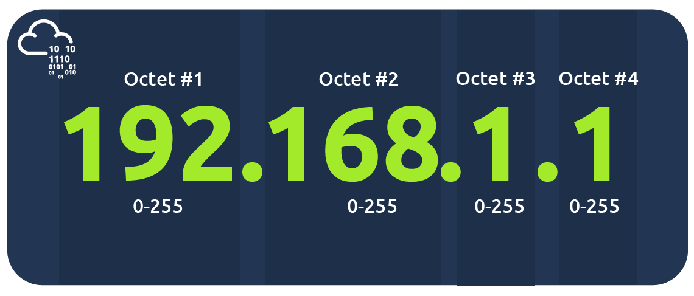

Có thể hiểu địa chỉ IP giống như **địa chỉ nhà**. Nếu muốn gửi thư hoặc bưu kiện cho một người, ta cần biết địa chỉ nhà của họ. Tương tự, khi một máy tính muốn gửi dữ liệu đến máy tính khác, nó cần biết địa chỉ IP của thiết bị đích.

Ví dụ về địa chỉ IP:

```text
192.168.1.10
8.8.8.8
10.0.0.5
```

Trong mạng máy tính, địa chỉ IP giúp xác định:

* Thiết bị nào đang gửi dữ liệu.
* Thiết bị nào sẽ nhận dữ liệu.
* Thiết bị đó thuộc mạng nào.
* Dữ liệu cần được định tuyến đến đâu.

Ví dụ, khi bạn truy cập một website, máy tính của bạn cần biết địa chỉ IP của máy chủ web để gửi yêu cầu đến đúng nơi.

## 2.2. Địa chỉ MAC

**Địa chỉ MAC** (Media Access Control Address) là địa chỉ vật lý của card mạng trên thiết bị. Địa chỉ này được gắn với phần cứng mạng, ví dụ như card Ethernet hoặc card Wi-Fi.

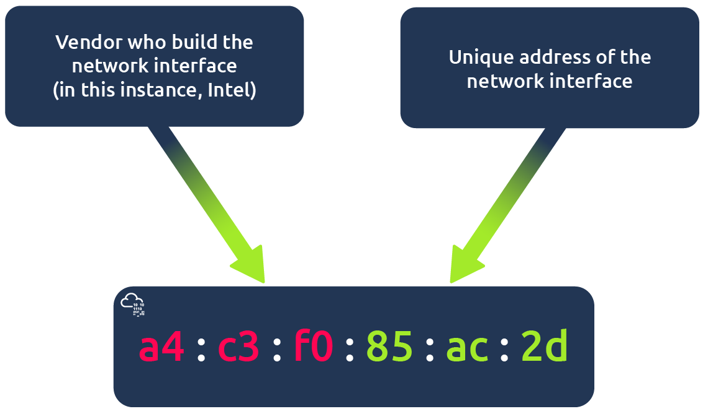

Địa chỉ MAC thường được biểu diễn dưới dạng hệ thập lục phân, gồm 6 nhóm ký tự, mỗi nhóm cách nhau bằng dấu hai chấm `:` hoặc dấu gạch ngang `-`.

Ví dụ:

```text
74:78:27:0c:05:1c
44:df:65:d8:fe:6c
7C:DF:A1:D3:8C:5C
```

Địa chỉ MAC thường được sử dụng trong mạng cục bộ, đặc biệt ở tầng liên kết dữ liệu. Khi các thiết bị trong cùng một mạng LAN muốn trao đổi dữ liệu, chúng cần biết địa chỉ MAC của nhau.

Một điểm quan trọng là:

* Địa chỉ IP dùng để xác định thiết bị ở mức logic.
* Địa chỉ MAC dùng để xác định thiết bị ở mức vật lý trong mạng cục bộ.

Ví dụ, khi máy tính A muốn gửi dữ liệu đến máy tính B trong cùng mạng LAN, máy tính A cần biết địa chỉ MAC của máy tính B để đóng gói dữ liệu vào frame và gửi qua Ethernet hoặc Wi-Fi.

## 2.3. Sự khác nhau giữa địa chỉ IP và địa chỉ MAC

Địa chỉ IP và địa chỉ MAC đều dùng để nhận diện thiết bị trong mạng, nhưng chúng hoạt động ở các tầng khác nhau và có mục đích khác nhau.

| Tiêu chí               | Địa chỉ IP                      | Địa chỉ MAC                   |
| ---------------------- | ------------------------------- | ----------------------------- |
| Loại địa chỉ           | Địa chỉ logic                   | Địa chỉ vật lý                |
| Gắn với                | Cấu hình mạng của thiết bị      | Card mạng của thiết bị        |
| Có thể thay đổi không? | Có thể thay đổi                 | Thường cố định theo phần cứng |
| Phạm vi sử dụng        | Dùng để giao tiếp giữa các mạng | Dùng trong mạng cục bộ        |
| Tầng hoạt động         | Tầng mạng                       | Tầng liên kết dữ liệu         |
| Ví dụ                  | `192.168.1.10`                  | `74:78:27:0c:05:1c`           |

Ví dụ dễ hiểu:

* **Địa chỉ IP** giống như địa chỉ nhà hiện tại của bạn. Nếu bạn chuyển nhà, địa chỉ này có thể thay đổi.
* **Địa chỉ MAC** giống như số định danh phần cứng của thiết bị mạng. Nó gắn với card mạng và ít thay đổi hơn.

Trong thực tế, khi một thiết bị muốn giao tiếp với thiết bị khác trong cùng mạng LAN, nó có thể biết địa chỉ IP của thiết bị đích nhưng vẫn cần tìm địa chỉ MAC tương ứng. Quá trình này được thực hiện bằng giao thức **ARP**.

## 2.4. Địa chỉ IPv4

**IPv4** (Internet Protocol version 4) là phiên bản địa chỉ IP phổ biến nhất hiện nay. Địa chỉ IPv4 có độ dài **32 bit** và thường được viết thành 4 phần, gọi là **octet**. Mỗi octet có giá trị từ `0` đến `255`.

Ví dụ:

```text
192.168.1.10
172.16.0.5
8.8.8.8
```

Một địa chỉ IPv4 gồm 4 octet:

```text
192.168.1.10
```

Có thể hiểu như sau:

| Octet 1 | Octet 2 | Octet 3 | Octet 4 |
| ------- | ------- | ------- | ------- |
| 192     | 168     | 1       | 10      |

Vì IPv4 có 32 bit nên về lý thuyết có khoảng:

```text
2^32 = 4.294.967.296 địa chỉ
```

Tuy nhiên, không phải tất cả địa chỉ IPv4 đều dùng được cho thiết bị người dùng. Một số địa chỉ được dành riêng cho mục đích đặc biệt, ví dụ:

* Địa chỉ mạng.
* Địa chỉ broadcast.
* Địa chỉ private.
* Địa chỉ loopback.
* Địa chỉ multicast.

Ví dụ trong mạng:

```text
192.168.1.0/24
```

Thông thường:

* `192.168.1.0` là địa chỉ mạng.
* `192.168.1.1` đến `192.168.1.254` là địa chỉ có thể gán cho thiết bị.
* `192.168.1.255` là địa chỉ broadcast.

## 2.5. Địa chỉ IPv6

**IPv6** (Internet Protocol version 6) là phiên bản mới hơn của giao thức IP, được tạo ra để giải quyết vấn đề thiếu hụt địa chỉ IPv4.

IPv6 có độ dài **128 bit**, lớn hơn rất nhiều so với IPv4. Nhờ đó, IPv6 cung cấp số lượng địa chỉ cực kỳ lớn.

Ví dụ địa chỉ IPv6:

```text
2001:0db8:85a3:0000:0000:8a2e:0370:7334
```

Địa chỉ IPv6 được viết bằng hệ thập lục phân và chia thành nhiều nhóm, ngăn cách bằng dấu hai chấm `:`.

Một số ưu điểm của IPv6:

* Không gian địa chỉ lớn hơn rất nhiều so với IPv4.
* Giảm phụ thuộc vào NAT trong nhiều trường hợp.
* Hỗ trợ tốt hơn cho các mạng hiện đại có số lượng thiết bị lớn.
* Phù hợp với sự phát triển của IoT, cloud và các hệ thống phân tán.

So sánh đơn giản:

| Tiêu chí         | IPv4           | IPv6                          |
| ---------------- | -------------- | ----------------------------- |
| Độ dài           | 32 bit         | 128 bit                       |
| Cách viết        | Dạng thập phân | Dạng thập lục phân            |
| Ví dụ            | `192.168.1.10` | `2001:db8::1`                 |
| Số lượng địa chỉ | Khoảng 4,3 tỷ  | Rất lớn                       |
| Mức độ phổ biến  | Rất phổ biến   | Đang được triển khai rộng hơn |

Mặc dù IPv6 đang ngày càng được sử dụng nhiều hơn, IPv4 vẫn rất phổ biến trong các mạng gia đình, doanh nghiệp và phòng lab.


## 2.6. Địa chỉ IP public và private

Trong thực tế, địa chỉ IP thường được chia thành hai loại chính:

* **Địa chỉ IP public**
* **Địa chỉ IP private**

**Địa chỉ IP private**

**Địa chỉ IP private** là địa chỉ được sử dụng trong mạng nội bộ, ví dụ như mạng gia đình, mạng công ty hoặc mạng lab. Các địa chỉ này không được định tuyến trực tiếp trên Internet.

Các dải địa chỉ IPv4 private phổ biến:

| Dải địa chỉ      | Phạm vi                             |
| ---------------- | ----------------------------------- |
| `10.0.0.0/8`     | `10.0.0.0` đến `10.255.255.255`     |
| `172.16.0.0/12`  | `172.16.0.0` đến `172.31.255.255`   |
| `192.168.0.0/16` | `192.168.0.0` đến `192.168.255.255` |

Ví dụ địa chỉ IP private:

```text
192.168.1.10
192.168.0.100
10.0.0.5
172.16.1.20
```

Các thiết bị trong cùng mạng private có thể giao tiếp với nhau. Tuy nhiên, nếu muốn truy cập Internet, chúng thường phải đi qua router và sử dụng kỹ thuật **NAT**.

**Địa chỉ IP public**

**Địa chỉ IP public** là địa chỉ được sử dụng để định danh một thiết bị hoặc hệ thống trên Internet. Địa chỉ này có thể được định tuyến trên mạng Internet toàn cầu.

Ví dụ:

```text
8.8.8.8
1.1.1.1
93.184.216.34
```

Một địa chỉ IP public thường được cấp bởi nhà cung cấp dịch vụ Internet hoặc nhà cung cấp cloud.

**So sánh IP public và IP private**

| Tiêu chí                                 | IP private                             | IP public                    |
| ---------------------------------------- | -------------------------------------- | ---------------------------- |
| Phạm vi sử dụng                          | Mạng nội bộ                            | Internet                     |
| Có truy cập trực tiếp từ Internet không? | Không                                  | Có                           |
| Ai cấp phát?                             | Router, DHCP server hoặc quản trị viên | ISP hoặc nhà cung cấp cloud  |
| Ví dụ                                    | `192.168.1.10`                         | `8.8.8.8`                    |
| Dùng trong mạng gia đình                 | Có                                     | Thường là địa chỉ của router |

Ví dụ trong mạng gia đình:

* Laptop có IP private: `192.168.1.10`
* Điện thoại có IP private: `192.168.1.11`
* Router có IP public: `86.157.52.21`

Khi laptop và điện thoại truy cập Internet, bên ngoài thường chỉ nhìn thấy địa chỉ IP public của router.

## 2.7. Subnet và subnet mask

**Subnet** là mạng con được chia ra từ một mạng lớn hơn. Việc chia subnet giúp quản lý mạng dễ hơn, giảm broadcast không cần thiết và phân tách các nhóm thiết bị theo chức năng.

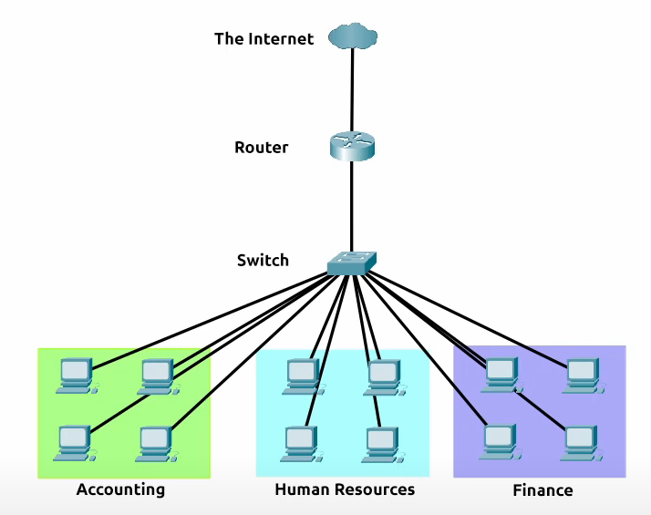

Ví dụ, trong một công ty, ta có thể chia mạng thành nhiều subnet:

* Subnet cho phòng Kế toán.
* Subnet cho phòng Nhân sự.
* Subnet cho phòng Kỹ thuật.
* Subnet cho máy chủ.
* Subnet cho khách truy cập Wi-Fi.

**Subnet mask là gì?**

**Subnet mask** là giá trị dùng để xác định phần nào của địa chỉ IP là **phần mạng** và phần nào là **phần host**.

Ví dụ:

```text
IP address:   192.168.1.10
Subnet mask:  255.255.255.0
```

Với subnet mask `255.255.255.0`, ta có thể hiểu:

* Phần mạng là `192.168.1`
* Phần host là `.10`

Mạng tương ứng là:

```text
192.168.1.0/24
```

Trong mạng này:

| Loại địa chỉ      | Giá trị                           |
| ----------------- | --------------------------------- |
| Network address   | `192.168.1.0`                     |
| Usable host range | `192.168.1.1` đến `192.168.1.254` |
| Broadcast address | `192.168.1.255`                   |
| Subnet mask       | `255.255.255.0`                   |

**Network address**

**Network address** là địa chỉ đại diện cho toàn bộ mạng con. Địa chỉ này không gán cho thiết bị người dùng.

Ví dụ:

```text
192.168.1.0
```

**Host address**

**Host address** là địa chỉ có thể gán cho thiết bị trong mạng.

Ví dụ:

```text
192.168.1.10
192.168.1.20
192.168.1.100
```

**Broadcast address**

**Broadcast address** là địa chỉ dùng để gửi dữ liệu đến tất cả thiết bị trong cùng mạng con.

Ví dụ:

```text
192.168.1.255
```

## 2.8. CIDR notation

**CIDR** (Classless Inter-Domain Routing) là cách viết ngắn gọn để biểu diễn địa chỉ mạng và subnet mask.

Thay vì viết:

```text
192.168.1.0
255.255.255.0
```

ta có thể viết:

```text
192.168.1.0/24
```

Ký hiệu `/24` cho biết có **24 bit đầu tiên** được dùng cho phần mạng. Phần còn lại dùng cho host.

Ví dụ:

```text
192.168.1.0/24
```

Nghĩa là:

* 24 bit đầu là phần mạng.
* 8 bit còn lại là phần host.
* Subnet mask tương ứng là `255.255.255.0`.

Một số CIDR phổ biến:

| CIDR  | Subnet mask       | Số địa chỉ | Số host dùng được |
| ----- | ----------------- | ---------: | ----------------: |
| `/8`  | `255.0.0.0`       | 16.777.216 |        16.777.214 |
| `/16` | `255.255.0.0`     |     65.536 |            65.534 |
| `/24` | `255.255.255.0`   |        256 |               254 |
| `/25` | `255.255.255.128` |        128 |               126 |
| `/26` | `255.255.255.192` |         64 |                62 |
| `/27` | `255.255.255.224` |         32 |                30 |
| `/28` | `255.255.255.240` |         16 |                14 |
| `/30` | `255.255.255.252` |          4 |                 2 |

Công thức cơ bản:

```text
Số địa chỉ = 2^(32 - prefix)
Số host dùng được = 2^(32 - prefix) - 2
```

Ví dụ với `/24`:

```text
Số địa chỉ = 2^(32 - 24) = 2^8 = 256
Số host dùng được = 256 - 2 = 254
```

Ta trừ 2 vì:

* Một địa chỉ dành cho network address.
* Một địa chỉ dành cho broadcast address.

Ví dụ thực tế:

```text
192.168.10.0/24
```

Mạng này có:

* Network address: `192.168.10.0`
* Usable host: `192.168.10.1` đến `192.168.10.254`
* Broadcast address: `192.168.10.255`
* Subnet mask: `255.255.255.0`

CIDR rất quan trọng trong quản trị mạng, cấu hình firewall, routing, cloud networking và phân tích bảo mật.

# 3. Các mô hình mạng cơ bản

## 3.1. Mô hình OSI

**Mô hình OSI** (Open Systems Interconnection Model) là mô hình lý thuyết dùng để mô tả cách dữ liệu được truyền giữa các thiết bị trong mạng.

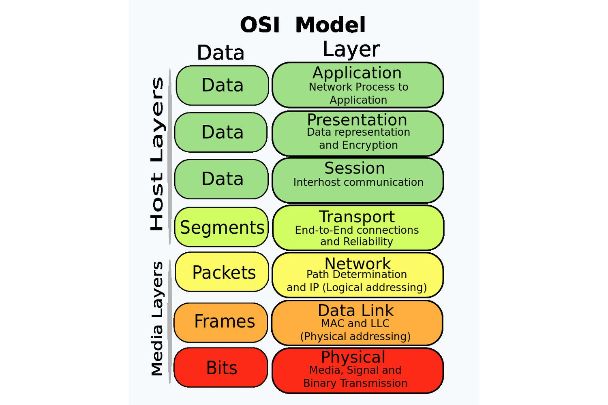

Mô hình này chia quá trình truyền thông mạng thành **7 tầng**. Mỗi tầng đảm nhiệm một vai trò riêng và phối hợp với các tầng khác để dữ liệu có thể được gửi, nhận và xử lý đúng cách.

7 tầng của mô hình OSI gồm:

| Số tầng | Tên tầng | Tên tiếng Anh |
|---:|---|---|
| 7 | Tầng Ứng dụng | Application Layer |
| 6 | Tầng Trình bày | Presentation Layer |
| 5 | Tầng Phiên | Session Layer |
| 4 | Tầng Giao vận | Transport Layer |
| 3 | Tầng Mạng | Network Layer |
| 2 | Tầng Liên kết dữ liệu | Data Link Layer |
| 1 | Tầng Vật lý | Physical Layer |

Mô hình OSI giúp người học hiểu rõ:

- Dữ liệu đi qua mạng theo những bước nào.
- Giao thức nào hoạt động ở tầng nào.
- Thiết bị mạng hoạt động ở tầng nào.
- Lỗi mạng có thể xảy ra ở vị trí nào.
- Cách phân tích gói tin bằng các công cụ như Wireshark.

Một khái niệm quan trọng trong mô hình OSI là **encapsulation**. Đây là quá trình dữ liệu được bổ sung thêm thông tin điều khiển khi đi từ tầng cao xuống tầng thấp trước khi được truyền qua mạng.

Khi dữ liệu đi từ máy nhận theo chiều ngược lại, quá trình tháo bỏ các thông tin này được gọi là **decapsulation**.


### 3.1.1. Tầng 1 – Physical Layer

**Physical Layer** là tầng thấp nhất trong mô hình OSI. Tầng này xử lý việc truyền dữ liệu dưới dạng tín hiệu vật lý qua môi trường truyền dẫn.

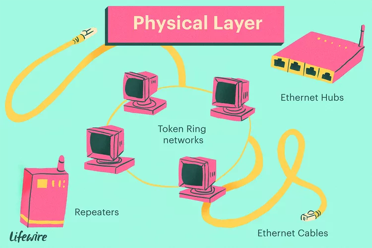

Tầng vật lý không quan tâm dữ liệu là website, email hay file. Nó chỉ quan tâm đến việc truyền các bit `0` và `1` qua môi trường mạng.

Ví dụ về môi trường truyền dẫn:

- Cáp Ethernet.
- Cáp quang.
- Sóng Wi-Fi.
- Sóng radio.
- Tín hiệu điện.
- Tín hiệu ánh sáng.

Vai trò chính của tầng Physical:

- Truyền bit qua môi trường vật lý.
- Quy định loại cáp, đầu nối, tín hiệu điện/quang/không dây.
- Xác định tốc độ truyền dữ liệu.
- Xử lý kết nối vật lý giữa các thiết bị.

Ví dụ thiết bị hoạt động ở tầng Physical:

| Thiết bị / Thành phần | Vai trò |
|---|---|
| Cáp mạng | Truyền tín hiệu vật lý |
| Hub | Khuếch đại và phát tín hiệu đến nhiều cổng |
| Repeater | Khuếch đại tín hiệu mạng |
| Card mạng | Kết nối thiết bị với môi trường truyền dẫn |
| Access Point | Truyền tín hiệu không dây |

Ví dụ lỗi ở tầng Physical:

- Dây mạng bị đứt.
- Cắm sai cổng.
- Card mạng bị lỗi.
- Sóng Wi-Fi yếu.
- Cáp mạng không đạt chuẩn.
- Mất tín hiệu vật lý.

### 3.1.2. Tầng 2 – Data Link Layer

**Data Link Layer** chịu trách nhiệm truyền dữ liệu giữa các thiết bị trong cùng một mạng cục bộ hoặc cùng một đoạn mạng.

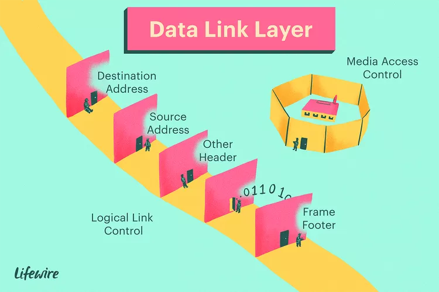

Ở tầng này, dữ liệu được đóng gói thành **frame**. Frame chứa thông tin cần thiết để truyền dữ liệu trong mạng LAN, đặc biệt là địa chỉ MAC nguồn và địa chỉ MAC đích.

Vai trò chính của tầng Data Link:

- Truyền dữ liệu giữa các thiết bị trong cùng mạng LAN.
- Sử dụng địa chỉ MAC để xác định thiết bị.
- Đóng gói dữ liệu thành frame.
- Phát hiện lỗi truyền dữ liệu ở mức liên kết.
- Điều khiển truy cập vào môi trường truyền dẫn.

Ví dụ giao thức và công nghệ ở tầng Data Link:

- Ethernet.
- Wi-Fi.
- ARP.
- VLAN.
- MAC address.

Ví dụ thiết bị hoạt động ở tầng Data Link:

| Thiết bị | Vai trò |
|---|---|
| Switch Layer 2 | Chuyển frame dựa trên địa chỉ MAC |
| Bridge | Kết nối các đoạn mạng LAN |
| Network Interface Card | Cung cấp địa chỉ MAC cho thiết bị |

Ví dụ:

Khi máy tính A muốn gửi dữ liệu cho máy tính B trong cùng mạng LAN, nó cần biết địa chỉ MAC của máy tính B. Sau đó, dữ liệu được đóng gói thành frame và gửi qua switch đến đúng thiết bị đích.

Chúng ta kỳ vọng sẽ thấy hai địa chỉ MAC trong mỗi khung dữ liệu khi giao tiếp mạng thực tế qua Ethernet hoặc WiFi. Gói tin trong ảnh chụp màn hình bên dưới hiển thị:

Địa chỉ liên kết dữ liệu đích (địa chỉ MAC) được đánh dấu màu vàng
Địa chỉ liên kết dữ liệu nguồn (địa chỉ MAC) được đánh dấu màu xanh dương
Các bit còn lại thể hiện dữ liệu đang được gửi

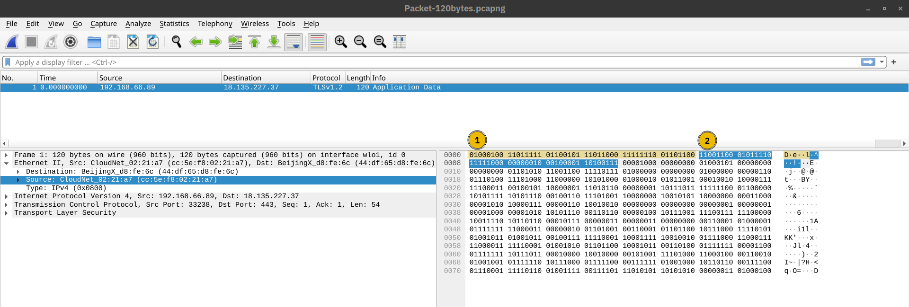

### 3.1.3. Tầng 3 – Network Layer

**Network Layer** chịu trách nhiệm định địa chỉ logic và định tuyến dữ liệu giữa các mạng khác nhau.

Ở tầng này, dữ liệu được gọi là **packet**. Packet thường chứa địa chỉ IP nguồn và địa chỉ IP đích để xác định dữ liệu đến từ đâu và cần đi đến đâu.

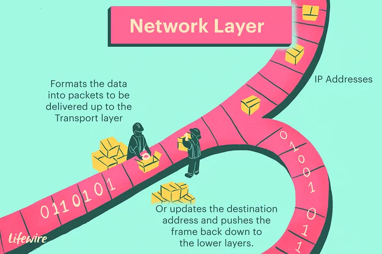

Vai trò chính của tầng Network:

- Gán và xử lý địa chỉ IP.
- Định tuyến packet giữa các mạng.
- Chọn đường đi phù hợp cho dữ liệu.
- Cho phép các thiết bị ở các mạng khác nhau giao tiếp với nhau.

Ví dụ giao thức ở tầng Network:

- IP.
- ICMP.
- IPSec.

Ví dụ thiết bị hoạt động ở tầng Network:

| Thiết bị | Vai trò |
|---|---|
| Router | Định tuyến dữ liệu giữa các mạng |
| Layer 3 Switch | Chuyển mạch và định tuyến trong mạng nội bộ |
| Firewall Layer 3 | Lọc lưu lượng dựa trên địa chỉ IP |

Ví dụ:

Khi máy tính trong mạng gia đình truy cập một website trên Internet, dữ liệu phải đi qua router. Router sẽ xem địa chỉ IP đích và quyết định gửi packet đi theo đường nào.


### 3.1.4. Tầng 4 – Transport Layer

**Transport Layer** chịu trách nhiệm truyền dữ liệu từ đầu cuối đến đầu cuối giữa các ứng dụng đang chạy trên các thiết bị khác nhau.

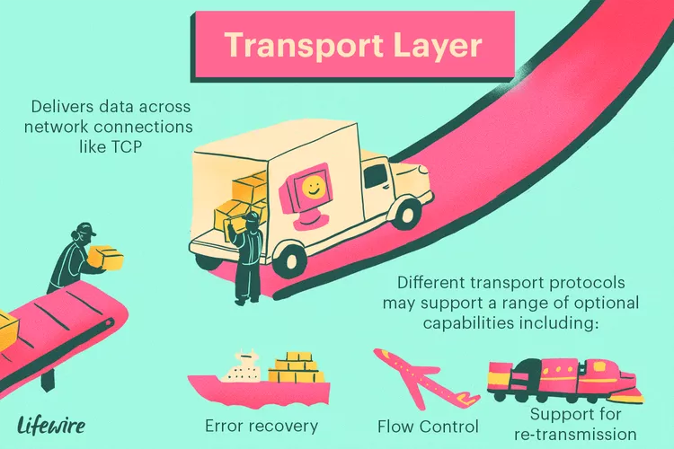

Tầng này giúp đảm bảo dữ liệu được chia nhỏ, truyền đi và ghép lại đúng cách. Hai giao thức quan trọng nhất ở tầng này là **TCP** và **UDP**.

Vai trò chính của tầng Transport:

- Chia dữ liệu thành các phần nhỏ.
- Quản lý kết nối giữa hai thiết bị.
- Kiểm soát lỗi và đảm bảo độ tin cậy nếu dùng TCP.
- Xác định ứng dụng đích bằng số cổng.
- Cho phép nhiều ứng dụng mạng chạy đồng thời trên cùng một thiết bị.

Hai giao thức phổ biến:

| Giao thức | Đặc điểm |
|---|---|
| TCP | Tin cậy, có kết nối, kiểm tra lỗi, đảm bảo đúng thứ tự |
| UDP | Nhanh, không kết nối, ít kiểm soát lỗi hơn TCP |

Ví dụ cổng ở tầng Transport:

| Cổng | Giao thức / Dịch vụ |
|---:|---|
| 21 | FTP |
| 22 | SSH |
| 25 | SMTP |
| 53 | DNS |
| 80 | HTTP |
| 443 | HTTPS |

Ví dụ:

Khi truy cập một website HTTPS, trình duyệt thường kết nối đến máy chủ web qua cổng TCP `443`.

### 3.1.5. Tầng 5 – Session Layer

**Session Layer** chịu trách nhiệm thiết lập, duy trì và kết thúc phiên giao tiếp giữa các ứng dụng.

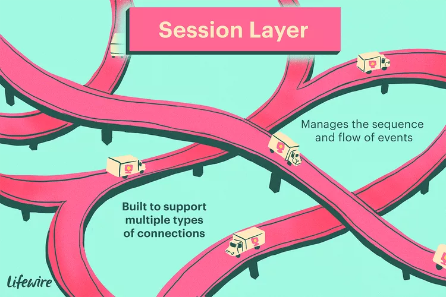

Một **session** có thể hiểu là một phiên làm việc hoặc một kết nối logic giữa hai hệ thống. Tầng này giúp hai bên giao tiếp đồng bộ và quản lý trạng thái của phiên.

Vai trò chính của tầng Session:

- Thiết lập phiên giao tiếp.
- Duy trì phiên trong quá trình truyền dữ liệu.
- Đồng bộ hóa quá trình trao đổi dữ liệu.
- Khôi phục phiên nếu có lỗi.
- Kết thúc phiên khi không còn cần thiết.

Ví dụ:

Khi bạn đăng nhập vào một website, hệ thống có thể tạo một phiên làm việc để ghi nhớ rằng bạn đã đăng nhập. Trong quá trình bạn truy cập các trang khác nhau, phiên này vẫn được duy trì.

Ví dụ công nghệ / giao thức liên quan:

- RPC.
- NFS.
- Session management trong ứng dụng web.

### 3.1.6. Tầng 6 – Presentation Layer

**Presentation Layer** chịu trách nhiệm định dạng, chuyển đổi, mã hóa, giải mã và nén dữ liệu để tầng ứng dụng có thể hiểu được.

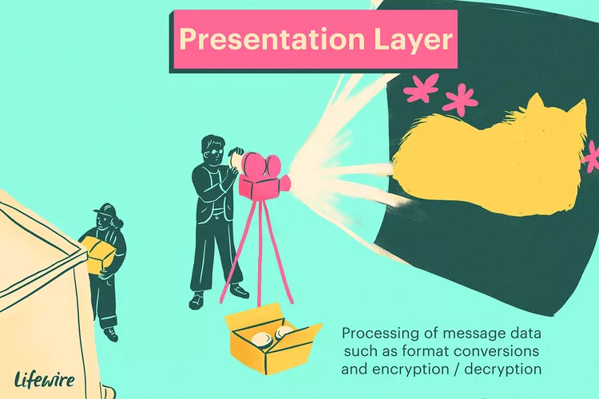

Tầng này hoạt động như một “bộ dịch” dữ liệu giữa ứng dụng và hệ thống mạng.

Vai trò chính của tầng Presentation:

- Chuyển đổi định dạng dữ liệu.
- Mã hóa và giải mã dữ liệu.
- Nén và giải nén dữ liệu.
- Đảm bảo dữ liệu được trình bày đúng định dạng cho ứng dụng.

Ví dụ định dạng và tiêu chuẩn ở tầng Presentation:

- ASCII.
- Unicode.
- JPEG.
- PNG.
- GIF.
- MPEG.
- MIME.
- TLS/SSL trong một số cách diễn giải.

Ví dụ:

Khi bạn gửi một hình ảnh qua email, hình ảnh có thể được mã hóa theo định dạng phù hợp để ứng dụng email có thể truyền và hiển thị đúng ở phía người nhận.

### 3.1.7. Tầng 7 – Application Layer

**Application Layer** là tầng cao nhất trong mô hình OSI. Đây là tầng gần nhất với người dùng và cung cấp các dịch vụ mạng trực tiếp cho ứng dụng.


Tầng này không phải là bản thân ứng dụng như Chrome, Firefox hay Outlook, mà là các giao thức giúp ứng dụng giao tiếp qua mạng.

Vai trò chính của tầng Application:

- Cung cấp dịch vụ mạng cho ứng dụng người dùng.
- Cho phép truy cập website, email, file, tên miền.
- Xác định quy tắc giao tiếp giữa client và server ở mức ứng dụng.

Ví dụ giao thức tầng Application:

| Giao thức | Chức năng |
|---|---|
| HTTP | Truy cập website |
| HTTPS | Truy cập website an toàn |
| DNS | Phân giải tên miền thành địa chỉ IP |
| FTP | Truyền file |
| SMTP | Gửi email |
| POP3 | Nhận email |
| IMAP | Đồng bộ email |
| SSH | Truy cập từ xa an toàn |

Ví dụ:

Khi bạn nhập `https://example.com` vào trình duyệt, trình duyệt sử dụng giao thức HTTPS ở tầng Application để yêu cầu nội dung từ máy chủ web.

## 3.2. Mô hình TCP/IP

### 3.2.1. Mô hình TCP/IP là gì?

**TCP/IP** là mô hình mạng được sử dụng phổ biến nhất hiện nay, đặc biệt là trong Internet.

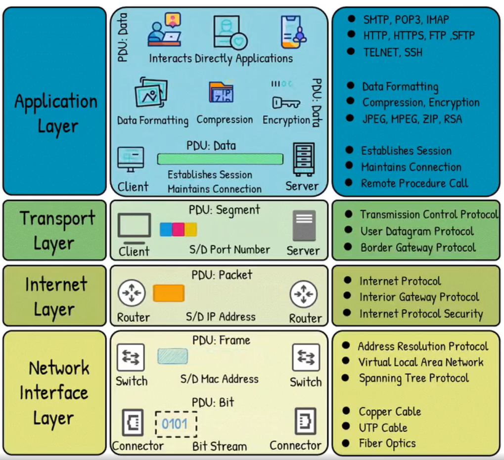

Tên TCP/IP được lấy từ hai giao thức quan trọng nhất:

* **TCP**: Transmission Control Protocol
* **IP**: Internet Protocol

Mô hình TCP/IP mô tả cách dữ liệu được chia nhỏ, truyền qua mạng, định tuyến đến đúng thiết bị nhận và được ghép lại thành dữ liệu ban đầu.

### 3.2.2. Các tầng trong mô hình TCP/IP

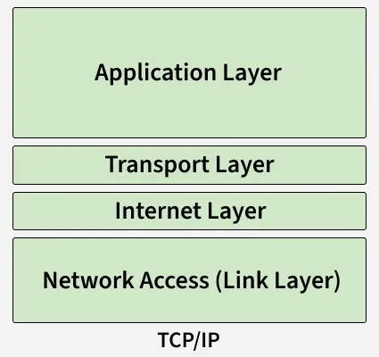

Mô hình TCP/IP thường gồm **4 tầng chính**:

| Tầng | Tên tầng       | Chức năng chính                                   | Ví dụ giao thức                  |
| ---- | -------------- | ------------------------------------------------- | -------------------------------- |
| 4    | Application    | Cung cấp dịch vụ mạng cho ứng dụng người dùng     | HTTP, HTTPS, FTP, DNS, SMTP, SSH |
| 3    | Transport      | Quản lý truyền dữ liệu giữa hai thiết bị          | TCP, UDP                         |
| 2    | Internet       | Định tuyến gói tin qua các mạng khác nhau         | IP, ICMP, ARP                    |
| 1    | Network Access | Truyền dữ liệu trong mạng vật lý hoặc mạng cục bộ | Ethernet, Wi-Fi                  |

### 3.2.3. Tầng Application

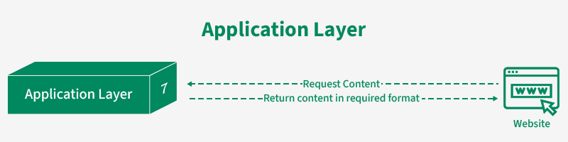

Tầng **Application** là tầng gần với người dùng nhất.
Nó cung cấp các dịch vụ mạng cho ứng dụng như trình duyệt web, email, truyền file hoặc truy cập từ xa.

Ví dụ:

| Giao thức | Chức năng                          |
| --------- | ---------------------------------- |
| HTTP      | Truy cập website                   |
| HTTPS     | Truy cập website có mã hóa         |
| DNS       | Phân giải tên miền sang địa chỉ IP |
| FTP       | Truyền file                        |
| SMTP      | Gửi email                          |
| SSH       | Điều khiển máy chủ từ xa an toàn   |

Ví dụ:
Khi người dùng truy cập `google.com`, trình duyệt sử dụng các giao thức như **DNS**, **HTTPS** để tìm địa chỉ IP và tải nội dung trang web.

### 3.2.4. Tầng Transport

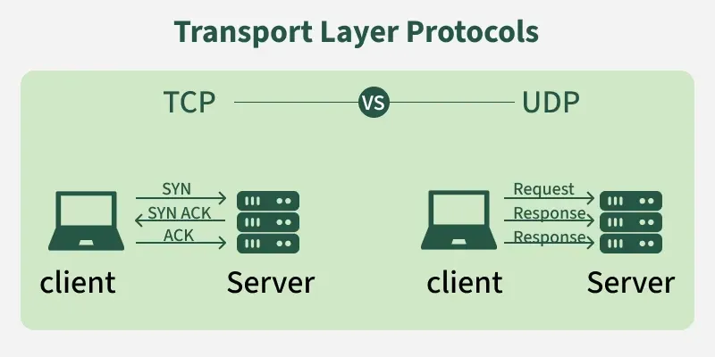

Tầng **Transport** chịu trách nhiệm truyền dữ liệu giữa hai thiết bị đầu cuối.

Hai giao thức quan trọng nhất là:

| Giao thức | Đặc điểm                                                   |
| --------- | ---------------------------------------------------------- |
| TCP       | Có kiểm tra lỗi, đảm bảo dữ liệu đến đầy đủ và đúng thứ tự |
| UDP       | Truyền nhanh hơn nhưng không đảm bảo dữ liệu đến đầy đủ    |

Ví dụ:

* **TCP** thường dùng cho web, email, truyền file.
* **UDP** thường dùng cho video call, game online, streaming.

### 3.2.5. Tầng Internet

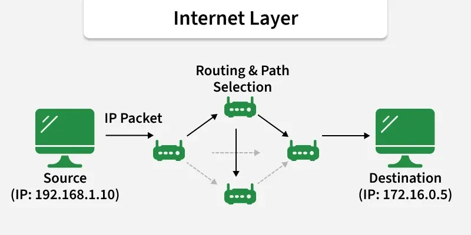

Tầng **Internet** chịu trách nhiệm định tuyến dữ liệu từ nguồn đến đích thông qua địa chỉ IP.

Các chức năng chính:

* Gắn địa chỉ IP nguồn và IP đích vào gói tin.
* Xác định đường đi của gói tin qua mạng.
* Cho phép các mạng khác nhau có thể giao tiếp với nhau.

Một số giao thức phổ biến:

| Giao thức | Chức năng                                               |
| --------- | ------------------------------------------------------- |
| IP        | Định địa chỉ và định tuyến gói tin                      |
| ICMP      | Kiểm tra kết nối, ví dụ lệnh `ping`                     |
| ARP       | Tìm địa chỉ MAC tương ứng với địa chỉ IP trong mạng LAN |

### 3.2.6. Tầng Network Access

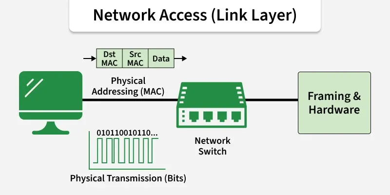

Tầng **Network Access** chịu trách nhiệm truyền dữ liệu trong môi trường mạng vật lý hoặc mạng cục bộ.

Tầng này liên quan đến:

* Card mạng
* Địa chỉ MAC
* Cáp mạng
* Wi-Fi
* Switch
* Chuẩn Ethernet

Ví dụ:
Trong mạng LAN, dữ liệu được truyền từ máy tính đến router thông qua Ethernet hoặc Wi-Fi.

### 3.2.7. Quá trình truyền dữ liệu trong mô hình TCP/IP

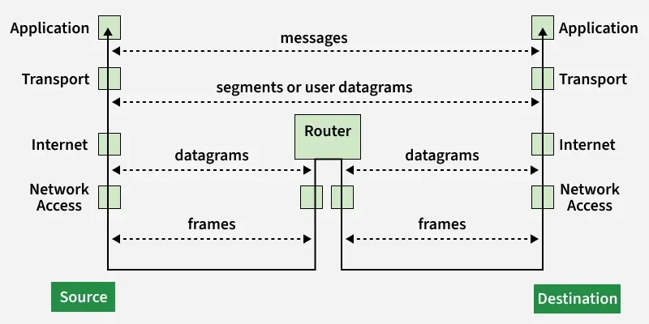

Khi một máy tính gửi dữ liệu qua mạng, dữ liệu sẽ đi từ tầng trên xuống tầng dưới:

```text
Application
↓
Transport
↓
Internet
↓
Network Access
```

Khi thiết bị nhận nhận được dữ liệu, quá trình sẽ diễn ra ngược lại:

```text
Network Access
↓
Internet
↓
Transport
↓
Application
```

Ví dụ khi truy cập website:

| Bước | Hoạt động                                           |
| ---- | --------------------------------------------------- |
| 1    | Người dùng nhập địa chỉ website                     |
| 2    | DNS phân giải tên miền thành địa chỉ IP             |
| 3    | TCP thiết lập kết nối                               |
| 4    | IP định tuyến gói tin đến máy chủ                   |
| 5    | Ethernet hoặc Wi-Fi truyền dữ liệu qua mạng         |
| 6    | Máy chủ phản hồi nội dung website về máy người dùng |

### 3.2.8. Ưu điểm của mô hình TCP/IP

| Ưu điểm              | Giải thích                                                         |
| -------------------- | ------------------------------------------------------------------ |
| Phổ biến             | Được sử dụng làm nền tảng cho Internet                             |
| Linh hoạt            | Có thể hoạt động trên nhiều loại mạng khác nhau                    |
| Khả năng mở rộng cao | Phù hợp với mạng nhỏ, mạng doanh nghiệp và Internet toàn cầu       |
| Chuẩn hóa tốt        | Nhiều thiết bị và hệ điều hành đều hỗ trợ TCP/IP                   |
| Dễ triển khai        | Các giao thức TCP/IP được tích hợp sẵn trong hầu hết hệ thống mạng |

## 3.3. So sánh mô hình OSI và TCP/IP

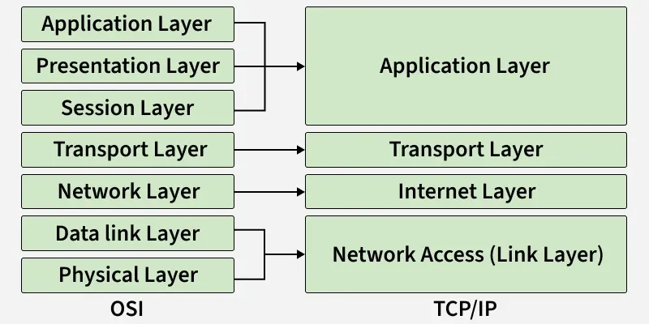

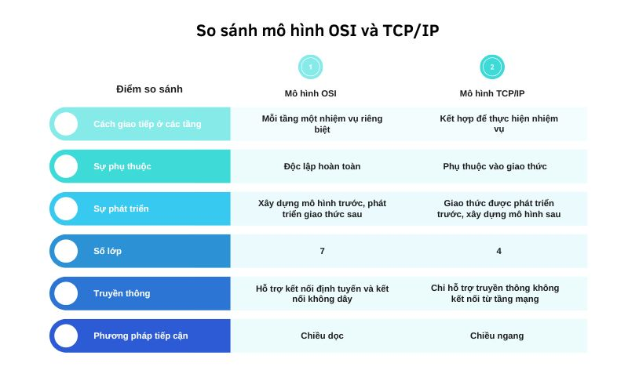

Mô hình OSI và TCP/IP đều được dùng để giải thích cách dữ liệu di chuyển trong mạng. Tuy nhiên, hai mô hình này có mục đích và cách chia tầng khác nhau.

| Tiêu chí | Mô hình OSI | Mô hình TCP/IP |
|---|---|---|
| Số tầng | 7 tầng | Thường 4 tầng hoặc 5 tầng |
| Tính chất | Mô hình lý thuyết | Mô hình thực tế |
| Mục đích | Giải thích chuẩn hóa quá trình truyền thông mạng | Mô tả bộ giao thức dùng trên Internet |
| Được dùng trong | Học tập, phân tích, troubleshooting | Triển khai thực tế trên mạng |
| Tầng ứng dụng | Tách thành Application, Presentation, Session | Gộp chung thành Application |
| Tầng thấp | Tách Physical và Data Link | Gộp trong Network Interface hoặc Link |

Bảng ánh xạ giữa OSI và TCP/IP:

| Mô hình OSI | Mô hình TCP/IP | Ví dụ giao thức / công nghệ |
|---|---|---|
| Layer 7 – Application | Application | HTTP, HTTPS, DNS, FTP, SMTP, SSH |
| Layer 6 – Presentation | Application | TLS, SSL, JPEG, PNG, Unicode, MIME |
| Layer 5 – Session | Application | RPC, NFS, session management |
| Layer 4 – Transport | Transport | TCP, UDP |
| Layer 3 – Network | Internet | IP, ICMP, IPSec |
| Layer 2 – Data Link | Network Interface | Ethernet, Wi-Fi, ARP, MAC |
| Layer 1 – Physical | Network Interface | Cable, fiber, radio signal |

Ví dụ khi truy cập một website:

| Bước | Mô tả |
|---:|---|
| 1 | Người dùng nhập URL vào trình duyệt |
| 2 | DNS phân giải tên miền thành địa chỉ IP |
| 3 | TCP thiết lập kết nối đến máy chủ |
| 4 | HTTP/HTTPS gửi request đến web server |
| 5 | Dữ liệu được chia thành segment, packet, frame |
| 6 | Tín hiệu được truyền qua cáp hoặc Wi-Fi |
| 7 | Máy chủ nhận dữ liệu, xử lý và gửi response về client |

Tóm lại:

- **OSI** phù hợp để học, phân tích và hiểu rõ từng bước truyền dữ liệu.
- **TCP/IP** phù hợp để hiểu cách Internet và các giao thức mạng thực tế hoạt động.

# 4. Encapsulation, Packets và Frames

## 4.1. Encapsulation là gì?

**Encapsulation** là quá trình **đóng gói dữ liệu** khi dữ liệu đi từ tầng cao xuống tầng thấp trong mô hình mạng.


Khi một ứng dụng gửi dữ liệu qua mạng, dữ liệu ban đầu không được gửi trực tiếp ngay lập tức. Thay vào đó, khi dữ liệu đi qua từng tầng trong mô hình OSI hoặc TCP/IP, mỗi tầng sẽ thêm vào một phần thông tin điều khiển gọi là **header**. Một số tầng cũng có thể thêm **trailer**.

Ví dụ đơn giản:

```text
Dữ liệu ứng dụng
→ thêm TCP header
→ thêm IP header
→ thêm Ethernet header
→ truyền qua cáp hoặc Wi-Fi
```

Quá trình này giống như việc gửi một lá thư:

* Nội dung thư là dữ liệu gốc.
* Phong bì chứa địa chỉ người gửi và người nhận.
* Dịch vụ bưu điện dùng thông tin trên phong bì để chuyển thư đến đúng nơi.

Trong mạng máy tính, dữ liệu cũng cần được “bọc” thêm thông tin để các thiết bị mạng biết:

* Dữ liệu đến từ đâu.
* Dữ liệu cần đi đến đâu.
* Dữ liệu thuộc giao thức nào.
* Dữ liệu cần được xử lý như thế nào.
* Dữ liệu có bị lỗi trong quá trình truyền hay không.

Ví dụ quá trình đóng gói theo mô hình OSI:

| Tầng OSI                             | Dữ liệu được gọi là | Thông tin được thêm vào        |
| ------------------------------------ | ------------------- | ------------------------------ |
| Application / Presentation / Session | Data                | Dữ liệu ứng dụng               |
| Transport                            | Segment / Datagram  | TCP hoặc UDP header            |
| Network                              | Packet              | IP header                      |
| Data Link                            | Frame               | MAC header và trailer          |
| Physical                             | Bits                | Tín hiệu điện, quang hoặc sóng |

Ví dụ khi truy cập một website:

1. Trình duyệt tạo yêu cầu HTTP.
2. Tầng Transport thêm TCP header.
3. Tầng Network thêm IP header.
4. Tầng Data Link thêm Ethernet header.
5. Tầng Physical truyền dữ liệu dưới dạng bit qua mạng.

Tóm lại, **encapsulation giúp dữ liệu có đủ thông tin cần thiết để được truyền qua mạng đến đúng thiết bị đích**.

## 4.2. Decapsulation là gì?

**Decapsulation** là quá trình **tháo gói dữ liệu** khi dữ liệu đi từ tầng thấp lên tầng cao ở phía thiết bị nhận.

Nếu encapsulation xảy ra ở máy gửi, thì decapsulation xảy ra ở máy nhận.

Khi thiết bị nhận nhận được dữ liệu từ mạng, dữ liệu sẽ đi từ tầng Physical lên các tầng cao hơn. Mỗi tầng sẽ đọc phần header tương ứng, xử lý thông tin cần thiết, sau đó loại bỏ header đó và chuyển phần còn lại lên tầng trên.

Ví dụ:

```text
Bits
→ Frame
→ Packet
→ Segment
→ Data
```

Quá trình decapsulation có thể hiểu như sau:

| Tầng        | Hành động                                 |
| ----------- | ----------------------------------------- |
| Physical    | Nhận tín hiệu và chuyển thành bit         |
| Data Link   | Đọc Ethernet header, kiểm tra MAC address |
| Network     | Đọc IP header, kiểm tra địa chỉ IP đích   |
| Transport   | Đọc TCP/UDP header, kiểm tra port         |
| Application | Nhận dữ liệu ứng dụng như HTTP, DNS, FTP  |

Ví dụ khi máy tính nhận phản hồi từ website:

1. Card mạng nhận tín hiệu từ dây mạng hoặc Wi-Fi.
2. Tầng Data Link kiểm tra frame có đúng địa chỉ MAC không.
3. Tầng Network kiểm tra packet có đúng địa chỉ IP không.
4. Tầng Transport kiểm tra cổng TCP hoặc UDP.
5. Tầng Application chuyển dữ liệu cho trình duyệt hiển thị.

Tóm lại:

* **Encapsulation** xảy ra khi gửi dữ liệu.
* **Decapsulation** xảy ra khi nhận dữ liệu.
* Hai quá trình này giúp dữ liệu được truyền đúng cách qua nhiều tầng mạng.


## 4.3. Packet là gì?

**Packet** là một đơn vị dữ liệu được sử dụng ở **tầng Network** trong mô hình OSI.

Packet thường chứa dữ liệu đã được đóng gói cùng với các thông tin địa chỉ IP. Nhờ có địa chỉ IP nguồn và địa chỉ IP đích, các router có thể định tuyến packet qua nhiều mạng khác nhau để đến đúng nơi cần đến.

Một packet thường bao gồm:

* IP header.
* Dữ liệu bên trong, ví dụ TCP segment hoặc UDP datagram.
* Các thông tin điều khiển phục vụ định tuyến và kiểm tra lỗi.

Ví dụ cấu trúc đơn giản của packet:

```text
[IP Header][Data]
```

Trong đó, **IP Header** có thể chứa:

* Source IP Address.
* Destination IP Address.
* TTL.
* Protocol.
* Checksum.

Ví dụ:

```text
Source IP:      192.168.1.10
Destination IP: 8.8.8.8
Protocol:       UDP
TTL:            64
```

Khi bạn truy cập một website, dữ liệu từ máy tính của bạn được chia thành nhiều packet nhỏ. Các packet này có thể đi qua nhiều router khác nhau trước khi đến máy chủ web.

Lý do dữ liệu được chia thành packet:

* Giúp truyền dữ liệu hiệu quả hơn.
* Giảm nguy cơ nghẽn mạng.
* Nếu một phần dữ liệu bị mất, chỉ cần gửi lại phần đó.
* Cho phép nhiều kết nối cùng chia sẻ hạ tầng mạng.

Ví dụ:

Một hình ảnh trên website không được gửi dưới dạng một khối dữ liệu lớn duy nhất. Nó thường được chia thành nhiều packet nhỏ, truyền qua mạng, sau đó được ghép lại ở phía máy nhận.

## 4.4. Frame là gì?

**Frame** là một đơn vị dữ liệu được sử dụng ở **tầng Data Link** trong mô hình OSI.

Frame được dùng để truyền dữ liệu giữa các thiết bị trong cùng một mạng cục bộ, ví dụ như cùng mạng LAN hoặc cùng mạng Wi-Fi.

Khác với packet, frame sử dụng **địa chỉ MAC** thay vì địa chỉ IP để xác định thiết bị gửi và thiết bị nhận trong mạng cục bộ.

Một frame thường bao gồm:

```text
[Frame Header][Packet/Data][Frame Trailer]
```

Trong đó:

* **Frame Header** chứa địa chỉ MAC nguồn và địa chỉ MAC đích.
* **Packet/Data** là dữ liệu được đóng gói bên trong frame.
* **Frame Trailer** có thể chứa thông tin kiểm tra lỗi, ví dụ FCS.

Ví dụ thông tin trong frame Ethernet:

```text
Source MAC:      74:78:27:0c:05:1c
Destination MAC: 44:df:65:d8:fe:6c
Type:            IPv4
```

Frame chỉ có ý nghĩa trong phạm vi mạng cục bộ. Khi dữ liệu đi qua router sang mạng khác, frame cũ thường bị loại bỏ và một frame mới được tạo ra cho đoạn mạng tiếp theo.

Ví dụ:

Máy tính A gửi dữ liệu đến router trong mạng LAN:

```text
Máy tính A → Switch → Router
```

Ở đoạn này, dữ liệu được truyền trong frame Ethernet. Frame sẽ chứa:

* MAC nguồn: MAC của máy tính A.
* MAC đích: MAC của router hoặc gateway.

Sau khi router nhận được frame, nó sẽ lấy packet bên trong, kiểm tra địa chỉ IP đích và tiếp tục định tuyến sang mạng khác.

## 4.5. Sự khác nhau giữa Packet và Frame

Packet và frame đều là các đơn vị dữ liệu được dùng trong quá trình truyền thông mạng, nhưng chúng thuộc các tầng khác nhau và có vai trò khác nhau.

| Tiêu chí             | Packet                                   | Frame                                      |
| -------------------- | ---------------------------------------- | ------------------------------------------ |
| Tầng OSI             | Tầng 3 – Network Layer                   | Tầng 2 – Data Link Layer                   |
| Địa chỉ sử dụng      | Địa chỉ IP                               | Địa chỉ MAC                                |
| Phạm vi hoạt động    | Giữa các mạng khác nhau                  | Trong cùng mạng cục bộ                     |
| Thiết bị xử lý chính | Router                                   | Switch                                     |
| Chứa thông tin       | Source IP, Destination IP, TTL, Checksum | Source MAC, Destination MAC, FCS           |
| Mục đích             | Định tuyến dữ liệu đến đúng mạng đích    | Chuyển dữ liệu đến đúng thiết bị trong LAN |

Ví dụ dễ hiểu:

* **Packet** giống như bưu kiện có địa chỉ thành phố, quốc gia, đường phố.
* **Frame** giống như thông tin giao hàng trong một khu vực cụ thể để chuyển bưu kiện đến đúng nhà trong đoạn cuối.

Khi dữ liệu được truyền qua mạng, một packet có thể được đặt bên trong nhiều frame khác nhau trên từng đoạn đường.

Ví dụ:

```text
Máy tính A → Router 1 → Router 2 → Máy chủ B
```

Packet IP có thể giữ nguyên địa chỉ IP nguồn và IP đích trong suốt quá trình truyền. Tuy nhiên, frame ở mỗi đoạn mạng có thể thay đổi địa chỉ MAC nguồn và MAC đích.

Nói ngắn gọn:

* **Packet dùng để đi qua nhiều mạng.**
* **Frame dùng để di chuyển trong một mạng cục bộ.**

### 4.6. Header trong gói tin

**Header** là phần thông tin điều khiển được thêm vào dữ liệu trong quá trình encapsulation.

Header không phải là nội dung chính mà người dùng muốn gửi. Nó là thông tin bổ sung giúp các tầng mạng xử lý và chuyển dữ liệu đúng cách.

Ví dụ:

Khi gửi một yêu cầu HTTP, nội dung chính có thể là:

```text
GET / HTTP/1.1
```

Nhưng để yêu cầu này đi qua mạng, nó cần thêm nhiều header ở các tầng khác nhau:

```text
[Ethernet Header][IP Header][TCP Header][HTTP Data]
```

Một số loại header thường gặp:

| Header          | Tầng        | Vai trò                              |
| --------------- | ----------- | ------------------------------------ |
| Ethernet Header | Data Link   | Chứa địa chỉ MAC nguồn và đích       |
| IP Header       | Network     | Chứa địa chỉ IP nguồn và đích        |
| TCP Header      | Transport   | Chứa port, sequence number, ACK      |
| UDP Header      | Transport   | Chứa port và độ dài dữ liệu          |
| HTTP Header     | Application | Chứa thông tin request hoặc response |

Ví dụ các trường trong IP header:

| Trường              | Ý nghĩa                                                     |
| ------------------- | ----------------------------------------------------------- |
| Source Address      | Địa chỉ IP nguồn                                            |
| Destination Address | Địa chỉ IP đích                                             |
| TTL                 | Giới hạn thời gian tồn tại của packet                       |
| Protocol            | Cho biết dữ liệu bên trong dùng TCP, UDP hay giao thức khác |
| Header Checksum     | Kiểm tra lỗi phần header                                    |

Ví dụ các trường trong TCP header:

| Trường                | Ý nghĩa                        |
| --------------------- | ------------------------------ |
| Source Port           | Cổng nguồn                     |
| Destination Port      | Cổng đích                      |
| Sequence Number       | Số thứ tự dữ liệu              |
| Acknowledgment Number | Số xác nhận                    |
| Flags                 | Các cờ như SYN, ACK, FIN, RST  |
| Checksum              | Kiểm tra tính toàn vẹn dữ liệu |

Header rất quan trọng khi phân tích mạng bằng Wireshark hoặc tcpdump, vì nó cho biết gói tin đến từ đâu, đi đâu, dùng giao thức nào và trạng thái kết nối ra sao.

## 4.7. TTL, Checksum, Source Address và Destination Address

Trong packet, có nhiều trường quan trọng giúp dữ liệu được truyền đúng cách. Bốn trường thường gặp là **TTL**, **Checksum**, **Source Address** và **Destination Address**.

#### TTL

**TTL** (Time To Live) là trường dùng để giới hạn thời gian hoặc số bước mà một packet có thể tồn tại trong mạng.

Mỗi khi packet đi qua một router, giá trị TTL thường bị giảm đi 1. Nếu TTL giảm về 0, packet sẽ bị loại bỏ.

Mục đích của TTL:

* Ngăn packet bị lặp vô hạn trong mạng.
* Giảm nguy cơ gây nghẽn mạng.
* Hỗ trợ công cụ như `traceroute` để xác định đường đi của packet.

Ví dụ:

```text
TTL ban đầu: 64
Sau router 1: 63
Sau router 2: 62
Sau router 3: 61
```

Nếu có lỗi định tuyến làm packet bị chạy vòng lặp, TTL sẽ giảm dần về 0 và packet sẽ bị hủy.

---

#### Checksum

**Checksum** là giá trị dùng để kiểm tra tính toàn vẹn của dữ liệu hoặc header.

Khi packet được gửi đi, thiết bị gửi tính toán checksum dựa trên nội dung của một phần gói tin. Khi thiết bị nhận nhận được packet, nó tính lại checksum và so sánh với giá trị trong header.

Nếu hai giá trị không khớp, điều đó có thể cho thấy dữ liệu đã bị lỗi hoặc thay đổi trong quá trình truyền.

Mục đích của checksum:

* Phát hiện lỗi trong quá trình truyền.
* Giúp thiết bị nhận biết packet có bị hỏng hay không.
* Hỗ trợ giao thức quyết định có chấp nhận hoặc loại bỏ packet.

Ví dụ đơn giản:

```text
Checksum gửi đi:  0x4a3f
Checksum tính lại: 0x4a3f
→ Packet hợp lệ
```

Nếu kết quả khác nhau:

```text
Checksum gửi đi:  0x4a3f
Checksum tính lại: 0x91bc
→ Packet có thể bị lỗi
```

---

#### Source Address

**Source Address** là địa chỉ nguồn, cho biết packet được gửi từ đâu.

Trong IP packet, Source Address thường là **địa chỉ IP của thiết bị gửi**.

Ví dụ:

```text
Source Address: 192.168.1.10
```

Vai trò của Source Address:

* Cho biết thiết bị nào đã gửi packet.
* Giúp thiết bị nhận biết nơi cần gửi phản hồi.
* Hỗ trợ phân tích lưu lượng mạng.
* Hỗ trợ firewall xác định nguồn truy cập.

Ví dụ khi máy tính truy cập DNS Google:

```text
Source Address:      192.168.1.10
Destination Address: 8.8.8.8
```

Ở đây, `192.168.1.10` là máy gửi yêu cầu.

---

#### Destination Address

**Destination Address** là địa chỉ đích, cho biết packet cần được gửi đến đâu.

Trong IP packet, Destination Address thường là **địa chỉ IP của thiết bị nhận**.

Ví dụ:

```text
Destination Address: 8.8.8.8
```

Vai trò của Destination Address:

* Xác định thiết bị hoặc máy chủ đích.
* Giúp router định tuyến packet.
* Giúp firewall kiểm tra lưu lượng đi đến đâu.
* Giúp hệ thống mạng chuyển dữ liệu đúng hướng.

Ví dụ:

```text
Source Address:      192.168.1.10
Destination Address: 93.184.216.34
```

Trong ví dụ này:

* `192.168.1.10` là máy tính người dùng.
* `93.184.216.34` là máy chủ web cần truy cập.

---

#### Tóm tắt các trường quan trọng

| Trường              | Ý nghĩa              | Vai trò                               |
| ------------------- | -------------------- | ------------------------------------- |
| TTL                 | Time To Live         | Ngăn packet tồn tại vô hạn trong mạng |
| Checksum            | Giá trị kiểm tra lỗi | Phát hiện dữ liệu hoặc header bị lỗi  |
| Source Address      | Địa chỉ nguồn        | Cho biết packet đến từ đâu            |
| Destination Address | Địa chỉ đích         | Cho biết packet cần đi đến đâu        |

Các trường này rất quan trọng trong việc học mạng và an ninh mạng. Khi phân tích packet bằng Wireshark hoặc tcpdump, việc hiểu TTL, Checksum, Source Address và Destination Address giúp xác định luồng dữ liệu, phát hiện lỗi mạng và phân tích hành vi bất thường.

