# Network Fundamentals

## Mục lục

1. [Tổng quan về mạng máy tính](#1-tổng-quan-về-mạng-máy-tính)

2. [ Nhận diện thiết bị trong mạng](#2-nhận-diện-thiết-bị-trong-mạng)

3. [Các mô hình mạng cơ bản](#3-các-mô-hình-mạng-cơ-bản)

4. [Encapsulation, Packets và Frames](#4-encapsulation-packets-và-frames)

5. [Giao thức truyền tải TCP và UDP](#5-giao-thức-truyền-tải-tcp-và-udp)

6. [Mạng LAN và thiết bị mạng](#6-mạng-lan-và-thiết-bị-mạng)

7. [Các giao thức và công nghệ mạng cơ bản](#7-các-giao-thức-và-công-nghệ-mạng-cơ-bản)

8. [ Firewall và VPN](#8-firewall-và-vpn)

9. [DNS – Domain Name System](#9-dns--domain-name-system)

10. [HTTP và HTTPS](#10-http-và-https)

11. [Cách website hoạt động](#11-cách-website-hoạt-động)

## Nội dung

# 1. Tổng quan về mạng máy tính

## 1.1. Mạng máy tính là gì?

**Mạng máy tính** là tập hợp các thiết bị được kết nối với nhau để trao đổi dữ liệu, chia sẻ tài nguyên và giao tiếp theo những quy tắc nhất định.


Trong đời sống hằng ngày, khái niệm “mạng” có thể hiểu đơn giản là sự kết nối. Ví dụ, một nhóm bạn bè có thể tạo thành một mạng xã hội nhỏ vì họ có sự liên hệ với nhau. Tương tự, trong lĩnh vực máy tính, các thiết bị như máy tính, điện thoại, máy chủ, camera, máy in hoặc thiết bị IoT cũng có thể kết nối với nhau để tạo thành một mạng.

Một mạng máy tính có thể rất nhỏ, chỉ gồm hai thiết bị kết nối trực tiếp với nhau, hoặc rất lớn, bao gồm hàng tỷ thiết bị trên toàn cầu như Internet.

Ví dụ:

- Hai máy tính kết nối với nhau để chia sẻ file.
- Một laptop kết nối vào Wi-Fi gia đình để truy cập Internet.
- Nhiều máy tính trong công ty kết nối với máy chủ nội bộ.
- Camera an ninh gửi dữ liệu về hệ thống giám sát trung tâm.

Nói ngắn gọn, mạng máy tính giúp các thiết bị **giao tiếp**, **trao đổi dữ liệu** và **sử dụng chung tài nguyên**.

## 1.2. Thiết bị trong mạng

Trong một mạng máy tính, có nhiều loại thiết bị khác nhau. Mỗi thiết bị đảm nhiệm một vai trò riêng trong quá trình kết nối, truyền dữ liệu hoặc cung cấp dịch vụ.

Một số thiết bị phổ biến trong mạng gồm:

| Thiết bị | Vai trò |
|---|---|
| **Computer / Laptop** | Thiết bị người dùng sử dụng để truy cập tài nguyên mạng. |
| **Smartphone** | Thiết bị di động kết nối vào mạng Wi-Fi hoặc mạng di động. |
| **Server** | Máy chủ cung cấp dịch vụ như web, email, file, database hoặc DNS. |
| **Switch** | Kết nối nhiều thiết bị trong cùng một mạng LAN và chuyển dữ liệu đến đúng thiết bị đích. |
| **Router** | Kết nối các mạng khác nhau và định tuyến dữ liệu giữa chúng. |
| **Access Point** | Cho phép thiết bị kết nối không dây vào mạng. |
| **Firewall** | Kiểm soát lưu lượng ra vào mạng để tăng cường bảo mật. |
| **Printer / Camera / IoT Device** | Các thiết bị ngoại vi hoặc thiết bị thông minh có thể kết nối mạng. |

Để giao tiếp trong mạng, mỗi thiết bị cần có thông tin nhận diện. Hai thông tin quan trọng thường gặp là:

- **Địa chỉ IP:** Dùng để xác định thiết bị trong mạng ở mức logic.
- **Địa chỉ MAC:** Dùng để xác định card mạng của thiết bị ở mức phần cứng.

Ví dụ, khi một laptop truy cập một website, laptop cần có địa chỉ IP để gửi và nhận dữ liệu. Trong mạng nội bộ, thiết bị cũng sử dụng địa chỉ MAC để truyền dữ liệu đến đúng máy trong cùng một mạng LAN.

## 1.3. Internet là gì?

**Internet** là một mạng lưới khổng lồ bao gồm rất nhiều mạng nhỏ kết nối với nhau trên phạm vi toàn cầu.

Có thể hiểu Internet là “mạng của các mạng”. Mỗi tổ chức, công ty, trường học hoặc nhà cung cấp dịch vụ Internet có thể có mạng riêng của mình. Khi các mạng này được kết nối lại với nhau bằng các giao thức chung, chúng tạo thành Internet.

Internet cho phép các thiết bị ở những vị trí địa lý khác nhau giao tiếp với nhau. Ví dụ, một máy tính ở Việt Nam có thể truy cập một máy chủ đặt tại Mỹ, Đức hoặc bất kỳ quốc gia nào khác nếu có kết nối Internet và dịch vụ đó cho phép truy cập.

Một số dịch vụ phổ biến hoạt động trên Internet gồm:

- Website
- Email
- Mạng xã hội
- Dịch vụ lưu trữ đám mây
- Truyền file
- Gọi video
- Game online
- Hệ thống học trực tuyến

Về lịch sử, Internet có nguồn gốc từ ARPANET, một dự án mạng được phát triển vào cuối những năm 1960. Sau này, Internet phát triển mạnh mẽ và trở thành hạ tầng quan trọng cho việc lưu trữ, trao đổi và chia sẻ thông tin trên toàn cầu.

Điểm quan trọng cần nhớ là: **Internet không phải là một website**, mà là hạ tầng mạng toàn cầu giúp các dịch vụ như website, email, DNS, FTP hoặc SSH có thể hoạt động.

## 1.4. World Wide Web là gì?

**World Wide Web**, thường viết tắt là **WWW** hoặc gọi đơn giản là **Web**, là một dịch vụ chạy trên Internet. Web cho phép người dùng truy cập các trang thông tin thông qua trình duyệt như Google Chrome, Firefox, Safari hoặc Microsoft Edge.

World Wide Web được phát minh bởi **Tim Berners-Lee** vào năm 1989. Từ đó, Web trở thành một trong những cách phổ biến nhất để con người truy cập và chia sẻ thông tin trên Internet.

Khi bạn nhập một địa chỉ website như:

```text
https://example.com
```

trình duyệt sẽ gửi yêu cầu đến máy chủ web. Máy chủ phản hồi lại nội dung như HTML, CSS, JavaScript, hình ảnh hoặc video. Sau đó, trình duyệt hiển thị nội dung đó thành trang web mà người dùng nhìn thấy.

Cần phân biệt rõ:

* **Internet** là hạ tầng mạng toàn cầu.
* **World Wide Web** là một dịch vụ hoạt động trên Internet.
* **Website** là tập hợp các trang web được truy cập thông qua trình duyệt.
* **Trình duyệt web** là phần mềm dùng để truy cập website.

Ví dụ:

| Khái niệm          | Giải thích                                                    |
| ------------------ | ------------------------------------------------------------- |
| **Internet**       | Hệ thống mạng toàn cầu kết nối nhiều mạng nhỏ lại với nhau.   |
| **World Wide Web** | Dịch vụ cho phép truy cập các trang web qua Internet.         |
| **Website**        | Tập hợp các trang nội dung như văn bản, hình ảnh, video.      |
| **Browser**        | Phần mềm dùng để truy cập website, ví dụ Chrome hoặc Firefox. |

Nói đơn giản, Internet giống như hệ thống đường giao thông toàn cầu, còn World Wide Web giống như một loại dịch vụ vận chuyển nội dung chạy trên hệ thống đường đó.

# 2. Nhận diện thiết bị trong mạng

## 2.1. Địa chỉ IP

**Địa chỉ IP** (Internet Protocol Address) là địa chỉ logic được dùng để xác định một thiết bị trong mạng. Mỗi thiết bị khi tham gia vào mạng cần có địa chỉ IP để có thể gửi và nhận dữ liệu với các thiết bị khác.


Có thể hiểu địa chỉ IP giống như **địa chỉ nhà**. Nếu muốn gửi thư hoặc bưu kiện cho một người, ta cần biết địa chỉ nhà của họ. Tương tự, khi một máy tính muốn gửi dữ liệu đến máy tính khác, nó cần biết địa chỉ IP của thiết bị đích.

Ví dụ về địa chỉ IP:

```text
192.168.1.10
8.8.8.8
10.0.0.5
```

Trong mạng máy tính, địa chỉ IP giúp xác định:

* Thiết bị nào đang gửi dữ liệu.
* Thiết bị nào sẽ nhận dữ liệu.
* Thiết bị đó thuộc mạng nào.
* Dữ liệu cần được định tuyến đến đâu.

Ví dụ, khi bạn truy cập một website, máy tính của bạn cần biết địa chỉ IP của máy chủ web để gửi yêu cầu đến đúng nơi.

## 2.2. Địa chỉ MAC

**Địa chỉ MAC** (Media Access Control Address) là địa chỉ vật lý của card mạng trên thiết bị. Địa chỉ này được gắn với phần cứng mạng, ví dụ như card Ethernet hoặc card Wi-Fi.


Địa chỉ MAC thường được biểu diễn dưới dạng hệ thập lục phân, gồm 6 nhóm ký tự, mỗi nhóm cách nhau bằng dấu hai chấm `:` hoặc dấu gạch ngang `-`.

Ví dụ:

```text
74:78:27:0c:05:1c
44:df:65:d8:fe:6c
7C:DF:A1:D3:8C:5C
```

Địa chỉ MAC thường được sử dụng trong mạng cục bộ, đặc biệt ở tầng liên kết dữ liệu. Khi các thiết bị trong cùng một mạng LAN muốn trao đổi dữ liệu, chúng cần biết địa chỉ MAC của nhau.

Một điểm quan trọng là:

* Địa chỉ IP dùng để xác định thiết bị ở mức logic.
* Địa chỉ MAC dùng để xác định thiết bị ở mức vật lý trong mạng cục bộ.

Ví dụ, khi máy tính A muốn gửi dữ liệu đến máy tính B trong cùng mạng LAN, máy tính A cần biết địa chỉ MAC của máy tính B để đóng gói dữ liệu vào frame và gửi qua Ethernet hoặc Wi-Fi.

## 2.3. Sự khác nhau giữa địa chỉ IP và địa chỉ MAC

Địa chỉ IP và địa chỉ MAC đều dùng để nhận diện thiết bị trong mạng, nhưng chúng hoạt động ở các tầng khác nhau và có mục đích khác nhau.

| Tiêu chí               | Địa chỉ IP                      | Địa chỉ MAC                   |
| ---------------------- | ------------------------------- | ----------------------------- |
| Loại địa chỉ           | Địa chỉ logic                   | Địa chỉ vật lý                |
| Gắn với                | Cấu hình mạng của thiết bị      | Card mạng của thiết bị        |
| Có thể thay đổi không? | Có thể thay đổi                 | Thường cố định theo phần cứng |
| Phạm vi sử dụng        | Dùng để giao tiếp giữa các mạng | Dùng trong mạng cục bộ        |
| Tầng hoạt động         | Tầng mạng                       | Tầng liên kết dữ liệu         |
| Ví dụ                  | `192.168.1.10`                  | `74:78:27:0c:05:1c`           |

Ví dụ dễ hiểu:

* **Địa chỉ IP** giống như địa chỉ nhà hiện tại của bạn. Nếu bạn chuyển nhà, địa chỉ này có thể thay đổi.
* **Địa chỉ MAC** giống như số định danh phần cứng của thiết bị mạng. Nó gắn với card mạng và ít thay đổi hơn.

Trong thực tế, khi một thiết bị muốn giao tiếp với thiết bị khác trong cùng mạng LAN, nó có thể biết địa chỉ IP của thiết bị đích nhưng vẫn cần tìm địa chỉ MAC tương ứng. Quá trình này được thực hiện bằng giao thức **ARP**.

## 2.4. Địa chỉ IPv4

**IPv4** (Internet Protocol version 4) là phiên bản địa chỉ IP phổ biến nhất hiện nay. Địa chỉ IPv4 có độ dài **32 bit** và thường được viết thành 4 phần, gọi là **octet**. Mỗi octet có giá trị từ `0` đến `255`.

Ví dụ:

```text
192.168.1.10
172.16.0.5
8.8.8.8
```

Một địa chỉ IPv4 gồm 4 octet:

```text
192.168.1.10
```

Có thể hiểu như sau:

| Octet 1 | Octet 2 | Octet 3 | Octet 4 |
| ------- | ------- | ------- | ------- |
| 192     | 168     | 1       | 10      |

Vì IPv4 có 32 bit nên về lý thuyết có khoảng:

```text
2^32 = 4.294.967.296 địa chỉ
```

Tuy nhiên, không phải tất cả địa chỉ IPv4 đều dùng được cho thiết bị người dùng. Một số địa chỉ được dành riêng cho mục đích đặc biệt, ví dụ:

* Địa chỉ mạng.
* Địa chỉ broadcast.
* Địa chỉ private.
* Địa chỉ loopback.
* Địa chỉ multicast.

Ví dụ trong mạng:

```text
192.168.1.0/24
```

Thông thường:

* `192.168.1.0` là địa chỉ mạng.
* `192.168.1.1` đến `192.168.1.254` là địa chỉ có thể gán cho thiết bị.
* `192.168.1.255` là địa chỉ broadcast.

## 2.5. Địa chỉ IPv6

**IPv6** (Internet Protocol version 6) là phiên bản mới hơn của giao thức IP, được tạo ra để giải quyết vấn đề thiếu hụt địa chỉ IPv4.

IPv6 có độ dài **128 bit**, lớn hơn rất nhiều so với IPv4. Nhờ đó, IPv6 cung cấp số lượng địa chỉ cực kỳ lớn.

Ví dụ địa chỉ IPv6:

```text
2001:0db8:85a3:0000:0000:8a2e:0370:7334
```

Địa chỉ IPv6 được viết bằng hệ thập lục phân và chia thành nhiều nhóm, ngăn cách bằng dấu hai chấm `:`.

Một số ưu điểm của IPv6:

* Không gian địa chỉ lớn hơn rất nhiều so với IPv4.
* Giảm phụ thuộc vào NAT trong nhiều trường hợp.
* Hỗ trợ tốt hơn cho các mạng hiện đại có số lượng thiết bị lớn.
* Phù hợp với sự phát triển của IoT, cloud và các hệ thống phân tán.

So sánh đơn giản:

| Tiêu chí         | IPv4           | IPv6                          |
| ---------------- | -------------- | ----------------------------- |
| Độ dài           | 32 bit         | 128 bit                       |
| Cách viết        | Dạng thập phân | Dạng thập lục phân            |
| Ví dụ            | `192.168.1.10` | `2001:db8::1`                 |
| Số lượng địa chỉ | Khoảng 4,3 tỷ  | Rất lớn                       |
| Mức độ phổ biến  | Rất phổ biến   | Đang được triển khai rộng hơn |

Mặc dù IPv6 đang ngày càng được sử dụng nhiều hơn, IPv4 vẫn rất phổ biến trong các mạng gia đình, doanh nghiệp và phòng lab.


## 2.6. Địa chỉ IP public và private

Trong thực tế, địa chỉ IP thường được chia thành hai loại chính:

* **Địa chỉ IP public**
* **Địa chỉ IP private**

**Địa chỉ IP private**

**Địa chỉ IP private** là địa chỉ được sử dụng trong mạng nội bộ, ví dụ như mạng gia đình, mạng công ty hoặc mạng lab. Các địa chỉ này không được định tuyến trực tiếp trên Internet.

Các dải địa chỉ IPv4 private phổ biến:

| Dải địa chỉ      | Phạm vi                             |
| ---------------- | ----------------------------------- |
| `10.0.0.0/8`     | `10.0.0.0` đến `10.255.255.255`     |
| `172.16.0.0/12`  | `172.16.0.0` đến `172.31.255.255`   |
| `192.168.0.0/16` | `192.168.0.0` đến `192.168.255.255` |

Ví dụ địa chỉ IP private:

```text
192.168.1.10
192.168.0.100
10.0.0.5
172.16.1.20
```

Các thiết bị trong cùng mạng private có thể giao tiếp với nhau. Tuy nhiên, nếu muốn truy cập Internet, chúng thường phải đi qua router và sử dụng kỹ thuật **NAT**.

**Địa chỉ IP public**

**Địa chỉ IP public** là địa chỉ được sử dụng để định danh một thiết bị hoặc hệ thống trên Internet. Địa chỉ này có thể được định tuyến trên mạng Internet toàn cầu.

Ví dụ:

```text
8.8.8.8
1.1.1.1
93.184.216.34
```

Một địa chỉ IP public thường được cấp bởi nhà cung cấp dịch vụ Internet hoặc nhà cung cấp cloud.

**So sánh IP public và IP private**

| Tiêu chí                                 | IP private                             | IP public                    |
| ---------------------------------------- | -------------------------------------- | ---------------------------- |
| Phạm vi sử dụng                          | Mạng nội bộ                            | Internet                     |
| Có truy cập trực tiếp từ Internet không? | Không                                  | Có                           |
| Ai cấp phát?                             | Router, DHCP server hoặc quản trị viên | ISP hoặc nhà cung cấp cloud  |
| Ví dụ                                    | `192.168.1.10`                         | `8.8.8.8`                    |
| Dùng trong mạng gia đình                 | Có                                     | Thường là địa chỉ của router |

Ví dụ trong mạng gia đình:

* Laptop có IP private: `192.168.1.10`
* Điện thoại có IP private: `192.168.1.11`
* Router có IP public: `86.157.52.21`

Khi laptop và điện thoại truy cập Internet, bên ngoài thường chỉ nhìn thấy địa chỉ IP public của router.

## 2.7. Subnet và subnet mask

**Subnet** là mạng con được chia ra từ một mạng lớn hơn. Việc chia subnet giúp quản lý mạng dễ hơn, giảm broadcast không cần thiết và phân tách các nhóm thiết bị theo chức năng.


Ví dụ, trong một công ty, ta có thể chia mạng thành nhiều subnet:

* Subnet cho phòng Kế toán.
* Subnet cho phòng Nhân sự.
* Subnet cho phòng Kỹ thuật.
* Subnet cho máy chủ.
* Subnet cho khách truy cập Wi-Fi.

**Subnet mask là gì?**

**Subnet mask** là giá trị dùng để xác định phần nào của địa chỉ IP là **phần mạng** và phần nào là **phần host**.

Ví dụ:

```text
IP address:   192.168.1.10
Subnet mask:  255.255.255.0
```

Với subnet mask `255.255.255.0`, ta có thể hiểu:

* Phần mạng là `192.168.1`
* Phần host là `.10`

Mạng tương ứng là:

```text
192.168.1.0/24
```

Trong mạng này:

| Loại địa chỉ      | Giá trị                           |
| ----------------- | --------------------------------- |
| Network address   | `192.168.1.0`                     |
| Usable host range | `192.168.1.1` đến `192.168.1.254` |
| Broadcast address | `192.168.1.255`                   |
| Subnet mask       | `255.255.255.0`                   |

**Network address**

**Network address** là địa chỉ đại diện cho toàn bộ mạng con. Địa chỉ này không gán cho thiết bị người dùng.

Ví dụ:

```text
192.168.1.0
```

**Host address**

**Host address** là địa chỉ có thể gán cho thiết bị trong mạng.

Ví dụ:

```text
192.168.1.10
192.168.1.20
192.168.1.100
```

**Broadcast address**

**Broadcast address** là địa chỉ dùng để gửi dữ liệu đến tất cả thiết bị trong cùng mạng con.

Ví dụ:

```text
192.168.1.255
```

## 2.8. CIDR notation

**CIDR** (Classless Inter-Domain Routing) là cách viết ngắn gọn để biểu diễn địa chỉ mạng và subnet mask.

Thay vì viết:

```text
192.168.1.0
255.255.255.0
```

ta có thể viết:

```text
192.168.1.0/24
```

Ký hiệu `/24` cho biết có **24 bit đầu tiên** được dùng cho phần mạng. Phần còn lại dùng cho host.

Ví dụ:

```text
192.168.1.0/24
```

Nghĩa là:

* 24 bit đầu là phần mạng.
* 8 bit còn lại là phần host.
* Subnet mask tương ứng là `255.255.255.0`.

Một số CIDR phổ biến:

| CIDR  | Subnet mask       | Số địa chỉ | Số host dùng được |
| ----- | ----------------- | ---------: | ----------------: |
| `/8`  | `255.0.0.0`       | 16.777.216 |        16.777.214 |
| `/16` | `255.255.0.0`     |     65.536 |            65.534 |
| `/24` | `255.255.255.0`   |        256 |               254 |
| `/25` | `255.255.255.128` |        128 |               126 |
| `/26` | `255.255.255.192` |         64 |                62 |
| `/27` | `255.255.255.224` |         32 |                30 |
| `/28` | `255.255.255.240` |         16 |                14 |
| `/30` | `255.255.255.252` |          4 |                 2 |

Công thức cơ bản:

```text
Số địa chỉ = 2^(32 - prefix)
Số host dùng được = 2^(32 - prefix) - 2
```

Ví dụ với `/24`:

```text
Số địa chỉ = 2^(32 - 24) = 2^8 = 256
Số host dùng được = 256 - 2 = 254
```

Ta trừ 2 vì:

* Một địa chỉ dành cho network address.
* Một địa chỉ dành cho broadcast address.

Ví dụ thực tế:

```text
192.168.10.0/24
```

Mạng này có:

* Network address: `192.168.10.0`
* Usable host: `192.168.10.1` đến `192.168.10.254`
* Broadcast address: `192.168.10.255`
* Subnet mask: `255.255.255.0`

CIDR rất quan trọng trong quản trị mạng, cấu hình firewall, routing, cloud networking và phân tích bảo mật.

# 3. Các mô hình mạng cơ bản

## 3.1. Mô hình OSI

**Mô hình OSI** (Open Systems Interconnection Model) là mô hình lý thuyết dùng để mô tả cách dữ liệu được truyền giữa các thiết bị trong mạng.


Mô hình này chia quá trình truyền thông mạng thành **7 tầng**. Mỗi tầng đảm nhiệm một vai trò riêng và phối hợp với các tầng khác để dữ liệu có thể được gửi, nhận và xử lý đúng cách.

7 tầng của mô hình OSI gồm:

| Số tầng | Tên tầng | Tên tiếng Anh |
|---:|---|---|
| 7 | Tầng Ứng dụng | Application Layer |
| 6 | Tầng Trình bày | Presentation Layer |
| 5 | Tầng Phiên | Session Layer |
| 4 | Tầng Giao vận | Transport Layer |
| 3 | Tầng Mạng | Network Layer |
| 2 | Tầng Liên kết dữ liệu | Data Link Layer |
| 1 | Tầng Vật lý | Physical Layer |

Mô hình OSI giúp người học hiểu rõ:

- Dữ liệu đi qua mạng theo những bước nào.
- Giao thức nào hoạt động ở tầng nào.
- Thiết bị mạng hoạt động ở tầng nào.
- Lỗi mạng có thể xảy ra ở vị trí nào.
- Cách phân tích gói tin bằng các công cụ như Wireshark.

Một khái niệm quan trọng trong mô hình OSI là **encapsulation**. Đây là quá trình dữ liệu được bổ sung thêm thông tin điều khiển khi đi từ tầng cao xuống tầng thấp trước khi được truyền qua mạng.

Khi dữ liệu đi từ máy nhận theo chiều ngược lại, quá trình tháo bỏ các thông tin này được gọi là **decapsulation**.


### 3.1.1. Tầng 1 – Physical Layer

**Physical Layer** là tầng thấp nhất trong mô hình OSI. Tầng này xử lý việc truyền dữ liệu dưới dạng tín hiệu vật lý qua môi trường truyền dẫn.


Tầng vật lý không quan tâm dữ liệu là website, email hay file. Nó chỉ quan tâm đến việc truyền các bit `0` và `1` qua môi trường mạng.

Ví dụ về môi trường truyền dẫn:

- Cáp Ethernet.
- Cáp quang.
- Sóng Wi-Fi.
- Sóng radio.
- Tín hiệu điện.
- Tín hiệu ánh sáng.

Vai trò chính của tầng Physical:

- Truyền bit qua môi trường vật lý.
- Quy định loại cáp, đầu nối, tín hiệu điện/quang/không dây.
- Xác định tốc độ truyền dữ liệu.
- Xử lý kết nối vật lý giữa các thiết bị.

Ví dụ thiết bị hoạt động ở tầng Physical:

| Thiết bị / Thành phần | Vai trò |
|---|---|
| Cáp mạng | Truyền tín hiệu vật lý |
| Hub | Khuếch đại và phát tín hiệu đến nhiều cổng |
| Repeater | Khuếch đại tín hiệu mạng |
| Card mạng | Kết nối thiết bị với môi trường truyền dẫn |
| Access Point | Truyền tín hiệu không dây |

Ví dụ lỗi ở tầng Physical:

- Dây mạng bị đứt.
- Cắm sai cổng.
- Card mạng bị lỗi.
- Sóng Wi-Fi yếu.
- Cáp mạng không đạt chuẩn.
- Mất tín hiệu vật lý.

### 3.1.2. Tầng 2 – Data Link Layer

**Data Link Layer** chịu trách nhiệm truyền dữ liệu giữa các thiết bị trong cùng một mạng cục bộ hoặc cùng một đoạn mạng.


Ở tầng này, dữ liệu được đóng gói thành **frame**. Frame chứa thông tin cần thiết để truyền dữ liệu trong mạng LAN, đặc biệt là địa chỉ MAC nguồn và địa chỉ MAC đích.

Vai trò chính của tầng Data Link:

- Truyền dữ liệu giữa các thiết bị trong cùng mạng LAN.
- Sử dụng địa chỉ MAC để xác định thiết bị.
- Đóng gói dữ liệu thành frame.
- Phát hiện lỗi truyền dữ liệu ở mức liên kết.
- Điều khiển truy cập vào môi trường truyền dẫn.

Ví dụ giao thức và công nghệ ở tầng Data Link:

- Ethernet.
- Wi-Fi.
- ARP.
- VLAN.
- MAC address.

Ví dụ thiết bị hoạt động ở tầng Data Link:

| Thiết bị | Vai trò |
|---|---|
| Switch Layer 2 | Chuyển frame dựa trên địa chỉ MAC |
| Bridge | Kết nối các đoạn mạng LAN |
| Network Interface Card | Cung cấp địa chỉ MAC cho thiết bị |

Ví dụ:

Khi máy tính A muốn gửi dữ liệu cho máy tính B trong cùng mạng LAN, nó cần biết địa chỉ MAC của máy tính B. Sau đó, dữ liệu được đóng gói thành frame và gửi qua switch đến đúng thiết bị đích.

Chúng ta kỳ vọng sẽ thấy hai địa chỉ MAC trong mỗi khung dữ liệu khi giao tiếp mạng thực tế qua Ethernet hoặc WiFi. Gói tin trong ảnh chụp màn hình bên dưới hiển thị:

Địa chỉ liên kết dữ liệu đích (địa chỉ MAC) được đánh dấu màu vàng
Địa chỉ liên kết dữ liệu nguồn (địa chỉ MAC) được đánh dấu màu xanh dương
Các bit còn lại thể hiện dữ liệu đang được gửi


### 3.1.3. Tầng 3 – Network Layer

**Network Layer** chịu trách nhiệm định địa chỉ logic và định tuyến dữ liệu giữa các mạng khác nhau.

Ở tầng này, dữ liệu được gọi là **packet**. Packet thường chứa địa chỉ IP nguồn và địa chỉ IP đích để xác định dữ liệu đến từ đâu và cần đi đến đâu.


Vai trò chính của tầng Network:

- Gán và xử lý địa chỉ IP.
- Định tuyến packet giữa các mạng.
- Chọn đường đi phù hợp cho dữ liệu.
- Cho phép các thiết bị ở các mạng khác nhau giao tiếp với nhau.

Ví dụ giao thức ở tầng Network:

- IP.
- ICMP.
- IPSec.

Ví dụ thiết bị hoạt động ở tầng Network:

| Thiết bị | Vai trò |
|---|---|
| Router | Định tuyến dữ liệu giữa các mạng |
| Layer 3 Switch | Chuyển mạch và định tuyến trong mạng nội bộ |
| Firewall Layer 3 | Lọc lưu lượng dựa trên địa chỉ IP |

Ví dụ:

Khi máy tính trong mạng gia đình truy cập một website trên Internet, dữ liệu phải đi qua router. Router sẽ xem địa chỉ IP đích và quyết định gửi packet đi theo đường nào.


### 3.1.4. Tầng 4 – Transport Layer

**Transport Layer** chịu trách nhiệm truyền dữ liệu từ đầu cuối đến đầu cuối giữa các ứng dụng đang chạy trên các thiết bị khác nhau.


Tầng này giúp đảm bảo dữ liệu được chia nhỏ, truyền đi và ghép lại đúng cách. Hai giao thức quan trọng nhất ở tầng này là **TCP** và **UDP**.

Vai trò chính của tầng Transport:

- Chia dữ liệu thành các phần nhỏ.
- Quản lý kết nối giữa hai thiết bị.
- Kiểm soát lỗi và đảm bảo độ tin cậy nếu dùng TCP.
- Xác định ứng dụng đích bằng số cổng.
- Cho phép nhiều ứng dụng mạng chạy đồng thời trên cùng một thiết bị.

Hai giao thức phổ biến:

| Giao thức | Đặc điểm |
|---|---|
| TCP | Tin cậy, có kết nối, kiểm tra lỗi, đảm bảo đúng thứ tự |
| UDP | Nhanh, không kết nối, ít kiểm soát lỗi hơn TCP |

Ví dụ cổng ở tầng Transport:

| Cổng | Giao thức / Dịch vụ |
|---:|---|
| 21 | FTP |
| 22 | SSH |
| 25 | SMTP |
| 53 | DNS |
| 80 | HTTP |
| 443 | HTTPS |

Ví dụ:

Khi truy cập một website HTTPS, trình duyệt thường kết nối đến máy chủ web qua cổng TCP `443`.

### 3.1.5. Tầng 5 – Session Layer

**Session Layer** chịu trách nhiệm thiết lập, duy trì và kết thúc phiên giao tiếp giữa các ứng dụng.


Một **session** có thể hiểu là một phiên làm việc hoặc một kết nối logic giữa hai hệ thống. Tầng này giúp hai bên giao tiếp đồng bộ và quản lý trạng thái của phiên.

Vai trò chính của tầng Session:

- Thiết lập phiên giao tiếp.
- Duy trì phiên trong quá trình truyền dữ liệu.
- Đồng bộ hóa quá trình trao đổi dữ liệu.
- Khôi phục phiên nếu có lỗi.
- Kết thúc phiên khi không còn cần thiết.

Ví dụ:

Khi bạn đăng nhập vào một website, hệ thống có thể tạo một phiên làm việc để ghi nhớ rằng bạn đã đăng nhập. Trong quá trình bạn truy cập các trang khác nhau, phiên này vẫn được duy trì.

Ví dụ công nghệ / giao thức liên quan:

- RPC.
- NFS.
- Session management trong ứng dụng web.

### 3.1.6. Tầng 6 – Presentation Layer

**Presentation Layer** chịu trách nhiệm định dạng, chuyển đổi, mã hóa, giải mã và nén dữ liệu để tầng ứng dụng có thể hiểu được.


Tầng này hoạt động như một “bộ dịch” dữ liệu giữa ứng dụng và hệ thống mạng.

Vai trò chính của tầng Presentation:

- Chuyển đổi định dạng dữ liệu.
- Mã hóa và giải mã dữ liệu.
- Nén và giải nén dữ liệu.
- Đảm bảo dữ liệu được trình bày đúng định dạng cho ứng dụng.

Ví dụ định dạng và tiêu chuẩn ở tầng Presentation:

- ASCII.
- Unicode.
- JPEG.
- PNG.
- GIF.
- MPEG.
- MIME.
- TLS/SSL trong một số cách diễn giải.

Ví dụ:

Khi bạn gửi một hình ảnh qua email, hình ảnh có thể được mã hóa theo định dạng phù hợp để ứng dụng email có thể truyền và hiển thị đúng ở phía người nhận.

### 3.1.7. Tầng 7 – Application Layer

**Application Layer** là tầng cao nhất trong mô hình OSI. Đây là tầng gần nhất với người dùng và cung cấp các dịch vụ mạng trực tiếp cho ứng dụng.


Tầng này không phải là bản thân ứng dụng như Chrome, Firefox hay Outlook, mà là các giao thức giúp ứng dụng giao tiếp qua mạng.

Vai trò chính của tầng Application:

- Cung cấp dịch vụ mạng cho ứng dụng người dùng.
- Cho phép truy cập website, email, file, tên miền.
- Xác định quy tắc giao tiếp giữa client và server ở mức ứng dụng.

Ví dụ giao thức tầng Application:

| Giao thức | Chức năng |
|---|---|
| HTTP | Truy cập website |
| HTTPS | Truy cập website an toàn |
| DNS | Phân giải tên miền thành địa chỉ IP |
| FTP | Truyền file |
| SMTP | Gửi email |
| POP3 | Nhận email |
| IMAP | Đồng bộ email |
| SSH | Truy cập từ xa an toàn |

Ví dụ:

Khi bạn nhập `https://example.com` vào trình duyệt, trình duyệt sử dụng giao thức HTTPS ở tầng Application để yêu cầu nội dung từ máy chủ web.

## 3.2. Mô hình TCP/IP

### 3.2.1. Mô hình TCP/IP là gì?

**TCP/IP** là mô hình mạng được sử dụng phổ biến nhất hiện nay, đặc biệt là trong Internet.


Tên TCP/IP được lấy từ hai giao thức quan trọng nhất:

* **TCP**: Transmission Control Protocol
* **IP**: Internet Protocol

Mô hình TCP/IP mô tả cách dữ liệu được chia nhỏ, truyền qua mạng, định tuyến đến đúng thiết bị nhận và được ghép lại thành dữ liệu ban đầu.

### 3.2.2. Các tầng trong mô hình TCP/IP


Mô hình TCP/IP thường gồm **4 tầng chính**:

| Tầng | Tên tầng       | Chức năng chính                                   | Ví dụ giao thức                  |
| ---- | -------------- | ------------------------------------------------- | -------------------------------- |
| 4    | Application    | Cung cấp dịch vụ mạng cho ứng dụng người dùng     | HTTP, HTTPS, FTP, DNS, SMTP, SSH |
| 3    | Transport      | Quản lý truyền dữ liệu giữa hai thiết bị          | TCP, UDP                         |
| 2    | Internet       | Định tuyến gói tin qua các mạng khác nhau         | IP, ICMP, ARP                    |
| 1    | Network Access | Truyền dữ liệu trong mạng vật lý hoặc mạng cục bộ | Ethernet, Wi-Fi                  |

### 3.2.3. Tầng Application


Tầng **Application** là tầng gần với người dùng nhất.
Nó cung cấp các dịch vụ mạng cho ứng dụng như trình duyệt web, email, truyền file hoặc truy cập từ xa.

Ví dụ:

| Giao thức | Chức năng                          |
| --------- | ---------------------------------- |
| HTTP      | Truy cập website                   |
| HTTPS     | Truy cập website có mã hóa         |
| DNS       | Phân giải tên miền sang địa chỉ IP |
| FTP       | Truyền file                        |
| SMTP      | Gửi email                          |
| SSH       | Điều khiển máy chủ từ xa an toàn   |

Ví dụ:
Khi người dùng truy cập `google.com`, trình duyệt sử dụng các giao thức như **DNS**, **HTTPS** để tìm địa chỉ IP và tải nội dung trang web.

### 3.2.4. Tầng Transport


Tầng **Transport** chịu trách nhiệm truyền dữ liệu giữa hai thiết bị đầu cuối.

Hai giao thức quan trọng nhất là:

| Giao thức | Đặc điểm                                                   |
| --------- | ---------------------------------------------------------- |
| TCP       | Có kiểm tra lỗi, đảm bảo dữ liệu đến đầy đủ và đúng thứ tự |
| UDP       | Truyền nhanh hơn nhưng không đảm bảo dữ liệu đến đầy đủ    |

Ví dụ:

* **TCP** thường dùng cho web, email, truyền file.
* **UDP** thường dùng cho video call, game online, streaming.

### 3.2.5. Tầng Internet


Tầng **Internet** chịu trách nhiệm định tuyến dữ liệu từ nguồn đến đích thông qua địa chỉ IP.

Các chức năng chính:

* Gắn địa chỉ IP nguồn và IP đích vào gói tin.
* Xác định đường đi của gói tin qua mạng.
* Cho phép các mạng khác nhau có thể giao tiếp với nhau.

Một số giao thức phổ biến:

| Giao thức | Chức năng                                               |
| --------- | ------------------------------------------------------- |
| IP        | Định địa chỉ và định tuyến gói tin                      |
| ICMP      | Kiểm tra kết nối, ví dụ lệnh `ping`                     |
| ARP       | Tìm địa chỉ MAC tương ứng với địa chỉ IP trong mạng LAN |

### 3.2.6. Tầng Network Access


Tầng **Network Access** chịu trách nhiệm truyền dữ liệu trong môi trường mạng vật lý hoặc mạng cục bộ.

Tầng này liên quan đến:

* Card mạng
* Địa chỉ MAC
* Cáp mạng
* Wi-Fi
* Switch
* Chuẩn Ethernet

Ví dụ:
Trong mạng LAN, dữ liệu được truyền từ máy tính đến router thông qua Ethernet hoặc Wi-Fi.

### 3.2.7. Quá trình truyền dữ liệu trong mô hình TCP/IP


Khi một máy tính gửi dữ liệu qua mạng, dữ liệu sẽ đi từ tầng trên xuống tầng dưới:

```text
Application
↓
Transport
↓
Internet
↓
Network Access
```

Khi thiết bị nhận nhận được dữ liệu, quá trình sẽ diễn ra ngược lại:

```text
Network Access
↓
Internet
↓
Transport
↓
Application
```

Ví dụ khi truy cập website:

| Bước | Hoạt động                                           |
| ---- | --------------------------------------------------- |
| 1    | Người dùng nhập địa chỉ website                     |
| 2    | DNS phân giải tên miền thành địa chỉ IP             |
| 3    | TCP thiết lập kết nối                               |
| 4    | IP định tuyến gói tin đến máy chủ                   |
| 5    | Ethernet hoặc Wi-Fi truyền dữ liệu qua mạng         |
| 6    | Máy chủ phản hồi nội dung website về máy người dùng |

### 3.2.8. Ưu điểm của mô hình TCP/IP

| Ưu điểm              | Giải thích                                                         |
| -------------------- | ------------------------------------------------------------------ |
| Phổ biến             | Được sử dụng làm nền tảng cho Internet                             |
| Linh hoạt            | Có thể hoạt động trên nhiều loại mạng khác nhau                    |
| Khả năng mở rộng cao | Phù hợp với mạng nhỏ, mạng doanh nghiệp và Internet toàn cầu       |
| Chuẩn hóa tốt        | Nhiều thiết bị và hệ điều hành đều hỗ trợ TCP/IP                   |
| Dễ triển khai        | Các giao thức TCP/IP được tích hợp sẵn trong hầu hết hệ thống mạng |

## 3.3. So sánh mô hình OSI và TCP/IP


Mô hình OSI và TCP/IP đều được dùng để giải thích cách dữ liệu di chuyển trong mạng. Tuy nhiên, hai mô hình này có mục đích và cách chia tầng khác nhau.

| Tiêu chí | Mô hình OSI | Mô hình TCP/IP |
|---|---|---|
| Số tầng | 7 tầng | Thường 4 tầng hoặc 5 tầng |
| Tính chất | Mô hình lý thuyết | Mô hình thực tế |
| Mục đích | Giải thích chuẩn hóa quá trình truyền thông mạng | Mô tả bộ giao thức dùng trên Internet |
| Được dùng trong | Học tập, phân tích, troubleshooting | Triển khai thực tế trên mạng |
| Tầng ứng dụng | Tách thành Application, Presentation, Session | Gộp chung thành Application |
| Tầng thấp | Tách Physical và Data Link | Gộp trong Network Interface hoặc Link |

Bảng ánh xạ giữa OSI và TCP/IP:

| Mô hình OSI | Mô hình TCP/IP | Ví dụ giao thức / công nghệ |
|---|---|---|
| Layer 7 – Application | Application | HTTP, HTTPS, DNS, FTP, SMTP, SSH |
| Layer 6 – Presentation | Application | TLS, SSL, JPEG, PNG, Unicode, MIME |
| Layer 5 – Session | Application | RPC, NFS, session management |
| Layer 4 – Transport | Transport | TCP, UDP |
| Layer 3 – Network | Internet | IP, ICMP, IPSec |
| Layer 2 – Data Link | Network Interface | Ethernet, Wi-Fi, ARP, MAC |
| Layer 1 – Physical | Network Interface | Cable, fiber, radio signal |

Ví dụ khi truy cập một website:

| Bước | Mô tả |
|---:|---|
| 1 | Người dùng nhập URL vào trình duyệt |
| 2 | DNS phân giải tên miền thành địa chỉ IP |
| 3 | TCP thiết lập kết nối đến máy chủ |
| 4 | HTTP/HTTPS gửi request đến web server |
| 5 | Dữ liệu được chia thành segment, packet, frame |
| 6 | Tín hiệu được truyền qua cáp hoặc Wi-Fi |
| 7 | Máy chủ nhận dữ liệu, xử lý và gửi response về client |

Tóm lại:

- **OSI** phù hợp để học, phân tích và hiểu rõ từng bước truyền dữ liệu.
- **TCP/IP** phù hợp để hiểu cách Internet và các giao thức mạng thực tế hoạt động.

# 4. Encapsulation, Packets và Frames

## 4.1. Encapsulation là gì?

**Encapsulation** là quá trình **đóng gói dữ liệu** khi dữ liệu đi từ tầng cao xuống tầng thấp trong mô hình mạng.


Khi một ứng dụng gửi dữ liệu qua mạng, dữ liệu ban đầu không được gửi trực tiếp ngay lập tức. Thay vào đó, khi dữ liệu đi qua từng tầng trong mô hình OSI hoặc TCP/IP, mỗi tầng sẽ thêm vào một phần thông tin điều khiển gọi là **header**. Một số tầng cũng có thể thêm **trailer**.

Ví dụ đơn giản:

```text
Dữ liệu ứng dụng
→ thêm TCP header
→ thêm IP header
→ thêm Ethernet header
→ truyền qua cáp hoặc Wi-Fi
```

Quá trình này giống như việc gửi một lá thư:

* Nội dung thư là dữ liệu gốc.
* Phong bì chứa địa chỉ người gửi và người nhận.
* Dịch vụ bưu điện dùng thông tin trên phong bì để chuyển thư đến đúng nơi.

Trong mạng máy tính, dữ liệu cũng cần được “bọc” thêm thông tin để các thiết bị mạng biết:

* Dữ liệu đến từ đâu.
* Dữ liệu cần đi đến đâu.
* Dữ liệu thuộc giao thức nào.
* Dữ liệu cần được xử lý như thế nào.
* Dữ liệu có bị lỗi trong quá trình truyền hay không.

Ví dụ quá trình đóng gói theo mô hình OSI:

| Tầng OSI                             | Dữ liệu được gọi là | Thông tin được thêm vào        |
| ------------------------------------ | ------------------- | ------------------------------ |
| Application / Presentation / Session | Data                | Dữ liệu ứng dụng               |
| Transport                            | Segment / Datagram  | TCP hoặc UDP header            |
| Network                              | Packet              | IP header                      |
| Data Link                            | Frame               | MAC header và trailer          |
| Physical                             | Bits                | Tín hiệu điện, quang hoặc sóng |

Ví dụ khi truy cập một website:

1. Trình duyệt tạo yêu cầu HTTP.
2. Tầng Transport thêm TCP header.
3. Tầng Network thêm IP header.
4. Tầng Data Link thêm Ethernet header.
5. Tầng Physical truyền dữ liệu dưới dạng bit qua mạng.

Tóm lại, **encapsulation giúp dữ liệu có đủ thông tin cần thiết để được truyền qua mạng đến đúng thiết bị đích**.

## 4.2. Decapsulation là gì?

**Decapsulation** là quá trình **tháo gói dữ liệu** khi dữ liệu đi từ tầng thấp lên tầng cao ở phía thiết bị nhận.

Nếu encapsulation xảy ra ở máy gửi, thì decapsulation xảy ra ở máy nhận.

Khi thiết bị nhận nhận được dữ liệu từ mạng, dữ liệu sẽ đi từ tầng Physical lên các tầng cao hơn. Mỗi tầng sẽ đọc phần header tương ứng, xử lý thông tin cần thiết, sau đó loại bỏ header đó và chuyển phần còn lại lên tầng trên.

Ví dụ:

```text
Bits
→ Frame
→ Packet
→ Segment
→ Data
```

Quá trình decapsulation có thể hiểu như sau:

| Tầng        | Hành động                                 |
| ----------- | ----------------------------------------- |
| Physical    | Nhận tín hiệu và chuyển thành bit         |
| Data Link   | Đọc Ethernet header, kiểm tra MAC address |
| Network     | Đọc IP header, kiểm tra địa chỉ IP đích   |
| Transport   | Đọc TCP/UDP header, kiểm tra port         |
| Application | Nhận dữ liệu ứng dụng như HTTP, DNS, FTP  |

Ví dụ khi máy tính nhận phản hồi từ website:

1. Card mạng nhận tín hiệu từ dây mạng hoặc Wi-Fi.
2. Tầng Data Link kiểm tra frame có đúng địa chỉ MAC không.
3. Tầng Network kiểm tra packet có đúng địa chỉ IP không.
4. Tầng Transport kiểm tra cổng TCP hoặc UDP.
5. Tầng Application chuyển dữ liệu cho trình duyệt hiển thị.

Tóm lại:

* **Encapsulation** xảy ra khi gửi dữ liệu.
* **Decapsulation** xảy ra khi nhận dữ liệu.
* Hai quá trình này giúp dữ liệu được truyền đúng cách qua nhiều tầng mạng.


## 4.3. Packet là gì?

**Packet** là một đơn vị dữ liệu được sử dụng ở **tầng Network** trong mô hình OSI.

Packet thường chứa dữ liệu đã được đóng gói cùng với các thông tin địa chỉ IP. Nhờ có địa chỉ IP nguồn và địa chỉ IP đích, các router có thể định tuyến packet qua nhiều mạng khác nhau để đến đúng nơi cần đến.

Một packet thường bao gồm:

* IP header.
* Dữ liệu bên trong, ví dụ TCP segment hoặc UDP datagram.
* Các thông tin điều khiển phục vụ định tuyến và kiểm tra lỗi.

Ví dụ cấu trúc đơn giản của packet:

```text
[IP Header][Data]
```

Trong đó, **IP Header** có thể chứa:

* Source IP Address.
* Destination IP Address.
* TTL.
* Protocol.
* Checksum.

Ví dụ:

```text
Source IP:      192.168.1.10
Destination IP: 8.8.8.8
Protocol:       UDP
TTL:            64
```

Khi bạn truy cập một website, dữ liệu từ máy tính của bạn được chia thành nhiều packet nhỏ. Các packet này có thể đi qua nhiều router khác nhau trước khi đến máy chủ web.

Lý do dữ liệu được chia thành packet:

* Giúp truyền dữ liệu hiệu quả hơn.
* Giảm nguy cơ nghẽn mạng.
* Nếu một phần dữ liệu bị mất, chỉ cần gửi lại phần đó.
* Cho phép nhiều kết nối cùng chia sẻ hạ tầng mạng.

Ví dụ:

Một hình ảnh trên website không được gửi dưới dạng một khối dữ liệu lớn duy nhất. Nó thường được chia thành nhiều packet nhỏ, truyền qua mạng, sau đó được ghép lại ở phía máy nhận.

## 4.4. Frame là gì?

**Frame** là một đơn vị dữ liệu được sử dụng ở **tầng Data Link** trong mô hình OSI.

Frame được dùng để truyền dữ liệu giữa các thiết bị trong cùng một mạng cục bộ, ví dụ như cùng mạng LAN hoặc cùng mạng Wi-Fi.

Khác với packet, frame sử dụng **địa chỉ MAC** thay vì địa chỉ IP để xác định thiết bị gửi và thiết bị nhận trong mạng cục bộ.

Một frame thường bao gồm:

```text
[Frame Header][Packet/Data][Frame Trailer]
```

Trong đó:

* **Frame Header** chứa địa chỉ MAC nguồn và địa chỉ MAC đích.
* **Packet/Data** là dữ liệu được đóng gói bên trong frame.
* **Frame Trailer** có thể chứa thông tin kiểm tra lỗi, ví dụ FCS.

Ví dụ thông tin trong frame Ethernet:

```text
Source MAC:      74:78:27:0c:05:1c
Destination MAC: 44:df:65:d8:fe:6c
Type:            IPv4
```

Frame chỉ có ý nghĩa trong phạm vi mạng cục bộ. Khi dữ liệu đi qua router sang mạng khác, frame cũ thường bị loại bỏ và một frame mới được tạo ra cho đoạn mạng tiếp theo.

Ví dụ:

Máy tính A gửi dữ liệu đến router trong mạng LAN:

```text
Máy tính A → Switch → Router
```

Ở đoạn này, dữ liệu được truyền trong frame Ethernet. Frame sẽ chứa:

* MAC nguồn: MAC của máy tính A.
* MAC đích: MAC của router hoặc gateway.

Sau khi router nhận được frame, nó sẽ lấy packet bên trong, kiểm tra địa chỉ IP đích và tiếp tục định tuyến sang mạng khác.

## 4.5. Sự khác nhau giữa Packet và Frame

Data encapsulation process across OSI layers (Segment -> Packet ->Frame):

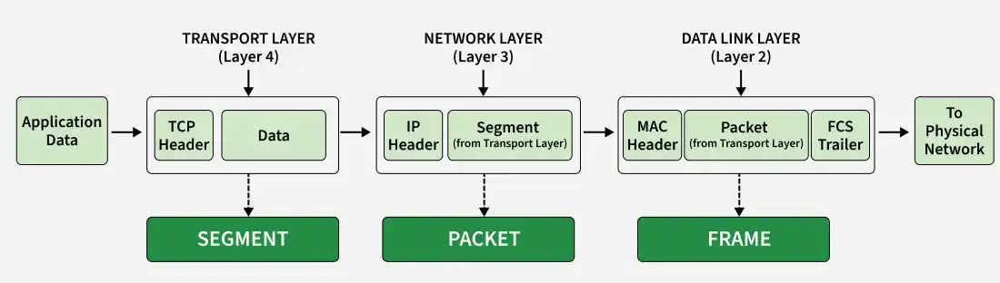

Structure of Segment, Packet, and Frame showing headers at each OSI layer:

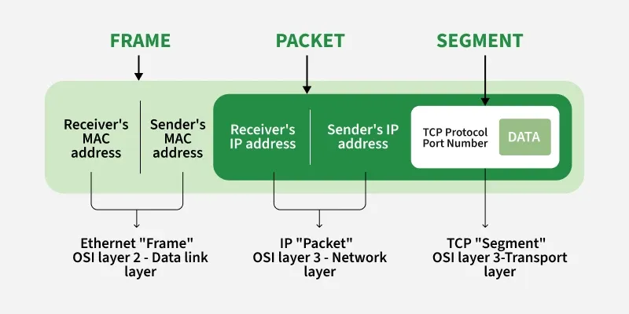

Packet và frame đều là các đơn vị dữ liệu được dùng trong quá trình truyền thông mạng, nhưng chúng thuộc các tầng khác nhau và có vai trò khác nhau.

| Tiêu chí             | Packet                                   | Frame                                      |
| -------------------- | ---------------------------------------- | ------------------------------------------ |
| Tầng OSI             | Tầng 3 – Network Layer                   | Tầng 2 – Data Link Layer                   |
| Địa chỉ sử dụng      | Địa chỉ IP                               | Địa chỉ MAC                                |
| Phạm vi hoạt động    | Giữa các mạng khác nhau                  | Trong cùng mạng cục bộ                     |
| Thiết bị xử lý chính | Router                                   | Switch                                     |
| Chứa thông tin       | Source IP, Destination IP, TTL, Checksum | Source MAC, Destination MAC, FCS           |
| Mục đích             | Định tuyến dữ liệu đến đúng mạng đích    | Chuyển dữ liệu đến đúng thiết bị trong LAN |

Ví dụ dễ hiểu:

* **Packet** giống như bưu kiện có địa chỉ thành phố, quốc gia, đường phố.
* **Frame** giống như thông tin giao hàng trong một khu vực cụ thể để chuyển bưu kiện đến đúng nhà trong đoạn cuối.

Khi dữ liệu được truyền qua mạng, một packet có thể được đặt bên trong nhiều frame khác nhau trên từng đoạn đường.

Ví dụ:

```text
Máy tính A → Router 1 → Router 2 → Máy chủ B
```

Packet IP có thể giữ nguyên địa chỉ IP nguồn và IP đích trong suốt quá trình truyền. Tuy nhiên, frame ở mỗi đoạn mạng có thể thay đổi địa chỉ MAC nguồn và MAC đích.

Nói ngắn gọn:

* **Packet dùng để đi qua nhiều mạng.**
* **Frame dùng để di chuyển trong một mạng cục bộ.**

## 4.6. Header trong gói tin

**Header** là phần thông tin điều khiển được thêm vào dữ liệu trong quá trình encapsulation.

Header không phải là nội dung chính mà người dùng muốn gửi. Nó là thông tin bổ sung giúp các tầng mạng xử lý và chuyển dữ liệu đúng cách.

Ví dụ:

Khi gửi một yêu cầu HTTP, nội dung chính có thể là:

```text
GET / HTTP/1.1
```

Nhưng để yêu cầu này đi qua mạng, nó cần thêm nhiều header ở các tầng khác nhau:

```text
[Ethernet Header][IP Header][TCP Header][HTTP Data]
```

Một số loại header thường gặp:

| Header          | Tầng        | Vai trò                              |
| --------------- | ----------- | ------------------------------------ |
| Ethernet Header | Data Link   | Chứa địa chỉ MAC nguồn và đích       |
| IP Header       | Network     | Chứa địa chỉ IP nguồn và đích        |
| TCP Header      | Transport   | Chứa port, sequence number, ACK      |
| UDP Header      | Transport   | Chứa port và độ dài dữ liệu          |
| HTTP Header     | Application | Chứa thông tin request hoặc response |

Ví dụ các trường trong IP header:

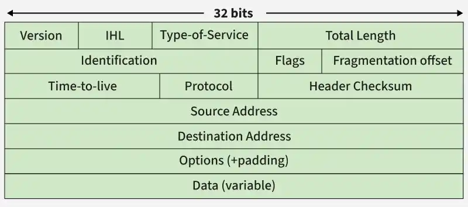

| Trường              | Ý nghĩa                                                     |
| ------------------- | ----------------------------------------------------------- |
| Source Address      | Địa chỉ IP nguồn                                            |
| Destination Address | Địa chỉ IP đích                                             |
| TTL                 | Giới hạn thời gian tồn tại của packet                       |
| Protocol            | Cho biết dữ liệu bên trong dùng TCP, UDP hay giao thức khác |
| Header Checksum     | Kiểm tra lỗi phần header                                    |

Ví dụ các trường trong TCP header:


| Trường                | Ý nghĩa                        |
| --------------------- | ------------------------------ |
| Source Port           | Cổng nguồn                     |
| Destination Port      | Cổng đích                      |
| Sequence Number       | Số thứ tự dữ liệu              |
| Acknowledgment Number | Số xác nhận                    |
| Flags                 | Các cờ như SYN, ACK, FIN, RST  |
| Checksum              | Kiểm tra tính toàn vẹn dữ liệu |

Header rất quan trọng khi phân tích mạng bằng Wireshark hoặc tcpdump, vì nó cho biết gói tin đến từ đâu, đi đâu, dùng giao thức nào và trạng thái kết nối ra sao.

## 4.7. TTL, Checksum, Source Address và Destination Address

Trong packet, có nhiều trường quan trọng giúp dữ liệu được truyền đúng cách. Bốn trường thường gặp là **TTL**, **Checksum**, **Source Address** và **Destination Address**.

### 4.7.1 TTL

**TTL** (Time To Live) là trường dùng để giới hạn thời gian hoặc số bước mà một packet có thể tồn tại trong mạng.
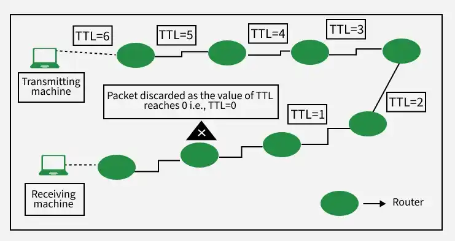

Mỗi khi packet đi qua một router, giá trị TTL thường bị giảm đi 1. Nếu TTL giảm về 0, packet sẽ bị loại bỏ.

Mục đích của TTL:

* Ngăn packet bị lặp vô hạn trong mạng.
* Giảm nguy cơ gây nghẽn mạng.
* Hỗ trợ công cụ như `traceroute` để xác định đường đi của packet.

Ví dụ:

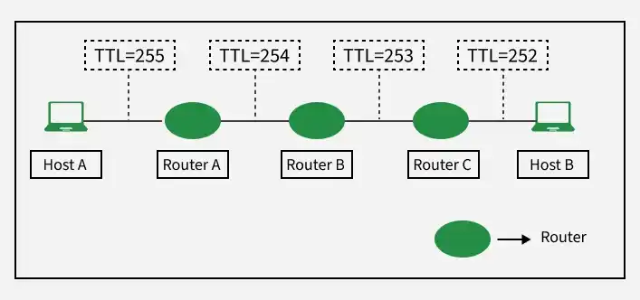

```text
TTL ban đầu: 255
Sau router 1: 254
Sau router 2: 253
Sau router 3: 252
```

Nếu có lỗi định tuyến làm packet bị chạy vòng lặp, TTL sẽ giảm dần về 0 và packet sẽ bị hủy.

### 4.7.2 Checksum

**Checksum** là giá trị dùng để kiểm tra tính toàn vẹn của dữ liệu hoặc header.

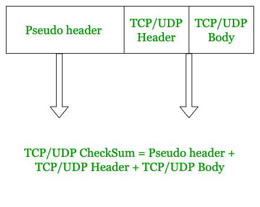

Khi packet được gửi đi, thiết bị gửi tính toán checksum dựa trên nội dung của một phần gói tin. Khi thiết bị nhận nhận được packet, nó tính lại checksum và so sánh với giá trị trong header.

Nếu hai giá trị không khớp, điều đó có thể cho thấy dữ liệu đã bị lỗi hoặc thay đổi trong quá trình truyền.

Mục đích của checksum:

* Phát hiện lỗi trong quá trình truyền.
* Giúp thiết bị nhận biết packet có bị hỏng hay không.
* Hỗ trợ giao thức quyết định có chấp nhận hoặc loại bỏ packet.

Ví dụ đơn giản:

```text
Checksum gửi đi:  0x4a3f
Checksum tính lại: 0x4a3f
→ Packet hợp lệ
```

Nếu kết quả khác nhau:

```text
Checksum gửi đi:  0x4a3f
Checksum tính lại: 0x91bc
→ Packet có thể bị lỗi
```

### 4.7.4. Source Address

**Source Address** là địa chỉ nguồn, cho biết packet được gửi từ đâu.

Trong IP packet, Source Address thường là **địa chỉ IP của thiết bị gửi**.

Ví dụ:

```text
Source Address: 192.168.1.10
```

Vai trò của Source Address:

* Cho biết thiết bị nào đã gửi packet.
* Giúp thiết bị nhận biết nơi cần gửi phản hồi.
* Hỗ trợ phân tích lưu lượng mạng.
* Hỗ trợ firewall xác định nguồn truy cập.

Ví dụ khi máy tính truy cập DNS Google:

```text
Source Address:      192.168.1.10
Destination Address: 8.8.8.8
```

Ở đây, `192.168.1.10` là máy gửi yêu cầu.

### 4.7.5. Destination Address

**Destination Address** là địa chỉ đích, cho biết packet cần được gửi đến đâu.

Trong IP packet, Destination Address thường là **địa chỉ IP của thiết bị nhận**.

Ví dụ:

```text
Destination Address: 8.8.8.8
```

Vai trò của Destination Address:

* Xác định thiết bị hoặc máy chủ đích.
* Giúp router định tuyến packet.
* Giúp firewall kiểm tra lưu lượng đi đến đâu.
* Giúp hệ thống mạng chuyển dữ liệu đúng hướng.

Ví dụ:

```text
Source Address:      192.168.1.10
Destination Address: 93.184.216.34
```

Trong ví dụ này:

* `192.168.1.10` là máy tính người dùng.
* `93.184.216.34` là máy chủ web cần truy cập.

### 4.4.6 Tóm tắt các trường quan trọng

| Trường              | Ý nghĩa              | Vai trò                               |
| ------------------- | -------------------- | ------------------------------------- |
| TTL                 | Time To Live         | Ngăn packet tồn tại vô hạn trong mạng |
| Checksum            | Giá trị kiểm tra lỗi | Phát hiện dữ liệu hoặc header bị lỗi  |
| Source Address      | Địa chỉ nguồn        | Cho biết packet đến từ đâu            |
| Destination Address | Địa chỉ đích         | Cho biết packet cần đi đến đâu        |

Các trường này rất quan trọng trong việc học mạng và an ninh mạng. Khi phân tích packet bằng Wireshark hoặc tcpdump, việc hiểu TTL, Checksum, Source Address và Destination Address giúp xác định luồng dữ liệu, phát hiện lỗi mạng và phân tích hành vi bất thường.

# 5. Giao thức truyền tải TCP và UDP

## 5.1. TCP là gì?

**TCP** (Transmission Control Protocol) là giao thức truyền tải dữ liệu hoạt động ở **tầng Transport** trong mô hình OSI và TCP/IP.

TCP là giao thức **hướng kết nối**. Điều này có nghĩa là trước khi truyền dữ liệu, hai thiết bị phải thiết lập kết nối với nhau. Sau khi kết nối được thiết lập, dữ liệu mới bắt đầu được gửi.

TCP được thiết kế để đảm bảo dữ liệu được truyền đi một cách **đầy đủ, đúng thứ tự và đáng tin cậy**.

Một số đặc điểm chính của TCP:

- Có thiết lập kết nối trước khi truyền dữ liệu.
- Đảm bảo dữ liệu đến đúng thứ tự.
- Có cơ chế xác nhận dữ liệu đã nhận.
- Có thể gửi lại dữ liệu nếu bị mất.
- Phù hợp với các dịch vụ cần độ chính xác cao.

Ví dụ các dịch vụ thường dùng TCP:

| Dịch vụ | Cổng phổ biến | Giao thức |
|---|---:|---|
| HTTP | 80 | TCP |
| HTTPS | 443 | TCP |
| FTP | 21 | TCP |
| SSH | 22 | TCP |
| SMTP | 25 | TCP |

Ví dụ, khi bạn truy cập một website, trình duyệt thường sử dụng TCP để thiết lập kết nối với máy chủ web. Sau đó, dữ liệu HTML, CSS, JavaScript hoặc hình ảnh sẽ được truyền qua kết nối này.

TCP phù hợp với các trường hợp như:

- Truy cập website.
- Gửi email.
- Truyền file.
- Đăng nhập từ xa qua SSH.
- Tải dữ liệu quan trọng cần chính xác.

## 5.2. UDP là gì?

**UDP** (User Datagram Protocol) là giao thức truyền tải dữ liệu hoạt động ở **tầng Transport**, giống như TCP.

Tuy nhiên, khác với TCP, UDP là giao thức **không hướng kết nối**. Điều này có nghĩa là UDP không cần thiết lập kết nối trước khi gửi dữ liệu. Thiết bị gửi chỉ cần gửi dữ liệu đi mà không cần kiểm tra thiết bị nhận đã sẵn sàng hay chưa.

UDP nhanh hơn TCP vì nó ít bước xử lý hơn, nhưng đổi lại, UDP không đảm bảo dữ liệu sẽ đến đầy đủ hoặc đúng thứ tự.

Một số đặc điểm chính của UDP:

- Không cần thiết lập kết nối trước.
- Không đảm bảo dữ liệu đến nơi.
- Không đảm bảo đúng thứ tự.
- Không tự động gửi lại dữ liệu bị mất.
- Tốc độ nhanh và độ trễ thấp.

Ví dụ các dịch vụ thường dùng UDP:

| Dịch vụ | Cổng phổ biến | Giao thức |
|---|---:|---|
| DNS | 53 | UDP/TCP |
| DHCP Server | 67 | UDP |
| DHCP Client | 68 | UDP |
| NTP | 123 | UDP |
| VoIP | Tùy hệ thống | UDP |
| Streaming / Gaming | Tùy hệ thống | UDP |

UDP phù hợp với các trường hợp ưu tiên tốc độ hơn độ chính xác tuyệt đối, ví dụ:

- Gọi video.
- Chơi game online.
- Truyền âm thanh thời gian thực.
- Streaming video.
- Truy vấn DNS thông thường.

Ví dụ, khi gọi video, nếu mất một vài gói dữ liệu nhỏ, hệ thống thường bỏ qua thay vì yêu cầu gửi lại. Nếu gửi lại quá nhiều, cuộc gọi sẽ bị trễ và không còn mượt.

## 5.3. So sánh TCP và UDP

TCP và UDP đều là giao thức tầng Transport, nhưng chúng có cách hoạt động khác nhau.

| Tiêu chí | TCP | UDP |
|---|---|---|
| Kiểu kết nối | Hướng kết nối | Không hướng kết nối |
| Độ tin cậy | Cao | Thấp hơn |
| Tốc độ | Chậm hơn UDP | Nhanh hơn TCP |
| Thứ tự dữ liệu | Đảm bảo đúng thứ tự | Không đảm bảo đúng thứ tự |
| Gửi lại dữ liệu bị mất | Có | Không |
| Kiểm soát lỗi | Có | Ít hơn TCP |
| Độ trễ | Cao hơn | Thấp hơn |
| Ứng dụng phù hợp | Web, email, file transfer, SSH | DNS, VoIP, streaming, gaming |

**Khi nào dùng TCP?**

Dùng TCP khi cần dữ liệu chính xác và đầy đủ.

Ví dụ:

- Tải file.
- Truy cập website.
- Gửi email.
- Đăng nhập SSH.
- Giao dịch trực tuyến.

Nếu tải một file mà thiếu một phần dữ liệu, file có thể bị lỗi. Vì vậy, TCP là lựa chọn phù hợp.

**Khi nào dùng UDP?**

Dùng UDP khi cần tốc độ nhanh và chấp nhận mất một phần nhỏ dữ liệu.

Ví dụ:

- Video call.
- Livestream.
- Game online.
- DNS query.
- Truyền âm thanh thời gian thực.

Nếu trong cuộc gọi video bị mất một vài gói tin, người dùng có thể chỉ thấy hình ảnh hơi giật nhẹ. Nhưng nếu phải chờ gửi lại từng gói tin, cuộc gọi sẽ bị trễ nhiều hơn.

Tóm lại:

- **TCP = đáng tin cậy, chính xác, nhưng chậm hơn.**
- **UDP = nhanh, đơn giản, nhưng không đảm bảo dữ liệu đầy đủ.**

## 5.4. TCP Three-Way Handshake

**TCP Three-Way Handshake** là quá trình bắt tay ba bước dùng để thiết lập kết nối TCP giữa client và server trước khi truyền dữ liệu.

Quá trình này gồm 3 bước:

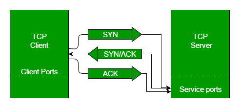

```text
Client → Server: SYN
Server → Client: SYN/ACK
Client → Server: ACK
```

Mục đích của Three-Way Handshake:

* Kiểm tra xem hai thiết bị có thể giao tiếp với nhau không.
* Đồng bộ số thứ tự ban đầu.
* Thiết lập kết nối đáng tin cậy trước khi truyền dữ liệu.
* Chuẩn bị cho quá trình gửi và nhận dữ liệu.

Ví dụ:

Khi bạn truy cập một website bằng HTTPS, máy tính của bạn cần thiết lập kết nối TCP đến máy chủ web, thường qua cổng `443`. Trước khi dữ liệu HTTPS được truyền, quá trình TCP Three-Way Handshake sẽ diễn ra.

Quy trình tổng quát:

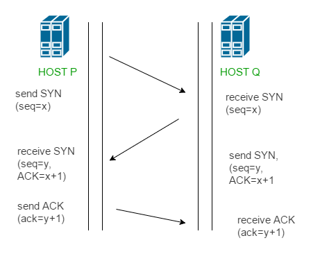

| Bước | Gói tin | Ý nghĩa                                 |
| ---: | ------- | --------------------------------------- |
|    1 | SYN     | Client yêu cầu thiết lập kết nối        |
|    2 | SYN/ACK | Server đồng ý và phản hồi lại           |
|    3 | ACK     | Client xác nhận, kết nối được thiết lập |

Sau khi hoàn thành ba bước này, hai bên có thể bắt đầu truyền dữ liệu.

## 5.5. SYN, SYN/ACK và ACK

Trong quá trình TCP Three-Way Handshake, ba loại cờ quan trọng nhất là **SYN**, **SYN/ACK** và **ACK**.

**SYN**

**SYN** là viết tắt của **Synchronize**.

Gói SYN được gửi từ client đến server để bắt đầu quá trình thiết lập kết nối TCP.

Ví dụ:

```text
Client → Server: SYN
```

Ý nghĩa:

* Client muốn mở kết nối.
* Client gửi số thứ tự ban đầu của mình.
* Client yêu cầu server đồng bộ thông tin kết nối.

**SYN/ACK**

**SYN/ACK** là gói phản hồi từ server.

Gói này có hai ý nghĩa:

* **SYN:** Server cũng gửi số thứ tự ban đầu của mình.
* **ACK:** Server xác nhận đã nhận được SYN từ client.

Ví dụ:

```text
Server → Client: SYN/ACK
```

Ý nghĩa:

* Server đồng ý thiết lập kết nối.
* Server xác nhận yêu cầu từ client.
* Server gửi thông tin đồng bộ của mình về client.

**ACK**

**ACK** là viết tắt của **Acknowledgement**, nghĩa là xác nhận.

Gói ACK được client gửi lại cho server để xác nhận rằng client đã nhận được SYN/ACK.

Ví dụ:

```text
Client → Server: ACK
```

Sau bước này, kết nối TCP được thiết lập thành công.

Trong Wireshark, quá trình này thường có thể thấy bằng các gói tin có cờ:

```text
SYN
SYN, ACK
ACK
```

## 5.6. Đóng kết nối TCP

Sau khi truyền dữ liệu xong, kết nối TCP cần được đóng lại để giải phóng tài nguyên hệ thống.

TCP có thể đóng kết nối bằng các gói tin như:

* **FIN**
* **ACK**
* **RST**

**Đóng kết nối bằng FIN**

**FIN** là viết tắt của **Finish**. Gói FIN được dùng để yêu cầu đóng kết nối một cách bình thường.

Quá trình đóng kết nối TCP thường diễn ra như sau:

```text
Thiết bị A → Thiết bị B: FIN
Thiết bị B → Thiết bị A: ACK
Thiết bị B → Thiết bị A: FIN
Thiết bị A → Thiết bị B: ACK
```

Ý nghĩa:

1. Một bên thông báo muốn đóng kết nối.
2. Bên còn lại xác nhận.
3. Bên còn lại cũng gửi yêu cầu đóng.
4. Bên đầu tiên xác nhận lại.

Sau đó, kết nối TCP được kết thúc.

**Đóng kết nối bằng RST**

**RST** là viết tắt của **Reset**. Gói RST dùng để đóng kết nối đột ngột.

RST thường xuất hiện khi:

* Dịch vụ không hoạt động.
* Cổng bị đóng.
* Kết nối không hợp lệ.
* Có lỗi trong quá trình giao tiếp.
* Hệ thống muốn hủy kết nối ngay lập tức.

So sánh FIN và RST:

| Cờ  | Ý nghĩa | Cách đóng                |
| --- | ------- | ------------------------ |
| FIN | Finish  | Đóng kết nối bình thường |
| RST | Reset   | Đóng kết nối đột ngột    |

Tóm lại:

* **FIN** dùng khi muốn kết thúc kết nối một cách gọn gàng.
* **RST** dùng khi cần hủy kết nối ngay lập tức hoặc có lỗi xảy ra.

## 5.7. Cổng mạng là gì?

**Cổng mạng** (Port) là số định danh dùng để xác định dịch vụ hoặc ứng dụng đang chạy trên một thiết bị.

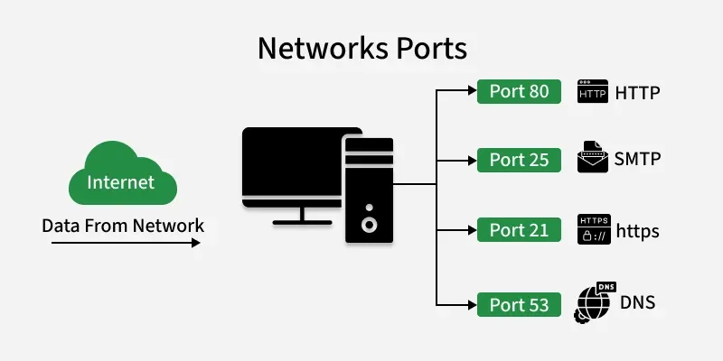

Một địa chỉ IP giúp xác định thiết bị trong mạng, còn port giúp xác định **ứng dụng hoặc dịch vụ cụ thể** trên thiết bị đó.

Ví dụ:

```text
192.168.1.10:80
```

Trong đó:

* `192.168.1.10` là địa chỉ IP.
* `80` là cổng mạng.
* Cổng `80` thường dùng cho HTTP.

Một thiết bị có thể chạy nhiều dịch vụ cùng lúc. Mỗi dịch vụ thường lắng nghe trên một cổng khác nhau.

Ví dụ một server:

| Dịch vụ | Cổng |
| ------- | ---: |
| SSH     |   22 |
| HTTP    |   80 |
| HTTPS   |  443 |
| DNS     |   53 |

Nhờ có port, máy chủ có thể biết dữ liệu gửi đến cần chuyển cho dịch vụ nào.

**Phạm vi số cổng**

Số cổng nằm trong khoảng:

```text
0 - 65535
```

Có thể chia thành ba nhóm chính:

| Phạm vi       | Tên gọi                   | Ý nghĩa                                   |
| ------------- | ------------------------- | ----------------------------------------- |
| 0 – 1023      | Well-known ports          | Cổng phổ biến, dành cho các dịch vụ chuẩn |
| 1024 – 49151  | Registered ports          | Cổng được đăng ký cho ứng dụng cụ thể     |
| 49152 – 65535 | Dynamic / Ephemeral ports | Cổng tạm thời, thường dùng phía client    |

Ví dụ:

Khi bạn truy cập website HTTPS:

```text
Client: 192.168.1.10:52344
Server: 93.184.216.34:443
```

Trong đó:

* Client dùng cổng tạm thời `52344`.
* Server lắng nghe dịch vụ HTTPS ở cổng `443`.

## 5.8. Các cổng phổ biến cần nhớ

Khi học mạng và an ninh mạng, cần ghi nhớ một số cổng phổ biến vì chúng thường xuất hiện trong cấu hình firewall, phân tích packet, quét Nmap và điều tra bảo mật.

| Cổng | Giao thức | Dịch vụ         | Ý nghĩa                     |
| ---: | --------- | --------------- | --------------------------- |
|   20 | TCP       | FTP Data        | Truyền dữ liệu FTP          |
|   21 | TCP       | FTP Control     | Điều khiển phiên FTP        |
|   22 | TCP       | SSH             | Truy cập từ xa an toàn      |
|   23 | TCP       | Telnet          | Truy cập từ xa không mã hóa |
|   25 | TCP       | SMTP            | Gửi email                   |
|   53 | TCP/UDP   | DNS             | Phân giải tên miền          |
|   67 | UDP       | DHCP Server     | Máy chủ DHCP                |
|   68 | UDP       | DHCP Client     | Máy khách DHCP              |
|   80 | TCP       | HTTP            | Truy cập web không mã hóa   |
|  110 | TCP       | POP3            | Nhận email                  |
|  123 | UDP       | NTP             | Đồng bộ thời gian           |
|  143 | TCP       | IMAP            | Đồng bộ email               |
|  161 | UDP       | SNMP            | Quản lý thiết bị mạng       |
|  389 | TCP/UDP   | LDAP            | Dịch vụ thư mục             |
|  443 | TCP       | HTTPS           | Truy cập web bảo mật        |
|  445 | TCP       | SMB             | Chia sẻ file Windows        |
|  465 | TCP       | SMTPS           | Gửi email bảo mật           |
|  587 | TCP       | SMTP Submission | Gửi email từ client         |
|  993 | TCP       | IMAPS           | IMAP qua TLS                |
|  995 | TCP       | POP3S           | POP3 qua TLS                |
| 3306 | TCP       | MySQL           | Cơ sở dữ liệu MySQL         |
| 3389 | TCP       | RDP             | Remote Desktop Windows      |
| 5432 | TCP       | PostgreSQL      | Cơ sở dữ liệu PostgreSQL    |
| 8080 | TCP       | HTTP Alternate  | Cổng web thay thế           |

Một số nhóm cổng cần nhớ nhanh:

**Web**

| Dịch vụ        | Cổng |
| -------------- | ---: |
| HTTP           |   80 |
| HTTPS          |  443 |
| HTTP Alternate | 8080 |

**Truy cập từ xa**

| Dịch vụ | Cổng |
| ------- | ---: |
| SSH     |   22 |
| Telnet  |   23 |
| RDP     | 3389 |

**Email**

| Dịch vụ | Cổng |
| ------- | ---: |
| SMTP    |   25 |
| POP3    |  110 |
| IMAP    |  143 |
| SMTPS   |  465 |
| IMAPS   |  993 |
| POP3S   |  995 |

**Hệ thống mạng**

| Dịch vụ     | Cổng |
| ----------- | ---: |
| DNS         |   53 |
| DHCP Server |   67 |
| DHCP Client |   68 |
| NTP         |  123 |
| SNMP        |  161 |

**Database**

| Dịch vụ    | Cổng |
| ---------- | ---: |
| MySQL      | 3306 |
| PostgreSQL | 5432 |

Khi phân tích bảo mật, việc nhớ các cổng phổ biến giúp nhanh chóng nhận ra dịch vụ nào đang hoạt động trên hệ thống và đánh giá bề mặt tấn công của mục tiêu.

# 6. Mạng LAN và thiết bị mạng

## 6.1. LAN là gì?

**LAN** là viết tắt của **Local Area Network**, nghĩa là **mạng cục bộ**.

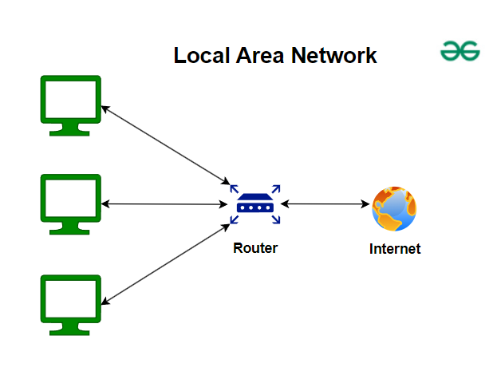

LAN là một mạng máy tính được triển khai trong phạm vi nhỏ, ví dụ như:

- Nhà riêng.
- Phòng học.
- Văn phòng.
- Công ty.
- Phòng lab.
- Trường học.
- Quán cà phê.

Trong mạng LAN, các thiết bị có thể kết nối với nhau để chia sẻ tài nguyên và trao đổi dữ liệu.

Ví dụ các thiết bị trong mạng LAN:

- Máy tính.
- Laptop.
- Điện thoại.
- Máy in.
- Camera IP.
- Server nội bộ.
- Switch.
- Router.
- Access Point.

Ví dụ thực tế:

```text
Laptop → Wi-Fi Router → Internet
Điện thoại → Wi-Fi Router → Internet
Máy in → Switch → Laptop
```

Trong mạng LAN, các thiết bị thường sử dụng địa chỉ IP private như:

```text
192.168.1.10
192.168.1.20
10.0.0.5
```

Một mạng LAN có thể hoạt động độc lập, hoặc có thể kết nối ra Internet thông qua router.

Vai trò chính của mạng LAN:

* Kết nối các thiết bị trong phạm vi gần.
* Chia sẻ file, máy in, server nội bộ.
* Cho phép các thiết bị truy cập Internet.
* Hỗ trợ quản lý người dùng và tài nguyên trong tổ chức.
* Là nền tảng cho nhiều hệ thống mạng doanh nghiệp.

Trong an ninh mạng, LAN là môi trường rất quan trọng vì nhiều cuộc tấn công bắt đầu từ mạng nội bộ, ví dụ như ARP spoofing, scanning, lateral movement hoặc tấn công vào dịch vụ nội bộ.

## 6.2. Network Topology là gì?

**Network Topology** là cách các thiết bị trong mạng được sắp xếp và kết nối với nhau.

Nói đơn giản, topology mô tả **hình dạng hoặc cấu trúc của mạng**.

Network Topology trả lời các câu hỏi như:

* Các thiết bị được kết nối với nhau như thế nào?
* Dữ liệu đi qua đường nào?
* Thiết bị nào đóng vai trò trung tâm?
* Nếu một thiết bị hoặc dây mạng bị lỗi thì mạng có bị ảnh hưởng không?
* Mạng có dễ mở rộng không?
* Mạng có khả năng dự phòng khi xảy ra lỗi không?

Có nhiều loại topology khác nhau, nhưng trong phần cơ bản, cần nhớ các loại phổ biến sau:

* **Star Topology** – mô hình hình sao.
* **Bus Topology** – mô hình tuyến.
* **Ring Topology** – mô hình vòng.
* **Tree Topology** – mô hình dạng cây.
* **Mesh Topology** – mô hình lưới.
* **Hybrid Topology** – mô hình kết hợp.

Mỗi topology có ưu điểm và nhược điểm riêng. Việc chọn topology phụ thuộc vào chi phí, độ tin cậy, khả năng mở rộng, yêu cầu quản trị mạng và mức độ dự phòng cần thiết.

Bảng tóm tắt:

| Topology | Đặc điểm chính |
|---|---|
| **Star** | Các thiết bị kết nối về một thiết bị trung tâm, thường là switch hoặc hub. |
| **Bus** | Các thiết bị dùng chung một đường cáp chính. |
| **Ring** | Các thiết bị kết nối thành một vòng khép kín. |
| **Tree** | Các thiết bị được tổ chức theo cấu trúc phân cấp dạng cây. |
| **Mesh** | Các thiết bị có nhiều kết nối với nhau để tăng độ tin cậy và dự phòng. |
| **Hybrid** | Kết hợp nhiều loại topology khác nhau trong cùng một hệ thống mạng. |

Tóm lại, **Network Topology** giúp mô tả cách mạng được thiết kế, từ đó hỗ trợ việc triển khai, mở rộng, quản lý và xử lý sự cố mạng hiệu quả hơn.

### 6.2.1. Star Topology

**Star Topology** là mô hình mạng trong đó tất cả các thiết bị được kết nối đến một thiết bị trung tâm, thường là **switch** hoặc **hub**.

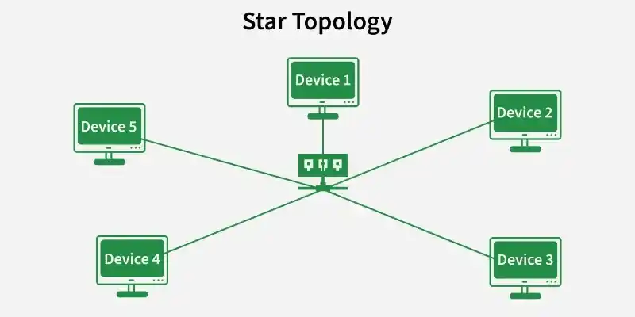

Sơ đồ đơn giản:

```text
        PC1
         |
PC2 --- Switch --- PC3
         |
        PC4
```

Trong mô hình này, mọi dữ liệu giữa các thiết bị đều đi qua thiết bị trung tâm.

Ví dụ:

Nếu PC1 muốn gửi dữ liệu cho PC3, dữ liệu sẽ đi theo hướng:

```text
PC1 → Switch → PC3
```

**Ưu điểm của Star Topology**

* Dễ triển khai.
* Dễ quản lý.
* Dễ thêm thiết bị mới.
* Nếu một dây mạng đến một máy bị hỏng, chỉ máy đó bị ảnh hưởng.
* Phù hợp với mạng hiện đại trong gia đình, trường học và doanh nghiệp.
* Hiệu quả hơn khi dùng switch thay vì hub.

**Nhược điểm của Star Topology**

* Cần nhiều dây mạng hơn.
* Chi phí cao hơn Bus Topology.
* Phụ thuộc vào thiết bị trung tâm.
* Nếu switch hoặc hub trung tâm bị hỏng, toàn bộ mạng có thể bị gián đoạn.

Ví dụ thực tế:

Trong một văn phòng, nhiều máy tính được cắm dây Ethernet vào switch. Đây là một ví dụ phổ biến của Star Topology.

```text
Máy tính nhân viên → Switch công ty → Router / Server / Internet
```

Star Topology là mô hình rất phổ biến hiện nay vì dễ mở rộng, dễ quản lý và phù hợp với mạng LAN hiện đại.

### 6.2.2. Bus Topology

**Bus Topology** là mô hình mạng trong đó tất cả các thiết bị được kết nối vào một đường cáp chính duy nhất, thường gọi là **backbone**.

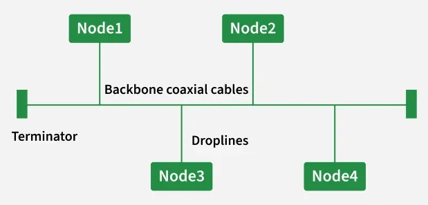

Sơ đồ đơn giản:

```text
PC1 --- PC2 --- PC3 --- PC4
```

Trong mô hình này, dữ liệu được truyền dọc theo đường cáp chính. Các thiết bị trên mạng sẽ kiểm tra dữ liệu để xem nó có dành cho mình hay không.

Ví dụ:

Nếu PC1 gửi dữ liệu đến PC4, dữ liệu sẽ đi qua đường backbone cho đến khi đến thiết bị đích.

**Ưu điểm của Bus Topology**

* Chi phí thấp.
* Cần ít dây cáp hơn.
* Dễ triển khai trong mạng nhỏ.
* Không cần thiết bị trung tâm như switch.

**Nhược điểm của Bus Topology**

* Khó mở rộng khi số lượng thiết bị tăng.
* Hiệu suất giảm khi có nhiều thiết bị truyền dữ liệu.
* Dễ xảy ra xung đột dữ liệu.
* Nếu đường cáp chính bị lỗi, toàn bộ mạng có thể bị ảnh hưởng.
* Khó xác định vị trí lỗi khi mạng gặp sự cố.

Ví dụ:

Bus Topology có thể phù hợp với các mạng rất nhỏ hoặc các mô hình cũ. Tuy nhiên, trong mạng hiện đại, mô hình này ít được sử dụng hơn vì khả năng mở rộng và độ tin cậy không cao.

Tóm lại:

```text
Bus Topology = rẻ, đơn giản, nhưng kém linh hoạt và dễ gặp lỗi khi mạng lớn.
```

### 6.2.3. Ring Topology

**Ring Topology** là mô hình mạng trong đó các thiết bị được kết nối với nhau thành một vòng tròn khép kín.

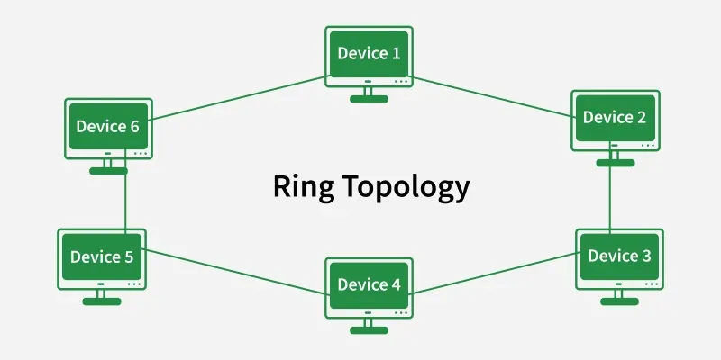

Sơ đồ đơn giản:

```text
PC1 --- PC2
 |       |
PC4 --- PC3
```

Trong mô hình này, mỗi thiết bị thường được kết nối với hai thiết bị khác. Dữ liệu sẽ di chuyển từ thiết bị này sang thiết bị tiếp theo cho đến khi đến đúng thiết bị đích.

Ví dụ:

Nếu PC1 muốn gửi dữ liệu cho PC3, dữ liệu có thể đi theo vòng:

```text
PC1 → PC2 → PC3
```

**Ưu điểm của Ring Topology**

* Dữ liệu di chuyển theo một hướng rõ ràng.
* Có thể giảm xung đột dữ liệu so với Bus Topology.
* Các thiết bị có vai trò tương đối ngang nhau.
* Có thể phù hợp với một số hệ thống mạng chuyên dụng.

**Nhược điểm của Ring Topology**

* Nếu một thiết bị hoặc một đoạn cáp bị lỗi, toàn bộ mạng có thể bị ảnh hưởng.
* Khó thêm hoặc loại bỏ thiết bị.
* Việc xử lý sự cố có thể phức tạp.
* Không phổ biến trong mạng LAN hiện đại thông thường.

Ví dụ lỗi:

Nếu một đoạn cáp trong vòng bị đứt:

```text
PC1 --- PC2
 |       
PC4 --- PC3
```

Dữ liệu có thể không còn di chuyển được quanh vòng, khiến các thiết bị không giao tiếp được với nhau.

Tóm lại:

```text
Ring Topology = dữ liệu đi theo vòng, nhưng dễ bị ảnh hưởng nếu một điểm trong vòng bị lỗi.
```

### 6.2.4. Tree Topology

**Tree Topology** là mô hình mạng có cấu trúc dạng cây, trong đó các thiết bị được tổ chức theo nhiều cấp bậc khác nhau.

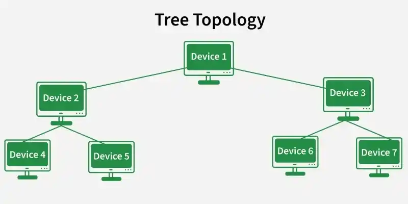

Mô hình này là sự kết hợp giữa **Star Topology** và cấu trúc phân cấp. Các thiết bị ở cấp thấp hơn sẽ kết nối đến thiết bị trung gian, sau đó thiết bị trung gian tiếp tục kết nối lên thiết bị cấp cao hơn.

Sơ đồ đơn giản:

```text
              Core Switch
             /           \
      Switch A           Switch B
      /      \           /      \
    PC1      PC2       PC3      PC4
```

Trong mô hình này:

* Thiết bị trung tâm cấp cao nhất thường là **core switch** hoặc **router**.
* Các switch cấp dưới kết nối đến thiết bị trung tâm.
* Các máy tính, máy in hoặc server kết nối vào switch ở tầng thấp hơn.

**Ưu điểm của Tree Topology**

* Dễ mở rộng khi số lượng thiết bị tăng.
* Phù hợp với mạng doanh nghiệp, trường học hoặc tổ chức lớn.
* Dễ chia mạng thành nhiều khu vực hoặc phòng ban.
* Dễ quản lý theo mô hình phân cấp.
* Có thể kết hợp với VLAN để tách biệt các nhóm thiết bị.

**Nhược điểm của Tree Topology**

* Cấu hình phức tạp hơn Star Topology đơn giản.
* Cần nhiều thiết bị mạng hơn, ví dụ nhiều switch.
* Nếu thiết bị ở cấp cao bị lỗi, nhiều nhánh bên dưới có thể bị ảnh hưởng.
* Chi phí triển khai cao hơn so với Bus hoặc Star đơn giản.

Ví dụ thực tế:

Trong một công ty, mạng có thể được chia như sau:

```text
Core Switch
├── Switch tầng 1
│   ├── PC phòng Kế toán
│   └── Máy in
├── Switch tầng 2
│   ├── PC phòng Kinh doanh
│   └── Access Point
└── Switch phòng Server
    ├── Web Server
    └── Database Server
```

Tree Topology rất phổ biến trong mạng doanh nghiệp vì nó giúp tổ chức hệ thống mạng theo từng tầng rõ ràng.

Tóm lại:

```text
Tree Topology = mô hình mạng dạng cây, phù hợp với hệ thống lớn và cần mở rộng.
```

### 6.2.5. Mesh Topology

**Mesh Topology** là mô hình mạng trong đó các thiết bị được kết nối với nhiều thiết bị khác trong mạng. Thay vì chỉ phụ thuộc vào một thiết bị trung tâm, dữ liệu có thể đi qua nhiều đường khác nhau để đến đích.

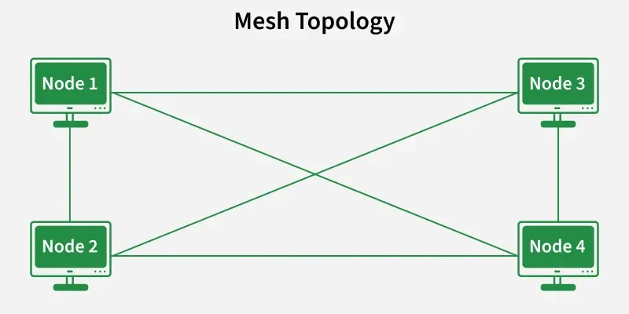

Sơ đồ đơn giản:

```text
     PC1 -------- PC2
      | \        / |
      |  \      /  |
      |   \    /   |
      |    \  /    |
     PC3 -------- PC4
```

Trong mô hình Mesh, mỗi thiết bị có thể có nhiều kết nối đến các thiết bị khác. Nhờ vậy, nếu một đường truyền bị lỗi, dữ liệu vẫn có thể đi theo đường khác.

Có hai loại Mesh Topology chính:

| Loại | Mô tả |
|---|---|
| **Full Mesh** | Mỗi thiết bị kết nối trực tiếp với tất cả thiết bị còn lại. |
| **Partial Mesh** | Chỉ một số thiết bị quan trọng được kết nối với nhiều thiết bị khác. |

**Full Mesh**

Trong **Full Mesh**, mọi thiết bị đều có kết nối trực tiếp với nhau.

Ví dụ:

```text
PC1 kết nối với PC2, PC3, PC4
PC2 kết nối với PC1, PC3, PC4
PC3 kết nối với PC1, PC2, PC4
PC4 kết nối với PC1, PC2, PC3
```

Ưu điểm của Full Mesh là độ tin cậy rất cao, nhưng chi phí triển khai lớn vì cần nhiều kết nối.

**Partial Mesh**

Trong **Partial Mesh**, không phải thiết bị nào cũng kết nối với tất cả thiết bị khác. Chỉ những thiết bị quan trọng mới có nhiều đường kết nối dự phòng.

Ví dụ:

```text
Router chính kết nối với nhiều router khác
Máy trạm thông thường chỉ kết nối đến switch gần nhất
```

Partial Mesh phổ biến hơn Full Mesh vì tiết kiệm chi phí và vẫn đảm bảo khả năng dự phòng.

**Ưu điểm của Mesh Topology**

- Có độ tin cậy cao.
- Có nhiều đường truyền dự phòng.
- Nếu một kết nối bị lỗi, dữ liệu có thể đi theo đường khác.
- Phù hợp với hệ thống cần tính sẵn sàng cao.
- Giảm nguy cơ toàn bộ mạng bị gián đoạn do một điểm lỗi.

**Nhược điểm của Mesh Topology**

- Chi phí triển khai cao.
- Cần nhiều dây cáp hoặc kết nối mạng.
- Cấu hình và quản lý phức tạp hơn.
- Khó mở rộng nếu triển khai theo Full Mesh.
- Cần thiết bị mạng mạnh hơn để xử lý nhiều đường kết nối.

Ví dụ thực tế:

Mesh Topology thường được sử dụng trong:

- Mạng doanh nghiệp lớn.
- Mạng giữa các router.
- Hệ thống mạng có yêu cầu dự phòng cao.
- Mạng Wi-Fi mesh trong gia đình hoặc văn phòng.
- Hạ tầng mạng của nhà cung cấp dịch vụ Internet.

Ví dụ mạng Wi-Fi Mesh:

```text
Internet → Router chính
              |
        Mesh Node 1
         /       \
 Mesh Node 2   Mesh Node 3
```

Trong hệ thống Wi-Fi Mesh, các node có thể kết nối với nhau để mở rộng vùng phủ sóng. Nếu một node bị yếu tín hiệu, thiết bị có thể chuyển sang node khác gần hơn.

Tóm lại:

```text
Mesh Topology = mô hình mạng có nhiều kết nối dự phòng, độ tin cậy cao nhưng chi phí và độ phức tạp lớn hơn.
```

### 6.2.6. Hybrid Topology

**Hybrid Topology** là mô hình mạng kết hợp từ hai hoặc nhiều loại topology khác nhau, ví dụ như Star, Bus, Ring, Tree hoặc Mesh.

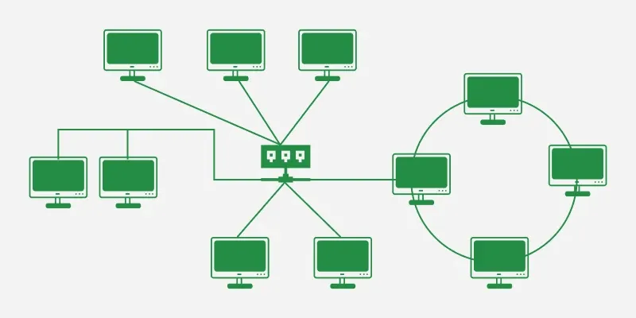

Trong thực tế, các hệ thống mạng lớn hiếm khi chỉ sử dụng một topology duy nhất. Thay vào đó, mạng thường được thiết kế theo mô hình kết hợp để tận dụng ưu điểm của nhiều kiểu topology khác nhau.

Ví dụ đơn giản:

```text
              Core Switch
             /           \
      Switch tầng 1     Switch tầng 2
       /   |   \          /   |   \
     PC1  PC2  PC3      PC4  PC5  PC6
```

Trong ví dụ này:

- Các máy tính trong từng tầng được kết nối theo **Star Topology**.
- Các switch tầng được kết nối lên core switch theo dạng **Tree Topology**.
- Nếu có thêm đường kết nối dự phòng giữa các switch, mạng có thể mang đặc điểm của **Mesh Topology**.

**Ví dụ thực tế về Hybrid Topology**

Trong một công ty, hệ thống mạng có thể được thiết kế như sau:

```text
Internet
   |
Router / Firewall
   |
Core Switch
   |
-------------------------
|           |           |
Switch A   Switch B   Switch C
|           |           |
Phòng IT   Kế toán     Nhân sự
```

Ở đây:

- Mỗi phòng ban dùng mô hình **Star Topology**.
- Các switch phòng ban kết nối lên core switch theo mô hình **Tree Topology**.
- Firewall và router kết nối mạng nội bộ ra Internet.
- Nếu có nhiều đường kết nối dự phòng giữa các thiết bị mạng, hệ thống có thể có thêm đặc điểm của **Mesh Topology**.

**Ưu điểm của Hybrid Topology**

- Linh hoạt trong thiết kế mạng.
- Phù hợp với mạng doanh nghiệp vừa và lớn.
- Dễ mở rộng theo từng khu vực hoặc phòng ban.
- Có thể kết hợp nhiều topology để tăng hiệu suất và độ tin cậy.
- Có thể thêm các kết nối dự phòng để giảm rủi ro gián đoạn mạng.
- Dễ phân chia mạng theo chức năng, ví dụ mạng nhân viên, mạng server, mạng khách.

**Nhược điểm của Hybrid Topology**

- Thiết kế phức tạp hơn các topology đơn giản.
- Chi phí triển khai có thể cao hơn.
- Cần nhiều thiết bị mạng như switch, router, firewall.
- Việc cấu hình và quản trị yêu cầu kiến thức tốt hơn.
- Khi xảy ra lỗi, quá trình troubleshooting có thể khó hơn nếu sơ đồ mạng không rõ ràng.

**Khi nào nên dùng Hybrid Topology?**

Hybrid Topology thường được sử dụng khi mạng có nhiều khu vực, nhiều phòng ban hoặc nhiều yêu cầu khác nhau.

Ví dụ:

- Mạng doanh nghiệp.
- Mạng trường học.
- Mạng bệnh viện.
- Mạng trung tâm dữ liệu.
- Mạng trong các tổ chức lớn.
- Hệ thống mạng có nhiều VLAN và nhiều tầng switch.

Bảng tóm tắt:

| Đặc điểm | Hybrid Topology |
|---|---|
| Cấu trúc | Kết hợp nhiều topology khác nhau |
| Độ linh hoạt | Cao |
| Khả năng mở rộng | Tốt |
| Chi phí | Trung bình đến cao |
| Độ phức tạp | Cao hơn topology đơn giản |
| Phù hợp với | Doanh nghiệp, trường học, tổ chức lớn |

Tóm lại:

```text
Hybrid Topology = mô hình mạng kết hợp nhiều topology để phù hợp với nhu cầu thực tế.
```

Hybrid Topology rất phổ biến trong thực tế vì nó cho phép thiết kế mạng linh hoạt, dễ mở rộng và có thể đáp ứng nhiều yêu cầu khác nhau về hiệu suất, quản lý và bảo mật.

## 6.3. Switch là gì?

**Switch** là thiết bị mạng dùng để kết nối nhiều thiết bị trong cùng một mạng LAN.

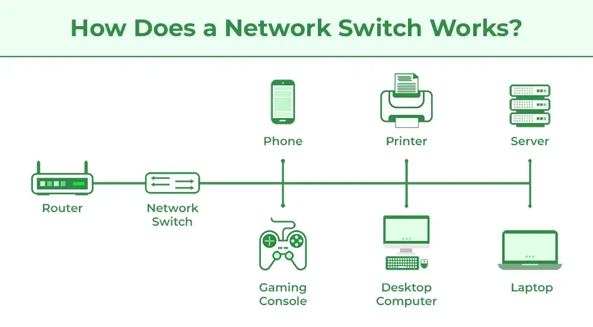

Switch thường được sử dụng để kết nối:

* Máy tính.
* Laptop.
* Máy in.
* Server.
* Camera IP.
* Access Point.
* Router.

Ví dụ:

```text
PC1
 |
PC2 --- Switch --- Server
 |
PC3
```

Switch hoạt động chủ yếu ở **Layer 2 – Data Link Layer** trong mô hình OSI. Nó sử dụng **địa chỉ MAC** để chuyển dữ liệu đến đúng thiết bị.

Khi một thiết bị gửi dữ liệu vào switch, switch sẽ kiểm tra địa chỉ MAC đích và quyết định gửi dữ liệu ra cổng nào.

Ví dụ:

```text
PC1 muốn gửi dữ liệu đến PC3
→ PC1 gửi frame vào switch
→ Switch kiểm tra MAC address của PC3
→ Switch chuyển frame đến đúng cổng của PC3
```

**Switch khác Hub như thế nào?**

Hub gửi dữ liệu đến tất cả các cổng, còn switch thông minh hơn vì nó chỉ gửi dữ liệu đến đúng cổng cần thiết.

| Tiêu chí                 | Hub                     | Switch                 |
| ------------------------ | ----------------------- | ---------------------- |
| Cách gửi dữ liệu         | Gửi đến tất cả các cổng | Gửi đến đúng cổng đích |
| Hiệu suất                | Thấp hơn                | Cao hơn                |
| Bảo mật                  | Kém hơn                 | Tốt hơn                |
| Khả năng học MAC         | Không                   | Có                     |
| Mức độ phổ biến hiện nay | Ít dùng                 | Rất phổ biến           |

**Vai trò của switch**

* Kết nối nhiều thiết bị trong mạng LAN.
* Chuyển frame dựa trên địa chỉ MAC.
* Giảm lưu lượng không cần thiết.
* Tăng hiệu suất mạng.
* Hỗ trợ chia VLAN trong mạng doanh nghiệp.

## 6.4. Router là gì?

**Router** là thiết bị mạng dùng để kết nối các mạng khác nhau và định tuyến dữ liệu giữa chúng.

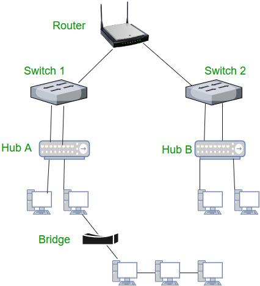

Nếu switch chủ yếu kết nối các thiết bị trong cùng mạng LAN, thì router kết nối các mạng khác nhau với nhau.

Ví dụ:

```text
Mạng LAN gia đình → Router → Internet
```

Hoặc:

```text
LAN phòng Kế toán → Router → LAN phòng Kỹ thuật
```

Router hoạt động chủ yếu ở **Layer 3 – Network Layer** trong mô hình OSI. Nó sử dụng **địa chỉ IP** để quyết định đường đi của packet.

Vai trò chính của router:

* Kết nối các mạng khác nhau.
* Định tuyến packet dựa trên địa chỉ IP.
* Chọn đường đi phù hợp cho dữ liệu.
* Kết nối mạng LAN với Internet.
* Có thể hỗ trợ NAT, firewall, port forwarding và DHCP.

Ví dụ khi bạn truy cập Internet tại nhà:

```text
Laptop → Wi-Fi Router → ISP → Internet → Web Server
```

Trong đó, router đóng vai trò gateway giúp thiết bị trong mạng LAN truy cập ra ngoài Internet.

**Router và Gateway**

Trong mạng gia đình hoặc doanh nghiệp nhỏ, router thường đóng vai trò **default gateway**.

Default gateway là thiết bị mà máy tính gửi dữ liệu đến khi muốn truy cập một mạng khác ngoài mạng nội bộ.

Ví dụ:

```text
IP máy tính:       192.168.1.10
Default gateway:  192.168.1.1
```

Nếu máy tính muốn truy cập `8.8.8.8`, nó sẽ gửi packet đến `192.168.1.1`, tức router.

## 6.5. Switch Layer 2 và Switch Layer 3

Switch có thể được chia thành hai loại chính:

* **Switch Layer 2**
* **Switch Layer 3**

Hai loại này khác nhau ở tầng hoạt động và khả năng xử lý dữ liệu.

### 6.5.1. Switch Layer 2

**Switch Layer 2** hoạt động ở **Layer 2 – Data Link Layer**.

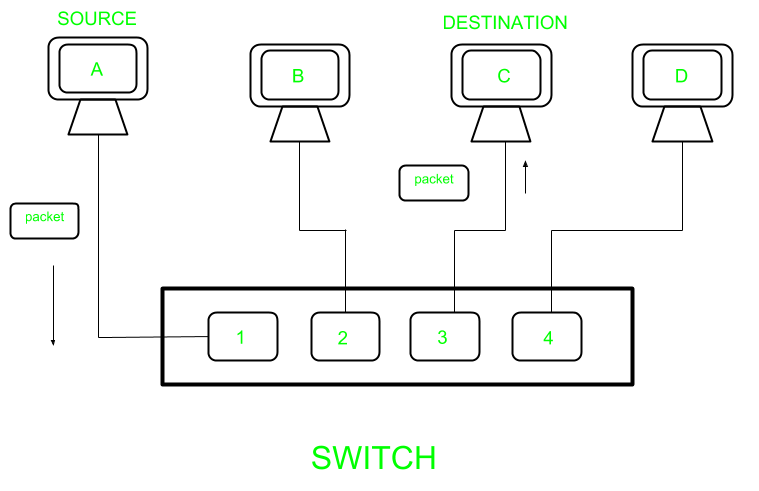

Nó chuyển dữ liệu dựa trên **địa chỉ MAC**.

Switch Layer 2 xử lý đơn vị dữ liệu gọi là **frame**.

Ví dụ:

```text
PC1 → Switch Layer 2 → PC2
```

Switch sẽ kiểm tra MAC address của PC2 và gửi frame đến đúng cổng.

Đặc điểm của Switch Layer 2:

* Dùng địa chỉ MAC để chuyển frame.
* Hoạt động trong cùng một mạng LAN.
* Không định tuyến giữa các mạng IP khác nhau.
* Phổ biến trong mạng nội bộ.
* Có thể hỗ trợ VLAN.

Ví dụ:

```text
PC1: 192.168.1.10
PC2: 192.168.1.20
```

Nếu PC1 và PC2 cùng mạng `192.168.1.0/24`, Switch Layer 2 có thể chuyển frame giữa chúng.

### 6.5.2. Switch Layer 3

**Switch Layer 3** có khả năng hoạt động ở cả **Layer 2** và **Layer 3**.

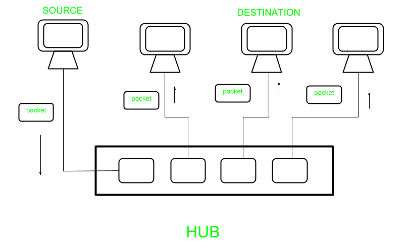

Nó có thể:

* Chuyển frame dựa trên địa chỉ MAC.
* Định tuyến packet dựa trên địa chỉ IP.
* Kết nối các VLAN hoặc subnet khác nhau.

Switch Layer 3 xử lý được cả:

* Frame ở Layer 2.
* Packet ở Layer 3.

Ví dụ:

```text
VLAN 10: 192.168.10.0/24
VLAN 20: 192.168.20.0/24
```

Nếu PC trong VLAN 10 muốn giao tiếp với PC trong VLAN 20, cần thiết bị có khả năng định tuyến. Switch Layer 3 có thể thực hiện việc này.


### 6.5.3. So sánh Switch Layer 2 và Switch Layer 3

| Tiêu chí             | Switch Layer 2                  | Switch Layer 3                |
| -------------------- | ------------------------------- | ----------------------------- |
| Tầng hoạt động       | Layer 2                         | Layer 2 và Layer 3            |
| Dựa trên             | Địa chỉ MAC                     | Địa chỉ MAC và địa chỉ IP     |
| Đơn vị xử lý chính   | Frame                           | Frame và packet               |
| Có định tuyến không? | Không                           | Có                            |
| Dùng cho             | Kết nối thiết bị trong cùng LAN | Kết nối VLAN/subnet khác nhau |
| Ví dụ chức năng      | Switching                       | Switching + Routing           |

Tóm lại:

```text
Switch Layer 2 = chuyển frame trong cùng mạng LAN.
Switch Layer 3 = chuyển frame và có thể định tuyến giữa các mạng.
```

## 6.6. VLAN là gì?

**VLAN** là viết tắt của **Virtual Local Area Network**, nghĩa là **mạng LAN ảo**.

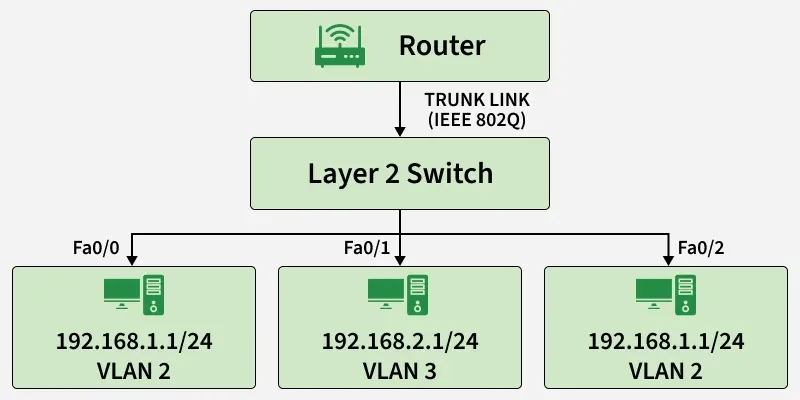

VLAN cho phép chia một mạng vật lý thành nhiều mạng logic riêng biệt.

Ví dụ, trong một công ty có cùng một switch vật lý, ta có thể chia thành nhiều VLAN:

* VLAN 10: Phòng Kế toán.
* VLAN 20: Phòng Kinh doanh.
* VLAN 30: Phòng Kỹ thuật.
* VLAN 40: Khách truy cập Wi-Fi.

Sơ đồ đơn giản:

```text
              Switch
        /       |       \
   VLAN 10   VLAN 20   VLAN 30
 Kế toán   Kinh doanh  Kỹ thuật
```

Mặc dù các thiết bị cùng cắm vào một switch, nhưng nếu thuộc VLAN khác nhau, chúng được xem như nằm trong các mạng logic khác nhau.

**Vì sao cần VLAN?**

VLAN giúp:

* Chia nhỏ mạng để dễ quản lý.
* Tách biệt các phòng ban.
* Giảm broadcast không cần thiết.
* Tăng hiệu suất mạng.
* Tăng bảo mật nội bộ.
* Hạn chế thiết bị ở nhóm này truy cập trực tiếp sang nhóm khác.

Ví dụ:

Phòng Kế toán và phòng Kinh doanh cùng dùng một switch, nhưng được chia thành hai VLAN khác nhau:

```text
VLAN 10 - Accounting
VLAN 20 - Sales
```

Hai phòng này có thể cùng truy cập Internet, nhưng không thể giao tiếp trực tiếp với nhau nếu không có thiết bị định tuyến hoặc rule cho phép.

**VLAN và bảo mật**

VLAN rất quan trọng trong an ninh mạng vì nó giúp phân tách hệ thống.

Ví dụ:

* Máy nhân viên không nên nằm cùng VLAN với server quan trọng.
* Khách truy cập Wi-Fi không nên nằm cùng VLAN với hệ thống nội bộ.
* Camera IP nên được đặt trong VLAN riêng.
* Hệ thống quản trị nên được đặt trong VLAN riêng.

Ví dụ thiết kế mạng đơn giản:

|    VLAN | Nhóm thiết bị | Mục đích                |
| ------: | ------------- | ----------------------- |
| VLAN 10 | Nhân viên     | Làm việc hằng ngày      |
| VLAN 20 | Server        | Chạy dịch vụ nội bộ     |
| VLAN 30 | Camera        | Giám sát an ninh        |
| VLAN 40 | Guest Wi-Fi   | Khách truy cập Internet |
| VLAN 99 | Management    | Quản trị thiết bị mạng  |

**Inter-VLAN Routing**

Các thiết bị ở VLAN khác nhau thường không thể giao tiếp trực tiếp với nhau. Nếu cần giao tiếp, phải có **Inter-VLAN Routing**.

Inter-VLAN Routing có thể được thực hiện bằng:

* Router.
* Switch Layer 3.
* Firewall.

Ví dụ:

```text
VLAN 10 muốn truy cập Server ở VLAN 20
→ Cần Router hoặc Layer 3 Switch định tuyến
→ Có thể áp dụng firewall rule để kiểm soát truy cập
```

Tóm lại:

```text
VLAN = chia một mạng vật lý thành nhiều mạng logic riêng biệt.
```

VLAN giúp mạng dễ quản lý hơn, giảm broadcast và tăng bảo mật trong môi trường doanh nghiệp.

# 7. Các giao thức và công nghệ mạng cơ bản

## 7.1. ARP là gì?

**ARP** là viết tắt của **Address Resolution Protocol**, nghĩa là **giao thức phân giải địa chỉ**.

ARP được dùng để tìm địa chỉ **MAC** tương ứng với một địa chỉ **IP** trong cùng mạng cục bộ.

Trong mạng máy tính:

- Địa chỉ IP được dùng ở tầng Network.
- Địa chỉ MAC được dùng ở tầng Data Link.
- Khi một thiết bị muốn gửi dữ liệu trong mạng LAN, nó cần biết địa chỉ MAC của thiết bị đích.

Ví dụ:

```text
Máy A biết IP của Máy B: 192.168.1.20
Nhưng Máy A chưa biết MAC của Máy B
→ Máy A dùng ARP để hỏi địa chỉ MAC tương ứng
```

ARP thường hoạt động trong mạng LAN. Nó không dùng để tìm địa chỉ MAC của thiết bị ở xa qua Internet, vì địa chỉ MAC chỉ có ý nghĩa trong phạm vi mạng cục bộ.

Ví dụ thực tế:

```text
Máy tính A: 192.168.1.10
Máy tính B: 192.168.1.20
```

Nếu máy tính A muốn gửi dữ liệu đến máy tính B, máy tính A cần biết MAC address của máy tính B. Khi chưa biết, máy tính A sẽ gửi ARP Request để hỏi.

Tóm lại:

```text
ARP = dùng địa chỉ IP để tìm địa chỉ MAC trong mạng LAN.
```

## 7.2. ARP Request và ARP Reply

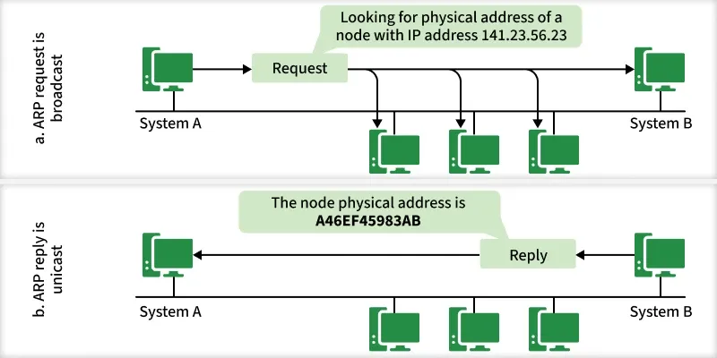

ARP Message Format:

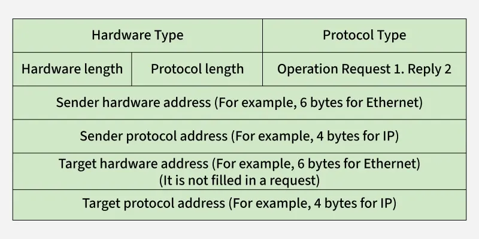

Quá trình ARP gồm hai bước chính:

- **ARP Request**
- **ARP Reply**

**ARP Request**

**ARP Request** là gói tin được gửi đi để hỏi:

```text
Ai đang sử dụng địa chỉ IP này?
Hãy cho tôi biết địa chỉ MAC của bạn.
```

ARP Request thường được gửi dưới dạng **broadcast**, nghĩa là gửi đến tất cả thiết bị trong cùng mạng LAN.

Địa chỉ MAC đích của ARP Request thường là:

```text
ff:ff:ff:ff:ff:ff
```

Đây là địa chỉ broadcast ở tầng Data Link.

Ví dụ:

```text
Máy A có IP: 192.168.1.10
Máy A muốn tìm MAC của IP: 192.168.1.20

Máy A gửi ARP Request:
Who has 192.168.1.20? Tell 192.168.1.10
```

Tất cả thiết bị trong LAN đều nhận được gói tin này, nhưng chỉ thiết bị có IP `192.168.1.20` mới phản hồi.

**ARP Reply**

**ARP Reply** là gói tin phản hồi từ thiết bị có địa chỉ IP được hỏi.

Ví dụ:

```text
Máy B có IP: 192.168.1.20
Máy B trả lời:
192.168.1.20 is at 44:df:65:d8:fe:6c
```

Sau khi nhận ARP Reply, máy A sẽ lưu thông tin này vào **ARP cache** để dùng lại trong thời gian ngắn.

Ví dụ ARP cache:

| IP Address | MAC Address |
|---|---|
| `192.168.1.20` | `44:df:65:d8:fe:6c` |

**Quy trình ARP tổng quát**

```text
1. Máy A muốn gửi dữ liệu đến IP 192.168.1.20
2. Máy A kiểm tra ARP cache
3. Nếu chưa có MAC address, máy A gửi ARP Request
4. Máy B nhận request và gửi ARP Reply
5. Máy A lưu MAC address vào ARP cache
6. Máy A gửi frame đến MAC address của máy B
```

**ARP và bảo mật**

ARP là giao thức cơ bản nhưng có một điểm yếu: nó không có cơ chế xác thực mạnh.

Một số tấn công liên quan đến ARP:

- ARP spoofing.
- ARP poisoning.
- Man-in-the-Middle trong mạng LAN.

Ví dụ, kẻ tấn công có thể giả mạo ARP Reply để khiến nạn nhân nghĩ rằng MAC address của attacker là MAC address của gateway.

Vì vậy, trong an ninh mạng, ARP rất quan trọng khi học về sniffing, MITM, phân tích traffic và bảo mật mạng LAN.

## 7.3. DHCP là gì?

**DHCP** là viết tắt của **Dynamic Host Configuration Protocol**, nghĩa là **giao thức cấu hình host động**.

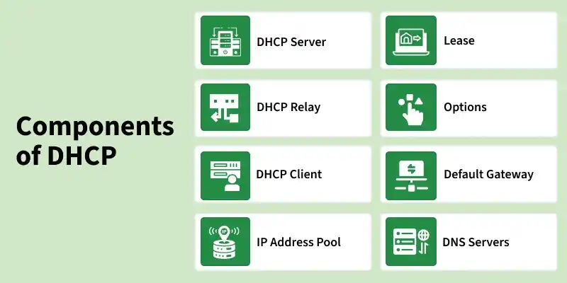

DHCP giúp thiết bị tự động nhận các thông tin cấu hình mạng khi kết nối vào mạng.

Nếu không có DHCP, người dùng hoặc quản trị viên phải cấu hình thủ công các thông tin như:

- Địa chỉ IP.
- Subnet mask.
- Default gateway.
- DNS server.

Ví dụ, khi bạn kết nối laptop vào Wi-Fi ở nhà, laptop thường tự động nhận địa chỉ IP như:

```text
IP address:      192.168.1.25
Subnet mask:     255.255.255.0
Default gateway: 192.168.1.1
DNS server:      192.168.1.1
```

Bạn không cần nhập các thông tin này bằng tay vì DHCP server đã cấp phát tự động.

Trong mạng gia đình, thiết bị đóng vai trò DHCP server thường là router Wi-Fi.

Trong mạng doanh nghiệp, DHCP server có thể là:

- Router.
- Firewall.
- Windows Server.
- Linux server.
- Thiết bị mạng chuyên dụng.

**Vai trò của DHCP**

DHCP giúp:

- Tự động cấp địa chỉ IP cho thiết bị.
- Giảm lỗi cấu hình thủ công.
- Quản lý địa chỉ IP hiệu quả.
- Tránh trùng địa chỉ IP.
- Cung cấp thông tin gateway và DNS cho client.

Ví dụ:

```text
Laptop mới kết nối vào mạng
→ Gửi yêu cầu DHCP
→ DHCP server cấp IP và thông tin mạng
→ Laptop có thể truy cập mạng
```

Tóm lại:

```text
DHCP = tự động cấp cấu hình mạng cho thiết bị.
```

## 7.4. Quy trình DHCP DORA

Quá trình cấp phát địa chỉ IP bằng DHCP thường được mô tả bằng mô hình **DORA**.

DORA gồm 4 bước:

```text
D - Discover
O - Offer
R - Request
A - Acknowledge
```

### 7.4.1. Bước 1: DHCP Discover

Khi thiết bị mới kết nối vào mạng, nó chưa có địa chỉ IP hợp lệ. Vì vậy, nó gửi gói **DHCP Discover** để tìm DHCP server.

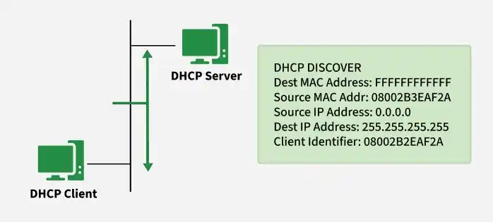

Ví dụ:

```text
Client → Broadcast: Có DHCP server nào trong mạng không?
```

Gói này thường được gửi dạng broadcast vì client chưa biết DHCP server nằm ở đâu.

### 7.4.2. Bước 2: DHCP Offer

DHCP server nhận được Discover và phản hồi bằng gói **DHCP Offer**.

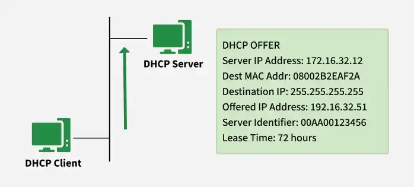

Gói Offer thường chứa:

- Địa chỉ IP đề xuất.
- Subnet mask.
- Default gateway.
- DNS server.
- Thời gian thuê địa chỉ IP.

Ví dụ:

```text
DHCP Server → Client:
Tôi có thể cấp cho bạn IP 192.168.1.25
```

### 7.4.3. Bước 3: DHCP Request

Client nhận DHCP Offer và gửi lại **DHCP Request** để xác nhận rằng nó muốn sử dụng địa chỉ IP được đề xuất.

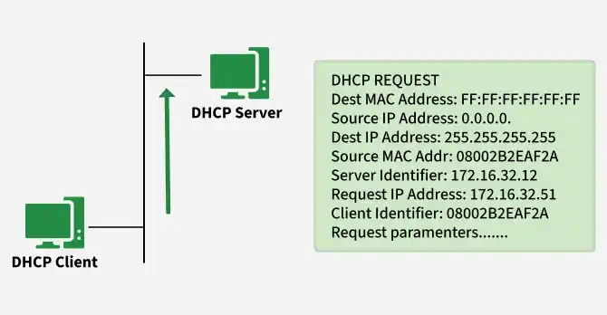

Ví dụ:

```text
Client → DHCP Server:
Tôi muốn dùng IP 192.168.1.25
```

### 7.4.4. Bước 4: DHCP Acknowledge

DHCP server gửi **DHCP Acknowledge** để xác nhận việc cấp phát địa chỉ IP.

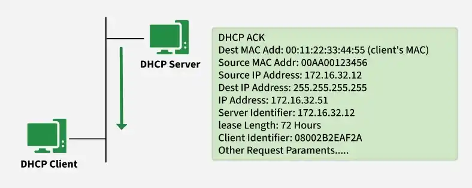

Ví dụ:

```text
DHCP Server → Client:
Được, bạn có thể sử dụng IP 192.168.1.25
```

Sau bước này, client có thể sử dụng địa chỉ IP và bắt đầu giao tiếp trong mạng.

Bảng tóm tắt DHCP DORA

| Bước | Tên | Ý nghĩa |
|---:|---|---|
| 1 | Discover | Client tìm DHCP server |
| 2 | Offer | DHCP server đề xuất cấu hình mạng |
| 3 | Request | Client yêu cầu sử dụng cấu hình được đề xuất |
| 4 | Acknowledge | DHCP server xác nhận cấp phát |

Sơ đồ đơn giản:

```text
Client                  DHCP Server
  | ---- Discover ----> |
  | <----- Offer ------ |
  | ---- Request -----> |
  | <--- Acknowledge -- |
```

## 7.5. ICMP là gì?

**ICMP** là viết tắt của **Internet Control Message Protocol**, nghĩa là **giao thức thông báo điều khiển Internet**.

ICMP Packet Format:

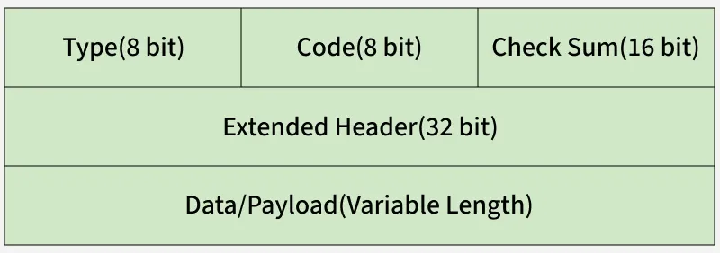

ICMP thường được dùng để:

- Kiểm tra kết nối mạng.
- Báo lỗi trong quá trình truyền packet.
- Chẩn đoán sự cố mạng.
- Hỗ trợ các công cụ như `ping` và `traceroute`.

ICMP không dùng để truyền dữ liệu ứng dụng như HTTP hay FTP. Thay vào đó, nó chủ yếu dùng để gửi thông báo điều khiển và thông báo lỗi.

Ví dụ các loại thông báo ICMP:

| Thông báo ICMP | Ý nghĩa |
|---|---|
| Echo Request | Gói yêu cầu kiểm tra kết nối |
| Echo Reply | Gói phản hồi cho Echo Request |
| Destination Unreachable | Không thể đến được đích |
| Time Exceeded | TTL hết hạn khi packet đang đi qua mạng |
| Redirect | Gợi ý đường đi khác tốt hơn |

Ví dụ:

Khi bạn dùng lệnh `ping 8.8.8.8`, máy tính gửi ICMP Echo Request đến `8.8.8.8`. Nếu đích phản hồi, bạn sẽ nhận được ICMP Echo Reply.

Tóm lại:

```text
ICMP = giao thức hỗ trợ kiểm tra, báo lỗi và chẩn đoán mạng.
```

## 7.6. Ping

**Ping** là công cụ dùng để kiểm tra một thiết bị có thể kết nối được qua mạng hay không.

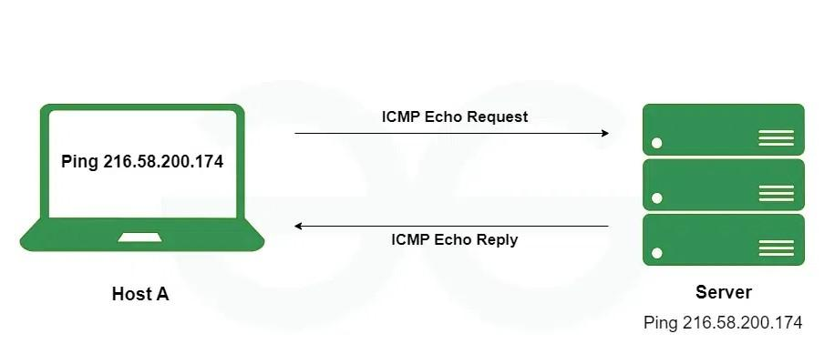

Ping sử dụng giao thức **ICMP**, cụ thể là:

- ICMP Echo Request.
- ICMP Echo Reply.

Cú pháp cơ bản:

```bash
ping <địa_chỉ_IP_hoặc_tên_miền>
```

Ví dụ:

```bash
ping 8.8.8.8
```

Hoặc:

```bash
ping google.com
```

Ví dụ kết quả:

```text
64 bytes from 8.8.8.8: icmp_seq=1 ttl=118 time=12.3 ms
64 bytes from 8.8.8.8: icmp_seq=2 ttl=118 time=11.9 ms
64 bytes from 8.8.8.8: icmp_seq=3 ttl=118 time=12.5 ms
```

Một số thông tin quan trọng trong kết quả ping:

| Thông tin | Ý nghĩa |
|---|---|
| `icmp_seq` | Số thứ tự gói ICMP |
| `ttl` | Time To Live, số bước còn lại của packet |
| `time` | Thời gian phản hồi |
| `packet loss` | Tỷ lệ gói tin bị mất |

Ví dụ giới hạn số lần ping trên Linux:

```bash
ping 8.8.8.8 -c 4
```

Lệnh này gửi 4 gói ICMP rồi dừng.

**Ping dùng để làm gì?**

Ping thường được dùng để:

- Kiểm tra máy đích có hoạt động không.
- Kiểm tra kết nối Internet.
- Kiểm tra độ trễ mạng.
- Phát hiện mất gói tin.
- Hỗ trợ troubleshooting mạng.

Ví dụ:

```bash
ping 192.168.1.1
```

Nếu ping đến gateway thành công nhưng ping Internet thất bại, có thể vấn đề nằm ở router, DNS hoặc kết nối ISP.

## 7.7. Traceroute

**Traceroute** là công cụ dùng để xác định đường đi của packet từ máy nguồn đến máy đích.

Traceroute cho biết packet đi qua những router nào trước khi đến đích. Mỗi router trên đường đi thường được gọi là một **hop**.

Trên Linux, lệnh thường dùng là:

```bash
traceroute <địa_chỉ_IP_hoặc_tên_miền>
```

Ví dụ:

```bash
traceroute google.com
```

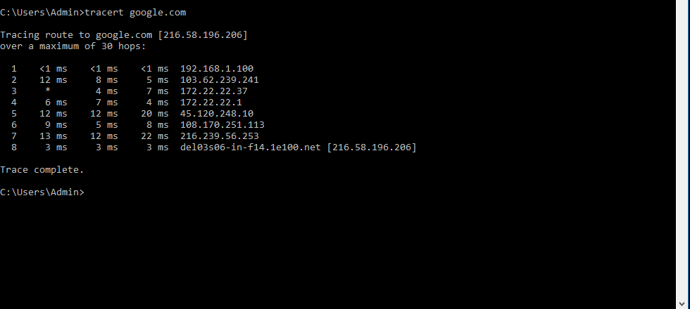

Trên Windows, lệnh tương ứng là:

```cmd
tracert google.com
```

**Traceroute hoạt động như thế nào?**

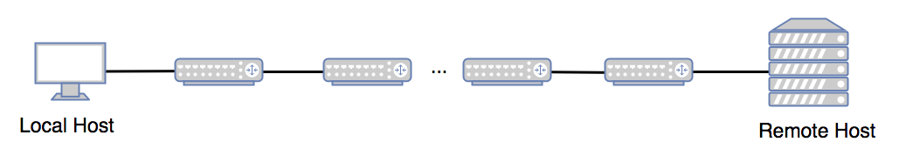

Traceroute dựa trên trường **TTL** trong IP packet.

TTL là giá trị giới hạn số lượng router mà packet có thể đi qua. Mỗi khi packet đi qua một router, TTL giảm đi 1. Khi TTL về 0, router sẽ loại bỏ packet và gửi lại thông báo ICMP Time Exceeded.

Traceroute lợi dụng cơ chế này bằng cách gửi nhiều packet với TTL tăng dần:

```text
Gói 1: TTL = 1 → router đầu tiên trả lời
Gói 2: TTL = 2 → router thứ hai trả lời
Gói 3: TTL = 3 → router thứ ba trả lời
...
```

Nhờ đó, traceroute xác định được các hop trên đường đi.

**Ví dụ kết quả traceroute**

```text
1  192.168.1.1       1.2 ms
2  10.10.0.1         5.4 ms
3  203.0.113.1       12.8 ms
4  8.8.8.8           20.1 ms
```

Ý nghĩa:

| Hop | Ý nghĩa |
|---:|---|
| 1 | Router trong mạng local |
| 2 | Router của ISP |
| 3 | Router trung gian |
| 4 | Máy đích |

**Traceroute dùng để làm gì?**

Traceroute giúp:

- Xem đường đi của packet.
- Xác định vị trí có độ trễ cao.
- Phát hiện điểm nghẽn mạng.
- Kiểm tra routing.
- Hỗ trợ phân tích sự cố kết nối.

Tóm lại:

```text
Traceroute = xem packet đi qua những router nào để đến đích.
```

## 7.8. Routing

**Routing** là quá trình chọn đường đi cho dữ liệu từ mạng nguồn đến mạng đích.

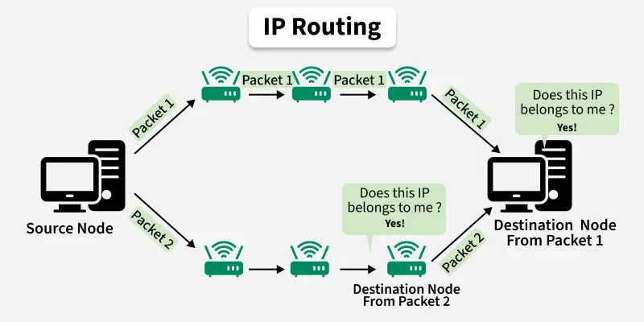

Khi một thiết bị muốn gửi packet đến một mạng khác, packet thường phải đi qua router. Router sẽ dựa vào bảng định tuyến để quyết định gửi packet đi đâu tiếp theo.

Ví dụ:

```text
Laptop → Router gia đình → Router ISP → Internet → Web Server
```

Trong quá trình này, các router sẽ chuyển tiếp packet qua nhiều mạng khác nhau cho đến khi packet đến đúng đích.

**Router làm gì trong quá trình routing?**

Architecture of Router:


Router thường thực hiện các nhiệm vụ:

- Nhận packet từ một interface.
- Kiểm tra địa chỉ IP đích.
- Tra cứu bảng định tuyến.
- Chọn đường đi phù hợp.
- Chuyển packet ra interface thích hợp.

Ví dụ bảng định tuyến đơn giản:

| Destination Network | Next Hop | Interface |
|---|---|---|
| `192.168.1.0/24` | Directly connected | LAN |
| `10.0.0.0/24` | `192.168.1.2` | LAN |
| `0.0.0.0/0` | ISP Gateway | WAN |

Trong đó:

- `192.168.1.0/24` là mạng kết nối trực tiếp.
- `10.0.0.0/24` cần gửi qua router khác.
- `0.0.0.0/0` là default route, thường dùng để gửi lưu lượng ra Internet.

**Static Routing và Dynamic Routing**

Có hai cách định tuyến phổ biến:

| Loại routing | Mô tả |
|---|---|
| Static Routing | Quản trị viên cấu hình đường đi thủ công |
| Dynamic Routing | Router tự trao đổi thông tin định tuyến bằng giao thức routing |

Ví dụ giao thức dynamic routing:

- RIP.
- OSPF.
- EIGRP.
- BGP.

## 7.9. NAT

**NAT** là viết tắt của **Network Address Translation**, nghĩa là **chuyển đổi địa chỉ mạng**.


NAT cho phép nhiều thiết bị trong mạng nội bộ sử dụng địa chỉ IP private để truy cập Internet thông qua một địa chỉ IP public.

Ví dụ mạng gia đình:

```text
Laptop:     192.168.1.10
Điện thoại: 192.168.1.11
PC:         192.168.1.12
Router public IP: 82.62.51.70
```

Khi các thiết bị truy cập Internet, bên ngoài thường chỉ nhìn thấy địa chỉ IP public của router.

**NAT hoạt động như thế nào?**

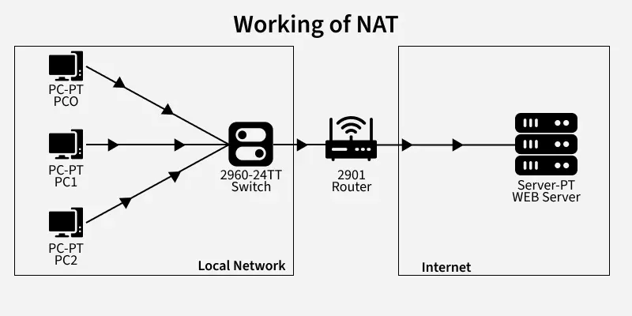

Khi laptop gửi yêu cầu ra Internet:

```text
Source IP ban đầu: 192.168.1.10
Source port:       52344
Destination IP:    93.184.216.34
Destination port:  443
```

Router sẽ chuyển đổi địa chỉ nguồn:

```text
Source IP sau NAT: 82.62.51.70
Source port sau NAT: 61001
Destination IP:     93.184.216.34
Destination port:   443
```

Router lưu thông tin ánh xạ này trong bảng NAT để khi phản hồi quay về, router biết cần chuyển dữ liệu cho thiết bị nội bộ nào.

Ví dụ bảng NAT:

| Private IP | Private Port | Public IP | Public Port |
|---|---:|---|---:|
| `192.168.1.10` | 52344 | `82.62.51.70` | 61001 |
| `192.168.1.11` | 53022 | `82.62.51.70` | 61002 |

NAT Inside & Outside Address:

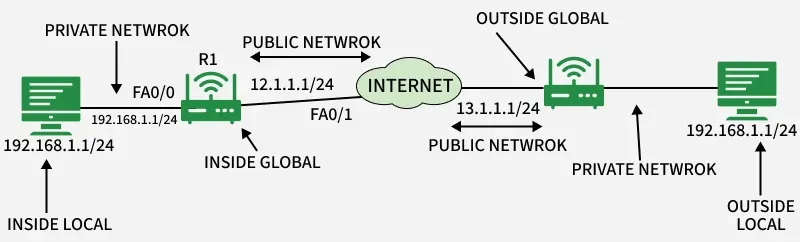

Types of NAT:


**Lợi ích của NAT**

NAT giúp:

- Nhiều thiết bị dùng chung một IP public.
- Tiết kiệm địa chỉ IPv4 public.
- Che giấu địa chỉ IP private khỏi Internet.
- Cho phép mạng nội bộ truy cập Internet dễ dàng.
- Hỗ trợ mô hình mạng gia đình và doanh nghiệp nhỏ.

**Hạn chế của NAT**

NAT cũng có một số hạn chế:

- Thiết bị bên ngoài khó truy cập trực tiếp vào thiết bị bên trong mạng.
- Một số ứng dụng cần cấu hình thêm, ví dụ game server, camera IP hoặc web server nội bộ.
- Có thể gây khó khăn cho một số giao thức cần kết nối end-to-end.
- Cần dùng port forwarding nếu muốn public dịch vụ nội bộ.

## 7.10. Port Forwarding

**Port Forwarding** là kỹ thuật chuyển tiếp lưu lượng từ một cổng trên địa chỉ IP public của router đến một thiết bị hoặc dịch vụ trong mạng nội bộ.

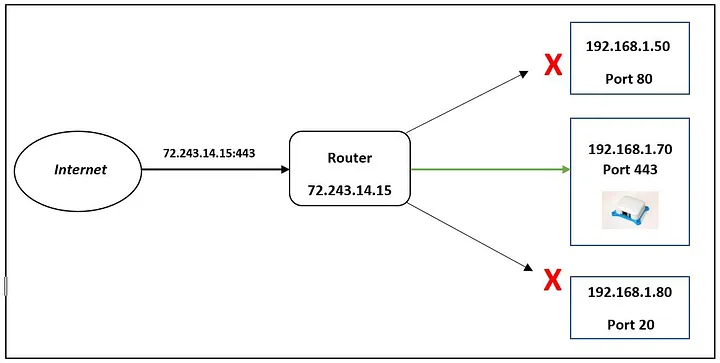

Nó thường được dùng khi muốn cho người dùng từ Internet truy cập vào một dịch vụ đang chạy trong LAN.

Ví dụ:

```text
Web Server nội bộ: 192.168.1.10:80
Router public IP:  82.62.51.70
```

Nếu cấu hình port forwarding:

```text
82.62.51.70:80 → 192.168.1.10:80
```

Người dùng bên ngoài có thể truy cập website nội bộ thông qua địa chỉ IP public của router.

**Port Forwarding hoạt động như thế nào?**

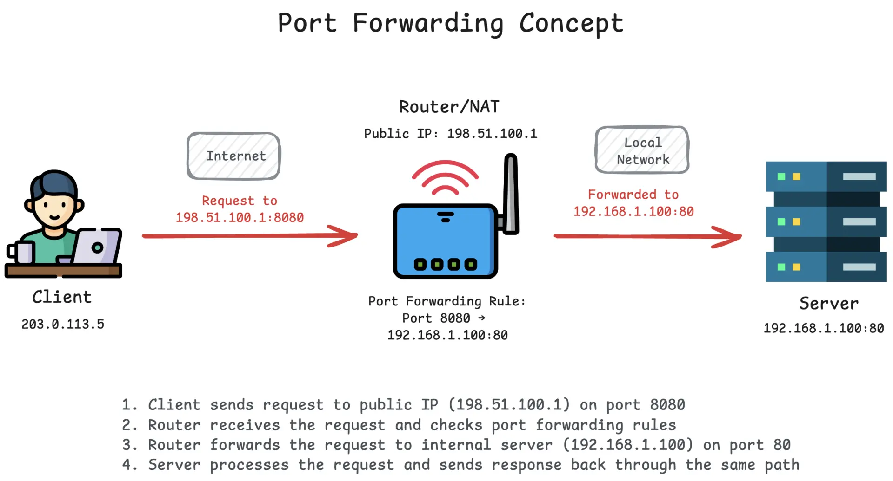

Ví dụ có một máy chủ web trong mạng LAN:

```text
Server nội bộ: 192.168.1.10
Dịch vụ web:   TCP port 80
Router public: 82.62.51.70
```

Khi người dùng từ Internet truy cập:

```text
http://82.62.51.70
```

Router nhận lưu lượng đến cổng `80`, sau đó chuyển tiếp vào server nội bộ:

```text
Internet Client → Router 82.62.51.70:80 → Server 192.168.1.10:80
```

**Ví dụ cấu hình port forwarding**

| Public IP | Public Port | Private IP | Private Port | Dịch vụ |
|---|---:|---|---:|---|
| `82.62.51.70` | 80 | `192.168.1.10` | 80 | Web Server |
| `82.62.51.70` | 2222 | `192.168.1.20` | 22 | SSH |
| `82.62.51.70` | 3389 | `192.168.1.30` | 3389 | RDP |

Ví dụ:

```text
82.62.51.70:2222 → 192.168.1.20:22
```

Khi người dùng kết nối SSH đến cổng `2222` của IP public, router sẽ chuyển tiếp vào cổng `22` của máy nội bộ.

**Port Forwarding và Firewall**

Port forwarding và firewall dễ bị nhầm với nhau.

- **Port forwarding** mở đường chuyển tiếp lưu lượng từ ngoài vào trong.
- **Firewall** quyết định lưu lượng đó có được phép đi qua hay không.

Ví dụ:

```text
Port forwarding đã cấu hình: 82.62.51.70:80 → 192.168.1.10:80
Firewall chặn port 80
→ Người dùng bên ngoài vẫn không truy cập được
```

Vì vậy, để dịch vụ nội bộ truy cập được từ Internet, thường cần:

1. Dịch vụ nội bộ đang chạy.
2. Port forwarding đúng trên router.
3. Firewall cho phép lưu lượng.
4. Địa chỉ IP public hoặc tên miền trỏ đúng.

**Rủi ro bảo mật của Port Forwarding**

Port forwarding có thể làm tăng bề mặt tấn công vì dịch vụ nội bộ được mở ra Internet.

Một số rủi ro:

- Dịch vụ bị quét bởi attacker.
- Lộ dịch vụ quản trị như SSH hoặc RDP.
- Bị brute force mật khẩu.
- Bị khai thác nếu dịch vụ có lỗ hổng.
- Cấu hình sai có thể làm lộ hệ thống nội bộ.

Khuyến nghị bảo mật:

- Chỉ mở những port thật sự cần thiết.
- Không public dịch vụ quản trị nếu không cần.
- Dùng VPN thay vì mở trực tiếp SSH/RDP ra Internet.
- Dùng mật khẩu mạnh hoặc SSH key.
- Cập nhật dịch vụ thường xuyên.
- Kết hợp firewall rule để giới hạn IP được phép truy cập.
- Theo dõi log truy cập.

# 8. Firewall và VPN

## 8.1. Firewall là gì?

**Firewall** hay **tường lửa** là một thiết bị hoặc phần mềm dùng để kiểm soát lưu lượng mạng ra vào hệ thống.

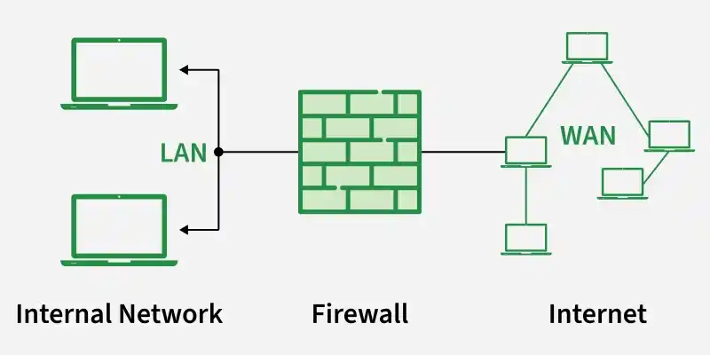

Nói đơn giản, firewall hoạt động như một **lớp bảo vệ biên giới** giữa mạng bên trong và mạng bên ngoài. Nó quyết định lưu lượng nào được phép đi qua và lưu lượng nào bị chặn lại.

Ví dụ:

```text
Internet → Firewall → Mạng nội bộ
```

Firewall có thể được triển khai dưới nhiều dạng khác nhau:

- Thiết bị firewall chuyên dụng.
- Firewall tích hợp trong router.
- Firewall trên hệ điều hành.
- Firewall trong cloud.
- Web Application Firewall dùng để bảo vệ ứng dụng web.

Firewall thường kiểm tra lưu lượng dựa trên các thông tin như:

- Địa chỉ IP nguồn.
- Địa chỉ IP đích.
- Cổng nguồn.
- Cổng đích.
- Giao thức sử dụng, ví dụ TCP, UDP hoặc ICMP.
- Trạng thái kết nối.
- Quy tắc bảo mật do quản trị viên cấu hình.

Ví dụ một rule firewall đơn giản:

```text
Cho phép TCP port 80 từ Internet đến Web Server
Chặn tất cả lưu lượng còn lại
```

Trong ví dụ này:

- Port `80` dùng cho HTTP.
- Chỉ lưu lượng web được phép đi qua.
- Các loại lưu lượng khác sẽ bị chặn.

Firewall thường được sử dụng để:

- Bảo vệ mạng nội bộ khỏi truy cập trái phép.
- Kiểm soát dịch vụ nào được public ra Internet.
- Chặn lưu lượng độc hại.
- Giới hạn truy cập giữa các vùng mạng.
- Hỗ trợ phân tách mạng trong doanh nghiệp.
- Ghi log phục vụ giám sát và điều tra bảo mật.

Ví dụ trong mạng doanh nghiệp:

```text
Internet
   |
Firewall
   |
Mạng nội bộ
```

Nếu không có firewall, các dịch vụ nội bộ có thể bị truy cập trực tiếp từ bên ngoài, làm tăng nguy cơ bị tấn công.

Tóm lại:

```text
Firewall = hệ thống kiểm soát lưu lượng mạng, cho phép hoặc chặn dữ liệu dựa trên rule.
```

### 8.1.1. Packet Inspection

**Packet Inspection** là quá trình firewall kiểm tra các gói tin mạng để quyết định có cho phép chúng đi qua hay không.

Mỗi gói tin khi đi qua firewall có thể chứa nhiều thông tin quan trọng như:

- Source IP Address.
- Destination IP Address.
- Source Port.
- Destination Port.
- Protocol.
- TCP Flags.
- Trạng thái kết nối.
- Nội dung dữ liệu trong một số loại firewall nâng cao.

Ví dụ một packet:

```text
Source IP:        192.168.1.10
Destination IP:   93.184.216.34
Protocol:         TCP
Destination Port: 443
```

Firewall sẽ kiểm tra packet này và so sánh với các rule đã được cấu hình.

Ví dụ rule:

```text
Allow TCP from 192.168.1.0/24 to any port 443
```

Nếu packet khớp với rule này, firewall sẽ cho phép đi qua.

Nếu không khớp với rule nào cho phép, firewall có thể chặn packet.

**Packet Inspection kiểm tra những gì?**

| Thành phần | Ý nghĩa |
|---|---|
| Source IP | Địa chỉ IP nguồn gửi packet |
| Destination IP | Địa chỉ IP đích nhận packet |
| Source Port | Cổng nguồn |
| Destination Port | Cổng đích |
| Protocol | Giao thức được sử dụng, ví dụ TCP, UDP, ICMP |
| TCP Flags | Các cờ như SYN, ACK, FIN, RST |
| Direction | Hướng lưu lượng: inbound hoặc outbound |

Ví dụ rule firewall:

| Hành động | Source | Destination | Port | Protocol |
|---|---|---|---:|---|
| Allow | `192.168.1.0/24` | Any | 443 | TCP |
| Allow | Any | Web Server | 80 | TCP |
| Deny | Any | Any | 23 | TCP |

Trong bảng trên:

- Rule đầu tiên cho phép mạng nội bộ truy cập HTTPS.
- Rule thứ hai cho phép truy cập web server qua HTTP.
- Rule thứ ba chặn Telnet vì Telnet không an toàn.

**Vì sao Packet Inspection quan trọng?**

Packet Inspection giúp firewall:

- Xác định lưu lượng có hợp lệ không.
- Chặn lưu lượng đến cổng nguy hiểm.
- Giới hạn truy cập từ IP không đáng tin cậy.
- Ngăn dịch vụ nội bộ bị truy cập trái phép.
- Phát hiện một số hành vi bất thường trong mạng.

Tóm lại:

```text
Packet Inspection = firewall kiểm tra thông tin trong packet để quyết định allow hoặc deny.
```

### 8.1.2. Stateful Firewall

**Stateful Firewall** là loại firewall có khả năng theo dõi **trạng thái của kết nối mạng**.

Thay vì chỉ kiểm tra từng packet riêng lẻ, stateful firewall ghi nhớ toàn bộ phiên kết nối. Nhờ đó, nó có thể hiểu packet đó thuộc về một kết nối hợp lệ hay không.

Ví dụ:

Khi máy tính trong mạng nội bộ truy cập website:

```text
Client → Server: SYN
Server → Client: SYN/ACK
Client → Server: ACK
```

Stateful firewall có thể ghi nhớ rằng client đã chủ động mở kết nối ra ngoài. Khi server phản hồi lại, firewall biết đây là phản hồi hợp lệ và cho phép packet đi vào.

**Stateful Firewall hoạt động như thế nào?**

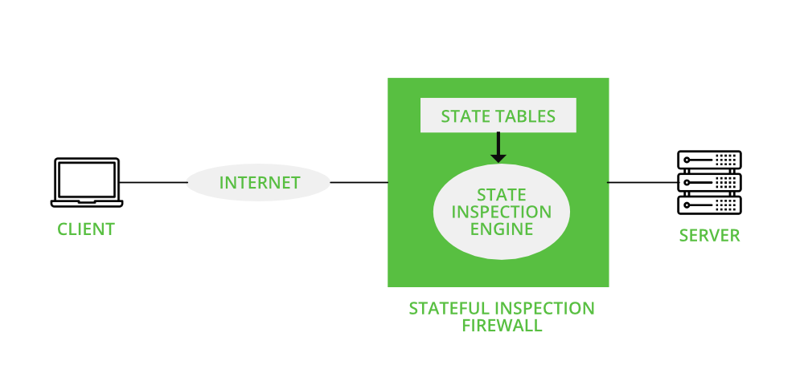

Stateful firewall thường lưu thông tin kết nối trong một bảng trạng thái.

Ví dụ bảng trạng thái:

| Source IP | Source Port | Destination IP | Destination Port | State |
|---|---:|---|---:|---|
| `192.168.1.10` | 52344 | `93.184.216.34` | 443 | Established |

Khi packet mới đi qua, firewall kiểm tra:

- Packet này có thuộc kết nối đã biết không?
- Kết nối có được thiết lập đúng cách không?
- Packet có hợp lệ với trạng thái hiện tại không?
- Có dấu hiệu bất thường trong phiên kết nối không?

**Ưu điểm của Stateful Firewall**

- Thông minh hơn stateless firewall.
- Theo dõi được trạng thái kết nối.
- Tự động cho phép phản hồi hợp lệ từ kết nối đã được mở.
- Phù hợp với mạng doanh nghiệp và mạng hiện đại.
- Có thể phát hiện một số hành vi bất thường trong kết nối.

**Nhược điểm của Stateful Firewall**

- Cần nhiều tài nguyên hơn.
- Phải lưu bảng trạng thái kết nối.
- Có thể bị ảnh hưởng nếu số lượng kết nối quá lớn.
- Cấu hình và quản lý phức tạp hơn firewall đơn giản.

Ví dụ:

```text
Máy nội bộ truy cập HTTPS ra Internet
→ Stateful firewall ghi nhớ kết nối
→ Phản hồi từ server được cho phép quay lại
```

Tóm lại:

```text
Stateful Firewall = firewall kiểm tra packet dựa trên trạng thái của toàn bộ kết nối.
```

### 8.1.3. Stateless Firewall

**Stateless Firewall** là loại firewall kiểm tra từng packet một cách độc lập, không ghi nhớ trạng thái của kết nối trước đó.

Nó chỉ dựa vào các rule tĩnh để quyết định packet được phép đi qua hay bị chặn.

Ví dụ:

```text
Allow TCP port 80
Deny TCP port 23
Allow ICMP
```

Khi một packet đi qua, stateless firewall kiểm tra packet đó có khớp rule nào không. Nó không quan tâm packet này thuộc kết nối đã được thiết lập hay chưa.

**Stateless Firewall kiểm tra gì?**

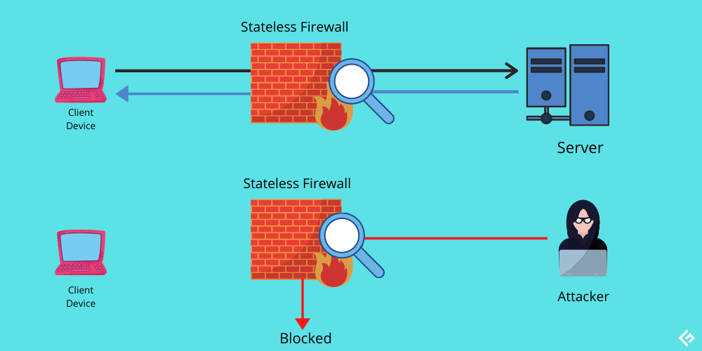

Stateless firewall thường kiểm tra các thông tin cơ bản như:

- Source IP.
- Destination IP.
- Source Port.
- Destination Port.
- Protocol.
- Direction.

Ví dụ rule:

| Action | Source | Destination | Port | Protocol |
|---|---|---|---:|---|
| Allow | Any | Web Server | 80 | TCP |
| Deny | Any | Any | 23 | TCP |

Nếu một packet đến Web Server qua TCP port `80`, firewall cho phép.

Nếu một packet sử dụng TCP port `23`, firewall chặn.

**Ưu điểm của Stateless Firewall**

- Đơn giản.
- Xử lý nhanh.
- Ít tốn tài nguyên.
- Phù hợp với các rule cơ bản.
- Có thể hiệu quả khi xử lý lượng lớn packet đơn giản.

**Nhược điểm của Stateless Firewall**

- Không theo dõi trạng thái kết nối.
- Kém thông minh hơn stateful firewall.
- Dễ cấu hình thiếu chính xác.
- Khó phân biệt packet hợp lệ và packet bất thường trong một phiên kết nối.
- Có thể cần nhiều rule hơn để kiểm soát lưu lượng hiệu quả.

**So sánh Stateful và Stateless Firewall**

| Tiêu chí | Stateful Firewall | Stateless Firewall |
|---|---|---|
| Cách kiểm tra | Theo dõi toàn bộ kết nối | Kiểm tra từng packet riêng lẻ |
| Có lưu trạng thái không? | Có | Không |
| Độ thông minh | Cao hơn | Thấp hơn |
| Tài nguyên sử dụng | Nhiều hơn | Ít hơn |
| Tốc độ xử lý | Có thể chậm hơn | Nhanh hơn |
| Phù hợp với | Mạng hiện đại, doanh nghiệp | Rule đơn giản, lọc cơ bản |
| Ví dụ | Cho phép phản hồi từ kết nối đã mở | Chỉ cho phép packet nếu khớp rule |

Tóm lại:

```text
Stateless Firewall = firewall kiểm tra từng packet riêng lẻ dựa trên rule tĩnh.
```

## 8.2. VPN là gì?

**VPN** là viết tắt của **Virtual Private Network**, nghĩa là **mạng riêng ảo**.

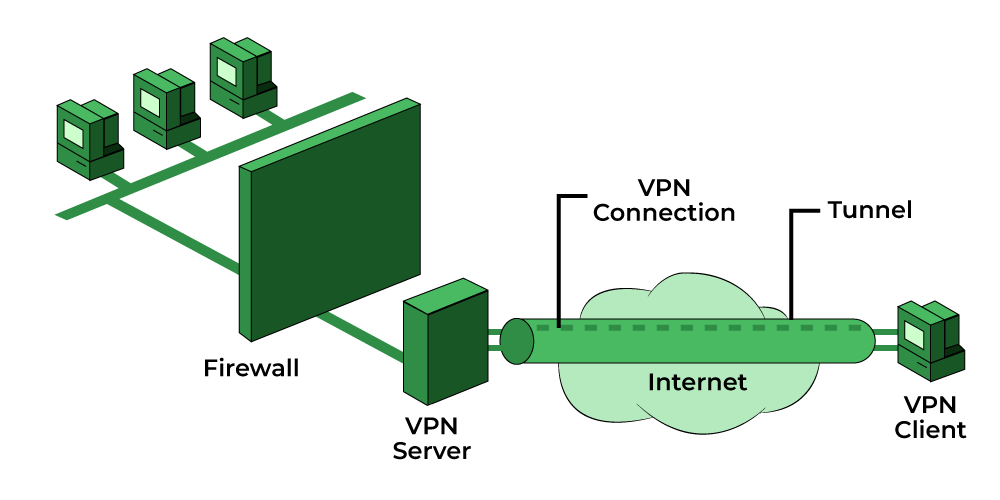

VPN là công nghệ cho phép thiết bị kết nối an toàn đến một mạng khác thông qua Internet. VPN tạo ra một kết nối bảo mật giữa máy khách và máy chủ VPN, giúp người dùng truy cập tài nguyên từ xa như thể đang ở trong cùng một mạng nội bộ.

Ví dụ:

Một nhân viên làm việc tại nhà có thể dùng VPN để kết nối vào mạng công ty và truy cập:

- File server nội bộ.
- Ứng dụng nội bộ.
- Database nội bộ.
- Dashboard quản trị.
- Hệ thống giám sát.

Sơ đồ đơn giản:

```text
Laptop nhân viên → Internet → VPN Server → Mạng công ty
```

Khi kết nối VPN được thiết lập, laptop của nhân viên có thể truy cập một số tài nguyên nội bộ theo quyền được cấp.

**VPN dùng để làm gì?**

VPN thường được dùng để:

- Kết nối nhân viên làm việc từ xa vào mạng công ty.
- Kết nối hai văn phòng ở hai địa điểm khác nhau.
- Bảo vệ dữ liệu khi dùng Wi-Fi công cộng.
- Ẩn địa chỉ IP thật khỏi dịch vụ bên ngoài.
- Tạo môi trường lab an toàn khi thực hành bảo mật.

Ví dụ:

```text
Văn phòng A ← VPN Tunnel → Văn phòng B
```

Hai văn phòng có thể trao đổi dữ liệu qua Internet nhưng vẫn giống như đang kết nối qua một đường truyền riêng.

**Một số công nghệ VPN phổ biến**

| Công nghệ | Mô tả ngắn |
|---|---|
| IPSec VPN | VPN sử dụng bộ giao thức IPSec để bảo vệ dữ liệu IP |
| SSL/TLS VPN | VPN sử dụng SSL/TLS, thường truy cập qua trình duyệt hoặc client |
| OpenVPN | Công nghệ VPN mã nguồn mở phổ biến |
| WireGuard | VPN hiện đại, nhẹ và hiệu năng cao |
| PPTP | Công nghệ VPN cũ, dễ cấu hình nhưng bảo mật yếu hơn |

Tóm lại:

```text
VPN = công nghệ tạo kết nối riêng và an toàn qua một mạng công cộng như Internet.
```

## 8.3. VPN Tunnel

**VPN Tunnel** là “đường hầm” bảo mật được tạo ra giữa thiết bị người dùng và máy chủ VPN.


Khi dữ liệu đi qua VPN tunnel, dữ liệu thường được mã hóa để bên thứ ba không thể đọc được nội dung bên trong.

Ví dụ:

```text
Client → VPN Tunnel → VPN Server → Mạng nội bộ / Internet
```

Có thể hiểu VPN tunnel giống như một đường hầm riêng đi xuyên qua Internet. Người bên ngoài có thể thấy có kết nối VPN đang tồn tại, nhưng không dễ đọc được nội dung dữ liệu bên trong nếu dữ liệu được mã hóa đúng cách.

**VPN Tunnel hoạt động như thế nào?**

Quy trình tổng quát:

```text
1. Client kết nối đến VPN Server
2. Hai bên xác thực với nhau
3. VPN thiết lập kênh mã hóa
4. Dữ liệu được đóng gói và mã hóa
5. Dữ liệu đi qua Internet trong VPN tunnel
6. VPN Server giải mã và chuyển tiếp dữ liệu đến đích
```

Ví dụ khi nhân viên truy cập file server công ty:

```text
Laptop → VPN Tunnel → VPN Server → File Server nội bộ
```

Người dùng ở bên ngoài công ty vẫn có thể truy cập tài nguyên nội bộ, nhưng dữ liệu được truyền qua đường hầm bảo mật.

**Encapsulation trong VPN**

VPN thường đóng gói packet ban đầu vào trong một packet khác để truyền qua Internet.

Ví dụ đơn giản:

```text
[Packet nội bộ] → được mã hóa và đóng gói → [Packet VPN] → Internet
```

Khi đến VPN Server:

```text
[Packet VPN] → giải mã → [Packet nội bộ] → chuyển đến tài nguyên đích
```

**Vì sao gọi là tunnel?**

Gọi là tunnel vì dữ liệu được truyền qua một đường dẫn logic riêng, tách biệt với lưu lượng thông thường ở mức bảo mật.

Ví dụ:

```text
Internet công cộng
    |
    |===== VPN Tunnel đã mã hóa =====|
    |
Mạng công ty
```

Tóm lại:

```text
VPN Tunnel = đường hầm bảo mật giúp truyền dữ liệu riêng tư qua Internet.
```

## 8.4. Lợi ích của VPN

VPN mang lại nhiều lợi ích trong cả môi trường cá nhân, doanh nghiệp và phòng lab an ninh mạng.

**1. Bảo mật dữ liệu khi truyền qua Internet**

VPN mã hóa dữ liệu giữa client và VPN server. Điều này giúp giảm nguy cơ bị nghe lén, đặc biệt khi sử dụng mạng không đáng tin cậy như Wi-Fi công cộng.

Ví dụ:

```text
Laptop → Wi-Fi công cộng → VPN Tunnel → VPN Server
```

Nếu không dùng VPN, attacker trong cùng mạng Wi-Fi có thể cố gắng sniff traffic. Khi dùng VPN, dữ liệu đã được mã hóa nên khó đọc được nội dung.

**2. Truy cập tài nguyên nội bộ từ xa**

VPN cho phép người dùng bên ngoài truy cập tài nguyên nội bộ một cách an toàn.

Ví dụ:

- Nhân viên làm việc từ xa truy cập file server công ty.
- Quản trị viên truy cập hệ thống giám sát nội bộ.
- Sinh viên kết nối vào lab thực hành.
- Kỹ sư truy cập server quản trị từ bên ngoài.

Sơ đồ:

```text
Remote User → VPN → Internal Network
```

**3. Kết nối nhiều văn phòng với nhau**

VPN có thể kết nối các chi nhánh ở các địa điểm địa lý khác nhau.

Ví dụ:

```text
Văn phòng Hà Nội ← VPN Tunnel → Văn phòng TP.HCM
```

Hoặc:

```text
Văn phòng A ← VPN Tunnel → Văn phòng B ← VPN Tunnel → Văn phòng C
```

Nhờ đó, các văn phòng có thể chia sẻ tài nguyên nội bộ mà không cần thuê đường truyền riêng đắt tiền.

**4. Tăng quyền riêng tư khi truy cập Internet**

Khi dùng VPN, dịch vụ bên ngoài thường nhìn thấy địa chỉ IP của VPN server thay vì địa chỉ IP thật của người dùng.

Ví dụ:

```text
Người dùng thật: 192.168.1.10
Public IP thật: 82.62.51.70
Dịch vụ web nhìn thấy: IP của VPN Server
```

Điều này giúp tăng quyền riêng tư ở mức nhất định. Tuy nhiên, VPN không làm người dùng ẩn danh hoàn toàn. Nhà cung cấp VPN vẫn có thể nhìn thấy một số thông tin tùy theo chính sách và cách họ vận hành.

**5. Hỗ trợ thực hành an toàn trong an ninh mạng**

Trong các môi trường học tập như lab bảo mật, VPN giúp người học kết nối vào máy ảo hoặc hệ thống thực hành mà không cần public các máy đó trực tiếp lên Internet.

Ví dụ:

```text
Máy người học → VPN → Lab network → Máy mục tiêu
```

Điều này giúp:

- Cô lập môi trường thực hành.
- Tránh public máy dễ bị tấn công ra Internet.
- Giảm rủi ro ảnh hưởng đến hệ thống thật.
- Cho phép người học tương tác với lab an toàn hơn.

**6. Hỗ trợ kiểm soát truy cập**

VPN có thể kết hợp với xác thực người dùng để kiểm soát ai được phép truy cập vào mạng nội bộ.

Ví dụ:

- Chỉ nhân viên có tài khoản hợp lệ mới được kết nối VPN.
- Có thể yêu cầu xác thực đa yếu tố.
- Có thể giới hạn người dùng chỉ truy cập một số subnet hoặc dịch vụ nhất định.
- Có thể ghi log truy cập để phục vụ giám sát bảo mật.

# 9. DNS – Domain Name System

## 9.1. DNS là gì?

**DNS** là viết tắt của **Domain Name System**, nghĩa là **hệ thống tên miền**.

DNS có nhiệm vụ chuyển đổi tên miền dễ nhớ thành địa chỉ IP mà máy tính có thể hiểu được.

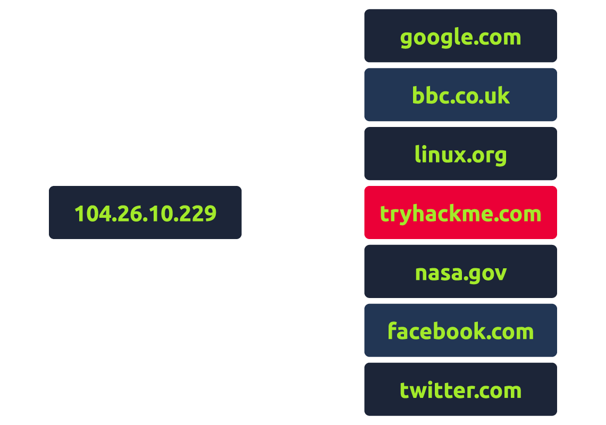

Ví dụ, thay vì phải nhớ địa chỉ IP như:

```text
104.26.10.229
```

người dùng chỉ cần nhớ tên miền như:

```text
tryhackme.com
```

Khi bạn nhập một tên miền vào trình duyệt, hệ thống DNS sẽ tìm địa chỉ IP tương ứng của tên miền đó. Sau đó, trình duyệt mới có thể kết nối đến máy chủ web.

Ví dụ:

```text
example.com → 93.184.216.34
google.com  → địa chỉ IP của máy chủ Google
```

Có thể hiểu DNS giống như **danh bạ điện thoại của Internet**:

- Người dùng nhớ tên miền.
- Máy tính cần địa chỉ IP.
- DNS giúp ánh xạ tên miền sang địa chỉ IP.

Nếu không có DNS, người dùng sẽ phải ghi nhớ rất nhiều địa chỉ IP phức tạp để truy cập website, điều này không thực tế.

Tóm lại:

```text
DNS = hệ thống chuyển đổi tên miền thành địa chỉ IP.
```

## 9.2. Hệ thống phân cấp tên miền

DNS hoạt động theo mô hình phân cấp. Tên miền được tổ chức thành nhiều cấp, từ cấp cao nhất đến cấp thấp hơn.


Ví dụ tên miền:

```text
www.example.com
```

Có thể chia thành các phần:

| Thành phần | Ý nghĩa |
|---|---|
| `com` | Top-Level Domain |
| `example` | Second-Level Domain |
| `www` | Subdomain |

Cấu trúc phân cấp có thể biểu diễn như sau:

```text
.
└── com
    └── example
        └── www
```

Trong đó:

- Dấu `.` ở đầu là root domain.
- `.com` là tên miền cấp cao nhất.
- `example` là tên miền cấp hai.
- `www` là subdomain.

Ví dụ khác:

```text
mail.google.com
```

Có thể hiểu là:

```text
.
└── com
    └── google
        └── mail
```

Hệ thống phân cấp này giúp DNS dễ quản lý và dễ mở rộng. Mỗi cấp trong hệ thống có thể được quản lý bởi các máy chủ DNS khác nhau.

### 9.2.1. Top-Level Domain

**Top-Level Domain**, viết tắt là **TLD**, là phần nằm ở bên phải nhất của một tên miền.

Xem các tên miền tại đây: https://data.iana.org/TLD/tlds-alpha-by-domain.txt

Ví dụ:

```text
tryhackme.com
```

Trong tên miền trên, phần `.com` là **Top-Level Domain**.

Một số TLD phổ biến:

| TLD | Ý nghĩa |
|---|---|
| `.com` | Thường dùng cho thương mại, công ty, website phổ biến |
| `.org` | Thường dùng cho tổ chức |
| `.edu` | Thường dùng cho giáo dục |
| `.gov` | Thường dùng cho chính phủ |
| `.net` | Thường dùng cho mạng hoặc dịch vụ Internet |

Có hai nhóm TLD chính:

**gTLD**

**gTLD** là viết tắt của **Generic Top-Level Domain**.

Đây là các tên miền cấp cao dùng cho mục đích chung.

Ví dụ:

```text
.com
.org
.net
.info
.online
.website
```

**ccTLD**

**ccTLD** là viết tắt của **Country Code Top-Level Domain**.

Đây là tên miền cấp cao theo mã quốc gia.

Ví dụ:

| ccTLD | Quốc gia / khu vực |
|---|---|
| `.vn` | Việt Nam |
| `.de` | Đức |
| `.uk` | Vương quốc Anh |
| `.ca` | Canada |
| `.jp` | Nhật Bản |

Ví dụ:

```text
example.vn
example.de
example.co.uk
```

Tóm lại:

```text
TLD = phần cuối cùng của tên miền, ví dụ .com, .org, .vn.
```

### 9.2.2. Second-Level Domain

**Second-Level Domain** là phần đứng ngay bên trái của Top-Level Domain.

Ví dụ:

```text
tryhackme.com
```

Trong tên miền này:

- `.com` là Top-Level Domain.
- `tryhackme` là Second-Level Domain.

Ví dụ khác:

```text
google.com
github.com
wikipedia.org
```

| Tên miền | Second-Level Domain | TLD |
|---|---|---|
| `google.com` | `google` | `.com` |
| `github.com` | `github` | `.com` |
| `wikipedia.org` | `wikipedia` | `.org` |

Second-Level Domain thường là phần chính đại diện cho thương hiệu, tổ chức, cá nhân hoặc dịch vụ.

Khi đăng ký tên miền, người dùng thường chọn phần Second-Level Domain.

Ví dụ:

```text
mycompany.com
```

Trong đó, `mycompany` là tên do người đăng ký lựa chọn.

Một số quy tắc thường gặp:

- Có thể dùng chữ cái `a-z`.
- Có thể dùng số `0-9`.
- Có thể dùng dấu gạch ngang `-`.
- Không nên bắt đầu hoặc kết thúc bằng dấu gạch ngang.
- Không được chứa khoảng trắng.

Tóm lại:

```text
Second-Level Domain = phần tên chính của tên miền, đứng trước TLD.
```

### 9.2.3. Subdomain

**Subdomain** là tên miền con, nằm bên trái của Second-Level Domain.

Ví dụ:

```text
admin.tryhackme.com
```

Trong tên miền này:

- `com` là TLD.
- `tryhackme` là Second-Level Domain.
- `admin` là Subdomain.

Ví dụ khác:

```text
mail.google.com
blog.example.com
shop.website.com
```

| Tên miền | Subdomain |
|---|---|
| `mail.google.com` | `mail` |
| `blog.example.com` | `blog` |
| `shop.website.com` | `shop` |

Một tên miền có thể có nhiều subdomain.

Ví dụ:

```text
jupiter.servers.tryhackme.com
```

Trong ví dụ này:

- `jupiter` là subdomain của `servers.tryhackme.com`.
- `servers` cũng là một subdomain của `tryhackme.com`.

Subdomain thường được dùng để phân chia dịch vụ.

Ví dụ:

| Subdomain | Mục đích |
|---|---|
| `www.example.com` | Website chính |
| `mail.example.com` | Máy chủ email |
| `blog.example.com` | Blog |
| `shop.example.com` | Cửa hàng trực tuyến |
| `api.example.com` | API server |
| `admin.example.com` | Trang quản trị |

Tóm lại:

```text
Subdomain = tên miền con dùng để chia nhỏ dịch vụ hoặc khu vực trong một domain.
```

## 9.3. DNS Record Types

### 9.3.1. Bản ghi A

**Bản ghi A** hay **A Record** là loại bản ghi DNS dùng để ánh xạ một tên miền đến địa chỉ **IPv4**.

Ví dụ:

```text
example.com → 93.184.216.34
```

Trong đó:

- `example.com` là tên miền.
- `93.184.216.34` là địa chỉ IPv4.

Khi người dùng truy cập một website, trình duyệt cần biết địa chỉ IP của máy chủ. Nếu website sử dụng IPv4, DNS sẽ trả về bản ghi A.

Ví dụ tra cứu bằng `nslookup`:

```bash
nslookup --type=A example.com
```

Ví dụ kết quả:

```text
Name:    example.com
Address: 93.184.216.34
```

Bản ghi A thường được dùng cho:

- Website.
- Web server.
- API server.
- Máy chủ dịch vụ dùng IPv4.

Tóm lại:

```text
A Record = ánh xạ tên miền đến địa chỉ IPv4.
```

### 9.3.2. Bản ghi AAAA

**Bản ghi AAAA** hay **AAAA Record** là loại bản ghi DNS dùng để ánh xạ một tên miền đến địa chỉ **IPv6**.

Ví dụ:

```text
example.com → 2606:2800:220:1:248:1893:25c8:1946
```

AAAA Record tương tự như A Record, nhưng khác ở loại địa chỉ IP:

| Loại bản ghi | Dùng cho |
|---|---|
| A | IPv4 |
| AAAA | IPv6 |

Ví dụ tra cứu bằng `nslookup`:

```bash
nslookup --type=AAAA example.com
```

Ví dụ kết quả:

```text
Name:    example.com
Address: 2606:2800:220:1:248:1893:25c8:1946
```

AAAA Record ngày càng quan trọng vì IPv6 được thiết kế để giải quyết vấn đề thiếu hụt địa chỉ IPv4.

Tóm lại:

```text
AAAA Record = ánh xạ tên miền đến địa chỉ IPv6.
```

### 9.3.3. Bản ghi CNAME

**CNAME** là viết tắt của **Canonical Name**.

**Bản ghi CNAME** dùng để ánh xạ một tên miền hoặc subdomain đến một tên miền khác.

Ví dụ:

```text
shop.example.com → shops.myshopify.com
```

Điều này có nghĩa là khi người dùng truy cập:

```text
shop.example.com
```

DNS sẽ hiểu rằng tên miền này là bí danh của:

```text
shops.myshopify.com
```

Sau đó, DNS tiếp tục phân giải tên miền đích để lấy địa chỉ IP.

CNAME thường được dùng khi:

- Trỏ subdomain đến dịch vụ bên thứ ba.
- Trỏ `www.example.com` về `example.com`.
- Dùng với dịch vụ cloud, CDN, hosting hoặc e-commerce.
- Muốn dễ quản lý khi địa chỉ IP của dịch vụ đích thay đổi.

Ví dụ:

```bash
nslookup --type=CNAME shop.example.com
```

Ví dụ kết quả:

```text
shop.example.com canonical name = shops.myshopify.com
```

Ưu điểm của CNAME:

- Dễ quản lý.
- Không cần cập nhật IP trực tiếp ở nhiều nơi.
- Phù hợp khi dùng dịch vụ bên ngoài.

Tóm lại:

```text
CNAME Record = tạo bí danh, trỏ một tên miền đến tên miền khác.
```

### 9.3.4. Bản ghi MX

**MX** là viết tắt của **Mail Exchanger**.

**Bản ghi MX** dùng để xác định máy chủ email chịu trách nhiệm nhận email cho một tên miền.

Ví dụ:

```text
example.com → mail server của example.com
```

Khi ai đó gửi email đến:

```text
user@example.com
```

máy chủ gửi email sẽ truy vấn bản ghi MX của `example.com` để biết email cần được chuyển đến máy chủ nào.

Ví dụ tra cứu:

```bash
nslookup --type=MX example.com
```

Ví dụ kết quả:

```text
example.com mail exchanger = 10 mail.example.com
```

Trong đó:

- `10` là giá trị ưu tiên.
- `mail.example.com` là mail server.

**Giá trị ưu tiên trong MX**

Bản ghi MX thường có giá trị ưu tiên. Số càng thấp thì độ ưu tiên càng cao.

Ví dụ:

```text
example.com mail exchanger = 10 mail1.example.com
example.com mail exchanger = 20 mail2.example.com
```

Trong ví dụ này:

- `mail1.example.com` được dùng trước.
- Nếu `mail1` không hoạt động, hệ thống có thể thử `mail2`.

Tóm lại:

```text
MX Record = xác định máy chủ email cho tên miền.
```

### 9.3.5. Bản ghi TXT

**TXT Record** là bản ghi DNS dùng để lưu trữ dữ liệu dạng văn bản.

Ban đầu, TXT được dùng để ghi chú hoặc lưu thông tin mô tả. Ngày nay, TXT Record thường được dùng trong các mục đích xác thực và bảo mật.

Ví dụ:

```text
example.com TXT "v=spf1 include:_spf.google.com ~all"
```

Một số ứng dụng phổ biến của TXT Record:

| Mục đích | Giải thích |
|---|---|
| SPF | Xác định máy chủ nào được phép gửi email thay mặt domain |
| DKIM | Lưu khóa công khai để xác thực chữ ký email |
| DMARC | Chính sách xử lý email giả mạo |
| Xác minh domain | Dùng để chứng minh quyền sở hữu tên miền với Google, Microsoft, Cloudflare... |
| Metadata | Lưu thông tin văn bản tùy chỉnh |

Ví dụ tra cứu TXT:

```bash
nslookup --type=TXT example.com
```

Ví dụ kết quả:

```text
example.com text = "v=spf1 include:_spf.example.com ~all"
```

TXT Record rất quan trọng trong bảo mật email vì nó giúp giảm nguy cơ spam, spoofing và phishing email.

Tóm lại:

```text
TXT Record = lưu dữ liệu văn bản trong DNS, thường dùng cho xác thực và bảo mật.
```

## 9.4. Quy trình DNS Request

Khi người dùng nhập một tên miền vào trình duyệt, máy tính cần tìm địa chỉ IP tương ứng. Quá trình này gọi là **DNS Request** hoặc **DNS Query**.

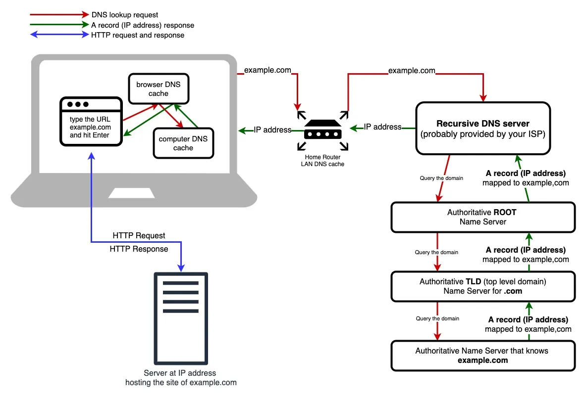

Ví dụ:

```text
Người dùng nhập: www.example.com
Máy tính cần tìm: địa chỉ IP của www.example.com
```

Quy trình DNS Request cơ bản:

```text
1. Máy tính kiểm tra DNS cache cục bộ
2. Nếu chưa có kết quả, gửi truy vấn đến Recursive DNS Server
3. Recursive DNS Server hỏi Root DNS Server
4. Root DNS Server chỉ đến TLD DNS Server
5. TLD DNS Server chỉ đến Authoritative DNS Server
6. Authoritative DNS Server trả về bản ghi DNS
7. Recursive DNS Server gửi kết quả về máy tính người dùng
8. Máy tính dùng địa chỉ IP để kết nối đến máy chủ đích
```

Sơ đồ đơn giản:

```text
Client
  |
  v
Recursive DNS Server
  |
  v
Root DNS Server
  |
  v
TLD DNS Server
  |
  v
Authoritative DNS Server
  |
  v
Trả về địa chỉ IP
```

Ví dụ:

```text
www.example.com → 93.184.216.34
```

Sau khi nhận địa chỉ IP, trình duyệt có thể thiết lập kết nối đến web server.

DNS Request thường diễn ra rất nhanh vì nhiều kết quả được lưu trong cache.

Tóm lại:

```text
DNS Request = quá trình hỏi DNS để tìm địa chỉ IP của một tên miền.
```

## 9.5. Recursive DNS Server

**Recursive DNS Server** là máy chủ DNS nhận truy vấn từ client và thay mặt client đi tìm câu trả lời.

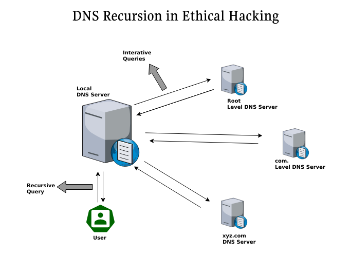

Khi máy tính của bạn cần phân giải tên miền, nó thường gửi truy vấn đến Recursive DNS Server.

Recursive DNS Server thường được cung cấp bởi:

- Nhà cung cấp dịch vụ Internet.
- Doanh nghiệp.
- Trường học.
- Dịch vụ DNS công cộng.
- Router hoặc hệ thống DNS nội bộ.

Ví dụ DNS resolver phổ biến:

```text
8.8.8.8
1.1.1.1
9.9.9.9
```

Recursive DNS Server có thể:

- Kiểm tra cache của chính nó.
- Nếu có kết quả trong cache, trả lời ngay cho client.
- Nếu không có, truy vấn tiếp đến Root DNS Server, TLD DNS Server và Authoritative DNS Server.
- Lưu kết quả tạm thời để phục vụ các truy vấn sau.

Ví dụ:

```text
Client hỏi: IP của example.com là gì?
Recursive DNS Server đi tìm câu trả lời
Sau đó trả về IP cho client
```

Tóm lại:

```text
Recursive DNS Server = máy chủ DNS đi tìm câu trả lời thay cho client.
```

## 9.6. Root DNS Server

**Root DNS Server** là máy chủ DNS ở cấp cao nhất trong hệ thống phân cấp DNS.

Root DNS Server không lưu trực tiếp địa chỉ IP của mọi website. Thay vào đó, nó chỉ biết nên chuyển truy vấn đến TLD DNS Server nào.

Ví dụ:

Khi cần phân giải:

```text
www.example.com
```

Recursive DNS Server có thể hỏi Root DNS Server:

```text
Tôi cần tìm www.example.com, phải hỏi ai?
```

Root DNS Server sẽ nhìn vào phần TLD là `.com` và trả lời:

```text
Hãy hỏi TLD DNS Server phụ trách .com
```

Root DNS Server đóng vai trò giống như điểm khởi đầu của quá trình phân giải DNS khi resolver không có dữ liệu trong cache.

Vai trò chính:

- Là cấp cao nhất trong hệ thống DNS.
- Hướng dẫn resolver đến đúng TLD DNS Server.
- Không lưu toàn bộ bản ghi của mọi tên miền.
- Giúp hệ thống DNS hoạt động theo mô hình phân cấp.

Tóm lại:

```text
Root DNS Server = máy chủ DNS cấp cao nhất, chỉ đường đến TLD DNS Server phù hợp.
```

## 9.7. TLD DNS Server

**TLD DNS Server** là máy chủ DNS quản lý thông tin cho một Top-Level Domain cụ thể.

Ví dụ:

- TLD Server cho `.com`.
- TLD Server cho `.org`.
- TLD Server cho `.net`.
- TLD Server cho `.vn`.
- TLD Server cho `.de`.

TLD DNS Server không nhất thiết lưu địa chỉ IP cuối cùng của website. Nó thường lưu thông tin về **Authoritative DNS Server** của tên miền.

Ví dụ:

```text
Recursive DNS Server hỏi TLD .com:
Authoritative DNS Server của example.com là máy chủ nào?
```

TLD DNS Server trả lời:

```text
Hãy hỏi nameserver của example.com
```

Vai trò chính của TLD DNS Server:

- Quản lý thông tin ở cấp TLD.
- Chỉ đến Authoritative DNS Server của domain.
- Giúp DNS resolver tiếp tục quá trình phân giải.

Ví dụ với tên miền:

```text
www.tryhackme.com
```

Root DNS Server chỉ đến TLD `.com`. Sau đó TLD DNS Server `.com` chỉ đến Authoritative DNS Server của `tryhackme.com`.

Tóm lại:

```text
TLD DNS Server = máy chủ DNS quản lý phần đuôi tên miền như .com, .org, .vn.
```

## 9.8. Authoritative DNS Server

**Authoritative DNS Server** là máy chủ DNS có thẩm quyền lưu trữ bản ghi DNS chính thức của một tên miền.

Đây là nơi lưu các bản ghi như:

- A
- AAAA
- CNAME
- MX
- TXT
- NS
- SOA

Ví dụ:

```text
example.com A 93.184.216.34
```

Khi Recursive DNS Server cần câu trả lời cuối cùng, nó sẽ hỏi Authoritative DNS Server.

Ví dụ:

```text
Recursive DNS Server hỏi:
IP của www.example.com là gì?

Authoritative DNS Server trả lời:
www.example.com có địa chỉ IP là 93.184.216.34
```

Authoritative DNS Server thường được quản lý bởi:

- Nhà đăng ký tên miền.
- Nhà cung cấp hosting.
- Nhà cung cấp DNS như Cloudflare, AWS Route 53, Google Cloud DNS.
- Hệ thống DNS nội bộ của tổ chức.

Tóm lại:

```text
Authoritative DNS Server = máy chủ DNS lưu bản ghi chính thức của một tên miền.
```

## 9.9. TTL trong DNS

**TTL** là viết tắt của **Time To Live**.

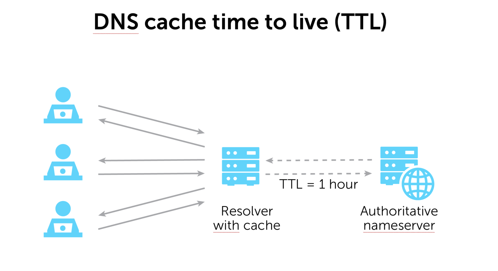

Trong DNS, TTL cho biết một bản ghi DNS được phép lưu trong cache trong bao lâu.

Giá trị TTL thường được tính bằng giây.

Ví dụ:

```text
example.com A 93.184.216.34 TTL 3600
```

Điều này có nghĩa là kết quả DNS có thể được lưu trong cache trong:

```text
3600 giây = 1 giờ
```

Trong thời gian TTL còn hiệu lực, DNS resolver có thể trả lời từ cache mà không cần hỏi lại Authoritative DNS Server.

**Vì sao TTL quan trọng?**

TTL giúp:

- Giảm số lượng truy vấn DNS.
- Tăng tốc độ truy cập website.
- Giảm tải cho DNS server.
- Kiểm soát thời gian cập nhật DNS có hiệu lực.

**TTL cao**

Ưu điểm:

- Giảm tải DNS server.
- Truy vấn nhanh hơn vì dùng cache nhiều hơn.

Nhược điểm:

- Khi đổi IP hoặc thay đổi bản ghi DNS, mất nhiều thời gian hơn để cập nhật trên toàn mạng.

**TTL thấp**

Ưu điểm:

- Thay đổi DNS có hiệu lực nhanh hơn.
- Phù hợp khi chuẩn bị chuyển server hoặc thay đổi hạ tầng.

Nhược điểm:

- Tăng số lượng truy vấn DNS.
- DNS server phải xử lý nhiều yêu cầu hơn.

Ví dụ:

| TTL | Ý nghĩa |
|---:|---|
| 300 | Cache trong 5 phút |
| 600 | Cache trong 10 phút |
| 3600 | Cache trong 1 giờ |
| 86400 | Cache trong 1 ngày |

Tóm lại:

```text
TTL = thời gian bản ghi DNS được lưu trong cache.
```

## 9.10. Công cụ nslookup

**nslookup** là công cụ dòng lệnh dùng để tra cứu thông tin DNS.

Công cụ này giúp kiểm tra tên miền trỏ đến địa chỉ IP nào, hoặc kiểm tra các loại bản ghi DNS như A, AAAA, CNAME, MX và TXT.

Cú pháp cơ bản:

```bash
nslookup <tên_miền>
```

Ví dụ:

```bash
nslookup example.com
```

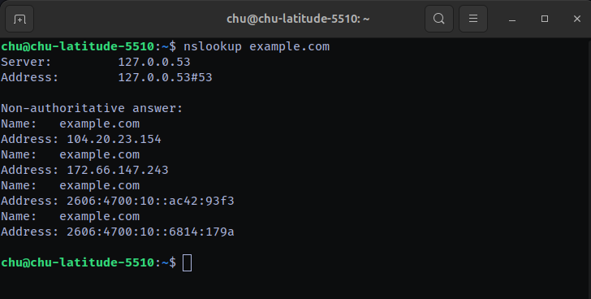

**Tra bản ghi A**

```bash
nslookup -type=A example.com
```

**Tra bản ghi AAAA**

```bash
nslookup -type=AAAA example.com
```

**Tra bản ghi CNAME**

```bash
nslookup -type=CNAME www.example.com
```

**Tra bản ghi MX**

```bash
nslookup -type=MX example.com
```

**Tra bản ghi TXT**

```bash
nslookup -type=TXT example.com
```

Một số thông tin trong kết quả nslookup:

| Thành phần | Ý nghĩa |
|---|---|
| `Server` | DNS server được dùng để tra cứu |
| `Address` | Địa chỉ IP và cổng của DNS server |
| `Non-authoritative answer` | Kết quả được trả về từ cache hoặc resolver không phải authoritative |
| `Name` | Tên miền được tra cứu |
| `Address` | Địa chỉ IP tương ứng |

`nslookup` rất hữu ích khi:

- Kiểm tra tên miền có phân giải đúng không.
- Kiểm tra bản ghi DNS sau khi cấu hình.
- Phân tích lỗi truy cập website.
- Kiểm tra cấu hình email.
- Hỗ trợ điều tra bảo mật và phân tích domain.

Tóm lại:

```text
nslookup = công cụ tra cứu bản ghi DNS từ dòng lệnh.
```

## 9.11. WHOIS

**WHOIS** là hệ thống dùng để tra cứu thông tin đăng ký của một tên miền.

WHOIS không phải là viết tắt. Có thể hiểu đơn giản là câu hỏi:

```text
Who is?
```

nghĩa là:

```text
Ai là người hoặc tổ chức đứng sau tên miền này?
```

Thông tin WHOIS có thể bao gồm:

- Tên miền.
- Nhà đăng ký tên miền.
- Ngày tạo tên miền.
- Ngày cập nhật gần nhất.
- Ngày hết hạn.
- Nameserver.
- Thông tin liên hệ của người đăng ký.
- Thông tin liên hệ kỹ thuật hoặc quản trị.
- Trạng thái tên miền.

Ví dụ dùng lệnh:

```bash
whois example.com
```

Kết quả:

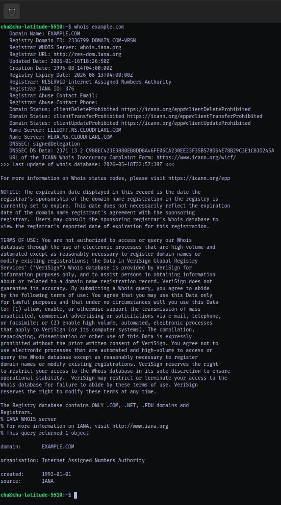

WHOIS hữu ích trong an ninh mạng vì giúp:

- Kiểm tra ai đăng ký tên miền.
- Xác định thời điểm tên miền được tạo.
- Phân tích domain đáng ngờ.
- Điều tra phishing domain.
- Kiểm tra nameserver.
- Tìm thông tin nhà đăng ký.
- Hỗ trợ threat intelligence.

Tuy nhiên, hiện nay nhiều tên miền sử dụng dịch vụ ẩn thông tin WHOIS để bảo vệ quyền riêng tư. Khi đó, thông tin cá nhân của người đăng ký có thể bị ẩn hoặc thay bằng thông tin của dịch vụ bảo vệ quyền riêng tư.

Ví dụ:

```text
Registrant Name: Registration Private
Registrant Organization: Domains By Proxy
```

Điều này không có nghĩa tên miền chắc chắn độc hại. Nó chỉ cho thấy thông tin người đăng ký thật không được công khai trực tiếp.

# 10. HTTP và HTTPS

## 10.1. HTTP là gì?

**HTTP** là viết tắt của **HyperText Transfer Protocol**, nghĩa là **giao thức truyền tải siêu văn bản**.

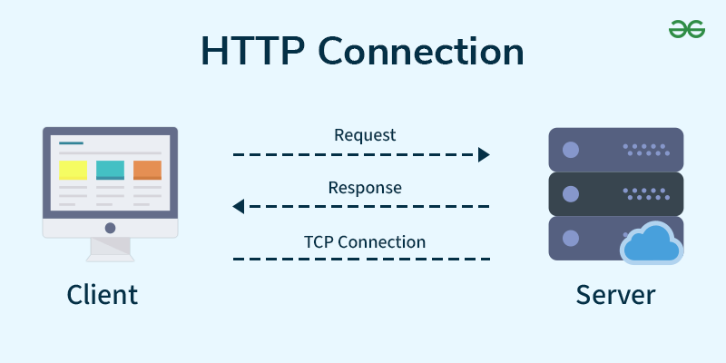

HTTP là giao thức được sử dụng để trình duyệt web giao tiếp với máy chủ web. Khi bạn truy cập một website, trình duyệt sẽ gửi yêu cầu HTTP đến máy chủ. Sau đó, máy chủ phản hồi lại bằng nội dung như HTML, CSS, JavaScript, hình ảnh hoặc dữ liệu khác.

Ví dụ:

```text
Trình duyệt → HTTP Request → Web Server
Trình duyệt ← HTTP Response ← Web Server
```

HTTP hoạt động ở **tầng Application** trong mô hình OSI và TCP/IP. Giao thức này thường sử dụng **TCP port 80**.

Ví dụ khi truy cập:

```text
http://example.com
```

trình duyệt sẽ gửi yêu cầu đến máy chủ web qua giao thức HTTP.

HTTP được dùng để truyền nhiều loại dữ liệu khác nhau:

- Trang HTML.
- Hình ảnh.
- Video.
- File CSS.
- File JavaScript.
- Dữ liệu API.
- File tải xuống.

Một điểm quan trọng là HTTP là giao thức **stateless**. Điều này có nghĩa là mỗi request được xử lý độc lập, server không tự động ghi nhớ request trước đó của người dùng.

Ví dụ:

```text
Request 1: Người dùng mở trang chủ
Request 2: Người dùng mở trang đăng nhập
Request 3: Người dùng mở trang cá nhân
```

Về mặc định, HTTP không tự nhớ rằng ba request này thuộc cùng một người dùng. Vì vậy, website thường dùng **cookies** hoặc **session** để duy trì trạng thái đăng nhập.

Tóm lại:

```text
HTTP = giao thức cho phép trình duyệt và web server trao đổi dữ liệu web.
```

## 10.2. HTTPS là gì?

**HTTPS** là viết tắt của **HyperText Transfer Protocol Secure**.


HTTPS là phiên bản bảo mật của HTTP. Nó sử dụng **TLS** để mã hóa dữ liệu giữa trình duyệt và máy chủ web.

HTTP thông thường gửi dữ liệu dưới dạng rõ ràng, còn HTTPS giúp bảo vệ dữ liệu trong quá trình truyền.

Ví dụ:

```text
HTTP  → dữ liệu có thể bị đọc nếu bị chặn
HTTPS → dữ liệu được mã hóa, khó đọc hơn nếu bị chặn
```

HTTPS thường sử dụng **TCP port 443**.

Ví dụ:

```text
https://example.com
```

**HTTPS bảo vệ điều gì?**

HTTPS giúp bảo vệ ba yếu tố quan trọng:

| Yếu tố | Ý nghĩa |
|---|---|
| Confidentiality | Bảo mật nội dung, người khác khó đọc dữ liệu |
| Integrity | Đảm bảo dữ liệu không bị thay đổi trên đường truyền |
| Authentication | Xác minh người dùng đang kết nối đúng máy chủ |

Ví dụ:

Khi bạn đăng nhập vào một website bằng HTTPS, thông tin như tài khoản và mật khẩu sẽ được mã hóa trước khi gửi qua mạng.

Nếu dùng HTTP, attacker trong cùng mạng có thể sniff traffic và đọc dữ liệu dễ hơn.

**HTTP và HTTPS khác nhau thế nào**

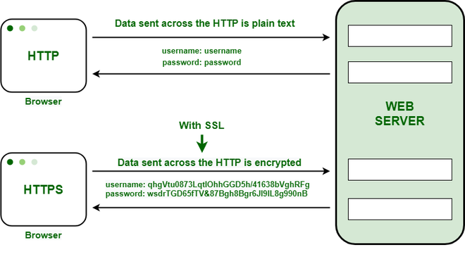

| Tiêu chí | HTTP | HTTPS |
|---|---|---|
| Mã hóa | Không | Có |
| Cổng mặc định | 80 | 443 |
| Bảo mật dữ liệu | Thấp | Cao hơn |
| Chứng chỉ TLS | Không cần | Cần |
| URL bắt đầu bằng | `http://` | `https://` |
| Phù hợp với | Nội dung không nhạy cảm, lab | Website thực tế, đăng nhập, thanh toán |

Tóm lại:

```text
HTTPS = HTTP + TLS, giúp truyền dữ liệu web an toàn hơn.
```

## 10.3. URL là gì?

**URL** là viết tắt của **Uniform Resource Locator**, nghĩa là **định vị tài nguyên thống nhất**.

URL là địa chỉ dùng để xác định vị trí của một tài nguyên trên Internet.

Ví dụ:

```text
https://www.example.com/blog/article?id=10
```

URL có thể trỏ đến:

- Một website.
- Một trang HTML.
- Một hình ảnh.
- Một video.
- Một file PDF.
- Một API endpoint.
- Một tài nguyên trên server.

Ví dụ:

```text
https://example.com
https://example.com/login
https://example.com/images/logo.png
https://api.example.com/users/1
```

Khi người dùng nhập URL vào trình duyệt, trình duyệt sẽ phân tích URL để biết:

- Dùng giao thức nào.
- Kết nối đến tên miền nào.
- Truy cập đường dẫn nào.
- Có tham số nào được gửi kèm không.

Tóm lại:

```text
URL = địa chỉ đầy đủ dùng để truy cập một tài nguyên trên web.
```

**Cấu trúc của URL**

Một URL thường gồm nhiều thành phần khác nhau.

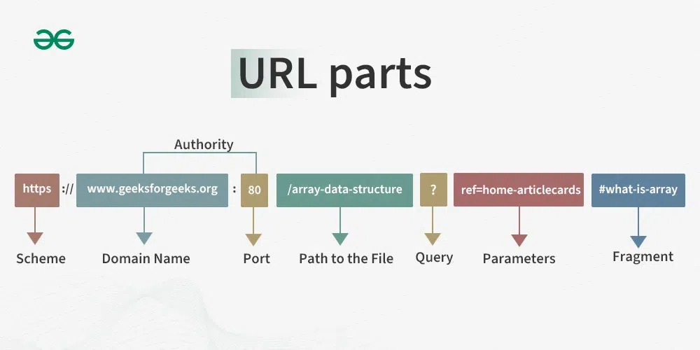

Ví dụ:

```text
https://www.example.com:443/blog/article?id=10#comments
```

Có thể phân tích như sau:

| Thành phần | Ví dụ | Ý nghĩa |
|---|---|---|
| Scheme | `https` | Giao thức được sử dụng |
| Host / Domain | `www.example.com` | Tên miền của máy chủ |
| Port | `443` | Cổng dịch vụ |
| Path | `/blog/article` | Đường dẫn đến tài nguyên |
| Query String | `?id=10` | Tham số gửi kèm request |
| Fragment | `#comments` | Vị trí cụ thể trong trang |

**Scheme**

**Scheme** cho biết giao thức được dùng.

Ví dụ:

```text
http://
https://
ftp://
```

Trong web, phổ biến nhất là `http` và `https`.

**Domain**

**Domain** là tên miền của website.

Ví dụ:

```text
example.com
tryhackme.com
google.com
```

Trình duyệt cần dùng DNS để phân giải domain thành địa chỉ IP.

**Port**

**Port** xác định dịch vụ đang chạy trên server.

Ví dụ:

```text
http://example.com:80
https://example.com:443
```

Nếu không ghi port, trình duyệt sẽ dùng port mặc định:

| Giao thức | Port mặc định |
|---|---:|
| HTTP | 80 |
| HTTPS | 443 |

**Path**

**Path** xác định tài nguyên cụ thể trên server.

Ví dụ:

```text
/login
/blog/article
/images/logo.png
```

**Query String**

**Query String** dùng để gửi tham số đến server.

Ví dụ:

```text
/search?q=network
```

Trong đó:

- `q` là tên tham số.
- `network` là giá trị.

Ví dụ nhiều tham số:

```text
/search?q=network&page=2
```

**Fragment**

**Fragment** thường dùng để chỉ đến một phần cụ thể trong trang web.

Ví dụ:

```text
https://example.com/article#section-2
```

Trình duyệt sẽ mở trang và nhảy đến phần có id là `section-2`.

Tóm lại:

```text
URL = scheme + domain + port + path + query string + fragment.
```

## 10.4. HTTP Request

**HTTP Request** là yêu cầu được client gửi đến server.

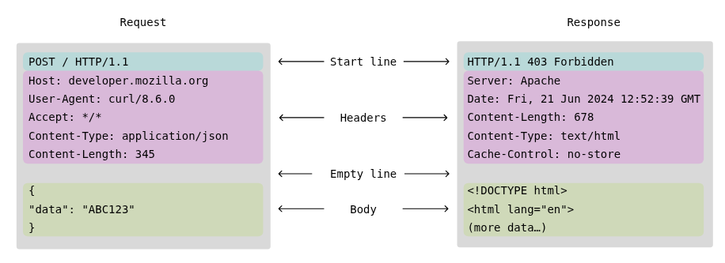

Client thường là:

- Trình duyệt web.
- Ứng dụng mobile.
- Công cụ dòng lệnh như `curl`.
- API client.
- Scanner bảo mật.

Server thường là:
png
- Web server.
- API server.
- Reverse proxy.
- Application server.

Ví dụ một HTTP Request:

```http
GET / HTTP/1.1
Host: example.com
User-Agent: Mozilla/5.0
Accept: text/html
```

Request trên có nghĩa là client muốn lấy trang chủ `/` từ website `example.com`.

Một HTTP Request thường gồm:

| Thành phần | Ý nghĩa |
|---|---|
| Request Line | Dòng đầu tiên, chứa method, path và phiên bản HTTP |
| Headers | Các thông tin bổ sung về request |
| Blank Line | Dòng trống báo hiệu kết thúc headers |
| Body | Dữ liệu gửi kèm, thường dùng với POST hoặc PUT |

Ví dụ request có body:

```http
POST /login HTTP/1.1
Host: example.com
Content-Type: application/x-www-form-urlencoded
Content-Length: 29

username=admin&password=123456
```

Trong ví dụ này:

- Method là `POST`.
- Path là `/login`.
- Dữ liệu đăng nhập nằm trong body.
- `Content-Type` cho biết kiểu dữ liệu gửi lên server.

HTTP Request rất quan trọng trong an ninh web, vì nhiều tấn công như SQL Injection, XSS, brute force hoặc directory enumeration đều bắt đầu từ việc gửi request đến server.

## 10.5. HTTP Response

**HTTP Response** là phản hồi được server gửi về cho client sau khi nhận và xử lý HTTP Request.


Ví dụ một HTTP Response:

```http
HTTP/1.1 200 OK
Server: nginx
Content-Type: text/html
Content-Length: 56

<html>
  <body>Hello, world!</body>
</html>
```

Một HTTP Response thường gồm:

| Thành phần | Ý nghĩa |
|---|---|
| Status Line | Chứa phiên bản HTTP, status code và thông báo |
| Headers | Thông tin bổ sung về response |
| Blank Line | Dòng trống báo hiệu kết thúc headers |
| Body | Nội dung trả về cho client |

Trong ví dụ trên:

- `HTTP/1.1` là phiên bản HTTP.
- `200 OK` nghĩa là request thành công.
- `Server: nginx` cho biết phần mềm web server.
- `Content-Type: text/html` cho biết nội dung trả về là HTML.
- Phần body là nội dung trang web.

Một response có thể trả về nhiều loại nội dung:

| Content-Type | Ý nghĩa |
|---|---|
| `text/html` | Trang HTML |
| `text/plain` | Văn bản thường |
| `application/json` | Dữ liệu JSON |
| `image/png` | Hình ảnh PNG |
| `application/pdf` | File PDF |
| `text/css` | File CSS |
| `application/javascript` | File JavaScript |

Ví dụ response JSON:

```http
HTTP/1.1 200 OK
Content-Type: application/json

{
  "username": "admin",
  "role": "user"
}
```

Trong kiểm thử bảo mật web, việc đọc HTTP Response giúp xác định:

- Request có thành công không.
- Server trả về lỗi gì.
- Có thông tin nhạy cảm bị lộ không.
- Có header bảo mật nào bị thiếu không.
- Ứng dụng phản hồi khác nhau thế nào với từng input.

## 10.6. HTTP Methods

**HTTP Methods** là các phương thức cho biết client muốn thực hiện hành động gì với tài nguyên trên server.

Một số HTTP methods phổ biến:

| Method | Mục đích |
|---|---|
| GET | Lấy dữ liệu từ server |
| POST | Gửi dữ liệu mới lên server |
| PUT | Cập nhật hoặc ghi đè tài nguyên |
| DELETE | Xóa tài nguyên |
| PATCH | Cập nhật một phần tài nguyên |
| HEAD | Lấy header giống GET nhưng không lấy body |
| OPTIONS | Xem các method được server hỗ trợ |

Ví dụ:

```http
GET /products HTTP/1.1
```

nghĩa là lấy danh sách sản phẩm.

```http
POST /login HTTP/1.1
```

nghĩa là gửi dữ liệu đăng nhập.

```http
DELETE /user/10 HTTP/1.1
```

nghĩa là yêu cầu xóa user có id là `10`.

Trong an ninh web, cần chú ý các method được bật trên server. Nếu server cho phép các method nguy hiểm không cần thiết, attacker có thể lợi dụng để sửa hoặc xóa dữ liệu.

Ví dụ rủi ro:

```text
PUT /shell.php
DELETE /important-file
```

Tóm lại:

```text
HTTP Methods = hành động mà client muốn thực hiện với tài nguyên trên server.
```

### 10.6.1. GET

**GET** là HTTP method dùng để lấy dữ liệu từ server.

GET thường được dùng khi:

- Mở một trang web.
- Tải hình ảnh.
- Lấy dữ liệu từ API.
- Tìm kiếm thông tin.
- Truy cập tài nguyên tĩnh.

Ví dụ:

```http
GET / HTTP/1.1
Host: example.com
```

Ví dụ GET với query string:

```http
GET /search?q=network HTTP/1.1
Host: example.com
```

Trong ví dụ này:

- Path là `/search`.
- Tham số là `q=network`.

Đặc điểm của GET:

| Đặc điểm | Mô tả |
|---|---|
| Dùng để lấy dữ liệu | Có |
| Có body không? | Thường không |
| Dữ liệu có thể nằm trong URL | Có |
| Có thể bookmark | Có |
| Có thể bị lưu trong lịch sử trình duyệt | Có |

Ví dụ URL chứa tham số:

```text
https://example.com/search?q=network
```

Lưu ý bảo mật:

Không nên gửi thông tin nhạy cảm bằng GET, ví dụ:

```text
https://example.com/login?username=admin&password=123456
```

Lý do:

- URL có thể bị lưu trong browser history.
- URL có thể xuất hiện trong log server.
- URL có thể bị lộ qua Referer header.
- URL dễ bị nhìn thấy hơn so với request body.

Tóm lại:

```text
GET = lấy dữ liệu từ server, không nên dùng để gửi thông tin nhạy cảm.
```

### 10.6.2. POST

**POST** là HTTP method dùng để gửi dữ liệu lên server.

POST thường được dùng khi:

- Đăng nhập.
- Đăng ký tài khoản.
- Gửi form.
- Upload file.
- Gửi dữ liệu đến API.
- Tạo tài nguyên mới.

Ví dụ POST đăng nhập:

```http
POST /login HTTP/1.1
Host: example.com
Content-Type: application/x-www-form-urlencoded

username=admin&password=123456
```

Ví dụ POST gửi JSON:

```http
POST /api/users HTTP/1.1
Host: example.com
Content-Type: application/json

{
  "username": "alice",
  "email": "alice@example.com"
}
```

Đặc điểm của POST:

| Đặc điểm | Mô tả |
|---|---|
| Dùng để gửi dữ liệu | Có |
| Dữ liệu nằm trong body | Thường có |
| Phù hợp với form đăng nhập | Có |
| Có thể tạo tài nguyên mới | Có |
| Dữ liệu có hiện trực tiếp trên URL không? | Không |

POST an toàn hơn GET trong việc gửi dữ liệu nhạy cảm vì dữ liệu không nằm trực tiếp trên URL. Tuy nhiên, nếu dùng HTTP thay vì HTTPS, dữ liệu POST vẫn có thể bị đọc khi bị chặn trên mạng.

Lưu ý:

```text
POST không tự động bảo mật dữ liệu.
Muốn bảo vệ dữ liệu khi truyền qua mạng, cần dùng HTTPS.
```

Tóm lại:

```text
POST = gửi dữ liệu lên server, thường dùng cho form, login và API.
```

### 10.6.3. PUT

**PUT** là HTTP method thường dùng để tạo mới hoặc cập nhật toàn bộ một tài nguyên trên server.

Ví dụ:

```http
PUT /api/users/10 HTTP/1.1
Host: example.com
Content-Type: application/json

{
  "username": "alice",
  "email": "alice@example.com",
  "role": "user"
}
```

Request trên có thể được hiểu là cập nhật thông tin user có id là `10`.

Đặc điểm của PUT:

| Đặc điểm | Mô tả |
|---|---|
| Dùng để cập nhật | Có |
| Có thể tạo tài nguyên mới | Có, tùy thiết kế API |
| Thường gửi dữ liệu trong body | Có |
| Thường thay thế toàn bộ tài nguyên | Có |

So sánh đơn giản:

```text
POST = gửi dữ liệu để server xử lý hoặc tạo mới tài nguyên.
PUT  = cập nhật hoặc thay thế tài nguyên tại một vị trí cụ thể.
```

Ví dụ:

```http
PUT /profile HTTP/1.1
```

có thể dùng để cập nhật toàn bộ thông tin hồ sơ người dùng.

**Rủi ro bảo mật của PUT**

Nếu server cấu hình sai và cho phép PUT tùy ý, attacker có thể upload file độc hại lên server.

Ví dụ nguy hiểm:

```http
PUT /shell.php HTTP/1.1
Host: vulnerable-site.com
```

Vì vậy, trong môi trường production, cần kiểm soát chặt chẽ method PUT.

Tóm lại:

```text
PUT = tạo hoặc cập nhật toàn bộ tài nguyên trên server.
```

### 10.6.4. DELETE

**DELETE** là HTTP method dùng để yêu cầu xóa tài nguyên trên server.

Ví dụ:

```http
DELETE /api/users/10 HTTP/1.1
Host: example.com
```

Request trên có thể được hiểu là yêu cầu xóa user có id là `10`.

DELETE thường được dùng trong API, đặc biệt là REST API.

Ví dụ:

| Method | Endpoint | Ý nghĩa |
|---|---|---|
| GET | `/api/users/10` | Lấy thông tin user 10 |
| POST | `/api/users` | Tạo user mới |
| PUT | `/api/users/10` | Cập nhật user 10 |
| DELETE | `/api/users/10` | Xóa user 10 |

**Rủi ro bảo mật của DELETE**

DELETE có thể rất nguy hiểm nếu không kiểm soát quyền truy cập đúng cách.

Ví dụ:

```http
DELETE /api/users/1 HTTP/1.1
```

Nếu user thường có thể gửi request này và xóa tài khoản admin, đó là lỗi phân quyền nghiêm trọng.

Các lỗi liên quan:

- Broken Access Control.
- IDOR.
- Thiếu xác thực.
- Thiếu kiểm tra quyền.
- CSRF nếu không có bảo vệ phù hợp.

Khuyến nghị:

- Chỉ cho phép người có quyền mới được dùng DELETE.
- Kiểm tra quyền ở phía server.
- Ghi log các thao tác xóa.
- Cẩn thận với API public.
- Có cơ chế xác nhận với thao tác quan trọng.

Tóm lại:

```text
DELETE = yêu cầu xóa tài nguyên trên server.
```

## 10.7. HTTP Status Codes

**HTTP Status Codes** là các mã trạng thái được server trả về để cho client biết kết quả xử lý request.

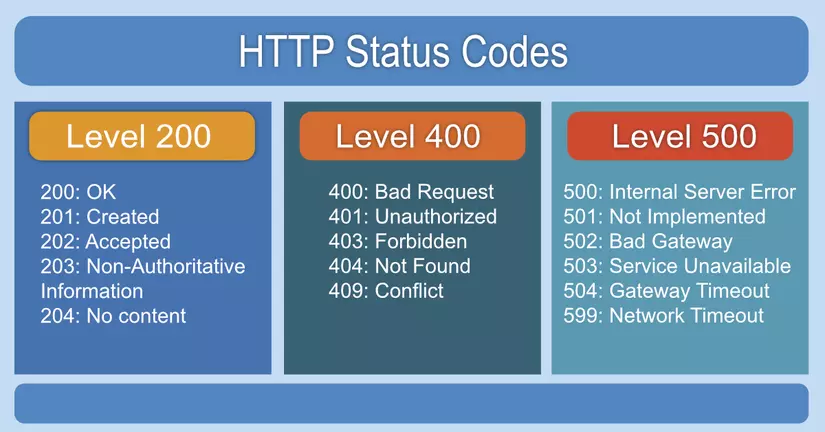

Ví dụ:

```http
HTTP/1.1 200 OK
```

Trong đó:

- `200` là status code.
- `OK` là mô tả ngắn.
- Ý nghĩa: request đã thành công.

Status code giúp client biết:

- Request có thành công không.
- Có cần chuyển hướng không.
- Lỗi thuộc phía client hay server.
- Người dùng có quyền truy cập tài nguyên không.
- Tài nguyên có tồn tại không.

Các nhóm status code chính:

| Nhóm mã | Tên nhóm | Ý nghĩa |
|---|---|---|
| 1xx | Informational | Thông tin tạm thời |
| 2xx | Success | Request thành công |
| 3xx | Redirection | Chuyển hướng |
| 4xx | Client Error | Lỗi từ phía client |
| 5xx | Server Error | Lỗi từ phía server |

Ví dụ phổ biến:

| Mã | Tên | Ý nghĩa |
|---:|---|---|
| 200 | OK | Request thành công |
| 201 | Created | Tài nguyên đã được tạo |
| 301 | Moved Permanently | Chuyển hướng vĩnh viễn |
| 302 | Found | Chuyển hướng tạm thời |
| 400 | Bad Request | Request không hợp lệ |
| 401 | Unauthorized | Chưa xác thực |
| 403 | Forbidden | Không có quyền truy cập |
| 404 | Not Found | Không tìm thấy tài nguyên |
| 405 | Method Not Allowed | Method không được phép |
| 500 | Internal Server Error | Lỗi bên trong server |
| 502 | Bad Gateway | Gateway nhận phản hồi không hợp lệ |
| 503 | Service Unavailable | Dịch vụ không khả dụng |

Trong phân tích bảo mật web, status code giúp nhận biết phản ứng của ứng dụng với từng request.

Ví dụ:

```text
200 → Trang tồn tại
301/302 → Có chuyển hướng
401/403 → Bị hạn chế quyền
404 → Không tìm thấy
500 → Server có lỗi xử lý
```

### 10.7.1. Nhóm mã 1xx

**Nhóm mã 1xx** là nhóm mã thông tin tạm thời.

Các mã này cho biết server đã nhận request và quá trình xử lý vẫn đang tiếp tục.

Nhóm 1xx ít được người dùng nhìn thấy trực tiếp, nhưng vẫn quan trọng trong giao tiếp HTTP.

Ví dụ:

| Mã | Tên | Ý nghĩa |
|---:|---|---|
| 100 | Continue | Client có thể tiếp tục gửi phần còn lại của request |
| 101 | Switching Protocols | Server đồng ý chuyển sang giao thức khác |
| 102 | Processing | Server đang xử lý request |

Ví dụ:

```http
HTTP/1.1 100 Continue
```

Mã `100 Continue` thường dùng khi client muốn gửi body lớn. Server có thể phản hồi rằng client được phép tiếp tục gửi dữ liệu.

Tóm lại:

```text
1xx = thông tin tạm thời, request đang được xử lý.
```

### 10.7.2. Nhóm mã 2xx

**Nhóm mã 2xx** cho biết request đã được xử lý thành công.

Đây là nhóm status code thường mong muốn khi gửi request hợp lệ.

Một số mã phổ biến:

| Mã | Tên | Ý nghĩa |
|---:|---|---|
| 200 | OK | Request thành công |
| 201 | Created | Tài nguyên mới đã được tạo |
| 202 | Accepted | Request đã được nhận nhưng chưa xử lý xong |
| 204 | No Content | Thành công nhưng không có nội dung trả về |

Ví dụ:

```http
HTTP/1.1 200 OK
```

Mã `200 OK` thường gặp khi truy cập website thành công.

Ví dụ khi tạo tài khoản mới qua API:

```http
HTTP/1.1 201 Created
```

Mã `201 Created` cho biết tài nguyên mới đã được tạo.

Ví dụ khi xóa thành công nhưng không trả body:

```http
HTTP/1.1 204 No Content
```

Tóm lại:

```text
2xx = request thành công.
```

### 10.7.3. Nhóm mã 3xx

**Nhóm mã 3xx** dùng cho chuyển hướng.

Khi server trả về mã 3xx, client thường cần truy cập một URL khác để tiếp tục.

Một số mã phổ biến:

| Mã | Tên | Ý nghĩa |
|---:|---|---|
| 301 | Moved Permanently | Tài nguyên đã chuyển vĩnh viễn |
| 302 | Found | Chuyển hướng tạm thời |
| 304 | Not Modified | Tài nguyên chưa thay đổi, có thể dùng cache |
| 307 | Temporary Redirect | Chuyển hướng tạm thời, giữ nguyên method |
| 308 | Permanent Redirect | Chuyển hướng vĩnh viễn, giữ nguyên method |

Ví dụ response chuyển hướng:

```http
HTTP/1.1 301 Moved Permanently
Location: https://example.com/
```

Trong ví dụ này, server yêu cầu client chuyển sang URL mới trong header `Location`.

Ví dụ thường gặp:

```text
http://example.com → https://example.com
```

Website có thể dùng 301 hoặc 302 để chuyển người dùng từ HTTP sang HTTPS.

Trong kiểm thử bảo mật, chuyển hướng cần được kiểm tra cẩn thận vì có thể xuất hiện lỗi **Open Redirect**.

Ví dụ nguy hiểm:

```text
https://example.com/redirect?url=https://evil.com
```

Tóm lại:

```text
3xx = chuyển hướng client đến vị trí khác.
```

### 10.7.4. Nhóm mã 4xx

**Nhóm mã 4xx** cho biết lỗi đến từ phía client.

Điều này có nghĩa là request do client gửi có vấn đề, ví dụ sai cú pháp, thiếu quyền hoặc tài nguyên không tồn tại.

Một số mã phổ biến:

| Mã | Tên | Ý nghĩa |
|---:|---|---|
| 400 | Bad Request | Request không hợp lệ |
| 401 | Unauthorized | Chưa xác thực |
| 403 | Forbidden | Không có quyền truy cập |
| 404 | Not Found | Không tìm thấy tài nguyên |
| 405 | Method Not Allowed | Method không được phép |
| 429 | Too Many Requests | Gửi quá nhiều request |

Ví dụ:

```http
HTTP/1.1 404 Not Found
```

Mã `404` nghĩa là server không tìm thấy tài nguyên được yêu cầu.

So sánh `401` và `403`:

| Mã | Ý nghĩa |
|---:|---|
| 401 | Bạn chưa đăng nhập hoặc chưa xác thực |
| 403 | Bạn đã được nhận diện nhưng không có quyền truy cập |

Ví dụ:

```text
401 → Cần đăng nhập
403 → Đã đăng nhập nhưng không đủ quyền
```

Trong an ninh web, mã 4xx rất quan trọng khi kiểm tra quyền truy cập.

Ví dụ:

```text
/admin → 403 Forbidden
/secret-backup.zip → 404 Not Found
/api/users/1 → 401 Unauthorized
```

Tóm lại:

```text
4xx = lỗi từ phía client hoặc request không được phép.
```

### 10.7.5. Nhóm mã 5xx

**Nhóm mã 5xx** cho biết lỗi xảy ra ở phía server.

Điều này có nghĩa là request có thể đã được gửi đến server, nhưng server không xử lý được do lỗi nội bộ hoặc lỗi hạ tầng.

Một số mã phổ biến:

| Mã | Tên | Ý nghĩa |
|---:|---|---|
| 500 | Internal Server Error | Lỗi nội bộ server |
| 501 | Not Implemented | Server không hỗ trợ chức năng được yêu cầu |
| 502 | Bad Gateway | Gateway/proxy nhận phản hồi không hợp lệ |
| 503 | Service Unavailable | Dịch vụ tạm thời không khả dụng |
| 504 | Gateway Timeout | Gateway/proxy chờ quá lâu mà không nhận phản hồi |

Ví dụ:

```http
HTTP/1.1 500 Internal Server Error
```

Mã `500` thường cho thấy ứng dụng phía server gặp lỗi khi xử lý request.

Ví dụ nguyên nhân:

- Lỗi code backend.
- Lỗi kết nối database.
- Lỗi cấu hình server.
- Server quá tải.
- Dịch vụ phụ thuộc không hoạt động.

Trong kiểm thử bảo mật, mã 5xx có thể là dấu hiệu ứng dụng xử lý input không tốt.

Ví dụ:

```text
?id='
→ 500 Internal Server Error
```

Nếu input đặc biệt gây lỗi server, có thể cần kiểm tra thêm các lỗ hổng như SQL Injection, command injection hoặc lỗi xử lý dữ liệu.

Tóm lại:

```text
5xx = lỗi từ phía server hoặc hạ tầng backend.
```

## 10.8. HTTP Headers

**HTTP Headers** là các dòng thông tin bổ sung trong HTTP Request hoặc HTTP Response.

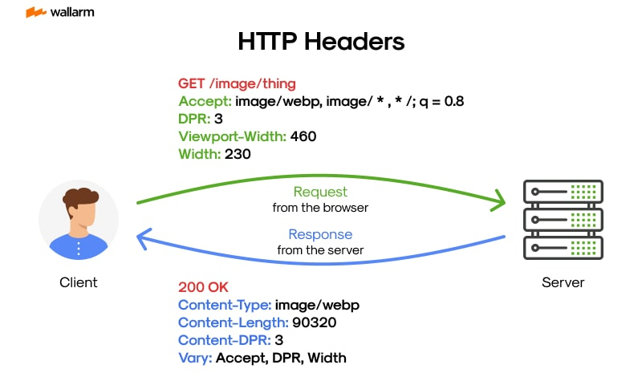

Headers giúp client và server trao đổi thêm thông tin về request, response, định dạng dữ liệu, xác thực, cookie, cache và bảo mật.

Ví dụ request headers:

```http
GET / HTTP/1.1
Host: example.com
User-Agent: Mozilla/5.0
Accept: text/html
Cookie: sessionid=abc123
```

Ví dụ response headers:

```http
HTTP/1.1 200 OK
Server: nginx
Content-Type: text/html
Set-Cookie: sessionid=abc123; HttpOnly
```

**Header trong HTTP Request**

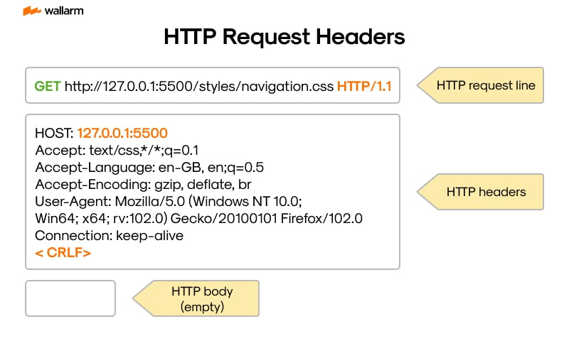

Một số request headers phổ biến:

| Header | Ý nghĩa |
|---|---|
| Host | Tên miền mà client muốn truy cập |
| User-Agent | Thông tin trình duyệt hoặc công cụ gửi request |
| Accept | Loại dữ liệu client có thể nhận |
| Authorization | Thông tin xác thực |
| Cookie | Cookie client gửi lên server |
| Referer | Trang trước đó dẫn đến request hiện tại |
| Content-Type | Kiểu dữ liệu gửi trong body |
| Content-Length | Độ dài dữ liệu gửi trong body |

Ví dụ:

```http
User-Agent: Mozilla/5.0
```

Header này cho server biết client đang dùng trình duyệt hoặc công cụ nào.

**Header trong HTTP Response**

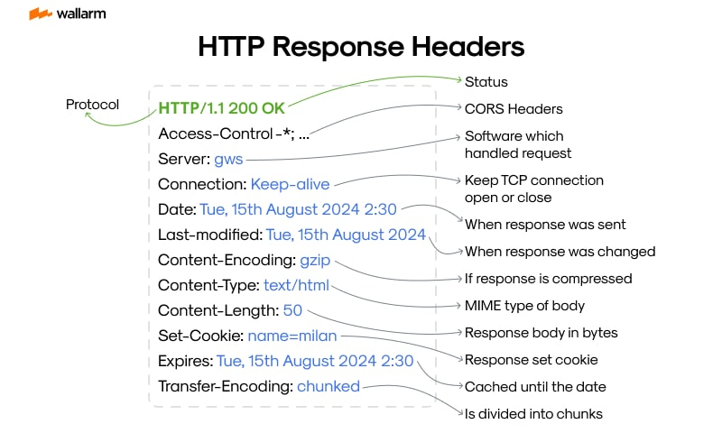

Một số response headers phổ biến:

| Header | Ý nghĩa |
|---|---|
| Server | Thông tin web server |
| Date | Thời gian server tạo response |
| Content-Type | Kiểu nội dung trả về |
| Content-Length | Độ dài nội dung trả về |
| Set-Cookie | Yêu cầu trình duyệt lưu cookie |
| Location | URL chuyển hướng |
| Cache-Control | Chính sách cache |
| Strict-Transport-Security | Bắt buộc dùng HTTPS |
| X-Frame-Options | Giảm nguy cơ clickjacking |
| Content-Security-Policy | Giảm rủi ro XSS và kiểm soát nguồn tài nguyên |

Ví dụ header bảo mật:

```http
Strict-Transport-Security: max-age=31536000; includeSubDomains
X-Frame-Options: DENY
Content-Security-Policy: default-src 'self'
```

## 10.9. Cookies

**Cookies** là các mẩu dữ liệu nhỏ mà website lưu trên trình duyệt của người dùng.

Vì HTTP là giao thức stateless, cookies giúp website ghi nhớ thông tin giữa nhiều request khác nhau.

Ví dụ:

```text
Request 1: Người dùng đăng nhập
Server gửi cookie session
Request 2: Người dùng mở trang cá nhân
Trình duyệt gửi lại cookie
Server biết người dùng là ai
```

**Cookie được tạo như thế nào?**

Server có thể yêu cầu trình duyệt lưu cookie bằng header `Set-Cookie`.

Ví dụ response:

```http
HTTP/1.1 200 OK
Set-Cookie: sessionid=abc123; HttpOnly; Secure
```

Sau đó, trình duyệt sẽ gửi cookie này trong các request tiếp theo:

```http
GET /profile HTTP/1.1
Host: example.com
Cookie: sessionid=abc123
```

**Cookie dùng để làm gì?**

Cookies thường được dùng cho:

- Duy trì phiên đăng nhập.
- Ghi nhớ tùy chọn người dùng.
- Lưu giỏ hàng.
- Theo dõi phiên làm việc.
- Phân tích hành vi người dùng.
- Chống CSRF trong một số cơ chế.

Ví dụ:

| Cookie | Mục đích |
|---|---|
| `sessionid` | Xác định phiên đăng nhập |
| `theme=dark` | Lưu giao diện tối |
| `cart_id=123` | Lưu giỏ hàng |
| `csrf_token=xyz` | Hỗ trợ chống CSRF |

**Các thuộc tính bảo mật của Cookie**

| Thuộc tính | Ý nghĩa |
|---|---|
| HttpOnly | JavaScript không đọc được cookie |
| Secure | Cookie chỉ gửi qua HTTPS |
| SameSite | Giới hạn gửi cookie trong request cross-site |
| Expires | Thời điểm cookie hết hạn |
| Max-Age | Thời gian sống của cookie |
| Path | Cookie chỉ áp dụng cho đường dẫn cụ thể |
| Domain | Cookie áp dụng cho domain cụ thể |

Ví dụ cookie an toàn hơn:

```http
Set-Cookie: sessionid=abc123; HttpOnly; Secure; SameSite=Strict
```

Ý nghĩa:

- `HttpOnly`: giảm nguy cơ cookie bị đánh cắp qua XSS.
- `Secure`: chỉ gửi cookie qua HTTPS.
- `SameSite=Strict`: giảm nguy cơ CSRF.

**Rủi ro bảo mật liên quan đến Cookie**

Cookies rất quan trọng trong bảo mật web vì chúng thường liên quan đến phiên đăng nhập.

Một số rủi ro:

- Cookie không có `HttpOnly` có thể bị đọc bằng JavaScript nếu có XSS.
- Cookie không có `Secure` có thể bị gửi qua HTTP.
- Cookie session bị đánh cắp có thể dẫn đến chiếm phiên đăng nhập.
- Cookie cấu hình sai có thể làm tăng nguy cơ CSRF.
- Session ID yếu có thể bị đoán hoặc brute force.

Ví dụ nguy hiểm:

```http
Set-Cookie: sessionid=abc123
```

Cookie này chưa có các thuộc tính bảo mật như `HttpOnly`, `Secure` hoặc `SameSite`.

Ví dụ tốt hơn:

```http
Set-Cookie: sessionid=abc123; HttpOnly; Secure; SameSite=Lax
```

Tóm lại:

```text
Cookies = dữ liệu nhỏ giúp website ghi nhớ người dùng giữa nhiều request.
```

# 11. Cách website hoạt động

## 11.1. Website hoạt động như thế nào?

**Website** là một tập hợp các trang web, tài nguyên và chức năng được lưu trữ trên máy chủ web, sau đó được truy cập thông qua trình duyệt.

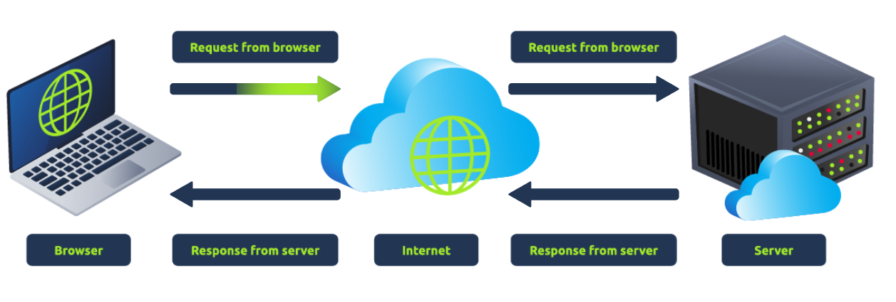

Khi người dùng truy cập một website, trình duyệt sẽ gửi yêu cầu đến máy chủ. Máy chủ xử lý yêu cầu đó và trả về dữ liệu để trình duyệt hiển thị thành giao diện mà người dùng nhìn thấy.

Quy trình đơn giản:

```text
Người dùng nhập URL
→ Trình duyệt gửi request
→ Web server nhận và xử lý request
→ Server trả về response
→ Trình duyệt hiển thị trang web
```

Ví dụ khi truy cập:

```text
https://example.com
```

quá trình có thể diễn ra như sau:

```text
1. Trình duyệt kiểm tra URL
2. DNS phân giải tên miền thành địa chỉ IP
3. Trình duyệt thiết lập kết nối đến web server
4. Trình duyệt gửi HTTP/HTTPS request
5. Web server xử lý request
6. Server trả về HTML, CSS, JavaScript, hình ảnh...
7. Trình duyệt render nội dung thành trang web
```

Một website thường gồm hai phần chính:

| Thành phần | Vai trò |
|---|---|
| **Frontend** | Phần người dùng nhìn thấy và tương tác trên trình duyệt |
| **Backend** | Phần xử lý logic, dữ liệu và giao tiếp với database ở phía server |

Ví dụ:

```text
Frontend: trang đăng nhập, nút bấm, form nhập dữ liệu
Backend: kiểm tra tài khoản, xử lý mật khẩu, truy vấn database
```

Tóm lại:

```text
Website hoạt động dựa trên sự phối hợp giữa trình duyệt, web server, frontend, backend và các dịch vụ hỗ trợ như DNS, database, CDN, WAF.
```

## 11.2. Frontend

**Frontend** là phần giao diện của website mà người dùng trực tiếp nhìn thấy và tương tác thông qua trình duyệt.

Frontend còn được gọi là **client-side**, vì phần này chạy chủ yếu ở phía client, tức là trên trình duyệt của người dùng.

Ví dụ các thành phần frontend:

- Trang chủ.
- Form đăng nhập.
- Nút bấm.
- Menu điều hướng.
- Hình ảnh.
- Bảng dữ liệu.
- Biểu mẫu tìm kiếm.
- Giao diện người dùng.

Frontend thường được xây dựng bằng ba công nghệ chính:

| Công nghệ | Vai trò |
|---|---|
| **HTML** | Xây dựng cấu trúc trang web |
| **CSS** | Trang trí và định dạng giao diện |
| **JavaScript** | Tạo tính tương tác và xử lý logic phía trình duyệt |

Ví dụ:

```text
HTML tạo nút bấm
CSS làm nút có màu đẹp hơn
JavaScript xử lý sự kiện khi người dùng nhấn nút
```

Frontend có nhiệm vụ:

- Hiển thị nội dung cho người dùng.
- Nhận dữ liệu người dùng nhập vào.
- Gửi request đến backend.
- Hiển thị kết quả từ server.
- Tạo trải nghiệm người dùng tốt hơn.

Trong an ninh web, frontend cũng là nơi cần kiểm tra kỹ vì đôi khi developer để lộ thông tin nhạy cảm trong mã HTML, CSS hoặc JavaScript.

Ví dụ lỗi thường gặp:

```html
<!-- TODO: remove test credentials admin:password123 -->
```

## 11.3. Backend

**Backend** là phần xử lý phía sau của website, chạy trên máy chủ.

Nếu frontend là phần người dùng nhìn thấy, thì backend là phần xử lý logic mà người dùng thường không thấy trực tiếp.

Backend còn được gọi là **server-side**.

Backend có thể thực hiện các nhiệm vụ như:

- Xử lý đăng nhập.
- Kiểm tra quyền truy cập.
- Truy vấn cơ sở dữ liệu.
- Xử lý thanh toán.
- Lưu thông tin người dùng.
- Gửi email.
- Tạo nội dung động.
- Xử lý API request.

Ví dụ:

Khi người dùng đăng nhập:

```text
1. Người dùng nhập username và password ở frontend
2. Frontend gửi dữ liệu đến backend
3. Backend kiểm tra thông tin trong database
4. Nếu đúng, backend tạo session hoặc token
5. Website cho phép người dùng truy cập tài khoản
```

Một số ngôn ngữ và framework backend phổ biến:

| Ngôn ngữ | Ví dụ framework |
|---|---|
| Python | Django, Flask, FastAPI |
| JavaScript | Node.js, Express.js |
| PHP | Laravel |
| Java | Spring |
| Ruby | Ruby on Rails |
| Go | Gin, Echo |

Backend thường giao tiếp với:

- Database.
- File system.
- API bên ngoài.
- Authentication service.
- Payment gateway.
- Message queue.
- Logging system.

Trong an ninh mạng, backend rất quan trọng vì nhiều lỗi nghiêm trọng xuất hiện ở đây, ví dụ:

- SQL Injection.
- Broken Access Control.
- Command Injection.
- Authentication Bypass.
- Insecure Deserialization.
- Server-Side Request Forgery.

## 11.4. HTML

**HTML** là viết tắt của **HyperText Markup Language**.

HTML là ngôn ngữ đánh dấu dùng để xây dựng cấu trúc của trang web. Nó cho trình duyệt biết nội dung nào là tiêu đề, đoạn văn, hình ảnh, liên kết, bảng, form hoặc nút bấm.

Ví dụ một trang HTML đơn giản:

```html
<!DOCTYPE html>
<html>
  <head>
    <title>Trang web đầu tiên</title>
  </head>
  <body>
    <h1>Xin chào!</h1>
    <p>Đây là một đoạn văn bản.</p>
  </body>
</html>
```

Một số thẻ HTML phổ biến:

| Thẻ | Ý nghĩa |
|---|---|
| `<html>` | Bao toàn bộ tài liệu HTML |
| `<head>` | Chứa thông tin metadata của trang |
| `<title>` | Tiêu đề hiển thị trên tab trình duyệt |
| `<body>` | Nội dung chính hiển thị cho người dùng |
| `<h1>` đến `<h6>` | Tiêu đề |
| `<p>` | Đoạn văn |
| `<a>` | Liên kết |
| `` | Hình ảnh |
| `<form>` | Biểu mẫu |
| `<input>` | Ô nhập dữ liệu |
| `<button>` | Nút bấm |

Ví dụ liên kết:

```html
<a href="https://example.com">Truy cập website</a>
```

Ví dụ form đăng nhập:

```html
<form action="/login" method="POST">
  <input type="text" name="username">
  <input type="password" name="password">
  <button type="submit">Login</button>
</form>
```

Trong bảo mật web, HTML cần được xử lý cẩn thận vì nếu website hiển thị trực tiếp dữ liệu người dùng nhập vào mà không lọc, attacker có thể chèn mã HTML hoặc JavaScript độc hại.


## 11.5. CSS

**CSS** là viết tắt của **Cascading Style Sheets**.

CSS được dùng để định dạng và trang trí giao diện website. Nếu HTML tạo cấu trúc, thì CSS làm cho trang web đẹp hơn và dễ sử dụng hơn.

CSS có thể điều chỉnh:

- Màu sắc.
- Font chữ.
- Kích thước chữ.
- Khoảng cách.
- Bố cục.
- Đường viền.
- Hiệu ứng hover.
- Responsive layout cho mobile.

Ví dụ CSS đơn giản:

```css
body {
  font-family: Arial, sans-serif;
  background-color: #f4f4f4;
}

h1 {
  color: blue;
}

button {
  padding: 10px;
  border-radius: 5px;
}
```

HTML kết hợp với CSS:

```html
<h1 class="title">Xin chào!</h1>
```

```css
.title {
  color: red;
  font-size: 32px;
}
```

CSS có thể được thêm vào trang web theo ba cách:

| Cách dùng CSS | Mô tả |
|---|---|
| Inline CSS | Viết trực tiếp trong thẻ HTML |
| Internal CSS | Viết trong thẻ `<style>` |
| External CSS | Viết trong file `.css` riêng |

Ví dụ external CSS:

```html
<link rel="stylesheet" href="/style.css">
```

Trong thực tế, CSS thường được lưu trong file riêng để dễ quản lý.

Tóm lại:

```text
CSS = ngôn ngữ dùng để định dạng và làm đẹp giao diện website.
```

## 11.6. JavaScript

**JavaScript** là ngôn ngữ lập trình dùng để tạo tính tương tác cho website.

Nếu HTML tạo cấu trúc và CSS tạo giao diện, thì JavaScript giúp website có hành vi động.

JavaScript có thể dùng để:

- Xử lý khi người dùng bấm nút.
- Kiểm tra dữ liệu trong form.
- Gửi request đến backend.
- Cập nhật nội dung trang mà không cần tải lại.
- Tạo hiệu ứng động.
- Xử lý menu, popup, slider.
- Tương tác với API.

Ví dụ JavaScript đơn giản:

```html
<button onclick="sayHello()">Click me</button>

<script>
function sayHello() {
  alert("Xin chào!");
}
</script>
```

Ví dụ thay đổi nội dung HTML bằng JavaScript:

```html
<p id="demo">Nội dung ban đầu</p>
<button onclick="changeText()">Đổi nội dung</button>

<script>
function changeText() {
  document.getElementById("demo").innerText = "Nội dung đã thay đổi";
}
</script>
```

JavaScript chạy chủ yếu ở phía trình duyệt, nhưng cũng có thể chạy ở phía server thông qua Node.js.

Trong bảo mật web, JavaScript rất quan trọng vì nhiều lỗ hổng liên quan đến xử lý dữ liệu phía client.

Ví dụ rủi ro:

- XSS.
- DOM-based XSS.
- Lộ API key trong file JavaScript.
- Logic bảo mật chỉ kiểm tra ở frontend.
- Dữ liệu nhạy cảm bị hard-code trong mã nguồn.

Lưu ý quan trọng:

```text
Không nên đặt logic bảo mật quan trọng chỉ ở JavaScript phía frontend.
```

Vì người dùng có thể xem, sửa hoặc bỏ qua mã JavaScript trên trình duyệt.

Tóm lại:

```text
JavaScript = ngôn ngữ tạo tính tương tác và hành vi động cho website.
```

## 11.7. Sensitive Data Exposure

**Sensitive Data Exposure** là lỗi lộ dữ liệu nhạy cảm.

Lỗi này xảy ra khi website vô tình để lộ thông tin quan trọng cho người dùng hoặc attacker. Thông tin có thể nằm trong mã nguồn HTML, JavaScript, response, log, file public hoặc cấu hình sai.

Ví dụ dữ liệu nhạy cảm có thể bị lộ:

- Username và password test.
- API key.
- Token.
- Link nội bộ.
- Comment chứa thông tin quan trọng.
- Đường dẫn admin.
- Thông tin database.
- Thông tin phiên bản phần mềm.
- Dữ liệu cá nhân của người dùng.

Ví dụ lộ thông tin trong HTML:

```html
<form>
  <input type="text" name="username">
  <input type="password" name="password">
  <button>Login</button>

  <!-- TODO: remove test credentials admin:password123 -->
</form>
```

Trong ví dụ này, developer quên xóa thông tin đăng nhập test khỏi mã nguồn. Người dùng chỉ cần chọn “View Page Source” là có thể nhìn thấy.

**Vì sao lỗi này nguy hiểm?**

Sensitive Data Exposure có thể giúp attacker:

- Đăng nhập trái phép.
- Tìm được đường dẫn ẩn.
- Lấy API key để gọi dịch vụ.
- Hiểu cấu trúc hệ thống.
- Tấn công sâu hơn vào backend.
- Thu thập thông tin phục vụ phishing hoặc exploitation.

**Cách kiểm tra cơ bản**

Khi kiểm tra một website, có thể bắt đầu bằng các bước:

```text
1. Xem mã nguồn trang
2. Kiểm tra file JavaScript
3. Tìm comment đáng ngờ
4. Tìm API key hoặc token
5. Kiểm tra response từ server
6. Kiểm tra file public như robots.txt, sitemap.xml
```

Một số từ khóa cần tìm:

```text
password
admin
token
api_key
secret
debug
test
backup
internal
```

**Cách phòng tránh**

- Không để thông tin nhạy cảm trong frontend.
- Không hard-code password, token hoặc API key.
- Xóa comment test trước khi deploy.
- Cấu hình quyền truy cập file đúng cách.
- Không public file backup.
- Mã hóa dữ liệu nhạy cảm khi cần.
- Kiểm tra source code trước khi đưa lên production.

## 11.8. HTML Injection

**HTML Injection** là lỗ hổng xảy ra khi website hiển thị dữ liệu người dùng nhập vào dưới dạng HTML mà không kiểm tra hoặc lọc đúng cách.

Nếu attacker có thể nhập mã HTML và website hiển thị mã đó như một phần của trang, attacker có thể thay đổi giao diện hoặc nội dung trang web.

Ví dụ form đơn giản:

```html
<input type="text" name="name">
```

Người dùng nhập:

```html
<h1>Hello</h1>
```

Nếu website không lọc dữ liệu và hiển thị trực tiếp input, trình duyệt có thể render nội dung này thành tiêu đề lớn.

Ví dụ nguy hiểm hơn:

```html
<a href="http://hacker.com">Click here</a>
```

Khi đó, attacker có thể chèn một liên kết giả mạo vào trang.

**HTML Injection hoạt động như thế nào?**

Quy trình đơn giản:

```text
1. Website nhận dữ liệu từ người dùng
2. Website đưa dữ liệu đó vào HTML response
3. Dữ liệu không được lọc hoặc escape
4. Trình duyệt hiểu dữ liệu đó là mã HTML
5. Giao diện trang bị thay đổi
```

Ví dụ code không an toàn:

```javascript
document.getElementById("result").innerHTML = userInput;
```

Nếu `userInput` chứa HTML, trình duyệt sẽ render nó.

Cách an toàn hơn:

```javascript
document.getElementById("result").innerText = userInput;
```

`innerText` hiển thị dữ liệu như văn bản thường, không render HTML.

**Rủi ro của HTML Injection**

HTML Injection có thể dẫn đến:

- Thay đổi giao diện website.
- Chèn link phishing.
- Chèn form đăng nhập giả.
- Đánh lừa người dùng.
- Là bước đầu dẫn đến XSS nếu JavaScript cũng được thực thi.

Ví dụ attacker có thể chèn:

```html
<h2>Phiên đăng nhập đã hết hạn</h2>
<a href="http://fake-login.com">Đăng nhập lại</a>
```

Người dùng có thể bị lừa nhấn vào link độc hại.

**Cách phòng tránh**

- Không tin tưởng dữ liệu người dùng nhập vào.
- Validate input ở phía server.
- Escape output trước khi hiển thị.
- Không dùng `innerHTML` với dữ liệu không tin cậy.
- Sử dụng `innerText` hoặc `textContent` khi chỉ cần hiển thị văn bản.
- Dùng template engine có cơ chế auto-escaping.
- Áp dụng Content Security Policy nếu phù hợp.

## 11.9. Web Server là gì?

**Web Server** là máy chủ hoặc phần mềm dùng để nhận request từ client và trả về nội dung web.

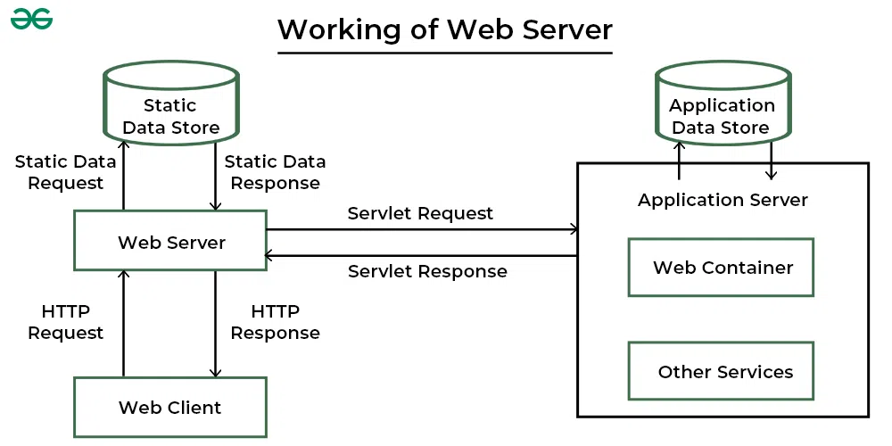

Web server thường lắng nghe trên:

| Giao thức | Cổng mặc định |
|---|---:|
| HTTP | 80 |
| HTTPS | 443 |

Ví dụ web server phổ biến:

- Apache HTTP Server.
- Nginx.
- Microsoft IIS.
- Caddy.
- LiteSpeed.

Khi trình duyệt gửi request:

```http
GET /index.html HTTP/1.1
Host: example.com
```

web server sẽ xử lý request và trả về nội dung phù hợp.

Ví dụ response:

```http
HTTP/1.1 200 OK
Content-Type: text/html

<html>
  <body>Hello!</body>
</html>
```

Web server có thể phục vụ:

- File HTML.
- File CSS.
- File JavaScript.
- Hình ảnh.
- Video.
- File tải xuống.
- Reverse proxy đến backend application.
- Nội dung động từ ứng dụng web.

Trong hệ thống hiện đại, web server thường không làm mọi thứ một mình. Nó có thể đứng trước backend application và chuyển tiếp request.

Ví dụ:

```text
Client → Nginx → Backend App → Database
```

Vai trò của web server:

- Nhận request từ client.
- Trả về nội dung tĩnh.
- Chuyển request đến backend.
- Hỗ trợ HTTPS.
- Ghi log truy cập.
- Cấu hình virtual host.
- Hỗ trợ reverse proxy.
- Có thể giới hạn truy cập hoặc rate limit.

## 11.10. Virtual Host

**Virtual Host** là cơ chế cho phép một web server lưu trữ nhiều website trên cùng một máy chủ.

Ví dụ một server có thể phục vụ nhiều domain:

```text
example.com
blog.example.com
shop.example.com
company.net
```

Tất cả có thể cùng chạy trên một địa chỉ IP nhưng được phân biệt bằng **Host header** trong HTTP request.

Ví dụ request:

```http
GET / HTTP/1.1
Host: blog.example.com
```

Web server nhìn vào header `Host` để biết client đang muốn truy cập website nào.

**Virtual Host giúp:**

- Chạy nhiều website trên cùng một server.
- Tiết kiệm tài nguyên.
- Dễ quản lý nhiều domain.
- Tách cấu hình từng website.
- Hỗ trợ hosting nhiều khách hàng trên một máy chủ.

Ví dụ cấu hình logic:

```text
example.com      → /var/www/example
blog.example.com → /var/www/blog
shop.example.com → /var/www/shop
```

Khi client truy cập `blog.example.com`, web server trả về nội dung trong thư mục `/var/www/blog`.

**Các loại Virtual Host**

| Loại | Mô tả |
|---|---|
| Name-based Virtual Host | Phân biệt website dựa trên domain/Host header |
| IP-based Virtual Host | Mỗi website dùng một địa chỉ IP riêng |
| Port-based Virtual Host | Mỗi website dùng một port khác nhau |

Name-based virtual host là loại phổ biến nhất.

## 11.11. Nội dung tĩnh

**Nội dung tĩnh** là nội dung được lưu sẵn trên server và được trả về gần như nguyên vẹn cho client.

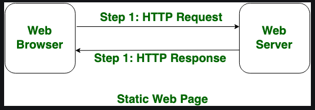

Nội dung tĩnh không thay đổi theo từng người dùng hoặc từng request, trừ khi file trên server được cập nhật.

Ví dụ nội dung tĩnh:

- File HTML.
- File CSS.
- File JavaScript.
- Hình ảnh.
- Video.
- Font chữ.
- File PDF.
- File tải xuống.

Ví dụ request nội dung tĩnh:

```http
GET /images/logo.png HTTP/1.1
Host: example.com
```

Server trả về file `logo.png`.

Đặc điểm của nội dung tĩnh:

| Đặc điểm | Mô tả |
|---|---|
| Có sẵn trên server | Có |
| Thay đổi theo người dùng | Thường không |
| Xử lý backend phức tạp | Không cần |
| Dễ cache | Có |
| Phù hợp với CDN | Có |

Ví dụ:

```text
/style.css
/app.js
/logo.png
/index.html
```

Nội dung tĩnh thường được cache bởi:

- Trình duyệt.
- CDN.
- Reverse proxy.
- Web server.

Điều này giúp tăng tốc website và giảm tải cho backend.

Tóm lại:

```text
Nội dung tĩnh = file có sẵn, server trả về trực tiếp cho client.
```

## 11.12. Nội dung động

**Nội dung động** là nội dung được tạo ra tại thời điểm có request, thường dựa trên dữ liệu, người dùng hoặc logic backend.

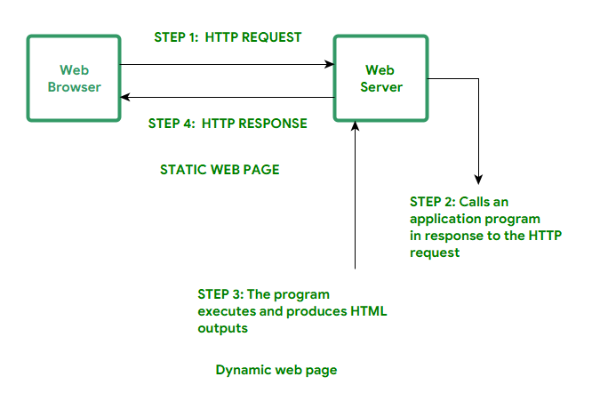

Ví dụ:

- Trang cá nhân của người dùng.
- Giỏ hàng.
- Kết quả tìm kiếm.
- Dashboard.
- Bảng điểm.
- Tin nhắn.
- Danh sách đơn hàng.
- Nội dung lấy từ database.

Ví dụ:

```text
/user/profile
```

Trang này có thể hiển thị thông tin khác nhau tùy người đang đăng nhập.

Quy trình tạo nội dung động:

```text
1. Client gửi request
2. Backend nhận request
3. Backend kiểm tra người dùng
4. Backend truy vấn database
5. Backend tạo HTML hoặc JSON
6. Server trả response về client
```

Ví dụ API trả dữ liệu động:

```http
GET /api/user/10 HTTP/1.1
Host: example.com
```

Response:

```json
{
  "id": 10,
  "username": "alice",
  "role": "user"
}
```

So sánh nội dung tĩnh và nội dung động:

| Tiêu chí | Nội dung tĩnh | Nội dung động |
|---|---|---|
| Cách tạo | Có sẵn trên server | Tạo khi có request |
| Thay đổi theo người dùng | Ít hoặc không | Có |
| Cần backend | Không nhất thiết | Có |
| Cần database | Thường không | Thường có |
| Cache | Dễ hơn | Phức tạp hơn |
| Ví dụ | CSS, JS, ảnh | Profile, dashboard, search |

Trong bảo mật web, nội dung động cần được kiểm tra kỹ vì nó thường xử lý input người dùng và truy vấn database.

Tóm lại:

```text
Nội dung động = nội dung được tạo dựa trên request, người dùng hoặc dữ liệu backend.
```

## 11.13. Load Balancer

**Load Balancer** là bộ cân bằng tải, dùng để phân phối lưu lượng truy cập đến nhiều server phía sau.

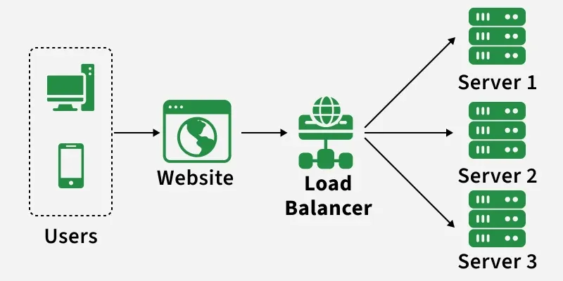

Thay vì tất cả request đi vào một server duy nhất, load balancer chia request cho nhiều server để tăng hiệu suất và độ sẵn sàng.

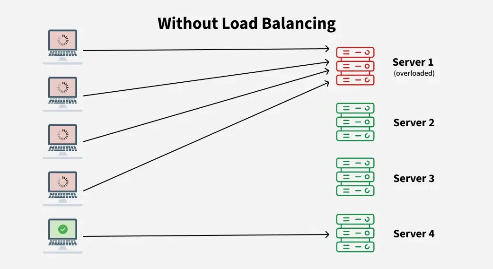


**Working:**


Sơ đồ đơn giản:

```text
Client
  |
  v
Load Balancer
  |
  +--> Web Server 1
  +--> Web Server 2
  +--> Web Server 3
```

Nếu một website có nhiều người truy cập, một server có thể bị quá tải. Load balancer giúp chia tải để hệ thống hoạt động ổn định hơn.

**Load balancer giúp:**

- Phân phối lưu lượng đến nhiều server.
- Tăng hiệu suất xử lý.
- Tăng tính sẵn sàng.
- Giảm nguy cơ downtime.
- Hỗ trợ mở rộng hệ thống.
- Loại bỏ server lỗi khỏi nhóm xử lý.

**Health Check**

Load balancer thường kiểm tra trạng thái của các server phía sau. Quá trình này gọi là **health check**.

Ví dụ:

```text
Load Balancer kiểm tra Web Server 1
Nếu server phản hồi bình thường → tiếp tục gửi traffic
Nếu server lỗi → ngừng gửi traffic đến server đó
```

Ví dụ bảng trạng thái:

| Server | Trạng thái | Có nhận traffic không? |
|---|---|---|
| Web Server 1 | Healthy | Có |
| Web Server 2 | Healthy | Có |
| Web Server 3 | Down | Không |

**Thuật toán cân bằng tải phổ biến**

| Thuật toán | Mô tả |
|---|---|
| Round Robin | Chia lần lượt request cho từng server |
| Least Connections | Gửi request đến server có ít kết nối nhất |
| IP Hash | Chọn server dựa trên IP của client |
| Weighted Round Robin | Server mạnh hơn nhận nhiều request hơn |

## 11.14. CDN

**CDN** là viết tắt của **Content Delivery Network**, nghĩa là **mạng phân phối nội dung**.

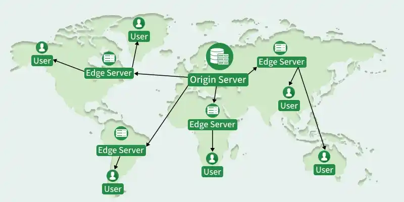


CDN là hệ thống nhiều server được đặt ở nhiều vị trí địa lý khác nhau để lưu trữ và phân phối nội dung cho người dùng nhanh hơn.

Without CDN:

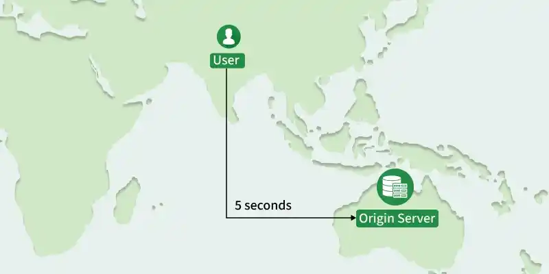

With CDN:

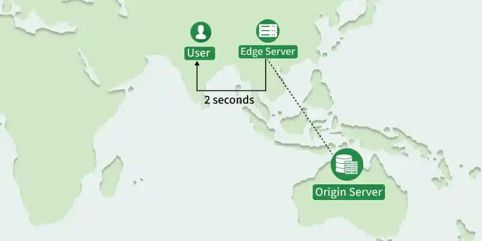

CDN thường dùng để phục vụ nội dung tĩnh như:

- Hình ảnh.
- Video.
- File CSS.
- File JavaScript.
- Font.
- File tải xuống.

Ví dụ:

```text
Website gốc ở Mỹ
Người dùng ở Việt Nam
→ CDN có server gần Việt Nam
→ Người dùng tải ảnh/CSS/JS từ CDN gần hơn
```

Sơ đồ đơn giản:

```text
User ở châu Á → CDN Server ở Singapore → Nội dung tĩnh
User ở châu Âu → CDN Server ở Đức → Nội dung tĩnh
User ở Mỹ     → CDN Server ở Mỹ → Nội dung tĩnh
```

**CDN giúp:**

- Tăng tốc độ tải trang.
- Giảm độ trễ.
- Giảm tải cho server gốc.
- Tăng khả năng chịu tải.
- Cải thiện trải nghiệm người dùng.
- Hỗ trợ chống một số dạng tấn công DDoS tùy dịch vụ.

**Quy trình đơn giản:**

```text
1. Người dùng yêu cầu file ảnh
2. Request được gửi đến CDN server gần nhất
3. Nếu CDN đã có file trong cache, trả về ngay
4. Nếu chưa có, CDN lấy file từ server gốc
5. CDN lưu file vào cache cho các request sau
```

Ví dụ:

```text
https://cdn.example.com/logo.png
```

CDN rất phổ biến trong các website lớn vì nó giúp tải tài nguyên nhanh hơn và giảm áp lực cho hạ tầng backend.

Tóm lại:

```text
CDN = hệ thống server phân tán giúp phân phối nội dung nhanh hơn đến người dùng.
```

## 11.15. Database

**Database** là hệ thống dùng để lưu trữ, quản lý và truy xuất dữ liệu cho website hoặc ứng dụng.

Website thường cần database để lưu các thông tin như:

- Tài khoản người dùng.
- Mật khẩu đã hash.
- Bài viết.
- Bình luận.
- Sản phẩm.
- Đơn hàng.
- Giỏ hàng.
- Log hoạt động.
- Cấu hình hệ thống.

Ví dụ:

Khi người dùng đăng nhập:

```text
1. User nhập username và password
2. Backend nhận dữ liệu
3. Backend truy vấn database
4. Database trả về thông tin user
5. Backend kiểm tra mật khẩu
6. Nếu hợp lệ, user đăng nhập thành công
```

Một số hệ quản trị cơ sở dữ liệu phổ biến:

| Database | Loại |
|---|---|
| MySQL | Quan hệ |
| PostgreSQL | Quan hệ |
| Microsoft SQL Server | Quan hệ |
| SQLite | Quan hệ, nhẹ |
| MongoDB | NoSQL |
| Redis | Key-value, cache |
| Elasticsearch | Search engine / analytics |

Ví dụ truy vấn SQL:

```sql
SELECT * FROM users WHERE username = 'alice';
```

Database thường chứa dữ liệu rất quan trọng, vì vậy cần được bảo vệ cẩn thận.

Một số rủi ro phổ biến:

- SQL Injection.
- Lộ thông tin đăng nhập database.
- Phân quyền database sai.
- Backup database bị public.
- Mật khẩu lưu dưới dạng plaintext.
- Database mở ra Internet không cần thiết.

Ví dụ lỗi nghiêm trọng:

```text
backup.sql được đặt trong thư mục public của website
```

Attacker có thể tải file backup và lấy toàn bộ dữ liệu.

Khuyến nghị:

- Không public database ra Internet nếu không cần.
- Dùng tài khoản database có quyền tối thiểu.
- Hash mật khẩu người dùng.
- Validate và parameterize input.
- Sao lưu dữ liệu an toàn.
- Giám sát truy cập bất thường.
- Không lưu secret trong source code.

Tóm lại:

```text
Database = nơi lưu trữ và quản lý dữ liệu của website.
```

## 11.16. WAF

**WAF** là viết tắt của **Web Application Firewall**, nghĩa là **tường lửa ứng dụng web**.

WAF nằm giữa người dùng và web server để kiểm tra các HTTP/HTTPS request trước khi chúng đến ứng dụng web.

Sơ đồ đơn giản:

```text
Client → WAF → Web Server → Backend → Database
```

WAF có nhiệm vụ phát hiện và chặn các request đáng ngờ hoặc độc hại.

Ví dụ WAF có thể phát hiện:

- SQL Injection.
- Cross-Site Scripting.
- Path Traversal.
- Command Injection.
- File Inclusion.
- Bot traffic.
- Request bất thường.
- Tấn công brute force hoặc request quá nhiều.

Ví dụ request đáng ngờ:

```text
/search?q=' OR '1'='1
```

WAF có thể nhận ra chuỗi này giống kỹ thuật SQL Injection và chặn request.

**WAF hoạt động như thế nào?**

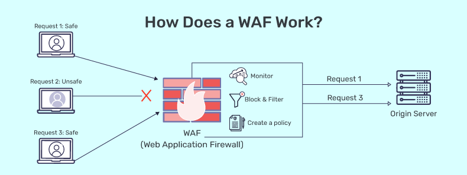

WAF thường kiểm tra:

- URL.
- Query string.
- HTTP headers.
- Cookie.
- Request body.
- Method.
- IP nguồn.
- Tần suất request.
- Pattern tấn công đã biết.

Ví dụ:

```text
Nếu một IP gửi quá nhiều request trong thời gian ngắn
→ WAF có thể rate limit hoặc block IP đó
```

**Rate Limiting**

**Rate limiting** là kỹ thuật giới hạn số lượng request trong một khoảng thời gian.

Ví dụ:

```text
Chỉ cho phép 100 request/phút từ một IP
```

Nếu vượt quá giới hạn, WAF có thể:

- Chặn request.
- Trả về mã 429 Too Many Requests.
- Yêu cầu CAPTCHA.
- Tạm thời block IP.

