# Windows Fundamentals and Active Directory Basics

## Mục lục

1. [Tổng quan về hệ điều hành Windows](#1-tổng-quan-về-hệ-điều-hành-windows)

2. [Giao diện Desktop của Windows](#2-giao-diện-desktop-của-windows)

3. [Hệ thống tệp trong Windows](#3-hệ-thống-tệp-trong-windows)

4. [Thư mục hệ thống Windows](#4-thư-mục-hệ-thống-windows)

5. [Tài khoản người dùng, hồ sơ và quyền](#5-tài-khoản-người-dùng-hồ-sơ-và-quyền)

6. [User Account Control — UAC](#6-user-account-control--uac)

7. [Settings và Control Panel](#7-settings-và-control-panel)

8. [Task Manager](#8-task-manager)

9. [System Configuration — MSConfig](#9-system-configuration--msconfig)

10. [Computer Management](#10-computer-management)

11. [Task Scheduler](#11-task-scheduler)

12. [Event Viewer và Windows Logs](#12-event-viewer-và-windows-logs)

13. [System Information](#13-system-information)

14. [Resource Monitor](#14-resource-monitor)

15. [Command Prompt](#15-command-prompt)

16. [Windows Registry](#16-windows-registry)

17. [Windows Update](#17-windows-update)

18. [Windows Security](#18-windows-security)

19. [Virus & Threat Protection](#19-virus--threat-protection)

## Nội dung

# 1. Tổng quan về hệ điều hành Windows

## 1.1. Windows là gì?

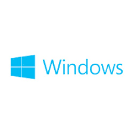

Windows là một hệ điều hành do Microsoft phát triển, được sử dụng rộng rãi trên máy tính cá nhân, máy tính xách tay, máy trạm và máy chủ trong môi trường doanh nghiệp. Hệ điều hành Windows cung cấp giao diện để người dùng tương tác với phần cứng, phần mềm, tệp tin, thiết bị ngoại vi và các dịch vụ hệ thống.

Windows không chỉ là một môi trường làm việc đồ họa quen thuộc với người dùng phổ thông, mà còn là nền tảng quan trọng trong các hệ thống doanh nghiệp. Trong thực tế, nhiều tổ chức sử dụng Windows để quản lý người dùng, máy tính, tài nguyên mạng, chính sách bảo mật và các dịch vụ nội bộ.

Một hệ điều hành Windows thường bao gồm nhiều thành phần khác nhau như:

- giao diện người dùng đồ họa;
- hệ thống tệp;
- tài khoản người dùng và quyền truy cập;
- công cụ quản trị hệ thống;
- dịch vụ nền;
- cơ chế bảo mật;
- công cụ giám sát và xử lý sự cố.

Vì vậy, để sử dụng và quản trị Windows hiệu quả, người học cần hiểu không chỉ giao diện bên ngoài mà còn cả các thành phần hệ thống bên trong.


## 1.2. Vai trò của Windows trong máy tính cá nhân và doanh nghiệp

Trong máy tính cá nhân, Windows đóng vai trò là môi trường làm việc chính cho người dùng. Người dùng có thể sử dụng Windows để thực hiện các công việc hằng ngày như soạn thảo tài liệu, duyệt web, cài đặt phần mềm, lưu trữ dữ liệu, kết nối mạng và sử dụng các thiết bị ngoại vi.

Trong môi trường doanh nghiệp, vai trò của Windows rộng hơn rất nhiều. Windows thường được sử dụng trên máy trạm của nhân viên, máy chủ nội bộ và các hệ thống quản trị tập trung. Doanh nghiệp có thể sử dụng Windows để quản lý tài khoản người dùng, phân quyền truy cập, triển khai chính sách bảo mật, giám sát hoạt động hệ thống và bảo vệ dữ liệu quan trọng.

Một số vai trò quan trọng của Windows trong doanh nghiệp gồm:

- cung cấp môi trường làm việc cho nhân viên;
- quản lý tài khoản người dùng và nhóm;
- kiểm soát quyền truy cập vào tệp, thư mục và tài nguyên mạng;
- hỗ trợ quản trị tập trung thông qua Windows Server và Active Directory;
- ghi nhận nhật ký sự kiện phục vụ giám sát và điều tra sự cố;
- cung cấp các công cụ bảo mật như Windows Security, Windows Defender Firewall và BitLocker.

Do được sử dụng phổ biến trong doanh nghiệp, Windows cũng trở thành một mục tiêu quan trọng đối với các cuộc tấn công mạng. Vì vậy, hiểu rõ Windows là nền tảng cần thiết đối với quản trị viên hệ thống và chuyên viên an toàn thông tin.


## 1.3. Vì sao cần học Windows trong an toàn thông tin?

Windows là một trong những hệ điều hành phổ biến nhất trong môi trường doanh nghiệp. Nhiều máy trạm, máy chủ, hệ thống xác thực và tài nguyên nội bộ được xây dựng trên nền tảng Windows. Vì vậy, đối với lĩnh vực an toàn thông tin, việc hiểu Windows là điều rất quan trọng.

Người làm an toàn thông tin cần học Windows vì các lý do sau:

- Windows thường là mục tiêu của mã độc, tấn công lừa đảo, leo thang đặc quyền và khai thác cấu hình sai.
- Nhiều sự kiện bảo mật quan trọng được ghi lại trong Windows Event Logs.
- Các cơ chế như User Account Control, NTFS Permissions, Windows Defender Firewall và BitLocker ảnh hưởng trực tiếp đến mức độ an toàn của hệ thống.
- Active Directory, một thành phần quan trọng trong doanh nghiệp, hoạt động dựa trên nền tảng Windows Server.
- Kẻ tấn công thường lợi dụng các công cụ hợp pháp có sẵn trong Windows để ẩn hành vi độc hại.

Đối với một SOC Analyst, kiến thức Windows giúp phân tích log, phát hiện hành vi bất thường, điều tra sự cố và hiểu rõ cách kẻ tấn công di chuyển trong hệ thống. Đối với quản trị viên hệ thống, kiến thức này giúp cấu hình máy tính an toàn hơn, quản lý người dùng hiệu quả hơn và giảm thiểu rủi ro bảo mật.

Nói cách khác, học Windows là bước nền tảng để hiểu cách hệ thống doanh nghiệp vận hành và cách bảo vệ hệ thống đó trước các mối đe dọa mạng.


## 1.4. Lịch sử phát triển của Windows

Windows có lịch sử phát triển lâu dài, bắt đầu từ năm 1985. Qua nhiều phiên bản khác nhau, Windows dần trở thành hệ điều hành phổ biến trong cả môi trường cá nhân và doanh nghiệp.

Một số phiên bản Windows có ảnh hưởng lớn gồm Windows XP, Windows Vista, Windows 7, Windows 8, Windows 10 và Windows 11. Trong đó, Windows XP từng là một phiên bản rất phổ biến và được sử dụng trong thời gian dài. Tuy nhiên, khi Microsoft thông báo kết thúc hỗ trợ Windows XP, nhiều tổ chức phải nhanh chóng chuyển sang các phiên bản mới hơn để đảm bảo khả năng tương thích và an toàn.

Windows Vista là một phiên bản có nhiều thay đổi lớn, nhưng không được người dùng đón nhận tốt. Sau đó, Windows 7 được phát hành và trở thành một phiên bản ổn định, phổ biến trong nhiều năm. Windows 8 và Windows 8.1 xuất hiện sau đó, nhưng không để lại ảnh hưởng lâu dài như Windows 7.

Windows 10 đánh dấu một giai đoạn quan trọng khi Microsoft tập trung nhiều hơn vào bảo mật, cập nhật hệ thống và trải nghiệm người dùng. Sau đó, Windows 11 được giới thiệu với giao diện hiện đại hơn và nhiều yêu cầu bảo mật phần cứng cao hơn.

Qua từng phiên bản, Microsoft liên tục cải thiện Windows về khả năng sử dụng, tính ổn định và bảo mật. Tuy nhiên, do Windows được sử dụng rất rộng rãi, nó vẫn luôn là mục tiêu hấp dẫn đối với tin tặc và phần mềm độc hại.


## 1.5. Các phiên bản Windows phổ biến

Windows có nhiều phiên bản khác nhau, phục vụ các nhóm người dùng và mục đích sử dụng khác nhau. Đối với người dùng cá nhân, các phiên bản thường gặp là Windows Home và Windows Pro. Đối với doanh nghiệp và hệ thống máy chủ, Microsoft cung cấp các phiên bản Windows Server.

Một số phiên bản Windows phổ biến gồm:

| Phiên bản | Mục đích sử dụng chính |
|---|---|
| Windows XP | Phiên bản cũ, từng được sử dụng rất rộng rãi |
| Windows 7 | Phiên bản ổn định, phổ biến trong cá nhân và doanh nghiệp |
| Windows 8 / 8.1 | Phiên bản hướng nhiều hơn đến thiết bị cảm ứng |
| Windows 10 | Phiên bản phổ biến cho máy tính cá nhân và doanh nghiệp |
| Windows 11 | Phiên bản hiện đại hơn, chú trọng giao diện và bảo mật |
| Windows Server | Dùng cho máy chủ và môi trường doanh nghiệp |

Windows dành cho người dùng cuối thường tập trung vào trải nghiệm sử dụng, giao diện đồ họa, ứng dụng văn phòng và các tính năng cá nhân. Trong khi đó, Windows Server tập trung vào quản trị hệ thống, dịch vụ mạng, quản lý người dùng, chia sẻ tài nguyên và triển khai các dịch vụ doanh nghiệp.

Việc phân biệt các phiên bản Windows là cần thiết vì mỗi phiên bản có tính năng, quyền quản trị và khả năng bảo mật khác nhau.


## 1.6. Windows Desktop và Windows Server

Windows Desktop là nhóm hệ điều hành Windows được thiết kế chủ yếu cho người dùng cá nhân, nhân viên văn phòng và máy trạm trong doanh nghiệp. Các phiên bản như Windows 10 hoặc Windows 11 thường thuộc nhóm này. Chúng cung cấp giao diện đồ họa thân thiện, hỗ trợ ứng dụng văn phòng, trình duyệt, phần mềm làm việc và các công cụ cá nhân.

Windows Server là hệ điều hành được thiết kế cho máy chủ. Nó thường được sử dụng để cung cấp dịch vụ cho nhiều người dùng hoặc nhiều máy tính trong mạng. Windows Server có thể đảm nhiệm các vai trò như máy chủ xác thực, máy chủ tệp, máy chủ web, máy chủ DNS, DHCP hoặc Domain Controller trong môi trường Active Directory.

Có thể so sánh ngắn gọn như sau:

| Tiêu chí | Windows Desktop | Windows Server |
|---|---|---|
| Đối tượng sử dụng | Người dùng cá nhân, nhân viên, máy trạm | Doanh nghiệp, quản trị viên, máy chủ |
| Mục đích chính | Làm việc hằng ngày, chạy ứng dụng người dùng | Cung cấp dịch vụ mạng và quản trị tập trung |
| Giao diện | Tối ưu cho người dùng cuối | Tối ưu cho quản trị và dịch vụ |
| Vai trò trong mạng | Máy khách hoặc máy trạm | Máy chủ cung cấp dịch vụ |
| Ví dụ | Windows 10, Windows 11 | Windows Server 2019 |

Trong các hệ thống doanh nghiệp, Windows Desktop và Windows Server thường hoạt động cùng nhau. Máy trạm của người dùng chạy Windows Desktop, còn các dịch vụ trung tâm như Active Directory, DNS, DHCP hoặc File Server thường chạy trên Windows Server.


## 1.7. Sự khác nhau giữa Windows Home và Windows Pro

Windows Home và Windows Pro đều là phiên bản dành cho người dùng cuối, nhưng Windows Pro có nhiều tính năng nâng cao hơn, đặc biệt phù hợp với môi trường doanh nghiệp nhỏ, người dùng kỹ thuật và các hệ thống cần quản lý bảo mật tốt hơn.

Windows Home thường phù hợp với người dùng cá nhân, học tập, giải trí và các nhu cầu cơ bản. Trong khi đó, Windows Pro cung cấp thêm các tính năng quản trị, bảo mật và kết nối doanh nghiệp.

Một số điểm khác nhau chính:

| Tiêu chí | Windows Home | Windows Pro |
|---|---|---|
| Đối tượng sử dụng | Người dùng cá nhân | Người dùng chuyên nghiệp, doanh nghiệp nhỏ |
| BitLocker | Không hỗ trợ đầy đủ | Có hỗ trợ BitLocker |
| Remote Desktop Host | Không hỗ trợ đầy đủ | Có thể dùng để nhận kết nối Remote Desktop |
| Group Policy | Hạn chế | Hỗ trợ tốt hơn |
| Tham gia domain | Không phù hợp | Hỗ trợ tham gia domain |
| Quản trị doanh nghiệp | Ít tính năng hơn | Nhiều tính năng hơn |

Một điểm khác biệt quan trọng là Windows Pro hỗ trợ BitLocker Drive Encryption. Đây là tính năng mã hóa ổ đĩa giúp bảo vệ dữ liệu trong trường hợp thiết bị bị mất, bị đánh cắp hoặc ổ đĩa bị tháo ra khỏi máy.

Vì vậy, trong môi trường cần bảo mật dữ liệu, quản lý người dùng hoặc kết nối vào hệ thống doanh nghiệp, Windows Pro thường phù hợp hơn Windows Home.


## 1.8. Windows Server trong môi trường doanh nghiệp

Windows Server là nền tảng quan trọng trong nhiều hệ thống doanh nghiệp. Khác với Windows Desktop, Windows Server được thiết kế để cung cấp dịch vụ cho nhiều người dùng, nhiều máy tính và nhiều hệ thống khác nhau trong mạng.

Trong môi trường doanh nghiệp, Windows Server có thể đảm nhiệm nhiều vai trò như:

- Domain Controller;
- Active Directory Domain Services;
- DNS Server;
- DHCP Server;
- File Server;
- Print Server;
- Web Server;
- Remote Desktop Services;
- hệ thống quản lý chính sách bảo mật.

Một trong những vai trò quan trọng nhất của Windows Server là triển khai Active Directory. Active Directory cho phép doanh nghiệp quản lý tập trung người dùng, máy tính, nhóm, chính sách bảo mật và quyền truy cập. Thay vì phải cấu hình từng máy tính riêng lẻ, quản trị viên có thể quản lý toàn bộ hệ thống từ một nơi trung tâm.

Windows Server cũng đóng vai trò quan trọng trong bảo mật doanh nghiệp. Thông qua Windows Server và Active Directory, tổ chức có thể áp dụng chính sách mật khẩu, giới hạn quyền người dùng, kiểm soát truy cập tài nguyên, ghi log sự kiện và triển khai các chính sách bảo vệ hệ thống.

Đối với người học an toàn thông tin, Windows Server là nền tảng cần nắm vững vì nhiều cuộc tấn công trong doanh nghiệp thường liên quan đến Active Directory, tài khoản domain, quyền quản trị, dịch vụ mạng và cấu hình sai trên máy chủ Windows.

# 2. Giao diện Desktop của Windows

## 2.1. Windows Desktop là gì?

Windows Desktop là giao diện người dùng đồ họa của hệ điều hành Windows. Đây là màn hình chính xuất hiện sau khi người dùng đăng nhập thành công vào hệ thống.

Thông qua Desktop, người dùng có thể mở chương trình, truy cập tệp tin, thư mục, cài đặt hệ thống và các công cụ quản trị cơ bản. Thay vì phải nhập lệnh thủ công, Windows Desktop cho phép người dùng thao tác với hệ thống bằng chuột, bàn phím, biểu tượng và các cửa sổ đồ họa.

Trong môi trường Windows, Desktop không chỉ là nơi hiển thị hình nền, mà còn là khu vực làm việc trung tâm. Từ đây, người dùng có thể truy cập Start Menu, thanh tác vụ, khu vực thông báo, hộp tìm kiếm và các ứng dụng đang chạy.

Một giao diện Desktop Windows thông thường bao gồm các thành phần chính sau:

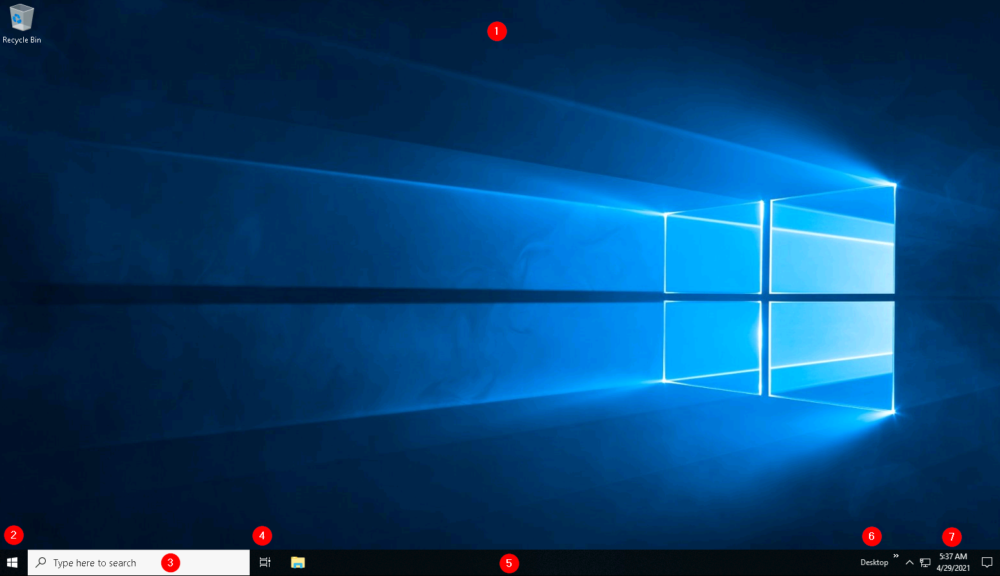

1. màn hình Desktop;

1. Màn hình Desktop  
2. Menu Start  
3. Hộp tìm kiếm (Cortana)  
4. Chế độ xem tác vụ (Task View)  
5. Thanh tác vụ (Taskbar)  
6. Thanh công cụ (Toolbars)  
7. Khu vực thông báo (Notification Area)  

Việc hiểu rõ các thành phần này giúp người dùng thao tác với Windows nhanh hơn, đồng thời hỗ trợ quá trình quản trị và xử lý sự cố cơ bản.


## 2.2. Màn hình Desktop

Màn hình Desktop là khu vực làm việc chính của Windows. Đây là nơi người dùng thường đặt các biểu tượng, shortcut, thư mục hoặc tệp tin cần truy cập nhanh.

Ví dụ, trên Desktop có thể có các shortcut đến trình duyệt web, thư mục tài liệu, ứng dụng văn phòng hoặc các công cụ quản trị hệ thống. Người dùng có thể mở nhanh các đối tượng này bằng cách nhấp đúp chuột vào biểu tượng tương ứng.

Màn hình Desktop có thể được sắp xếp theo nhiều cách khác nhau. Người dùng có thể:

- thay đổi kích thước biểu tượng;
- sắp xếp biểu tượng theo tên, loại, ngày sửa đổi hoặc kích thước;
- tạo thư mục mới;
- tạo shortcut;
- sao chép hoặc dán tệp vào Desktop;
- thay đổi hình nền và giao diện hiển thị.

Khi nhấp chuột phải vào vùng trống trên Desktop, Windows sẽ hiển thị một menu ngữ cảnh. Menu này cho phép người dùng thực hiện nhiều thao tác nhanh như thay đổi cách hiển thị biểu tượng, tạo đối tượng mới, mở Display Settings hoặc mở Personalization.

Menu trên Desktop:

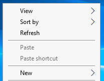


Trong thực tế, Desktop thường được sử dụng để truy cập nhanh các tài nguyên quan trọng. Tuy nhiên, không nên lưu quá nhiều tệp quan trọng trực tiếp trên Desktop vì có thể gây khó quản lý, làm rối giao diện và tăng nguy cơ mất dữ liệu nếu hồ sơ người dùng gặp lỗi.


## 2.3. Start Menu

Start Menu là một trong những thành phần quan trọng nhất của giao diện Windows. Đây là nơi người dùng có thể truy cập ứng dụng, công cụ hệ thống, cài đặt, thư mục cá nhân và các tùy chọn nguồn như tắt máy hoặc khởi động lại.

Trong các phiên bản Windows hiện đại, Start Menu thường được mở bằng cách nhấp vào biểu tượng Windows ở góc dưới bên trái màn hình. Mặc dù giao diện Start Menu đã thay đổi qua từng phiên bản Windows, chức năng chính của nó vẫn là cung cấp điểm truy cập trung tâm đến các chương trình và tính năng của hệ điều hành.

Start Menu thường bao gồm các khu vực chính sau:

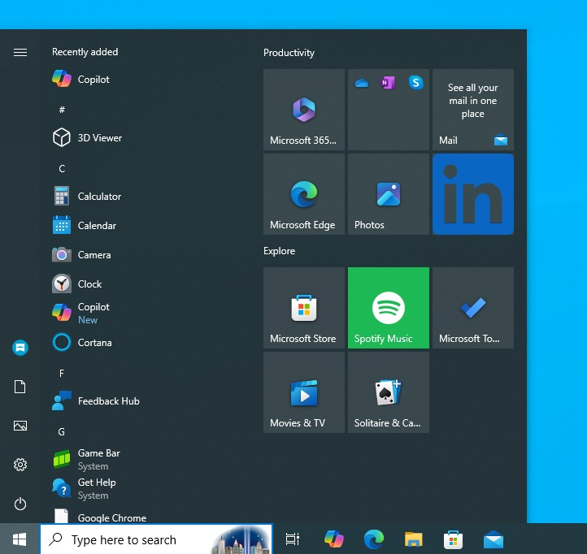

- khu vực tài khoản người dùjpgng;
- lối tắt đến Documents, Pictures và Settings;
- nút Power để tắt máy, khởi động lại hoặc đăng xuất;
- danh sách ứng dụng đã cài đặt;
- khu vực các ô ứng dụng được ghim.

Người dùng có thể tìm kiếm ứng dụng trong Start Menu bằng cách cuộn danh sách ứng dụng hoặc nhập tên ứng dụng vào hộp tìm kiếm. Ngoài ra, có thể ghim các ứng dụng thường dùng vào Start Menu để truy cập nhanh hơn.

Trong quản trị hệ thống, Start Menu cũng là nơi thường dùng để mở các công cụ như Control Panel, Settings, Task Manager, Computer Management, Event Viewer hoặc Command Prompt.


## 2.4. Search Box

Search Box là hộp tìm kiếm trên Windows, thường nằm trên thanh tác vụ hoặc được tích hợp trong Start Menu. Công cụ này giúp người dùng tìm nhanh ứng dụng, tệp tin, thư mục, cài đặt hệ thống và một số nội dung khác trên máy tính.

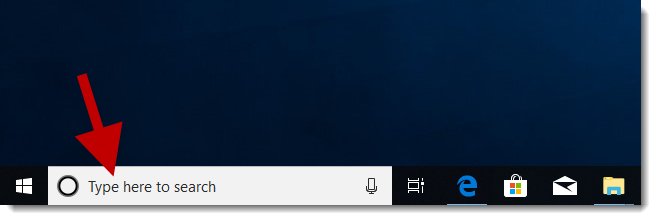

Thay vì phải mở từng thư mục hoặc từng menu, người dùng có thể nhập từ khóa trực tiếp vào Search Box. Ví dụ:

- nhập `Control Panel` để mở Bảng điều khiển;
- nhập `Task Manager` để mở trình quản lý tác vụ;
- nhập `wallpaper` để tìm cài đặt hình nền;
- nhập tên ứng dụng để mở nhanh chương trình.

Search Box giúp tiết kiệm thời gian khi người dùng không nhớ chính xác vị trí của một công cụ trong hệ thống. Đây là cách rất hữu ích để truy cập nhanh các thiết lập Windows.

Trong một số trường hợp, người dùng có thể ẩn hoặc thay đổi cách hiển thị Search Box trên thanh tác vụ. Có thể nhấp chuột phải vào Taskbar, chọn phần Search và thay đổi chế độ hiển thị, ví dụ như hiển thị biểu tượng tìm kiếm hoặc ẩn hoàn toàn hộp tìm kiếm.


## 2.5. Task View

Task View là tính năng cho phép người dùng xem nhanh các cửa sổ và ứng dụng đang mở trên hệ thống. Tính năng này giúp chuyển đổi giữa các cửa sổ dễ dàng hơn, đặc biệt khi người dùng đang làm việc với nhiều ứng dụng cùng lúc.

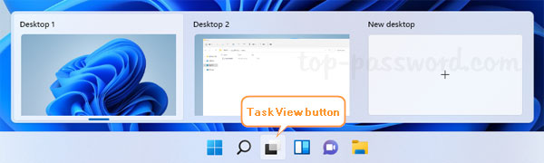

Thông qua Task View, người dùng có thể:

- xem toàn bộ cửa sổ đang mở;
- chuyển nhanh sang một ứng dụng khác;
- quản lý nhiều không gian làm việc;
- tạo desktop ảo để tách các nhóm công việc khác nhau.

Ví dụ, người dùng có thể tạo một desktop ảo cho công việc học tập, một desktop khác cho trình duyệt, và một desktop khác cho công cụ quản trị hệ thống. Điều này giúp màn hình làm việc gọn gàng và dễ quản lý hơn.

Nút Task View thường nằm trên Taskbar. Nếu không sử dụng, người dùng có thể ẩn nút này bằng cách nhấp chuột phải vào Taskbar và bỏ chọn tùy chọn hiển thị Task View button.


## 2.6. Taskbar

Taskbar, hay thanh tác vụ, là thanh nằm ở phía dưới màn hình Windows theo mặc định. Đây là nơi hiển thị các ứng dụng đang mở, các ứng dụng được ghim, Start Menu, Search Box, Task View và khu vực thông báo.

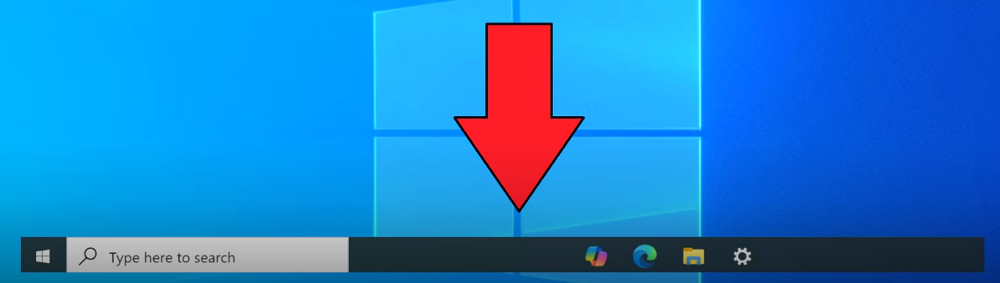

Taskbar giúp người dùng quản lý các chương trình đang chạy. Khi mở một ứng dụng, biểu tượng của ứng dụng đó sẽ xuất hiện trên Taskbar. Người dùng có thể nhấp vào biểu tượng để chuyển sang cửa sổ tương ứng.

Một số chức năng chính của Taskbar gồm:

- mở Start Menu;
- tìm kiếm ứng dụng và cài đặt;
- hiển thị ứng dụng đang chạy;
- chuyển đổi giữa các cửa sổ;
- ghim ứng dụng thường dùng;
- truy cập nhanh khu vực thông báo;
- mở Task Manager bằng menu chuột phải.

Khi di chuột qua biểu tượng ứng dụng đang mở, Windows có thể hiển thị hình thu nhỏ xem trước của cửa sổ đó. Điều này rất hữu ích khi có nhiều cửa sổ hoặc nhiều phiên bản của cùng một ứng dụng đang chạy.

Người dùng có thể tùy chỉnh Taskbar theo nhu cầu, ví dụ như ẩn Search Box, ẩn Task View, thay đổi vị trí thanh tác vụ hoặc ghim ứng dụng thường dùng để mở nhanh.


## 2.7. Toolbars

Toolbars là các thanh công cụ có thể được hiển thị trên Taskbar để cung cấp quyền truy cập nhanh đến một số vị trí hoặc chức năng cụ thể.

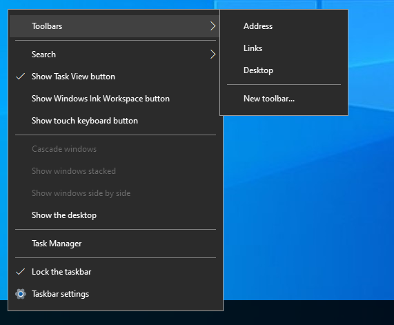

Trong Windows, người dùng có thể bật hoặc tắt Toolbars bằng cách nhấp chuột phải vào Taskbar và chọn mục Toolbars. Tùy theo phiên bản Windows, các tùy chọn có thể khác nhau.

Toolbars có thể được dùng để truy cập nhanh vào:

- thư mục cụ thể;
- địa chỉ web;
- liên kết thường dùng;
- một số công cụ hệ thống.

Tuy nhiên, trong thực tế, Toolbars không phải là thành phần được sử dụng thường xuyên bởi mọi người dùng. Nhiều người thường chọn ghim ứng dụng trực tiếp vào Taskbar hoặc sử dụng Start Menu và Search Box để truy cập nhanh hơn.

Dù vậy, Toolbars vẫn là một phần của giao diện Windows và có thể hữu ích trong một số môi trường làm việc cần truy cập nhanh đến thư mục hoặc tài nguyên nhất định.


## 2.8. Notification Area

Notification Area là khu vực thông báo nằm ở góc dưới bên phải của màn hình Windows. Khu vực này thường hiển thị ngày giờ, trạng thái mạng, âm lượng, thông báo hệ thống và một số biểu tượng của ứng dụng chạy nền.

Các biểu tượng thường gặp trong Notification Area gồm:

- đồng hồ hệ thống;
- biểu tượng mạng hoặc Wi-Fi;
- biểu tượng âm lượng;
- biểu tượng pin trên máy tính xách tay;
- Windows Security;
- Action Center;
- biểu tượng của ứng dụng chạy nền.

Notification Area giúp người dùng theo dõi nhanh trạng thái hệ thống. Ví dụ, người dùng có thể kiểm tra máy có kết nối mạng hay không, âm lượng đang bật hay tắt, hệ thống có cảnh báo bảo mật hay có thông báo mới nào không.

Một số biểu tượng trong khu vực này có thể được ẩn hoặc hiển thị tùy theo cài đặt Taskbar. Người dùng có thể vào Taskbar settings để chọn biểu tượng nào được phép hiển thị trong Notification Area.

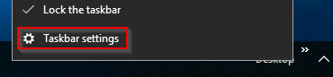

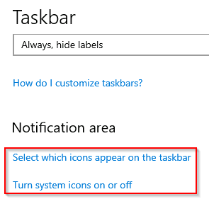

Đối với người làm an toàn thông tin, Notification Area cũng có ý nghĩa nhất định vì nó có thể hiển thị trạng thái của Windows Security, phần mềm chống virus, VPN hoặc các công cụ bảo vệ hệ thống khác.


## 2.9. Cá nhân hóa giao diện Windows

Windows cho phép người dùng cá nhân hóa giao diện để phù hợp với sở thích và nhu cầu sử dụng. Việc cá nhân hóa có thể bao gồm thay đổi hình nền, màu sắc, chủ đề, phông chữ, màn hình khóa và cách hiển thị các thành phần giao diện.

Người dùng có thể mở phần cá nhân hóa bằng cách nhấp chuột phải vào Desktop và chọn Personalize. Từ đây, Windows sẽ mở giao diện cài đặt liên quan đến giao diện người dùng.

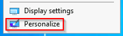

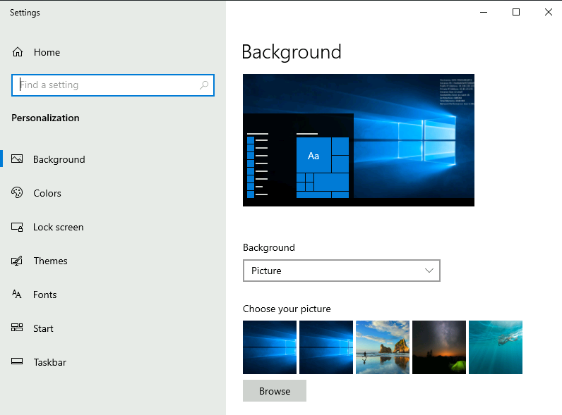

Một số tùy chọn cá nhân hóa phổ biến gồm:

- thay đổi hình nền Desktop;
- thay đổi màu chủ đạo của hệ thống;
- chọn theme;
- cấu hình Lock Screen;
- thay đổi font;
- điều chỉnh Start Menu;
- điều chỉnh Taskbar.

Cá nhân hóa giao diện giúp người dùng làm việc thoải mái hơn. Tuy nhiên, trong môi trường doanh nghiệp, một số tùy chọn cá nhân hóa có thể bị hạn chế bởi chính sách quản trị, đặc biệt khi máy tính tham gia domain hoặc chịu sự quản lý của Group Policy.

Ví dụ, quản trị viên có thể áp dụng chính sách để cố định hình nền công ty, ẩn một số cài đặt hoặc hạn chế người dùng thay đổi giao diện hệ thống.


## 2.10. Display Settings

Display Settings là phần cài đặt liên quan đến màn hình hiển thị của Windows. Người dùng có thể mở Display Settings bằng cách nhấp chuột phải vào Desktop và chọn Display settings.

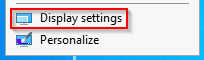

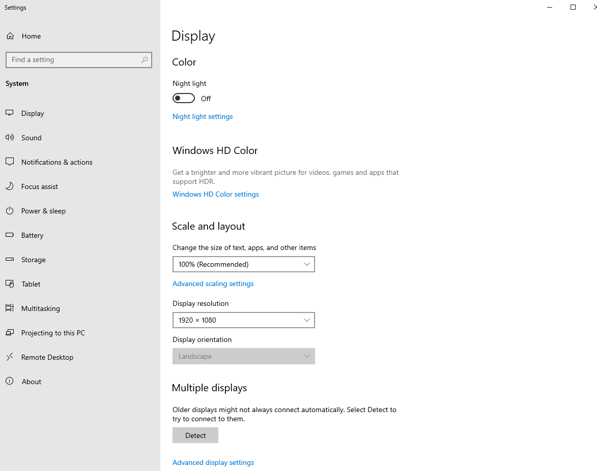

Trong Display Settings, người dùng có thể cấu hình các tùy chọn như:

- độ phân giải màn hình;
- tỷ lệ hiển thị;
- hướng màn hình;
- độ sáng;
- nhiều màn hình;
- cách sắp xếp màn hình phụ;
- chế độ hiển thị khi dùng nhiều màn hình.

Độ phân giải màn hình ảnh hưởng trực tiếp đến độ sắc nét và không gian hiển thị. Nếu độ phân giải quá thấp, nội dung có thể bị to và chiếm nhiều diện tích. Nếu độ phân giải phù hợp, giao diện sẽ rõ ràng và dễ làm việc hơn.

Trong trường hợp sử dụng nhiều màn hình, Display Settings cho phép người dùng chọn cách hiển thị như:

- chỉ hiển thị trên một màn hình;
- nhân đôi màn hình;
- mở rộng màn hình;
- chọn màn hình chính.

Lưu ý rằng khi sử dụng Remote Desktop, một số tùy chọn hiển thị có thể bị giới hạn hoặc không thể thay đổi trực tiếp trên máy từ xa.

# 3. Hệ thống tệp trong Windows

## 3.1. Khái niệm hệ thống tệp

Hệ thống tệp là cơ chế mà hệ điều hành sử dụng để tổ chức, lưu trữ, quản lý và truy cập dữ liệu trên thiết bị lưu trữ như ổ cứng, SSD, USB hoặc thẻ nhớ.

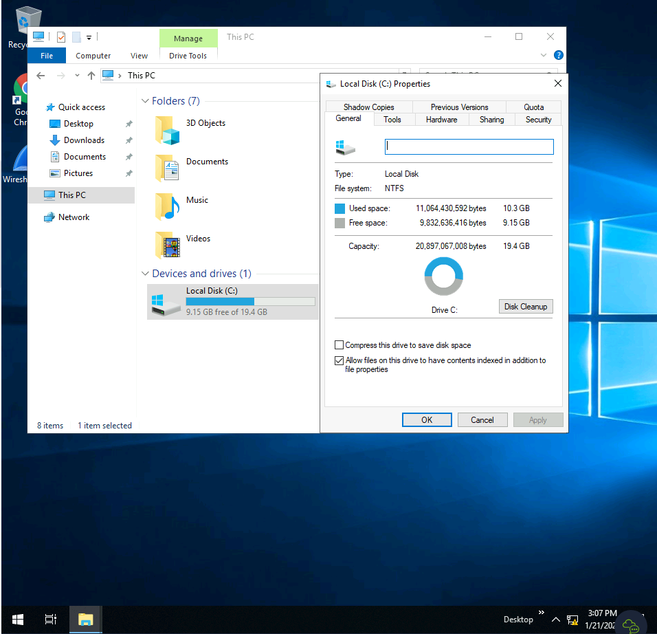

Nói đơn giản, hệ thống tệp quyết định cách tệp và thư mục được tạo, đặt tên, lưu trữ, đọc, ghi và bảo vệ trên ổ đĩa. Nếu không có hệ thống tệp, hệ điều hành sẽ không thể biết dữ liệu nằm ở đâu, thuộc về tệp nào và cần được truy cập như thế nào.

Trong Windows, hệ thống tệp có vai trò rất quan trọng vì nó ảnh hưởng trực tiếp đến:

- cách lưu trữ tệp và thư mục;
- giới hạn kích thước tệp;
- quyền truy cập của người dùng;
- khả năng khôi phục khi có lỗi;
- khả năng mã hóa và nén dữ liệu;
- mức độ bảo mật của hệ thống.

Các phiên bản Windows hiện đại chủ yếu sử dụng hệ thống tệp NTFS (New Technology File System). Trước NTFS, Windows từng sử dụng các hệ thống tệp như FAT16, FAT32 và HPFS.


## 3.2. FAT16, FAT32 và HPFS

Trước khi NTFS trở thành hệ thống tệp chính trong Windows hiện đại, Microsoft đã sử dụng một số hệ thống tệp cũ hơn như FAT16, FAT32 và HPFS.

FAT là viết tắt của File Allocation Table. FAT16 và FAT32 từng được sử dụng rộng rãi trên các hệ điều hành cũ và các thiết bị lưu trữ ngoài. Ngày nay, FAT32 vẫn có thể gặp trên USB, thẻ nhớ SD hoặc các thiết bị cần khả năng tương thích với nhiều hệ điều hành khác nhau.

Tuy nhiên, FAT32 có nhiều hạn chế. Một trong những hạn chế phổ biến nhất là không hỗ trợ tệp có dung lượng lớn hơn 4 GB. Ngoài ra, FAT32 không hỗ trợ cơ chế phân quyền chi tiết như NTFS, vì vậy nó không phù hợp cho các hệ thống cần bảo mật dữ liệu tốt.

HPFS, viết tắt của High Performance File System, cũng là một hệ thống tệp từng được sử dụng trước đây. Tuy nhiên, trong các hệ thống Windows hiện đại, HPFS gần như không còn phổ biến.

Có thể tóm tắt như sau:

| Hệ thống tệp | Đặc điểm chính |
|---|---|
| FAT16 | Hệ thống tệp cũ, giới hạn dung lượng thấp |
| FAT32 | Tương thích tốt với USB/thẻ nhớ, nhưng không hỗ trợ tệp trên 4 GB |
| HPFS | Hệ thống tệp hiệu năng cao trước đây, hiện ít phổ biến |
| NTFS | Hệ thống tệp chính của Windows hiện đại, hỗ trợ bảo mật và nhiều tính năng nâng cao |

Trong thực tế, nếu cài đặt Windows trên máy tính cá nhân hoặc máy chủ hiện đại, hệ thống tệp được sử dụng gần như luôn là NTFS.


## 3.3. NTFS là gì?

NTFS là viết tắt của New Technology File System. Đây là hệ thống tệp được sử dụng trong các phiên bản Windows hiện đại.

NTFS được thiết kế để khắc phục nhiều hạn chế của các hệ thống tệp cũ như FAT16 và FAT32. So với FAT32, NTFS mạnh hơn, ổn định hơn và hỗ trợ nhiều tính năng bảo mật hơn.

Một đặc điểm quan trọng của NTFS là đây là hệ thống tệp có cơ chế ghi nhật ký. Điều này có nghĩa là hệ thống có thể lưu lại một số thông tin về thay đổi trên ổ đĩa. Khi xảy ra lỗi, Windows có thể sử dụng thông tin này để hỗ trợ sửa chữa hoặc khôi phục trạng thái của hệ thống tệp.

NTFS cũng cho phép thiết lập quyền truy cập chi tiết trên từng tệp và thư mục. Đây là một điểm rất quan trọng trong môi trường nhiều người dùng hoặc môi trường doanh nghiệp, nơi không phải ai cũng được phép truy cập cùng một dữ liệu.

Ngoài ra, NTFS còn hỗ trợ các tính năng như:

- tệp có kích thước lớn;
- phân quyền tệp và thư mục;
- nén dữ liệu;
- mã hóa dữ liệu;
- ghi nhật ký hệ thống tệp;
- Alternate Data Streams.

Vì vậy, NTFS không chỉ là nơi lưu trữ dữ liệu, mà còn là một thành phần quan trọng trong mô hình bảo mật của Windows.


## 3.4. Ưu điểm của NTFS

NTFS có nhiều ưu điểm so với các hệ thống tệp cũ. Những ưu điểm này giúp NTFS trở thành lựa chọn mặc định cho các phiên bản Windows hiện đại.

Một số ưu điểm quan trọng của NTFS gồm:

- hỗ trợ tệp có dung lượng lớn hơn 4 GB;
- hỗ trợ quyền truy cập riêng biệt cho từng tệp và thư mục;
- hỗ trợ nén tệp và thư mục;
- hỗ trợ mã hóa dữ liệu;
- có cơ chế ghi nhật ký để hỗ trợ phục hồi khi có lỗi;
- phù hợp với môi trường nhiều người dùng;
- phù hợp với hệ thống doanh nghiệp cần kiểm soát quyền truy cập.

Trong FAT32, người dùng không thể thiết lập quyền chi tiết cho từng tệp hoặc thư mục. Điều này khiến FAT32 không phù hợp với hệ thống cần bảo mật cao. Ngược lại, NTFS cho phép quản trị viên xác định rõ ai được đọc, ghi, chỉnh sửa hoặc thực thi một tệp cụ thể.

Ví dụ, trong một doanh nghiệp, thư mục chứa tài liệu kế toán chỉ nên được truy cập bởi bộ phận kế toán và quản lý. Với NTFS, quản trị viên có thể cấu hình quyền để những người dùng khác không thể mở hoặc chỉnh sửa thư mục này.

NTFS cũng hỗ trợ EFS, tức Encrypting File System. Đây là cơ chế mã hóa tệp ở cấp hệ thống tệp, giúp bảo vệ dữ liệu khỏi truy cập trái phép.

Từ góc độ an toàn thông tin, NTFS rất quan trọng vì nó là nền tảng cho việc kiểm soát truy cập dữ liệu trên Windows.


## 3.5. Quyền truy cập trong NTFS

Quyền truy cập trong NTFS cho phép Windows kiểm soát người dùng hoặc nhóm người dùng nào được phép thao tác với tệp và thư mục.

Mỗi tệp hoặc thư mục trên phân vùng NTFS có thể được gán các quyền khác nhau. Các quyền này xác định người dùng có thể đọc, ghi, chỉnh sửa, thực thi hoặc xóa dữ liệu hay không.

Quyền NTFS thường được áp dụng cho:

- người dùng cụ thể;
- nhóm người dùng;
- tài khoản hệ thống;
- tài khoản dịch vụ.

Ví dụ, một thư mục có thể cho phép nhóm Administrators toàn quyền kiểm soát, trong khi nhóm Users chỉ được phép đọc và thực thi. Điều này giúp hệ thống hạn chế người dùng thông thường thay đổi hoặc xóa các tệp quan trọng.

Quyền NTFS có thể được sử dụng để:

- bảo vệ tệp hệ thống;
- giới hạn truy cập vào dữ liệu nhạy cảm;
- phân quyền theo phòng ban;
- ngăn người dùng chỉnh sửa dữ liệu không thuộc phạm vi của họ;
- hỗ trợ điều tra khi có truy cập trái phép.

Trong môi trường doanh nghiệp, quyền NTFS thường được kết hợp với tài khoản người dùng, nhóm bảo mật và Active Directory để quản lý truy cập một cách tập trung và hiệu quả.


## 3.6. Các quyền cơ bản trong NTFS

NTFS cung cấp nhiều loại quyền cơ bản để kiểm soát cách người dùng tương tác với tệp và thư mục. Các quyền này có thể được cấp hoặc từ chối tùy theo yêu cầu bảo mật.

Các quyền cơ bản trong NTFS gồm:

- Full Control;
- Modify;
- Read & Execute;
- List Folder Contents;
- Read;
- Write.

Mỗi quyền có ý nghĩa khác nhau đối với tệp và thư mục. Việc hiểu rõ từng quyền là rất quan trọng để tránh cấu hình sai, đặc biệt trong các hệ thống có nhiều người dùng.


### 3.6.1. Full Control

Full Control là quyền cao nhất trong NTFS. Người dùng có quyền Full Control có thể thực hiện hầu như mọi thao tác đối với tệp hoặc thư mục.

Đối với thư mục, quyền Full Control cho phép người dùng:

- đọc nội dung thư mục;
- tạo tệp và thư mục con;
- chỉnh sửa tệp;
- xóa tệp và thư mục;
- thay đổi quyền truy cập;
- thay đổi chủ sở hữu nếu được phép.

Đối với tệp, quyền Full Control cho phép người dùng:

- đọc tệp;
- ghi vào tệp;
- chỉnh sửa nội dung;
- thực thi tệp nếu đó là tệp chương trình;
- xóa tệp;
- thay đổi quyền của tệp.

Quyền này chỉ nên cấp cho người dùng hoặc nhóm thật sự cần quản trị dữ liệu. Nếu cấp Full Control quá rộng, người dùng có thể vô tình hoặc cố ý xóa, sửa hoặc thay đổi quyền truy cập của dữ liệu quan trọng.


### 3.6.2. Modify

Modify là quyền cho phép người dùng đọc, ghi, chỉnh sửa và xóa tệp hoặc thư mục. Tuy nhiên, quyền này thấp hơn Full Control vì thường không bao gồm quyền thay đổi quyền truy cập hoặc thay đổi chủ sở hữu.

Đối với thư mục, quyền Modify cho phép:

- xem nội dung thư mục;
- tạo tệp mới;
- chỉnh sửa tệp;
- xóa tệp hoặc thư mục con.

Đối với tệp, quyền Modify cho phép:

- đọc nội dung tệp;
- ghi dữ liệu vào tệp;
- chỉnh sửa tệp;
- xóa tệp.

Quyền Modify phù hợp cho người dùng cần làm việc trực tiếp với dữ liệu, ví dụ như nhân viên cần tạo, sửa và xóa tài liệu trong thư mục làm việc của phòng ban.

Tuy nhiên, quyền này vẫn cần được cấp cẩn thận vì người dùng có thể xóa hoặc thay đổi dữ liệu.


### 3.6.3. Read & Execute

Read & Execute là quyền cho phép người dùng đọc nội dung và thực thi tệp chương trình hoặc script.

Đối với thư mục, quyền này cho phép người dùng:

- xem danh sách tệp và thư mục con;
- đọc nội dung;
- thực thi các tệp có thể chạy bên trong thư mục.

Đối với tệp, quyền này cho phép người dùng:

- đọc nội dung tệp;
- chạy tệp nếu đó là tệp thực thi.

Quyền Read & Execute thường được sử dụng cho các thư mục chứa chương trình hoặc script mà người dùng cần chạy nhưng không được phép chỉnh sửa.

Ví dụ, một thư mục chứa công cụ nội bộ của công ty có thể cấp quyền Read & Execute cho nhân viên. Khi đó, nhân viên có thể chạy chương trình nhưng không thể thay đổi hoặc xóa tệp chương trình.


### 3.6.4. List Folder Contents

List Folder Contents là quyền cho phép người dùng xem danh sách các tệp và thư mục con bên trong một thư mục.

Quyền này chủ yếu áp dụng cho thư mục, không áp dụng trực tiếp theo cùng cách đối với tệp. Người dùng có quyền này có thể nhìn thấy những gì có trong thư mục, nhưng không nhất thiết có quyền mở, sửa hoặc xóa nội dung bên trong nếu các quyền khác không được cấp.

Đối với thư mục, quyền List Folder Contents cho phép:

- xem tên tệp;
- xem tên thư mục con;
- điều hướng qua cấu trúc thư mục nếu được cho phép.

Quyền này hữu ích khi người dùng cần biết trong thư mục có những tài nguyên nào, nhưng không cần chỉnh sửa chúng.

Ví dụ, trong một thư mục chia sẻ, người dùng có thể được phép xem danh sách tài liệu nhưng chỉ một số tài liệu nhất định mới cho phép đọc hoặc chỉnh sửa.


### 3.6.5. Read

Read là quyền cho phép người dùng xem nội dung của tệp hoặc thư mục.

Đối với thư mục, quyền Read cho phép:

- xem tên tệp và thư mục con;
- xem thuộc tính của thư mục;
- xem quyền được gán nếu được phép.

Đối với tệp, quyền Read cho phép:

- mở tệp;
- đọc nội dung tệp;
- xem thuộc tính của tệp.

Quyền Read phù hợp với những trường hợp người dùng chỉ cần tham khảo dữ liệu mà không được thay đổi. Ví dụ, một thư mục chứa quy định nội bộ của công ty có thể cấp quyền Read cho toàn bộ nhân viên.

Từ góc độ bảo mật, quyền Read cũng cần được kiểm soát. Với dữ liệu nhạy cảm, chỉ cho phép đọc cũng có thể gây rủi ro nếu người dùng không có thẩm quyền được xem nội dung.


### 3.6.6. Write

Write là quyền cho phép người dùng ghi dữ liệu vào tệp hoặc thêm nội dung vào thư mục.

Đối với thư mục, quyền Write cho phép:

- tạo tệp mới;
- tạo thư mục con;
- ghi dữ liệu vào thư mục.

Đối với tệp, quyền Write cho phép:

- ghi nội dung mới;
- thay đổi nội dung tệp;
- cập nhật dữ liệu trong tệp.

Quyền Write thường được sử dụng khi người dùng cần gửi dữ liệu, tạo tài liệu hoặc lưu kết quả làm việc. Tuy nhiên, nếu chỉ có Write mà không có Read, người dùng có thể ghi dữ liệu nhưng không nhất thiết đọc được nội dung đã có.

Quyền Write cần được cấu hình cẩn thận vì nó có thể cho phép người dùng ghi đè dữ liệu, tạo tệp không mong muốn hoặc đưa nội dung độc hại vào thư mục nếu không có kiểm soát phù hợp.


## 3.7. Cách kiểm tra quyền của tệp và thư mục

Để kiểm tra quyền của một tệp hoặc thư mục trên Windows, người dùng có thể sử dụng giao diện đồ họa.

Các bước cơ bản như sau:


1. Nhấp chuột phải vào tệp hoặc thư mục cần kiểm tra.
2. Chọn **Properties**.
3. Mở tab **Security**.
4. Trong phần **Group or user names**, chọn người dùng hoặc nhóm muốn kiểm tra.
5. Xem các quyền được hiển thị trong phần quyền truy cập.

Trong tab Security, Windows sẽ hiển thị danh sách các nhóm hoặc người dùng có quyền đối với đối tượng đó. Khi chọn một nhóm hoặc người dùng, hệ thống sẽ hiển thị các quyền tương ứng như Read, Write, Modify hoặc Full Control.

Ví dụ, khi kiểm tra thư mục hệ thống `C:\Windows`, ta có thể thấy các nhóm như Administrators, SYSTEM hoặc Users có các quyền khác nhau. Người dùng thông thường thường không có quyền chỉnh sửa sâu trong thư mục hệ thống để tránh gây lỗi hoặc phá hoại hệ điều hành.

Việc kiểm tra quyền thường được dùng trong các tình huống sau:

- xác định ai có quyền truy cập dữ liệu;
- xử lý lỗi không mở được tệp hoặc thư mục;
- kiểm tra cấu hình bảo mật;
- điều tra truy cập trái phép;
- đảm bảo dữ liệu nhạy cảm không bị chia sẻ sai đối tượng.

Trong môi trường doanh nghiệp, kiểm tra quyền NTFS là một kỹ năng quan trọng đối với quản trị viên hệ thống và chuyên viên an toàn thông tin.


## 3.8. Alternate Data Streams — ADS

Alternate Data Streams, viết tắt là ADS, là một tính năng đặc biệt của hệ thống tệp NTFS. ADS cho phép một tệp có thể chứa nhiều luồng dữ liệu khác nhau.

Thông thường, khi người dùng nhìn thấy một tệp trong Windows Explorer, họ chỉ thấy nội dung chính của tệp. Tuy nhiên, trên NTFS, một tệp có thể có thêm các luồng dữ liệu phụ mà Windows Explorer không hiển thị trực tiếp theo mặc định.

Nói đơn giản, ADS cho phép gắn thêm dữ liệu vào một tệp mà không làm thay đổi nội dung chính mà người dùng nhìn thấy. Đây là một tính năng hợp pháp của NTFS và có nhiều mục đích sử dụng khác nhau.

Một ví dụ phổ biến là khi tải tệp từ Internet, Windows có thể thêm thông tin về nguồn gốc của tệp vào một luồng dữ liệu phụ. Thông tin này giúp Windows biết rằng tệp được tải xuống từ Internet và có thể cần cảnh báo người dùng trước khi mở.

Tuy nhiên, vì ADS không dễ thấy trong giao diện thông thường, nó cũng có thể bị lợi dụng để ẩn dữ liệu.

Đặc điểm chính của ADS gồm:

- chỉ có trên NTFS;
- cho phép tệp chứa nhiều luồng dữ liệu;
- không hiển thị rõ ràng trong Windows Explorer mặc định;
- có thể được kiểm tra bằng PowerShell hoặc công cụ chuyên dụng;
- có thể được dùng hợp pháp hoặc bị lạm dụng bởi mã độc.


## 3.9. Ý nghĩa bảo mật của ADS

Từ góc độ bảo mật, Alternate Data Streams là một tính năng cần được quan tâm vì nó có thể bị lợi dụng để ẩn dữ liệu hoặc che giấu hành vi độc hại.

Kẻ tấn công hoặc phần mềm độc hại có thể sử dụng ADS để lưu dữ liệu trong một luồng phụ của tệp. Vì Windows Explorer không hiển thị ADS theo cách thông thường, người dùng có thể không nhận ra rằng một tệp đang chứa thêm dữ liệu ẩn.

ADS có thể bị lợi dụng trong các tình huống như:

- ẩn payload độc hại;
- giấu script hoặc nội dung bất thường;
- che giấu dữ liệu đánh cắp;
- tránh sự chú ý của người dùng thông thường;
- gây khó khăn cho quá trình kiểm tra thủ công.

Tuy nhiên, không phải mọi ADS đều độc hại. Như đã đề cập, Windows cũng có thể dùng ADS để lưu thông tin về nguồn gốc của tệp tải xuống từ Internet. Vì vậy, khi phát hiện ADS, cần phân tích ngữ cảnh trước khi kết luận đó là dấu hiệu tấn công.

Đối với chuyên viên SOC hoặc người làm điều tra số, ADS là một điểm cần chú ý khi phân tích hệ thống Windows. Nếu nghi ngờ có hành vi ẩn dữ liệu, cần sử dụng PowerShell hoặc các công cụ chuyên dụng để kiểm tra các luồng dữ liệu phụ.

Tóm lại, ADS là một tính năng hợp pháp của NTFS, nhưng do khả năng ẩn dữ liệu, nó cũng có thể trở thành kỹ thuật bị lạm dụng trong tấn công mạng.

# 4. Thư mục hệ thống Windows

## 4.1. Thư mục `C:\Windows`

Thư mục `C:\Windows` là thư mục hệ thống chính của hệ điều hành Windows. Đây là nơi lưu trữ nhiều tệp, thư mục con, thư viện, công cụ và thành phần quan trọng giúp Windows có thể khởi động và hoạt động bình thường.

Thông thường, thư mục Windows nằm tại đường dẫn `C:\Windows`. Tuy nhiên, về mặt kỹ thuật, Windows không bắt buộc phải luôn được cài đặt ở ổ `C:`. Trong một số trường hợp, hệ điều hành có thể được cài ở ổ đĩa hoặc thư mục khác.


Thư mục `C:\Windows` thường chứa các thành phần như:

- tệp hệ thống của Windows;
- thư viện hệ thống;
- trình điều khiển;
- công cụ quản trị;
- tệp cấu hình;
- thư mục `System32`;
- các thành phần phục vụ cập nhật và bảo trì hệ thống.

Người dùng thông thường không nên chỉnh sửa trực tiếp các tệp trong thư mục này nếu không hiểu rõ chức năng của chúng, vì điều đó có thể làm hệ thống hoạt động không ổn định hoặc gây lỗi nghiêm trọng.


## 4.2. Biến môi trường `%windir%`

`%windir%` là một biến môi trường trong Windows, được dùng để chỉ đường dẫn đến thư mục cài đặt hệ điều hành Windows.

Thông thường, giá trị của biến `%windir%` là `C:\Windows`.

Ví dụ:

- `%windir%` thường tương đương với `C:\Windows`;
- `%windir%\System32` thường tương đương với `C:\Windows\System32`.

Việc sử dụng biến môi trường giúp Windows và các chương trình tham chiếu đến thư mục hệ thống mà không cần viết cố định đường dẫn. Điều này rất hữu ích trong trường hợp Windows được cài đặt ở vị trí khác.

Ngoài `%windir%`, Windows còn có nhiều biến môi trường khác như `%SystemRoot%`, `%TEMP%`, `%USERPROFILE%` và `%ComSpec%`.

Trong quản trị hệ thống, hiểu biến môi trường giúp người dùng đọc script, chạy lệnh và xử lý lỗi đường dẫn chính xác hơn.

Để mở chúng ta nhấn tổ hợp phím Windows + R

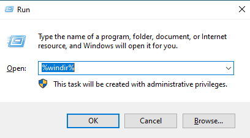

## 4.3. Thư mục `System32`

`System32` là một thư mục con rất quan trọng nằm trong thư mục Windows. Đường dẫn phổ biến của thư mục này là `C:\Windows\System32`.

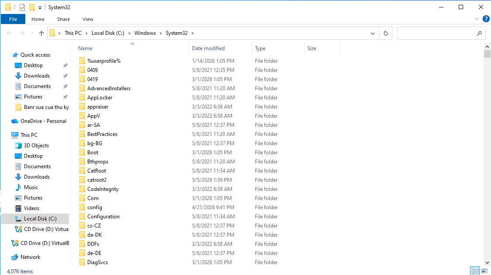

Thư mục này chứa nhiều tệp thực thi, thư viện hệ thống và công cụ quan trọng của Windows. Nhiều chương trình và lệnh hệ thống được gọi trực tiếp từ thư mục này khi người dùng thao tác trong Windows, Command Prompt hoặc PowerShell.

Một số loại tệp thường có trong `System32` gồm:

- tệp `.exe` của các công cụ hệ thống;
- tệp `.dll` chứa thư viện dùng chung;
- công cụ dòng lệnh;
- tiện ích quản trị;
- thành phần mạng;
- thành phần bảo mật;
- tệp cấu hình hệ thống.

Mặc dù có tên là `System32`, thư mục này vẫn rất quan trọng trên cả hệ điều hành Windows 64-bit. Đây là một trong những thư mục cốt lõi của Windows.


## 4.4. Vai trò của `System32`

Thư mục `System32` đóng vai trò trung tâm trong hoạt động của hệ điều hành Windows. Nhiều chức năng quan trọng của hệ thống phụ thuộc vào các tệp nằm trong thư mục này.

Vai trò chính của `System32` gồm:

- lưu trữ các chương trình hệ thống quan trọng;
- chứa thư viện DLL cần thiết cho Windows và ứng dụng;
- cung cấp công cụ quản trị hệ thống;
- hỗ trợ các lệnh trong Command Prompt;
- cung cấp tiện ích mạng;
- hỗ trợ cấu hình, giám sát và xử lý sự cố;
- chứa nhiều thành phần liên quan đến bảo mật.

Ví dụ, khi người dùng mở Command Prompt, Task Manager, Control Panel, System Information hoặc một số công cụ quản trị khác, Windows có thể gọi các tệp nằm trong `System32`.

Đối với quản trị viên hệ thống và người học an toàn thông tin, `System32` là một vị trí cần hiểu rõ vì nó chứa nhiều công cụ hợp pháp của Windows. Các công cụ này có thể được sử dụng cho quản trị, xử lý sự cố, điều tra bảo mật hoặc trong một số trường hợp bị kẻ tấn công lạm dụng.


## 4.5. Vì sao không nên xóa hoặc chỉnh sửa tùy tiện trong `System32`?

Không nên xóa hoặc chỉnh sửa tùy tiện trong `System32` vì đây là thư mục chứa nhiều thành phần cốt lõi của Windows. Nếu xóa nhầm hoặc thay đổi sai tệp trong thư mục này, hệ điều hành có thể gặp lỗi nghiêm trọng.

Một số hậu quả có thể xảy ra gồm:

- Windows hoạt động không ổn định;
- một số công cụ hệ thống không mở được;
- dịch vụ Windows bị lỗi;
- lỗi kết nối mạng;
- lỗi đăng nhập;
- lỗi cập nhật hệ thống;
- hệ điều hành không thể khởi động.

Ngoài ra, việc chỉnh sửa tùy tiện trong `System32` còn có thể tạo ra rủi ro bảo mật. Nếu một tệp hệ thống bị thay thế bằng tệp độc hại, kẻ tấn công có thể lợi dụng nó để duy trì quyền truy cập, leo thang đặc quyền hoặc che giấu hành vi độc hại.

Windows thường áp dụng cơ chế phân quyền để bảo vệ thư mục này. Người dùng thông thường không có toàn quyền chỉnh sửa nhiều tệp trong `System32`, nhằm giảm nguy cơ làm hỏng hệ thống.

Chỉ nên thao tác với `System32` khi:

- hiểu rõ tệp hoặc công cụ đang sử dụng;
- có quyền quản trị phù hợp;
- có hướng dẫn đáng tin cậy;
- đã sao lưu dữ liệu quan trọng;
- thao tác phục vụ mục đích quản trị, sửa lỗi hoặc điều tra hợp lệ.


## 4.6. Các công cụ Windows thường nằm trong `System32`

Nhiều công cụ quan trọng của Windows được lưu trong thư mục `System32`. Các công cụ này có thể được mở từ Start Menu, hộp thoại Run, Command Prompt hoặc PowerShell.

| Công cụ | Lệnh / tệp thực thi | Chức năng chính |
|---|---|---|
| Command Prompt | `cmd.exe` | Mở giao diện dòng lệnh của Windows |
| Control Panel | `control.exe` | Mở Bảng điều khiển |
| Task Manager | `taskmgr.exe` | Quản lý tiến trình và tài nguyên hệ thống |
| System Configuration | `msconfig.exe` | Cấu hình khởi động và dịch vụ |
| Computer Management | `compmgmt.msc` | Quản lý hệ thống tổng hợp |
| Event Viewer | `eventvwr.msc` | Xem nhật ký sự kiện Windows |
| Device Manager | `devmgmt.msc` | Quản lý thiết bị phần cứng |
| Disk Management | `diskmgmt.msc` | Quản lý ổ đĩa và phân vùng |
| Services | `services.msc` | Quản lý dịch vụ Windows |
| System Information | `msinfo32.exe` | Xem thông tin phần cứng và phần mềm |
| Resource Monitor | `resmon.exe` | Theo dõi CPU, RAM, Disk và Network |
| Registry Editor | `regedit.exe` | Xem và chỉnh sửa Windows Registry |
| Windows Defender Firewall | `WF.msc` | Cấu hình tường lửa nâng cao |
| IP Configuration | `ipconfig.exe` | Xem cấu hình mạng |
| Network Statistics | `netstat.exe` | Xem kết nối mạng và thống kê TCP/IP |

Các công cụ này rất hữu ích trong quản trị hệ thống, xử lý sự cố và phân tích bảo mật. Ví dụ, `eventvwr.msc` giúp kiểm tra log sự kiện, `taskmgr.exe` giúp xem tiến trình đang chạy, còn `ipconfig.exe` hỗ trợ kiểm tra cấu hình mạng.


# 5. Tài khoản người dùng, hồ sơ và quyền

## 5.1. Tài khoản người dùng trong Windows

Tài khoản người dùng trong Windows là danh tính được sử dụng để đăng nhập và làm việc trên hệ thống. Mỗi tài khoản đại diện cho một người dùng hoặc một đối tượng có quyền truy cập vào máy tính.

Thông qua tài khoản người dùng, Windows có thể xác định:

- ai đang đăng nhập vào hệ thống;
- người dùng đó được phép làm gì;
- người dùng có thể truy cập tệp hoặc thư mục nào;
- người dùng có quyền thay đổi cài đặt hệ thống hay không;
- hồ sơ cá nhân của người dùng được lưu ở đâu.

Trong Windows, tài khoản người dùng cục bộ thường được chia thành hai loại chính:

- **Administrator Account**;
- **Standard User Account**.

Loại tài khoản quyết định mức quyền của người dùng trên hệ thống. Người dùng có quyền quản trị có thể thay đổi nhiều thiết lập quan trọng, trong khi người dùng tiêu chuẩn bị giới hạn hơn để giảm rủi ro gây lỗi hoặc làm mất an toàn hệ thống.

Trong môi trường doanh nghiệp, tài khoản người dùng có thể được quản lý cục bộ trên từng máy hoặc được quản lý tập trung thông qua Active Directory.


## 5.2. Administrator Account

**Administrator Account** là tài khoản có quyền quản trị trên hệ thống Windows. Người dùng thuộc nhóm Administrator có thể thực hiện các thay đổi quan trọng ảnh hưởng đến toàn bộ máy tính.

Một tài khoản Administrator thường có thể:

- cài đặt và gỡ bỏ phần mềm;
- tạo tài khoản người dùng mới;
- xóa tài khoản người dùng;
- thay đổi loại tài khoản;
- thêm hoặc xóa người dùng khỏi nhóm;
- thay đổi cài đặt hệ thống;
- truy cập nhiều khu vực quản trị;
- thay đổi quyền truy cập của tệp và thư mục;
- chạy chương trình với quyền cao.

Tài khoản Administrator rất quan trọng trong quản trị hệ thống, nhưng cũng tiềm ẩn nhiều rủi ro nếu bị lạm dụng hoặc bị kẻ tấn công chiếm quyền. Nếu mã độc chạy dưới quyền Administrator, nó có thể gây thiệt hại lớn hơn nhiều so với khi chạy dưới quyền người dùng thông thường.

Vì vậy, trong thực tế, không nên sử dụng tài khoản Administrator cho các công việc hằng ngày như duyệt web, đọc email hoặc mở tệp không rõ nguồn gốc. Chỉ nên dùng quyền quản trị khi thật sự cần thiết.


## 5.3. Standard User Account

**Standard User Account** là tài khoản người dùng thông thường trong Windows. Tài khoản này được thiết kế để sử dụng cho các công việc hằng ngày nhưng không có toàn quyền thay đổi hệ thống.

Người dùng Standard User có thể thực hiện các tác vụ cơ bản như:

- đăng nhập vào Windows;
- sử dụng ứng dụng đã được cài đặt;
- tạo và chỉnh sửa tệp trong thư mục cá nhân;
- thay đổi một số thiết lập cá nhân;
- truy cập tài nguyên được cấp quyền.

Tuy nhiên, Standard User thường không thể:

- cài đặt phần mềm cho toàn hệ thống;
- thay đổi cài đặt bảo mật quan trọng;
- tạo hoặc xóa tài khoản người dùng khác;
- thay đổi nhóm người dùng;
- chỉnh sửa tệp hệ thống;
- truy cập dữ liệu của người dùng khác nếu không được cấp quyền.

Loại tài khoản này an toàn hơn cho việc sử dụng hằng ngày vì nó giới hạn quyền của người dùng. Nếu người dùng vô tình chạy một chương trình độc hại, chương trình đó cũng bị giới hạn bởi quyền của tài khoản hiện tại.

Trong an toàn thông tin, việc sử dụng Standard User cho công việc thường ngày là một nguyên tắc quan trọng để giảm nguy cơ leo thang đặc quyền và hạn chế tác động của mã độc.


## 5.4. Sự khác nhau giữa Administrator và Standard User

Administrator và Standard User khác nhau chủ yếu ở mức quyền trên hệ thống.

Administrator có quyền thay đổi các thiết lập cấp hệ thống, trong khi Standard User chỉ có quyền thao tác trong phạm vi cá nhân hoặc các tài nguyên đã được cấp quyền.

| Tiêu chí | Administrator | Standard User |
|---|---|---|
| Quyền cài đặt phần mềm | Có thể cài đặt phần mềm hệ thống | Thường không thể cài đặt nếu cần quyền quản trị |
| Quản lý người dùng | Có thể tạo, xóa, sửa tài khoản | Không thể quản lý tài khoản khác |
| Thay đổi cài đặt hệ thống | Có thể thay đổi | Bị giới hạn |
| Truy cập tệp hệ thống | Có nhiều quyền hơn | Bị hạn chế |
| Mức độ rủi ro khi bị mã độc lợi dụng | Cao hơn | Thấp hơn |
| Phù hợp cho | Quản trị hệ thống | Sử dụng hằng ngày |

Ví dụ, nếu một người dùng Standard User muốn cài đặt phần mềm yêu cầu quyền cao, Windows có thể hiển thị yêu cầu **User Account Control** để yêu cầu xác nhận hoặc nhập thông tin tài khoản quản trị.

Trong môi trường doanh nghiệp, người dùng thông thường nên sử dụng Standard User Account. Quyền Administrator chỉ nên cấp cho quản trị viên hoặc những người thật sự cần thực hiện nhiệm vụ quản trị.


## 5.5. User Profile là gì?

**User Profile** là hồ sơ cá nhân của người dùng trên Windows. Khi một tài khoản người dùng đăng nhập vào hệ thống lần đầu, Windows sẽ tạo một hồ sơ riêng cho tài khoản đó.

User Profile chứa các dữ liệu và thiết lập cá nhân của người dùng, ví dụ:

- Desktop;
- Documents;
- Downloads;
- Pictures;
- Music;
- cấu hình ứng dụng;
- thiết lập giao diện;
- một số dữ liệu cá nhân khác.

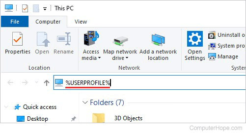

Nhờ User Profile, mỗi người dùng có thể có môi trường làm việc riêng trên cùng một máy tính. Ví dụ, mỗi người có Desktop riêng, thư mục tài liệu riêng và một số thiết lập cá nhân riêng.

Khi người dùng đăng nhập lần đầu, Windows sẽ chuẩn bị hồ sơ người dùng. Sau khi hồ sơ được tạo, hệ thống sẽ sử dụng hồ sơ đó cho các lần đăng nhập tiếp theo.

Trong quản trị hệ thống, User Profile rất quan trọng vì nó liên quan đến dữ liệu cá nhân, cấu hình ứng dụng và trải nghiệm làm việc của người dùng.


## 5.6. Thư mục `C:\Users`

`C:\Users` là thư mục mặc định chứa hồ sơ của các người dùng trên Windows.

Mỗi người dùng thường có một thư mục riêng bên trong `C:\Users`. Ví dụ, nếu tài khoản có tên là `Max`, thư mục hồ sơ của người dùng đó thường là:

```text
C:\Users\Max
````

Trong thư mục này, Windows lưu các thư mục và dữ liệu cá nhân của người dùng. Đây là nơi chứa Desktop, Documents, Downloads và nhiều dữ liệu cấu hình liên quan đến tài khoản.

Ví dụ cấu trúc cơ bản có thể như sau:

```text
C:\Users
├── Administrator
├── Public
├── Max
└── User01
```

Thư mục `C:\Users` giúp Windows tách biệt dữ liệu giữa các tài khoản khác nhau. Người dùng này thường không thể truy cập dữ liệu riêng của người dùng khác nếu không có quyền phù hợp.

Từ góc độ bảo mật, thư mục `C:\Users` là nơi quan trọng vì nó thường chứa dữ liệu cá nhân, tài liệu làm việc, tệp tải xuống và có thể cả dữ liệu nhạy cảm.

## 5.7. Các thư mục mặc định trong hồ sơ người dùng

Khi Windows tạo hồ sơ người dùng, hệ thống thường tạo sẵn một số thư mục mặc định để phục vụ việc lưu trữ dữ liệu cá nhân.

Các thư mục thường gặp gồm:

| Thư mục   | Chức năng                                                      |
| --------- | -------------------------------------------------------------- |
| Desktop   | Chứa các biểu tượng, shortcut và tệp nằm trên màn hình Desktop |
| Documents | Lưu trữ tài liệu cá nhân hoặc tài liệu làm việc                |
| Downloads | Lưu các tệp được tải xuống từ Internet                         |
| Pictures  | Lưu trữ hình ảnh                                               |
| Music     | Lưu trữ tệp âm thanh                                           |
| Videos    | Lưu trữ video                                                  |
| AppData   | Chứa dữ liệu cấu hình và dữ liệu ứng dụng của người dùng       |

Ví dụ, nếu người dùng có tên `Max`, thư mục Downloads của người dùng đó thường là:

```text
C:\Users\Max\Downloads
```

Trong điều tra bảo mật, một số thư mục trong User Profile rất đáng chú ý. Ví dụ, thư mục `Downloads` có thể chứa tệp tải từ Internet, thư mục `Desktop` có thể chứa tài liệu người dùng thường mở, còn `AppData` có thể chứa dữ liệu ứng dụng hoặc tệp được phần mềm tạo ra.

Vì vậy, hiểu cấu trúc User Profile giúp quản trị viên và chuyên viên SOC phân tích hoạt động người dùng tốt hơn.

## 5.8. Local Users and Groups

**Local Users and Groups** là công cụ quản lý người dùng và nhóm cục bộ trên một máy Windows. Công cụ này cho phép quản trị viên xem, tạo, sửa, xóa tài khoản người dùng và quản lý tư cách thành viên trong các nhóm cục bộ.

Trong Local Users and Groups, có hai phần chính:

* **Users**;
* **Groups**.

Phần Users chứa danh sách các tài khoản người dùng cục bộ trên máy. Phần Groups chứa các nhóm cục bộ, mỗi nhóm có một tập quyền hoặc vai trò nhất định.

Thông qua công cụ này, quản trị viên có thể:

* xem danh sách người dùng cục bộ;
* tạo người dùng mới;
* đổi mật khẩu;
* vô hiệu hóa tài khoản;
* thêm người dùng vào nhóm;
* xóa người dùng khỏi nhóm;
* kiểm tra mô tả và thuộc tính tài khoản.

Local Users and Groups thường được sử dụng khi quản trị một máy Windows độc lập hoặc khi cần kiểm tra tài khoản cục bộ trên máy trong môi trường domain.

## 5.9. Công cụ `lusrmgr.msc`

`lusrmgr.msc` là lệnh dùng để mở công cụ **Local Users and Groups** trong Windows.

Có thể mở công cụ này bằng cách:

1. Nhấn `Win + R` để mở hộp thoại Run.
2. Nhập lệnh:

```text
lusrmgr.msc
```

3. Nhấn Enter.

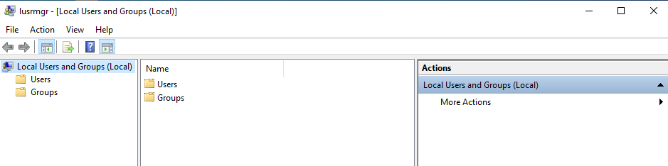

Sau khi mở, cửa sổ Local Users and Groups sẽ hiển thị hai thư mục chính:

* **Users**;
* **Groups**.

Trong **Users**, quản trị viên có thể xem các tài khoản người dùng cục bộ. Trong **Groups**, quản trị viên có thể xem các nhóm cục bộ và thành viên của từng nhóm.

Công cụ `lusrmgr.msc` rất hữu ích khi cần kiểm tra nhanh tài khoản nào đang tồn tại trên máy, người dùng thuộc nhóm nào và có tài khoản lạ nào được tạo bất thường hay không.

Lưu ý rằng công cụ này thường yêu cầu quyền quản trị để thực hiện các thay đổi quan trọng.

## 5.10. Users và Groups

Trong Windows, **Users** là các tài khoản người dùng, còn **Groups** là các nhóm dùng để quản lý quyền cho nhiều người dùng cùng lúc.

Thay vì cấp quyền riêng lẻ cho từng người dùng, Windows cho phép đưa nhiều người dùng vào một nhóm. Sau đó, quyền được cấp cho nhóm sẽ áp dụng cho tất cả thành viên của nhóm đó.

Ví dụ:

* người dùng thuộc nhóm `Administrators` sẽ có quyền quản trị;
* người dùng thuộc nhóm `Users` sẽ có quyền thông thường;
* người dùng thuộc nhóm `Remote Desktop Users` có thể được phép đăng nhập từ xa qua Remote Desktop nếu cấu hình cho phép.

Việc sử dụng nhóm giúp quản lý quyền dễ dàng hơn. Khi một người dùng mới cần quyền giống những người khác, quản trị viên chỉ cần thêm người đó vào nhóm phù hợp.

Một người dùng có thể là thành viên của nhiều nhóm. Khi đó, quyền thực tế của người dùng sẽ phụ thuộc vào các nhóm mà họ thuộc về và các chính sách bảo mật đang áp dụng.

Trong an toàn thông tin, cần kiểm tra kỹ thành viên của các nhóm có quyền cao, đặc biệt là nhóm `Administrators`, vì nếu tài khoản không phù hợp nằm trong nhóm này, hệ thống có thể bị rủi ro nghiêm trọng.

## 5.11. Quyền kế thừa từ nhóm người dùng

Quyền kế thừa từ nhóm người dùng là cơ chế trong đó một người dùng nhận quyền dựa trên nhóm mà họ thuộc về.

Ví dụ, nếu tài khoản `user01` được thêm vào nhóm `Remote Desktop Users`, tài khoản này có thể được cấp quyền đăng nhập từ xa nếu hệ thống cho phép Remote Desktop. Nếu tài khoản được thêm vào nhóm `Administrators`, người dùng sẽ có quyền quản trị trên máy.

Cơ chế này giúp đơn giản hóa việc quản lý quyền. Thay vì cấu hình quyền riêng cho từng người dùng, quản trị viên chỉ cần quản lý tư cách thành viên của các nhóm.

Ví dụ:

```text
Người dùng A → thuộc nhóm Users → có quyền người dùng thông thường
Người dùng B → thuộc nhóm Administrators → có quyền quản trị
Người dùng C → thuộc nhóm Remote Desktop Users → có thể được phép truy cập từ xa
```

Tuy nhiên, quyền kế thừa từ nhóm cũng có thể gây rủi ro nếu quản lý không cẩn thận. Một người dùng bị thêm nhầm vào nhóm có quyền cao có thể thực hiện các thao tác vượt quá phạm vi cần thiết.

Vì vậy, trong quản trị và bảo mật Windows, cần thường xuyên kiểm tra:

* người dùng thuộc những nhóm nào;
* nhóm nào có quyền cao;
* có tài khoản lạ trong nhóm quản trị hay không;
* quyền cấp cho nhóm có phù hợp với công việc thực tế hay không.

Nguyên tắc nên áp dụng là **least privilege**, tức là chỉ cấp quyền tối thiểu cần thiết để người dùng thực hiện công việc.

## 5.12. Các tài khoản tích hợp sẵn trong Windows

Windows có một số tài khoản tích hợp sẵn được tạo mặc định để phục vụ cho hoạt động và quản trị hệ thống. Các tài khoản này có vai trò đặc biệt và cần được quản lý cẩn thận.

Một số tài khoản tích hợp thường gặp gồm:

| Tài khoản       | Ý nghĩa                                               |
| --------------- | ----------------------------------------------------- |
| Administrator   | Tài khoản quản trị tích hợp sẵn                       |
| Guest           | Tài khoản dành cho truy cập khách                     |
| DefaultAccount  | Tài khoản mặc định dùng cho một số chức năng hệ thống |
| SYSTEM          | Tài khoản hệ thống có quyền rất cao                   |
| Local Service   | Tài khoản dịch vụ cục bộ với quyền hạn chế            |
| Network Service | Tài khoản dịch vụ dùng cho một số hoạt động mạng      |

Tài khoản **Administrator** là tài khoản quản trị tích hợp sẵn. Tài khoản này có quyền cao và có thể thực hiện nhiều thay đổi quan trọng trên hệ thống. Vì vậy, cần bảo vệ bằng mật khẩu mạnh và chỉ sử dụng khi cần thiết.

Tài khoản **Guest** được thiết kế cho truy cập khách. Trong nhiều hệ thống hiện đại, tài khoản này thường bị vô hiệu hóa để giảm rủi ro bảo mật.

Các tài khoản như **SYSTEM**, **Local Service** và **Network Service** thường được sử dụng bởi hệ điều hành và các dịch vụ nền. Người dùng thông thường không đăng nhập trực tiếp bằng các tài khoản này.

Từ góc độ bảo mật, các tài khoản tích hợp sẵn cần được kiểm tra định kỳ. Đặc biệt, không nên bật tài khoản Guest nếu không cần thiết và cần hạn chế sử dụng tài khoản Administrator cho các tác vụ hằng ngày.


# 6. User Account Control — UAC

## 6.1. UAC là gì?

**User Account Control**, viết tắt là **UAC**, là một cơ chế bảo mật trong Windows dùng để kiểm soát việc thực thi các tác vụ cần quyền cao trên hệ thống.

UAC giúp ngăn người dùng hoặc chương trình tự ý thực hiện các thay đổi quan trọng mà không có sự xác nhận. Khi một hành động yêu cầu quyền quản trị, Windows sẽ hiển thị thông báo yêu cầu người dùng xác nhận hoặc nhập thông tin tài khoản Administrator.

Ví dụ, UAC có thể xuất hiện khi người dùng:

- cài đặt phần mềm mới;
- thay đổi cài đặt hệ thống;
- chỉnh sửa tệp trong thư mục hệ thống;
- chạy chương trình với quyền Administrator;
- thay đổi cấu hình bảo mật;
- thêm hoặc xóa tài khoản người dùng.

Mục đích chính của UAC là giảm nguy cơ phần mềm độc hại tự động chạy với quyền cao. Nhờ UAC, ngay cả khi người dùng đang đăng nhập bằng tài khoản có quyền quản trị, các chương trình vẫn không tự động có toàn quyền đối với hệ thống nếu chưa được xác nhận.


## 6.2. Vì sao Windows cần UAC?

Windows cần UAC vì nhiều người dùng thường đăng nhập bằng tài khoản có quyền quản trị. Nếu mọi chương trình đều tự động chạy với quyền quản trị, hệ thống sẽ rất dễ bị tấn công.

Khi không có UAC, một chương trình độc hại có thể âm thầm thực hiện các hành động nguy hiểm như:

- cài đặt mã độc;
- thay đổi cấu hình hệ thống;
- chỉnh sửa Registry;
- vô hiệu hóa phần mềm bảo mật;
- tạo tài khoản mới;
- thay đổi quyền truy cập;
- xóa hoặc sửa tệp hệ thống.

UAC giúp giảm rủi ro này bằng cách yêu cầu người dùng xác nhận trước khi một tác vụ có quyền cao được thực hiện.

Nói cách khác, UAC tạo thêm một lớp kiểm soát giữa người dùng, ứng dụng và hệ điều hành. Điều này giúp hạn chế việc mã độc lợi dụng quyền của người dùng đang đăng nhập.

Trong an toàn thông tin, UAC là một cơ chế quan trọng vì nó hỗ trợ nguyên tắc **least privilege**, tức là chỉ sử dụng quyền cao khi thật sự cần thiết.


## 6.3. Cách UAC hoạt động

Khi một người dùng có quyền Administrator đăng nhập vào Windows, phiên làm việc thông thường không tự động chạy với quyền cao nhất. Thay vào đó, Windows sẽ chạy hầu hết tác vụ ở mức quyền tiêu chuẩn.

Khi một chương trình hoặc tác vụ cần quyền quản trị, UAC sẽ can thiệp và hiển thị thông báo xác nhận. Người dùng phải đồng ý hoặc cung cấp thông tin đăng nhập của tài khoản quản trị thì tác vụ mới được tiếp tục.

Quy trình cơ bản của UAC có thể hiểu như sau:

1. Người dùng hoặc chương trình yêu cầu thực hiện một tác vụ cần quyền cao.
2. Windows phát hiện tác vụ này cần quyền Administrator.
3. UAC hiển thị hộp thoại xác nhận.
4. Người dùng xác nhận hoặc nhập thông tin tài khoản quản trị.
5. Nếu được chấp nhận, tác vụ chạy với quyền cao.
6. Nếu bị từ chối, tác vụ không được thực hiện.

Cơ chế này giúp người dùng nhận biết khi có chương trình đang cố gắng thay đổi hệ thống. Nếu UAC xuất hiện bất thường khi người dùng không chủ động thực hiện thao tác nào, đó có thể là dấu hiệu cần kiểm tra kỹ.

Hãy xem xét chương trình trên tài khoản bạn hiện đang đăng nhập. Đối với tài khoản quản trị viên tích hợp sẵn, nhấp chuột phải để xem Properties (Thuộc tính).

Trong tab Security (Bảo mật), bạn có thể thấy danh sách người dùng/nhóm và quyền của họ đối với tệp. Lưu ý rằng người dùng thông thường không được liệt kê ở đây.

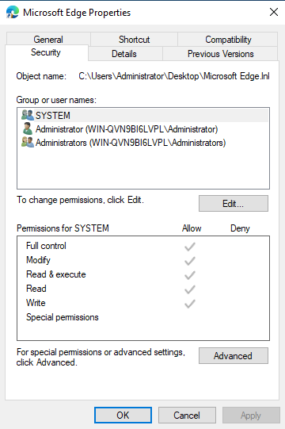

## 6.4. Elevated Privileges

**Elevated Privileges** có nghĩa là quyền được nâng cao, thường là quyền Administrator trong Windows.

Một chương trình chạy với Elevated Privileges có thể thực hiện nhiều thao tác quan trọng hơn so với chương trình chạy dưới quyền người dùng thông thường.

Ví dụ, chương trình chạy với quyền cao có thể:

- ghi vào thư mục hệ thống;
- thay đổi Registry;
- cài đặt driver;
- thay đổi cấu hình bảo mật;
- quản lý dịch vụ Windows;
- thay đổi tài khoản người dùng;
- chỉnh sửa quyền truy cập.

Không phải tác vụ nào cũng cần Elevated Privileges. Các công việc thông thường như duyệt web, soạn thảo văn bản, xem tài liệu hoặc nghe nhạc không cần quyền quản trị.

Việc chỉ sử dụng quyền cao khi cần thiết giúp giảm rủi ro bảo mật. Nếu một ứng dụng độc hại chỉ chạy với quyền người dùng thông thường, thiệt hại có thể bị giới hạn. Nhưng nếu ứng dụng đó chạy với quyền Administrator, nó có thể kiểm soát nhiều phần quan trọng của hệ thống.


## 6.5. Biểu tượng lá chắn UAC

Biểu tượng lá chắn UAC là biểu tượng hình chiếc khiên xuất hiện trên một số chương trình hoặc nút chức năng trong Windows.

Biểu tượng này cho biết thao tác đó cần quyền quản trị để chạy. Khi người dùng nhấp vào chương trình hoặc chức năng có biểu tượng lá chắn, Windows thường sẽ hiển thị UAC Prompt để yêu cầu xác nhận.

Ví dụ, biểu tượng lá chắn có thể xuất hiện khi:

- chạy trình cài đặt phần mềm;
- mở một công cụ quản trị;
- thay đổi cài đặt hệ thống;
- mở chương trình với quyền Administrator;
- thực hiện thao tác ảnh hưởng đến toàn bộ máy tính.

Biểu tượng lá chắn giúp người dùng nhận biết trước rằng hành động sắp thực hiện không phải là thao tác thông thường. Đây là dấu hiệu trực quan để cảnh báo rằng chương trình có thể thay đổi hệ thống.

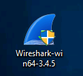

Nếu một tệp lạ hoặc phần mềm không rõ nguồn gốc có biểu tượng lá chắn và yêu cầu quyền Administrator, người dùng cần kiểm tra cẩn thận trước khi cho phép chạy.

## 6.6. UAC Prompt

**UAC Prompt** là hộp thoại xác nhận xuất hiện khi một chương trình hoặc tác vụ cần quyền cao.

Tùy theo loại tài khoản đang sử dụng, UAC Prompt có thể hoạt động khác nhau:

- Nếu người dùng đang dùng tài khoản Administrator, Windows có thể chỉ yêu cầu xác nhận.
- Nếu người dùng đang dùng tài khoản Standard User, Windows có thể yêu cầu nhập tên người dùng và mật khẩu của tài khoản Administrator.

UAC Prompt thường hiển thị thông tin như:

- tên chương trình muốn chạy;
- nhà phát hành chương trình;
- vị trí hoặc nguồn của chương trình;
- yêu cầu cho phép chương trình thay đổi hệ thống.

Người dùng chỉ nên chọn **Yes** nếu chắc chắn chương trình đáng tin cậy và hành động đó là cần thiết. Nếu không rõ chương trình là gì, hoặc UAC Prompt xuất hiện bất ngờ, nên chọn **No**.


Trong thực tế, UAC Prompt là một điểm kiểm soát quan trọng giúp người dùng tránh vô tình cấp quyền cao cho mã độc hoặc chương trình không an toàn.


## 6.7. Cài đặt UAC

Windows cho phép người dùng thay đổi mức độ thông báo của UAC thông qua phần **User Account Control Settings**.

Các mức cài đặt UAC thường cho phép điều chỉnh việc Windows sẽ thông báo khi nào. Ví dụ:

- luôn thông báo khi ứng dụng cố gắng cài đặt phần mềm hoặc thay đổi hệ thống;
- chỉ thông báo khi ứng dụng cố gắng thay đổi hệ thống;
- không thông báo trong một số trường hợp nhất định;
- tắt gần như hoàn toàn thông báo UAC.

Mức khuyến nghị thường là giữ UAC ở chế độ mặc định hoặc mức bảo vệ cao hơn. Điều này giúp hệ thống vẫn có cảnh báo khi có chương trình yêu cầu quyền Administrator.

Không nên giảm mức UAC hoặc tắt UAC nếu không có lý do rõ ràng, vì điều đó có thể làm giảm khả năng bảo vệ của Windows trước các chương trình độc hại.


## 6.8. Thay đổi UAC Settings

Có thể mở phần cài đặt UAC bằng nhiều cách khác nhau.

Một cách phổ biến là tìm kiếm trong Start Menu:

1. Mở **Start Menu**.
2. Nhập `UAC`.
3. Chọn **Change User Account Control settings**.
4. Điều chỉnh thanh trượt theo mức mong muốn.
5. Nhấn **OK** để lưu thay đổi.

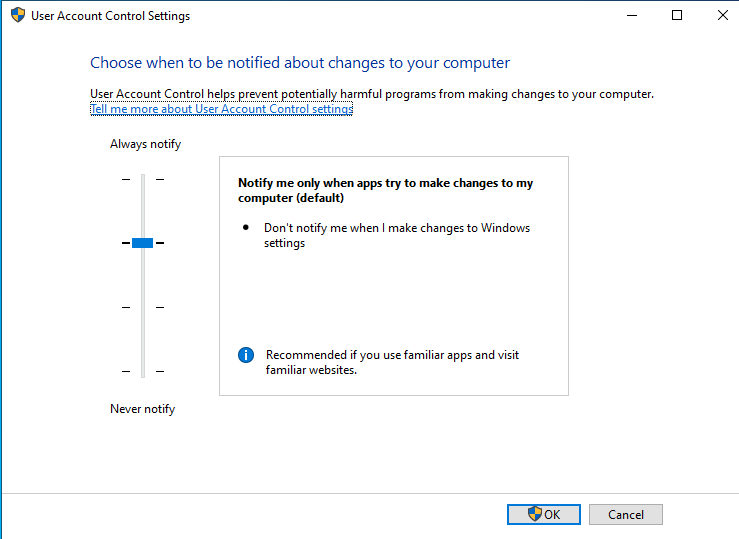

Ngoài ra, có thể mở nhanh bằng lệnh:

```text
UserAccountControlSettings.exe
```

Trong cửa sổ UAC Settings, Windows hiển thị một thanh trượt cho phép thay đổi mức độ thông báo. Khi di chuyển thanh trượt, Windows sẽ mô tả ý nghĩa của từng mức.

Về mặt bảo mật, nên giữ UAC ở mức mặc định hoặc mức cao hơn. Chỉ nên thay đổi cài đặt này nếu hiểu rõ ảnh hưởng của nó đến hệ thống.

## 6.9. Rủi ro khi tắt UAC

Tắt UAC có thể làm hệ thống dễ bị tấn công hơn. Khi UAC bị tắt hoặc cấu hình quá thấp, các chương trình có thể thực hiện thay đổi quan trọng mà không cần người dùng xác nhận rõ ràng.

Một số rủi ro khi tắt UAC gồm:

* mã độc dễ chạy với quyền cao hơn;
* phần mềm lạ có thể thay đổi hệ thống mà không bị cảnh báo;
* Registry có thể bị chỉnh sửa trái phép;
* dịch vụ bảo mật có thể bị vô hiệu hóa;
* tài khoản người dùng hoặc nhóm có thể bị thay đổi;
* hệ thống khó phát hiện hành vi bất thường hơn.

Trong môi trường doanh nghiệp, việc tắt UAC có thể làm tăng rủi ro bị tấn công, đặc biệt nếu người dùng thường xuyên mở email, tải tệp từ Internet hoặc chạy phần mềm từ nguồn không rõ ràng.

Từ góc độ an toàn thông tin, UAC không phải là cơ chế bảo vệ tuyệt đối, nhưng nó là một lớp phòng thủ quan trọng. Vì vậy, không nên tắt UAC trừ khi có yêu cầu kỹ thuật đặc biệt và đã có biện pháp kiểm soát thay thế phù hợp.

# 7. Settings và Control Panel

## 7.1. Windows Settings

**Windows Settings** là ứng dụng cài đặt hiện đại của Windows, được Microsoft thiết kế để người dùng dễ dàng thay đổi các thiết lập cơ bản của hệ điều hành.

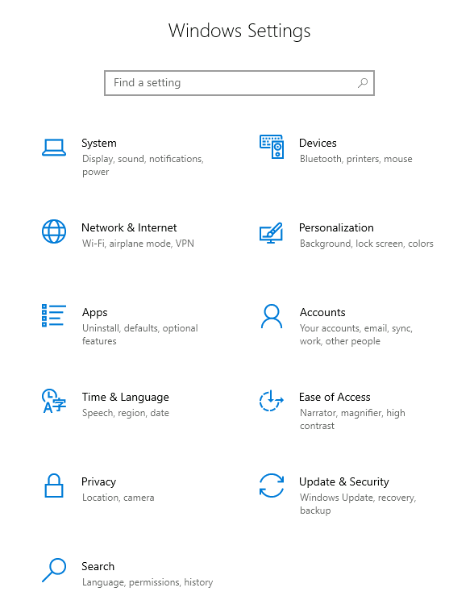

Thông qua Windows Settings, người dùng có thể cấu hình nhiều thành phần như:

- hệ thống hiển thị;
- âm thanh;
- thiết bị;
- mạng và Internet;
- tài khoản người dùng;
- cá nhân hóa giao diện;
- cập nhật Windows;
- quyền riêng tư;
- bảo mật hệ thống.

Windows Settings có giao diện đơn giản, trực quan và phù hợp với người dùng phổ thông. Trong các phiên bản Windows mới như Windows 10 và Windows 11, Microsoft dần chuyển nhiều chức năng từ Control Panel sang Settings.

Một số mục thường gặp trong Windows Settings gồm:

| Nhóm thiết lập | Chức năng chính |
|---|---|
| System | Cài đặt màn hình, âm thanh, thông báo, nguồn điện |
| Devices | Quản lý Bluetooth, máy in, chuột, bàn phím |
| Network & Internet | Cấu hình Wi-Fi, Ethernet, VPN, proxy |
| Personalization | Thay đổi hình nền, màu sắc, theme, Taskbar |
| Apps | Quản lý ứng dụng đã cài đặt |
| Accounts | Quản lý tài khoản người dùng |
| Time & Language | Cấu hình ngày giờ, ngôn ngữ, bàn phím |
| Update & Security | Windows Update, Recovery, Windows Security |

Windows Settings thường được sử dụng cho các thao tác cấu hình cơ bản và nhanh chóng.


## 7.2. Control Panel

**Control Panel** là công cụ cấu hình truyền thống của Windows. Đây là nơi tập trung nhiều thiết lập hệ thống quan trọng, đặc biệt là các thiết lập nâng cao và các công cụ quản trị cũ.

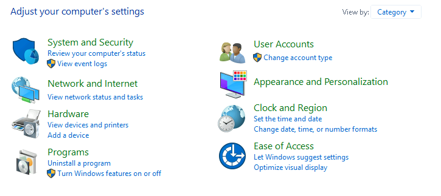

Control Panel đã tồn tại trong Windows từ lâu và vẫn được giữ lại trong các phiên bản Windows hiện đại vì nhiều tính năng chưa được chuyển hoàn toàn sang Windows Settings.

Thông qua Control Panel, người dùng có thể cấu hình:

- hệ thống và bảo mật;
- mạng và Internet;
- phần cứng và âm thanh;
- chương trình;
- tài khoản người dùng;
- giao diện;
- đồng hồ và khu vực;
- công cụ trợ năng.

Control Panel thường được sử dụng khi cần truy cập các thiết lập chi tiết hơn, ví dụ như cấu hình adapter mạng, mở Windows Defender Firewall, quản lý thiết bị, gỡ chương trình hoặc thay đổi một số thiết lập hệ thống nâng cao.

Trong quản trị Windows, Control Panel vẫn là công cụ quan trọng vì nhiều hướng dẫn kỹ thuật và công cụ hệ thống vẫn liên quan đến giao diện này.


## 7.3. Sự khác nhau giữa Settings và Control Panel

Windows Settings và Control Panel đều dùng để thay đổi cấu hình hệ thống, nhưng chúng khác nhau về giao diện, mục đích sử dụng và mức độ chi tiết.

| Tiêu chí | Windows Settings | Control Panel |
|---|---|---|
| Giao diện | Hiện đại, đơn giản | Truyền thống, nhiều mục chi tiết |
| Đối tượng phù hợp | Người dùng phổ thông | Người dùng nâng cao, quản trị viên |
| Mức độ thiết lập | Các cài đặt phổ biến | Nhiều cài đặt nâng cao |
| Xu hướng phát triển | Được Microsoft ưu tiên trong Windows mới | Dần được thay thế nhưng vẫn còn quan trọng |
| Ví dụ sử dụng | Đổi hình nền, cấu hình Wi-Fi, Windows Update | Cấu hình adapter mạng, firewall nâng cao, chương trình cũ |

Windows Settings phù hợp khi cần thay đổi nhanh các thiết lập thường dùng. Control Panel phù hợp hơn khi cần truy cập các cấu hình truyền thống hoặc các công cụ quản trị chi tiết.

Trong thực tế, người dùng Windows nên biết sử dụng cả hai vì có những thiết lập chỉ dễ tìm trong Settings, nhưng cũng có những thiết lập vẫn cần mở Control Panel.


## 7.4. Cách mở Settings

Có nhiều cách để mở Windows Settings.

Cách nhanh nhất là sử dụng tổ hợp phím:

```text
Win + I
```

Ngoài ra, có thể mở Settings bằng các cách sau:

1. Nhấn nút **Start**.
2. Chọn biểu tượng **Settings** hình bánh răng.

Hoặc:

1. Nhấn **Start**.
2. Gõ từ khóa `Settings`.
3. Chọn ứng dụng **Settings**.

Cũng có thể mở Settings bằng cách nhấp chuột phải vào một số khu vực của giao diện Windows. Ví dụ:

* nhấp chuột phải trên Desktop rồi chọn **Display settings**;
* nhấp chuột phải trên Desktop rồi chọn **Personalize**;
* nhấp chuột phải vào biểu tượng mạng rồi chọn **Network & Internet settings**.

Windows Settings thường được dùng khi cần truy cập nhanh các thiết lập cơ bản của hệ thống.

## 7.5. Cách mở Control Panel

Có nhiều cách để mở Control Panel trong Windows.

Cách phổ biến nhất là dùng Start Menu:

1. Nhấn **Start**.
2. Nhập từ khóa:

```text
Control Panel
```

3. Chọn **Control Panel** trong kết quả tìm kiếm.

Cách khác là dùng hộp thoại Run:

1. Nhấn tổ hợp phím:

```text
Win + R
```

2. Nhập lệnh:

```text
control
```

3. Nhấn **Enter**.

Ngoài ra, có thể mở Control Panel từ Command Prompt hoặc PowerShell bằng lệnh:

```text
control
```

Khi Control Panel mở ra, người dùng có thể chọn chế độ hiển thị theo **Category**, **Large icons** hoặc **Small icons**. Chế độ **Small icons** thường hữu ích hơn cho người học quản trị hệ thống vì nó hiển thị nhiều công cụ trực tiếp hơn.

## 7.6. Các nhóm thiết lập trong Control Panel

Control Panel chia các thiết lập thành nhiều nhóm khác nhau. Mỗi nhóm chứa các công cụ liên quan đến một lĩnh vực cấu hình của Windows.

Các nhóm thiết lập thường gặp gồm:

| Nhóm thiết lập                 | Chức năng chính                                       |
| ------------------------------ | ----------------------------------------------------- |
| System and Security            | Bảo mật, Windows Defender Firewall, hệ thống, sao lưu |
| Network and Internet           | Cấu hình mạng, chia sẻ, adapter mạng                  |
| Hardware and Sound             | Thiết bị, máy in, âm thanh, nguồn điện                |
| Programs                       | Gỡ cài đặt chương trình, bật/tắt tính năng Windows    |
| User Accounts                  | Quản lý tài khoản người dùng                          |
| Appearance and Personalization | Giao diện, File Explorer Options, font                |
| Clock and Region               | Ngày giờ, khu vực, định dạng ngôn ngữ                 |
| Ease of Access                 | Công cụ hỗ trợ truy cập                               |

Trong chế độ **Small icons**, Control Panel có thể hiển thị trực tiếp nhiều công cụ như:

* Administrative Tools;
* BitLocker Drive Encryption;
* Device Manager;
* File Explorer Options;
* Internet Options;
* Network and Sharing Center;
* Programs and Features;
* System;
* Windows Defender Firewall.

Một điểm cần chú ý là **Windows Defender Firewall** thường nằm trong Control Panel và có thể được mở nhanh khi cần cấu hình tường lửa của Windows.

## 7.7. Network & Internet Settings

**Network & Internet Settings** là phần cài đặt mạng trong Windows Settings. Đây là nơi người dùng có thể xem và cấu hình trạng thái kết nối mạng của máy tính.

Trong Network & Internet Settings, người dùng có thể kiểm tra:

* trạng thái kết nối mạng;
* kết nối Ethernet;
* kết nối Wi-Fi;
* VPN;
* Proxy;
* dữ liệu sử dụng;
* thiết lập chia sẻ mạng;
* các tùy chọn mạng nâng cao.

Ví dụ, khi máy tính không truy cập được Internet, người dùng có thể mở Network & Internet Settings để kiểm tra máy đang kết nối qua Wi-Fi hay Ethernet, có nhận địa chỉ IP hay không, hoặc có đang dùng proxy/VPN không.

Đối với người học an toàn thông tin, phần này rất quan trọng vì cấu hình mạng ảnh hưởng trực tiếp đến khả năng kết nối, giám sát, phân tích log và xử lý sự cố.

Một số tình huống thường cần mở Network & Internet Settings gồm:

* kiểm tra trạng thái mạng;
* thay đổi mạng Wi-Fi;
* cấu hình VPN;
* kiểm tra proxy;
* mở phần cấu hình adapter mạng;
* xử lý lỗi mất kết nối Internet.

## 7.8. Change Adapter Options

**Change Adapter Options** là mục dùng để mở danh sách các card mạng trên Windows. Từ đây, người dùng có thể xem và cấu hình các adapter mạng như Ethernet, Wi-Fi, VPN hoặc adapter ảo.

Để mở Change Adapter Options:

1. Mở **Settings**.
2. Chọn **Network & Internet**.
3. Chọn **Change adapter options** hoặc **Advanced network settings** tùy phiên bản Windows.

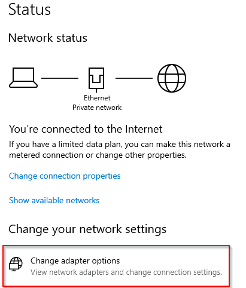

Trong cửa sổ Network Connections, người dùng có thể:

* bật hoặc tắt adapter mạng;
* xem trạng thái kết nối;
* đổi tên adapter;
* mở Properties của adapter;
* cấu hình IPv4 hoặc IPv6;
* kiểm tra DNS;
* cấu hình gateway;
* kiểm tra thông tin kết nối mạng.

Ví dụ, để cấu hình địa chỉ IP tĩnh, người dùng có thể:

1. Nhấp chuột phải vào adapter mạng.
2. Chọn **Properties**.
3. Chọn **Internet Protocol Version 4 (TCP/IPv4)**.
4. Nhấn **Properties**.
5. Nhập địa chỉ IP, subnet mask, default gateway và DNS server.

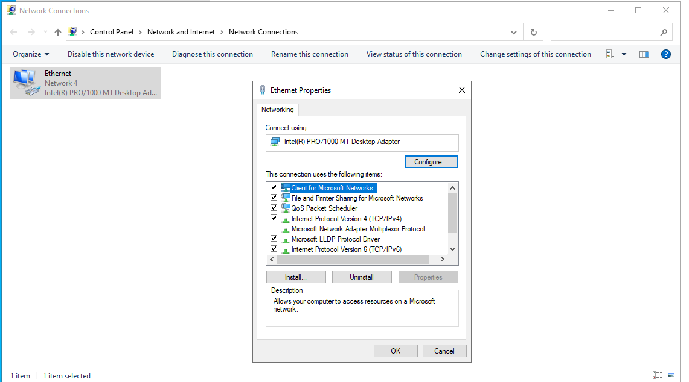

Trong môi trường lab an toàn thông tin, Change Adapter Options rất hay được sử dụng để cấu hình địa chỉ IP cho máy ảo, card mạng Host-only, NAT hoặc mạng nội bộ.

## 7.9. Khi nào nên dùng Settings?

Nên dùng Windows Settings khi cần thực hiện các thao tác cấu hình cơ bản, nhanh và phổ biến.

Một số trường hợp nên dùng Settings gồm:

* thay đổi hình nền;
* thay đổi độ phân giải màn hình;
* cấu hình Wi-Fi;
* kiểm tra trạng thái mạng;
* thêm thiết bị Bluetooth;
* quản lý ứng dụng;
* kiểm tra Windows Update;
* cấu hình tài khoản người dùng cơ bản;
* thay đổi ngôn ngữ và thời gian;
* mở Windows Security.

Windows Settings phù hợp với người dùng phổ thông vì giao diện rõ ràng, dễ tìm kiếm và dễ thao tác. Trong Windows 10 và Windows 11, nhiều chức năng mới được Microsoft ưu tiên đưa vào Settings.

Đối với người học cơ bản, nên bắt đầu từ Settings trước vì đây là giao diện đơn giản hơn. Sau đó, khi cần cấu hình sâu hơn, có thể chuyển sang Control Panel hoặc các công cụ quản trị khác.

## 7.10. Khi nào nên dùng Control Panel?

Nên dùng Control Panel khi cần truy cập các thiết lập truyền thống, thiết lập nâng cao hoặc các công cụ quản trị chưa được chuyển hoàn toàn sang Settings.

Một số trường hợp nên dùng Control Panel gồm:

* cấu hình Windows Defender Firewall;
* mở Network and Sharing Center;
* thay đổi thiết lập adapter mạng chi tiết;
* gỡ chương trình bằng Programs and Features;
* cấu hình Power Options nâng cao;
* mở Device Manager;
* cấu hình BitLocker;
* truy cập Administrative Tools;
* thay đổi File Explorer Options;
* cấu hình một số thiết lập hệ thống cũ.

Control Panel đặc biệt hữu ích với quản trị viên hệ thống, người học Windows nâng cao và người làm an toàn thông tin. Nhiều hướng dẫn kỹ thuật, bài lab và công cụ quản trị vẫn sử dụng Control Panel.

Tóm lại, có thể hiểu đơn giản như sau:

* dùng **Settings** cho các cài đặt cơ bản, nhanh và hiện đại;
* dùng **Control Panel** cho các cài đặt chi tiết, truyền thống và nâng cao.

# 8. Task Manager

## 8.1. Task Manager là gì?

**Task Manager** là công cụ quản lý tác vụ của Windows. Công cụ này cho phép người dùng xem các chương trình, tiến trình và dịch vụ đang chạy trên hệ thống.


Thông qua Task Manager, người dùng có thể theo dõi tình trạng sử dụng tài nguyên của máy tính như CPU, RAM, ổ đĩa và mạng. Đây là một công cụ rất quan trọng khi cần kiểm tra hiệu suất hệ thống hoặc xử lý sự cố.

Task Manager thường được dùng để:

- xem ứng dụng nào đang chạy;
- kiểm tra tiến trình đang sử dụng nhiều tài nguyên;
- đóng chương trình bị treo;
- theo dõi CPU, RAM, Disk và Network;
- kiểm tra ứng dụng khởi động cùng Windows;
- xem thông tin người dùng đang đăng nhập;
- hỗ trợ phát hiện tiến trình bất thường.

Đối với người học an toàn thông tin, Task Manager là công cụ cơ bản nhưng rất hữu ích để quan sát hoạt động của hệ thống Windows.


## 8.2. Cách mở Task Manager

Có nhiều cách để mở Task Manager trong Windows.

Cách nhanh nhất là sử dụng tổ hợp phím:

```text
Ctrl + Shift + Esc
````

Ngoài ra, có thể mở Task Manager bằng các cách sau:

1. Nhấn chuột phải vào **Taskbar**.
2. Chọn **Task Manager**.

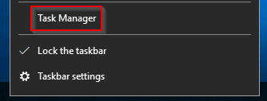

Hoặc:

1. Nhấn tổ hợp phím:

```text
Ctrl + Alt + Delete
```

2. Chọn **Task Manager**.

Cũng có thể mở Task Manager từ Start Menu:

1. Nhấn **Start**.
2. Gõ từ khóa `Task Manager`.
3. Chọn ứng dụng **Task Manager**.

Trong một số tình huống hệ thống bị chậm hoặc ứng dụng bị treo, tổ hợp phím `Ctrl + Shift + Esc` là cách mở Task Manager nhanh và hiệu quả nhất.

## 8.3. Simple View và More Details

Khi mở Task Manager lần đầu, Windows có thể hiển thị ở dạng đơn giản, gọi là **Simple View**.

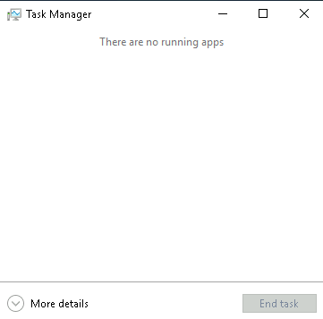

Ở chế độ Simple View, Task Manager chỉ hiển thị danh sách các ứng dụng đang chạy. Người dùng có thể chọn một ứng dụng và nhấn **End task** để đóng ứng dụng đó.

Nếu muốn xem thông tin chi tiết hơn, người dùng có thể nhấn **More details**.


Sau khi chuyển sang chế độ chi tiết, Task Manager sẽ hiển thị nhiều tab hơn, ví dụ:

* Processes;
* Performance;
* App history;
* Startup;
* Users;
* Details;
* Services.

Chế độ **More Details** hữu ích hơn cho quản trị hệ thống và xử lý sự cố vì nó cung cấp thông tin đầy đủ về tiến trình, tài nguyên, hiệu suất và dịch vụ đang chạy.

## 8.4. Tab Processes

Tab **Processes** hiển thị danh sách các ứng dụng và tiến trình đang chạy trên Windows.

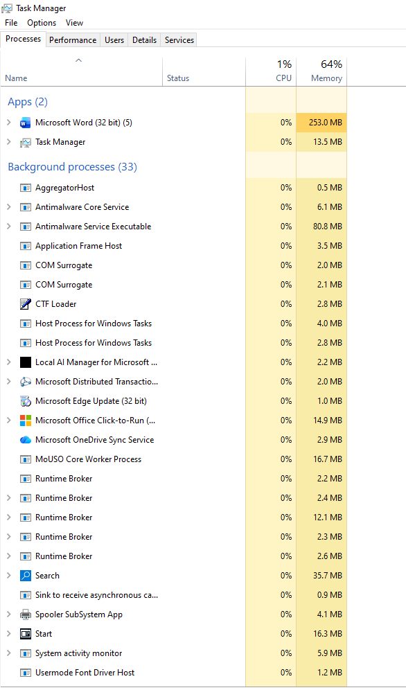

Trong tab này, người dùng có thể xem mỗi tiến trình đang sử dụng bao nhiêu tài nguyên hệ thống, bao gồm:

* CPU;
* Memory;
* Disk;
* Network.

Các tiến trình thường được chia thành nhiều nhóm, ví dụ:

* Apps;
* Background processes;
* Windows processes.

**Apps** là các ứng dụng người dùng đang mở, ví dụ như trình duyệt, trình soạn thảo văn bản hoặc File Explorer.

**Background processes** là các tiến trình chạy nền. Chúng có thể thuộc về ứng dụng, dịch vụ hệ thống hoặc phần mềm bảo mật.

**Windows processes** là các tiến trình liên quan trực tiếp đến hoạt động của hệ điều hành Windows.

Tab Processes thường được dùng để xác định chương trình nào đang làm máy tính chậm, chiếm nhiều RAM hoặc sử dụng CPU bất thường.

## 8.5. Tab Performance

Tab **Performance** hiển thị thông tin hiệu suất của hệ thống theo thời gian thực.

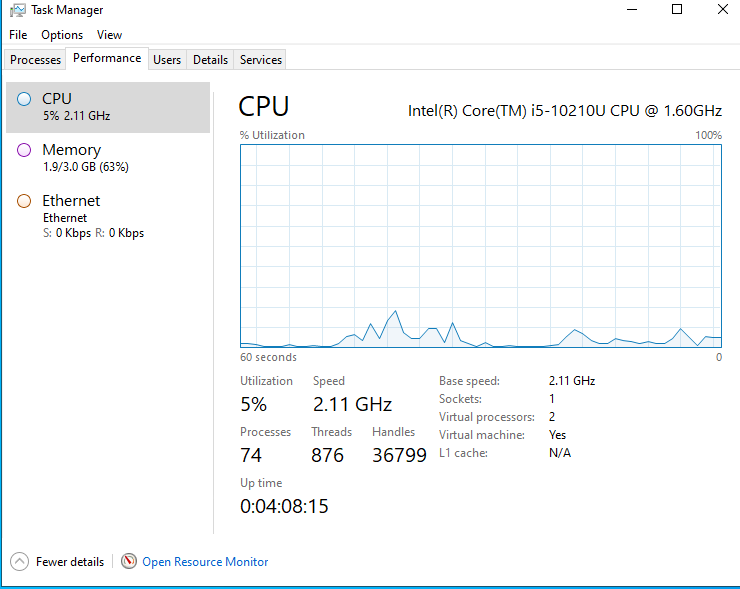

Trong tab này, người dùng có thể theo dõi hoạt động của các thành phần phần cứng chính như:

* CPU;
* Memory;
* Disk;
* Ethernet hoặc Wi-Fi;
* GPU nếu hệ thống hỗ trợ.

Thông tin thường được hiển thị dưới dạng biểu đồ, giúp người dùng dễ quan sát mức sử dụng tài nguyên theo thời gian.

Ví dụ, nếu CPU luôn ở mức gần 100%, hệ thống có thể đang chạy một tiến trình nặng hoặc có vấn đề về hiệu suất. Nếu RAM gần đầy, máy tính có thể bị chậm do thiếu bộ nhớ. Nếu Disk hoạt động liên tục ở mức cao, ổ đĩa có thể đang bị quá tải.

Tab Performance rất hữu ích khi cần đánh giá tổng quan tình trạng hoạt động của máy tính.

## 8.6. Theo dõi CPU, RAM, Disk và Network

Task Manager cho phép theo dõi các tài nguyên quan trọng của hệ thống, bao gồm CPU, RAM, Disk và Network.

| Thành phần   | Ý nghĩa                                  |
| ------------ | ---------------------------------------- |
| CPU          | Cho biết mức độ sử dụng bộ xử lý         |
| Memory / RAM | Cho biết lượng bộ nhớ đang được sử dụng  |
| Disk         | Cho biết mức độ đọc/ghi của ổ đĩa        |
| Network      | Cho biết lưu lượng mạng đang gửi và nhận |

Nếu **CPU** sử dụng quá cao trong thời gian dài, máy tính có thể bị chậm, nóng hoặc phản hồi kém.

Nếu **RAM** gần đầy, Windows có thể phải sử dụng bộ nhớ ảo trên ổ đĩa, làm hệ thống chậm hơn.

Nếu **Disk** luôn ở mức cao, máy có thể bị chậm khi mở ứng dụng, sao chép tệp hoặc khởi động hệ thống.

Nếu **Network** có lưu lượng bất thường, có thể có ứng dụng đang tải dữ liệu, đồng bộ dữ liệu hoặc trong một số trường hợp là có tiến trình đáng nghi đang kết nối ra ngoài.

Đối với người làm SOC hoặc điều tra sự cố, việc theo dõi các chỉ số này giúp phát hiện dấu hiệu bất thường ban đầu trên máy tính Windows.

## 8.7. Quản lý ứng dụng đang chạy

Task Manager cho phép người dùng quản lý các ứng dụng và tiến trình đang chạy trên hệ thống.

Một chức năng thường dùng là **End task**. Chức năng này dùng để đóng một ứng dụng hoặc tiến trình khi nó bị treo, không phản hồi hoặc sử dụng quá nhiều tài nguyên.

Các bước đóng một ứng dụng bằng Task Manager:

1. Mở **Task Manager**.
2. Vào tab **Processes**.
3. Chọn ứng dụng hoặc tiến trình cần đóng.
4. Nhấn **End task**.

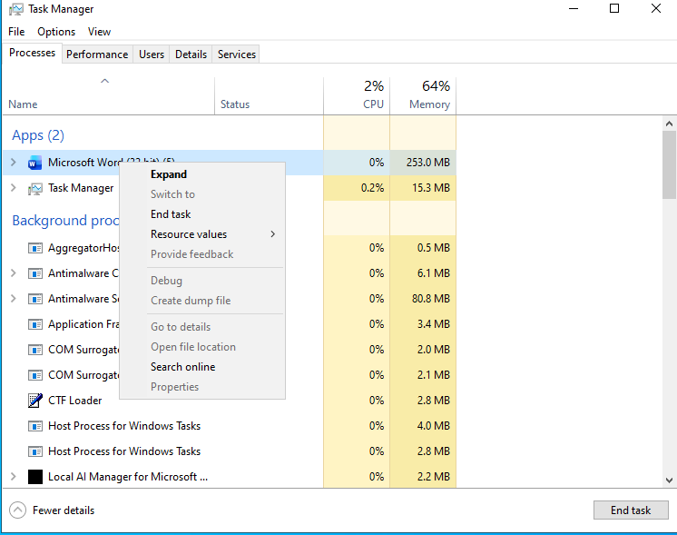

Tuy nhiên, cần cẩn thận khi kết thúc tiến trình. Nếu đóng nhầm tiến trình hệ thống quan trọng, Windows có thể hoạt động không ổn định hoặc một số chức năng có thể bị lỗi.

Người dùng nên ưu tiên đóng các ứng dụng thông thường trước, ví dụ như trình duyệt, trình soạn thảo, phần mềm bị treo hoặc chương trình không cần thiết.

Không nên tùy tiện kết thúc các tiến trình thuộc nhóm **Windows processes** nếu không hiểu rõ chức năng của chúng.

## 8.8. Ý nghĩa của Task Manager trong quản trị và xử lý sự cố

Task Manager là một công cụ quan trọng trong quản trị và xử lý sự cố Windows. Công cụ này giúp người dùng nhanh chóng đánh giá tình trạng hoạt động của hệ thống.

Trong quản trị hệ thống, Task Manager có thể được dùng để:

* kiểm tra hiệu suất máy tính;
* xác định ứng dụng gây chậm hệ thống;
* đóng chương trình bị treo;
* theo dõi tài nguyên phần cứng;
* kiểm tra tiến trình chạy nền;
* xem người dùng đang đăng nhập;
* hỗ trợ phân tích sự cố ban đầu.

Trong an toàn thông tin, Task Manager cũng có giá trị nhất định. Nó có thể giúp phát hiện một số dấu hiệu bất thường như:

* tiến trình lạ đang chạy;
* chương trình sử dụng CPU hoặc RAM bất thường;
* lưu lượng mạng bất thường;
* ứng dụng không rõ nguồn gốc;
* tiến trình chạy nền đáng nghi.

Tuy nhiên, Task Manager chỉ là công cụ kiểm tra cơ bản. Trong điều tra bảo mật chuyên sâu, cần kết hợp thêm các công cụ khác như Event Viewer, Resource Monitor, Sysinternals Process Explorer, Windows Defender, EDR hoặc SIEM.

Tóm lại, Task Manager là công cụ đầu tiên nên kiểm tra khi Windows bị chậm, ứng dụng bị treo hoặc hệ thống có dấu hiệu hoạt động bất thường.


# 9. System Configuration — MSConfig

## 9.1. System Configuration là gì?

**System Configuration**, thường được gọi là **MSConfig**, là một công cụ quản trị trong Windows dùng để kiểm tra và thay đổi một số thiết lập liên quan đến quá trình khởi động hệ thống, dịch vụ và công cụ chẩn đoán.

MSConfig thường được sử dụng khi cần khắc phục sự cố Windows, đặc biệt trong các trường hợp máy tính khởi động chậm, dịch vụ gây lỗi hoặc phần mềm nào đó ảnh hưởng đến quá trình hoạt động của hệ thống.

Công cụ này cho phép người dùng quản lý một số thành phần như:

- chế độ khởi động của Windows;
- các dịch vụ đang được bật hoặc tắt;
- tùy chọn khởi động hệ điều hành;
- danh sách công cụ quản trị hệ thống;
- liên kết đến một số tiện ích chẩn đoán khác.

MSConfig không phải là công cụ dùng cho công việc hằng ngày, mà thường được dùng khi cần kiểm tra, phân tích hoặc xử lý lỗi hệ thống.


## 9.2. Cách mở MSConfig

Có nhiều cách để mở công cụ System Configuration trong Windows.

Cách phổ biến nhất là sử dụng hộp thoại Run:

1. Nhấn tổ hợp phím:

```text
Win + R
````

2. Nhập lệnh:

```text
msconfig
```

3. Nhấn **Enter**.

Ngoài ra, có thể mở MSConfig bằng Start Menu:

1. Nhấn **Start**.
2. Gõ từ khóa:

```text
System Configuration
```

3. Chọn ứng dụng **System Configuration**.

Sau khi mở, cửa sổ System Configuration sẽ hiển thị các tab chính như:

* General;
* Boot;
* Services;
* Startup;
* Tools.

Mỗi tab có chức năng riêng và hỗ trợ người dùng kiểm tra các thành phần khác nhau của hệ thống.

## 9.3. Tab General

Tab **General** trong MSConfig cho phép người dùng chọn chế độ khởi động của Windows.

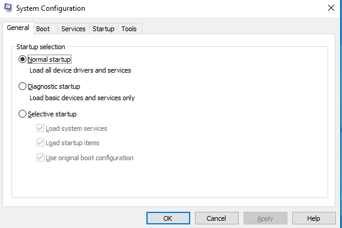

Các chế độ thường gặp gồm:

| Chế độ             | Ý nghĩa                                                                  |
| ------------------ | ------------------------------------------------------------------------ |
| Normal startup     | Khởi động Windows bình thường với đầy đủ driver, dịch vụ và chương trình |
| Diagnostic startup | Chỉ tải các thiết bị và dịch vụ cơ bản                                   |
| Selective startup  | Cho phép chọn một số thành phần sẽ được tải khi khởi động                |

**Normal startup** là chế độ mặc định. Khi chọn chế độ này, Windows sẽ khởi động đầy đủ các dịch vụ, driver và chương trình như bình thường.

**Diagnostic startup** thường được dùng để kiểm tra lỗi. Khi bật chế độ này, Windows chỉ tải các thành phần cơ bản nhất, giúp xác định xem lỗi có đến từ dịch vụ hoặc chương trình bên thứ ba hay không.

**Selective startup** cho phép người dùng tùy chỉnh các thành phần được tải khi Windows khởi động. Đây là lựa chọn hữu ích khi cần cô lập nguyên nhân gây lỗi nhưng vẫn muốn giữ lại một số dịch vụ cần thiết.

Tab General thường là nơi bắt đầu khi người dùng muốn kiểm tra sự cố liên quan đến quá trình khởi động.

## 9.4. Tab Boot

Tab **Boot** dùng để cấu hình các tùy chọn liên quan đến quá trình khởi động hệ điều hành Windows.

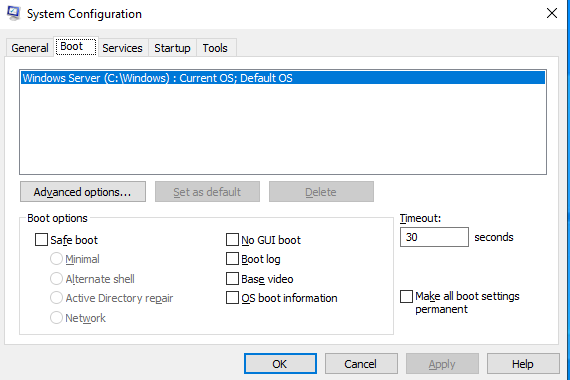

Trong tab này, người dùng có thể xem hệ điều hành đang được cấu hình để khởi động và thay đổi một số tùy chọn nâng cao.

Một số tùy chọn thường gặp trong tab Boot gồm:

| Tùy chọn            | Ý nghĩa                                   |
| ------------------- | ----------------------------------------- |
| Safe boot           | Khởi động Windows ở chế độ an toàn        |
| Minimal             | Chế độ Safe Mode cơ bản                   |
| Alternate shell     | Safe Mode với Command Prompt              |
| Network             | Safe Mode có hỗ trợ mạng                  |
| No GUI boot         | Không hiển thị giao diện khởi động đồ họa |
| Boot log            | Ghi log quá trình khởi động               |
| Base video          | Khởi động với driver đồ họa cơ bản        |
| OS boot information | Hiển thị thông tin driver khi khởi động   |

**Safe boot** là tùy chọn quan trọng khi cần khởi động Windows trong chế độ an toàn để sửa lỗi, gỡ phần mềm hoặc kiểm tra driver.

Ví dụ, nếu Windows bị lỗi sau khi cài một driver mới, người dùng có thể dùng Safe Mode để vào hệ thống và gỡ driver đó.

Tuy nhiên, cần cẩn thận khi thay đổi thiết lập trong tab Boot. Nếu cấu hình sai, Windows có thể khởi động không đúng như mong muốn.

## 9.5. Tab Services

Tab **Services** hiển thị danh sách các dịch vụ trên Windows. Dịch vụ là các chương trình chạy nền để cung cấp chức năng cho hệ điều hành hoặc ứng dụng.

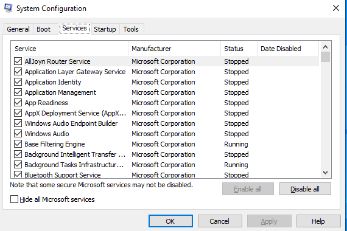

Trong tab Services, người dùng có thể:

* xem danh sách dịch vụ;
* kiểm tra dịch vụ đang bật hoặc bị tắt;
* bật hoặc tắt dịch vụ khi khởi động;
* ẩn các dịch vụ của Microsoft;
* kiểm tra dịch vụ bên thứ ba.

Một tùy chọn quan trọng trong tab này là:

```text
Hide all Microsoft services
```

Tùy chọn này giúp ẩn các dịch vụ hệ thống của Microsoft, chỉ hiển thị các dịch vụ của phần mềm bên thứ ba. Đây là cách hữu ích để kiểm tra xem phần mềm bên ngoài có gây lỗi cho Windows hay không.

Ví dụ, nếu máy tính khởi động chậm hoặc thường xuyên bị lỗi, người dùng có thể tạm thời tắt các dịch vụ không thuộc Microsoft để kiểm tra nguyên nhân.

Tuy nhiên, không nên tắt dịch vụ tùy tiện nếu không hiểu chức năng của chúng. Một số dịch vụ có thể liên quan đến phần mềm bảo mật, driver hoặc ứng dụng quan trọng.

## 9.6. Tab Startup

Tab **Startup** từng được dùng để quản lý các chương trình khởi động cùng Windows. Tuy nhiên, trong các phiên bản Windows hiện đại, chức năng quản lý Startup đã được chuyển sang **Task Manager**.

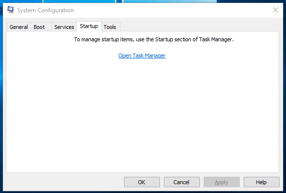

Khi mở tab Startup trong MSConfig, Windows thường hiển thị liên kết để mở Task Manager.

Để quản lý chương trình khởi động cùng Windows, người dùng có thể:

1. Mở **Task Manager**.
2. Chọn tab **Startup**.
3. Xem danh sách ứng dụng khởi động cùng hệ thống.
4. Chọn ứng dụng không cần thiết.
5. Nhấn **Disable** để tắt khởi động cùng Windows.

Việc quản lý Startup rất quan trọng vì nhiều chương trình tự động chạy khi Windows khởi động có thể làm máy tính chậm hơn.

Từ góc độ bảo mật, danh sách Startup cũng cần được kiểm tra vì một số mã độc có thể cấu hình để tự chạy khi người dùng đăng nhập vào Windows.

## 9.7. Tab Tools

Tab **Tools** trong MSConfig cung cấp danh sách các công cụ quản trị và chẩn đoán của Windows.

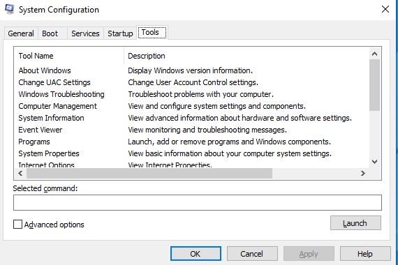

Từ tab này, người dùng có thể chọn một công cụ và nhấn **Launch** để mở nhanh công cụ đó.

Một số công cụ thường có trong tab Tools gồm:

* About Windows;
* Change UAC Settings;
* Security and Maintenance;
* Windows Troubleshooting;
* Computer Management;
* System Information;
* Event Viewer;
* Programs;
* System Properties;
* Internet Options;
* Internet Protocol Configuration;
* Performance Monitor;
* Resource Monitor;
* Task Manager;
* Command Prompt;
* Registry Editor.

Tab Tools rất hữu ích vì nó tập hợp nhiều công cụ quan trọng ở một nơi. Thay vì phải nhớ từng lệnh riêng, người dùng có thể mở MSConfig và chọn công cụ cần dùng.

Trong tab Tools, MSConfig cho phép mở nhanh nhiều công cụ quản trị quan trọng của Windows.

Một số công cụ thường dùng gồm:

| Công cụ             | Chức năng chính                                          |
| ------------------- | -------------------------------------------------------- |
| Change UAC Settings | Thay đổi cài đặt User Account Control                    |
| Computer Management | Quản lý hệ thống, ổ đĩa, người dùng, dịch vụ             |
| System Information  | Xem thông tin phần cứng, phần mềm và môi trường hệ thống |
| Event Viewer        | Xem nhật ký sự kiện Windows                              |
| System Properties   | Xem và thay đổi thuộc tính hệ thống                      |
| Internet Options    | Cấu hình các tùy chọn Internet truyền thống              |
| IP Configuration    | Xem thông tin cấu hình mạng                              |
| Performance Monitor | Theo dõi hiệu suất hệ thống                              |
| Resource Monitor    | Theo dõi CPU, RAM, Disk và Network chi tiết              |
| Task Manager        | Quản lý tiến trình và ứng dụng đang chạy                 |
| Command Prompt      | Mở giao diện dòng lệnh                                   |
| Registry Editor     | Xem và chỉnh sửa Windows Registry                        |

Các công cụ này thường phục vụ cho quản trị, kiểm tra trạng thái hệ thống, xử lý sự cố và phân tích bảo mật.

## 9.8. Vai trò của MSConfig trong khắc phục sự cố

MSConfig có vai trò quan trọng trong quá trình khắc phục sự cố Windows. Công cụ này giúp người dùng kiểm tra xem lỗi có liên quan đến dịch vụ, chương trình khởi động hoặc cấu hình khởi động hay không.

MSConfig thường được sử dụng trong các tình huống như:

* Windows khởi động chậm;
* hệ thống bị lỗi sau khi cài phần mềm;
* nghi ngờ dịch vụ bên thứ ba gây xung đột;
* cần khởi động vào Safe Mode;
* cần tắt tạm thời một số dịch vụ để kiểm tra lỗi;
* cần mở nhanh các công cụ chẩn đoán hệ thống.

Ví dụ, nếu Windows hoạt động bình thường sau khi tắt các dịch vụ bên thứ ba, có thể suy đoán rằng một dịch vụ hoặc phần mềm ngoài Microsoft đang gây ra sự cố.

Trong an toàn thông tin, MSConfig cũng có thể hỗ trợ kiểm tra một số dấu hiệu bất thường, chẳng hạn như dịch vụ lạ, chương trình khởi động đáng nghi hoặc cấu hình hệ thống bị thay đổi.

Tuy nhiên, MSConfig chỉ là công cụ hỗ trợ ban đầu. Khi cần điều tra sâu hơn, nên kết hợp với Task Manager, Event Viewer, Services, Autoruns, Registry Editor và các công cụ bảo mật khác.


# 10. Computer Management

## 10.1. Computer Management là gì?

**Computer Management** là một công cụ quản trị tổng hợp trong Windows. Công cụ này tập hợp nhiều tiện ích quản lý hệ thống vào cùng một giao diện, giúp người dùng và quản trị viên dễ dàng theo dõi, cấu hình và xử lý sự cố trên máy tính.

Thông qua Computer Management, người dùng có thể quản lý nhiều thành phần quan trọng như:

- lịch tác vụ;
- nhật ký sự kiện;
- thư mục chia sẻ;
- người dùng và nhóm cục bộ;
- hiệu suất hệ thống;
- thiết bị phần cứng;
- ổ đĩa và phân vùng;
- dịch vụ Windows;
- WMI Control.

Computer Management đặc biệt hữu ích trong quản trị hệ thống vì thay vì phải mở từng công cụ riêng lẻ, người dùng có thể truy cập nhiều công cụ quan trọng từ một cửa sổ duy nhất.

Trong lĩnh vực an toàn thông tin, Computer Management cũng rất quan trọng vì nó hỗ trợ kiểm tra tài khoản người dùng, nhóm quyền, dịch vụ đang chạy, log sự kiện và các tài nguyên được chia sẻ trên hệ thống.


## 10.2. Cách mở `compmgmt.msc`

Có nhiều cách để mở Computer Management trong Windows.

Cách phổ biến nhất là dùng hộp thoại Run:

1. Nhấn tổ hợp phím:

```text
Win + R
````

2. Nhập lệnh:

```text
compmgmt.msc
```

3. Nhấn **Enter**.

Ngoài ra, có thể mở bằng Start Menu:

1. Nhấn **Start**.
2. Gõ từ khóa:

```text
Computer Management
```

3. Chọn **Computer Management**.

Cũng có thể mở từ menu chuột phải:

1. Nhấp chuột phải vào **This PC** hoặc **Computer**.
2. Chọn **Manage**.

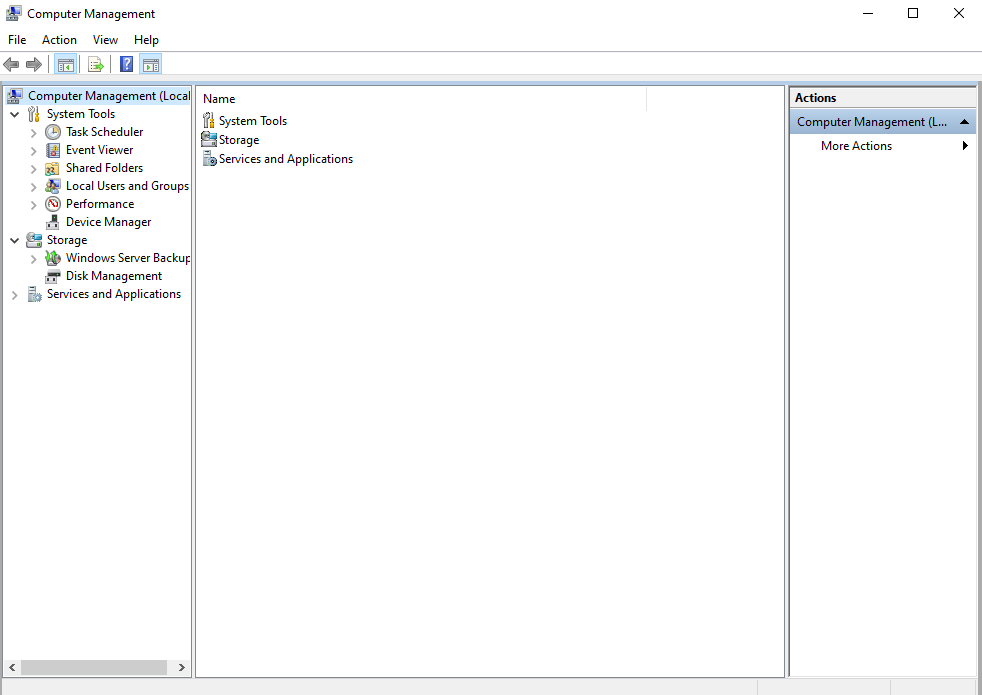

Sau khi mở, cửa sổ Computer Management thường được chia thành ba nhóm chính:

* **System Tools**;
* **Storage**;
* **Services and Applications**.

## 10.3. System Tools

**System Tools** là nhóm công cụ dùng để quản lý và giám sát các thành phần hệ thống. Đây là phần quan trọng nhất trong Computer Management vì chứa nhiều tiện ích phục vụ quản trị, kiểm tra log và xử lý sự cố.

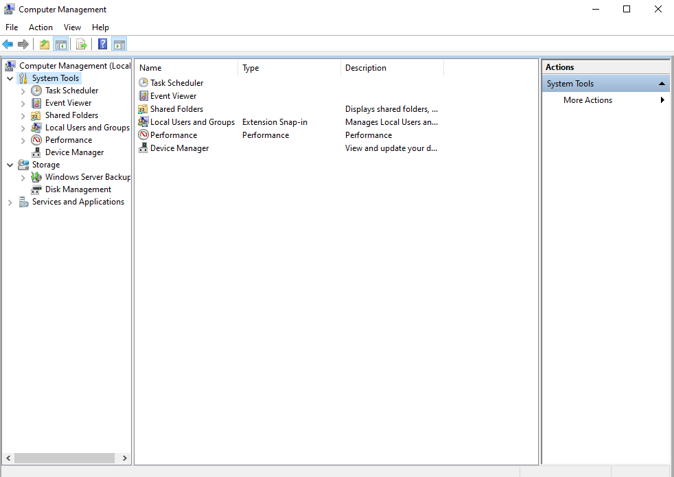

Trong System Tools thường có các công cụ như:

* Task Scheduler;
* Event Viewer;
* Shared Folders;
* Local Users and Groups;
* Performance Monitor;
* Device Manager.

Nhóm System Tools giúp quản trị viên kiểm tra tình trạng hoạt động của Windows, xem sự kiện hệ thống, quản lý tài khoản cục bộ, kiểm tra thiết bị phần cứng và theo dõi hiệu suất.

Đối với người học SOC, System Tools rất cần thiết vì nhiều dữ liệu phục vụ điều tra sự cố ban đầu có thể được tìm thấy tại đây, đặc biệt là trong Event Viewer, Local Users and Groups và Performance Monitor.


### 10.3.1. Task Scheduler

**Task Scheduler** là công cụ dùng để tạo và quản lý các tác vụ tự động trong Windows.

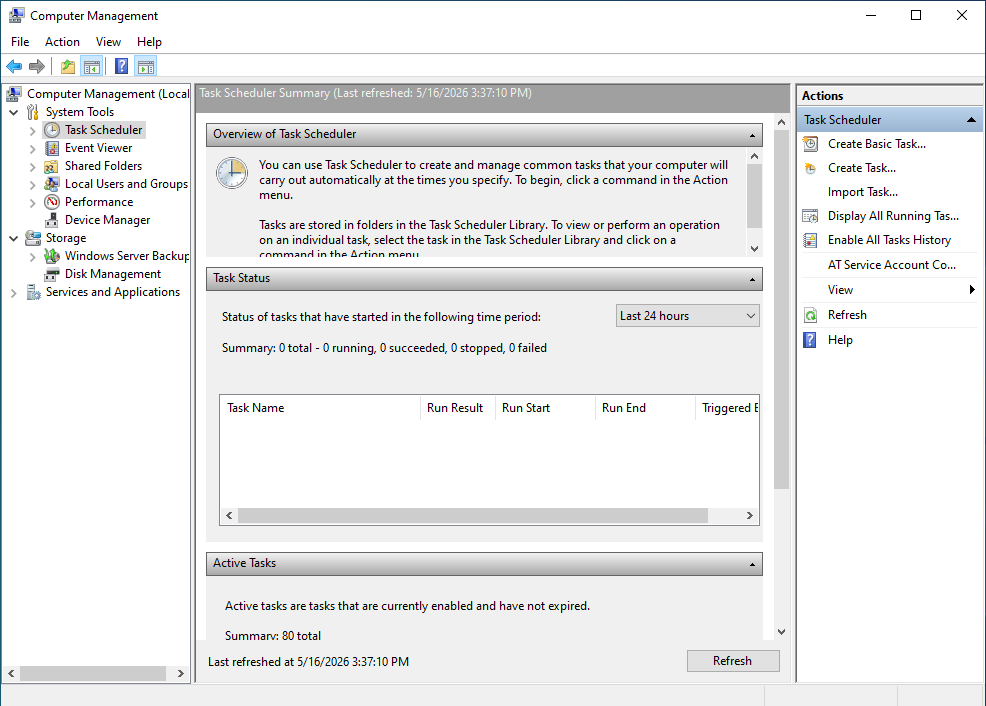

Thông qua Task Scheduler, Windows hoặc người dùng có thể cấu hình một chương trình, script hoặc lệnh chạy tự động theo một điều kiện nhất định.

Ví dụ, một tác vụ có thể được cấu hình để chạy khi:

* hệ thống khởi động;
* người dùng đăng nhập;
* đến một thời điểm cụ thể;
* sau một khoảng thời gian lặp lại;
* một sự kiện nhất định xuất hiện trong log.

Task Scheduler thường được dùng cho các mục đích hợp pháp như:

* chạy script bảo trì;
* tự động sao lưu;
* kiểm tra cập nhật;
* chạy chương trình theo lịch;
* thực hiện tác vụ quản trị định kỳ.

Tuy nhiên, từ góc độ an toàn thông tin, Task Scheduler cũng là nơi cần kiểm tra vì kẻ tấn công có thể tạo scheduled task để duy trì persistence, tức là tự động chạy lại mã độc sau khi máy tính khởi động hoặc người dùng đăng nhập.

### 10.3.2. Event Viewer

**Event Viewer** là công cụ dùng để xem nhật ký sự kiện của Windows. Đây là một trong những công cụ quan trọng nhất khi xử lý sự cố và phân tích bảo mật.

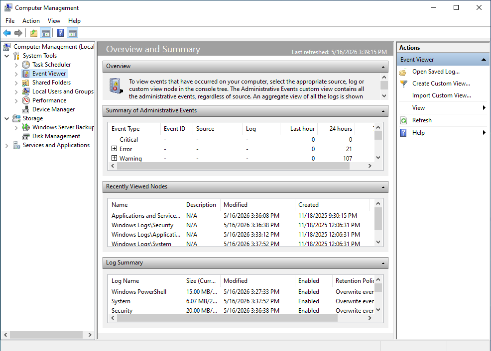

Windows ghi lại nhiều loại sự kiện khác nhau trong Event Viewer, ví dụ:

* lỗi ứng dụng;
* lỗi hệ thống;
* cảnh báo;
* thông tin hoạt động;
* đăng nhập thành công;
* đăng nhập thất bại;
* thay đổi chính sách;
* hoạt động của dịch vụ.

Các nhóm log thường gặp gồm:

| Nhóm log         | Ý nghĩa                                                   |
| ---------------- | --------------------------------------------------------- |
| Application      | Ghi sự kiện liên quan đến ứng dụng                        |
| Security         | Ghi sự kiện bảo mật, đăng nhập, kiểm toán                 |
| System           | Ghi sự kiện liên quan đến hệ thống và dịch vụ             |
| Setup            | Ghi sự kiện liên quan đến cài đặt và cập nhật             |
| Forwarded Events | Chứa sự kiện được chuyển tiếp từ máy khác nếu có cấu hình |

Trong quản trị hệ thống, Event Viewer giúp tìm nguyên nhân lỗi hệ thống, lỗi ứng dụng hoặc lỗi dịch vụ.

Trong SOC, Event Viewer rất quan trọng vì nhiều dấu hiệu tấn công có thể được phát hiện qua Windows Logs, đặc biệt là log đăng nhập, tạo tài khoản, thay đổi quyền, chạy dịch vụ hoặc lỗi bất thường.

### 10.3.3. Shared Folders

**Shared Folders** là công cụ dùng để xem và quản lý các thư mục được chia sẻ trên máy tính Windows.

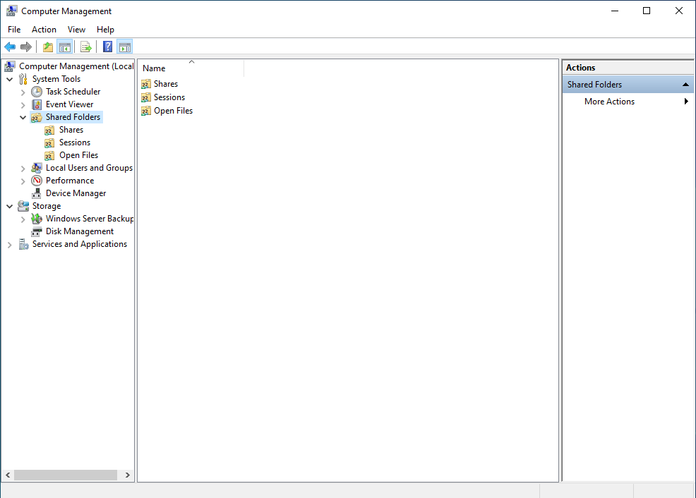

Thông qua Shared Folders, người dùng có thể kiểm tra:

* các thư mục đang được chia sẻ;
* các phiên kết nối đến thư mục chia sẻ;
* các tệp đang được mở qua mạng.

Shared Folders thường có ba phần chính:

| Mục        | Ý nghĩa                                    |
| ---------- | ------------------------------------------ |
| Shares     | Hiển thị các thư mục đang được chia sẻ     |
| Sessions   | Hiển thị các phiên người dùng đang kết nối |
| Open Files | Hiển thị các tệp đang được mở qua mạng     |

Công cụ này rất hữu ích trong môi trường doanh nghiệp vì nhiều máy Windows có thể chia sẻ thư mục hoặc tài nguyên qua mạng nội bộ.

Từ góc độ bảo mật, cần kiểm tra Shared Folders để phát hiện:

* thư mục bị chia sẻ nhầm;
* quyền truy cập quá rộng;
* người dùng lạ đang kết nối;
* tệp nhạy cảm đang được mở qua mạng;
* chia sẻ ẩn hoặc chia sẻ không cần thiết.

Việc cấu hình sai thư mục chia sẻ có thể dẫn đến rò rỉ dữ liệu hoặc truy cập trái phép.


### 10.3.4. Local Users and Groups

**Local Users and Groups** là công cụ dùng để quản lý tài khoản người dùng và nhóm cục bộ trên máy Windows.

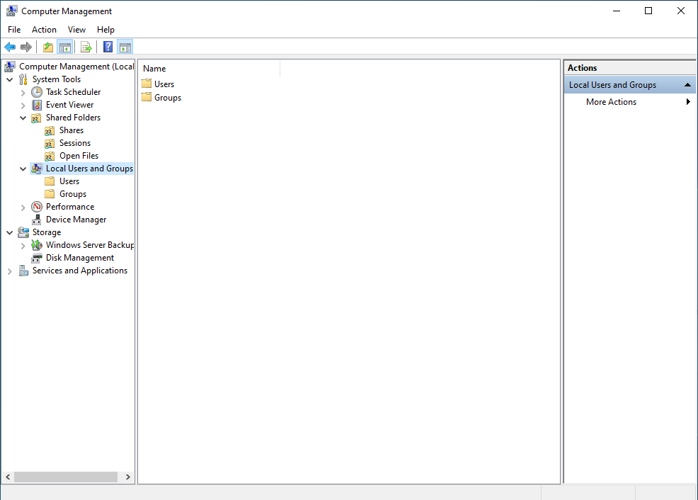

Trong công cụ này có hai phần chính:

* **Users**;
* **Groups**.

Phần **Users** hiển thị các tài khoản cục bộ trên máy. Phần **Groups** hiển thị các nhóm cục bộ và thành viên của từng nhóm.

Thông qua Local Users and Groups, quản trị viên có thể:

* tạo tài khoản người dùng mới;
* đổi mật khẩu;
* vô hiệu hóa tài khoản;
* thêm người dùng vào nhóm;
* xóa người dùng khỏi nhóm;
* kiểm tra tài khoản lạ;
* kiểm tra nhóm có quyền cao.

Một nhóm đặc biệt cần chú ý là **Administrators**. Người dùng thuộc nhóm này có quyền quản trị trên hệ thống.

Trong an toàn thông tin, Local Users and Groups thường được kiểm tra để xác định liệu có tài khoản bất thường, tài khoản bị tạo trái phép hoặc người dùng không phù hợp nằm trong nhóm quản trị hay không.

### 10.3.5. Performance Monitor

**Performance Monitor** là công cụ dùng để theo dõi hiệu suất hệ thống Windows một cách chi tiết.

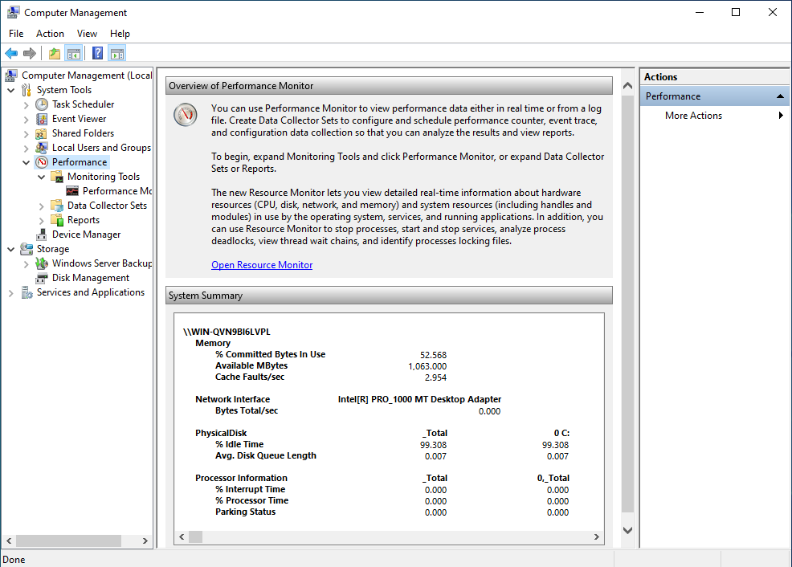

Công cụ này cho phép người dùng quan sát nhiều chỉ số hoạt động của hệ thống, ví dụ:

* CPU;
* RAM;
* ổ đĩa;
* mạng;
* tiến trình;
* dịch vụ;
* bộ đếm hiệu suất.

Performance Monitor có thể hiển thị dữ liệu theo thời gian thực hoặc ghi lại dữ liệu để phân tích sau.

So với Task Manager, Performance Monitor chi tiết hơn và phù hợp hơn cho việc theo dõi lâu dài hoặc phân tích hiệu suất chuyên sâu.

Một số tình huống sử dụng Performance Monitor gồm:

* kiểm tra nguyên nhân máy chạy chậm;
* theo dõi mức sử dụng CPU hoặc RAM theo thời gian;
* phân tích nghẽn cổ chai hệ thống;
* giám sát hiệu suất máy chủ;
* thu thập dữ liệu phục vụ báo cáo kỹ thuật.

Trong môi trường doanh nghiệp, Performance Monitor có thể hỗ trợ quản trị viên phát hiện sớm vấn đề về tài nguyên trước khi hệ thống bị gián đoạn.

### 10.3.6. Device Manager

**Device Manager** là công cụ dùng để quản lý thiết bị phần cứng và driver trong Windows.

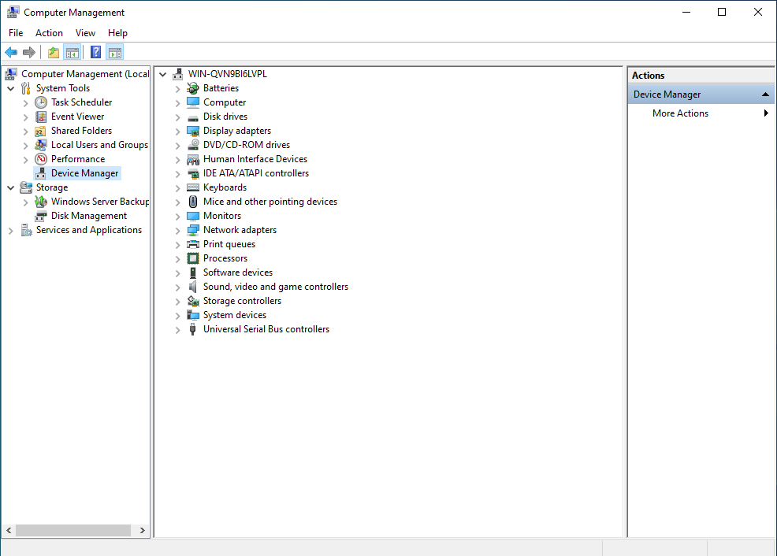

Thông qua Device Manager, người dùng có thể xem danh sách các thiết bị được hệ thống nhận diện, chẳng hạn như:

* card mạng;
* card đồ họa;
* ổ đĩa;
* bàn phím;
* chuột;
* màn hình;
* USB controller;
* thiết bị âm thanh;
* thiết bị Bluetooth.

Device Manager cho phép thực hiện các thao tác như:

* kiểm tra trạng thái thiết bị;
* cập nhật driver;
* gỡ driver;
* vô hiệu hóa thiết bị;
* bật lại thiết bị;
* xem thuộc tính phần cứng;
* kiểm tra lỗi driver.

Nếu một thiết bị có vấn đề, Device Manager thường hiển thị biểu tượng cảnh báo màu vàng. Đây là dấu hiệu cho thấy thiết bị có thể bị lỗi driver, không hoạt động đúng hoặc chưa được cài đặt đầy đủ.

Trong an toàn thông tin, Device Manager cũng có thể hỗ trợ kiểm tra các thiết bị lạ, adapter mạng ảo, USB bất thường hoặc phần cứng không được phép kết nối vào hệ thống.


## 10.4. Storage

**Storage** là nhóm công cụ dùng để quản lý thiết bị lưu trữ, ổ đĩa và phân vùng trong Windows.

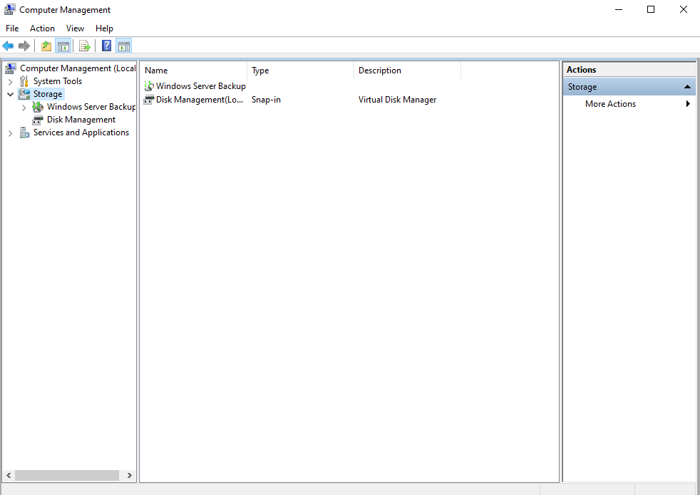

Thành phần quan trọng nhất trong nhóm Storage là **Disk Management**. Công cụ này cho phép người dùng xem và quản lý các ổ đĩa vật lý, phân vùng, volume và ký tự ổ đĩa.

Thông qua Storage, người dùng có thể:

* xem danh sách ổ đĩa;
* kiểm tra dung lượng ổ đĩa;
* tạo phân vùng mới;
* xóa phân vùng;
* định dạng phân vùng;
* thay đổi ký tự ổ đĩa;
* kiểm tra trạng thái volume;
* quản lý ổ đĩa gắn ngoài.

Trong quản trị hệ thống, Storage rất quan trọng vì lỗi ổ đĩa, thiếu dung lượng hoặc cấu hình phân vùng sai có thể ảnh hưởng trực tiếp đến hoạt động của Windows.

Trong an toàn thông tin, việc kiểm tra Storage cũng có ý nghĩa khi cần phân tích ổ đĩa, xác định phân vùng lạ, kiểm tra thiết bị lưu trữ ngoài hoặc chuẩn bị môi trường điều tra số.

### 10.4.1. Disk Management

**Disk Management** là công cụ dùng để quản lý ổ đĩa, phân vùng và volume trong Windows.

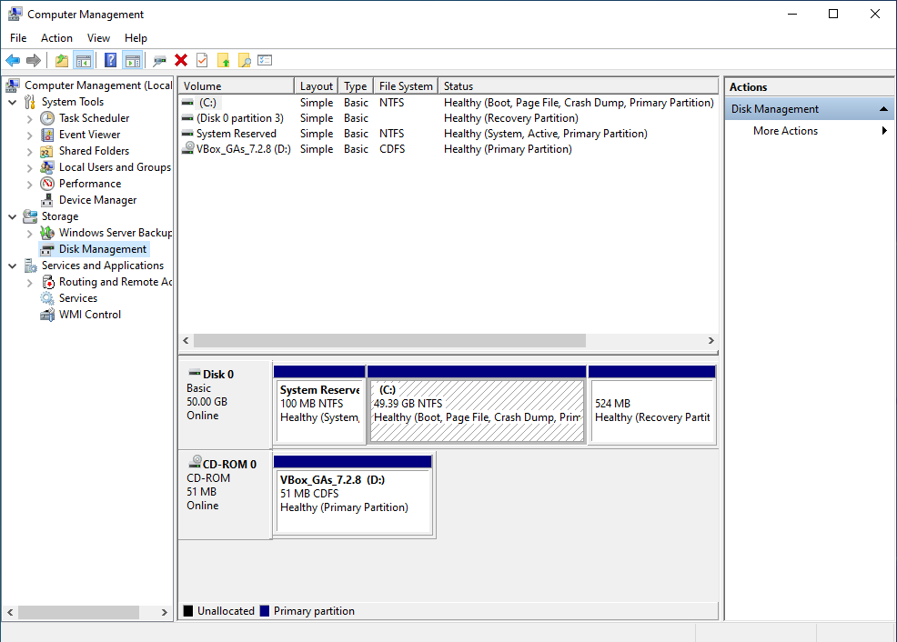

Thông qua Disk Management, người dùng có thể:

* xem ổ đĩa vật lý;
* xem phân vùng;
* tạo volume mới;
* xóa volume;
* định dạng phân vùng;
* thay đổi ký tự ổ đĩa;
* mở rộng hoặc thu nhỏ volume;
* kiểm tra trạng thái ổ đĩa;
* quản lý ổ đĩa gắn ngoài.

Ví dụ, khi cắm một ổ USB hoặc thêm ổ đĩa mới vào máy tính, Disk Management có thể được dùng để kiểm tra ổ đĩa đã được nhận hay chưa và có ký tự ổ đĩa hay chưa.

Cần cẩn thận khi sử dụng Disk Management vì các thao tác như xóa volume hoặc định dạng ổ đĩa có thể làm mất dữ liệu.

Trong điều tra số và an toàn thông tin, Disk Management có thể giúp kiểm tra cấu trúc ổ đĩa, phát hiện phân vùng lạ hoặc xác định các thiết bị lưu trữ đang được kết nối.

## 10.5. Services and Applications

**Services and Applications** là nhóm công cụ dùng để quản lý các dịch vụ và một số thành phần ứng dụng hệ thống.

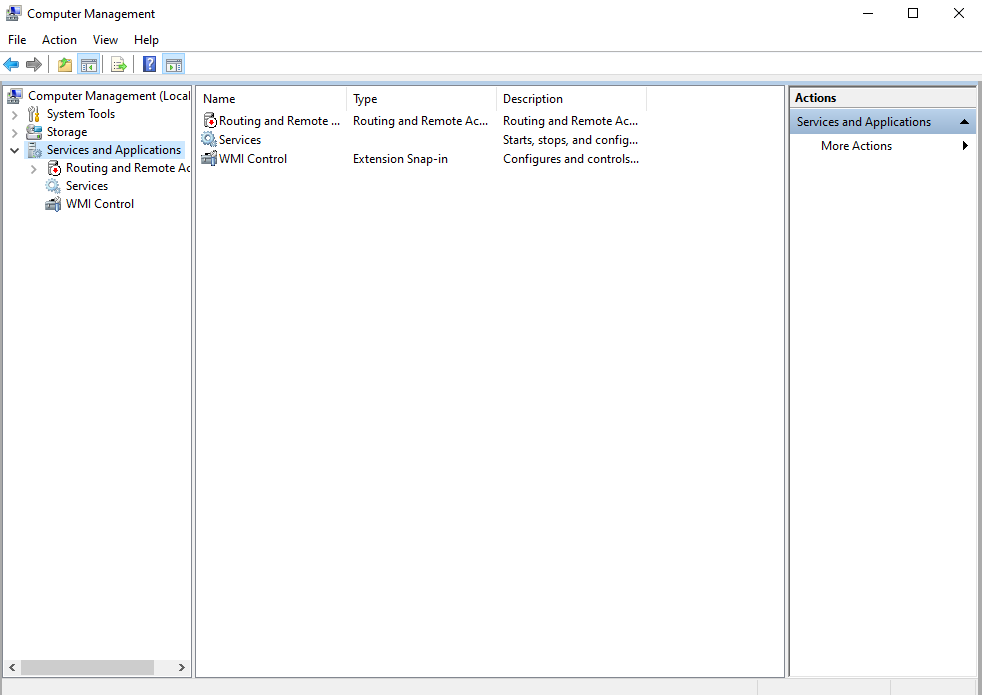

Trong nhóm này thường có:

* Services;
* WMI Control.

**Services** cho phép xem và quản lý các dịch vụ đang chạy hoặc được cấu hình trên Windows. **WMI Control** liên quan đến Windows Management Instrumentation, một cơ chế cho phép quản lý và truy vấn thông tin hệ thống.

Nhóm Services and Applications thường được sử dụng khi cần:

* kiểm tra dịch vụ đang chạy;
* khởi động hoặc dừng dịch vụ;
* thay đổi kiểu khởi động của dịch vụ;
* kiểm tra dịch vụ bất thường;
* xem cấu hình WMI;
* xử lý lỗi liên quan đến dịch vụ nền.

Từ góc độ bảo mật, đây là phần cần chú ý vì nhiều mã độc hoặc công cụ tấn công có thể tạo dịch vụ để duy trì quyền truy cập lâu dài trên hệ thống.

### 10.5.1. Services

**Services** là công cụ dùng để quản lý các dịch vụ chạy nền trong Windows.

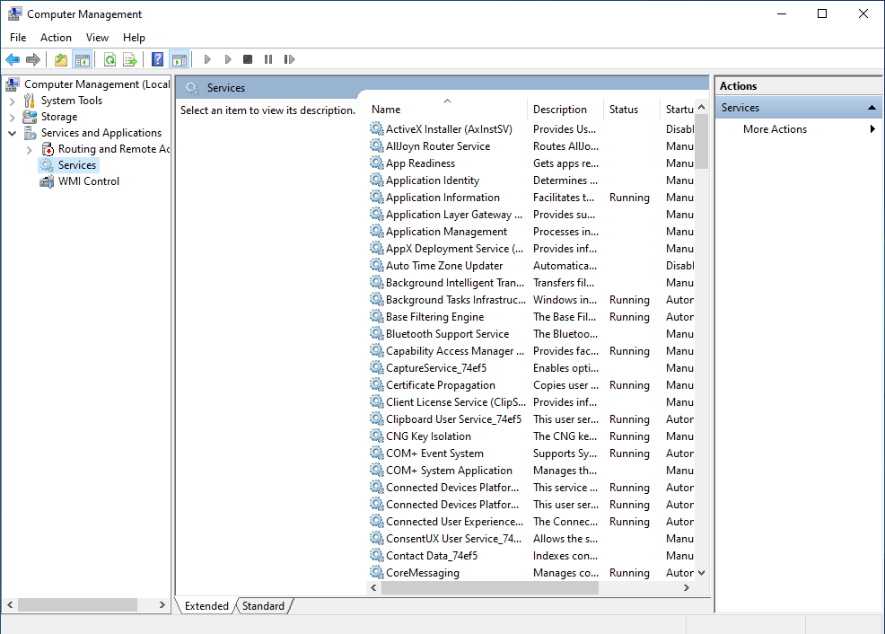

Dịch vụ là các chương trình chạy ở chế độ nền để cung cấp chức năng cho hệ điều hành hoặc ứng dụng. Một số dịch vụ khởi động cùng Windows, một số khác chỉ chạy khi cần.

Thông qua Services, người dùng có thể:

* xem danh sách dịch vụ;
* kiểm tra trạng thái dịch vụ;
* khởi động dịch vụ;
* dừng dịch vụ;
* khởi động lại dịch vụ;
* thay đổi kiểu khởi động;
* xem mô tả dịch vụ;
* kiểm tra tài khoản dùng để chạy dịch vụ.

Các kiểu khởi động thường gặp gồm:

| Kiểu khởi động          | Ý nghĩa                                      |
| ----------------------- | -------------------------------------------- |
| Automatic               | Tự động chạy khi Windows khởi động           |
| Automatic Delayed Start | Tự động chạy sau khi hệ thống khởi động xong |
| Manual                  | Chỉ chạy khi được gọi                        |
| Disabled                | Bị vô hiệu hóa                               |

Trong an toàn thông tin, Services là khu vực rất quan trọng vì kẻ tấn công có thể tạo dịch vụ độc hại để duy trì quyền truy cập. Vì vậy, khi điều tra hệ thống Windows, cần kiểm tra các dịch vụ lạ, dịch vụ mới được tạo hoặc dịch vụ chạy từ đường dẫn bất thường.

### 10.5.2. WMI Control

**WMI Control** là công cụ dùng để quản lý và cấu hình **Windows Management Instrumentation**, viết tắt là **WMI**.

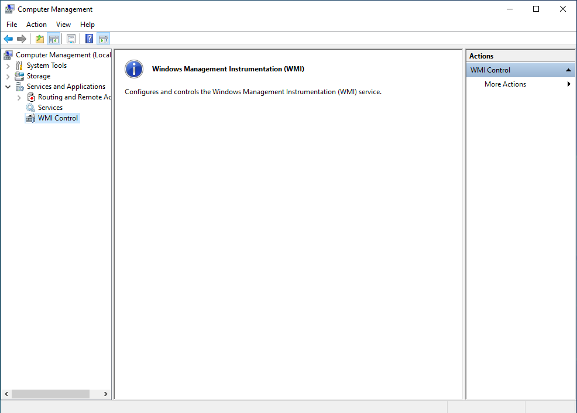

WMI là một thành phần của Windows cho phép truy vấn thông tin hệ thống, quản lý thiết bị, quản lý dịch vụ và thực hiện một số thao tác quản trị từ xa hoặc cục bộ.

Thông qua WMI, quản trị viên hoặc công cụ quản lý có thể lấy thông tin như:

* tên máy;
* hệ điều hành;
* phần cứng;
* tiến trình;
* dịch vụ;
* ổ đĩa;
* thông tin mạng;
* trạng thái hệ thống.

WMI Control trong Computer Management cho phép kiểm tra thuộc tính, cấu hình và trạng thái của WMI trên máy tính.

Trong quản trị hệ thống, WMI rất hữu ích vì nó hỗ trợ tự động hóa và quản lý nhiều máy tính. Tuy nhiên, trong an toàn thông tin, WMI cũng là một thành phần cần chú ý vì kẻ tấn công có thể lạm dụng WMI để thực thi lệnh, thu thập thông tin hoặc duy trì persistence.

Vì vậy, khi phân tích bảo mật Windows, cần quan tâm đến các hoạt động bất thường liên quan đến WMI, đặc biệt trong môi trường doanh nghiệp hoặc domain.


# 11. Task Scheduler

## 11.1. Task Scheduler là gì?

**Task Scheduler** là công cụ trong Windows dùng để tạo, quản lý và tự động chạy các tác vụ theo điều kiện hoặc thời gian nhất định.

Thông qua Task Scheduler, người dùng hoặc quản trị viên có thể cấu hình để Windows tự động chạy một chương trình, script, lệnh hoặc tác vụ hệ thống mà không cần thao tác thủ công.

Ví dụ, Task Scheduler có thể được dùng để:

- chạy script sao lưu dữ liệu hằng ngày;
- tự động mở một chương trình vào thời điểm nhất định;
- chạy tác vụ bảo trì hệ thống;
- kiểm tra cập nhật;
- xóa tệp tạm theo lịch;
- chạy lệnh khi người dùng đăng nhập;
- thực hiện hành động khi hệ thống khởi động.

Task Scheduler rất hữu ích trong quản trị hệ thống vì nó giúp tự động hóa các công việc lặp lại. Tuy nhiên, từ góc độ an toàn thông tin, đây cũng là một thành phần cần kiểm tra vì kẻ tấn công có thể lợi dụng scheduled task để duy trì quyền truy cập trên hệ thống.


## 11.2. Tác vụ tự động trong Windows

Tác vụ tự động trong Windows là những công việc được cấu hình để chạy mà không cần người dùng trực tiếp khởi động.

Một tác vụ tự động thường bao gồm ba thành phần chính:

- **Trigger**: điều kiện kích hoạt tác vụ;
- **Action**: hành động sẽ được thực hiện;
- **Conditions/Settings**: điều kiện bổ sung và thiết lập nâng cao.

Ví dụ, một tác vụ có thể được cấu hình như sau:

```text
Trigger: chạy mỗi ngày lúc 08:00
Action: chạy file backup.bat
````

Hoặc:

```text
Trigger: khi người dùng đăng nhập
Action: mở một chương trình giám sát hệ thống
```

Trong Windows, nhiều tác vụ hệ thống cũng được tạo sẵn để phục vụ cập nhật, bảo trì, đồng bộ thời gian, kiểm tra bảo mật hoặc thu thập thông tin hệ thống.

Việc hiểu tác vụ tự động giúp người học quản trị Windows biết cách tự động hóa công việc, đồng thời biết kiểm tra các tác vụ bất thường khi phân tích sự cố.

## 11.3. Tạo Basic Task

**Create Basic Task** là chức năng trong Task Scheduler dùng để tạo một tác vụ tự động đơn giản thông qua giao diện hướng dẫn từng bước.

Để tạo Basic Task, có thể thực hiện như sau:

1. Mở **Task Scheduler**.

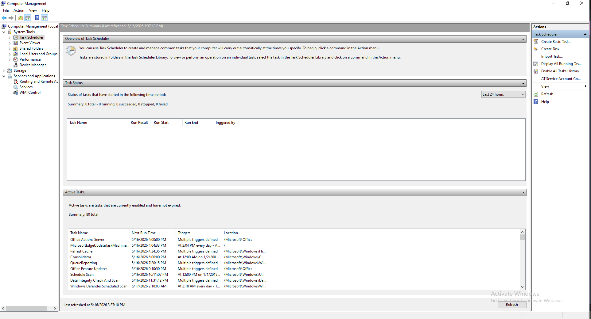

2. Chọn **Create Basic Task**.

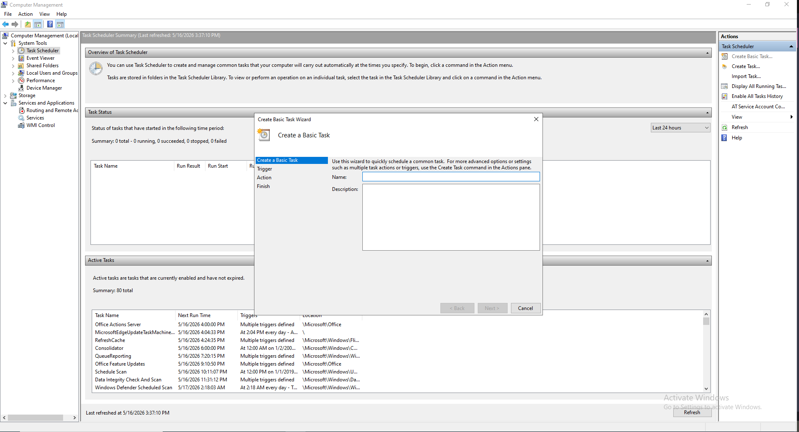

3. Nhập tên và mô tả cho tác vụ.


4. Chọn **Trigger** để xác định khi nào tác vụ chạy.

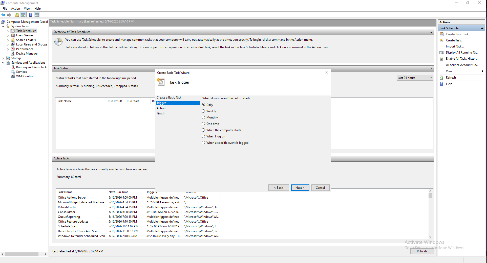

5. Chọn **Action** để xác định hành động cần thực hiện.

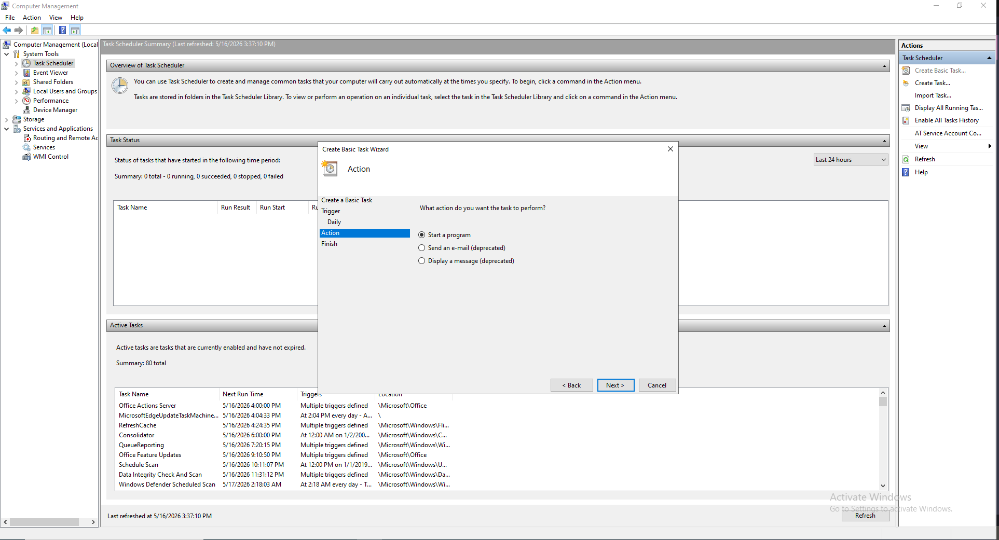

6. Chọn chương trình cần chạy 

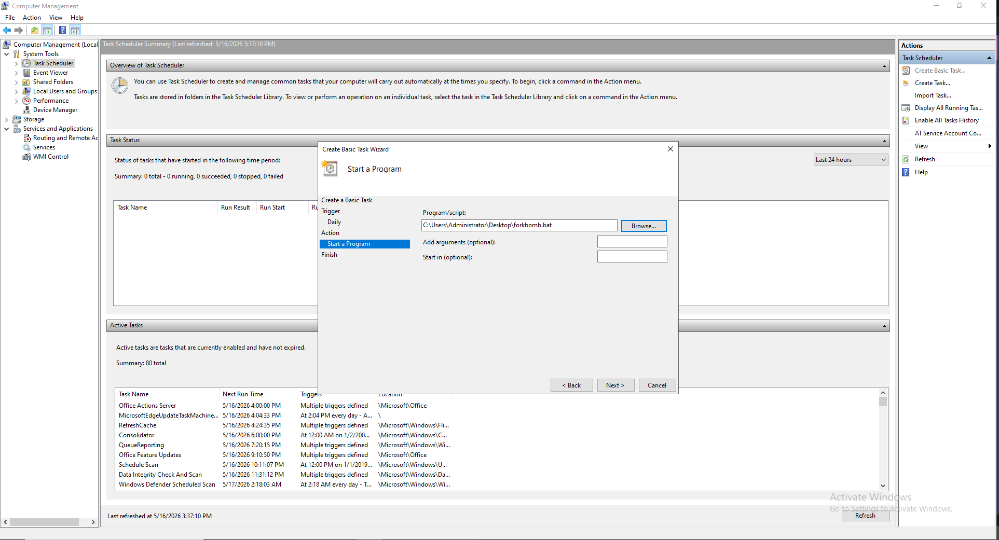

7. Nhấn **Finish** để hoàn tất.

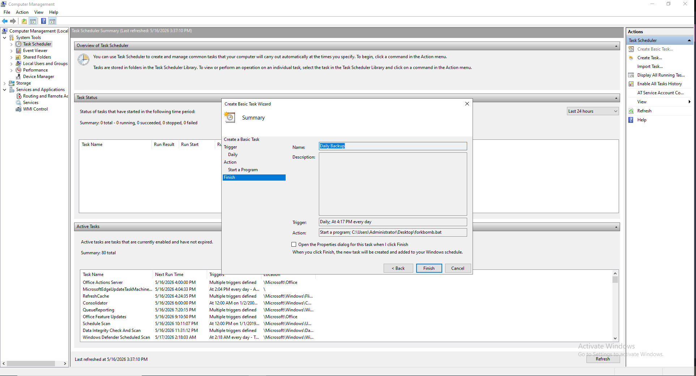

## 11.4. Trigger trong Task Scheduler

**Trigger** là điều kiện dùng để kích hoạt một tác vụ trong Task Scheduler.

Nói cách khác, Trigger trả lời câu hỏi: **khi nào tác vụ sẽ chạy?**

Một số loại Trigger thường gặp gồm:

| Trigger                         | Ý nghĩa                                               |
| ------------------------------- | ----------------------------------------------------- |
| Daily                           | Chạy hằng ngày                                        |
| Weekly                          | Chạy hằng tuần                                        |
| Monthly                         | Chạy hằng tháng                                       |
| One time                        | Chạy một lần tại thời điểm cụ thể                     |
| When the computer starts        | Chạy khi máy tính khởi động                           |
| When I log on                   | Chạy khi người dùng đăng nhập                         |
| When a specific event is logged | Chạy khi một sự kiện cụ thể xuất hiện trong Event Log |

Ví dụ, nếu muốn chạy script kiểm tra hệ thống mỗi sáng, có thể chọn Trigger là **Daily** và đặt thời gian là `08:00`.

Nếu muốn chạy chương trình khi người dùng đăng nhập vào Windows, có thể chọn Trigger là **When I log on**.

Trigger rất quan trọng vì nếu cấu hình sai, tác vụ có thể không chạy đúng thời điểm hoặc chạy quá thường xuyên, gây ảnh hưởng đến hiệu suất hệ thống.

## 11.5. Action trong Task Scheduler

**Action** là hành động mà Task Scheduler sẽ thực hiện khi Trigger được kích hoạt.

Nói cách khác, Action trả lời câu hỏi: **tác vụ sẽ làm gì?**

Action phổ biến nhất là:

```text
Start a program
```

Với Action này, Task Scheduler có thể chạy:

* một chương trình `.exe`;
* một script `.bat`;
* một script PowerShell `.ps1`;
* một lệnh hệ thống;
* một công cụ quản trị;
* một file thực thi do người dùng chỉ định.

Ví dụ:

```text
Action: Start a program
Program/script: powershell.exe
Arguments: -File C:\Scripts\check_logs.ps1
```

Hoặc:

```text
Action: Start a program
Program/script: C:\Scripts\backup.bat
```

Khi cấu hình Action, cần kiểm tra kỹ đường dẫn đến chương trình hoặc script. Nếu đường dẫn sai, tác vụ sẽ không chạy thành công.

Từ góc độ bảo mật, phần Action rất quan trọng vì nó cho biết tác vụ đang chạy chương trình hoặc lệnh nào. Khi điều tra hệ thống, nếu thấy một scheduled task chạy file lạ trong thư mục tạm, thư mục người dùng hoặc đường dẫn bất thường, cần kiểm tra kỹ.

## 11.6. Ứng dụng Task Scheduler trong quản trị hệ thống

Task Scheduler được sử dụng rất nhiều trong quản trị hệ thống vì nó giúp tự động hóa các công việc lặp lại.

Một số ứng dụng phổ biến gồm:

* tự động sao lưu dữ liệu;
* chạy script kiểm tra hệ thống;
* xóa file tạm định kỳ;
* thu thập log;
* kiểm tra dung lượng ổ đĩa;
* khởi động lại dịch vụ theo lịch;
* gửi báo cáo hệ thống;
* chạy tác vụ bảo trì ngoài giờ làm việc.

Ví dụ, quản trị viên có thể tạo một scheduled task để chạy script kiểm tra dung lượng ổ đĩa mỗi ngày. Nếu dung lượng còn quá thấp, script có thể ghi log hoặc gửi cảnh báo.

Một ví dụ khác là tự động chạy script thu thập log từ máy trạm vào cuối ngày để phục vụ giám sát bảo mật.

Task Scheduler giúp giảm thao tác thủ công, giảm sai sót và đảm bảo các công việc quan trọng được thực hiện đúng lịch.

Tuy nhiên, cần quản lý Task Scheduler cẩn thận. Nếu có quá nhiều tác vụ không cần thiết, hệ thống có thể bị chậm hoặc khó kiểm soát.

## 11.7. Ý nghĩa bảo mật của Scheduled Tasks

Từ góc độ an toàn thông tin, **Scheduled Tasks** là một khu vực rất quan trọng cần kiểm tra trong Windows.

Kẻ tấn công có thể lợi dụng Task Scheduler để duy trì **persistence**, tức là giữ khả năng tự động chạy lại mã độc sau khi máy tính khởi động hoặc sau khi người dùng đăng nhập.

Ví dụ, một mã độc có thể tạo scheduled task để:

* chạy file độc hại khi Windows khởi động;
* chạy script PowerShell khi người dùng đăng nhập;
* kết nối ra máy chủ điều khiển theo lịch;
* tải thêm payload từ Internet;
* khôi phục lại mã độc nếu bị xóa;
* thực hiện lệnh định kỳ mà người dùng không biết.

Khi phân tích bảo mật, cần kiểm tra các yếu tố sau:

* tên tác vụ có bất thường không;
* tác vụ được tạo khi nào;
* tác vụ chạy bằng tài khoản nào;
* Trigger của tác vụ là gì;
* Action của tác vụ chạy file hoặc lệnh nào;
* đường dẫn chương trình có đáng tin cậy không;
* tác vụ có chạy từ thư mục tạm hoặc thư mục người dùng không;
* tác vụ có dùng PowerShell, cmd.exe hoặc script lạ không.

Một số dấu hiệu đáng nghi gồm:

* tên tác vụ giống hệ thống nhưng viết sai hoặc lạ;
* tác vụ chạy file trong `AppData`, `Temp` hoặc `Downloads`;
* tác vụ chạy PowerShell với tham số khó hiểu;
* tác vụ mới được tạo gần thời điểm xảy ra sự cố;
* tác vụ chạy bằng tài khoản có quyền cao;
* tác vụ không có mô tả rõ ràng.

Vì vậy, trong điều tra sự cố Windows, Task Scheduler là một trong những nơi cần kiểm tra sớm. Nó giúp phát hiện các cơ chế tự động chạy chương trình, cả hợp pháp lẫn độc hại.

# 12. Event Viewer và Windows Logs

## 12.1. Event Viewer là gì?

**Event Viewer** là công cụ trong Windows dùng để xem và phân tích các sự kiện được hệ điều hành, ứng dụng và dịch vụ ghi lại trong quá trình hoạt động.

Trong Windows, nhiều hành động quan trọng đều có thể được ghi thành log, ví dụ:

- ứng dụng bị lỗi;
- dịch vụ khởi động hoặc dừng;
- hệ thống gặp lỗi phần cứng hoặc driver;
- người dùng đăng nhập thành công;
- người dùng đăng nhập thất bại;
- thay đổi chính sách bảo mật;
- thay đổi tài khoản hoặc quyền truy cập.

Event Viewer giúp người dùng và quản trị viên xem lại những gì đã xảy ra trên hệ thống. Đây là công cụ rất quan trọng khi cần xử lý sự cố, kiểm tra lỗi hoặc điều tra các dấu hiệu bất thường.

Có thể mở Event Viewer bằng lệnh:

```text
eventvwr.msc
````

Hoặc mở thông qua:

```text
Computer Management → System Tools → Event Viewer
```
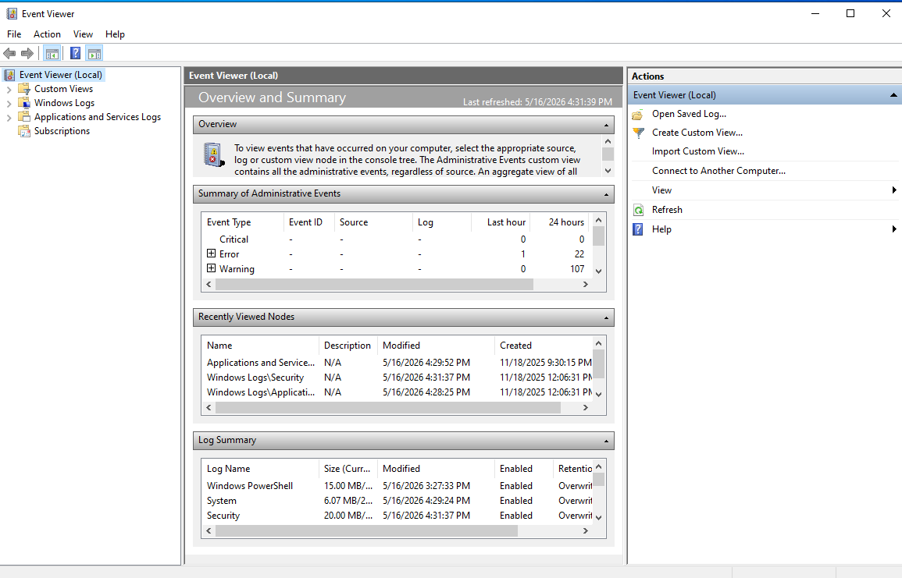

## 12.2. Vai trò của Event Viewer trong điều tra sự cố

Event Viewer có vai trò quan trọng trong điều tra sự cố vì nó lưu lại nhiều thông tin về hoạt động của hệ thống Windows.

Khi máy tính gặp lỗi, người dùng thường chỉ nhìn thấy biểu hiện bên ngoài như máy chậm, ứng dụng bị treo, dịch vụ không chạy hoặc không đăng nhập được. Tuy nhiên, Event Viewer có thể cung cấp thông tin chi tiết hơn về nguyên nhân.

Ví dụ, Event Viewer có thể giúp xác định:

* ứng dụng nào bị lỗi;
* dịch vụ nào không khởi động được;
* driver nào gây lỗi;
* thời điểm xảy ra sự cố;
* người dùng nào đã đăng nhập;
* có bao nhiêu lần đăng nhập thất bại;
* hệ thống có bị tắt bất thường hay không;
* có thay đổi bảo mật nào xảy ra hay không.

Trong quá trình điều tra, quản trị viên thường dùng Event Viewer để đối chiếu thời gian xảy ra sự cố với các sự kiện được ghi lại trong log.

Ví dụ, nếu người dùng báo rằng máy bị lỗi lúc 09:30, quản trị viên có thể mở Event Viewer và kiểm tra các sự kiện gần thời điểm đó để tìm nguyên nhân.

## 12.3. Các loại sự kiện trong Windows

Windows phân loại sự kiện theo mức độ và mục đích ghi log. Mỗi loại sự kiện cho biết tính chất của thông tin được ghi lại.

Các loại sự kiện thường gặp gồm:

* Error;
* Warning;
* Information;
* Success Audit;
* Failure Audit.

### 12.3.1. Error

**Error** là loại sự kiện cho biết đã xảy ra lỗi nghiêm trọng hoặc một thành phần nào đó không hoạt động đúng.

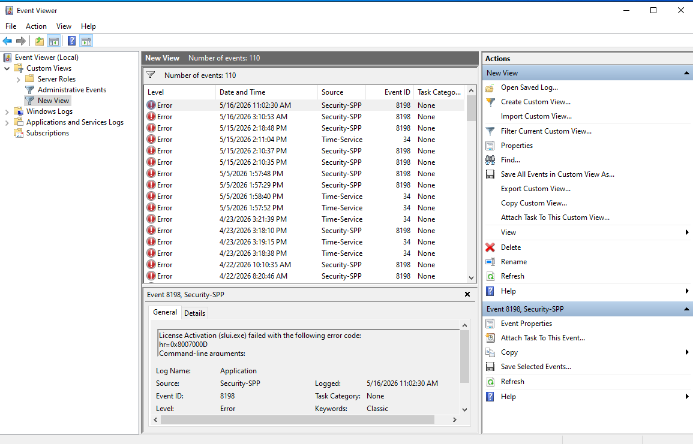

Ví dụ về Error:

* ứng dụng bị crash;
* dịch vụ không khởi động được;
* driver bị lỗi;
* hệ thống không đọc được một thành phần cần thiết;
* lỗi liên quan đến ổ đĩa hoặc phần cứng.

Sự kiện Error thường cần được kiểm tra kỹ, đặc biệt nếu nó xuất hiện lặp lại nhiều lần hoặc xảy ra gần thời điểm hệ thống gặp sự cố.

Trong điều tra sự cố, Error là một trong những loại log được kiểm tra đầu tiên.

### 12.3.2. Warning

**Warning** là loại sự kiện cảnh báo rằng có vấn đề tiềm ẩn, nhưng chưa chắc đã gây lỗi nghiêm trọng ngay lập tức.

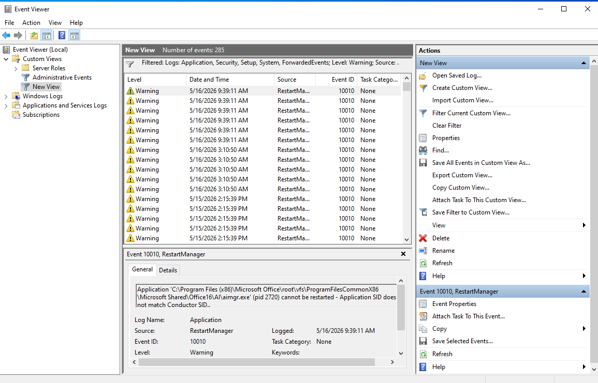

Ví dụ về Warning:

* dịch vụ phản hồi chậm;
* ổ đĩa gần đầy;
* kết nối mạng không ổn định;
* cấu hình có khả năng gây lỗi;
* một thành phần hệ thống hoạt động không như mong đợi.

Warning không phải lúc nào cũng nguy hiểm, nhưng nếu xuất hiện thường xuyên, nó có thể là dấu hiệu cho thấy hệ thống đang có vấn đề.

Trong quản trị hệ thống, Warning giúp phát hiện sớm sự cố trước khi nó trở thành lỗi nghiêm trọng.

### 12.3.3. Information

**Information** là loại sự kiện ghi lại các hoạt động bình thường của hệ thống, ứng dụng hoặc dịch vụ.

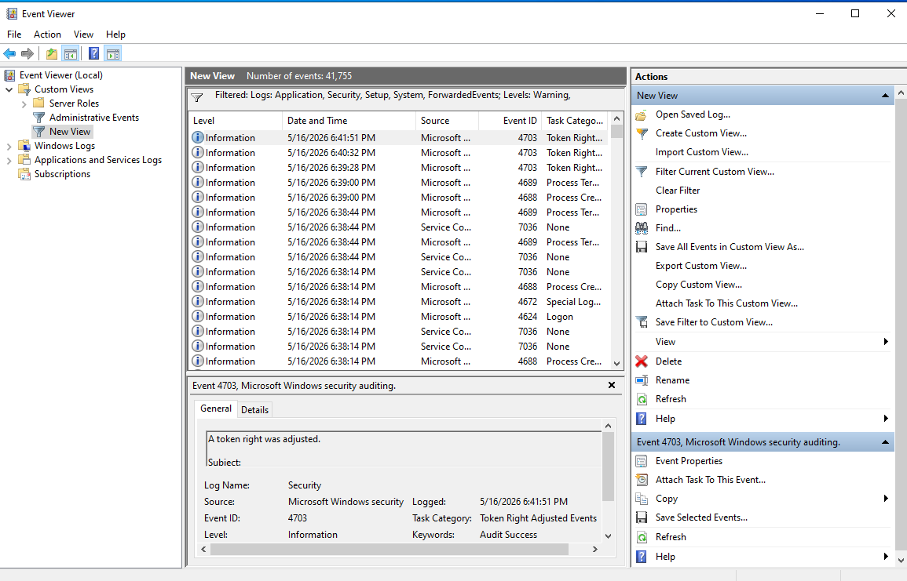

Ví dụ về Information:

* dịch vụ đã khởi động thành công;
* ứng dụng đã hoàn thành một tác vụ;
* hệ thống đã cài đặt cập nhật;
* một thành phần Windows hoạt động bình thường;
* chương trình ghi nhận trạng thái hoạt động.

Information thường không phải là dấu hiệu lỗi. Tuy nhiên, nó vẫn hữu ích khi cần dựng lại chuỗi sự kiện trong quá trình điều tra.

Ví dụ, khi phân tích một sự cố, log Information có thể giúp xác định dịch vụ nào đã chạy trước khi lỗi xảy ra.

### 12.3.4. Success Audit

**Success Audit** là sự kiện ghi lại một hành động bảo mật đã thực hiện thành công.

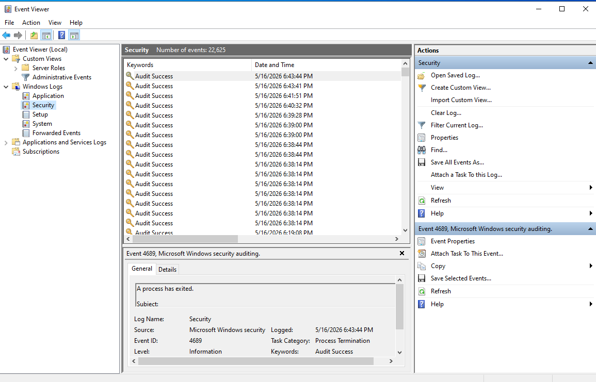

Ví dụ về Success Audit:

* đăng nhập thành công;
* truy cập tài nguyên thành công;
* thay đổi chính sách thành công;
* thao tác quản trị được thực hiện thành công;
* kiểm toán một hành động bảo mật thành công.

Loại sự kiện này thường xuất hiện trong **Security Log**.

Trong SOC, Success Audit rất quan trọng vì nó giúp xác định tài khoản nào đã đăng nhập, đăng nhập vào thời điểm nào và thực hiện hành động gì trên hệ thống.

### 12.3.5. Failure Audit

**Failure Audit** là sự kiện ghi lại một hành động bảo mật không thành công.

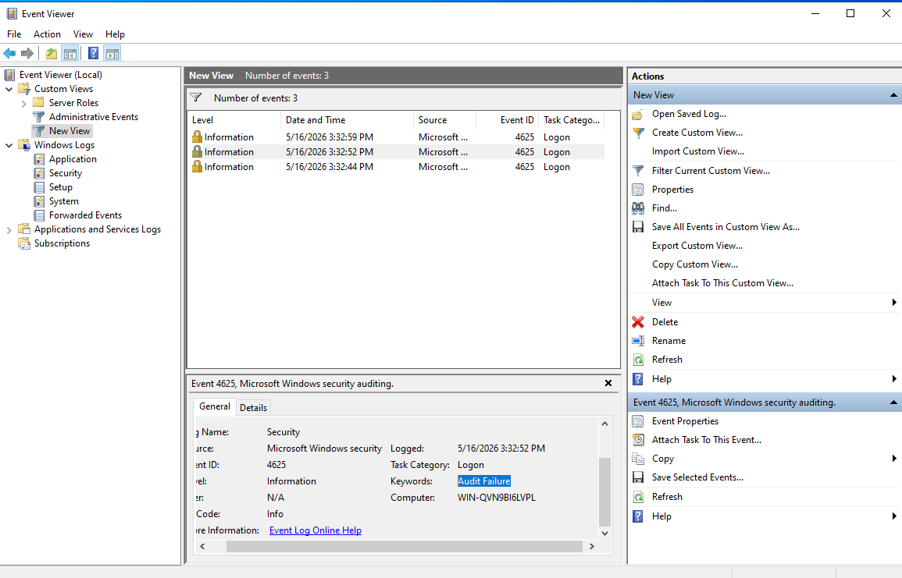

Ví dụ về Failure Audit:

* đăng nhập thất bại;
* nhập sai mật khẩu;
* truy cập tài nguyên bị từ chối;
* thao tác quản trị không được phép;
* cố gắng sử dụng quyền không hợp lệ.

Failure Audit rất quan trọng trong phát hiện tấn công. Nhiều lần đăng nhập thất bại trong thời gian ngắn có thể là dấu hiệu của brute-force attack hoặc credential guessing.

Trong điều tra bảo mật, Failure Audit giúp xác định các hành vi truy cập trái phép hoặc cố gắng vượt qua cơ chế xác thực.

## 12.4. Windows Logs

**Windows Logs** là nhóm log chính trong Event Viewer, nơi Windows lưu lại các sự kiện quan trọng của hệ thống, ứng dụng và bảo mật.

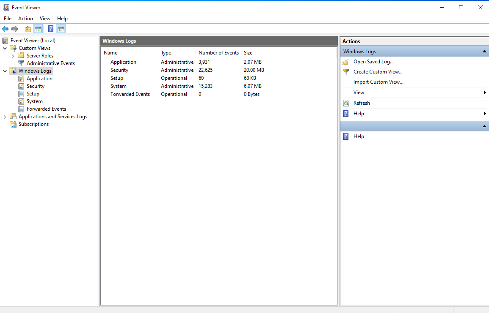

Các log thường gặp gồm:

* Application;
* Security;
* System;
* Setup;
* Forwarded Events;
* Custom Logs nếu có cấu hình riêng.

Trong đó, Application, Security và System là ba nhóm log thường được sử dụng nhiều nhất khi xử lý sự cố và điều tra bảo mật.

### 12.4.1. Application Log

**Application Log** ghi lại các sự kiện liên quan đến ứng dụng chạy trên Windows.

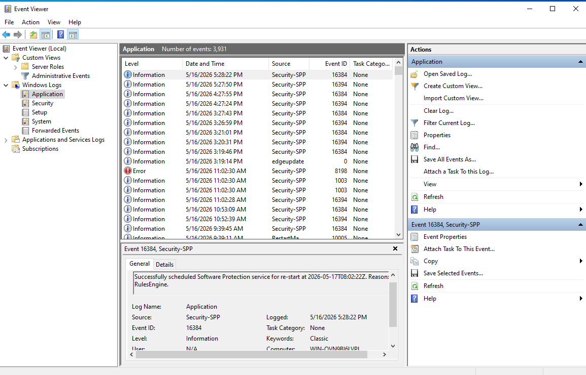

Các sự kiện trong Application Log có thể bao gồm:

* ứng dụng bị lỗi;
* ứng dụng crash;
* ứng dụng không khởi động được;
* phần mềm ghi nhận trạng thái hoạt động;
* lỗi liên quan đến dịch vụ ứng dụng.

Ví dụ, nếu một phần mềm văn phòng hoặc phần mềm nghiệp vụ bị lỗi, thông tin lỗi có thể được ghi trong Application Log.

Application Log hữu ích khi cần xác định nguyên nhân lỗi ở tầng ứng dụng.

### 12.4.2. Security Log

**Security Log** ghi lại các sự kiện liên quan đến bảo mật và kiểm toán trong Windows.

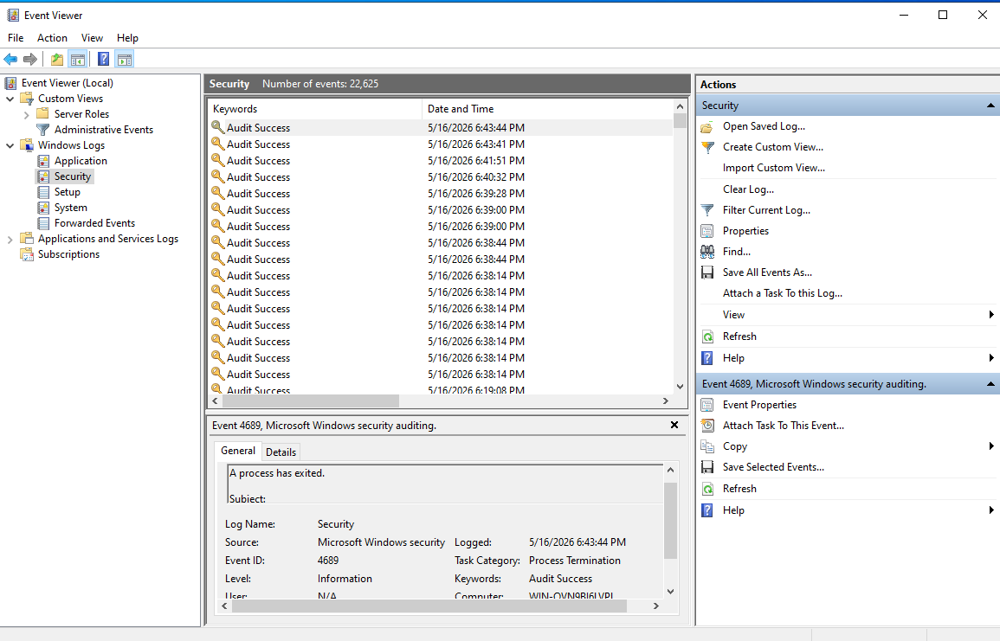

Đây là một trong những log quan trọng nhất đối với SOC và điều tra sự cố bảo mật.

Security Log có thể chứa các sự kiện như:

* đăng nhập thành công;
* đăng nhập thất bại;
* đăng xuất;
* thay đổi tài khoản người dùng;
* thay đổi nhóm;
* thay đổi chính sách bảo mật;
* truy cập tài nguyên;
* sử dụng quyền đặc biệt.

Ví dụ, nếu có nhiều lần đăng nhập thất bại vào một tài khoản trong thời gian ngắn, Security Log có thể giúp phát hiện dấu hiệu tấn công mật khẩu.

Security Log thường được thu thập bởi SIEM hoặc EDR để phân tích tập trung trong môi trường doanh nghiệp.

### 12.4.3. System Log

**System Log** ghi lại các sự kiện liên quan đến hệ điều hành Windows và các thành phần hệ thống.

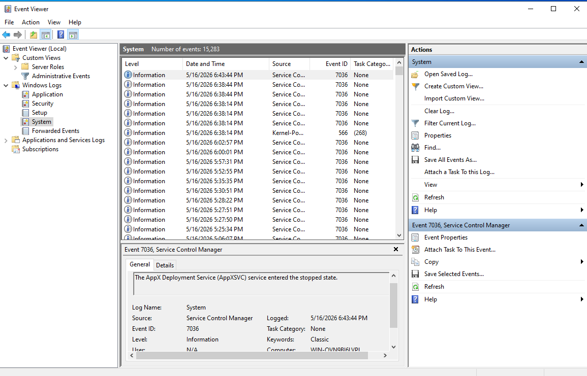

System Log có thể bao gồm:

* lỗi driver;
* lỗi dịch vụ hệ thống;
* sự kiện khởi động hoặc tắt máy;
* lỗi phần cứng;
* lỗi ổ đĩa;
* lỗi mạng;
* trạng thái của các dịch vụ Windows.

Ví dụ, nếu một dịch vụ Windows không khởi động được, sự kiện liên quan có thể xuất hiện trong System Log.

System Log rất quan trọng khi xử lý các lỗi liên quan đến hệ điều hành, phần cứng hoặc dịch vụ nền.

### 12.4.4. Custom Logs

**Custom Logs** là các log tùy chỉnh hoặc log riêng do ứng dụng, dịch vụ hoặc cấu hình quản trị tạo ra.

Không giống các log mặc định như Application, Security và System, Custom Logs phụ thuộc vào phần mềm hoặc chính sách được cài đặt trên hệ thống.

Ví dụ, một số ứng dụng doanh nghiệp, phần mềm bảo mật hoặc công cụ giám sát có thể tạo log riêng trong Event Viewer.

Custom Logs có thể hữu ích khi cần phân tích một ứng dụng cụ thể hoặc theo dõi một nhóm sự kiện chuyên biệt.

Trong môi trường doanh nghiệp, Custom Logs có thể được dùng để phục vụ giám sát, kiểm toán hoặc tích hợp với hệ thống SIEM.

## 12.5. Ý nghĩa của Event Logs trong SOC

Trong SOC, **Event Logs** là một trong những nguồn dữ liệu quan trọng nhất để phát hiện, phân tích và điều tra sự cố bảo mật.

Event Logs giúp SOC Analyst trả lời các câu hỏi quan trọng như:

* ai đã đăng nhập vào hệ thống;
* đăng nhập xảy ra khi nào;
* đăng nhập thành công hay thất bại;
* tài khoản nào có hành vi bất thường;
* dịch vụ nào được tạo hoặc thay đổi;
* có tiến trình hoặc ứng dụng nào gặp lỗi bất thường;
* có thay đổi chính sách hoặc quyền truy cập hay không;
* sự kiện xảy ra theo trình tự như thế nào.

Trong môi trường doanh nghiệp, log từ nhiều máy Windows thường được gửi về SIEM để phân tích tập trung. Nhờ đó, SOC có thể phát hiện các mẫu hành vi bất thường trên nhiều máy cùng lúc.

Ví dụ, nếu cùng một tài khoản đăng nhập thất bại trên nhiều máy trong thời gian ngắn, SIEM có thể cảnh báo về khả năng brute-force hoặc password spraying.

Event Logs không chỉ giúp phát hiện tấn công mà còn hỗ trợ điều tra sau sự cố, dựng lại timeline và xác định phạm vi ảnh hưởng.

## 12.6. Event Viewer trong phát hiện và điều tra tấn công

Event Viewer có thể hỗ trợ phát hiện và điều tra nhiều loại tấn công trên Windows, đặc biệt khi kiểm tra Security Log, System Log và Application Log.

Một số dấu hiệu đáng chú ý trong Event Viewer gồm:

* nhiều lần đăng nhập thất bại;
* đăng nhập thành công vào thời điểm bất thường;
* tài khoản mới được tạo;
* người dùng được thêm vào nhóm Administrators;
* dịch vụ mới được cài đặt;
* scheduled task bất thường;
* lỗi liên tục từ một ứng dụng hoặc dịch vụ;
* hệ thống bị tắt hoặc khởi động lại bất thường;
* thay đổi chính sách bảo mật;
* truy cập trái phép vào tài nguyên.

Khi điều tra tấn công, cần chú ý đến các yếu tố sau:

* thời điểm xảy ra sự kiện;
* tài khoản liên quan;
* máy nguồn và máy đích;
* loại log;
* Event ID;
* mô tả sự kiện;
* hành động thành công hay thất bại;
* sự kiện trước và sau thời điểm nghi ngờ.

Ví dụ, nếu phát hiện nhiều Failure Audit liên quan đến đăng nhập thất bại, sau đó có một Success Audit từ cùng một nguồn, có thể nghi ngờ rằng kẻ tấn công đã đoán đúng mật khẩu.

Event Viewer là công cụ rất hữu ích cho phân tích ban đầu. Tuy nhiên, trong điều tra chuyên sâu, cần kết hợp thêm các nguồn dữ liệu khác như Sysmon logs, PowerShell logs, firewall logs, EDR alerts và SIEM correlation rules.

# 13. System Information

## 13.1. System Information là gì?

**System Information** là công cụ trong Windows dùng để xem thông tin chi tiết về phần cứng, phần mềm, thành phần hệ thống và môi trường hoạt động của máy tính.

Công cụ này giúp người dùng và quản trị viên nhanh chóng kiểm tra cấu hình hệ thống mà không cần cài thêm phần mềm bên ngoài.

System Information có thể hiển thị các thông tin như:

- phiên bản hệ điều hành;
- tên máy tính;
- nhà sản xuất hệ thống;
- model máy;
- loại CPU;
- dung lượng RAM;
- BIOS/UEFI;
- thiết bị phần cứng;
- driver;
- dịch vụ;
- chương trình khởi động;
- biến môi trường.

Trong quản trị hệ thống, System Information rất hữu ích khi cần kiểm tra cấu hình máy, xác định thông tin phần cứng, kiểm tra môi trường phần mềm hoặc hỗ trợ xử lý sự cố.

Trong an toàn thông tin, công cụ này có thể giúp thu thập thông tin ban đầu về hệ thống trước khi phân tích sâu hơn.


## 13.2. Cách mở `msinfo32.exe`

Có nhiều cách để mở System Information trong Windows.

Cách phổ biến nhất là sử dụng hộp thoại Run:

1. Nhấn tổ hợp phím:

```text
Win + R
````

2. Nhập lệnh:

```text
msinfo32.exe
```

3. Nhấn **Enter**.

Ngoài ra, có thể mở bằng Start Menu:

1. Nhấn **Start**.
2. Gõ từ khóa:

```text
System Information
```

3. Chọn ứng dụng **System Information**.

Cũng có thể mở từ Command Prompt hoặc PowerShell bằng lệnh:

```text
msinfo32
```

Sau khi mở, cửa sổ System Information sẽ hiển thị nhiều nhóm thông tin khác nhau, trong đó các nhóm chính gồm:

* **System Summary**;
* **Hardware Resources**;
* **Components**;
* **Software Environment**.

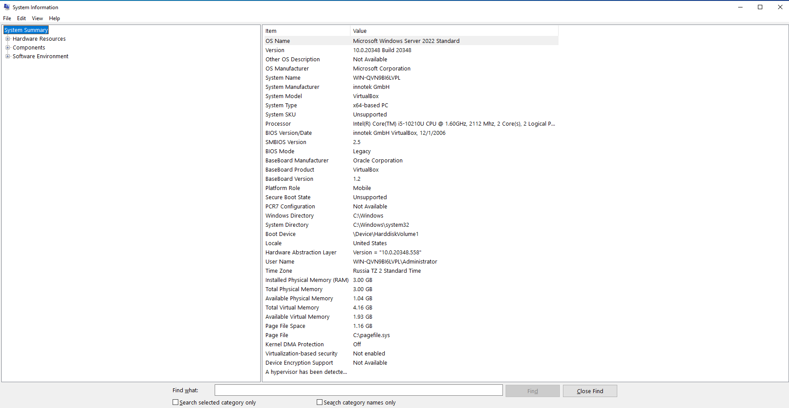

## 13.3. System Summary

**System Summary** là phần tóm tắt thông tin tổng quan của hệ thống. Đây là phần đầu tiên được hiển thị khi mở System Information.

System Summary thường cung cấp các thông tin như:

| Thông tin                 | Ý nghĩa                                |
| ------------------------- | -------------------------------------- |
| OS Name                   | Tên hệ điều hành Windows               |
| Version                   | Phiên bản hệ điều hành                 |
| System Name               | Tên máy tính                           |
| System Manufacturer       | Nhà sản xuất thiết bị                  |
| System Model              | Model máy                              |
| System Type               | Kiến trúc hệ thống, ví dụ x64-based PC |
| Processor                 | Thông tin CPU                          |
| BIOS Version/Date         | Phiên bản và ngày phát hành BIOS       |
| Installed Physical Memory | Dung lượng RAM được cài đặt            |
| Total Physical Memory     | Tổng bộ nhớ vật lý khả dụng            |
| Available Physical Memory | Bộ nhớ còn trống                       |
| Time Zone                 | Múi giờ hệ thống                       |

Phần System Summary rất hữu ích khi cần kiểm tra nhanh thông tin cơ bản của máy tính.

Ví dụ, khi cài phần mềm hoặc driver, người dùng có thể cần biết máy đang dùng Windows phiên bản nào, kiến trúc 32-bit hay 64-bit, CPU gì và dung lượng RAM bao nhiêu.

Trong môi trường doanh nghiệp, System Summary cũng giúp quản trị viên kiểm kê tài sản, kiểm tra cấu hình máy trạm và xác định thiết bị có đáp ứng yêu cầu kỹ thuật hay không.

## 13.4. Hardware Resources

**Hardware Resources** là nhóm thông tin liên quan đến tài nguyên phần cứng của hệ thống.

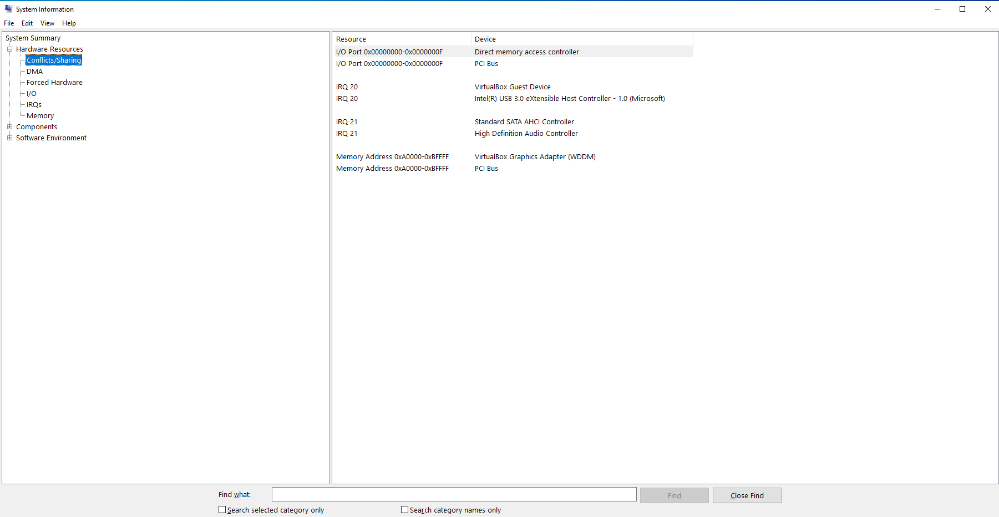

Phần này thường bao gồm các mục như:

* Conflicts/Sharing;
* DMA;
* Forced Hardware;
* I/O;
* IRQs;
* Memory.

Hardware Resources giúp người dùng xem cách Windows phân bổ tài nguyên phần cứng cho các thiết bị.

Ví dụ, hệ thống có thể hiển thị thông tin về:

* vùng bộ nhớ phần cứng;
* ngắt IRQ;
* địa chỉ I/O;
* tài nguyên đang được chia sẻ giữa các thiết bị;
* xung đột phần cứng nếu có.

Đối với người dùng thông thường, phần này có thể khá khó hiểu. Tuy nhiên, với quản trị viên hệ thống hoặc kỹ thuật viên, Hardware Resources có thể hữu ích khi xử lý lỗi phần cứng, driver hoặc xung đột thiết bị.

Trong thực tế hiện nay, Windows thường tự động quản lý phần lớn tài nguyên phần cứng, nên người dùng hiếm khi cần chỉnh sửa trực tiếp các thông tin này.

## 13.5. Components

**Components** là nhóm thông tin hiển thị các thành phần phần cứng và thiết bị được Windows nhận diện.

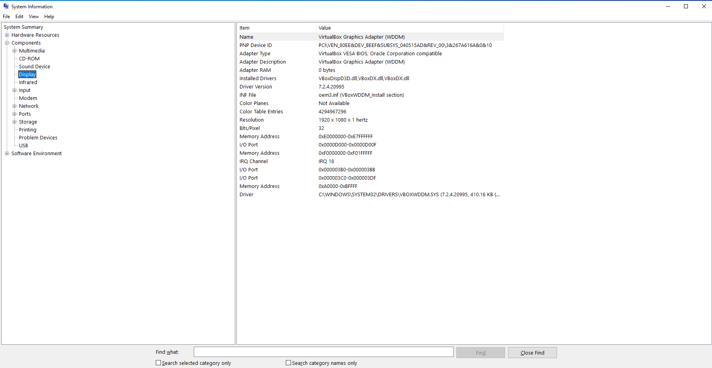

Phần này có thể chứa thông tin về:

* Multimedia;
* Display;
* Infrared;
* Input;
* Modem;
* Network;
* Ports;
* Storage;
* Printing;
* Problem Devices;
* USB.

Ví dụ, trong mục **Display**, người dùng có thể xem thông tin về card đồ họa, driver màn hình và độ phân giải. Trong mục **Network**, có thể xem thông tin về card mạng. Trong mục **Storage**, có thể xem thông tin liên quan đến ổ đĩa.

Một mục rất hữu ích là **Problem Devices**. Mục này hiển thị các thiết bị đang gặp vấn đề hoặc chưa được hệ thống nhận diện đúng.

Components thường được dùng khi cần:

* kiểm tra thiết bị phần cứng;
* xác định driver đang sử dụng;
* xem thông tin card mạng;
* kiểm tra thiết bị lưu trữ;
* phát hiện thiết bị lỗi;
* hỗ trợ xử lý sự cố phần cứng.

Trong điều tra bảo mật, phần Components cũng có thể hỗ trợ kiểm tra các thiết bị bất thường, adapter mạng lạ hoặc thiết bị USB được hệ thống nhận diện.

## 13.6. Software Environment

**Software Environment** là nhóm thông tin liên quan đến môi trường phần mềm của Windows.

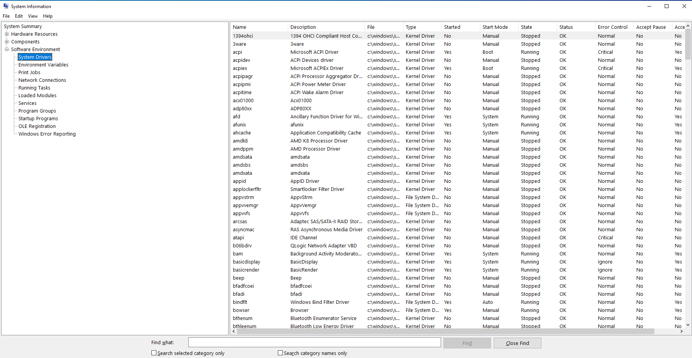

Phần này có thể hiển thị thông tin về:

* System Drivers;
* Environment Variables;
* Print Jobs;
* Network Connections;
* Running Tasks;
* Loaded Modules;
* Services;
* Program Groups;
* Startup Programs;
* OLE Registration;
* Windows Error Reporting.

Software Environment giúp người dùng xem nhiều thông tin quan trọng về các thành phần phần mềm đang hoạt động trên hệ thống.

Ví dụ:

* **Running Tasks** cho biết các tác vụ đang chạy;
* **Services** cho biết các dịch vụ trên hệ thống;
* **Startup Programs** cho biết các chương trình khởi động cùng Windows;
* **Environment Variables** cho biết các biến môi trường;
* **System Drivers** cho biết driver hệ thống.

Trong quản trị hệ thống, Software Environment rất hữu ích khi cần kiểm tra phần mềm, dịch vụ, driver hoặc chương trình tự khởi động.

Trong an toàn thông tin, đây là nơi có thể hỗ trợ phát hiện dấu hiệu bất thường như chương trình khởi động lạ, dịch vụ đáng nghi hoặc driver không rõ nguồn gốc.

## 13.7. Environment Variables

**Environment Variables**, hay biến môi trường, là các giá trị được Windows và chương trình sử dụng để xác định đường dẫn, cấu hình hoặc thông tin môi trường hệ thống.

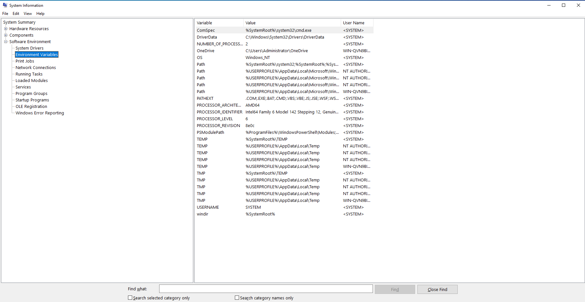

Biến môi trường giúp hệ điều hành và ứng dụng hoạt động linh hoạt hơn. Thay vì phải ghi cố định một đường dẫn, chương trình có thể dùng biến môi trường để tham chiếu đến vị trí tương ứng trên từng máy.

Ví dụ:

| Biến môi trường | Ý nghĩa                                                  |
| --------------- | -------------------------------------------------------- |
| `WINDIR`        | Chỉ đến thư mục cài đặt Windows                          |
| `SystemRoot`    | Chỉ đến thư mục hệ thống Windows                         |
| `TEMP`          | Chỉ đến thư mục tạm                                      |
| `TMP`           | Chỉ đến thư mục tạm                                      |
| `USERPROFILE`   | Chỉ đến thư mục hồ sơ người dùng hiện tại                |
| `PATH`          | Danh sách thư mục dùng để tìm chương trình khi chạy lệnh |
| `ComSpec`       | Chỉ đến chương trình Command Prompt                      |

Biến môi trường rất quan trọng khi chạy lệnh, viết script hoặc xử lý lỗi đường dẫn.

Ví dụ, thay vì viết trực tiếp:

```text
C:\Windows
```

có thể dùng:

```text
%WINDIR%
```

Điều này giúp lệnh hoặc script hoạt động linh hoạt hơn trên nhiều máy khác nhau.

## 13.8. Biến môi trường `WINDIR`

`WINDIR` là biến môi trường dùng để chỉ đường dẫn đến thư mục cài đặt Windows.

Thông thường, giá trị của `WINDIR` là:

```text
C:\Windows
```

Ví dụ, khi cần tham chiếu đến thư mục System32, có thể dùng:

```text
%WINDIR%\System32
```

Thông thường, đường dẫn này tương đương với:

```text
C:\Windows\System32
```

Biến `WINDIR` hữu ích vì không phải hệ thống Windows nào cũng bắt buộc được cài trong `C:\Windows`. Nếu Windows được cài ở vị trí khác, biến môi trường vẫn giúp chương trình tìm đúng thư mục hệ thống.

Trong quản trị Windows, `WINDIR` thường xuất hiện trong script, lệnh hệ thống, cấu hình phần mềm và một số tài liệu kỹ thuật.

Ví dụ:

```cmd
echo %WINDIR%
```

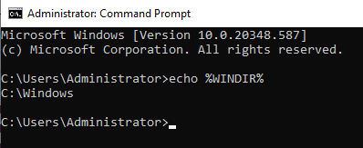

Lệnh trên dùng để hiển thị giá trị hiện tại của biến `WINDIR` trong Command Prompt.

## 13.9. Biến môi trường `ComSpec`

`ComSpec` là biến môi trường dùng để chỉ đường dẫn đến chương trình Command Prompt của Windows.

Thông thường, giá trị của `ComSpec` là:

```text
%SystemRoot%\system32\cmd.exe
```

Hoặc tương đương với:

```text
C:\Windows\System32\cmd.exe
```

Biến này cho biết Windows sẽ sử dụng chương trình nào làm trình thông dịch lệnh mặc định cho Command Prompt.

Có thể kiểm tra giá trị của `ComSpec` bằng lệnh:

```cmd
echo %ComSpec%
```

Kết quả thường là:

```text
C:\Windows\system32\cmd.exe
```

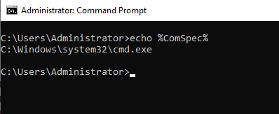

Trong thực tế, `ComSpec` có thể được sử dụng bởi script, chương trình cài đặt hoặc một số ứng dụng cần gọi Command Prompt để chạy lệnh.

Từ góc độ bảo mật, nếu giá trị `ComSpec` bị thay đổi bất thường, đó có thể là dấu hiệu cần kiểm tra kỹ, vì nó liên quan đến chương trình thực thi lệnh của hệ thống.

## 13.10. Tìm kiếm thông tin trong System Information

System Information có chức năng tìm kiếm giúp người dùng nhanh chóng tìm thông tin cần thiết trong toàn bộ dữ liệu hệ thống.

Ở phía dưới cửa sổ System Information thường có ô **Find what**. Người dùng có thể nhập từ khóa cần tìm, sau đó nhấn **Find** để tìm thông tin liên quan.

Ví dụ, có thể tìm các từ khóa như:

```text
WINDIR
```

```text
ComSpec
```

```text
Processor
```

```text
BIOS
```

```text
Startup
```

Chức năng tìm kiếm rất hữu ích vì System Information chứa nhiều nhóm thông tin khác nhau. Nếu không dùng tìm kiếm, người dùng có thể mất thời gian để mở từng mục thủ công.

Trong quản trị và xử lý sự cố, tìm kiếm trong System Information giúp nhanh chóng xác định:

* biến môi trường;
* thông tin CPU;
* phiên bản BIOS;
* driver;
* chương trình khởi động;
* dịch vụ;
* thiết bị có vấn đề.

# 14. Resource Monitor

## 14.1. Resource Monitor là gì?

**Resource Monitor** là công cụ trong Windows dùng để theo dõi chi tiết việc sử dụng tài nguyên hệ thống theo thời gian thực.

Công cụ này cho phép người dùng quan sát các thành phần chính của hệ thống như:

- CPU;
- Memory;
- Disk;
- Network.

So với Task Manager, Resource Monitor cung cấp thông tin chi tiết hơn về từng tiến trình và mức độ sử dụng tài nguyên của chúng. Vì vậy, công cụ này rất hữu ích khi cần phân tích nguyên nhân máy tính bị chậm, ứng dụng bị treo, ổ đĩa hoạt động bất thường hoặc mạng có lưu lượng đáng nghi.

Resource Monitor thường được sử dụng trong các tình huống như:

- kiểm tra tiến trình sử dụng nhiều CPU;
- xác định chương trình chiếm nhiều RAM;
- theo dõi tiến trình đang đọc/ghi ổ đĩa;
- kiểm tra kết nối mạng của từng tiến trình;
- phát hiện hoạt động bất thường trên hệ thống;
- hỗ trợ xử lý sự cố hiệu suất.


## 14.2. Cách mở `resmon.exe`

Có nhiều cách để mở Resource Monitor trong Windows.

Cách phổ biến nhất là sử dụng hộp thoại Run:

1. Nhấn tổ hợp phím:

```text
Win + R
````

2. Nhập lệnh:

```text
resmon.exe
```

3. Nhấn **Enter**.

Ngoài ra, có thể mở bằng Start Menu:

1. Nhấn **Start**.
2. Gõ từ khóa:

```text
Resource Monitor
```

3. Chọn ứng dụng **Resource Monitor**.

Cũng có thể mở Resource Monitor từ Task Manager:

1. Mở **Task Manager**.
2. Chọn tab **Performance**.
3. Chọn **Open Resource Monitor**.

Sau khi mở, Resource Monitor sẽ hiển thị các tab chính gồm:

* Overview;
* CPU;
* Memory;
* Disk;
* Network.

## 14.3. Overview

Tab **Overview** cung cấp cái nhìn tổng quan về tình trạng sử dụng tài nguyên của hệ thống.

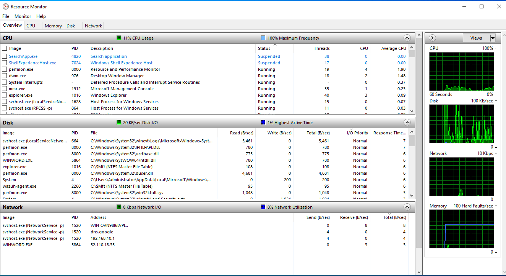

Trong tab này, người dùng có thể xem nhanh hoạt động của:

* CPU;
* Disk;
* Network;
* Memory.

Overview giúp người dùng nhanh chóng xác định tài nguyên nào đang có dấu hiệu bất thường. Ví dụ, nếu máy tính bị chậm, có thể mở Overview để xem CPU, RAM, Disk hay Network đang bị sử dụng nhiều nhất.

Tab Overview thường hiển thị danh sách các tiến trình đang hoạt động cùng với mức độ sử dụng tài nguyên của chúng. Điều này giúp người dùng có cái nhìn ban đầu trước khi chuyển sang các tab chi tiết hơn.

Ví dụ:

* nếu CPU cao, chuyển sang tab **CPU**;
* nếu RAM gần đầy, chuyển sang tab **Memory**;
* nếu ổ đĩa hoạt động liên tục, chuyển sang tab **Disk**;
* nếu có lưu lượng mạng bất thường, chuyển sang tab **Network**.

Overview là nơi phù hợp để bắt đầu quá trình phân tích hiệu suất hệ thống.

## 14.4. CPU Monitoring

Tab **CPU** trong Resource Monitor cho phép theo dõi chi tiết hoạt động của bộ xử lý và các tiến trình đang sử dụng CPU.

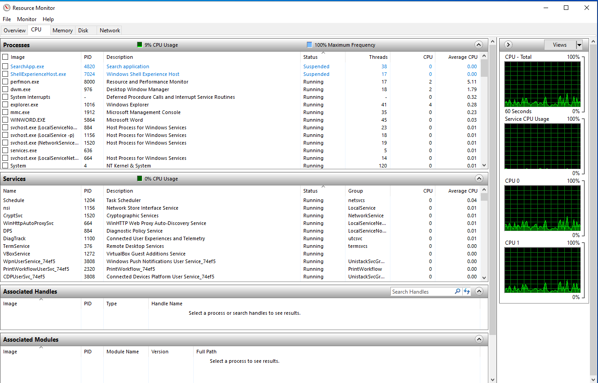

Trong tab này, người dùng có thể xem:

* tiến trình nào đang sử dụng CPU;
* mức sử dụng CPU của từng tiến trình;
* số luồng đang chạy;
* dịch vụ liên quan đến tiến trình;
* module hoặc handle liên quan.

Thông tin CPU rất hữu ích khi máy tính bị chậm, quạt chạy mạnh hoặc hệ thống phản hồi kém.

Ví dụ, nếu một tiến trình sử dụng CPU ở mức cao trong thời gian dài, có thể tiến trình đó đang xử lý tác vụ nặng, bị lỗi hoặc có hành vi bất thường.

Một số tình huống cần kiểm tra CPU gồm:

* máy tính chạy chậm;
* ứng dụng không phản hồi;
* CPU luôn gần 100%;
* tiến trình lạ sử dụng nhiều CPU;
* dịch vụ nền gây quá tải hệ thống.

Trong điều tra bảo mật, tiến trình sử dụng CPU bất thường cũng có thể là dấu hiệu của mã độc, script đào tiền ảo hoặc chương trình chạy nền không mong muốn.

## 14.5. Memory Monitoring

Tab **Memory** dùng để theo dõi việc sử dụng bộ nhớ RAM của hệ thống.

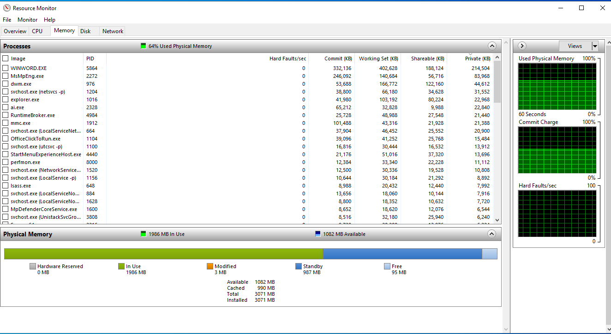

Trong tab này, người dùng có thể xem:

* tiến trình nào đang sử dụng nhiều RAM;
* tổng lượng RAM đang được sử dụng;
* lượng RAM còn trống;
* bộ nhớ đang ở trạng thái Standby;
* bộ nhớ bị chiếm bởi tiến trình cụ thể;
* tình trạng paging nếu hệ thống thiếu RAM.

Memory Monitoring rất quan trọng vì khi RAM bị sử dụng quá nhiều, Windows có thể phải dùng bộ nhớ ảo trên ổ đĩa. Điều này làm hệ thống chậm hơn đáng kể.

Một số dấu hiệu cần kiểm tra trong tab Memory gồm:

* RAM gần đầy;
* một tiến trình chiếm RAM bất thường;
* ứng dụng tăng RAM liên tục theo thời gian;
* hệ thống bị chậm khi mở nhiều chương trình;
* máy thường xuyên bị treo hoặc phản hồi chậm.

Trong xử lý sự cố, tab Memory giúp xác định ứng dụng nào đang gây thiếu bộ nhớ. Trong một số trường hợp, tiến trình sử dụng RAM tăng liên tục có thể là dấu hiệu của memory leak.

Từ góc độ bảo mật, tiến trình lạ sử dụng nhiều RAM cũng cần được kiểm tra, đặc biệt nếu nó không có tên rõ ràng hoặc chạy từ đường dẫn bất thường.

## 14.6. Disk Monitoring

Tab **Disk** cho phép theo dõi hoạt động đọc và ghi dữ liệu trên ổ đĩa.

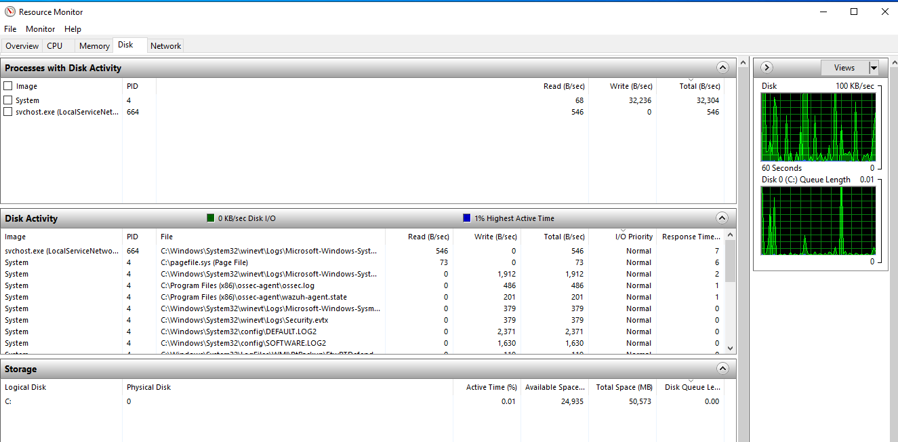

Trong tab này, người dùng có thể xem:

* tiến trình nào đang đọc/ghi dữ liệu;
* tệp nào đang được truy cập;
* tốc độ đọc dữ liệu;
* tốc độ ghi dữ liệu;
* thời gian phản hồi của ổ đĩa;
* mức độ hoạt động của từng ổ đĩa.

Disk Monitoring rất hữu ích khi máy tính bị chậm do ổ đĩa hoạt động liên tục. Trong nhiều trường hợp, Disk sử dụng cao có thể làm toàn bộ hệ thống phản hồi chậm, dù CPU và RAM không quá tải.

Một số tình huống cần kiểm tra Disk gồm:

* ổ đĩa luôn hoạt động ở mức cao;
* máy chậm khi mở ứng dụng;
* hệ thống khởi động lâu;
* phần mềm ghi dữ liệu liên tục;
* nghi ngờ có tiến trình đang đọc nhiều tệp;
* nghi ngờ mã độc đang mã hóa hoặc sao chép dữ liệu.

Trong an toàn thông tin, Disk Monitoring có thể hỗ trợ phát hiện hành vi bất thường như:

* tiến trình đọc nhiều tệp trong thời gian ngắn;
* ghi dữ liệu vào thư mục lạ;
* truy cập nhiều tệp người dùng;
* hoạt động giống ransomware;
* tạo hoặc sửa nhiều tệp bất thường.

## 14.7. Network Monitoring

Tab **Network** cho phép theo dõi hoạt động mạng của hệ thống theo từng tiến trình.

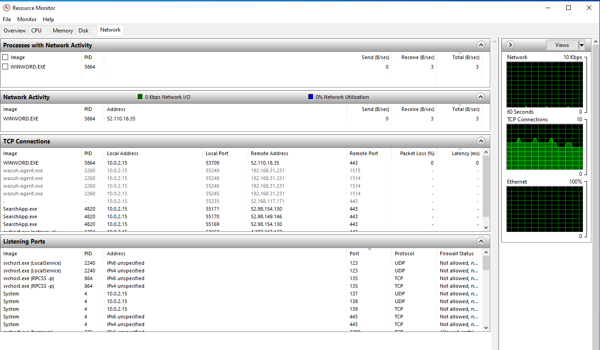

Trong tab này, người dùng có thể xem:

* tiến trình nào đang sử dụng mạng;
* địa chỉ IP từ xa đang kết nối;
* cổng mạng đang sử dụng;
* lưu lượng gửi và nhận;
* kết nối TCP đang mở;
* cổng đang lắng nghe.

Network Monitoring rất hữu ích khi cần kiểm tra ứng dụng nào đang truy cập Internet hoặc kết nối đến máy chủ bên ngoài.

Một số tình huống cần kiểm tra Network gồm:

* mạng chậm bất thường;
* có lưu lượng mạng cao dù người dùng không làm gì;
* tiến trình lạ kết nối ra ngoài;
* ứng dụng kết nối đến IP không rõ;
* nghi ngờ máy bị mã độc điều khiển từ xa;
* cần kiểm tra chương trình nào đang mở cổng lắng nghe.

Trong điều tra bảo mật, tab Network rất quan trọng vì nhiều mã độc cần kết nối ra ngoài để nhận lệnh, gửi dữ liệu hoặc tải thêm payload.

Khi phát hiện một tiến trình lạ có kết nối mạng, cần kiểm tra thêm:

* tên tiến trình;
* đường dẫn file thực thi;
* địa chỉ IP từ xa;
* cổng kết nối;
* thời điểm kết nối;
* tài khoản đang chạy tiến trình.

## 14.8. Phân tích tiến trình bằng Resource Monitor

Resource Monitor cho phép phân tích tiến trình chi tiết hơn so với Task Manager.

Khi kiểm tra một tiến trình, người dùng có thể xem tiến trình đó đang sử dụng tài nguyên nào, ví dụ:

* dùng bao nhiêu CPU;
* chiếm bao nhiêu RAM;
* đang đọc hoặc ghi tệp nào;
* đang kết nối đến địa chỉ IP nào;
* đang sử dụng dịch vụ hoặc handle nào.

Quy trình phân tích cơ bản có thể thực hiện như sau:

1. Mở **Resource Monitor**.
2. Vào tab **Overview** để xác định tài nguyên bị sử dụng nhiều.
3. Chuyển sang tab tương ứng: **CPU**, **Memory**, **Disk** hoặc **Network**.
4. Tìm tiến trình có mức sử dụng bất thường.
5. Kiểm tra tên tiến trình, PID và tài nguyên đang sử dụng.
6. Nếu cần, đối chiếu với Task Manager, Event Viewer hoặc công cụ bảo mật khác.

Một số dấu hiệu tiến trình đáng nghi gồm:

* tên tiến trình lạ;
* chạy từ thư mục `Temp`, `AppData` hoặc `Downloads`;
* sử dụng CPU cao bất thường;
* đọc/ghi nhiều tệp trong thời gian ngắn;
* kết nối đến IP lạ;
* không có mô tả rõ ràng;
* chạy dưới quyền người dùng không phù hợp.

Resource Monitor không thay thế các công cụ điều tra chuyên sâu, nhưng nó rất hữu ích trong bước kiểm tra ban đầu.

## 14.9. Ứng dụng Resource Monitor trong xử lý sự cố

Resource Monitor là công cụ rất hữu ích trong xử lý sự cố Windows, đặc biệt là các sự cố liên quan đến hiệu suất và tài nguyên hệ thống.

Một số ứng dụng phổ biến gồm:

* xác định nguyên nhân máy tính chạy chậm;
* kiểm tra tiến trình sử dụng CPU cao;
* phát hiện ứng dụng chiếm nhiều RAM;
* kiểm tra ổ đĩa bị quá tải;
* xác định chương trình đang sử dụng mạng;
* kiểm tra kết nối TCP đáng nghi;
* hỗ trợ phân tích tiến trình bất thường;
* hỗ trợ điều tra ban đầu khi nghi ngờ mã độc.

Ví dụ, nếu người dùng báo rằng máy tính rất chậm, quản trị viên có thể mở Resource Monitor để kiểm tra:

* CPU có bị sử dụng quá cao không;
* RAM có gần đầy không;
* Disk có hoạt động liên tục không;
* Network có lưu lượng bất thường không.

Nếu phát hiện một tiến trình chiếm nhiều tài nguyên, cần kiểm tra thêm tiến trình đó là gì, nằm ở đâu và có hợp pháp hay không.

Trong SOC, Resource Monitor có thể hỗ trợ phân tích nhanh trên máy cục bộ. Tuy nhiên, để điều tra đầy đủ, cần kết hợp thêm các nguồn dữ liệu khác như Event Viewer, Sysmon, Windows Defender, EDR, firewall logs và SIEM.

Tóm lại, Resource Monitor là công cụ quan trọng giúp người học Windows hiểu hệ thống đang sử dụng tài nguyên như thế nào và hỗ trợ phát hiện các dấu hiệu bất thường ban đầu.

# 15. Command Prompt

## 15.1. Command Prompt là gì?

**Command Prompt**, thường gọi là **CMD**, là giao diện dòng lệnh truyền thống của Windows. Thay vì thao tác bằng giao diện đồ họa, người dùng có thể nhập lệnh để thực hiện các tác vụ quản trị, kiểm tra hệ thống, cấu hình mạng và xử lý sự cố.

Command Prompt cho phép người dùng làm việc với Windows bằng các câu lệnh như:

- xem tên máy tính;
- kiểm tra tài khoản đang đăng nhập;
- kiểm tra cấu hình mạng;
- xem kết nối mạng;
- quản lý người dùng cục bộ;
- quản lý nhóm cục bộ;
- mở công cụ hệ thống;
- chạy script hoặc chương trình.

## 15.2. Cách mở CMD

Có nhiều cách để mở Command Prompt trong Windows.

Cách phổ biến nhất là mở từ Start Menu:

1. Nhấn **Start**.
2. Gõ từ khóa:

```text
cmd
````

3. Chọn **Command Prompt**.

Có thể mở CMD bằng hộp thoại Run:

1. Nhấn tổ hợp phím:

```text
Win + R
```

2. Nhập:

```text
cmd
```

3. Nhấn **Enter**.

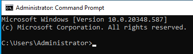

Nếu cần chạy CMD với quyền quản trị, có thể:

1. Nhấn **Start**.
2. Gõ `cmd`.
3. Nhấp chuột phải vào **Command Prompt**.
4. Chọn **Run as administrator**.

Khi chạy CMD với quyền quản trị, người dùng có thể thực hiện nhiều lệnh yêu cầu quyền cao hơn, ví dụ như thay đổi cấu hình hệ thống hoặc quản lý tài khoản người dùng.

## 15.3. Cú pháp lệnh trong CMD

Một lệnh trong CMD thường có cấu trúc cơ bản như sau:

```cmd
command [option] [argument]
```

Trong đó:

| Thành phần | Ý nghĩa                       |
| ---------- | ----------------------------- |
| `command`  | Tên lệnh cần chạy             |
| `option`   | Tùy chọn hoặc tham số bổ sung |
| `argument` | Đối tượng mà lệnh sẽ tác động |

Ví dụ:

```cmd
ipconfig /all
```

Trong lệnh trên:

* `ipconfig` là tên lệnh;
* `/all` là tùy chọn để hiển thị thông tin chi tiết hơn.

Một ví dụ khác:

```cmd
net user
```

Trong lệnh này:

* `net` là lệnh chính;
* `user` là tham số dùng để làm việc với tài khoản người dùng.

CMD thường sử dụng dấu `/` cho các tùy chọn, ví dụ:

```cmd
ipconfig /all
net user /?
```

Để dùng CMD hiệu quả, cần hiểu tên lệnh, tham số và cách xem trợ giúp của từng lệnh.

## 15.4. Lệnh `hostname`

Lệnh `hostname` dùng để hiển thị tên máy tính hiện tại.

Cú pháp:

```cmd
hostname
```

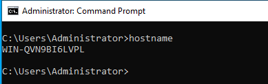

Tên máy tính rất quan trọng trong quản trị hệ thống và điều tra sự cố. Khi làm việc trong mạng doanh nghiệp, mỗi máy tính thường có một hostname riêng để phân biệt với các thiết bị khác.

Lệnh này thường được dùng khi cần:

* xác định đang làm việc trên máy nào;
* ghi nhận thông tin máy trong báo cáo;
* kiểm tra máy trong môi trường domain;
* đối chiếu với log hoặc cảnh báo bảo mật.

## 15.5. Lệnh `whoami`

Lệnh `whoami` dùng để hiển thị tài khoản người dùng hiện tại đang đăng nhập trong phiên CMD.

Cú pháp:

```cmd
whoami
```

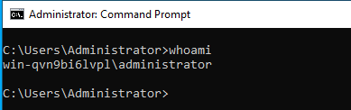

Nếu máy tính thuộc domain, kết quả có thể có dạng:

```text
company\user01
```

Lệnh này giúp xác định người dùng hiện tại đang chạy lệnh là ai. Đây là thông tin quan trọng khi kiểm tra quyền, phân tích log hoặc xử lý sự cố.

Một số tình huống sử dụng `whoami`:

* kiểm tra tài khoản đang đăng nhập;
* xác định đang dùng tài khoản local hay domain;
* kiểm tra ngữ cảnh người dùng khi chạy script;
* hỗ trợ điều tra hoạt động đáng nghi.

Trong an toàn thông tin, `whoami` thường được dùng trong giai đoạn thu thập thông tin ban đầu trên hệ thống Windows.

## 15.6. Lệnh `ipconfig`

Lệnh `ipconfig` dùng để hiển thị thông tin cấu hình mạng cơ bản của máy tính Windows.

Cú pháp:

```cmd
ipconfig
```

Lệnh này thường hiển thị các thông tin như:

* địa chỉ IPv4;
* subnet mask;
* default gateway;
* adapter mạng đang sử dụng;
* trạng thái kết nối mạng.

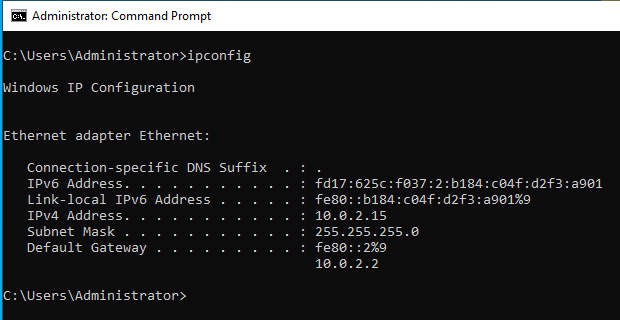

Lệnh `ipconfig` rất hữu ích khi cần kiểm tra nhanh máy tính có nhận địa chỉ IP hay không.

Một số tình huống thường dùng:

* máy không vào được mạng;
* cần kiểm tra địa chỉ IP;
* cần xác định default gateway;
* kiểm tra adapter mạng;
* kiểm tra cấu hình trong môi trường lab.

## 15.7. Lệnh `ipconfig /all`

Lệnh `ipconfig /all` hiển thị thông tin cấu hình mạng chi tiết hơn so với `ipconfig`.

Cú pháp:

```cmd
ipconfig /all
```

Lệnh này có thể hiển thị thêm các thông tin như:

* hostname;
* DNS suffix;
* địa chỉ MAC;
* DHCP enabled;
* DHCP server;
* DNS server;
* lease obtained;
* lease expires;
* thông tin chi tiết của từng adapter mạng.

Ví dụ, để xem địa chỉ MAC của card mạng, có thể dùng:

```cmd
ipconfig /all
```

Sau đó tìm dòng:

```text
Physical Address
```

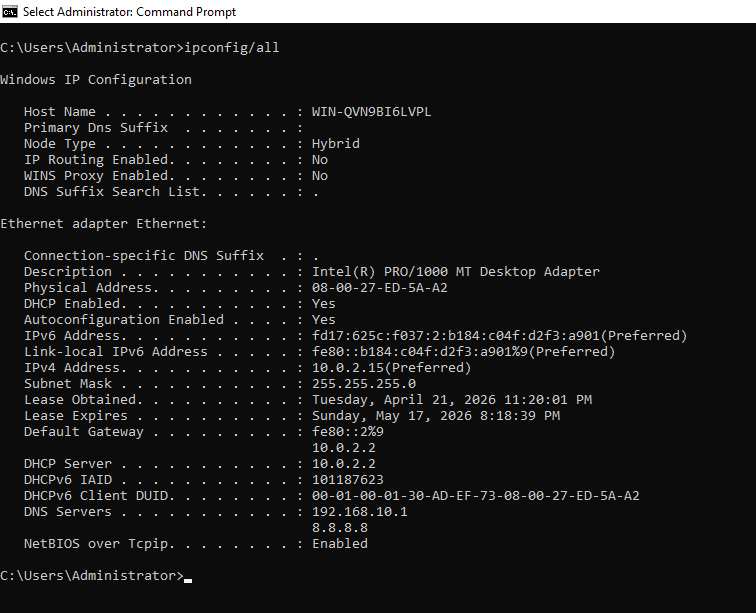

Trong quản trị hệ thống, `ipconfig /all` thường được dùng khi cần kiểm tra chi tiết cấu hình mạng của một máy.

Trong SOC hoặc điều tra sự cố, thông tin từ `ipconfig /all` có thể giúp xác định:

* máy đang dùng DNS nào;
* địa chỉ MAC của thiết bị;
* máy có nhận IP từ DHCP hay không;
* adapter mạng nào đang hoạt động;
* có adapter ảo hoặc cấu hình mạng bất thường hay không.

## 15.8. Lệnh `netstat`

Lệnh `netstat` dùng để hiển thị thông tin về các kết nối mạng, cổng đang lắng nghe và thống kê mạng trên Windows.

Cú pháp cơ bản:

```cmd
netstat
```

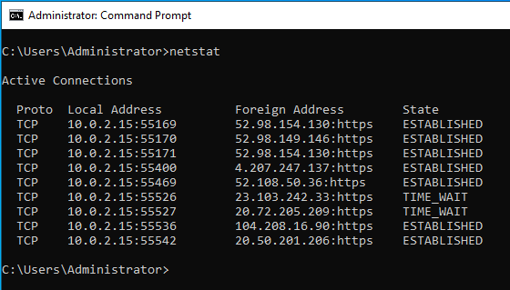

Một số tùy chọn thường dùng:

```cmd
netstat -ano
```

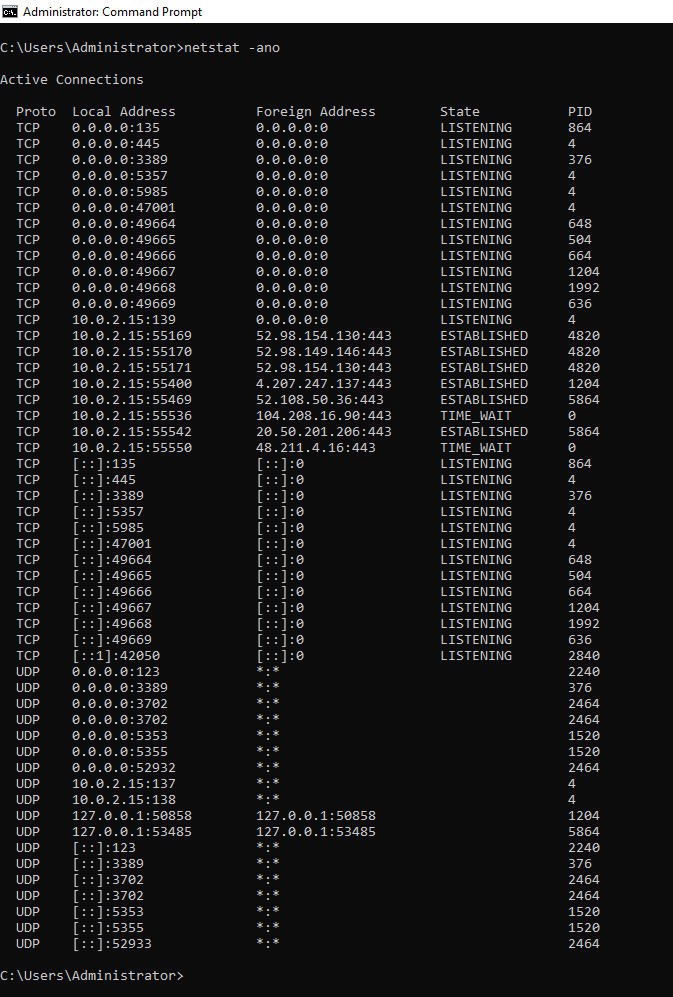

Ý nghĩa thường gặp:

| Tùy chọn | Ý nghĩa                                        |
| -------- | ---------------------------------------------- |
| `-a`     | Hiển thị tất cả kết nối và cổng đang lắng nghe |
| `-n`     | Hiển thị địa chỉ và cổng dưới dạng số          |
| `-o`     | Hiển thị PID của tiến trình liên quan          |


Lệnh này giúp xem tiến trình nào đang mở kết nối mạng hoặc lắng nghe trên cổng nào.

Thông tin thường có trong kết quả `netstat`:

* protocol;
* local address;
* foreign address;
* state;
* PID.

Một số trạng thái kết nối thường gặp:

| Trạng thái  | Ý nghĩa                             |
| ----------- | ----------------------------------- |
| LISTENING   | Đang lắng nghe kết nối              |
| ESTABLISHED | Kết nối đã được thiết lập           |
| TIME_WAIT   | Kết nối đang chờ đóng               |
| CLOSE_WAIT  | Kết nối đang chờ phía ứng dụng đóng |

Trong an toàn thông tin, `netstat` rất hữu ích để kiểm tra kết nối đáng nghi, ví dụ một tiến trình lạ đang kết nối ra địa chỉ IP bên ngoài.

## 15.9. Lệnh `net`

Lệnh `net` là một nhóm lệnh dùng để quản lý nhiều thành phần trong Windows, đặc biệt là người dùng, nhóm, dịch vụ, chia sẻ mạng và phiên kết nối.

Cú pháp chung:

```cmd
net [subcommand]
```

Một số lệnh `net` thường gặp:

| Lệnh             | Chức năng                        |
| ---------------- | -------------------------------- |
| `net user`       | Quản lý tài khoản người dùng     |
| `net localgroup` | Quản lý nhóm cục bộ              |
| `net share`      | Xem hoặc quản lý thư mục chia sẻ |
| `net use`        | Kết nối tài nguyên mạng          |
| `net session`    | Xem phiên kết nối đến máy        |
| `net start`      | Xem hoặc khởi động dịch vụ       |
| `net stop`       | Dừng dịch vụ                     |

Lệnh `net` rất quan trọng trong quản trị Windows vì có thể thực hiện nhiều thao tác nhanh trực tiếp từ CMD.

### 15.9.1. Lệnh `net user`

Lệnh `net user` dùng để xem và quản lý tài khoản người dùng trên Windows.

Cú pháp xem danh sách người dùng:

```cmd
net user
```

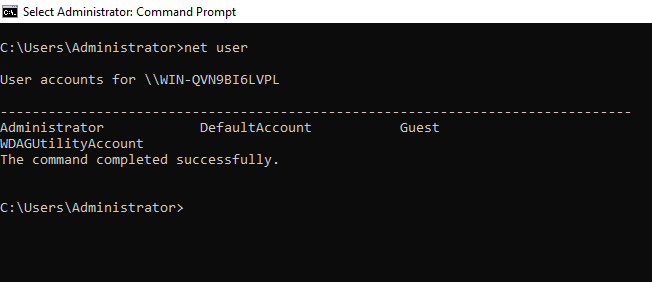

Cú pháp xem thông tin một người dùng cụ thể:

```cmd
net user username
```
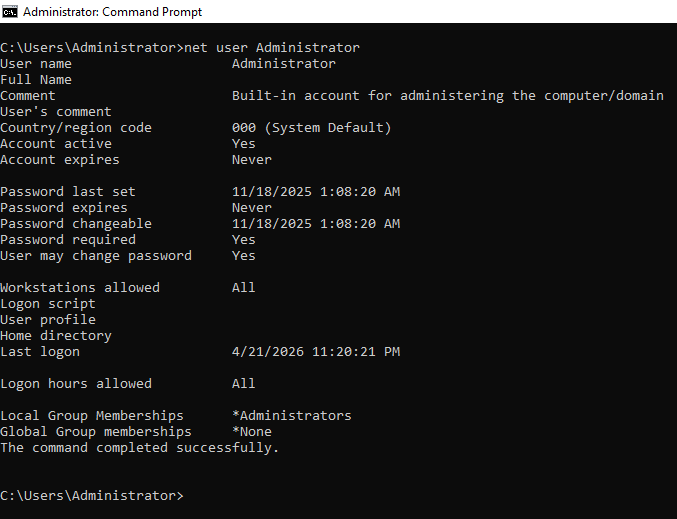

Lệnh này có thể hiển thị các thông tin như:

* tên tài khoản;
* tài khoản đang bật hay bị khóa;
* thời điểm đặt mật khẩu gần nhất;
* thời điểm mật khẩu hết hạn;
* nhóm mà người dùng thuộc về;
* thời gian đăng nhập được phép.

Với quyền quản trị, `net user` cũng có thể được dùng để tạo hoặc chỉnh sửa tài khoản.

Ví dụ tạo người dùng mới:

```cmd
net user testuser Password123 /add
```

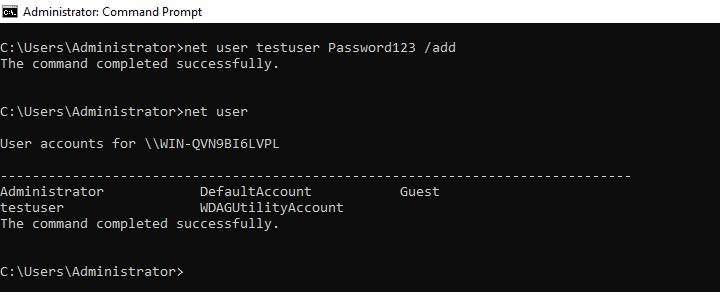

Tuy nhiên, khi dùng trong môi trường học tập hoặc lab, cần cẩn thận và chỉ thực hiện trên hệ thống được phép.

Trong điều tra bảo mật, `net user` giúp kiểm tra có tài khoản lạ nào được tạo trên máy hay không.

### 15.9.2. Lệnh `net localgroup`

Lệnh `net localgroup` dùng để xem và quản lý các nhóm cục bộ trên Windows.

Cú pháp xem danh sách nhóm cục bộ:

```cmd
net localgroup
```

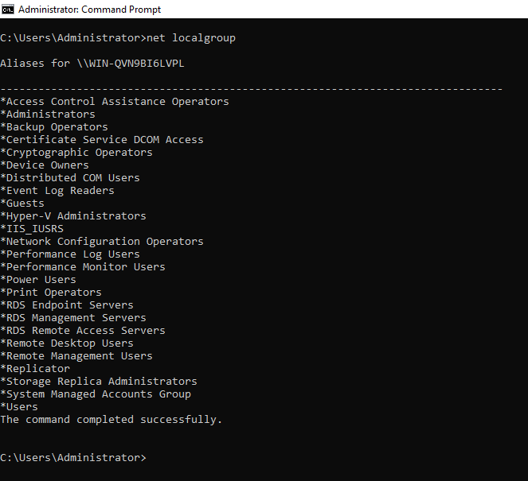

Cú pháp xem thành viên của một nhóm:

```cmd
net localgroup groupname
```

Ví dụ kiểm tra nhóm Administrators:

```cmd
net localgroup Administrators
```

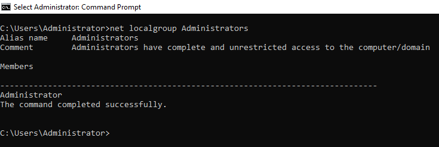

Lệnh này giúp xác định tài khoản nào đang thuộc nhóm có quyền cao.

Với quyền quản trị, có thể thêm người dùng vào nhóm:

```cmd
net localgroup Administrators testuser /add
```

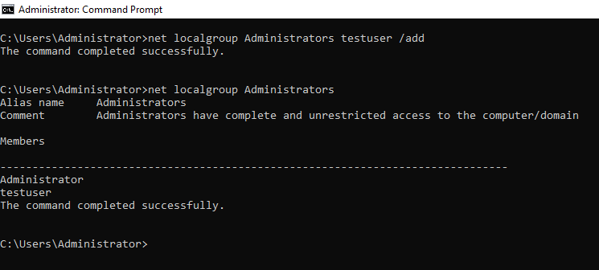

Hoặc xóa người dùng khỏi nhóm:

```cmd
net localgroup Administrators testuser /delete
```

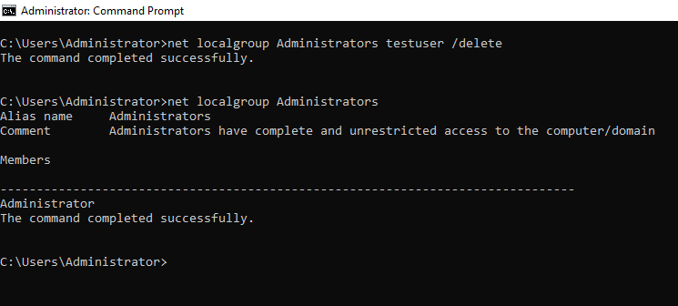

Trong an toàn thông tin, `net localgroup Administrators` là lệnh rất quan trọng vì nó giúp kiểm tra xem có tài khoản bất thường nào đang có quyền quản trị trên máy hay không.

## 15.10. Xem trợ giúp lệnh với `/?`

Trong CMD, có thể xem hướng dẫn sử dụng của nhiều lệnh bằng cách thêm tham số:

```cmd
/?
```

Ví dụ:

```cmd
ipconfig /?
```

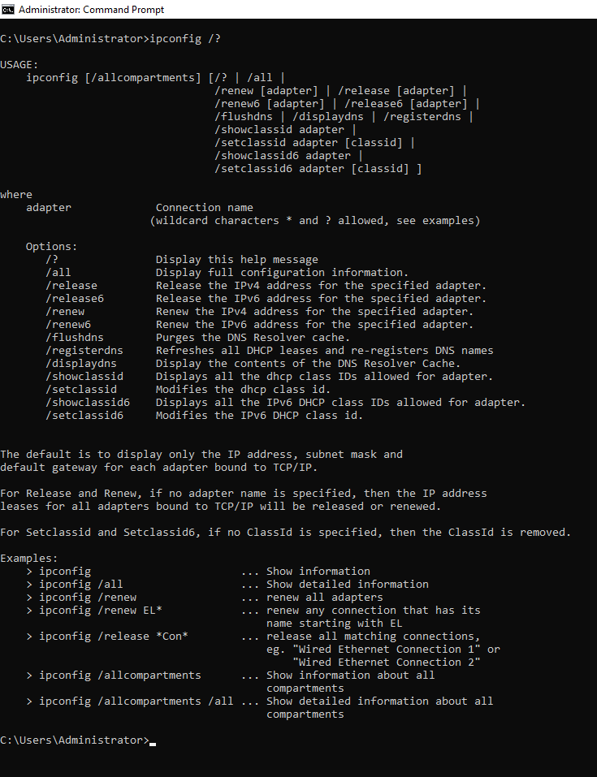

Lệnh này hiển thị các tùy chọn có thể sử dụng với `ipconfig`.

Một ví dụ khác:

```cmd
net user /?
```

Kết quả sẽ hiển thị cú pháp và các tham số liên quan đến lệnh `net user`.

Việc sử dụng `/?` rất hữu ích khi người dùng không nhớ chính xác cú pháp lệnh hoặc muốn tìm thêm tùy chọn nâng cao.

Một số ví dụ:

```cmd
hostname /?
whoami /?
netstat /?
net /?
```

Không phải mọi lệnh đều hỗ trợ cùng một kiểu trợ giúp, nhưng `/?` là cách phổ biến trong CMD.

## 15.11. Xem trợ giúp lệnh `net help`

Đối với nhóm lệnh `net`, Windows cung cấp cơ chế trợ giúp riêng là `net help`.

Cú pháp:

```cmd
net help
```

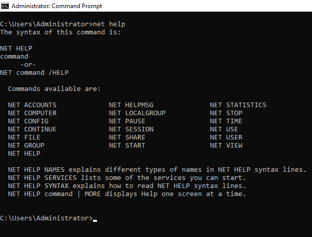

Lệnh này hiển thị danh sách các lệnh con có thể dùng với `net`.

Để xem trợ giúp cho một lệnh cụ thể, có thể dùng:

```cmd
net help user
```

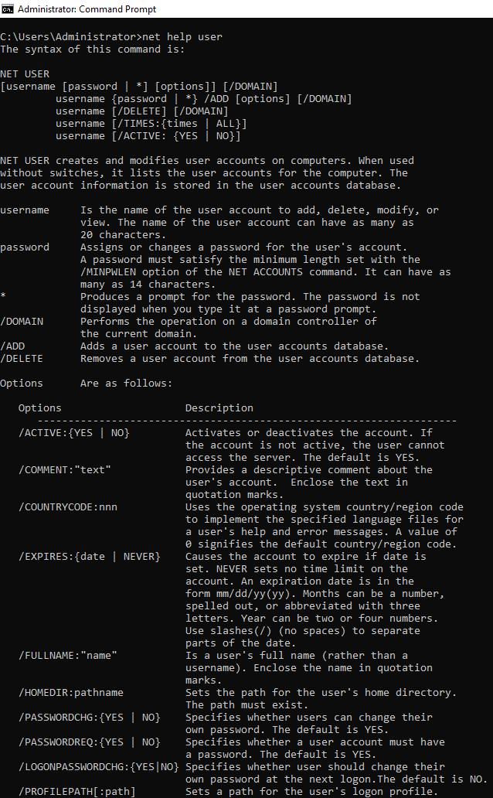

Hoặc:

```cmd
net help localgroup
```

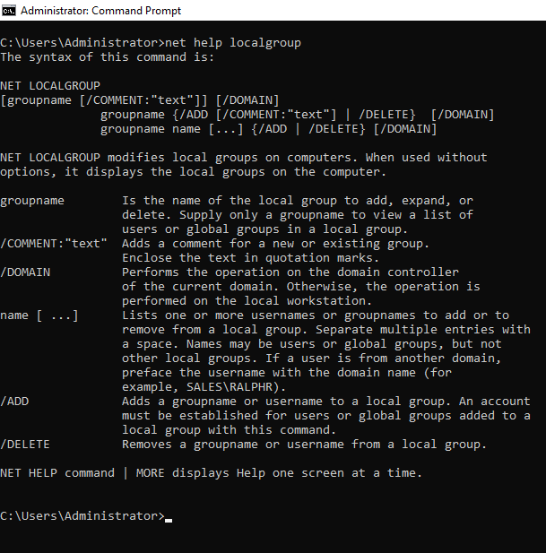

`net help` rất hữu ích vì nhóm lệnh `net` có nhiều chức năng khác nhau. Khi không nhớ cú pháp, người dùng nên kiểm tra trợ giúp trước khi chạy lệnh có thể thay đổi hệ thống.

## 15.12. Xóa màn hình với `cls`

Lệnh `cls` dùng để xóa nội dung đang hiển thị trên cửa sổ Command Prompt.

Cú pháp:

```cmd
cls
```

Sau khi chạy lệnh này, màn hình CMD sẽ được làm sạch, nhưng các lệnh đã chạy trước đó không bị hủy. Đây chỉ là thao tác xóa phần hiển thị để cửa sổ dòng lệnh gọn hơn.

Lệnh `cls` thường được dùng khi:

* màn hình CMD có quá nhiều kết quả;
* cần trình bày lại lệnh cho dễ nhìn;
* muốn bắt đầu một phần làm việc mới;
* chụp màn hình kết quả lệnh rõ ràng hơn.

Ví dụ:

```cmd
ipconfig
cls
whoami
```

Trong ví dụ trên, sau khi chạy `cls`, nội dung hiển thị trước đó sẽ được xóa khỏi cửa sổ CMD.

## 15.13. Vai trò của CMD trong quản trị và bảo mật

Command Prompt có vai trò quan trọng trong quản trị hệ thống Windows và an toàn thông tin.

Trong quản trị hệ thống, CMD giúp thực hiện nhanh nhiều thao tác như:

* kiểm tra tên máy;
* kiểm tra tài khoản hiện tại;
* xem cấu hình mạng;
* kiểm tra kết nối;
* quản lý người dùng;
* quản lý nhóm;
* kiểm tra dịch vụ;
* chạy script;
* mở công cụ hệ thống.

Trong bảo mật và SOC, CMD hỗ trợ thu thập thông tin ban đầu khi phân tích một máy Windows.

Một số lệnh thường dùng trong kiểm tra bảo mật cơ bản gồm:

| Lệnh                            | Mục đích                          |
| ------------------------------- | --------------------------------- |
| `hostname`                      | Xác định tên máy                  |
| `whoami`                        | Xác định tài khoản hiện tại       |
| `ipconfig /all`                 | Kiểm tra cấu hình mạng chi tiết   |
| `netstat -ano`                  | Kiểm tra kết nối mạng và PID      |
| `net user`                      | Xem tài khoản người dùng          |
| `net localgroup Administrators` | Kiểm tra thành viên nhóm quản trị |
| `cls`                           | Xóa màn hình CMD                  |

Tuy nhiên, CMD cũng có thể bị kẻ tấn công lạm dụng. Nhiều kỹ thuật tấn công sử dụng các công cụ hợp pháp có sẵn trong Windows để thu thập thông tin, tạo tài khoản, thay đổi nhóm quyền hoặc kết nối mạng.

Vì vậy, trong giám sát bảo mật, việc phát hiện các lệnh CMD bất thường cũng rất quan trọng. Đặc biệt cần chú ý khi CMD được chạy bởi tiến trình lạ, chạy với quyền Administrator hoặc thực hiện các lệnh liên quan đến tài khoản, nhóm, mạng và dịch vụ.

# 16. Windows Registry

## 16.1. Windows Registry là gì?

**Windows Registry** là cơ sở dữ liệu trung tâm của hệ điều hành Windows. Registry lưu trữ các thiết lập cấu hình quan trọng của hệ thống, phần cứng, phần mềm, tài khoản người dùng và nhiều thành phần khác.

Nói đơn giản, Registry giống như một nơi lưu trữ thông tin cấu hình mà Windows và các chương trình đã cài đặt sử dụng để hoạt động đúng.

Registry có thể chứa thông tin về:

- cấu hình hệ điều hành;
- thiết lập phần mềm;
- thông tin phần cứng;
- driver;
- tài khoản người dùng;
- dịch vụ hệ thống;
- chương trình khởi động cùng Windows;
- thiết lập giao diện;
- chính sách bảo mật.

Registry là một thành phần rất quan trọng trong Windows. Nếu Registry bị lỗi hoặc bị chỉnh sửa sai, hệ thống có thể hoạt động không ổn định, một số chương trình có thể không chạy được hoặc Windows có thể gặp lỗi nghiêm trọng.


## 16.2. Vai trò của Registry trong Windows

Registry đóng vai trò lưu trữ và quản lý cấu hình của Windows. Khi hệ điều hành hoặc một chương trình cần đọc thiết lập nào đó, nó có thể truy cập Registry để lấy thông tin.

Ví dụ, Registry có thể được dùng để lưu:

- chương trình nào sẽ chạy khi Windows khởi động;
- loại file nào được mở bằng ứng dụng nào;
- thiết lập của người dùng;
- cấu hình của dịch vụ Windows;
- thông tin về driver;
- thiết lập bảo mật;
- chính sách hệ thống.

Khi người dùng thay đổi một số cài đặt trong giao diện Windows, thay đổi đó có thể được ghi vào Registry. Ví dụ, khi thay đổi cấu hình phần mềm, thay đổi tùy chọn hệ thống hoặc cài đặt ứng dụng mới, Registry có thể được cập nhật.

Registry giúp Windows quản lý cấu hình một cách tập trung. Thay vì mỗi thành phần lưu cấu hình ở một nơi riêng biệt, nhiều thông tin quan trọng được lưu trong một cấu trúc thống nhất.

Trong quản trị hệ thống, Registry rất quan trọng vì nhiều thiết lập nâng cao của Windows chỉ có thể kiểm tra hoặc chỉnh sửa thông qua Registry.


## 16.3. Cấu trúc phân cấp của Registry

Windows Registry có cấu trúc phân cấp giống như cây thư mục. Trong Registry có các nhánh chính, bên trong mỗi nhánh có các khóa con và giá trị cấu hình.

Các thành phần chính trong Registry gồm:

| Thành phần | Ý nghĩa |
|---|---|
| Hive | Nhánh lớn trong Registry |
| Key | Khóa Registry, giống như thư mục |
| Subkey | Khóa con nằm trong một key |
| Value | Giá trị cấu hình được lưu trong key |
| Data | Dữ liệu cụ thể của một value |

Một số hive chính thường gặp trong Registry gồm:

| Hive | Ý nghĩa |
|---|---|
| `HKEY_CLASSES_ROOT` | Lưu thông tin về loại file, liên kết file và COM objects |
| `HKEY_CURRENT_USER` | Lưu cấu hình của người dùng hiện tại |
| `HKEY_LOCAL_MACHINE` | Lưu cấu hình chung của máy tính |
| `HKEY_USERS` | Lưu cấu hình của tất cả người dùng |
| `HKEY_CURRENT_CONFIG` | Lưu thông tin cấu hình phần cứng hiện tại |

Ví dụ một đường dẫn Registry có thể có dạng:

```text
HKEY_LOCAL_MACHINE\SOFTWARE\Microsoft\Windows\CurrentVersion
```

Trong đó:

* `HKEY_LOCAL_MACHINE` là hive;
* `SOFTWARE` là key;
* `Microsoft`, `Windows`, `CurrentVersion` là các subkey.

Cấu trúc phân cấp này giúp Registry tổ chức dữ liệu cấu hình theo từng nhóm rõ ràng.

## 16.4. Registry Editor

**Registry Editor** là công cụ dùng để xem và chỉnh sửa Windows Registry. Công cụ này cho phép người dùng truy cập vào các hive, key, subkey và value trong Registry.

Registry Editor thường được sử dụng bởi:

* quản trị viên hệ thống;
* kỹ thuật viên hỗ trợ;
* người phân tích bảo mật;
* người dùng nâng cao;
* phần mềm hoặc tài liệu kỹ thuật cần chỉnh cấu hình sâu.

Thông qua Registry Editor, người dùng có thể:

* xem cấu hình hệ thống;
* tìm kiếm key hoặc value;
* tạo key mới;
* sửa giá trị Registry;
* xóa key hoặc value;
* xuất Registry ra file `.reg`;
* nhập cấu hình từ file `.reg`.

Tuy nhiên, Registry Editor là công cụ nhạy cảm. Việc chỉnh sửa sai có thể làm Windows hoặc ứng dụng hoạt động không đúng. Vì vậy, chỉ nên thay đổi Registry khi hiểu rõ mục đích và có hướng dẫn đáng tin cậy.

## 16.5. Cách mở `regedit`

Có thể mở Registry Editor bằng lệnh `regedit`.

Cách mở bằng hộp thoại Run:

1. Nhấn tổ hợp phím:

```text
Win + R
```

2. Nhập lệnh:

```text
regedit
```

3. Nhấn **Enter**.

Nếu hệ thống hiển thị UAC Prompt, cần chọn **Yes** để cho phép mở Registry Editor với quyền phù hợp.

Ngoài ra, có thể mở bằng Start Menu:

1. Nhấn **Start**.
2. Gõ từ khóa:

```text
regedit
```

3. Chọn **Registry Editor**.

Sau khi mở, giao diện Registry Editor sẽ hiển thị cây thư mục Registry ở bên trái và các giá trị tương ứng ở bên phải.

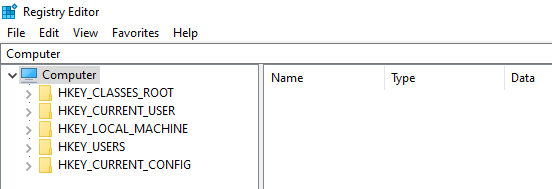

## 16.6. Cách mở `regedt32.exe`

`regedt32.exe` là một cách khác để mở Registry Editor trong Windows.

Có thể mở bằng hộp thoại Run:

1. Nhấn:

```text
Win + R
```

2. Nhập:

```text
regedt32.exe
```

3. Nhấn **Enter**.

Trong các phiên bản Windows hiện đại, `regedt32.exe` thường mở cùng công cụ Registry Editor như `regedit`.

Trước đây, `regedt32.exe` và `regedit.exe` từng có một số khác biệt. Tuy nhiên, trong các phiên bản Windows mới, người dùng thông thường chỉ cần nhớ rằng cả hai đều có thể dùng để mở Registry Editor.

Trong thực tế, lệnh được sử dụng phổ biến hơn là:

```text
regedit
```

## 16.7. Những thông tin được lưu trong Registry

Registry lưu trữ rất nhiều thông tin cấu hình của Windows và phần mềm. Đây là lý do Registry được xem là một trong những thành phần quan trọng nhất của hệ điều hành.

Một số loại thông tin thường được lưu trong Registry gồm:

| Loại thông tin         | Ví dụ                                                         |
| ---------------------- | ------------------------------------------------------------- |
| Cấu hình hệ điều hành  | Thiết lập hệ thống, giao diện, dịch vụ                        |
| Cấu hình phần mềm      | Tùy chọn của chương trình đã cài đặt                          |
| Thông tin phần cứng    | Driver, thiết bị, cấu hình phần cứng                          |
| Tài khoản người dùng   | Một số thiết lập liên quan đến người dùng                     |
| Chương trình khởi động | Ứng dụng chạy khi Windows khởi động hoặc người dùng đăng nhập |
| Chính sách hệ thống    | Một số thiết lập bảo mật và quản trị                          |
| Liên kết file          | File `.txt`, `.pdf`, `.docx` mở bằng chương trình nào         |
| Dịch vụ Windows        | Cấu hình và trạng thái của dịch vụ                            |

Ví dụ, Registry có thể lưu thông tin về chương trình nào được phép tự động chạy khi người dùng đăng nhập vào Windows.

Một số đường dẫn Registry thường được quan tâm trong bảo mật là các vị trí liên quan đến startup, dịch vụ, policy và cấu hình phần mềm.

## 16.8. Rủi ro khi chỉnh sửa Registry

Chỉnh sửa Registry có thể gây rủi ro nếu người dùng không hiểu rõ ý nghĩa của key hoặc value đang thay đổi.

Một số rủi ro khi chỉnh sửa Registry sai gồm:

* Windows hoạt động không ổn định;
* phần mềm không mở được;
* dịch vụ Windows bị lỗi;
* thiết bị hoặc driver hoạt động sai;
* mất cấu hình người dùng;
* lỗi đăng nhập;
* hệ thống khởi động không bình thường;
* giảm mức độ bảo mật của hệ thống.

Ví dụ, nếu xóa nhầm key liên quan đến một dịch vụ quan trọng, dịch vụ đó có thể không khởi động được. Nếu thay đổi sai cấu hình đăng nhập hoặc startup, Windows có thể gặp lỗi khi người dùng đăng nhập.

Trước khi chỉnh sửa Registry, nên:

* hiểu rõ key/value cần thay đổi;
* sao lưu Registry hoặc key liên quan;
* tạo restore point nếu cần;
* làm theo tài liệu đáng tin cậy;
* không xóa key lạ nếu chưa biết chức năng;
* không chạy file `.reg` từ nguồn không rõ ràng.

Trong môi trường doanh nghiệp, việc chỉnh sửa Registry nên được kiểm soát cẩn thận, đặc biệt trên máy chủ hoặc máy tính quan trọng.

## 16.9. Ý nghĩa bảo mật của Registry

Registry có ý nghĩa rất quan trọng trong an toàn thông tin Windows vì nhiều cấu hình bảo mật và hành vi hệ thống được lưu tại đây.

Kẻ tấn công có thể lợi dụng Registry để:

* duy trì persistence;
* cấu hình chương trình tự khởi động;
* thay đổi thiết lập bảo mật;
* vô hiệu hóa công cụ bảo vệ;
* ẩn cấu hình độc hại;
* thay đổi hành vi của hệ thống;
* lưu dữ liệu hoặc cấu hình cho mã độc.

Một số dấu hiệu đáng nghi trong Registry gồm:

* key startup lạ;
* chương trình chạy từ `AppData`, `Temp` hoặc `Downloads`;
* value có tên giống hệ thống nhưng đường dẫn bất thường;
* cấu hình bị thay đổi gần thời điểm xảy ra sự cố;
* chính sách bảo mật bị tắt hoặc bị sửa;
* dịch vụ lạ được đăng ký trong Registry.

Trong điều tra sự cố, Registry thường được kiểm tra để tìm dấu vết về:

* chương trình tự khởi động;
* phần mềm đã cài đặt;
* dịch vụ độc hại;
* cấu hình persistence;
* thay đổi chính sách hệ thống;
* thông tin người dùng và môi trường hệ thống.

Tuy nhiên, cần phân tích Registry cẩn thận vì không phải mọi key lạ đều là độc hại. Một số phần mềm hợp pháp cũng tạo nhiều key và value trong Registry.

Tóm lại, Registry là cơ sở dữ liệu cấu hình trung tâm của Windows. Đối với quản trị viên và SOC Analyst, hiểu Registry giúp kiểm tra hệ thống sâu hơn, phát hiện cấu hình bất thường và hỗ trợ điều tra bảo mật.

# 17. Windows Update

## 17.1. Windows Update là gì?

**Windows Update** là dịch vụ cập nhật của Microsoft dành cho hệ điều hành Windows. Dịch vụ này cho phép Windows tải xuống và cài đặt các bản cập nhật cần thiết để cải thiện bảo mật, sửa lỗi và bổ sung tính năng mới cho hệ thống.

Windows Update có thể cung cấp nhiều loại cập nhật khác nhau, ví dụ:

- bản vá bảo mật;
- bản sửa lỗi hệ thống;
- bản cập nhật tính năng;
- bản cập nhật driver;
- bản cập nhật cho Microsoft Defender;
- bản cập nhật chất lượng hệ thống.

Trong các phiên bản Windows hiện đại, Windows Update thường hoạt động tự động. Hệ thống sẽ kiểm tra, tải xuống và cài đặt các bản cập nhật khi có sẵn. Tuy nhiên, trong một số trường hợp, người dùng vẫn cần khởi động lại máy để hoàn tất quá trình cập nhật.

Windows Update là một thành phần quan trọng giúp hệ điều hành hoạt động ổn định, an toàn và tương thích tốt hơn với phần mềm, phần cứng mới.


## 17.2. Vai trò của Windows Update trong bảo mật

Windows Update có vai trò rất quan trọng trong bảo mật hệ thống. Nhiều cuộc tấn công mạng khai thác các lỗ hổng đã biết trong hệ điều hành, dịch vụ hoặc thành phần phần mềm. Nếu hệ thống không được cập nhật, các lỗ hổng này có thể bị kẻ tấn công lợi dụng.

Vai trò bảo mật của Windows Update gồm:

- vá các lỗ hổng bảo mật đã được phát hiện;
- giảm nguy cơ bị khai thác bởi mã độc;
- cập nhật cơ chế bảo vệ của Windows;
- cải thiện khả năng chống lại các kỹ thuật tấn công mới;
- cập nhật Microsoft Defender và các thành phần bảo mật;
- tăng độ ổn định của hệ thống.

Ví dụ, nếu một lỗ hổng nghiêm trọng trong Windows được công bố, Microsoft có thể phát hành bản vá thông qua Windows Update. Nếu người dùng không cài đặt bản vá, máy tính vẫn có thể bị tấn công qua lỗ hổng đó.

Trong môi trường doanh nghiệp, việc quản lý cập nhật là một phần quan trọng của chiến lược bảo mật. Máy tính không được cập nhật thường xuyên có thể trở thành điểm yếu trong toàn bộ hệ thống mạng.


## 17.3. Security Updates

**Security Updates** là các bản cập nhật bảo mật dùng để vá lỗ hổng trong Windows hoặc các thành phần liên quan.

Các bản cập nhật này thường được phát hành khi Microsoft phát hiện hoặc xác nhận một vấn đề bảo mật có thể ảnh hưởng đến người dùng. Mục tiêu chính của Security Updates là giảm nguy cơ hệ thống bị khai thác.

Security Updates có thể khắc phục các vấn đề như:

- lỗ hổng thực thi mã từ xa;
- lỗ hổng leo thang đặc quyền;
- lỗ hổng bỏ qua cơ chế bảo mật;
- lỗi trong dịch vụ hệ thống;
- lỗi trong giao thức mạng;
- lỗi trong thành phần xác thực;
- lỗ hổng trong trình điều khiển hoặc thư viện hệ thống.

Từ góc độ an toàn thông tin, Security Updates là loại cập nhật quan trọng nhất. Nếu không cài đặt các bản vá bảo mật kịp thời, hệ thống có thể bị tấn công ngay cả khi người dùng không trực tiếp thực hiện hành động nguy hiểm.

Vì vậy, người dùng cá nhân và doanh nghiệp cần ưu tiên cài đặt Security Updates, đặc biệt là các bản vá cho lỗ hổng nghiêm trọng.


## 17.4. Feature Updates

**Feature Updates** là các bản cập nhật tính năng của Windows. Khác với Security Updates, Feature Updates thường bổ sung chức năng mới, cải thiện giao diện hoặc thay đổi một số thành phần lớn của hệ điều hành.

Feature Updates có thể bao gồm:

- tính năng mới của Windows;
- thay đổi giao diện người dùng;
- cải thiện hiệu suất;
- cải thiện khả năng tương thích;
- cập nhật công cụ hệ thống;
- thay đổi trong Windows Security;
- bổ sung chức năng quản trị mới.

Các bản cập nhật tính năng thường có dung lượng lớn hơn và thời gian cài đặt lâu hơn so với bản cập nhật bảo mật thông thường.

Trong môi trường doanh nghiệp, Feature Updates cần được kiểm tra kỹ trước khi triển khai rộng rãi. Lý do là một số tính năng mới có thể ảnh hưởng đến phần mềm nội bộ, driver, chính sách hệ thống hoặc quy trình làm việc của người dùng.

Vì vậy, doanh nghiệp thường triển khai Feature Updates theo kế hoạch, thử nghiệm trên một nhóm máy trước khi áp dụng cho toàn bộ tổ chức.


## 17.5. Patch Tuesday

**Patch Tuesday** là thuật ngữ dùng để chỉ ngày Microsoft thường phát hành các bản vá định kỳ hằng tháng.

Thông thường, Patch Tuesday diễn ra vào **thứ Ba của tuần thứ hai trong tháng**. Vào thời điểm này, Microsoft có thể phát hành các bản vá bảo mật, bản sửa lỗi và các cập nhật liên quan cho Windows và sản phẩm Microsoft khác.

Patch Tuesday quan trọng vì đây là thời điểm quản trị viên hệ thống thường theo dõi các bản vá mới, đánh giá mức độ nghiêm trọng và lập kế hoạch triển khai cập nhật.

Trong môi trường doanh nghiệp, quy trình sau Patch Tuesday thường gồm:

1. Theo dõi danh sách bản vá mới.
2. Xác định bản vá nào quan trọng hoặc nghiêm trọng.
3. Kiểm tra ảnh hưởng đến hệ thống hiện tại.
4. Thử nghiệm trên một nhóm máy nhỏ.
5. Triển khai cho toàn bộ hệ thống.
6. Theo dõi lỗi sau cập nhật.

Từ góc độ bảo mật, Patch Tuesday giúp doanh nghiệp duy trì lịch cập nhật định kỳ và giảm nguy cơ tồn tại lỗ hổng chưa được vá trong hệ thống.


## 17.6. Cách mở Windows Update

Có nhiều cách để mở Windows Update trong Windows.

Cách phổ biến nhất là mở qua Windows Settings:

1. Nhấn **Start**.
2. Chọn **Settings**.
3. Chọn **Update & Security**.
4. Chọn **Windows Update**.

Trong Windows 11, đường dẫn có thể là:

```text
Settings → Windows Update
````

Ngoài ra, có thể mở nhanh bằng cách:

1. Nhấn **Start**.
2. Gõ từ khóa:

```text
Windows Update
```

3. Chọn **Windows Update settings**.

Trong giao diện Windows Update, người dùng có thể:

* kiểm tra bản cập nhật mới;
* xem trạng thái cập nhật;
* tải xuống bản cập nhật;
* cài đặt bản cập nhật;
* xem lịch sử cập nhật;
* tạm dừng cập nhật;
* cấu hình giờ hoạt động;
* kiểm tra yêu cầu khởi động lại.


Có thể mở Windows Update bằng lệnh trong hộp thoại Run, Command Prompt hoặc PowerShell.

Một lệnh thường dùng là:

```cmd
control /name Microsoft.WindowsUpdate
```

Cách thực hiện:

1. Nhấn tổ hợp phím:

```text
Win + R
```

2. Nhập lệnh:

```cmd
control /name Microsoft.WindowsUpdate
```

3. Nhấn **Enter**.

Lệnh này giúp mở nhanh giao diện Windows Update mà không cần đi qua nhiều bước trong Settings.

Ngoài ra, người dùng có thể tìm kiếm trực tiếp bằng Start Menu với từ khóa:

```text
Windows Update
```

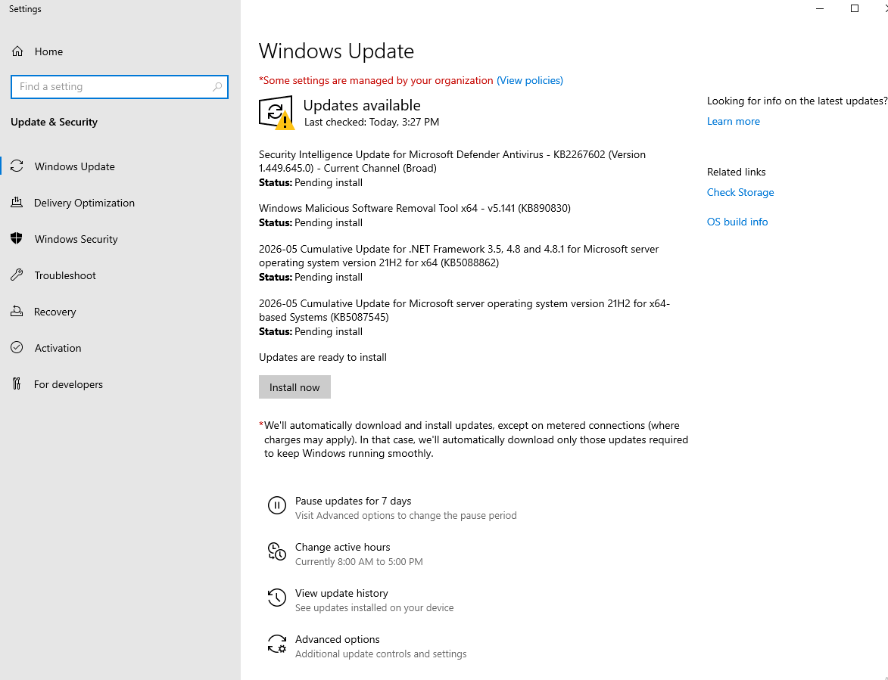

Trong quản trị hệ thống, việc biết lệnh mở nhanh Windows Update giúp tiết kiệm thời gian khi cần kiểm tra trạng thái cập nhật trên nhiều máy.

## 17.7. Restart Required

**Restart Required** nghĩa là hệ thống cần được khởi động lại để hoàn tất quá trình cài đặt bản cập nhật.

Một số bản cập nhật có thể được cài đặt khi Windows đang chạy. Tuy nhiên, các bản cập nhật liên quan đến kernel, driver, dịch vụ hệ thống hoặc tệp đang được sử dụng thường cần khởi động lại để áp dụng hoàn toàn.

Khi Windows Update hiển thị trạng thái Restart Required, người dùng nên lưu lại công việc đang làm và khởi động lại máy vào thời điểm phù hợp.

Nếu không khởi động lại, bản cập nhật có thể chưa được áp dụng đầy đủ. Điều này có thể khiến hệ thống vẫn còn tồn tại lỗi hoặc lỗ hổng bảo mật.

Trong môi trường doanh nghiệp, việc khởi động lại sau cập nhật cần được quản lý cẩn thận để tránh gián đoạn công việc. Quản trị viên thường cấu hình thời gian cập nhật và khởi động lại ngoài giờ làm việc.

# 18. Windows Security

## 18.1. Windows Security là gì?

**Windows Security** là trung tâm bảo mật tích hợp sẵn trong Windows. Đây là nơi người dùng có thể kiểm tra trạng thái bảo vệ của hệ thống và quản lý các tính năng bảo mật quan trọng.

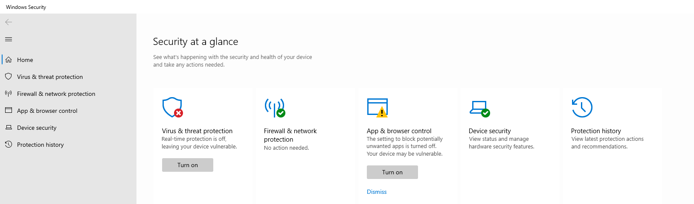

Windows Security giúp bảo vệ máy tính khỏi nhiều rủi ro như:

- virus;
- malware;
- ransomware;
- truy cập trái phép;
- ứng dụng không an toàn;
- website độc hại;
- cấu hình bảo mật yếu;
- vấn đề liên quan đến thiết bị và phần cứng.

Trong các phiên bản Windows hiện đại, Windows Security được tích hợp trực tiếp vào hệ điều hành. Người dùng không cần cài đặt thêm phần mềm bên ngoài để có các chức năng bảo vệ cơ bản.

Windows Security thường bao gồm nhiều khu vực bảo vệ khác nhau, ví dụ như:

- Virus & Threat Protection;
- Firewall & Network Protection;
- App & Browser Control;
- Device Security.

Đối với người dùng cá nhân, Windows Security giúp kiểm tra nhanh máy tính có đang được bảo vệ hay không. Đối với người học an toàn thông tin, đây là công cụ cơ bản để hiểu các lớp bảo vệ mặc định của Windows.


## 18.2. Protection Areas

**Protection Areas** là các khu vực bảo vệ chính trong Windows Security. Mỗi khu vực phụ trách một nhóm chức năng bảo mật riêng.

Các Protection Areas quan trọng gồm:

| Protection Area | Chức năng chính |
|---|---|
| Virus & Threat Protection | Bảo vệ hệ thống khỏi virus, malware và các mối đe dọa khác |
| Firewall & Network Protection | Quản lý tường lửa và bảo vệ kết nối mạng |
| App & Browser Control | Bảo vệ khi chạy ứng dụng và truy cập web |
| Device Security | Kiểm tra các tính năng bảo mật phần cứng và bảo mật lõi hệ thống |

Ngoài ra, tùy phiên bản Windows và cấu hình hệ thống, Windows Security có thể hiển thị thêm một số khu vực khác như:

- Account Protection;
- Device Performance & Health;
- Family Options.

Các Protection Areas giúp người dùng kiểm tra tình trạng bảo mật theo từng nhóm rõ ràng. Nếu có vấn đề, Windows Security thường hiển thị cảnh báo để người dùng xử lý.


## 18.3. Ý nghĩa biểu tượng trạng thái bảo mật

Windows Security sử dụng các biểu tượng trạng thái để cho biết tình trạng bảo mật của từng khu vực.

Các màu thường gặp gồm:

- màu xanh lá cây;
- màu vàng;
- màu đỏ.

Nhờ các biểu tượng này, người dùng có thể nhanh chóng biết hệ thống đang an toàn, cần chú ý hay đang có vấn đề nghiêm trọng.


### 18.3.1. Màu xanh lá cây

Biểu tượng **màu xanh lá cây** thường cho biết trạng thái bảo mật đang tốt.

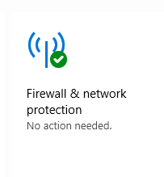

Điều này có nghĩa là khu vực bảo vệ đó đang hoạt động bình thường và không có hành động khẩn cấp nào cần thực hiện.

Ví dụ:

- antivirus đang bật;
- không phát hiện mối đe dọa;
- firewall đang hoạt động;
- thiết bị không có cảnh báo bảo mật quan trọng;
- các thiết lập bảo vệ chính đang được bật.

Khi thấy biểu tượng màu xanh lá cây, người dùng có thể hiểu rằng Windows Security chưa phát hiện vấn đề nghiêm trọng ở khu vực đó.


### 18.3.2. Màu vàng

Biểu tượng **màu vàng** thường cho biết có vấn đề cần chú ý hoặc cần người dùng kiểm tra thêm.

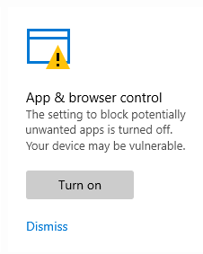

Trạng thái này không nhất thiết có nghĩa là hệ thống đang bị tấn công, nhưng cho thấy có một thiết lập hoặc cảnh báo cần được xem xét.

Ví dụ:

- cần bật một tính năng bảo vệ;
- cần kiểm tra cảnh báo bảo mật;
- có khuyến nghị từ Windows Security;
- cần cập nhật hoặc quét hệ thống;
- có thiết lập chưa tối ưu.

Khi thấy biểu tượng màu vàng, người dùng nên mở khu vực đó để xem Windows đề xuất hành động gì.


### 18.3.3. Màu đỏ

Biểu tượng **màu đỏ** thường cho biết có vấn đề nghiêm trọng cần xử lý ngay.

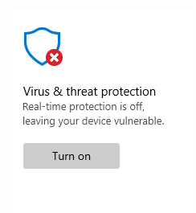

Ví dụ:

- antivirus bị tắt;
- firewall bị tắt;
- phát hiện mối đe dọa;
- hệ thống có nguy cơ cao;
- một thành phần bảo vệ quan trọng không hoạt động.

Khi thấy biểu tượng màu đỏ, người dùng không nên bỏ qua. Cần mở Windows Security, kiểm tra nguyên nhân và thực hiện hành động khắc phục càng sớm càng tốt.

Trong môi trường doanh nghiệp, trạng thái màu đỏ trên máy trạm có thể là dấu hiệu cần gửi cảnh báo cho quản trị viên hoặc SOC.


## 18.4. Virus & Threat Protection

**Virus & Threat Protection** là khu vực trong Windows Security dùng để bảo vệ hệ thống khỏi virus, malware và các mối đe dọa khác.

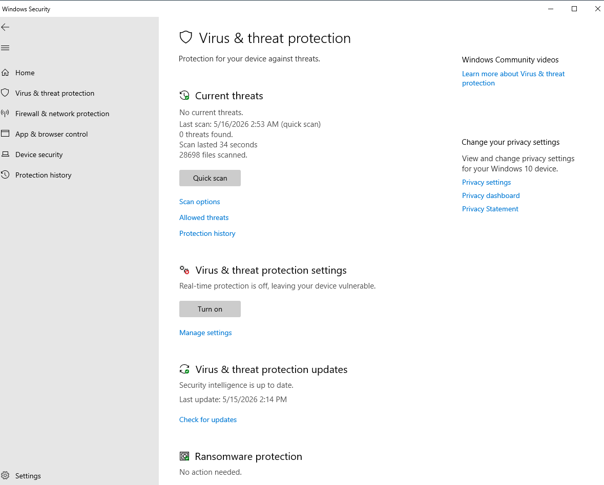

Khu vực này thường liên quan đến Microsoft Defender Antivirus, công cụ chống mã độc tích hợp sẵn trong Windows.

Trong Virus & Threat Protection, người dùng có thể:

- kiểm tra trạng thái bảo vệ hiện tại;
- xem lịch sử mối đe dọa;
- chạy quét nhanh;
- chạy quét đầy đủ;
- chạy quét tùy chỉnh;
- cấu hình bảo vệ thời gian thực;
- bật bảo vệ dựa trên đám mây;
- quản lý exclusions;
- kiểm tra ransomware protection.

Một số loại quét thường gặp gồm:

| Loại quét | Ý nghĩa |
|---|---|
| Quick scan | Quét nhanh các khu vực thường bị mã độc lợi dụng |
| Full scan | Quét toàn bộ hệ thống |
| Custom scan | Quét tệp hoặc thư mục do người dùng chọn |
| Microsoft Defender Offline scan | Quét ngoại tuyến để xử lý một số mã độc khó loại bỏ |

Virus & Threat Protection rất quan trọng vì malware có thể gây nhiều hậu quả như đánh cắp dữ liệu, mã hóa tệp, theo dõi người dùng hoặc mở cửa hậu cho kẻ tấn công.

Đối với người học SOC, khu vực này giúp hiểu cách Windows phát hiện, cách ly và xử lý các mối đe dọa cơ bản trên endpoint.


## 18.5. Firewall & Network Protection

**Firewall & Network Protection** là khu vực dùng để quản lý tường lửa và bảo vệ kết nối mạng của Windows.

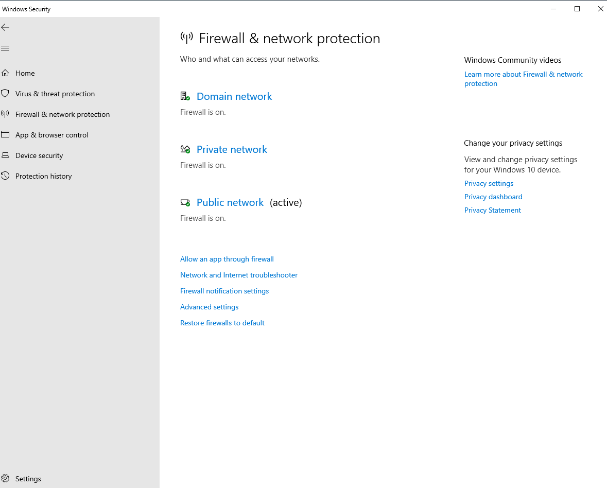

Windows Firewall giúp kiểm soát lưu lượng mạng vào và ra khỏi máy tính. Nó có thể cho phép hoặc chặn kết nối dựa trên hồ sơ mạng, ứng dụng, cổng hoặc quy tắc tường lửa.

Trong Firewall & Network Protection, thường có ba loại network profile:

| Network Profile | Ý nghĩa |
|---|---|
| Domain network | Dùng khi máy tính tham gia domain trong doanh nghiệp |
| Private network | Dùng cho mạng riêng đáng tin cậy, ví dụ mạng gia đình hoặc nội bộ |
| Public network | Dùng cho mạng công cộng, ví dụ Wi-Fi ở quán cà phê, sân bay |

Public network thường có mức bảo vệ nghiêm ngặt hơn vì đây là môi trường ít đáng tin cậy hơn.

Trong khu vực này, người dùng có thể:

- kiểm tra firewall đang bật hay tắt;
- xem trạng thái từng network profile;
- cho phép ứng dụng đi qua firewall;
- mở Advanced settings;
- cấu hình quy tắc inbound và outbound;
- khôi phục firewall về mặc định.

Từ góc độ bảo mật, firewall là lớp phòng thủ quan trọng giúp giảm nguy cơ truy cập trái phép vào máy tính qua mạng.


## 18.6. App & Browser Control

**App & Browser Control** là khu vực trong Windows Security dùng để bảo vệ người dùng khi chạy ứng dụng và truy cập nội dung trên web.

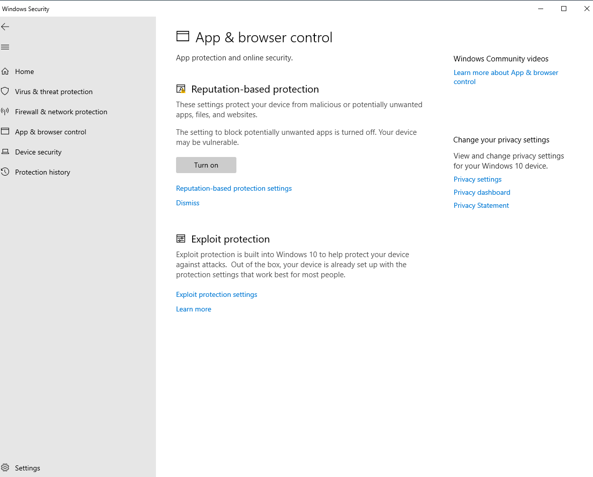

Khu vực này liên quan đến các cơ chế như Microsoft Defender SmartScreen và Exploit Protection.

App & Browser Control có thể giúp bảo vệ khỏi:

- ứng dụng không rõ nguồn gốc;
- tệp tải xuống đáng ngờ;
- website độc hại;
- nội dung lừa đảo;
- khai thác lỗ hổng trong ứng dụng;
- phần mềm có hành vi không an toàn.

Một số chức năng thường gặp gồm:

| Chức năng | Ý nghĩa |
|---|---|
| Check apps and files | Kiểm tra ứng dụng và tệp tải xuống |
| SmartScreen for Microsoft Edge | Bảo vệ khi duyệt web bằng Microsoft Edge |
| Potentially unwanted app blocking | Chặn ứng dụng không mong muốn |
| Exploit Protection | Giảm rủi ro từ các kỹ thuật khai thác lỗ hổng |

Khi người dùng tải hoặc chạy một tệp không rõ nguồn gốc, SmartScreen có thể hiển thị cảnh báo nếu tệp đó có dấu hiệu đáng ngờ.

Đối với an toàn thông tin, App & Browser Control rất quan trọng vì nhiều cuộc tấn công bắt đầu từ việc người dùng tải tệp độc hại hoặc truy cập website giả mạo.


## 18.7. Device Security

**Device Security** là khu vực trong Windows Security dùng để kiểm tra và quản lý các tính năng bảo mật liên quan đến phần cứng và bảo vệ lõi hệ thống.

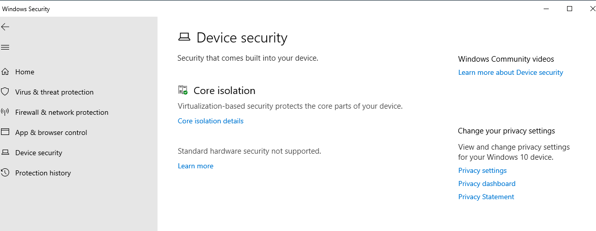

Khu vực này thường hiển thị các tính năng như:

- Core Isolation;
- Memory Integrity;
- Security Processor;
- TPM;
- Secure Boot nếu thiết bị hỗ trợ.

Một số thành phần quan trọng:

| Thành phần | Ý nghĩa |
|---|---|
| Core Isolation | Cô lập các tiến trình quan trọng của hệ thống để tăng bảo mật |
| Memory Integrity | Giúp ngăn mã độc can thiệp vào vùng nhớ quan trọng |
| Security Processor | Liên quan đến TPM và bảo vệ khóa mã hóa |
| TPM | Chip hoặc mô-đun bảo mật dùng cho các chức năng như BitLocker |
| Secure Boot | Giúp ngăn mã độc can thiệp vào quá trình khởi động |

Device Security phụ thuộc vào phần cứng của máy tính. Nếu thiết bị không hỗ trợ một số tính năng, Windows có thể không hiển thị đầy đủ các mục này.

Trong môi trường doanh nghiệp, Device Security giúp nâng cao mức bảo vệ của endpoint, đặc biệt khi kết hợp với BitLocker, Secure Boot và các chính sách bảo mật tập trung.


## 18.8. Windows Security trong Windows Server

Trong Windows Server, các chức năng bảo mật cũng rất quan trọng, nhưng cách quản lý có thể khác so với Windows Desktop.

Windows Server thường được dùng để cung cấp dịch vụ cho nhiều người dùng hoặc nhiều hệ thống khác nhau. Vì vậy, bảo mật trên Windows Server cần được cấu hình cẩn thận hơn, đặc biệt đối với các máy chủ như:

- Domain Controller;
- File Server;
- DNS Server;
- DHCP Server;
- Web Server;
- Remote Desktop Server.

Trên Windows Server, quản trị viên cần quan tâm đến:

- cập nhật bảo mật;
- firewall;
- antivirus hoặc Microsoft Defender;
- quyền truy cập;
- chính sách đăng nhập;
- dịch vụ đang chạy;
- cấu hình mạng;
- Event Logs;
- tài khoản quản trị;
- bảo vệ dữ liệu.

Windows Security trên máy chủ có thể không được sử dụng theo cách giống hoàn toàn với máy tính cá nhân. Trong doanh nghiệp, bảo mật máy chủ thường được quản lý kết hợp với Group Policy, Windows Defender for Endpoint, SIEM, EDR và các công cụ quản trị tập trung khác.

# 19. Virus & Threat Protection

## 19.1. Current Threats

**Current Threats** là khu vực hiển thị tình trạng mối đe dọa hiện tại trên hệ thống Windows. Đây là nơi người dùng có thể kiểm tra xem Windows Security có phát hiện virus, malware hoặc hành vi đáng nghi nào hay không.

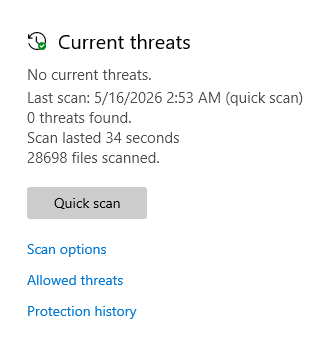

Trong phần Current Threats, Windows thường hiển thị các thông tin như:

- trạng thái bảo vệ hiện tại;
- thời gian quét gần nhất;
- số lượng tệp đã được quét;
- mối đe dọa được phát hiện nếu có;
- hành động cần thực hiện;
- trạng thái xử lý mối đe dọa.

Nếu hệ thống không phát hiện vấn đề, Windows Security thường hiển thị trạng thái an toàn. Nếu phát hiện mối đe dọa, người dùng có thể thấy cảnh báo và các tùy chọn xử lý như cách ly, xóa hoặc cho phép.

Current Threats rất quan trọng vì nó giúp người dùng nhanh chóng biết máy tính có đang gặp nguy cơ bảo mật hay không.


## 19.2. Scan Options

**Scan Options** là phần cho phép người dùng chọn kiểu quét malware trên hệ thống.

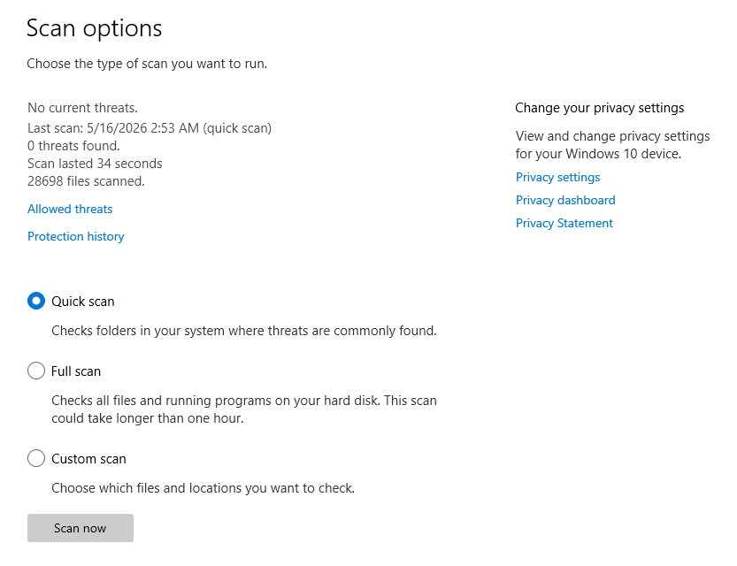

Windows Security cung cấp nhiều loại quét khác nhau tùy theo nhu cầu. Nếu cần kiểm tra nhanh, có thể dùng Quick Scan. Nếu cần kiểm tra toàn bộ hệ thống, có thể dùng Full Scan. Nếu chỉ muốn kiểm tra một thư mục hoặc tệp cụ thể, có thể dùng Custom Scan.

Các tùy chọn quét thường gặp gồm:

| Loại quét | Mục đích |
|---|---|
| Quick Scan | Quét nhanh các khu vực thường bị malware lợi dụng |
| Full Scan | Quét toàn bộ hệ thống |
| Custom Scan | Quét tệp hoặc thư mục do người dùng chọn |
| Microsoft Defender Offline Scan | Quét ngoại tuyến để xử lý một số malware khó loại bỏ |

Việc chọn đúng loại quét giúp tiết kiệm thời gian và tăng hiệu quả phát hiện mối đe dọa.


### 19.2.1. Quick Scan

**Quick Scan** là chế độ quét nhanh của Windows Security.

Chế độ này thường kiểm tra các khu vực quan trọng và thường bị malware lợi dụng, ví dụ:

- thư mục hệ thống;
- tiến trình đang chạy;
- vị trí khởi động cùng Windows;
- một số khu vực nhạy cảm trong hệ điều hành.

Quick Scan có thời gian thực hiện ngắn hơn Full Scan, nên phù hợp để kiểm tra nhanh tình trạng hệ thống.

Nên dùng Quick Scan khi:

- muốn kiểm tra nhanh máy tính;
- vừa tải tệp từ Internet;
- nghi ngờ máy có dấu hiệu bất thường nhẹ;
- cần kiểm tra định kỳ hằng ngày hoặc hằng tuần.

Tuy nhiên, Quick Scan không kiểm tra toàn bộ tệp trên hệ thống, vì vậy nếu nghi ngờ máy bị nhiễm malware nghiêm trọng, nên dùng Full Scan hoặc Microsoft Defender Offline Scan.


### 19.2.2. Full Scan

**Full Scan** là chế độ quét toàn bộ hệ thống.

Chế độ này kiểm tra tất cả tệp và chương trình đang chạy trên ổ đĩa. Vì phạm vi quét rộng hơn nên Full Scan thường mất nhiều thời gian hơn Quick Scan.

Full Scan phù hợp trong các trường hợp:

- nghi ngờ máy tính bị nhiễm malware;
- hệ thống có hành vi bất thường;
- máy chạy chậm không rõ nguyên nhân;
- sau khi phát hiện mối đe dọa;
- cần kiểm tra kỹ toàn bộ hệ thống.

Ưu điểm của Full Scan là kiểm tra sâu hơn và toàn diện hơn. Tuy nhiên, quá trình quét có thể làm máy tính chậm hơn trong lúc đang chạy, đặc biệt trên máy có ổ đĩa lớn hoặc nhiều tệp.

Trong môi trường doanh nghiệp, Full Scan thường được lên lịch vào thời điểm ít ảnh hưởng đến người dùng, ví dụ ngoài giờ làm việc.


### 19.2.3. Custom Scan

**Custom Scan** là chế độ quét tùy chỉnh, cho phép người dùng chọn tệp, thư mục hoặc ổ đĩa cụ thể để kiểm tra.

Custom Scan phù hợp khi người dùng muốn kiểm tra một khu vực nhất định, ví dụ:

- thư mục Downloads;
- USB vừa cắm vào máy;
- thư mục chứa file nghi ngờ;
- file cài đặt vừa tải về;
- thư mục chia sẻ;
- ổ đĩa ngoài.

Ví dụ, nếu người dùng tải một file lạ từ Internet, có thể dùng Custom Scan để quét riêng file hoặc thư mục đó trước khi mở.

Custom Scan giúp tiết kiệm thời gian vì không cần quét toàn bộ hệ thống. Tuy nhiên, nó chỉ kiểm tra khu vực được chọn, nên không thay thế hoàn toàn cho Full Scan trong trường hợp cần kiểm tra toàn diện.


## 19.3. Threat History

**Threat History** là phần hiển thị lịch sử các mối đe dọa mà Windows Security đã phát hiện hoặc xử lý.

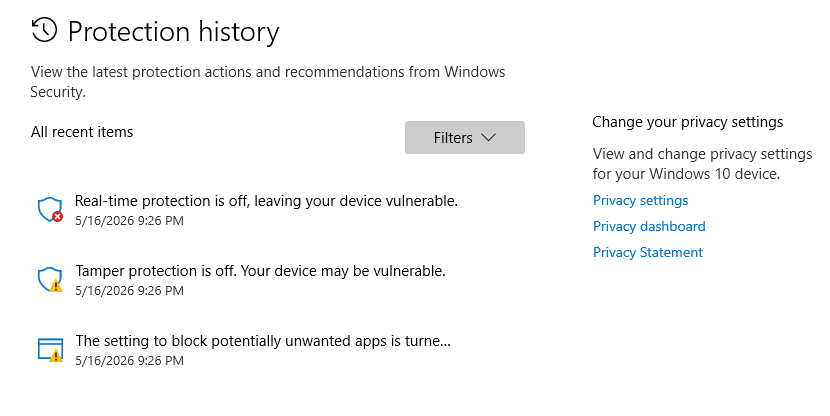

Trong Threat History, người dùng có thể xem lại:

- mối đe dọa đã phát hiện;
- thời điểm phát hiện;
- mức độ nghiêm trọng;
- hành động đã thực hiện;
- tệp hoặc vị trí liên quan;
- trạng thái hiện tại của mối đe dọa.

Threat History rất hữu ích khi cần kiểm tra xem trước đó hệ thống đã từng phát hiện malware hay chưa.

Trong điều tra bảo mật, Threat History giúp trả lời các câu hỏi như:

- malware được phát hiện khi nào;
- tệp độc hại nằm ở đâu;
- Windows đã xử lý mối đe dọa như thế nào;
- mối đe dọa đã bị xóa hay vẫn còn tồn tại;
- người dùng có cho phép mối đe dọa nào chạy hay không.


## 19.4. Quarantined Threats

**Quarantined Threats** là các mối đe dọa đã bị Windows Security cách ly.

Khi một tệp hoặc chương trình bị cách ly, nó không bị xóa ngay lập tức nhưng bị đưa vào trạng thái không thể hoạt động bình thường. Điều này giúp ngăn mối đe dọa tiếp tục gây hại cho hệ thống.

Cách ly thường được sử dụng khi Windows Security phát hiện:

- virus;
- trojan;
- spyware;
- ransomware;
- file thực thi đáng nghi;
- script độc hại;
- phần mềm có hành vi nguy hiểm.

Trong phần Quarantined Threats, người dùng có thể xem các mối đe dọa đã bị cách ly và chọn hành động tiếp theo, ví dụ:

- xóa khỏi hệ thống;
- khôi phục nếu đó là nhận diện nhầm;
- xem thêm thông tin chi tiết.

Không nên khôi phục tệp bị cách ly nếu không chắc chắn rằng tệp đó an toàn. Nếu cần khôi phục, nên kiểm tra kỹ nguồn gốc tệp và có thể quét lại bằng công cụ bảo mật khác.


## 19.5. Allowed Threats

**Allowed Threats** là danh sách các mối đe dọa hoặc tệp đáng nghi mà người dùng đã cho phép chạy trên hệ thống.

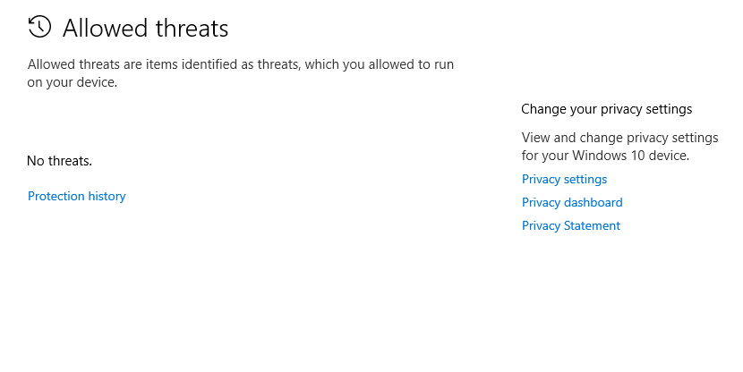

Khi một tệp bị Windows Security phát hiện là nguy hiểm hoặc đáng nghi, người dùng có thể chọn cho phép nếu tin rằng đó là nhận diện nhầm. Khi đó, tệp có thể xuất hiện trong danh sách Allowed Threats.

Tuy nhiên, đây là khu vực cần đặc biệt cẩn thận. Nếu người dùng cho phép nhầm một tệp độc hại, Windows Security có thể không tiếp tục chặn tệp đó.

Allowed Threats có thể tạo rủi ro nếu:

- người dùng không hiểu rõ tệp đã cho phép;
- malware bị nhận diện nhưng vẫn được cho chạy;
- kẻ tấn công lừa người dùng thêm tệp độc hại vào danh sách cho phép;
- phần mềm nguy hiểm bị bỏ qua trong các lần quét sau.

Trong kiểm tra bảo mật, cần xem lại danh sách Allowed Threats để đảm bảo không có tệp độc hại hoặc tệp không rõ nguồn gốc được cho phép nhầm.


## 19.6. Virus & Threat Protection Settings

**Virus & Threat Protection Settings** là phần cài đặt bảo vệ chống virus và mối đe dọa trong Windows Security.

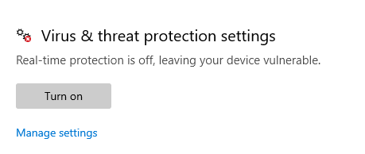

Tại đây, người dùng có thể cấu hình các tính năng bảo vệ quan trọng như:

- Real-Time Protection;
- Cloud-Delivered Protection;
- Automatic Sample Submission;
- Controlled Folder Access;
- Exclusions;
- Notifications;
- Ransomware Protection.

Các thiết lập này ảnh hưởng trực tiếp đến khả năng phát hiện và ngăn chặn malware của Windows Security.

Trong hầu hết trường hợp, người dùng nên giữ các tính năng bảo vệ chính ở trạng thái bật. Việc tắt hoặc cấu hình sai có thể làm giảm khả năng bảo vệ của hệ thống.

Trong môi trường doanh nghiệp, các thiết lập này thường được quản lý tập trung bằng Group Policy, Microsoft Intune, Microsoft Defender for Endpoint hoặc các giải pháp quản lý endpoint khác.


### 19.6.1. Real-Time Protection

**Real-Time Protection** là tính năng bảo vệ thời gian thực của Microsoft Defender Antivirus.

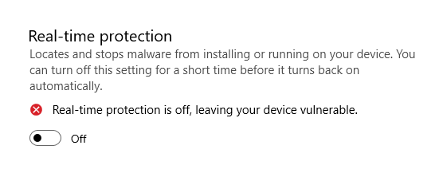

Khi tính năng này được bật, Windows Security sẽ liên tục giám sát hệ thống để phát hiện hoạt động đáng nghi hoặc tệp độc hại.

Real-Time Protection có thể kiểm tra:

- file khi được mở;
- file khi được tải xuống;
- chương trình khi được chạy;
- script đáng nghi;
- tiến trình có hành vi bất thường;
- một số thay đổi nguy hiểm trên hệ thống.

Đây là một trong những lớp bảo vệ quan trọng nhất của Windows Security. Nếu tắt Real-Time Protection, malware có thể có cơ hội chạy mà không bị phát hiện kịp thời.

Chỉ nên tắt Real-Time Protection trong trường hợp đặc biệt, ví dụ khi kiểm thử trong môi trường lab an toàn hoặc khi có yêu cầu kỹ thuật rõ ràng. Sau đó cần bật lại ngay.


### 19.6.2. Cloud-Delivered Protection

**Cloud-Delivered Protection** là tính năng bảo vệ dựa trên đám mây của Microsoft Defender.

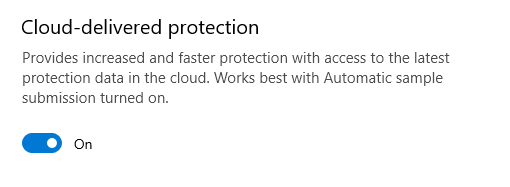

Khi bật tính năng này, Windows Security có thể sử dụng dữ liệu từ dịch vụ đám mây của Microsoft để phát hiện mối đe dọa nhanh hơn, đặc biệt là các malware mới hoặc chưa phổ biến.

Cloud-Delivered Protection giúp:

- cải thiện khả năng phát hiện malware mới;
- phản hồi nhanh hơn trước mối đe dọa;
- sử dụng thông tin bảo mật cập nhật từ Microsoft;
- hỗ trợ phân tích các tệp đáng nghi;
- tăng hiệu quả của Microsoft Defender Antivirus.

Tính năng này đặc biệt hữu ích vì nhiều malware hiện đại thay đổi rất nhanh. Nếu chỉ dựa vào chữ ký cục bộ trên máy, hệ thống có thể phản ứng chậm hơn.

Trong môi trường doanh nghiệp, Cloud-Delivered Protection thường được khuyến nghị bật nếu chính sách bảo mật và quyền riêng tư cho phép.


### 19.6.3. Automatic Sample Submission

**Automatic Sample Submission** là tính năng cho phép Windows Security tự động gửi mẫu tệp đáng nghi đến Microsoft để phân tích.

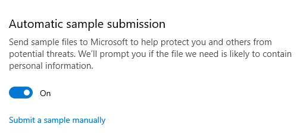

Khi Microsoft Defender phát hiện một tệp có dấu hiệu đáng ngờ nhưng chưa đủ thông tin để kết luận, hệ thống có thể gửi mẫu đó để kiểm tra thêm.

Tính năng này giúp:

- cải thiện khả năng phát hiện malware;
- hỗ trợ Microsoft phân tích mối đe dọa mới;
- tăng tốc độ cập nhật nhận diện;
- bảo vệ người dùng khác khỏi malware tương tự.

Tuy nhiên, trong một số môi trường doanh nghiệp, việc gửi mẫu tự động có thể liên quan đến chính sách bảo mật dữ liệu. Vì vậy, tổ chức cần cấu hình tính năng này phù hợp với yêu cầu nội bộ.

Đối với người dùng cá nhân, nên bật Automatic Sample Submission để tăng khả năng bảo vệ, trừ khi có lý do riêng về quyền riêng tư hoặc dữ liệu nhạy cảm.


### 19.6.4. Controlled Folder Access

**Controlled Folder Access** là tính năng giúp bảo vệ các thư mục quan trọng khỏi việc bị thay đổi trái phép bởi ứng dụng không đáng tin cậy.

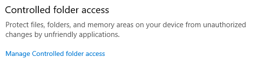

Tính năng này đặc biệt hữu ích trong việc chống ransomware. Ransomware thường cố gắng mã hóa tài liệu, hình ảnh, dữ liệu cá nhân hoặc thư mục làm việc của người dùng. Controlled Folder Access giúp ngăn các ứng dụng không được phép thay đổi những thư mục được bảo vệ.

Các thư mục thường cần bảo vệ gồm:

- Documents;
- Pictures;
- Desktop;
- Downloads;
- thư mục dữ liệu công việc;
- thư mục chứa tài liệu quan trọng.

Khi Controlled Folder Access được bật, chỉ các ứng dụng được tin cậy mới có thể thay đổi nội dung trong thư mục được bảo vệ.

Nếu một ứng dụng hợp pháp bị chặn nhầm, người dùng có thể thêm ứng dụng đó vào danh sách cho phép. Tuy nhiên, cần kiểm tra kỹ trước khi cho phép ứng dụng truy cập thư mục được bảo vệ.


### 19.6.5. Exclusions

**Exclusions** là danh sách loại trừ trong Windows Security. Các tệp, thư mục, tiến trình hoặc loại file được thêm vào Exclusions sẽ không bị Microsoft Defender quét hoặc giám sát theo cách thông thường.

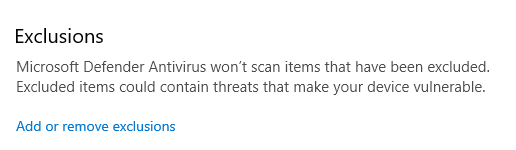

Exclusions có thể được sử dụng trong một số trường hợp hợp pháp, ví dụ:

- phần mềm nội bộ bị nhận diện nhầm;
- thư mục chứa file lab bảo mật;
- môi trường phát triển phần mềm;
- công cụ kiểm thử được phép sử dụng;
- thư mục có nhiều file tạm gây ảnh hưởng hiệu suất.

Tuy nhiên, Exclusions là khu vực có rủi ro cao. Nếu thêm sai thư mục hoặc file vào danh sách loại trừ, malware có thể lợi dụng vị trí đó để ẩn khỏi antivirus.

Không nên thêm các thư mục sau vào Exclusions nếu không có lý do rõ ràng:

- `C:\Users\<user>\Downloads`;
- `C:\Users\<user>\AppData`;
- `C:\Windows`;
- `C:\Windows\System32`;
- toàn bộ ổ `C:\`.

Trong điều tra bảo mật, cần kiểm tra danh sách Exclusions vì kẻ tấn công có thể cố gắng thêm đường dẫn độc hại vào đây để tránh bị phát hiện.


### 19.6.6. Notifications

**Notifications** là phần cài đặt thông báo của Windows Security.

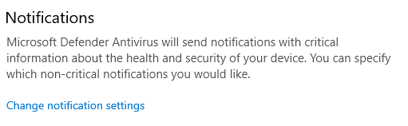

Thông báo giúp người dùng biết khi có vấn đề bảo mật xảy ra, ví dụ:

- phát hiện malware;
- đã cách ly mối đe dọa;
- cần quét hệ thống;
- tính năng bảo vệ bị tắt;
- firewall có vấn đề;
- cần thực hiện hành động bảo mật.

Thông báo bảo mật rất quan trọng vì nếu người dùng không nhìn thấy cảnh báo, họ có thể không biết hệ thống đang gặp rủi ro.

Trong môi trường cá nhân, nên bật thông báo quan trọng của Windows Security để kịp thời xử lý khi có mối đe dọa.

Trong môi trường doanh nghiệp, thông báo trên máy người dùng có thể được kết hợp với cảnh báo tập trung gửi về hệ thống quản lý bảo mật, EDR hoặc SIEM.


## 19.7. Ransomware Protection

**Ransomware Protection** là nhóm tính năng giúp bảo vệ dữ liệu khỏi ransomware.

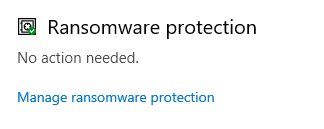

Ransomware là loại malware mã hóa tệp của nạn nhân và yêu cầu tiền chuộc để khôi phục dữ liệu. Đây là một trong những mối đe dọa nghiêm trọng đối với cả người dùng cá nhân và doanh nghiệp.

Trong Windows Security, Ransomware Protection thường liên quan đến:

- Controlled Folder Access;
- bảo vệ thư mục quan trọng;
- quản lý ứng dụng được phép truy cập thư mục;
- khôi phục dữ liệu nếu có tích hợp với dịch vụ sao lưu phù hợp.

Để tăng khả năng chống ransomware, nên:

- bật Controlled Folder Access nếu phù hợp;
- không mở file đính kèm đáng nghi;
- không chạy phần mềm không rõ nguồn gốc;
- cập nhật Windows thường xuyên;
- sao lưu dữ liệu quan trọng;
- không lưu bản sao lưu duy nhất trên cùng máy;
- kiểm tra cảnh báo từ Windows Security.

Ransomware Protection không thay thế hoàn toàn việc sao lưu dữ liệu. Sao lưu ngoại tuyến hoặc sao lưu trên hệ thống được bảo vệ vẫn là biện pháp rất quan trọng.


## 19.8. Lưu ý bảo mật khi cấu hình Antivirus

Khi cấu hình antivirus trong Windows Security, cần đảm bảo rằng các tính năng bảo vệ chính được bật và không tạo ra lỗ hổng do cấu hình sai.

Một số lưu ý quan trọng gồm:

- không tắt Real-Time Protection nếu không có lý do rõ ràng;
- nên bật Cloud-Delivered Protection để tăng khả năng phát hiện mối đe dọa mới;
- cẩn thận khi cấu hình Exclusions;
- không cho phép tệp bị phát hiện là độc hại nếu chưa kiểm tra kỹ;
- thường xuyên xem Threat History;
- kiểm tra Quarantined Threats và Allowed Threats;
- bật Ransomware Protection nếu phù hợp;
- cập nhật Windows và Microsoft Defender thường xuyên;
- không bỏ qua cảnh báo màu đỏ hoặc màu vàng trong Windows Security.

Trong môi trường doanh nghiệp, cấu hình antivirus nên được quản lý tập trung và có chính sách rõ ràng. Người dùng thông thường không nên tự ý tắt bảo vệ hoặc thêm exclusion nếu không được phép.

Từ góc độ SOC, cần giám sát các sự kiện liên quan đến antivirus như:

- Real-Time Protection bị tắt;
- phát hiện malware;
- malware bị cách ly;
- threat được allow;
- exclusion mới được thêm;
- nhiều cảnh báo xảy ra trên cùng một máy;
- ransomware protection bị vô hiệu hóa.

Tóm lại, Virus & Threat Protection là một lớp bảo vệ quan trọng của Windows. Nếu được cấu hình đúng, nó giúp giảm nguy cơ nhiễm malware, hỗ trợ phát hiện tấn công và bảo vệ dữ liệu người dùng.


