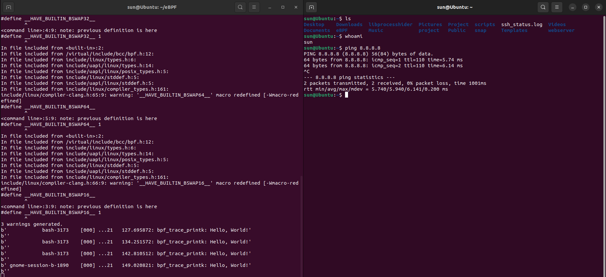
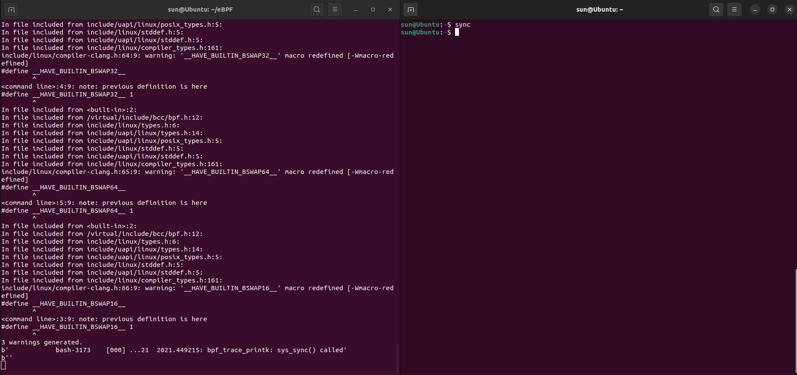
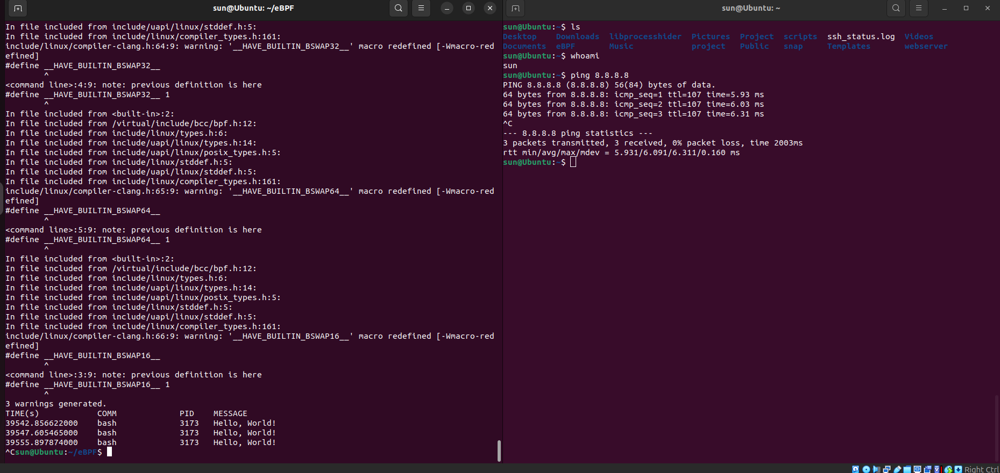
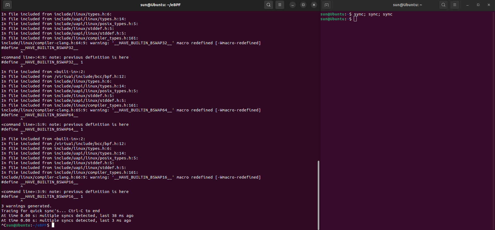

>Phần này hướng dẫn phát triển các công cụ và chương trình bcc sử dụng python gồm khả năng quan sát và mạng.

# Observability

## 1. Hello World

**code file hello_world.py**

```python
from bcc import BPF
BPF(text='int kprobe__sys_clone(void *ctx) { bpf_trace_printk("Hello, World!\\n"); return 0; }').trace_print()
```

**Giải thích code**

1. ```from bcc import BPF```: Import class BPF từ framework BCC, BPF dùng để:

- Biên dịch code eBPF C;

- Nạp chương trình eBPF vào kernel;

- Attach eBPF vào hook;

- Đọc output từ kernel;

2. ```text='...'```: Phần này dùng để định nghĩa một chương trình BPF nội tuyến. Chương trình được viết bằng ngôn ngữ C.

3. ```kprobe__sys_clone()```: Đây là hàm eBPF, ```kprobe__sys_clone``` nghĩa là gắn eBPF vào kernel function ```sys_clone```. Khi hệ thống gọi `sys_clone()` để tạo `process/thread` mới, hàm này sẽ chạy

4. ```void *ctx```: `ctx` là tham số, tuy nhiên trong trường hợp này chúng ta chưa sử dụng đến, nên chúng ta chỉ cần ép kiểu nó thành ```void *```

5. `bpf_trace_printk()`: Đây là hàm đơn giản để eBPF in thông tin debug ra file ```/sys/kernel/debug/tracing/trace_pipe```.
Nhưng nó có những hạn chế: 
- chỉ hỗ trợ tối đa 3 tham số nên dùng nhiều biến sẽ không phù hợp;
- chỉ hỗ trợ 1 `%&` nên sẽ không phù hợp để in nhiều chuỗi cùng một dòng;
- `trace_pipe` là tài nguyên dùng chung toàn hệ thống, nếu nhiều chương trình eBPF cùng ghi log, ouput có thể bị lẫn với nhau;
- không phù hợp cho collector nghiêm túc, vì output không có cấu trúc rõ ràng, khó parse thành JSON/event
- nên dùng `BPF_PERF_OUTPUT()`

6. ```return 0;```: thủ tục kết thúc chương trình.
7. ```.trace_print()```: Hàm bcc đọc trace_pipe và in ra kết quả


**Thực thi**

```bash
sudo python3 hello_world.py
```

Sau đó mở 1 terminal khác và thực thi các lệnh tạo process




## 2. sys_sync()

Viết một chương trình theo dõi hàm kernel sys_sync(). In ra "sys_sync() called" khi chương trình chạy. Kiểm tra bằng cách chạy lệnh sync trong một phiên khác trong khi đang theo dõi.in ra "Tracing sys_sync()... Ctrl-C to end." khi chương trình bắt đầu

**Code cho file sync_trace.py**

```python
from bcc import BPF

print("Tracing sys_sync()... Ctrl-C to end.")

BPF(text="""
int kprobe__sys_sync(void *ctx)
{
    bpf_trace_printk("sys_sync() called\\n");
    return 0;
}
""").trace_print()
```

**Thực thi**



## 3. Hello fields

Đây là chương trình tách các trường như thời gian, tên process, PID, message rồi in thành bảng.

**Code cho file hello_fields.py**

```python
from bcc import BPF
from bcc.utils import printb

# define BPF program
prog = """
int hello(void *ctx) {
    bpf_trace_printk("Hello, World!\\n");
    return 0;
}
"""

# load BPF program
b = BPF(text=prog)
b.attach_kprobe(event=b.get_syscall_fnname("clone"), fn_name="hello")

# header
print("%-18s %-16s %-6s %s" % ("TIME(s)", "COMM", "PID", "MESSAGE"))

# format output
while 1:
    try:
        (task, pid, cpu, flags, ts, msg) = b.trace_fields()
    except ValueError:
        continue
    except KeyboardInterrupt:
        exit()
    printb(b"%-18.9f %-16s %-6d %s" % (ts, task, pid, msg))
```

**Giải thích code**

1. `from bcc.utils import printb`: import BCC, pirntb dùng để in dữ liệu dạng `bytes`, vì output từ BCC thường là bytes.
2. `prog =`: Khai báo chương trình C dưới dạng một biến, và sau đó tham chiếu đến nó, dùng để thêm một phép thay thế chuỗi dựa trên các đối số.
3. `hello()`: 
- khai báo một hàm C thay vì sử dụng cú pháp viết tắt `kpobe__`;
- tất cả các hàm C được khai báo trong chương trình BPF đều được kỳ vọng sẽ được thực thi khi có sự kiện thăm dò, do đó chúng đều cần nhận một con trỏ pt_reg* ctx làm đối số đầu tiên;
- Nếu cần định nghĩa một số hàm trợ giúp mà không được thực thi khi có sự kiện thăm dò, chúng cần được định nghĩa là static inline để trình biên dịch có thể gọi nội tuyến;
- hàm này sẽ chạy khi hook được kích hoạt.
4. `b = BPF(text=prog)`: BCC biên dịch code C trong biến `prog`, nạp chương trình eBPF vào kernel.
5. `b.attach_kprobe(event=b.get_syscall_fnname("clone"), fn_name="hello")`
- gắn hàm eBPF `hello()`vào syscall `clone`, `clone` là syscall dùng để tạo process/thread mới. Đơn giản là khi `clone()` được gọi thì hàm `hello()` chạy;
- `b.get_syscall_fnname("clone")`: giúp BCC tự tìm đúng tên hàm syscall trên kernel hiện tại;
- chúng ta có thể gọi `attach_kprobe()` nhiều laanmf và gắn hàm C của mình vào nhiều hàm nhân bản khác nhau;
- `fn_name="hello"`: nghĩa là khi syscall `clone()` được gọi, thì sẽ chạy hàm eBPF là `hello()`, hàm này được định nghĩa trong code C;
- luồng chạy như sau:
```bash
Process tạo process/thread mới
        ↓
gọi syscall clone()
        ↓
kernel chạy hàm clone tương ứng
        ↓
kprobe được kích hoạt
        ↓
eBPF function hello() chạy
        ↓
in "Hello, World!" vào trace_pipe
```
6. `print("%-18s %-16s %-6s %s" % ("TIME(s)", "COMM", "PID", "MESSAGE"))`
- dùng để in tiêu đề bảng theo format cố định;
- chuỗi định dạng bảng:

| Phần    | Ý nghĩa                                      |
| ------- | -------------------------------------------- |
| `%s`    | in dữ liệu kiểu string                       |
| `%-18s` | in string, căn trái, chiếm 18 ký tự          |
| `%-16s` | in string, căn trái, chiếm 16 ký tự          |
| `%-6s`  | in string, căn trái, chiếm 6 ký tự           |
| `%s`    | in string bình thường, không cố định độ rộng |

7. `while 1`: tạo vòng lặp vô hạn, tương đương với `while true`.
8. `(task, pid, cpu, flags, ts, msg) = b.trace_fields()`
- đọc một dòng output từ `trace_pipe`, rồi tách các trường, sau đó trả về các giá trị `task, pid, cpu, flags, ts, msg`;
- ý nghĩa các trường:

| Biến    | Ý nghĩa                               |
| ------- | ------------------------------------- |
| `task`  | tên process gây ra event              |
| `pid`   | PID của process                       |
| `cpu`   | CPU core xử lý event                  |
| `flags` | cờ tracing nội bộ                     |
| `ts`    | timestamp, thời điểm event xảy ra     |
| `msg`   | message do `bpf_trace_printk()` in ra |

9. 

```
except ValueError:
    continue
```

- nếu `b.trace_fields()` không tách được dòng trace thành đúng 6 trường, nó sẽ gây lỗi ValueError, khi đó `continue` sẽ bỏ qua dòng lỗi đó và quay lại đầu vòng lặp để đọc dòng tiếp theo.

10. 

```
except KeyboardInterrupt:
    exit()
```
- khi sử dụng tổ hợp phím `Ctr +C` python sẽ sinh ra lỗi KeyboardInterrupt, câu lệnh này bắt lỗi đó và thoát chương trình gọn gàng.

11. `printb(b"%-18.9f %-16s %-6d %s" % (ts, task, pid, msg))`
- in event ra terminal bằng printb
- format:

| Phần      | Ý nghĩa                                                    |
| --------- | ---------------------------------------------------------- |
| `%-18.9f` | in số thực, căn trái, rộng 18 ký tự, 9 chữ số sau dấu chấm |
| `%-16s`   | in string/bytes, căn trái, rộng 16 ký tự                   |
| `%-6d`    | in số nguyên, căn trái, rộng 6 ký tự                       |
| `%s`      | in string/bytes bình thường                                |

**Thực thi**



## 4. sync_timing

`sync` dùng để ghi dữ liệu đang nằm trong bộ nhớ đệm xuống ổ đĩa
Dùng trong các trường hợp:
- trước khi tắt máy hoặc reboot thủ công;
- trước khi rút USB/ổ ngoài;
- sau khi copy file lớn;
- khi muốn chắc chắn dữ liệu đã được flush xuống disk.
`sync` nhiều lần liên tiếp có thể gây tăng I/O và làm chậm hệ thống.
Chương trình này dùng để phát hiện khi lệnh `sync()` được gọi nhiều lần liên tiếp quá nhanh.

**Code cho file sync_timing.py**

```python
from __future__ import print_function
from bcc import BPF
from bcc.utils import printb

# load BPF program
b = BPF(text="""
#include <uapi/linux/ptrace.h>

BPF_HASH(last);

int do_trace(struct pt_regs *ctx) {
    u64 ts, *tsp, delta, key = 0;

    // attempt to read stored timestamp
    tsp = last.lookup(&key);
    if (tsp != NULL) {
        delta = bpf_ktime_get_ns() - *tsp;
        if (delta < 1000000000) {
            // output if time is less than 1 second
            bpf_trace_printk("%d\\n", delta / 1000000);
        }
        last.delete(&key);
    }

    // update stored timestamp
    ts = bpf_ktime_get_ns();
    last.update(&key, &ts);
    return 0;
}
""")

b.attach_kprobe(event=b.get_syscall_fnname("sync"), fn_name="do_trace")
print("Tracing for quick sync's... Ctrl-C to end")

# format output
start = 0
while 1:
    try:
        (task, pid, cpu, flags, ts, ms) = b.trace_fields()
        if start == 0:
            start = ts
        ts = ts - start
        printb(b"At time %.2f s: multiple syncs detected, last %s ms ago" % (ts, ms))
    except KeyboardInterrupt:
        exit()
```

**Luồng hoạt đông**

```bash
Chạy chương trình Python
        ↓
BCC nạp eBPF vào kernel
        ↓
Attach do_trace vào syscall sync()
        ↓
Lần sync đầu tiên: lưu timestamp
        ↓
Lần sync tiếp theo: so với timestamp cũ
        ↓
Nếu cách nhau < 1 giây: in số ms
        ↓
Python đọc số ms và in cảnh báo
```

**Giải thích code**

1. `#include <uapi/linux/ptrace.h>` dùng để khai báo kiểu `struct pt_regs`, ở đây hàm eBPF nhận tham số `struct pt_regs *ctx`; `ctx` chứa context khi kernel function bị kprobe bắt.
2. `BPF_HASH(last);`:
- tạo một BPF map kiểu hast tên là `last`;
- map này dùng để lưu thời điểm lần gọi `sync()` trước đó;
- chúng ta không chỉ định thêm bất kỳ đối số nào, vì vậy nó mặc định sử dụng kiểu key/value là u64.
- `u64`: unsigned 64-bit interger, tức là số nguyên không âm, kích thước 64 bit.
3. `u64 ts, *tsp, delta, key = 0;`: khai báo biến
- `ts`: thời gian hiện tại;
- `*tsp`: con trỏ trỏ tới timestamp cũ lấy từ map;
- `delta`: khoảng cách giữa 2 lần gọi `sync()`;
- `key = 0`: chúng ta chỉ lưu trữ một cặp `key/value` trong bảng hash, trong đó key được cố định bằng 0, vì chương trình chỉ cần nhớ một giá trị thời gian gần nhất, không cần lưu theo từng PID.
4. `tsp = last.lookup(&key);`: đọc timestamp cũ từ map
- tìm trong map `last` xem `key 0` đã có timestamp chưa;
- nếu chưa từng có `sync()` trước đó, trả về null: `tsp == NULL`;
- nếu đã có timestamp cũ, trả về con trỏ đến giá trị đã tồn tạ: `tsp != NULL`.
5. `if (tsp != NULL) {`: Kiểm tra null
- eBPF verifier bắc buộc phải kiểm tra con trỏ trả về từ map lookup trước khi dùng;
- không được dùng trực tiếp `*tsp` nếu chưa chắc `tsp != NULL`.
6. `delta = bpf_ktime_get_ns() - *tsp;`: tính khoảng cách thời gian
- hàm `bpf_ktime_get_ns()` trả về thời gian hiện tại tính bằng nanosecond;
- `*tsp` là timestamp lần `sync()` trước, vậy delta = thời gian hiện tại - thời gian lần sync trước.
7. `if (delta < 1000000000) {`: kiểm tra delta có nhỏ hơn 1 giây không
- 1 giây = 1,000,000,000 nanosecond;
- nếu delta < 1000000000, nghĩa là `sync()` được gọi lại trong vòng dưới 1 giây.
8. `bpf_trace_printk("%d\\n", delta / 1000000);`: in số millisencond
- delta đang là nanosecond, cần chia 1000000 để đổi sang millisecond;
- `1 ms = 1000000 ns`
9. `last.delete(&key);`: xóa timestamp cũ
- xóa key khỏi hash, nghĩa là xóa giá trị cũ trong map, sau đó chương trình sẽ ghi timestamp mới;
- việc này cần thiết do lỗi nhân hệ điều hành trong phương thức `.update(), tuy nhiên đã được khắc phục trong phiên bản 4.8.10.
10. 
```c
ts = bpf_ktime_get_ns();
last.update(&key, &ts);
```
- lưu timestamp mới;
- lấy thời gian hiện tại và lưu vào map, nhờ vậy `sync()` tiếp theo sẽ so sánh với lần này.
11. `b.attach_kprobe(event=b.get_syscall_fnname("sync"), fn_name="do_trace")`: attach vào syscall `sync`
- nghĩa là khi kernel gọi syscall `sync()`, hãy chạy hàm eBPF `do_trace()`;
- `b.get_syscall_fnname("sync")` giúp BCC tự tìm kernel function thât của syscall `sync`.
12. `(task, pid, cpu, flags, ts, ms) = b.trace_fields()`: đọc một dòng trace
- `b.trace_fields()` đọc output từ trace buffer và tách thành các trường:
```bash
task  : tên process
pid   : PID
cpu   : CPU xử lý event
flags : trace flags
ts    : timestamp
ms    : message từ bpf_trace_printk()
```

**Thực thi**

